## **سربارگذاری عملگر در سی شارپ به همراه مثال:**

در این مقاله، قصد دارم در مورد **سربارگذاری عملگرها در سی شارپ** با مثال‌ها صحبت کنم. با سربارگذاری عملگرها، می‌توانیم به عملگرهایی مانند +-\*/=.،= و غیره، که به طور پیش‌فرض قرار است فقط با انواع داده‌های استاندارد مانند int، float، char، void و غیره کار کنند، معنای بیشتری بدهیم. این نوعی چندریختی است که در آن یک عملگر سربارگذاری می‌شود تا معنای تعریف شده توسط کاربر را به آن بدهد.

##### **سربارگذاری عملگر در سی شارپ چیست؟**

در سی شارپ، می‌توان کاری کرد که عملگرها با انواع داده‌های تعریف‌شده توسط کاربر مانند کلاس‌ها کار کنند. این بدان معناست که سی شارپ این قابلیت را دارد که برای یک نوع داده، معنای خاصی به عملگرها ارائه دهد، این قابلیت به عنوان سربارگذاری عملگر شناخته می‌شود. برای مثال، می‌توانیم عملگر + را در کلاسی مانند String سربارگذاری کنیم تا بتوانیم دو رشته را تنها با استفاده از + به هم متصل کنیم.

با استفاده از سربارگذاری عملگر در سی شارپ می‌توانیم بیش از یک معنی برای یک عملگر در یک محدوده مشخص کنیم. هدف از سربارگذاری عملگر، ارائه یک معنی خاص از یک عملگر برای یک نوع داده تعریف شده توسط کاربر است.

##### **سینتکس سربارگذاری عملگر در سی شارپ:**

برای سربارگذاری یک عملگر در سی شارپ، از یک تابع عملگر ویژه استفاده می‌کنیم. تابع را درون کلاس یا ساختاری که می‌خواهیم عملگر سربارگذاری شده با اشیاء/متغیرهای آن کار کند، تعریف می‌کنیم. سینتکس سربارگذاری عملگر در سی شارپ در زیر نشان داده شده است.

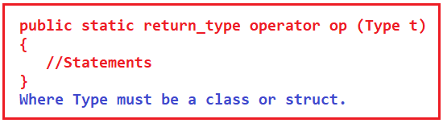

اینجا،

1. نوع بازگشتی، نوع مقدار برگشتی تابع است.
2. عملگر یک کلمه کلیدی است.
3. Op نماد عملگری است که می‌خواهیم سربارگذاری کنیم. مانند: +، <، -، ++ و غیره.
4. نوع داده باید یک کلاس یا ساختار باشد. همچنین می‌تواند پارامترهای بیشتری داشته باشد.
5. باید یک تابع استاتیک باشد.

##### **سربارگذاری عملگر در سی شارپ**

ما عملگرهایی برای انجام جمع (+)، ضرب (\*)، تفریق (-)، عملگر افزایش و کاهش (++، –) و غیره داریم. این بدان معناست که برای انجام انواع مختلف کارها، عملگرهایی در C# وجود دارد. و این عملگرها برای برخی از انواع داده خاص در نظر گرفته شده‌اند. جدول زیر قابلیت سربارگذاری عملگرهای مختلف موجود در C# را شرح می‌دهد:

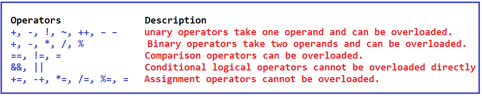

تصویر بالا برخی از عملگرهای داخلی را نشان می‌دهد و این عملگرها روی انواع داده‌های داخلی یا انواع داده‌های اولیه موجود در C# عمل می‌کنند. مثلاً جمع را می‌توان روی اعداد صحیح، اعشاری و غیره انجام داد. اگر نوع داده خودمان را تعریف کنیم، مثلاً اگر یک کلاس ماتریس بنویسیم.

**کلاس ماتریس {**  
**…**  
**}**

آیا می‌توانیم از عملگر + برای جمع دو ماتریس استفاده کنیم و نتیجه را در شیء دیگری از نوع ماتریس (C = A + B) ذخیره کنیم؟ بنابراین، آیا می‌توانیم عملگر + را برای کلاس ماتریس سربارگذاری کنیم؟ بله، عملگر + را می‌توان برای کلاس ماتریس سربارگذاری کرد.

بنابراین، برای نوع داده خودمان که یک نوع داده تعریف شده توسط کاربر است، می‌توانیم عملگر + را سربارگذاری کنیم. عملگرهای مختلفی وجود دارند که می‌توانید در سی شارپ سربارگذاری کنید. بنابراین، بیایید یاد بگیریم که چگونه این عملگرها را سربارگذاری کنیم.

##### **مثال‌هایی برای درک سربارگذاری عملگر در سی شارپ**

برای درک مفهوم سربارگذاری عملگر در سی شارپ، مثالی از یک عدد مختلط می‌زنیم. در ریاضیات، یک عدد مختلط داریم که به شکل **a + ib** نوشته می‌شود ، همانطور که در تصویر زیر نشان داده شده است.

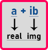

در اینجا a بخش حقیقی و ib بخش موهومی است. موهومی چیست؟ در اینجا، i جذر عدد -1 است.

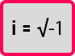

جذر عدد منفی یک تعریف نشده است. بنابراین، آن را موهومی (i) می‌نامیم. هر عددی که در یک عدد موهومی ضرب شود، به یک عدد موهومی تبدیل می‌شود. در اینجا، a یک عدد صحیح یا اعشاری و ib موهومی است. اگر دو عدد مختلط داشته باشیم، می‌توانیم با جمع کردن قسمت حقیقی و قسمت موهومی آنها به طور جداگانه، آنها را جمع کنیم. به عنوان مثال، اگر **3 + 7i** و **5 + 2i** خواهیم داشت **داشته باشیم، پس از جمع، 8 + 9i** . ما این را از جمع دو عدد مختلط به دست آورده‌ایم.

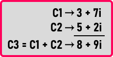

بله، ما می‌توانیم در ریاضیات روی دو عدد مختلط جمع انجام دهیم. همان چیزی که می‌خواهیم به صورت برنامه‌نویسی به آن دست یابیم، پس می‌خواهیم عملگر + را سربارگذاری کنیم. بنابراین بیایید یک کلاس برای یک عدد مختلط مانند زیر بنویسیم و ببینیم چگونه می‌توانیم عملگر + را سربارگذاری کنیم.

```csharp
public class Complex
{
    private int real;
    private int img;
    public Complex(int r = 0, int i = 0)
    {
        real = r;
        img = i;
    }
};
```

در اینجا، ما یک کلاس به نام Complex ایجاد کرده‌ایم. درون کلاس Complex، دو عضو داده خصوصی از نوع عدد صحیح به نام‌های real و img ایجاد کرده‌ایم. سپس یک سازنده پارامتری به صورت public ایجاد کرده‌ایم. می‌توانیم دو مقدار عدد صحیح را به عنوان پارامتر به سازنده ارسال کنیم و سازنده آن مقادیر عدد صحیح را به اعضای داده خصوصی real و img کلاس اختصاص می‌دهد.

ما همچنین تعدادی مقادیر پیش‌فرض برای آرگومان‌های سازنده ارائه کرده‌ایم تا اگر کاربر هیچ مقداری ارسال نکند، سازنده به طور خودکار به اعضای داده real و img مقدار 0 را اختصاص دهد. این سازنده هم به عنوان یک سازنده پارامتری و هم به عنوان یک سازنده بدون پارامتر کار خواهد کرد.

حالا بیایید عملگر + را سربارگذاری کنیم. برای یادگیری سربارگذاری عملگرها باید دو چیز را یاد بگیریم. اول، نحوه نوشتن یک تابع، و دوم، امضای یک تابع چه باید باشد. امضای یک تابع را بعداً به شما نشان خواهیم داد، ابتدا، بیایید ببینیم چگونه یک تابع بنویسیم.

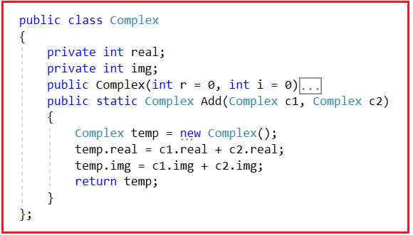

اینجا درون کلاس Complex، تابع Add را نوشته‌ایم و نوع بازگشتی این تابع Complex است. این تابع مقادیر real و img دو شیء Complex را با هم جمع می‌کند. حالا تابع main را به صورت زیر می‌نویسیم:

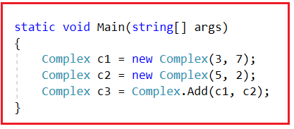

در اینجا درون تابع main، دو شیء C1 و C2 از کلاس Complex ایجاد کرده‌ایم. C1 مقادیر ۳ و ۷ و C2 مقادیر ۵ و ۲ را خواهد داشت. سپس تابع Add را با ارسال اشیاء C1 و C2 فراخوانی کرده‌ایم و از آنجایی که این متد یک شیء از نوع Complex را برمی‌گرداند، آن شیء را در متغیر مرجع C3 ذخیره می‌کنیم.

##### **تابع Add چگونه کار می‌کند؟**

حالا بیایید بفهمیم که تابع add چگونه کار می‌کند.  
**مجتمع c3 = Complex.Add(c1, c2);**

در عبارت بالا، ما تابع استاتیک Add را با استفاده از نام کلاس و با ارسال C1 و C2 به عنوان پارامتر فراخوانی کردیم. به محض اینکه متد Add را فراخوانی کردیم، متد Add شروع به اجرای کد به صورت زیر می‌کند. درون تابع Add، ما با اجرای عبارت زیر، یک شیء پیچیده موقت ایجاد می‌کنیم.  
**تابع مختلط temp = new تابع مختلط();**

سپس، دستور زیر را اجرا می‌کنیم.  
**temp.real = c1.real + c2.real;**

این دستور جمع مقادیر real مربوط به C1 و real مربوط به C2 را در real مربوط به temp ذخیره می‌کند. سپس، دستور زیر اجرا خواهد شد.  
**فایل temp.img = c1.img + c2.img;**

دستور بالا جمع مقادیر img مربوط به C1 و img مربوط به C2 را در img مربوط به temp ذخیره می‌کند. در نهایت، با اجرای دستور return زیر، شیء temp را از متد Add برمی‌گردانیم.  
**دمای برگشتی؛**

سپس شیء temp را از تابع برگردانده‌ایم. می‌توانیم عبارت فوق را با کمک نمودار زیر درک کنیم.

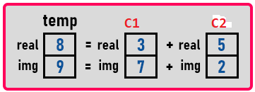

این نمودار نشان می‌دهد که ما نتیجه جمع C1 و C2 را در متغیر temp که از نوع Complex است ذخیره کرده‌ایم. متغیر temp توسط تابع Add برگردانده می‌شود. بنابراین درون تابع main، ما فقط داده‌های temp را در شیء C3 ذخیره می‌کنیم. برای درک بهتر، لطفاً به تصویر زیر نگاهی بیندازید.

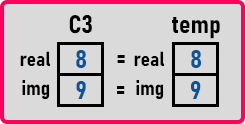

بنابراین، اینگونه است که جمع دو عدد مختلط در سی شارپ انجام می‌شود. بنابراین، این منطق مهم است. نحوه نوشتن یک تابع مهم است.

##### **مثال کامل برای جمع دو عدد مختلط در سی شارپ:**

```csharp
using System;

namespace OperatorOverloadingDemo
{
    class Program
    {
        static void Main(string[] args)
        {
            Complex c1 = new Complex(3, 7);
            c1.Display();
            Complex c2 = new Complex(5, 2);
            c2.Display();
            Complex c3 = Complex.Add(c1, c2);
            c3.Display();
            Console.ReadKey();
        }
    }

    public class Complex
    {
        private int real;
        private int img;
        public Complex(int r = 0, int i = 0)
        {
            real = r;
            img = i;
        }
        public static Complex Add(Complex c1, Complex c2)
        {
            Complex temp = new Complex();
            temp.real = c1.real + c2.real;
            temp.img = c1.img + c2.img;
            return temp;
        }
        public void Display()
        {
            Console.WriteLine($"{real} + i{img}");
        }
    };
}
```

###### **خروجی:**

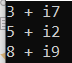

درک منطق مهمترین چیز است. خب، کارمان تمام شد. حالا ببینیم چطور می‌توانیم آن را به صورت سربارگذاری عملگر بسازیم. حالا می‌خواهیم تابع Add را به یک عملگر تبدیل کنیم. بنابراین، به جای نوشتن **Complex c3 = Complex.Add(c1, c2);،** می‌خواهیم بنویسیم **Complex c3 = C2 + C1;**

بنابراین، برای نوشتن به این شکل، باید امضای تابع را به صورت زیر تغییر دهیم:

**عملگر مختلط استاتیک عمومی +(مختلط c1، مختلط c2){}**

در اینجا، ما فقط **کلمه Add** را با **عملگر +** جایگزین می‌کنیم . برای درک بهتر، لطفاً به تصویر زیر نگاهی بیندازید.

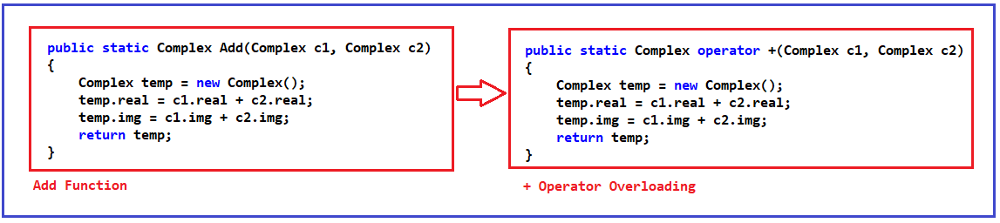

همه چیز درون تابع به همان شکل باقی خواهد ماند. با اعمال تغییرات فوق، اکنون عملگر + برای کلاس Complex سربارگذاری شده است. این همان سربارگذاری عملگر در سی شارپ است. بنابراین به جای نوشتن نقطه (.)، می‌توانید فقط '+' بنویسید تا حاصل جمع دو شیء Complex را به دست آورید. حال بیایید به برنامه کامل سربارگذاری عملگر در سی شارپ نگاهی بیندازیم.

##### **مثال برای جمع دو عدد مختلط در سی شارپ با استفاده از سربارگذاری عملگر:**

```csharp
using System;

namespace OperatorOverloadingDemo
{
    class Program
    {
        static void Main(string[] args)
        {
            Complex c1 = new Complex(3, 7);
            c1.Display();
            Complex c2 = new Complex(5, 2);
            c2.Display();
            Complex c3 = c1 + c2;
            c3.Display();
            Console.ReadKey();
        }
    }

    public class Complex
    {
        private int real;
        private int img;
        public Complex(int r = 0, int i = 0)
        {
            real = r;
            img = i;
        }
        public static Complex operator +(Complex c1, Complex c2)
        {
            Complex temp = new Complex();
            temp.real = c1.real + c2.real;
            temp.img = c1.img + c2.img;
            return temp;
        }
        public void Display()
        {
            Console.WriteLine($"{real} + i{img}");
        }
    };
}
```

###### **خروجی:**


**نکته:** در سی شارپ، توابع عملگر مانند توابع معمولی هستند. تنها تفاوت این است که نام یک تابع عملگر همیشه کلمه کلیدی عملگر و به دنبال آن نماد عملگر است و توابع عملگر زمانی فراخوانی می‌شوند که از عملگر مربوطه استفاده شود.