## **لغو متد در سی شارپ به همراه مثال**

در این مقاله، قصد دارم در مورد **Overriding متد در سی شارپ** با مثال صحبت کنم. در این مقاله، قصد داریم اشاره‌گرهای زیر را با مثال بررسی کنیم.

1. **منظور از Method Overriding در سی شارپ چیست؟**
2. **چه زمانی نیاز به override کردن یک متد در سی شارپ داریم؟**
3. **چه زمانی با یک متد زیرکلاس در سی شارپ به عنوان یک متد override شده رفتار می‌شود؟**
4. **چگونه یک متد در سی شارپ Override می‌شود؟**
5. **مثال‌های متعدد برای درک Override کردن متد در سی شارپ؟**
6. **چگونه می‌توان متد کلاس بالا را در صورت بازنویسی (override) شدن در کلاس زیرشاخه، اجرا کرد؟**
7. **مثال بلادرنگ از Override کردن متد در سی شارپ.**
8. **تفاوت‌های بین بارگذاری بیش از حد متد (Method Overloading) و نادیده گرفتن متد (Method Overriding) در سی شارپ چیست؟**

**نکته:** اصطلاحات Function Overriding و Method Overriding به جای یکدیگر استفاده می‌شوند. Method Overriding رویکردی برای پیاده‌سازی Polymorphism (یعنی Run-Time Polymorphism یا Dynamic Polymorphism) در سی‌شارپ است.

##### **منظور از Method Overriding در سی شارپ چیست؟**

فرآیند پیاده‌سازی مجدد متد غیر استاتیک، غیر خصوصی و غیر مهر و موم شده‌ی کلاس بالا در کلاس زیرین با همان امضا، در سی شارپ، لغو متد (Method Overriding) نامیده می‌شود. امضای یکسان به این معنی است که نام و پارامترها (نوع، تعداد و ترتیب پارامترها) باید یکسان باشند.

##### **چه زمانی نیاز به override کردن یک متد در سی شارپ داریم؟**

اگر منطق متد کلاس اصلی یا کلاس والد، الزامات تجاری کلاس فرعی یا کلاس فرزند را برآورده نکند، آنگاه کلاس فرعی یا کلاس فرزند باید متد کلاس اصلی را با منطق تجاری مورد نیاز، بازنویسی (override) کند. معمولاً در اکثر برنامه‌های بلادرنگ، متدهای کلاس والد با منطق عمومی پیاده‌سازی می‌شوند که برای همه کلاس‌های فرعی سطح بعدی رایج است.

##### **چه زمانی در سی شارپ با یک متد زیرکلاس به عنوان یک متد برتر رفتار می‌شود؟**

اگر متدی در کلاس زیرکلاس یا کلاس فرزند، امضایی مشابه با متد کلاس بالا (غیرخصوصی، غیراستاتیک و غیرمحافظ) داشته باشد، آنگاه متد کلاس زیرکلاس به عنوان متد overriding و متد کلاس بالاکلاس به عنوان متد overridden در نظر گرفته می‌شود.

##### **چگونه می‌توانیم در سی شارپ، متد کلاس والد را در کلاس فرزند بازنویسی (Override) کنیم؟**

اگر می‌خواهید متد کلاس والد را در کلاس‌های فرزند آن بازنویسی کنید، ابتدا باید متد در کلاس والد با استفاده از کلمه کلیدی virtual به عنوان virtual تعریف شود **،** سپس فقط کلاس‌های فرزند اجازه بازنویسی آن متد را دریافت می‌کنند. تعریف متد به عنوان virtual به معنای علامت‌گذاری متد به عنوان overrideable است. اگر کلاس فرزند بخواهد متد مجازی کلاس والد را بازنویسی کند، کلاس فرزند می‌تواند با کمک اصلاح‌کننده override آن را بازنویسی کند. اما بازنویسی متدهای مجازی کلاس والد در کلاس‌های فرزند اجباری نیست. سینتکس پیاده‌سازی Method Overriding در سی‌شارپ در زیر نشان داده شده است.

 کنیم؟")

همانطور که در تصویر بالا مشاهده می‌کنید، متد Show به عنوان یک متد مجازی (Virtual) در کلاس Class1 تعریف شده است. علاوه بر این، Class1 کلاس والد (Parent) برای Class2 و Class2 است. Class2 متد Show را بازنویسی می‌کند در حالی که class متد Show را بازنویسی نمی‌کند، زیرا بازنویسی متد مجازی درون کلاس فرزند اختیاری است.

فرض کنید، در روز تولدتان، والدینتان به شما یک تلفن همراه هدیه می‌دهند. سپس والدینتان به شما می‌گویند، اگر از آن خوشتان آمد، اشکالی ندارد، فقط از آن استفاده کنید. و اگر تلفن همراه را دوست نداشتید، می‌توانید آن را عوض کنید. بنابراین، اگر می‌خواهید آن را عوض کنید، صورتحساب را بگیرید، بروید و تلفن همراه را عوض کنید. بنابراین، شما دو گزینه دارید. اینها چیستند؟ گزینه اول، هر چه والدینتان به شما می‌دهند، فقط از آن استفاده می‌کنید. گزینه دوم، اگر آن را دوست نداشتید، بروید و هر چه دوست دارید را عوض کنید.

این دقیقاً مشابه override کردن متد است. شما یک متد در کلاس والد دارید و آن متد برای مصرف به کلاس فرزند داده می‌شود. حال، اگر کلاس فرزند بخواهد، کلاس فرزند می‌تواند متد را مصرف کند، در غیر این صورت کلاس فرزند می‌تواند متد را دوباره پیاده‌سازی کند یا متد را override کند. با تعریف متد والد به عنوان virtual، به کلاس‌های فرزند اجازه می‌دهد تا متد را override کنند و کلاس‌های فرزند می‌توانند با استفاده از اصلاح‌کننده override، متد را override کنند.

##### **مثالی برای درک Override کردن متد در سی شارپ**

بیایید مثالی برای درک مفهوم لغو متد (Method Override) در سی‌شارپ (C#) ببینیم. لطفاً به کد زیر نگاهی بیندازید. در اینجا کلاس Class1 کلاس والد است و در این کلاس، یک متد به نام Show() با استفاده از کلمه کلیدی virtual تعریف کرده‌ایم که این متد را در کلاس‌های فرزند قابل لغو شدن (overrideable) می‌کند. کلاس Class2 از کلاس Class1 مشتق شده است و از این رو به یک کلاس فرزند از کلاس Class1 تبدیل می‌شود و به محض اینکه به یک کلاس فرزند تبدیل می‌شود، اجازه لغو متد لغو شدنی Show() را پیدا می‌کند. همانطور که در کلاس فرزند مشاهده می‌کنید، ما متد Show را با استفاده از اصلاح‌کننده override لغو کرده‌ایم.

```csharp
using System;

namespace PolymorphismDemo
{
    class Class1
    {
        //Virtual Function (Overridable Method)
        public virtual void Show()
        {
            //Parent Class Logic Same for All Child Classes
            Console.WriteLine("Parent Class Show Method");
        }
    }

    class Class2 : Class1
    {
        //Overriding Method
        public override void Show()
        {
            //Child Class Reimplementing the Logic
            Console.WriteLine("Child Class Show Method");
        } 
    }
    
    class Program
    {
        static void Main(string[] args)
        {
            Class1 obj1 = new Class2();
            obj1.Show();

            Class2 obj2 = new Class2();
            obj2.Show();
            Console.ReadKey();
        }
    }
}
```

###### **خروجی:**

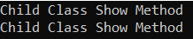

##### **چرا در هر دو مورد، متد Show کلاس فرزند فراخوانی می‌شود؟**

هنگام کار با چندریختی در سی شارپ، باید دو چیز را درک کنیم، یکی اینکه در زمان کامپایل چه اتفاقی می‌افتد و دیگری اینکه در زمان اجرا برای فراخوانی یک متد چه اتفاقی می‌افتد. آیا متد در زمان اجرا از همان کلاسی اجرا می‌شود که در زمان کامپایل به آن کلاس محدود شده است یا اینکه در زمان اجرا از کلاس دیگری به جای کلاسی که در زمان کامپایل محدود شده است، اجرا خواهد شد؟ بیایید این را درک کنیم.

در مثال ما، کد زیر را درون متد Main نوشته‌ایم.

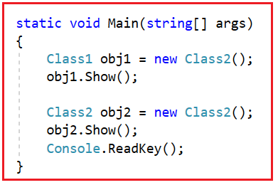

حالا، بیایید بفهمیم کامپایلر و CLR هنگام اجرای هر دستور چه کاری انجام می‌دهند. لطفاً به دستور اول توجه کنید. در اینجا می‌توانید ببینید که متغیر مرجع obj1 از نوع Class1 است و این متغیر مرجع obj1 به شیء‌ای اشاره می‌کند که نوع آن Class2 است.

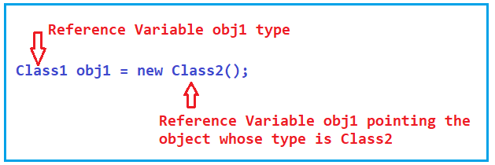

در اینجا، Class1 کلاس اصلی (superclass) و Class2 کلاس فرعی (subclass) است. نکته‌ای که باید در نظر داشته باشید این است که متغیر مرجع کلاس اصلی (Super Class Reference Variable) می‌تواند مرجع شیء کلاس فرعی (Subclass Object Reference Variable) را در خود نگه دارد و اما عکس این حالت امکان‌پذیر نیست، یعنی متغیر مرجع کلاس فرعی (Sub Class Reference Variable) هرگز نمی‌تواند مرجع شیء کلاس اصلی (Super Class Object Reference Reference Variable) را در خود نگه دارد. بنابراین، متغیر مرجع کلاس اول (Class1 Reference Variable) می‌تواند مرجع شیء کلاس دوم (Class2 Object Reference Reference Variable) را در خود نگه دارد.

حالا به عبارت زیر توجه کنید. در اینجا، نوع متغیر مرجع obj1، Class1 است و obj1 به شیء‌ای اشاره می‌کند که نوع آن Class2 است. سپس با استفاده از obj1، متد Show() را فراخوانی می‌کنیم. حال، بیایید سعی کنیم بفهمیم که در زمان کامپایل و در زمان اجرا برای فراخوانی متد زیر چه اتفاقی می‌افتد.

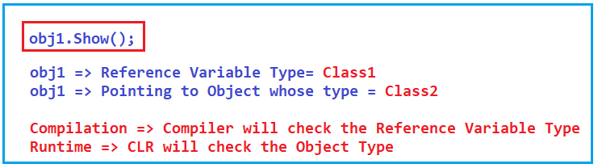

در زمان کامپایل، فراخوانی تابع به تعریف تابع خود متصل می‌شود. این بدان معناست که کامپایلر پیوندی بین فراخوانی تابع و تعریف تابع ایجاد می‌کند. برای اتصال تابع، کامپایلر نوع متغیر مرجع را بررسی می‌کند و بررسی می‌کند که آیا آن متد یا تابع در آن نوع موجود است یا خیر. اگر موجود باشد، کامپایل با موفقیت انجام می‌شود و اگر موجود نباشد، کامپایل با شکست مواجه می‌شود و شما یک خطای کامپایل دریافت خواهید کرد. در مثال ما، متد Show در Class1 (نوع متغیر مرجع obj1) موجود است و از این رو کامپایل موفقیت‌آمیز است.

در زمان اجرای برنامه، CLR نوع شیء را بررسی می‌کند و متد را از نوع شیء مرجع اجرا می‌کند. اگر متد در نوع شیء مربوطه موجود نباشد، سعی می‌کند متد را از کلاس والد آن نوع شیء اجرا کند. در مورد ما، متد Show در کلاس Class2 موجود است و از این رو این متد از کلاس Class2 اجرا خواهد شد. این به دلیل override کردن متد است و به آن چندریختی پویا یا چندریختی زمان اجرا نیز می‌گویند.

##### **پلی مورفیسم پویا یا پلی مورفیسم زمان اجرا چیست؟**

فراخوانی تابع در زمان کامپایل به کلاس محدود می‌شود، اگر قرار باشد تابع توسط CLR از کلاس دیگری در زمان اجرا اجرا شود، نه از کلاسی که در زمان کامپایل محدود شده است، آنگاه به آن چندریختی زمان اجرا در C# می‌گویند. این اتفاق در مورد لغو متد (Method Overriding) رخ می‌دهد زیرا در مورد لغو، چندین متد با امضای یکسان داریم، یعنی کلاس والد و کلاس فرزند پیاده‌سازی متد یکسانی دارند. بنابراین، در این حالت، می‌توانیم در زمان اجرا بدانیم که متد از کدام کلاس اجرا خواهد شد.

همچنین به آن چندریختی پویا یا اتصال دیرهنگام نیز گفته می‌شود، زیرا در زمان اجرا می‌توانیم بدانیم که متد از کدام کلاس اجرا خواهد شد.

##### **پلی‌مورفیسم استاتیک یا پلی‌مورفیسم زمان کامپایل چیست؟**

فراخوانی تابع در زمان کامپایل به کلاس محدود می‌شود، اگر قرار باشد تابع در زمان اجرا از همان کلاس محدود شده اجرا شود، در C# به آن چندریختی زمان کامپایل می‌گویند. این اتفاق در مورد بارگذاری بیش از حد متد رخ می‌دهد زیرا در صورت بارگذاری بیش از حد، هر متد امضای متفاوتی خواهد داشت و بر اساس فراخوانی متد، می‌توانیم به راحتی متدی را که با امضای متد مطابقت دارد، تشخیص دهیم.

به آن پلی‌مورفیسم استاتیک یا اتصال اولیه نیز گفته می‌شود، زیرا در زمان کامپایل می‌توانیم بدانیم که متد از کدام کلاس اجرا خواهد شد.

حالا، لطفا به کد زیر توجه کنید. در اینجا، متغیر مرجع obj2 از نوع Class2 است و همچنین به مرجع شیء که نوع آن Class2 است اشاره می‌کند. سپس با استفاده از متغیر مرجع obj2، متد Show را فراخوانی می‌کنیم.

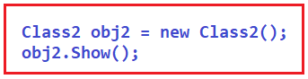

در زمان کامپایل، کامپایلر بررسی می‌کند که آیا متد Show درون متغیر مرجع Class2 موجود است یا خیر و متوجه می‌شود که آن متد موجود است و از این رو کامپایل موفقیت‌آمیز است. سپس در زمان اجرا، CLR تعریف متد را درون نوع شیء یعنی Class2 بررسی می‌کند و متوجه می‌شود که آن متد درون Class2 موجود است و آن متد را از Class2 اجرا می‌کند. بنابراین، در هر دو، فراخوانی متد، متد را از کلاس فرزند اجرا خواهد کرد زیرا هر دو متغیر مرجع به شیء کلاس فرزند اشاره می‌کنند.

**نکته:** نکته‌ای که باید در نظر داشته باشید این است که متد overriding همیشه از شیء کلاس فعلی اجرا می‌شود. متد کلاس بالا، متد overridden و متد کلاس زیر، متد overriding نامیده می‌شود.

##### **لغو متد مجازی در سی شارپ اختیاری است:**

نکته‌ای که باید در نظر داشته باشید این است که override کردن متد مجازی در کلاس‌های فرزند اختیاری است. اگر متد مجازی را override نکنید، به این معنی است که از پیاده‌سازی پیش‌فرض که توسط کلاس پدر ارائه می‌شود، استفاده می‌کنید. اجازه دهید این موضوع را با یک مثال درک کنیم. در مثال زیر، درون کلاس والد Class1، متد Show را به عنوان virtual علامت‌گذاری کرده‌ایم، اما درون کلاس فرزند Class2، متد را override نکرده‌ایم. در این حالت، همیشه متد فقط از کلاس والد اجرا می‌شود.

```csharp
using System;

namespace PolymorphismDemo
{
    class Class1
    {
        //Virtual Function (Overridable Method)
        public virtual void Show()
        {
            //Parent Class Logic Same for All Child Classes
            Console.WriteLine("Parent Class Show Method");
        }
    }

    class Class3 : Class1
    {
        //Not Overriding the Virtual Method
    }
    
    class Program
    {
        static void Main(string[] args)
        {
            Class3 obj3 = new Class3();
            obj3.Show();

            Class1 obj4 = new Class3();
            obj4.Show();

            Console.ReadKey();
        }
    }
}
```

###### **خروجی:**

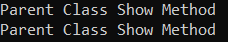

حال، بیایید کد متد Main را درک کنیم. لطفاً ابتدا کد زیر را مشاهده کنید. در این حالت، نوع متغیر مرجع و شیء مورد نظر که متغیر به آن اشاره می‌کند، یکسان هستند، یعنی Class3.

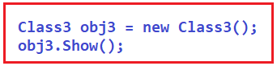

بنابراین، در زمان کامپایل، کامپایلر متد Show را در داخل Class3 بررسی می‌کند و متد Show را در داخل این کلاس پیدا نمی‌کند. بنابراین، دوباره به سراغ Superclass کلاس Class3 که همان Class1 است می‌رود و متد را در داخل Class1 پیدا می‌کند و تعریف آن متد را از Class1 به فراخوانی متد پیوند می‌دهد.

در زمان اجرا، CLR سعی می‌کند متد را از نوع شیء که در این مورد Class3 است اجرا کند و تعریف متد را درون کلاس Class3 پیدا نمی‌کند. بنابراین، دوباره سعی می‌کند متد را از کلاس پایه خود یعنی Class1 اجرا کند و متوجه می‌شود که تعریف متد در آنجا وجود دارد و آن تعریف متد را اجرا می‌کند.

حال، دستورات فراخوانی تابع بعدی را همانطور که در تصویر زیر نشان داده شده است، مشاهده کنید. در این حالت، نوع متغیر مرجع Class1 است و متغیر مرجع obj4 به شیء با نوع Class3 اشاره می‌کند.

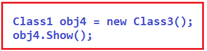

در زمان کامپایل، کامپایلر متد Show را در کلاس Class1 بررسی می‌کند و آن را در داخل این کلاس پیدا می‌کند و تعریف آن متد را از کلاس Class1 به فراخوانی متد لینک می‌دهد.

در زمان اجرا، CLR سعی می‌کند متد را از نوع شیء که در این مورد Class3 است اجرا کند و تعریف متد را در داخل کلاس Class3 پیدا نمی‌کند. بنابراین، سعی می‌کند متد را از کلاس پایه خود یعنی Class1 اجرا کند و متوجه می‌شود که تعریف متد در آنجا وجود دارد و آن تعریف متد را اجرا می‌کند. بنابراین، در این مثال، برای هر دو فراخوانی متد، متد از کلاس والد اجرا خواهد شد.

##### **چگونه می‌توانیم متد کلاس بالا را در صورت بازنویسی (override) شدن در کلاس زیرین در سی شارپ اجرا کنیم؟**

زمانی که متدهای کلاس والد را تحت کلاس‌های فرزند دوباره پیاده‌سازی کنیم، شیء کلاس فرزند متد خودش را فراخوانی می‌کند اما متد کلاس والد خود را فراخوانی نمی‌کند. اما اگر می‌خواهید همچنان متدهای کلاس والد را از کلاس فرزند فراخوانی یا استفاده کنید، می‌توانید این کار را به دو روش مختلف انجام دهید.

با ایجاد شیء کلاس والد در زیر کلاس فرزند، می‌توانیم متدهای کلاس والد را از کلاس فرزند فراخوانی کنیم، یا با استفاده از کلمه کلیدی base، می‌توانیم متدهای کلاس والد را از کلاس فرزند فراخوانی کنیم، اما این و کلمه کلیدی base را نمی‌توان در زیر بلوک static استفاده کرد.

##### **استفاده از کلمه کلیدی base برای فراخوانی متدهای کلاس والد در سی شارپ:**

برای درک بهتر، مثالی را بررسی می‌کنیم. همانطور که در کد زیر مشاهده می‌کنید، از متد Show کلاس فرزند، متد Show کلاس والد را با استفاده از فراخوانی متد base.Show() فراخوانی می‌کنیم.

```csharp
using System;

namespace PolymorphismDemo
{
    class Class1
    {
        //Virtual Function (Overridable Method)
        public virtual void Show()
        {
            //Parent Class Logic Same for All Child Classes
            Console.WriteLine("Parent Class Show Method");
        }
    }

    class Class2 : Class1
    {
        //Overriding Method
        public override void Show()
        {
            base.Show(); //Calling Parent Class Show method
            Console.WriteLine("Child Class Show Method");
        }
    }

    class Program
    {
        static void Main(string[] args)
        {
            Class1 obj1 = new Class2();
            obj1.Show();

            Class2 obj2 = new Class2();
            obj2.Show();
            Console.ReadKey();
        }
    }
}
```

###### **خروجی:**

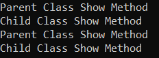

##### **فراخوانی متدهای کلاس والد با ایجاد شیء کلاس والد در زیر کلاس فرزند:**

برای درک بهتر نحوه ایجاد شیء کلاس والد و فراخوانی متدهای کلاس والد از متد کلاس فرزند، مثالی را بررسی می‌کنیم. همانطور که در مثال زیر مشاهده می‌کنید، از متد Show کلاس فرزند، نمونه‌ای از کلاس والد ایجاد می‌کنیم و متد Show کلاس والد را فراخوانی می‌کنیم.

```csharp
using System;

namespace PolymorphismDemo
{
    class Class1
    {
        public virtual void Show()
        {
            Console.WriteLine("Parent Class Show Method");
        }
    }

    class Class2 : Class1
    {
        public override void Show()
        {
            //Creating an instance of Parent Class
            Class1 class1 = new Class1();
            //Calling Parent Class Show method
            class1.Show(); 
            Console.WriteLine("Child Class Show Method");
        }
    }

    class Program
    {
        static void Main(string[] args)
        {
            Class1 obj1 = new Class2();
            obj1.Show();

            Class2 obj2 = new Class2();
            obj2.Show();
            Console.ReadKey();
        }
    }
}
```

###### **خروجی:**

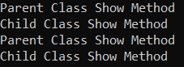

##### **مثال بلادرنگ از Override کردن متد در سی شارپ**

ما باید برنامه‌ای برای محاسبه پاداش‌ها بر اساس سمت کارمندان توسعه دهیم. تیم مدیریت تصمیم گرفته است که ۵۰۰۰۰ را به عنوان پاداش ثابت یا فقط بر اساس حقوق پرداخت کند. آنها ممکن است ۲۰٪ یا ۲۵٪، هر کدام که بالاتر باشد، به عنوان پاداش دریافت کنند. در اینجا، ما سه سمت مختلف را به عنوان مثال در نظر می‌گیریم، اما شما می‌توانید هر تعداد که نیاز دارید انتخاب کنید.

1. اگر عنوان شغلی توسعه‌دهنده باشد، کارمند یا ۵۰۰۰۰ یا ۲۰٪ از حقوق را به عنوان پاداش (هر کدام که بیشتر باشد) دریافت می‌کند.
2. اگر سمت مدیر باشد، کارمند یا ۵۰۰۰۰ یا ۲۵٪ از حقوق را به عنوان پاداش (هر کدام که بیشتر باشد) دریافت می‌کند.
3. اگر سمت مدیر باشد، کارمند مبلغ ثابت ۵۰۰۰۰ به عنوان پاداش دریافت خواهد کرد.

کد مثال زیر همین کار را طبق نیاز ما انجام می‌دهد.

```csharp
using System;

namespace MethodOverriding
{
    public class Employee
    {
        public int Id { get; set; }
        public string Name { get; set; }
        public string Designation { get; set; }
        public double Salary { get; set; }

        public virtual double CalculateBonus(double Salary)
        {
            return 50000;
        }
    }

    public class Developer : Employee
    {
        //50000 or 20% Bonus to Developers which is greater
        public override double CalculateBonus(double Salary)
        {
            double baseSalry = base.CalculateBonus(Salary);
            double calculatedSalary = Salary * .20;
            if (baseSalry >= calculatedSalary)
            {
                return baseSalry;
            }
                
            else
            {
                return calculatedSalary;
            }
        }
    }

    public class Manager : Employee
    {
        //50000 or 25% Bonus to Developers which is greater
        public override double CalculateBonus(double Salary)
        {
            double baseSalry = base.CalculateBonus(Salary);
            double calculatedSalary = Salary * .25;
            if (baseSalry >= calculatedSalary)
            {
                return baseSalry;
            }
            else
            {
                return calculatedSalary;
            }
        }
    }

    public class Admin : Employee
    {
        //return fixed bonus 50000
        //no need to overide the method
    }

    class Program
    {
        static void Main(string[] args)
        {
            Employee emp1 = new Developer
            {
                Id = 1001,
                Name = "Ramesh",
                Salary = 500000,
                Designation = "Developer"
            };
            double bonus = emp1.CalculateBonus(emp1.Salary);
            Console.WriteLine($"Name: {emp1.Name}, Designation: {emp1.Designation}, Salary: {emp1.Salary}, Bonus:{bonus}");
            Console.WriteLine();

            Employee emp2 = new Manager
            {
                Id = 1002,
                Name = "Sachin",
                Salary = 800000,
                Designation = "Manager"
            };
            bonus = emp2.CalculateBonus(emp2.Salary);
            Console.WriteLine($"Name: {emp2.Name}, Designation: {emp2.Designation}, Salary: {emp2.Salary}, Bonus:{bonus}");
            Console.WriteLine();

            Employee emp3 = new Admin
            {
                Id = 1003,
                Name = "Rajib",
                Salary = 300000,
                Designation = "Admin"
            };
            bonus = emp3.CalculateBonus(emp3.Salary);
            Console.WriteLine($"Name: {emp3.Name}, Designation: {emp3.Designation}, Salary: {emp3.Salary}, Bonus:{bonus}");
            Console.WriteLine();

            Employee emp4 = new Developer
            {
                Id = 1004,
                Name = "Priyanka",
                Salary = 200000,
                Designation = "Developer"
            };
            bonus = emp1.CalculateBonus(emp4.Salary);
            Console.WriteLine($"Name: {emp4.Name}, Designation: {emp4.Designation}, Salary: {emp4.Salary}, Bonus:{bonus}");
            
            Console.Read();
        }
    }
}
```

###### **خروجی:**

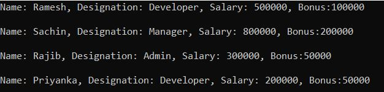

##### **تفاوت بین بارگذاری بیش از حد متد (Method Overloading) و نادیده گرفتن متد (Method Overriding) در سی شارپ چیست؟**

###### **سربارگذاری متد در سی شارپ**

1. این رویکردی برای تعریف چندین متد با نام یکسان اما با امضای متفاوت است که با تغییر تعداد، نوع و ترتیب پارامترها انجام می‌شود.
2. سربارگذاری یک متد می‌تواند هم درون یک کلاس و هم بین کلاس‌های والد-فرزند انجام شود.
3. برای overload کردن یک متد از کلاس والد در زیر کلاس‌های فرزند، کلاس فرزند نیازی به گرفتن هیچ مجوزی از کلاس والد ندارد.
4. این همه چیز در مورد تعریف چندین رفتار برای یک متد است.
5. برای پیاده‌سازی چندریختی ایستا استفاده می‌شود.
6. هیچ کلمه کلیدی جداگانه‌ای برای پیاده‌سازی سربارگذاری تابع استفاده نمی‌شود.

###### **لغو متد در سی شارپ**

1. این رویکردی برای تعریف چندین متد با نام و امضای یکسان است که به معنای تعداد، نوع و ترتیب یکسان پارامترها است.
2. بازنویسی متدها در همان کلاس امکان‌پذیر نیست و فقط باید تحت کلاس‌های فرزند انجام شود.
3. برای بازنویسی یک متد کلاس والد در کلاس‌های فرزند، ابتدا کلاس فرزند نیاز به دریافت اجازه از والد خود دارد.
4. این همه چیز در مورد تغییر رفتار یک متد است.
5. برای پیاده‌سازی چندریختی پویا استفاده می‌شود.
6. برای پیاده‌سازی لغو تابع، از کلمه کلیدی virtual برای تابع کلاس پایه و از کلمه کلیدی override در تابع کلاس مشتق شده استفاده کنید.