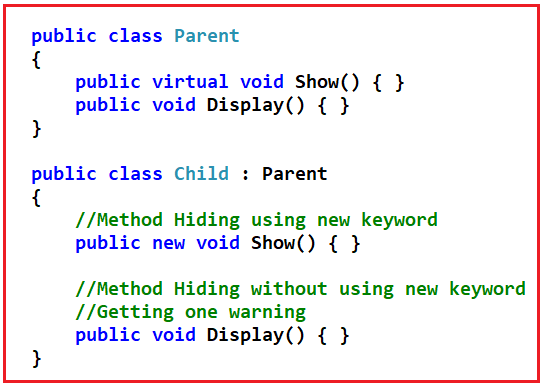
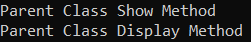
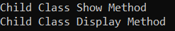
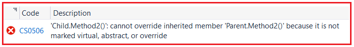
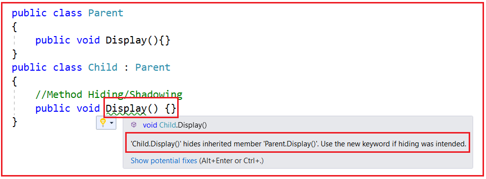
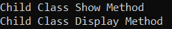
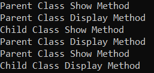
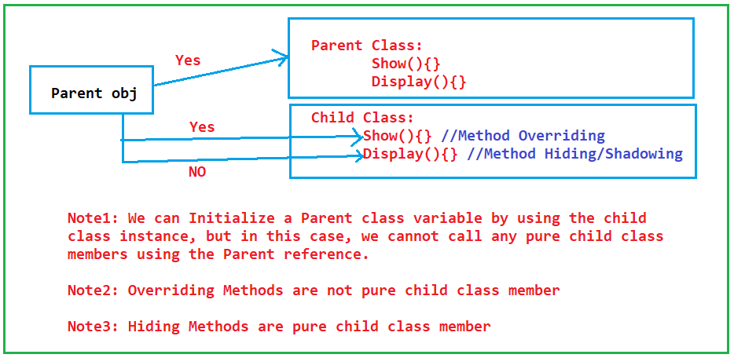

## **پنهان‌سازی متد در سی‌شارپ به همراه مثال**

در این مقاله، قصد دارم در مورد **پنهان‌سازی متد در سی‌شارپ** با مثال‌ها صحبت کنم. در پایان این مقاله، شما متوجه خواهید شد که پنهان‌سازی متد دقیقاً چیست و چه زمانی و چگونه می‌توان از پنهان‌سازی متد در سی‌شارپ با مثال‌های متعدد استفاده کرد.

##### **پنهان‌سازی متد در سی‌شارپ چیست؟**

بازنویسی متد (Method Overriding) رویکردی است که در آن متدهای کلاس والد تحت کلاس فرزند دقیقاً با همان امضا (همان نام و همان پارامترها) دوباره پیاده‌سازی می‌شوند.

پنهان‌سازی/سایه‌گذاری متد نیز رویکردی برای پیاده‌سازی مجدد متدهای کلاس والد تحت کلاس فرزند دقیقاً با همان امضا (همان نام و همان پارامترها) است.

##### **چگونه می‌توانیم یک متد والد را در کلاس فرزند در سی شارپ دوباره پیاده‌سازی کنیم؟**

ما می‌توانیم متدهای کلاس والد را تحت کلاس‌های فرزند با دو رویکرد متفاوت دوباره پیاده‌سازی کنیم. این دو رویکرد به شرح زیر هستند.

1. **نادیده گرفتن متد**
2. **پنهان‌سازی متد**

پس چه تفاوت‌هایی بین آنها وجود دارد، بیایید بفهمیم.

در Override کردن متد، کلاس‌های فرزند متدهای کلاس والد خود را که به صورت مجازی تعریف شده‌اند، مجدداً پیاده‌سازی می‌کنند. این یعنی در اینجا، کلاس‌های فرزند متدهای کلاس والد را با اجازه کلاس والد مجدداً پیاده‌سازی می‌کنند، زیرا در اینجا در کلاس والد، متد به صورت مجازی تعریف شده است و به کلاس‌های فرزند اجازه می‌دهد تا متدها را با استفاده از اصلاح‌کننده override بازنویسی کنند.

در پنهان‌سازی/سایه‌گذاری متد، کلاس‌های فرزند می‌توانند هر متدی از متدهای کلاس والد خود را حتی اگر به صورت مجازی تعریف نشده باشند، دوباره پیاده‌سازی کنند. این بدان معناست که در اینجا کلاس فرزند، متدهای کلاس والد را بدون گرفتن هیچ اجازه‌ای از والد خود، دوباره پیاده‌سازی می‌کند.

##### **چگونه می‌توان پنهان‌سازی/سایه‌گذاری متد را در سی‌شارپ پیاده‌سازی کرد؟**

لطفاً برای درک سینتکس پنهان‌سازی/سایه‌گذاری متد در سی‌شارپ، به تصویر زیر نگاهی بیندازید. فرقی نمی‌کند متد کلاس والد مجازی باشد یا خیر. می‌توانیم متدهای مجازی و غیر مجازی را در کلاس فرزند پنهان کنیم. باز هم، می‌توانیم متد را در کلاس فرزند به دو روش پنهان کنیم، یکی با استفاده از کلمه کلیدی new و دیگری بدون استفاده از کلمه کلیدی new. اگر از کلمه کلیدی new استفاده نکنیم، یک هشدار دریافت خواهیم کرد و دلیل هشدار را در بخش بعدی این مقاله بررسی خواهیم کرد.



وقتی از کلمه کلیدی new برای پنهان کردن متدهای کلاس والد در زیر کلاس فرزند استفاده می‌کنیم، به آن پنهان‌سازی/سایه‌گذاری متد در سی‌شارپ می‌گویند. استفاده از کلمه کلیدی new برای پیاده‌سازی مجدد متدهای کلاس والد در زیر کلاس فرزند اختیاری است.

##### **مثال برای درک پنهان‌سازی/سایه‌گذاری متد در سی‌شارپ:**

لطفاً به مثال زیر توجه کنید. در اینجا، درون کلاس والد، دو متد به نام‌های Show و Display تعریف کرده‌ایم. متد Show به صورت مجازی تعریف شده و متد Display به صورت مجازی تعریف نشده است. و سپس کلاس Child از کلاس والد ارث‌بری می‌کند. این بدان معناست که کلاس Child اکنون متدهای کلاس والد را نیز دارد. و وقتی نمونه‌ای از کلاس Child ایجاد می‌کنیم و متدها را فراخوانی می‌کنیم، متدها از کلاس والد اجرا می‌شوند. این مفهوم [**وراثت**](https://dotnettutorials.net/lesson/inheritance-c-sharp/) است و ما قبلاً در مورد این مفهوم صحبت کرده‌ایم.

```csharp
using System;

namespace MethodHiding
{
    public class Parent
    {
        public virtual void Show()
        {
            Console.WriteLine("Parent Class Show Method");
        }
        public void Display()
        {
            Console.WriteLine("Parent Class Display Method");
        }
    }
    public class Child : Parent
    {
        
    }
    class Program
    {
        static void Main(string[] args)
        {
            Child obj = new Child();
            obj.Show();
            obj.Display();
            Console.ReadKey();
        }
    }
}
```

###### **خروجی:**



حال، به عنوان یک کاربر کلاس فرزند، خروجی بالا را دوست نداریم. ما نسخه‌های خودمان از دو متد بالا را درون کلاس Child می‌خواهیم. اگر به متد Show نگاه کنید، می‌بینید که درون کلاس Parent به صورت مجازی تعریف شده است، بنابراین می‌توانیم با استفاده از اصلاحگر override، این متد مجازی را درون کلاس Child بازنویسی کنیم. اما نمی‌توانیم متد Display را درون کلاس Child بازنویسی کنیم زیرا درون کلاس Parent به صورت مجازی تعریف نشده است. اما می‌خواهیم متد را دوباره پیاده‌سازی کنیم. در این صورت، باید متد Display کلاس Parent را با استفاده از کلمه کلیدی new درون کلاس Child دوباره پیاده‌سازی کنیم که چیزی جز Method Hiding/Shadowing در C# نیست. کد کامل مثال در زیر آورده شده است.

```csharp
using System;

namespace MethodHiding
{
    public class Parent
    {
        public virtual void Show()
        {
            Console.WriteLine("Parent Class Show Method");
        }
        public void Display()
        {
            Console.WriteLine("Parent Class Display Method");
        }
    }
    public class Child : Parent
    {
        //Method Overriding
        public override void Show()
        {
            Console.WriteLine("Child Class Show Method");
        }

        //Method Hiding/Shadowing
        public new void Display()
        {
            Console.WriteLine("Child Class Display Method");
        }
    }
    class Program
    {
        static void Main(string[] args)
        {
            Child obj = new Child();
            obj.Show();
            obj.Display();
            Console.ReadKey();
        }
    }
}
```

###### **خروجی:**



بنابراین، در اینجا، می‌توانید مشاهده کنید که هر دو Method Overriding و Method Hiding کار یکسانی را انجام می‌دهند. این یعنی پیاده‌سازی مجدد متدهای کلاس والد تحت کلاس فرزند. پس تفاوت‌های بین آنها چیست؟ با method overriding، فقط می‌توانید متدهای مجازی را مجدداً پیاده‌سازی کنید. از طرف دیگر، با Method Hiding، می‌توانید هر متدی را مجدداً پیاده‌سازی کنید.

برای درک بهتر، لطفاً به مثال زیر نگاهی بیندازید. در اینجا، درون کلاس والد، دو متد مجازی و دو متد غیر مجازی تعریف شده تعریف کرده‌ایم. درون کلاس فرزند، هر دو متد مجازی و غیر مجازی را با استفاده از هر دو متد Overriding و Method Hiding دوباره پیاده‌سازی می‌کنیم. در اینجا، هنگام تلاش برای پیاده‌سازی مجدد متد غیر مجازی با استفاده از اصلاحگر override، خطای زمان کامپایل دریافت خواهید کرد، اما هنگام پیاده‌سازی مجدد متد مجازی و غیر مجازی با استفاده از کلمه کلیدی new، خطایی دریافت نخواهید کرد.

```csharp
using System;

namespace MethodHiding
{
    public class Parent
    {
        public virtual void Method1()
        {
            Console.WriteLine("Parent Class Method1 Method");
        }
        public void Method2()
        {
            Console.WriteLine("Parent Class Method2 Method");
        }
        public virtual void Method3()
        {
            Console.WriteLine("Parent Class Method3 Method");
        }
        public void Method4()
        {
            Console.WriteLine("Parent Class Method4 Method");
        }
    }
    public class Child : Parent
    {
        //Overriding Virtual Method
        //Method Overriding
        public override void Method1()
        {
            Console.WriteLine("Child Class Method1 Method");
        }

        //Overriding Non-Virtual Method
        //Not Possible. Compile Time Error
        public override void Method2()
        {
            Console.WriteLine("Child Class Method2 Method");
        }
        
        //Method Hiding/Shadowing Virtual Method
        public new void Method3()
        {
            Console.WriteLine("Child Class Method3 Method");
        }

        //Method Hiding/Shadowing Non-Virtual Method
        public new void Method4()
        {
            Console.WriteLine("Child Class Method4 Method");
        }
    }
    class Program
    {
        static void Main(string[] args)
        {
            Child obj = new Child();
            obj.Method1();
            obj.Method2();
            obj.Method3();
            obj.Method4();
            Console.ReadKey();
        }
    }
}
```

وقتی سعی می‌کنید کد بالا را اجرا کنید، خطای زیر را دریافت خواهید کرد و این منطقی است زیرا ما نمی‌توانیم متد غیر مجازی درون کلاس Child را override کنیم.



##### **چرا از کلمه کلیدی new در Method Hiding استفاده می‌کنیم؟**

کلمه کلیدی new به صراحت به ما می‌گوید که شما اعضای کلاس پایه یا کلاس والد را درون کلاس فرزند پنهان می‌کنید. حتی اگر از کلمه کلیدی new استفاده نمی‌کنید، می‌توانید متد را دوباره در کلاس فرزند پیاده‌سازی کنید، اما در این صورت، همانطور که در تصویر زیر نشان داده شده است، از کامپایلر اخطار دریافت خواهید کرد.



در اینجا، می‌توانید ببینید که کامپایلر یک هشدار به ما می‌دهد مبنی بر اینکه متد Display کلاس Child، متد Display کلاس Parent را که به ارث برده است، پنهان می‌کند. در پیام دوم، می‌گوید که اگر می‌خواهید عضو را پنهان کنید، لطفاً از کلمه کلیدی new استفاده کنید.

بیایید سعی کنیم این هشدار را با جزئیات بیشتری درک کنیم. امروز، ما عمداً متد Display را درون کلاس Child تعریف کردیم که از قبل درون کلاس Parent وجود دارد. فردا، ممکن است هنگام تعریف کلاس Child، فراموش کنید که متدی به نام Display در کلاس Parent تعریف شده است. در آن زمان، کامپایلر به شما هشدار خواهد داد. هشدار چیست؟ کامپایلر به شما هشدار می‌دهد که این متد از قبل در کلاس Parent تعریف شده است و این متد از این به بعد متد کلاس Parent را پنهان می‌کند. بنابراین، اگر اشتباه می‌کنید، بهتر است نام متد را تغییر دهید، یا اگر قصد پنهان کردن را داشتید، لطفاً از کلمه کلیدی new استفاده کنید.

بنابراین، وقتی از کلمه کلیدی new استفاده می‌کنیم، این فقط یک اطلاعات به کامپایلر می‌دهد که برنامه‌نویس عمداً متدی را با همان نام و امضای متد کلاس والد تعریف کرده است. بنابراین، اگر کلمه کلیدی new را حذف کنید، هیچ تفاوتی در اجرای برنامه وجود ندارد، فقط یک هشدار دریافت خواهید کرد. این تنها کاربرد کلمه کلیدی new در این زمینه است.

##### **چگونه می‌توان متدهای کلاس والد را از متدهای پیاده‌سازی‌شده‌ی کلاس فرزند فراخوانی کرد؟**

در سی شارپ، می‌توانیم متدهای کلاس والد را به دو روش زیر در کلاس فرزند پیاده‌سازی مجدد کنیم. این روش‌ها به شرح زیر هستند:

1. **نادیده گرفتن متد**
2. **پنهان‌سازی متد**

در حالت اول، با اجازه، و در حالت دوم، بدون اجازه. در بازنویسی متد و پنهان‌سازی متد، پس از اجرای پیاده‌سازی مجدد، فراخوانی متد با استفاده از نمونه کلاس فرزند، همیشه متدهای محلی یعنی متدهای کلاس فرزند را فراخوانی می‌کند. برای درک بهتر، لطفاً به مثال زیر نگاهی بیندازید. در اینجا، ما یک نمونه از کلاس Child ایجاد می‌کنیم و سپس هر دو متد را فراخوانی می‌کنیم و در این حالت، هر دو متد فقط از کلاس Child اجرا می‌شوند.

```csharp
using System;

namespace MethodHiding
{
    public class Parent
    {
        public virtual void Show()
        {
            Console.WriteLine("Parent Class Show Method");
        }
        public void Display()
        {
            Console.WriteLine("Parent Class Display Method");
        }
    }
    public class Child : Parent
    {
        //Method Overriding
        public override void Show()
        {
            Console.WriteLine("Child Class Show Method");
        }
        
        //Method Hiding/Shadowing
        public new void Display()
        {
            Console.WriteLine("Child Class Display Method");
        }
    }
    class Program
    {
        static void Main(string[] args)
        {
            Child obj = new Child();
            obj.Show();
            obj.Display();
            Console.ReadKey();
        }
    }
}
```

###### **خروجی:**



پس از پیاده‌سازی مجدد متدهای کلاس والد تحت کلاس‌های فرزند، نمونه کلاس فرزند فقط متدهای محلی یعنی متدهای پیاده‌سازی مجدد شده را فراخوانی می‌کند، اما در صورت نیاز می‌توانیم متدهای کلاس والد را از کلاس‌های فرزند نیز با استفاده از دو رویکرد فراخوانی کنیم.

1. **استفاده از نمونه کلاس والد**
2. **استفاده از کلمه کلیدی پایه**

بنابراین، با ایجاد شیء کلاس والد در زیر کلاس فرزند، می‌توانیم متدهای کلاس والد را از کلاس فرزند فراخوانی کنیم، یا با استفاده از کلمه کلیدی base، می‌توانیم متدهای کلاس والد را از کلاس فرزند نیز فراخوانی کنیم، اما کلمه کلیدی مانند this و base را نمی‌توان در زیر بلوک static استفاده کرد.

برای درک بهتر، لطفاً به مثال زیر نگاهی بیندازید. در اینجا، می‌توانید ببینید که در داخل متد Overriding و Hiding، متدهای کلاس والد را با استفاده از هر دو رویکرد فراخوانی می‌کنیم. می‌توانید هر یک از متدهای والد را فراخوانی کنید. اینطور نیست که فقط بتوانید متد Show کلاس والد را از متد Overriding Show فراخوانی کنید، می‌توانید متد Display را نیز فراخوانی کنید.

```csharp
using System;

namespace MethodHiding
{
    public class Parent
    {
        public virtual void Show()
        {
            Console.WriteLine("Parent Class Show Method");
        }
        public void Display()
        {
            Console.WriteLine("Parent Class Display Method");
        }
    }
    public class Child : Parent
    {
        //Method Overriding
        public override void Show()
        {
            //Using Parent class instance to Invoke the Parent Methods
            Parent parent = new Parent();
            parent.Show();

            //Using base keyword to invoke the Parent method
            base.Display();
            Console.WriteLine("Child Class Show Method");
        }
        
        //Method Hiding/Shadowing
        public new void Display()
        {
            //Using Parent class instance to Invoke the Parent Methods
            Parent parent = new Parent();
            parent.Display();

            //Using base keyword to invoke the Parent method
            base.Show();
            Console.WriteLine("Child Class Display Method");
        }
    }
    class Program
    {
        static void Main(string[] args)
        {
            Child obj = new Child();
            obj.Show();
            obj.Display();
            Console.ReadKey();
        }
    }
}
```

###### **خروجی:**



##### **تفاوت‌های بین لغو متد (Method Overriding) و پنهان‌سازی متد (Method Hiding) در سی‌شارپ:**

در حال حاضر، ما هیچ تفاوت عمده‌ای بین Method Overriding و Method Hiding در C# پیدا نکرده‌ایم. از نظر پیاده‌سازی تفاوت‌هایی وجود دارد، اما از نقطه نظر اجرا، وقتی متدها را با استفاده از نمونه کلاس فرزند فراخوانی می‌کنیم، هر دو متد از کلاس فرزند اجرا می‌شوند. پس تفاوت عمده بین آنها چیست، بیایید سعی کنیم بفهمیم.

آیا می‌توانیم با استفاده از نمونه کلاس Child در C#، یک متغیر مرجع کلاس Parent ایجاد کنیم؟ بله، این امکان وجود دارد و ما قبلاً در مقاله Inheritance در مورد آن بحث کرده‌ایم. بنابراین، یک متغیر مرجع کلاس Parent می‌تواند مرجع شیء کلاس Child را در خود نگه دارد.

برای درک بهتر، لطفاً به مثال زیر نگاهی بیندازید. در اینجا، ما یک نمونه از کلاس Child ایجاد می‌کنیم و مرجع نمونه آن را در متغیر مرجع کلاس Parent ذخیره می‌کنیم و سپس دو متد را فراخوانی می‌کنیم.

```csharp
using System;

namespace MethodHiding
{
    public class Parent
    {
        public virtual void Show()
        {
            Console.WriteLine("Parent Class Show Method");
        }
        public void Display()
        {
            Console.WriteLine("Parent Class Display Method");
        }
    }
    public class Child : Parent
    {
        //Method Overriding
        public override void Show()
        {
            Console.WriteLine("Child Class Show Method");
        }
        
        //Method Hiding/Shadowing
        public new void Display()
        {
            Console.WriteLine("Child Class Display Method");
        }
    }
    class Program
    {
        static void Main(string[] args)
        {
            Parent obj = new Child();
            obj.Show();
            obj.Display();
            
            Console.ReadKey();
        }
    }
}
```

###### **خروجی:**

 و پنهان‌سازی متد (Method Hiding) در سی‌شارپ")

در خروجی بالا می‌توانید ببینید که متد Show (متد Overriding) از کلاس Child اجرا می‌شود در حالی که متد Display (متد Hiding) از کلاس Parent اجرا می‌شود. چرا؟

نکته‌ای که باید به خاطر داشته باشید این است که یک متغیر مرجع کلاس والد، حتی اگر با استفاده از نمونه کلاس فرزند ایجاد شده باشد، نمی‌تواند به هیچ عضوی که صرفاً درون کلاس فرزند تعریف شده باشد دسترسی داشته باشد، اما می‌تواند متدهای override شده کلاس فرزند را فراخوانی کند، زیرا اعضای override شده به عنوان اعضای کلاس فرزند خالص در نظر گرفته نمی‌شوند، اما اعضایی که با استفاده از رویکرد پنهان‌سازی درون کلاس فرزند مجدداً پیاده‌سازی می‌شوند، به عنوان اعضای کلاس فرزند خالص در نظر گرفته می‌شوند و نمی‌توانند توسط متغیر مرجع والد به آنها دسترسی پیدا شود. برای درک بهتر، لطفاً به نمودار زیر نگاهی بیندازید.



با استفاده از obj والد، می‌توانیم به اعضای کلاس والد دسترسی پیدا کنیم و اگر با استفاده از نمونه کلاس فرزند ایجاد شود، می‌توانیم به اعضای override شده کلاس فرزند دسترسی پیدا کنیم.

در اینجا، متد Show یک متد overriding است و متدهای overriding متدهای کلاس فرزند خالص نیستند. متد Show در کلاس Parent تعریف شده و دوباره در داخل کلاس Child دوباره تعریف شده است، و از این رو می‌توانیم متد Show را با استفاده از متغیر مرجع Parent فراخوانی کنیم و وقتی متد Show را با استفاده از متغیر مرجع Parent فراخوانی می‌کنیم، از آنجایی که این متغیر شیء کلاس فرزند را در خود نگه می‌دارد، بنابراین، متد فقط از کلاس Child اجرا خواهد شد.

بنابراین، نکته‌ای که باید به خاطر داشته باشید این است که در مورد override کردن متد، کلاس والد به کلاس‌های فرزند اجازه می‌دهد تا متد را override کنند. و هنگامی که کلاس فرزند متد را دوباره پیاده‌سازی می‌کند، کلاس والد آنها را شناسایی می‌کند یا کلاس والد آنها را تشخیص می‌دهد. همانطور که کلاس والد تشخیص می‌دهد. بنابراین، می‌تواند متدهای override شده کلاس فرزند را فراخوانی کند.

اما در مورد پنهان‌سازی/سایه‌گذاری متد این‌طور نیست. در پنهان‌سازی متد، بدون گرفتن اجازه والد، کلاس فرزند شروع به پیاده‌سازی مجدد متدها می‌کند. از آنجایی که فرزند هیچ اجازه‌ای از والد نمی‌گیرد، بنابراین متغیر مرجع والد آنها را تشخیص نمی‌دهد و از این رو متغیر مرجع والد نمی‌تواند به آنها دسترسی داشته باشد. بنابراین، در این حالت، متد کلاس والد فراخوانی خواهد شد. بنابراین، پنهان کردن یک عضو والد در داخل کلاس فرزند، یک عضو کلاس فرزند خالص محسوب می‌شود.

این تفاوت اصلی بین لغو متد (Method Overriding) و پنهان‌سازی متد (Method Hiding) در سی‌شارپ است. بنابراین، اگر یک متغیر مرجع کلاس والد (Parent class reference variable) با استفاده از ارجاع شیء کلاس فرزند (Child class object reference) ایجاد شود، آنگاه با استفاده از آن ارجاع والد (Parent reference) می‌توانیم متدهای لغوکننده کلاس فرزند (Child class overriding) را فراخوانی کنیم، اما نمی‌توانیم متدهای پنهان‌سازی کلاس فرزند (child class hidden methods) را فراخوانی کنیم.