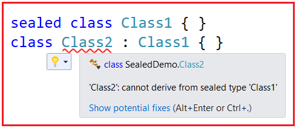
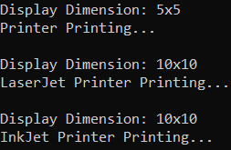

## **کلاس مهر و موم شده و متدهای مهر و موم شده در سی شارپ به همراه مثال**

در این مقاله، قصد دارم در مورد **کلاس‌های مهر و موم شده (Sealed Class) و متدهای** بحث کردیم، مطالعه کنید **مهر و موم شده (Sealed Methods) در سی شارپ (C#) به همراه مثال بحث کنم**.  در پایان این مقاله، شما دقیقاً متوجه خواهید شد که کلاس‌های مهر و موم شده (Sealed Class) و متدهای مهر و موم شده (Sealed Methods) در سی شارپ چیستند و چه زمانی و چگونه می‌توان از آنها استفاده کرد.

##### **کلاس مهر و موم شده در سی شارپ**

کلاسی که امکان ایجاد/اشتقاق کلاس جدید از آن وجود ندارد، به عنوان کلاس مهر و موم شده (sealed class) شناخته می‌شود. به عبارت ساده، می‌توان گفت وقتی کلاس را با استفاده از اصلاحگر sealed تعریف می‌کنیم، آن را کلاس مهر و موم شده می‌نامیم و کلاس مهر و موم شده نمی‌تواند توسط هیچ کلاس دیگری به ارث برده شود.

برای تبدیل هر کلاسی به یک کلاس مهر و موم شده (sealed) باید از کلمه کلیدی sealed استفاده کنیم. کلمه کلیدی sealed به کامپایلر می‌گوید که کلاس مهر و موم شده است و بنابراین نمی‌تواند توسعه یابد. هیچ کلاسی نمی‌تواند از یک کلاس مهر و موم شده مشتق شود. برای درک بهتر، لطفاً به کد زیر نگاهی بیندازید.



##### **نکاتی که باید هنگام کار با کلاس Sealed** **در سی شارپ به خاطر داشته باشید**

1. یک کلاس مهر و موم شده (sealed class) کاملاً نقطه مقابل یک کلاس انتزاعی (abstract class) است.
2. کلاس مهر و موم شده نمی‌تواند شامل هیچ متد انتزاعی (abstract) باشد.
3. این باید پایین‌ترین کلاس در سلسله مراتب ارث‌بری باشد.
4. یک کلاس مهر و موم شده هرگز نمی‌تواند به عنوان کلاس پایه استفاده شود.
5. کلاس مهر و موم شده (sealed class) به طور خاص برای جلوگیری از ارث بری بیشتر استفاده می‌شود.
6. کلمه کلیدی sealed را می‌توان با کلاس‌ها، متدهای نمونه و ویژگی‌ها استفاده کرد.

**نکته:** حتی اگر یک کلاس مهر و موم شده قابل ارث بری نباشد، ما همچنان می‌توانیم با ایجاد شیء از آن کلاس، اعضای کلاس را از هر کلاس دیگری استفاده کنیم.

##### **مثال برای درک کلاس Sealed در سی شارپ:**

لطفاً برای درک کلاس sealed در سی‌شارپ، به مثال زیر نگاهی بیندازید. در اینجا، ابتدا کلاس Employee را ایجاد کردیم و سپس کلاس Manager را که از کلاس Employee به ارث برده شده است، ایجاد کردیم. و در اینجا کلاس Manager را به عنوان sealed علامت‌گذاری کرده‌ایم و از این رو ارث‌بری بیشتری انجام نشده است. در اینجا، می‌توانید ببینید که هنگام ایجاد کلاس TempManager از کلاس Manager، با خطای زمان کامپایل مواجه می‌شویم که می‌گوید **'TempManager': نمی‌تواند از نوع sealed 'Manager' مشتق شود** . ببینید، ارث‌بری امکان‌پذیر نیست، اما می‌توانیم نمونه‌ای از sealed ایجاد کنیم و اعضا را از خارج از کلاس مصرف کنیم. بنابراین، در داخل متد Main، نمونه‌ای از کلاس Manager ایجاد می‌کنیم و دو متد را فراخوانی می‌کنیم.

```csharp
using System;

namespace SealedDemo
{
    public class Employee
    {
        protected int Eid, Eage;
        protected string Ename, Eaddress;
        public virtual void GetEmployeeData()
        {
            Console.WriteLine("Enter Emplpyee Details:");
            Console.Write("Enter Employee ID:");
            Eid = int.Parse(Console.ReadLine());
            Console.Write("Enter Employee Name:");
            Ename = Console.ReadLine();
            Console.Write("Enter Employee Address:");
            Eaddress = Console.ReadLine();
            Console.Write("Enter Employee Age:");
            Eage = int.Parse(Console.ReadLine());
        }
        public virtual void DisplayEmployeeData()
        {
            Console.WriteLine("\\nEmplpyee Details Are:");
            Console.WriteLine($"Employee ID: {Eid}");
            Console.WriteLine($"Employee Name: {Ename}");
            Console.WriteLine($"Employee Address: {Eaddress}");
            Console.WriteLine($"Employee Age: {Eage}");
        }
    }

    public sealed class Manager : Employee
    {
        double Bonus, Salary;
        public override void GetEmployeeData()
        {
            Console.WriteLine("Enter Manager Details:");
            Console.Write("Enter Manager ID:");
            Eid = int.Parse(Console.ReadLine());
            Console.Write("Enter Manager Name:");
            Ename = Console.ReadLine();
            Console.Write("Enter Manager Salary:");
            Salary = Convert.ToDouble(Console.ReadLine());
            Console.Write("Enter Manager Bonus:");
            Bonus = double.Parse(Console.ReadLine());
        }
        public override void DisplayEmployeeData()
        {
            Console.WriteLine("\\nManager Details Are:");
            Console.WriteLine($"Manager ID: {Eid}");
            Console.WriteLine($"Manager Name: {Ename}");
            Console.WriteLine($"Manager Salary: {Salary}");
            Console.WriteLine($"Manager Bonus: {Bonus}");
        }
    }

    //Further No Inheritance is Possible as we marked the class as sealed
    //public class TempManager : Manager
    //{
    //}

    class Program
    {
        static void Main(string[] args)
        {
            Manager m1 = new Manager();
            m1.GetEmployeeData();
            m1.DisplayEmployeeData();
            Console.ReadKey();
        }
    }
}
```

###### **خروجی:**


##### **متدهای مهر و موم شده در سی شارپ**

متدی که در کلاس والد تعریف می‌شود، اگر آن متد را نتوان تحت یک کلاس فرزند بازنویسی کرد، آن را متد مهر و موم شده می‌نامیم. این بدان معناست که به طور پیش‌فرض، هر متدی یک متد مهر و موم شده است زیرا بازنویسی آن امکان‌پذیر نیست مگر اینکه متد به صورت مجازی در کلاس والد تعریف شده باشد. اگر متدی در یک کلاس به صورت مجازی تعریف شده باشد، هر کلاس فرزند آن می‌تواند حق بازنویسی آن متد را داشته باشد. به عنوان مثال:

```csharp
namespace SealedDemo
{
    class Parent
    {
        public virtual void Show() { }
    }
    class Child : Parent
    {
        public override void Show() { }
    }
    class GrandChild : Child
    {
        public override void Show() { }
    }
}
```

همانطور که در کد بالا مشاهده می‌کنید، کلاس Child متد Show کلاس Parent را override می‌کند و دوباره کلاس GrandChild نیز متد Show را override می‌کند. حال، اگر می‌خواهید کلاس GrandChild را محدود کنید که متد Show را override نکند، باید از اصلاحگر sealed به همراه اصلاحگر override در کلاس Child استفاده کنید. این کار، override شدن متد را در کلاس‌های مشتق شده محدود می‌کند. برای درک بهتر، لطفاً به مثال زیر نگاهی بیندازید.

```csharp
namespace SealedDemo
{
    class Parent
    {
        public virtual void Show() { }
    }
    class Child : Parent
    {
        public sealed override void Show() { }
    }
    class GrandChild : Child
    {
        //'GrandChild.Show()': cannot override inherited member 'Child.Show()' because it is sealed
        public override void Show() { }
    }
}
```

بنابراین، نکته‌ای که باید به خاطر داشته باشید این است که هر متدی به طور پیش‌فرض در سی‌شارپ مهر و موم شده است و از این رو نمی‌توان آنها را تحت کلاس فرزند بازنویسی کرد. اما اگر متدی را به عنوان مجازی تعریف کنید، آن متد می‌تواند هم تحت کلاس‌های فرزند و هم تحت کلاس‌های نوه بازنویسی شود. اگر می‌خواهید متد را محدود کنید، نباید تحت کلاس‌های نوه بازنویسی شود، باید متد را درون کلاس فرزند مهر و موم شده کنید. نکته‌ای که باید به خاطر داشته باشید این است که اگر می‌خواهید متدی را به عنوان مهر و موم شده تعریف کنید، باید آن را در کلاس پایه خود به عنوان مجازی تعریف کنید.

##### **مثال بلادرنگ برای درک کلاس مهر و موم شده و متد مهر و موم شده در سی شارپ:**

حال، بیایید کلاس مهر و موم شده و متد مهر و موم شده را با یک مثال بلادرنگ درک کنیم. در مثال زیر، کلاس Printer کلاس والد است و در این کلاس، دو متد مجازی تعریف کرده‌ایم. متد Display کلاس Printer واحد را با ابعاد 5×5 نمایش می‌دهد و متد print به سادگی همان را چاپ می‌کند. سپس کلاس LaserJet متد Display را برای داشتن ابعاد 10×10 لغو می‌کند. اگر قرار باشد هر کلاسی از کلاس LaserJet ارث بری کند، آن کلاس در مثال ما، کلاس InkJet، همان ابعاد 10×10 را خواهد داشت و نمی‌تواند ابعاد خودش را پیاده‌سازی کند، مانند 15×15، 16×16 یا هر چیز دیگری، زیرا متد Display به عنوان مهر و موم شده علامت گذاری شده است. کد مثال زیر خود توضیح است و لطفاً خطوط کامنت را مرور کنید.

```csharp
using System;

namespace SealedDemo
{
    public class Printer
    {
        //The Printer class declaring two virtual methods
        public virtual void Display()
        {
            Console.WriteLine("Display Dimension: 5x5");
        }
        public virtual void Print()
        {
            Console.WriteLine("Printer Printing...\\n");
        }
    }

    public class LaserJet : Printer
    {
        //The LaserJet class Overriding the two parent class virtal methods
        //But making the Display method as sealed, so the child classes of LaserJet class
        //will not override this method
        public sealed override void Display()
        {
            Console.WriteLine("Display Dimension: 10x10");
        }

        //The Print method can be override under the Child class of LaserJet class
        public override void Print()
        {
            Console.WriteLine("LaserJet Printer Printing...\\n");
        }
    }

    //The InkJet class can not override the Display Method as it is marked sealed in LaserJet class.
    //So, InkJet will have same Display feature i.e it also has "Display Dimention: 10x10".
    public sealed class InkJet : LaserJet
    {
        //The following method overriding will give compile time error
        //'InkJet.Display()': cannot override inherited member 'LaserJet.Display()' because it is sealed
        //public override void Display()
        //{
        //    Console.WriteLine("Some Different Display Dimension");
        //}
        public override void Print()
        {
            Console.WriteLine("InkJet Printer Printing...");
        }
    }

    //As we marked the InkJet class as sealed so more inheritance using InkJet class
    //The following inheritance will give you compile time error
    //'DotMatrix': cannot derive from sealed type 'InkJet'
    //class DotMatrix : InkJet
    //{
    //}

    class Program
    {
        static void Main(string[] args)
        {
            Printer printer = new Printer();
            printer.Display();
            printer.Print();

            LaserJet laserJet = new LaserJet();
            laserJet.Display();
            laserJet.Print();

            InkJet inkJet = new InkJet();
            inkJet.Display();
            inkJet.Print();
            Console.ReadKey();
        }
    }
}
```

###### **خروجی:**



**نکته:** در وراثت، کلاس sealed پایین‌ترین کلاس است زیرا دیگر نمی‌توان از این کلاس ارث‌بری کرد.

##### **چه زمانی باید یک متد در سی شارپ به صورت sealed اعلان شود؟**

اگر به زیرکلاس‌ها اجازه ندهیم که متد کلاس بالا را بازنویسی کنند و مطمئن شویم که همه زیرکلاس‌ها از منطق متد کلاس بالا استفاده می‌کنند، آن متد باید به صورت sealed تعریف شود. در صورت نقض این منطق در زیرکلاس‌ها، متد sealed نمی‌تواند بازنویسی شود و منجر به خطای زمان کامپایل می‌شود.

##### **تفاوت بین متدهای private و sealed در سی شارپ چیست؟**

متد خصوصی به ارث نمی‌رسد در حالی که متد مهر و موم شده به ارث می‌رسد اما در سی شارپ قابل لغو نیست. بنابراین، یک متد خصوصی را نمی‌توان از زیرکلاس‌ها فراخوانی کرد در حالی که یک متد مهر و موم شده را می‌توان از زیرکلاس‌ها فراخوانی کرد. همین متد خصوصی را می‌توان در زیرکلاس تعریف کرد و منجر به خطا نمی‌شود. برای درک بهتر، لطفاً به مثال زیر نگاهی بیندازید. کد مثال زیر خود توضیح است، بنابراین لطفاً خطوط کامنت را مطالعه کنید.

```csharp
using System;

namespace SealedDemo
{
    public class Class1
    {
        public virtual void Method1()
        {
            Console.WriteLine("Class1 Method1");
        }
    }

    public class Class2 : Class1
    {
        //Private Method
        private void Method2()
        {
            Console.WriteLine("Class2 Private Method2");
        }

        //Sealed Method
        public sealed override void Method1()
        {
            Console.WriteLine("Class2 Sealed Method1");
        }
    }
    
    public class Class3 : Class2
    {
        //We cannot override Method1 because it is sealed in Class2
        //But this method is inherited and hence we can access this method
        //using Class3 instance
        //public override void Method1()
        //{
        //    Console.WriteLine("InkJet Printer Printing...");
        //}

        //Class2 Private Method Method2 is not inherited to child class and hence
        //you can define the same method here
        public void Method2()
        {
            Console.WriteLine("Class3 public Method2");
        }
    }
    
    class Program
    {
        static void Main(string[] args)
        {
            Class2 obj1 = new Class2();
            obj1.Method1();

            Class3 obj3 = new Class3();
            obj3.Method1();
            obj3.Method2();

            Console.ReadKey();
        }
    }
}
```

###### **خروجی:**


##### **چه زمانی باید یک کلاس در سی شارپ به صورت sealed اعلان شود؟**

اگر بخواهیم وراثت را محدود کنیم، باید با استفاده از اصلاحگر sealed در سی شارپ، کلاس را به صورت sealed تعریف کنیم.

##### **تفاوت‌های بین یک کلاس انتزاعی و یک کلاس مهر و موم شده در سی شارپ چیست؟**

###### **کلاس انتزاعی در سی شارپ:**

1. کلاسی که شامل یک یا چند متد انتزاعی باشد، به عنوان کلاس انتزاعی شناخته می‌شود.
2. کلاس انتزاعی می‌تواند شامل متدهای انتزاعی و غیر انتزاعی باشد.
3. ایجاد یک کلاس جدید از یک کلاس انتزاعی برای استفاده از اعضای غیر انتزاعی کلاس انتزاعی اجباری است.
4. یک کلاس انتزاعی را نمی‌توان مستقیماً نمونه‌سازی کرد؛ ما باید شیء را برای کلاس‌های فرزند آن ایجاد کنیم تا بتوانند از یک کلاس انتزاعی استفاده کنند.
5. برای انتزاعی کردن هر کلاسی باید از کلمه کلیدی abstract استفاده کنیم.
6. یک کلاس انتزاعی نمی‌تواند پایین‌ترین کلاس در سلسله مراتب وراثت باشد.

###### **کلاس مهر و موم شده در سی شارپ:**

1. کلاسی که نمی‌توان از آن کلاس جدیدی مشتق گرفت، کلاس مهر و موم شده (sealed class) نامیده می‌شود.
2. کلاس مهر و موم شده می‌تواند شامل متدهای غیر انتزاعی باشد؛ نمی‌تواند شامل متدهای انتزاعی و مجازی باشد.
3. ایجاد یک کلاس جدید از یک کلاس مهر و موم شده (sealed class) امکان‌پذیر نیست.
4. ما باید یک شیء برای یک کلاس مهر و موم شده ایجاد کنیم تا اعضای آن را مصرف کند.
5. برای مهر و موم کردن هر کلاسی، باید از کلمه کلیدی sealed استفاده کنیم.
6. کلاس مهر و موم شده باید پایین‌ترین کلاس در سلسله مراتب ارث‌بری باشد.