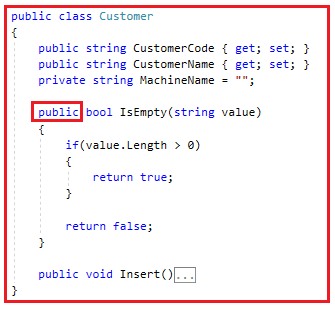
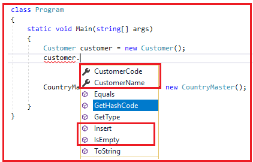
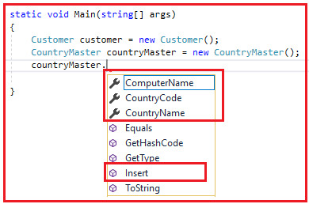
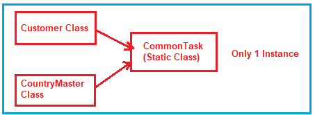
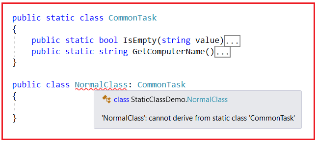

## **کلاس استاتیک در سی شارپ به همراه مثال**

در این مقاله، قصد دارم در مورد **کلاس استاتیک در سی شارپ** با مثال صحبت کنم. مطمئنم در پایان این مقاله، شما نیاز و کاربرد کلاس استاتیک در سی شارپ با مثال را درک خواهید کرد.

##### **کلاس استاتیک در سی شارپ**

کلاسی که با استفاده از اصلاحگر static ایجاد می‌شود، در سی شارپ کلاس static نامیده می‌شود. یک کلاس static می‌تواند فقط شامل اعضای static باشد. ایجاد نمونه‌ای از یک کلاس static امکان‌پذیر نیست. دلیل این امر این است که فقط شامل اعضای static است. و می‌دانیم که می‌توانیم با استفاده از نام کلاس به اعضای static آن دسترسی پیدا کنیم.

##### **مثال برای درک کلاس استاتیک در سی شارپ:**

بیایید با یک مثال، نیاز و کاربرد کلاس Static در سی شارپ را درک کنیم. ابتدا، یک برنامه کنسول با نام StaticClassDemo ایجاد کنید.

##### **CountryMaster.cs:**

پس از ایجاد برنامه کنسول، یک فایل کلاس با نام **CountryMaster.cs** اضافه کنید و سپس کد زیر را در آن کپی و جایگذاری کنید. در اینجا ما کلاسی با سه ویژگی و یک متد ایجاد کرده‌ایم. ویژگی CountryCode نمادهای سه حرفی کشور را در خود نگه می‌دارد در حالی که ویژگی CountryName نام کامل کشور را در خود نگه می‌دارد. ویژگی ComputerName منطق بازیابی نام دستگاه فعلی را دارد. متد Insert رکورد کشور را در پایگاه داده وارد می‌کند و هنگام درج آن، از ویژگی ComputerName نیز برای تشخیص اینکه این رکورد از کدام کامپیوتر وارد شده است، استفاده می‌کند.

```csharp
namespace StaticClassDemo
{
    public class CountryMaster
    {
        public string CountryCode { get; set; }
        public string CountryName { get; set; }
        private string ComputerName
        {
            get
            {
                return System.Environment.MachineName;
            }
        }
        public void Insert()
        {
               //Insert the data
        }
    }
}
```

##### **Customer.cs**

سپس، یک فایل کلاس دیگر با نام **Customer.cs** ایجاد کنید و سپس کد زیر را در آن کپی و جایگذاری کنید.

```csharp
namespace StaticClassDemo
{
    public class Customer
    {
        public string CustomerCode { get; set; }
        public string CustomerName { get; set; }
        private string MachineName = "";
        private bool IsEmpty(string value)
        {
            if (value.Length > 0)
            {
                return true;
            }
            return false;
        }
        public void Insert()
        {
            if (IsEmpty(CustomerCode) && IsEmpty(CustomerName))
            {
                //Insert the data
            }
        }
    }
}
```

##### **توضیح کد بالا:**

**ویژگی CustomerCode** قرار است کد سه حرفی مشتری را در خود نگه دارد در حالی که ویژگی CustomerName نام مشتری را در خود نگه می‌دارد. متد IsEmpty یک مقدار را می‌پذیرد و سپس بررسی می‌کند که آیا مقدار خالی است یا خیر. اگر خالی نباشد، مقدار true را برمی‌گرداند و در غیر این صورت مقدار false را برمی‌گرداند. متد Insert به سادگی بررسی می‌کند که آیا CustomerCode و CustomerName هر دو خالی نیستند، سپس رکورد مشتری را در پایگاه داده وارد می‌کند.

در اینجا، مشکل از **متغیر MachineName** است . **MachineName** باید نام رایانه فعلی را هنگام درج داده‌های مشتری در پایگاه داده داشته باشد تا بتوانیم پیگیری کنیم که این داده‌های مشتری از کدام دستگاه درج شده است.

اگر به خاطر داشته باشید، **کلاس CountryMaster** منطق بازیابی نام کامپیوتر را دارد. به جای نوشتن منطق تکراری در اینجا، باید از منطقی که از قبل در **کلاس CountryMaster** نوشته شده است استفاده کنیم تا از نوشتن کد تکراری یا کد اضافی جلوگیری کنیم.

بررسی کنید **اگر ویژگی ComputerName را در فایل کلاس CountryMaster.cs** ، خواهید دید که از نوع private است، بنابراین برای استفاده از آن ویژگی در کلاس Customer، ابتدا باید آن را همانطور که در تصویر زیر نشان داده شده است، به public تغییر دهیم.


دوباره، هنگام وارد کردن رکورد CountryMaster در پایگاه داده، باید بررسی کنیم که CountryCode و CountryName نباید خالی باشند. برای بررسی خالی بودن یا نبودن، ما همچنین دوست داریم از **متد IsEmpty** که در کلاس Customer تعریف شده است استفاده کنیم تا اینکه منطق کامل را اینجا بنویسیم. علاوه بر این، اگر توجه کرده باشید، متد IsEmpty کلاس Customer خصوصی است، بنابراین برای استفاده از آن متد در کلاس CountryMaster، باید آن را همانطور که در تصویر زیر نشان داده شده است، به عمومی تغییر دهیم.



کلاس CountryMaster منطقی برای بازیابی نام کامپیوتر دارد و ما می‌خواهیم از آن منطق در کلاس Customer استفاده کنیم، بنابراین ویژگی ComputerName را عمومی (public) کردیم. به طور مشابه، کلاس Customer منطق بررسی خالی بودن یا نبودن یک مقدار را دارد و ما نیز می‌خواهیم این منطق در کلاس CountryMaster وجود داشته باشد، بنابراین متد IsEmpty را عمومی (public) کردیم. تا زمانی که این کار را انجام دهیم، **اصل کپسوله‌سازی را** نقض کرده‌ایم .

##### **چگونه اصل کپسوله‌سازی OOPs را نقض می‌کنیم؟**

بیایید بفهمیم که چگونه اصل کپسوله‌سازی را نقض می‌کنیم. کلاس Program را مطابق شکل زیر تغییر دهید. پس از ایجاد شیء کلاس Customer، می‌توانید عضو عمومی آن کلاس را مطابق تصویر زیر مشاهده کنید.



همانطور که می‌بینید، ما متدهای CustomerCode، CustomerName، Insert و IsEmpty را نمایش داده‌ایم. این یک نقض آشکار انتزاع است. انتزاع به معنای نمایش فقط آنچه لازم است است. بنابراین، شخص خارجی که از کلاس شما استفاده می‌کند، باید **متدهای CustomerCode** ، **CustomerName** و **Insert** را ببیند و مصرف کند . اما نباید **متد IsEmpty** را ببیند . **متد IsEmpty** برای استفاده داخلی است، یعنی توسط متدهای دیگر استفاده می‌شود، نه توسط مصرف‌کننده کلاس. از آنجایی که متد IsEmpty را عمومی می‌کنیم، اصل کپسوله‌سازی را نقض می‌کنیم.

به همین ترتیب، ما اصل انتزاع را با **شیء CountryMaster** قرار می‌دهیم **نیز نقض می‌کنیم، زیرا ویژگی ComputerName** را در معرض دنیای خارجی **که قرار است کلاس را مصرف کند، همانطور که در تصویر زیر نشان داده شده است. ویژگی ComputerName** فقط برای استفاده داخلی است.



**نکته:** با استفاده از موارد فوق، ما به قابلیت استفاده مجدد از کد (استفاده مجدد از متدهای ComputerName و IsEmpty) دست می‌یابیم، اما اصل کپسوله‌سازی را نقض می‌کنیم.

##### **چگونه این مشکل را حل کنیم؟**

چگونگی حل مشکل فوق به این معنی است که چگونه باید بدون نقض اصول OOP (یعنی اصل کپسوله‌سازی) به قابلیت استفاده مجدد از کد دست یابیم. برای دستیابی به هر دو، بیایید یک کلاس جدید اضافه کنیم و سپس آن دو تابع را به آن کلاس منتقل کنیم. یک فایل کلاس با نام **CommonTask.cs** ایجاد کنید و سپس کد زیر را در آن کپی و جایگذاری کنید.

```csharp
namespace StaticClassDemo
{
    public class CommonTask
    {
        public bool IsEmpty(string value)
        {
            if (value.Length > 0)
            {
                return true;
            }
            return false;
        }
        public string GetComputerName()
        {
            return System.Environment.MachineName;
        }
    }
}
```

لطفا متد IsEmpty() را از کلاس Customer و ویژگی ComputerName را از کلاس CountryMaster حذف کنید. اکنون هر دو منطقی که اصل OOPs را نقض می‌کنند به **کلاس CommonTask** منتقل شده‌اند .

##### **اصلاح کلاس مشتری:**

حالا کلاس Customer را مطابق شکل زیر تغییر دهید. همانطور که می‌بینید، در سازنده، مقدار متغیر خصوصی MachineName را تنظیم می‌کنیم و در متد Insert، یک نمونه از **کلاس CommonTask** ایجاد می‌کنیم و **متد IsEmpty را** فراخوانی می‌کنیم .

```csharp
namespace StaticClassDemo
{
    public class Customer
    {
        public string CustomerCode { get; set; }
        public string CustomerName { get; set; }
        private string MachineName = "";
        public Customer()
        {
            CommonTask commonTask = new CommonTask();
            MachineName = commonTask.GetComputerName();
        }

        public void Insert()
        {
            CommonTask commonTask = new CommonTask();
            if (!commonTask.IsEmpty(CustomerCode) && !commonTask.IsEmpty(CustomerName))
            {
                //Insert the data
            }
        }
    }
}
```

##### **اصلاح کلاس CountryMaster:**

لطفاً **کلاس CountryMaster** را مطابق شکل زیر تغییر دهید. در اینجا، ما نمونه‌ای از **CommonTask** ایجاد کردیم و سپس متدهای GetComputerName و IsEmpty را فراخوانی کردیم.

```csharp
namespace StaticClassDemo
{
    public class CountryMaster
    {
        public string CountryCode { get; set; }
        public string CountryName { get; set; }
        private string ComputerName
        {
            get
            {
                CommonTask commonTask = new CommonTask();
                return commonTask.GetComputerName();
            }
        }
        public void Insert()
        {
            CommonTask commonTask = new CommonTask();
            if (!commonTask.IsEmpty(CountryCode) && !commonTask.IsEmpty(CountryName))
            {
                //Insert the data
            }
        }
    }
}
```

از آنجایی که ما **متدهای IsEmpty** و **GetComputerName را** در **کلاس CommonTask** متمرکز کردیم ، می‌توانیم از این متدها در هر دو **کلاس Customer** و **CountryMaster** را نقض نمی‌کند **استفاده کنیم. راه حل بالا به نظر مناسب می‌رسد زیرا اصل OOPs** و همچنین قابلیت استفاده مجدد از کد را فراهم می‌کند و امیدوارم بسیاری از شما نیز با آن موافق باشید. اما مشکلی نیز وجود دارد.

##### **مشکل راه حل بالا چیه؟**

برای درک مشکل، ابتدا **کلاس CommonTask** را به شیوه‌ای عالی تجزیه و تحلیل می‌کنیم.

1. این **کلاس CommonTask** مجموعه‌ای از متدها و ویژگی‌های نامرتبط است که به یکدیگر ارتباطی ندارند. از آنجایی که این کلاس دارای متدها، ویژگی‌ها یا منطق نامرتبط است، هیچ شیء دنیای واقعی را نشان نمی‌دهد.
2. از آنجایی که این کلاس هیچ شیء واقعی را نشان نمی‌دهد، بنابراین هیچ یک از اصول برنامه‌نویسی شیءگرا (وراثت، انتزاع، چندریختی، کپسوله‌سازی) نباید روی این کلاس CommonTask اعمال شود.
3. بنابراین، به عبارت ساده، می‌توانیم بگوییم که این یک کلاس ثابت است، یعنی کلاسی با رفتار ثابت. یعنی رفتار آن را نمی‌توان از طریق وراثت تغییر داد و رفتار آن را نمی‌توان با استفاده از چندریختی استاتیک یا پویا چندریختی کرد. بنابراین، می‌توانیم بگوییم که این کلاس یک کلاس ثابت یا کلاس استاتیک است.

##### **چگونه از وراثت اجتناب کنیم، چگونه از کلمات کلیدی انتزاعی اجتناب کنیم، یا چگونه از اصل OOP در یک کلاس اجتناب کنیم؟**

پاسخ با استفاده از **کلمه کلیدی static** است . بنابراین، شما باید **کلاس CommonTask** به صورت **static** را با استفاده از کلمه کلیدی static **علامت گذاری کنید. وقتی یک کلاس را به صورت static** علامت گذاری می کنید ، همه چیز داخل کلاس باید static باشد. این بدان معناست که ما باید **متدهای IsEmpty** و **GetComputerName** را مطابق شکل زیر تغییر دهید **نیز به صورت static علامت گذاری کنیم. بنابراین، کلاس CommonTask** .

```csharp
namespace StaticClassDemo
{
    public static class CommonTask
    {
        public static bool IsEmpty(string value)
        {
            if (value.Length > 0)
            {
                return true;
            }
            return false;
        }
        public static string GetComputerName()
        {
            return System.Environment.MachineName;
        }
    }
}
```

وقتی کلاس را static می‌کنید، دیگر نمی‌توانید از **کلمه کلیدی new** به همراه کلاس static برای ایجاد یک نمونه استفاده کنید، بلکه باید **متدهای IsEmpty** و **GetComputerName** را با استفاده از نام کلاس فراخوانی کنید. در داخل، فقط یک نمونه از کلاس static توسط CLR ایجاد می‌شود که به همه کلاینت‌ها سرویس می‌دهد.

##### **کلاس مشتری را تغییر دهید:**

حالا کلاس Customer را مطابق شکل زیر تغییر دهید. همانطور که می‌بینید، اکنون ما **متدهای GetComputerName** و **IsEmpty** را با استفاده از نام کلاس یعنی **CommonTask** فراخوانی می‌کنیم .

```csharp
namespace StaticClassDemo
{
    public class Customer
    {
        public string CustomerCode { get; set; }
        public string CustomerName { get; set; }
        private string MachineName = "";
        public Customer()
        {
            MachineName = CommonTask.GetComputerName();
        }

        public void Insert()
        {
            if (!CommonTask.IsEmpty(CustomerCode) && !CommonTask.IsEmpty(CustomerName))
            {
                //Insert the data
            }
        }
    }
}
```

##### **کلاس CountryMaster را تغییر دهید:**

را مطابق شکل زیر تغییر دهید **کلاس CountryMaster** . همانطور که در کد زیر مشاهده می‌کنید، ما **متدهای GetComputerName** و **IsEmpty** را با استفاده از نام کلاس یعنی **CommonTask** فراخوانی می‌کنیم .

```csharp
namespace StaticClassDemo
{
    public class CountryMaster
    {
        public string CountryCode { get; set; }
        public string CountryName { get; set; }
        private string ComputerName
        {
            get
            {
                return CommonTask.GetComputerName();
            }
        }
        public void Insert()
        {
            if (!CommonTask.IsEmpty(CountryCode) && !CommonTask.IsEmpty(CountryName))
            {
                //Insert the data
            }
        }
    }
}
```

##### **چگونه کلاس استاتیک در سی شارپ نمونه سازی می شود؟**

ما نمی‌توانیم هیچ یک از اصول برنامه‌نویسی شیءگرا مانند وراثت، چندریختی، کپسوله‌سازی و انتزاع را بر روی کلاس استاتیک اعمال کنیم. اما در نهایت، این یک کلاس است. و حداقل برای استفاده از یک کلاس باید از آن نمونه‌سازی شود. اگر کلاس استاتیک نمونه‌سازی نشود، نمی‌توانیم متدها و ویژگی‌های موجود در کلاس استاتیک را فراخوانی کنیم. حال بیایید ببینیم که نمونه‌سازی چگونه در داخل یک کلاس استاتیک انجام می‌شود، یعنی در مثال ما، **کلاس CommonTask** است .

CLR (زمان اجرای زبان مشترک) **، تنها یک نمونه از کلاس CommonTask** صرف نظر از تعداد دفعات فراخوانی **کلاس‌های Customer** و **CountryMaster** ایجاد می‌کند . برای درک بهتر، لطفاً به تصویر زیر نگاهی بیندازید.



با توجه به رفتار تک نمونه‌ای، از کلاس استاتیک برای اشتراک‌گذاری داده‌های مشترک نیز استفاده خواهد شد.

##### **آیا می‌توانیم در سی شارپ، نمونه‌ای از یک کلاس استاتیک ایجاد کنیم؟**

ما نمی‌توانیم در سی‌شارپ نمونه‌ای از یک کلاس استاتیک ایجاد کنیم. برای درک بهتر، لطفاً به کد زیر نگاهی بیندازید. در مثال ما، CommonTask یک کلاس استاتیک است و از این رو نمی‌توانیم نمونه‌ای از CommonTask ایجاد کنیم و اگر سعی کنیم، همانطور که در تصویر زیر نشان داده شده است، با خطای زمان کامپایل مواجه خواهیم شد.

 ایجاد کنیم؟")

##### **آیا می‌توانیم یک کلاس استاتیک را در سی شارپ به ارث ببریم؟**

کلاس‌های استاتیک از نظر داخلی مهر و موم شده‌اند، به این معنی که ما نمی‌توانیم یک کلاس استاتیک را از کلاس دیگری به ارث ببریم. برای درک بهتر، لطفاً به تصویر زیر نگاهی بیندازید. در اینجا، ما سعی داریم کلاس استاتیک را به ارث ببریم و از این رو با خطای زمان کامپایل مواجه می‌شویم.



##### **تفاوت بین کلاس استاتیک و غیر استاتیک در سی شارپ**

1. در سی شارپ، کلاس استاتیک با استفاده از کلمه کلیدی static ایجاد می‌شود، بقیه کلاس‌ها غیر استاتیک هستند.
2. ما نمی‌توانیم از یک کلاس استاتیک نمونه‌ای ایجاد کنیم، حتی اگر امکان ایجاد متغیرهای مرجع وجود نداشته باشد. از طرف دیگر، می‌توانیم با استفاده از یک کلاس غیر استاتیک، هم متغیرهای نمونه و هم متغیرهای مرجع را ایجاد کنیم.
3. ما می‌توانیم با استفاده از نام کلاس، مستقیماً به اعضای یک کلاس استاتیک دسترسی پیدا کنیم. برای دسترسی به اعضای غیر استاتیک، به یک نمونه یا شیء از آن کلاس نیاز داریم.
4. در کلاس استاتیک، ما فقط می‌توانیم اعضای استاتیک تعریف کنیم. از طرف دیگر، در داخل یک کلاس غیر استاتیک، می‌توانیم هم اعضای استاتیک و هم اعضای غیر استاتیک تعریف کنیم.
5. یک کلاس استاتیک فقط شامل یک سازنده استاتیک است در حالی که یک کلاس غیر استاتیک می‌تواند هم سازنده استاتیک و هم سازنده نمونه را داشته باشد.
6. کلاس‌های استاتیک مهر و موم شده هستند و از این رو نمی‌توانند از کلاس دیگری ارث‌بری کنند. از طرف دیگر، کلاس غیر استاتیک می‌تواند توسط کلاس دیگری ارث‌بری شود.