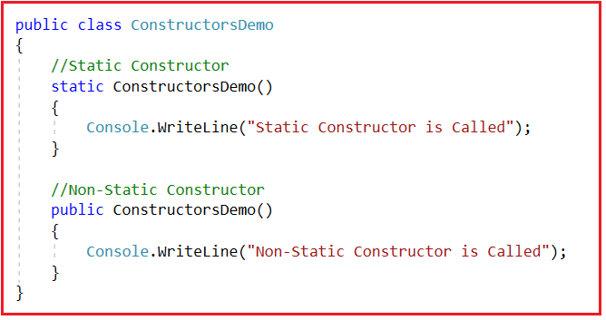
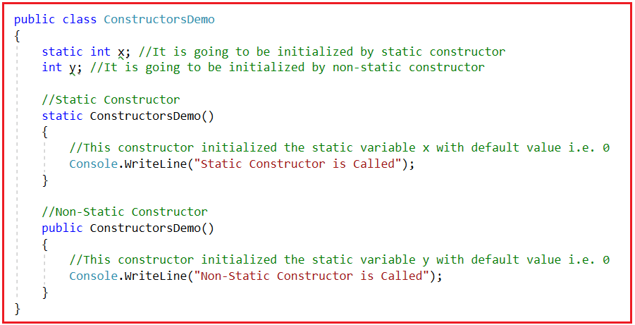
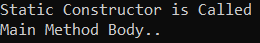
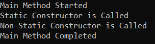
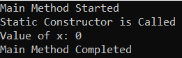
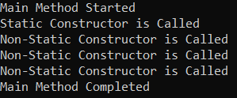
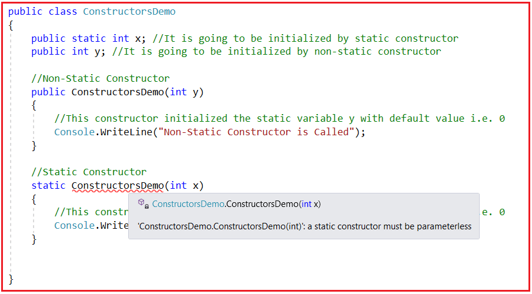
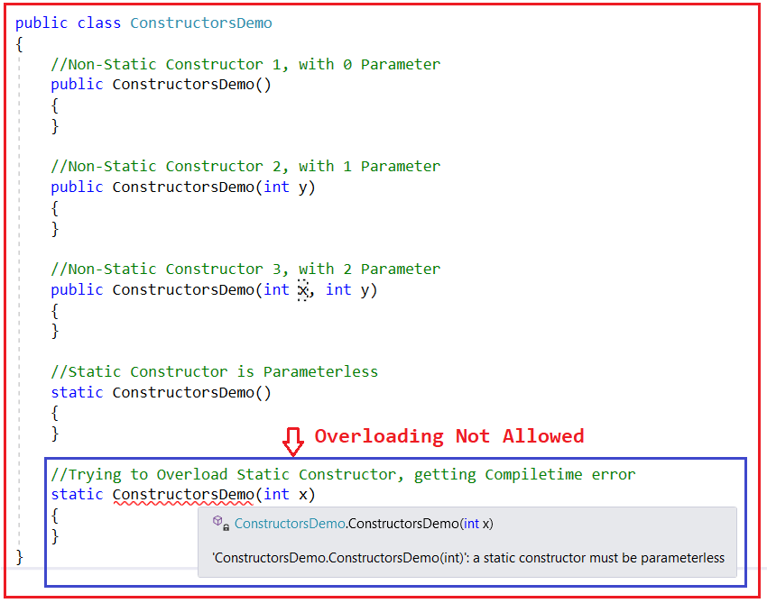

## **سازنده‌های استاتیک در مقابل سازنده‌های غیر استاتیک در سی شارپ به همراه مثال**

در این مقاله، قصد دارم **به همراه مثال‌هایی، در مورد سازنده‌های استاتیک در مقابل سازنده‌های غیر استاتیک در سی‌شارپ** بحث کنم. لطفاً مقاله قبلی ما را که در آن به بررسی چرایی نیاز به سازنده‌ها در سی‌شارپ پرداختیم، مطالعه کنید.

#### **سازنده‌های استاتیک در مقابل سازنده‌های غیر استاتیک در سی شارپ**

##### **نکته ۱:**

اگر یک سازنده به طور صریح با استفاده از اصلاحگر static تعریف شود، آن سازنده را سازنده static می‌نامیم در حالی که بقیه سازنده‌ها فقط سازنده non-static نامیده می‌شوند. برای درک بهتر، لطفاً به کد زیر نگاهی بیندازید. سازنده‌های non-static در C# به عنوان سازنده‌های نمونه نیز شناخته می‌شوند.



##### **نکته ۲:**

سازنده‌ها مسئول مقداردهی اولیه فیلدها یا متغیرهای یک کلاس هستند. فیلدها/متغیرهای استاتیک توسط سازنده‌های استاتیک و فیلدها/متغیرهای غیر استاتیک توسط سازنده‌های غیر استاتیک یا نمونه در C# مقداردهی اولیه می‌شوند. برای درک بهتر، لطفاً به کد زیر نگاهی بیندازید. در اینجا، هر دو متغیر x و y با مقدار پیش‌فرض یعنی 0 مقداردهی اولیه شده‌اند. متغیر x توسط یک سازنده استاتیک مقداردهی اولیه می‌شود در حالی که متغیر y توسط یک سازنده غیر استاتیک مقداردهی اولیه می‌شود.



##### **نکته ۳:**

سازنده‌های استاتیک به طور ضمنی فراخوانی می‌شوند در حالی که سازنده‌های غیر استاتیک به طور صریح فراخوانی می‌شوند. برای درک بهتر، لطفاً به مثال زیر نگاهی بیندازید. در اینجا، اجرای برنامه همیشه از متد Main شروع می‌شود. در مثال زیر، متد Main و سازنده‌های استاتیک، هر دو در کلاس‌های یکسانی حضور دارند. بنابراین، قبل از اجرای بدنه متد Main، سازنده استاتیک کلاس اجرا می‌شود زیرا سازنده استاتیک اولین بلوک کدی است که تحت یک کلاس اجرا می‌شود و پس از اتمام اجرای سازنده استاتیک، بدنه متد Main اجرا می‌شود. بنابراین، وقتی کد زیر را اجرا می‌کنید، خواهید دید که ابتدا سازنده استاتیک اجرا می‌شود و سپس فقط متد Main اجرا می‌شود.

```csharp
using System;

namespace ConstructorDemo
{
    public class ConstructorsDemo
    {
        static int x; //It is going to be initialized by static constructor
        int y; //It is going to be initialized by non-static constructor

        //Static Constructor
        static ConstructorsDemo()
        {
            //This constructor initialized the static variable x with default value i.e. 0
            Console.WriteLine("Static Constructor is Called");
        }

        //Non-Static Constructor
        public ConstructorsDemo()
        {
            //This constructor initialized the static variable y with default value i.e. 0
            Console.WriteLine("Non-Static Constructor is Called");
        }

        //Main Method is the Entry Point for our Application Execution
        static void Main(string[] args)
        {
            //Before Executing the body of Main Method, Static Constructor is executed
            Console.WriteLine("Main Method Body..");
            Console.ReadKey();
        }
    }
}
```

###### **خروجی:**



اگر توجه کرده باشید، ما سازنده‌ی استاتیک را در هیچ کجای کد خود فراخوانی نکردیم، اما اجرا می‌شود. این یعنی، همیشه به صورت ضمنی فراخوانی می‌شود. در مثال بالا، ما سازنده‌های غیر استاتیک را فراخوانی نکرده‌ایم و از این رو سازنده‌ی غیر استاتیک اجرا نمی‌شود.

##### **نکته ۴:**

سازنده‌های ایستا بلافاصله پس از شروع اجرای یک کلاس اجرا می‌شوند و علاوه بر این، اولین بلوک کدی است که تحت یک کلاس اجرا می‌شود در حالی که سازنده‌های غیر ایستا فقط پس از ایجاد نمونه از کلاس و همچنین هر بار که نمونه‌ای از کلاس ایجاد می‌شود، اجرا می‌شوند.

برای درک بهتر، لطفاً به مثال زیر نگاهی بیندازید. در مثال زیر، متد Main و سازنده‌های Static در دو کلاس مختلف وجود دارند. بنابراین، اجرای برنامه از متد Main آغاز می‌شود و شروع به اجرای بدنه متد Main می‌کند. سپس در داخل متد Main، نمونه‌ای از کلاس ConstructorsDemo ایجاد می‌کنیم، یعنی سعی داریم کلاس ConstructorsDemo را برای اولین بار اجرا کنیم و از آنجایی که این کلاس دارای یک سازنده Static است، آن سازنده Static به طور ضمنی فراخوانی می‌شود و به محض اینکه سازنده Static اجرای خود را کامل کند، فقط نمونه ایجاد می‌شود و سازنده غیر Static اجرا می‌شود.

```csharp
using System;

namespace ConstructorDemo
{
    class Program
    {
        //Main Method is the Entry Point for our Application Execution
        static void Main(string[] args)
        {
            Console.WriteLine("Main Method Started");

            //Creating Object of ConstructorsDemo
            //Now the ConstructorsDemo class Execution Start
            //First, it will execute the Static constructor
            //Then it will execute the non-static constructor
            ConstructorsDemo obj = new ConstructorsDemo();
            Console.WriteLine("Main Method Completed");
            Console.ReadKey();
        }
    }

    public class ConstructorsDemo
    {
        static int x; //It is going to be initialized by static constructor
        int y; //It is going to be initialized by non-static constructor

        //Static Constructor
        static ConstructorsDemo()
        {
            //This constructor initialized the static variable x with default value i.e. 0
            Console.WriteLine("Static Constructor is Called");
        }

        //Non-Static Constructor
        public ConstructorsDemo()
        {
            //This constructor initialized the static variable y with default value i.e. 0
            Console.WriteLine("Non-Static Constructor is Called");
        }
    }
}
```

###### **خروجی:**



در مثال بالا، اجرا به صورت زیر انجام می‌شود:

1. ابتدا، متد Main از کلاس Program اجرای خود را آغاز می‌کند، زیرا نقطه ورود برنامه ما است.
2. سپس سازنده‌ی استاتیک کلاس ConstructorsDemo اجرا می‌شود.
3. سپس سازنده غیر استاتیک کلاس ConstructorsDemo اجرا می‌شود.
4. در نهایت، متد Main اجرای خود را کامل می‌کند.

##### **نکته ۵:**

سازنده‌های استاتیک فقط یک بار اجرا می‌شوند در حالی که سازنده‌های غیر استاتیک بسته به تعداد نمونه‌هایی که برای کلاس ایجاد کرده‌ایم، 0 یا n بار اجرا می‌شوند. برای درک بهتر، لطفاً به مثال زیر نگاهی بیندازید. در مثال زیر، جایی که سعی می‌کنیم متغیر استاتیک را با استفاده از نام کلاس ConstructorsDemo فراخوانی کنیم، ابتدا سازنده استاتیک به طور ضمنی فراخوانی می‌شود. از آنجایی که ما در حال ایجاد نمونه‌ای برای کلاس ConstructorsDemo نیستیم، سازنده غیر استاتیک اجرا نخواهد شد.

```csharp
using System;

namespace ConstructorDemo
{
    class Program
    {
        //Main Method is the Entry Point for our Application Execution
        static void Main(string[] args)
        {
            Console.WriteLine("Main Method Started");

            //As soon as it finds ConstructorsDemo.x,
            //it will first execute the static constructor of the class
            Console.WriteLine(ConstructorsDemo.x);

            Console.WriteLine("Main Method Completed");
            Console.ReadKey();
        }
    }

    public class ConstructorsDemo
    {
        public static int x; //It is going to be initialized by static constructor
        public int y; //It is going to be initialized by non-static constructor

        //Static Constructor
        static ConstructorsDemo()
        {
            //This constructor initialized the static variable x with default value i.e. 0
            Console.WriteLine("Static Constructor is Called");
        }

        //Non-Static Constructor
        public ConstructorsDemo()
        {
            //This constructor initialized the static variable y with default value i.e. 0
            Console.WriteLine("Non-Static Constructor is Called");
        }
    }
}
```

###### **خروجی:**



حال، لطفاً به مثال زیر نگاهی بیندازید. در اینجا، ما در حال ایجاد ۳ نمونه از کلاس ConstructorsDemo هستیم. در این حالت، وقتی نمونه اول را ایجاد می‌کنیم، قبل از اجرای سازنده غیر استاتیک، ابتدا سازنده استاتیک اجرا می‌شود. پس از اجرای سازنده استاتیک، سازنده غیر استاتیک شروع به اجرا می‌کند. این اتفاق فقط برای اولین نمونه از زمان ایجاد رخ می‌دهد. از زمان ایجاد نمونه دوم، سازنده استاتیک اجرا نخواهد شد. بنابراین، وقتی کد بالا را اجرا می‌کنید، خواهید دید که سازنده استاتیک فقط یک بار و سازنده غیر استاتیک سه بار اجرا می‌شود.

```csharp
using System;

namespace ConstructorDemo
{
    class Program
    {
        //Main Method is the Entry Point for our Application Execution
        static void Main(string[] args)
        {
            Console.WriteLine("Main Method Started");

            //Before Executing the non-static constructor
            //it will first execute the static constructor of the class
            ConstructorsDemo obj1 = new ConstructorsDemo();

            //Now, onwards it will not execute the static constructor,
            //Because static constructor executed only once
            ConstructorsDemo obj2 = new ConstructorsDemo();
            ConstructorsDemo obj3 = new ConstructorsDemo();

            Console.WriteLine("Main Method Completed");
            Console.ReadKey();
        }
    }

    public class ConstructorsDemo
    {
        public static int x; //It is going to be initialized by static constructor
        public int y; //It is going to be initialized by non-static constructor

        //Static Constructor
        static ConstructorsDemo()
        {
            //This constructor initialized the static variable x with default value i.e. 0
            Console.WriteLine("Static Constructor is Called");
        }

        //Non-Static Constructor
        public ConstructorsDemo()
        {
            //This constructor initialized the static variable y with default value i.e. 0
            Console.WriteLine("Non-Static Constructor is Called");
        }
    }
}
```

###### **خروجی:**



##### **چه زمانی سازنده استاتیک یک کلاس در سی شارپ اجرا می‌شود؟**

برای ما بسیار مهم است که بفهمیم چه زمانی سازنده استاتیک یک کلاس به صورت ضمنی اجرا می‌شود. در ادامه سه سناریو وجود دارد که در آنها سازنده استاتیک به صورت ضمنی اجرا می‌شود.

1. اگر هم سازنده‌ی استاتیک و هم متد Main در یک کلاس واحد وجود داشته باشند، اجرای برنامه از متد Main شروع می‌شود، اما قبل از اجرای بدنه‌ی متد Main، ابتدا سازنده‌ی استاتیک کلاس اجرا می‌شود.
2. وقتی برای اولین بار در یک کلاس، متغیرهای استاتیک یا متدهای استاتیک را فراخوانی می‌کنیم، سازنده استاتیک آن کلاس اجرا می‌شود.
3. وقتی برای اولین بار از یک کلاس نمونه‌ای ایجاد می‌کنیم، قبل از اجرای سازنده‌ی غیراستاتیک، ابتدا سازنده‌ی استاتیک آن کلاس اجرا می‌شود.

مهمترین نکته‌ای که باید به خاطر داشته باشید این است که سازنده‌های استاتیک صرف نظر از تعداد دفعاتی که متغیرهای استاتیک یا متدهای استاتیک را فراخوانی کرده‌اید یا صرف نظر از تعداد دفعاتی که نمونه‌ای از کلاس ایجاد کرده‌اید، فقط یک بار اجرا می‌شوند.

**نکته:** در چرخه حیات یک کلاس (چرخه حیات به این معنا که از لحظه شروع اجرا تا پایان کلاس، یک چرخه حیات در نظر گرفته می‌شود)، سازنده استاتیک یک بار و فقط یک بار اجرا می‌شود در حالی که سازنده‌های غیر استاتیک اگر هیچ نمونه‌ای ایجاد نشود، 0 بار و اگر n تعداد نمونه ایجاد شود، n بار اجرا می‌شوند.

##### **نکته ۶:**

سازنده‌های غیراستاتیک می‌توانند پارامتردهی شوند در حالی که سازنده‌های استاتیک نمی‌توانند هیچ پارامتری داشته باشند. دلیل این امر این است که ما سازنده‌های غیراستاتیک را صریحاً فراخوانی می‌کنیم، بنابراین می‌توانیم شانس ارسال پارامترها را داشته باشیم. از سوی دیگر، سازنده‌های استاتیک به طور ضمنی فراخوانی می‌شوند و اولین بلوک کدی هستند که تحت یک کلاس اجرا می‌شوند و از این رو ما هیچ شانسی برای ارسال پارامترها نداریم. برای درک بهتر، لطفاً به کد زیر نگاهی بیندازید. بنابراین، یک سازنده استاتیک باید در C# بدون پارامتر باشد.



##### **نکته ۷:**

سازنده‌های غیراستاتیک می‌توانند سربارگذاری شوند در حالی که سازنده‌های استاتیک نمی‌توانند سربارگذاری شوند. سربارگذاری چیزی است که بر اساس پارامترها مطرح می‌شود. از آنجایی که در مورد سازنده‌های غیراستاتیک، ما شانس ارسال پارامترها را داریم، سربارگذاری امکان‌پذیر است. از سوی دیگر، ما نمی‌توانیم پارامترها را به سازنده‌های استاتیک ارسال کنیم، یعنی سازنده‌های استاتیک بدون پارامتر هستند و از این رو سربارگذاری امکان‌پذیر نیست. برای درک بهتر، لطفاً به کد زیر نگاهی بیندازید.



##### **نکته ۸:**

هر کلاسی اگر به طور صریح تعریف نشده باشد، شامل یک سازنده ضمنی است و آن سازنده‌های ضمنی بر اساس معیارهای زیر تعریف می‌شوند.

1. هر کلاسی به جز کلاس استاتیک، اگر با سازنده صریح تعریف نشده باشد، حاوی یک سازنده غیراستاتیک ضمنی است.
2. سازنده‌های استاتیک فقط در صورتی به صورت ضمنی تعریف می‌شوند که آن کلاس حاوی فیلدهای استاتیک باشد، در غیر این صورت آن سازنده وجود نخواهد داشت، مشروط بر اینکه کلاس سازنده استاتیک صریحی نداشته باشد.

##### **خلاصه‌ای از سازنده‌های استاتیک و غیر استاتیک:**

1. سازنده (Constructor) یک متد خاص درون یک کلاس است که برای مقداردهی اولیه اعضای داده استفاده می‌شود. اگر سازنده را با استفاده از یک اصلاح‌کننده استاتیک ایجاد کنیم، آن را سازنده استاتیک می‌نامیم و بقیه فقط سازنده‌های غیر استاتیک هستند.
2. سازنده استاتیک برای مقداردهی اولیه اعضای داده استاتیک و سازنده غیر استاتیک برای مقداردهی اولیه اعضای داده غیر استاتیک یک کلاس استفاده می‌شود.
3. سازنده استاتیک همیشه به صورت ضمنی فراخوانی می‌شود در حالی که سازنده غیر استاتیک همیشه به صورت صریح فراخوانی می‌شود.
4. اگر هیچ سازنده‌ای را به صراحت تعریف نکرده باشیم، کامپایلر در شرایط زیر سازنده ضمنی را ارائه می‌دهد.
5. برای یک کلاس استاتیک، کامپایلر به طور ضمنی یک سازنده استاتیک ارائه می‌دهد، اما هیچ سازنده غیر استاتیکی ارائه نمی‌دهد.
6. برای یک کلاس غیر استاتیک، کامپایلر یک سازنده غیر استاتیک ارائه می‌دهد، اگر کلاس غیر استاتیک عضو استاتیک داشته باشد، فقط کامپایلر سازنده استاتیک را ارائه می‌دهد.
7. سازنده‌های استاتیک فقط یک بار در طول چرخه حیات یک کلاس اجرا می‌شوند و سازنده‌های غیر استاتیک 0 یا n بار اجرا می‌شوند. اگر هیچ شیء‌ای ایجاد نکرده باشیم، سازنده 0 بار اجرا می‌شود و اگر n تعداد شیء ایجاد کنیم، سازنده n تعداد بار اجرا می‌شود.
8. در یک کلاس، ما فقط می‌توانیم یک سازنده استاتیک داشته باشیم و یعنی خیلی بدون پارامتر است، و از این رو سازنده استاتیک نمی‌تواند سربارگذاری شود. اما، در یک کلاس، می‌توانیم هر تعداد سازنده غیر استاتیک تعریف کنیم و از این رو سازنده‌های غیر استاتیک به عنوان سربارگذاری شده تعریف می‌شوند.
9. یک سازنده استاتیک زمانی اجرا می‌شود که اجرای کلاس ما شروع شود و فقط یک بار اجرا می‌شود و اولین بلوک درون یک کلاس خواهد بود که اجرا می‌شود، در حالی که سازنده‌های غیر استاتیک زمانی اجرا می‌شوند که ما یک نمونه از یک کلاس ایجاد می‌کنیم و برای هر نمونه از کلاس.

بنابراین، اینها همه تفاوت‌های بین سازنده‌های ایستا و غیرایستا در سی‌شارپ هستند. برای کسب اطلاعات بیشتر در مورد سازنده‌ها، لطفاً به موارد زیر مراجعه کنید.

**سازنده‌ها در سی شارپ**
**انواع سازنده‌ها در سی شارپ**
**نحوه استفاده از سازنده‌ها در توسعه برنامه‌های بلادرنگ با استفاده از سی شارپ