## **جمع‌آوری زباله در چارچوب دات‌نت**

در این مقاله، من در **مورد جمع‌آوری زباله (Garbage Collection) در چارچوب .NET** با مثال‌ها بحث خواهم کرد. در پایان این مقاله، شما خواهید فهمید که جمع‌آوری زباله در .NET چیست و چگونه کار می‌کند. به عنوان بخشی از این مقاله، نکات زیر را با جزئیات مورد بحث قرار خواهیم داد.

1. **جمع آوری زباله در C#.NET چیست؟**
2. **نسل‌های مختلف جمع‌آوری زباله کدامند؟**
3. **چگونه از .NET Memory Profiler برای بررسی نسل‌های مختلف garbage collection استفاده می‌کنید؟**
4. **چگونه استفاده از یک مخرب در یک کلاس منجر به یک حلقه جمع‌آوری زباله مضاعف می‌شود؟**
5. **چگونه می‌توانیم مسائل حلقه دوگانه را با استفاده از الگوهای Finalize Dispose حل کنیم؟**

##### **جمع آوری زباله (Garbage Collection) در چارچوب دات نت چیست؟**

وقتی یک برنامه‌ی دات نت اجرا می‌شود، تعداد زیادی شیء ایجاد می‌شود. در یک نقطه‌ی زمانی مشخص، ممکن است که برنامه از برخی از آن اشیاء استفاده نکند. Garbage Collector در چارچوب دات نت چیزی جز یک روتین کوچک نیست، یا می‌توان گفت که یک Thread‌ی پردازش پس‌زمینه است که به صورت دوره‌ای اجرا می‌شود و سعی می‌کند اشیاء مورد استفاده‌ی فعلی برنامه را شناسایی کند و حافظه‌ی آن اشیاء را آزاد کند.

بنابراین، Garbage Collector چیزی جز یک ویژگی ارائه شده توسط CLR نیست که به ما کمک می‌کند اشیاء مدیریت شده بلااستفاده را پاک یا نابود کنیم. پاک کردن یا نابود کردن آن اشیاء مدیریت شده بلااستفاده اساساً حافظه را بازیابی می‌کند.

جمع‌آوری زباله (GC) در چارچوب .NET یک سیستم مدیریت حافظه خودکار است که به مدیریت تخصیص و آزادسازی حافظه در برنامه‌های شما کمک می‌کند. در .NET، وقتی ما با استفاده از کلمه کلیدی new یک شیء ایجاد می‌کنیم، به طور خودکار حافظه را در هیپ مدیریت‌شده اختصاص می‌دهد. نیازی نیست که حافظه را به طور صریح اختصاص دهید یا از تخصیص خارج کنید، همانطور که ممکن است در زبان‌هایی مانند C یا C++ انجام دهید.

**نکته:** Garbage Collector فقط اشیاء مدیریت‌شده‌ی استفاده‌نشده را از بین می‌برد. اشیاء مدیریت‌نشده را پاک نمی‌کند.

##### **اشیاء مدیریت‌شده و مدیریت‌نشده در چارچوب دات‌نت:**

بیایید اشیاء مدیریت‌شده و مدیریت‌نشده را درک کنیم. هر زمان که ما هر فایل اجرایی (EXE) (مثلاً برنامه کنسول، برنامه ویندوز و غیره) یا برنامه وب (مثلاً ASP.NET MVC، Web API، ASP.NET، Class Library و غیره) را در چارچوب دات‌نت با استفاده از ویژوال استودیو و با استفاده از هر زبان برنامه‌نویسی پشتیبانی‌شده توسط دات‌نت مانند C#، VB، F# و غیره ایجاد می‌کنیم، این برنامه‌ها کاملاً تحت کنترل CLR (Common Language Runtime) اجرا می‌شوند. این بدان معناست که اگر برنامه‌های شما اشیاء استفاده‌نشده‌ای داشته باشند، CLR آن اشیاء را با استفاده از Garbage Collector پاک می‌کند.

فرض کنید شما از فایل‌های اجرایی شخص ثالث دیگری نیز در برنامه دات‌نت خود استفاده کرده‌اید، مانند اسکایپ، پاورپوینت، مایکروسافت اکسل و غیره. این «فایل‌های اجرایی» در دات‌نت ساخته نشده‌اند. آن‌ها با استفاده از زبان‌های برنامه‌نویسی دیگری مانند C، C++، جاوا و غیره ساخته شده‌اند.

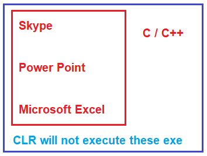

وقتی از این «فایل‌های اجرایی» (EXE) در برنامه خود استفاده می‌کنید، توسط CLR اجرا نمی‌شوند. حتی اگر این «فایل‌های اجرایی» را در برنامه‌های دات‌نت اجرا کنید، آنها تحت محیط خودشان اجرا می‌شوند. به عنوان مثال، اگر یک فایل اجرایی با استفاده از C یا C++ توسعه داده شده باشد، آن فایل اجرایی تحت محیط اجرایی C یا C++ اجرا خواهد شد. در همین راستا، اگر فایل اجرایی با استفاده از VB6 ایجاد شده باشد، تحت محیط اجرایی VB6 اجرا خواهد شد.

کدهایی که تحت کنترل کامل CLR اجرا می‌شوند، در چارچوب .NET، کد مدیریت‌شده نامیده می‌شوند. CLR تمام امکانات و ویژگی‌های .NET مانند قابلیت همکاری زبان‌ها، مدیریت خودکار حافظه، مکانیسم مدیریت استثنا، امنیت دسترسی به کد و غیره را در اختیار اجرای کد مدیریت‌شده قرار می‌دهد.

از طرف دیگر، اسکایپ، پاورپوینت و مایکروسافت اکسل نیازی به زمان اجرای دات نت ندارند. آنها تحت محیط خودشان اجرا می‌شوند. بنابراین، به طور خلاصه، کدی (EXE، برنامه وب) که تحت کنترل CLR اجرا نمی‌شود، کد مدیریت نشده نامیده می‌شود. CLR هیچ گونه امکانات و ویژگی‌های .NET را در اجرای کد مدیریت نشده C# مانند قابلیت همکاری زبان، مدیریت خودکار حافظه، مکانیسم مدیریت استثنا، امنیت دسترسی به کد و غیره ارائه نمی‌دهد.

##### **اشیاء مدیریت شده:**

اشیاء مدیریت‌شده روی پشته مدیریت‌شده تخصیص داده می‌شوند و توسط زباله‌روب دات‌نت (GC) کنترل می‌شوند. این اشیاء معمولاً نمونه‌هایی از کلاس‌ها و ساختارهای تعریف‌شده در دات‌نت هستند. زباله‌روب به‌طور خودکار حافظه را برای اشیاء مدیریت‌شده مدیریت می‌کند. حافظه را برای این اشیاء تخصیص داده و آزاد می‌کند و بهینه‌سازی‌های حافظه مانند فشرده‌سازی را انجام می‌دهد. نمونه‌هایی از اشیاء مدیریت‌شده عبارتند از هر نمونه‌ای از یک کلاس یا ساختار که با استفاده از کلمه کلیدی new در C# یا VB.NET ایجاد شده است و اشیاء ایجاد شده در زبان‌های دات‌نت مانند آرایه‌ها، رشته‌ها و غیره.

##### **اشیاء مدیریت نشده:**

اشیاء مدیریت نشده اشیاء هستند که حافظه آنها توسط .NET GC مدیریت نمی‌شود. اینها معمولاً اشیاء هستند که با استفاده از کد بومی، مانند فراخوانی API ویندوز یا استفاده از زبان‌هایی مانند C یا C++، اختصاص داده می‌شوند. توسعه‌دهنده مسئول تخصیص و آزادسازی حافظه برای اشیاء مدیریت نشده است. این کار معمولاً با استفاده از APIهایی مانند malloc و free در C یا new و delete در C++ انجام می‌شود. نمونه‌هایی از اشیاء مدیریت نشده عبارتند از: دستگیره‌های فایل، اتصالات پایگاه داده، اشیاء COM یا هر منبع دیگری که توسط زمان اجرای .NET مدیریت نمی‌شود.

##### **نسل‌های جمع‌آوری زباله در چارچوب دات‌نت:**

بیایید بفهمیم نسل‌های جمع‌آوری زباله چیستند و چگونه بر عملکرد جمع‌آوری زباله تأثیر می‌گذارند. سه نسل وجود دارد. آنها نسل ۰، نسل ۱ و نسل ۲ هستند.

##### **درک نسل ۰، ۱ و ۲:**

فرض کنید یک برنامه ساده به نام App1 دارید. به محض شروع برنامه، 5 شیء مدیریت‌شده ایجاد می‌کند. هر زمان که اشیاء جدیدی (اشیاء تازه) ایجاد می‌شوند، به سطلی به نام Generation 0 منتقل می‌شوند. برای درک بهتر، لطفاً به تصویر زیر نگاهی بیندازید.

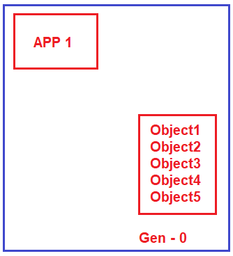

ما می‌دانیم که قهرمان ما، آقای Garbage Collector، به طور مداوم به عنوان یک نخ پردازش پس‌زمینه اجرا می‌شود تا بررسی کند که آیا اشیاء مدیریت‌شده‌ی بلااستفاده‌ای وجود دارند یا خیر، تا با پاکسازی آن اشیاء، حافظه را بازیابی کند. حال، فرض کنید برنامه به دو شیء (Object1 و Object2) نیاز ندارد. بنابراین، Garbage Collector این دو شیء (Object1 و Object2) را از بین می‌برد و حافظه را از سطل نسل 0 بازیابی می‌کند. اما برنامه هنوز به سه شیء باقی‌مانده (Object3، Object4 و Object5) نیاز دارد. بنابراین، Garbage Collector آن سه شیء را پاکسازی نمی‌کند. Garbage Collector آن سه شیء مدیریت‌شده (Object3، Object4 و Object5) را همانطور که در تصویر زیر نشان داده شده است، به سطل نسل 1 منتقل می‌کند.

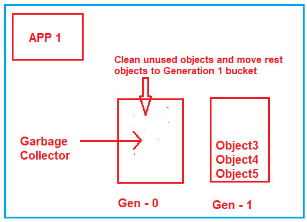

فرض کنید برنامه شما دو شیء جدید دیگر (Object6 و Object7) ایجاد می‌کند. به عنوان اشیاء جدید، آنها باید در سطل نسل ۰ ایجاد شوند، همانطور که در تصویر زیر نشان داده شده است.

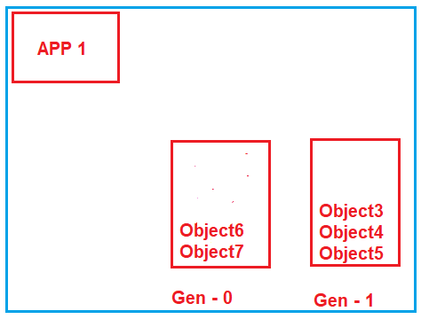

حالا، دوباره، Garbage Collector اجرا می‌شود و به سراغ سطل نسل ۰ می‌رود و بررسی می‌کند که کدام اشیاء استفاده شده‌اند. فرض کنید هر دو شیء (Object6 و Object7) توسط برنامه استفاده نشده باشند، بنابراین هر دو شیء را حذف کرده و حافظه را بازپس می‌گیرد. حالا، به سراغ سطل نسل ۱ می‌رود و بررسی می‌کند که کدام اشیاء استفاده نشده‌اند. فرض کنید برنامه هنوز به Object4 و Object5 نیاز دارد در حالی که به object3 نیازی ندارد. بنابراین، کاری که Garbage Collector انجام می‌دهد این است که Object3 را از بین می‌برد، حافظه را بازپس می‌گیرد و Object4 و Object5 را به سطل نسل ۲ منتقل می‌کند، همانطور که در تصویر زیر نشان داده شده است.

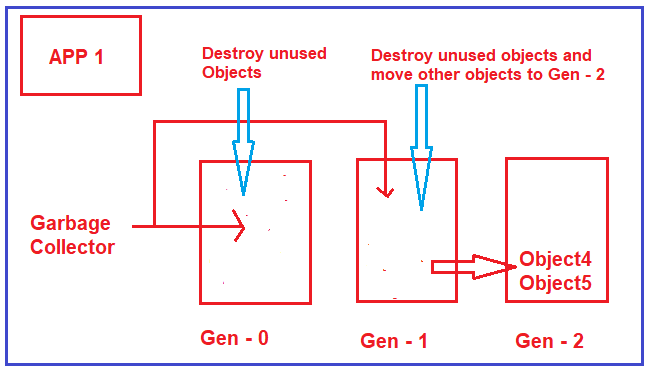

##### **نسل‌ها چیستند؟**

نسل‌ها چیزی نیستند، اما مدت زمان ماندگاری اشیاء در حافظه را تعیین می‌کنند. حال، سوالی که باید به ذهن شما خطور کند این است که چرا به نسل‌ها نیاز داریم؟ چرا سه نوع نسل مختلف داریم؟

##### **چرا به Generations نیاز داریم؟**

معمولاً وقتی با برنامه‌های بزرگ کار می‌کنیم، می‌توانند هزاران شیء ایجاد کنند. بنابراین، برای هر یک از این اشیاء، اگر Garbage Collector بررسی کند که آیا به آنها نیاز است یا خیر، این یک فرآیند واقعاً طاقت‌فرسا یا حجیم است. با ایجاد چنین نسل‌هایی، اگر یک شیء در سطل‌های نسل ۲ باشد، Garbage Collector بازدیدهای کمتری از این سطل انجام می‌دهد، به چه معناست؟ دلیل این امر این است که اگر یک شیء به نسل ۲ منتقل شود، مدت بیشتری در حافظه باقی می‌ماند. دلیلی ندارد که بارها و بارها به آنها مراجعه و آنها را بررسی کنیم.

بنابراین، به زبان ساده، می‌توان گفت که نسل‌های ۰، ۱ و ۲ به افزایش عملکرد Garbage Collector کمک خواهند کرد. هرچه اشیاء بیشتری در نسل ۰ وجود داشته باشد، عملکرد بهتر شده و حافظه به شیوه‌ای بهینه‌تر مورد استفاده قرار می‌گیرد.

**نکته:** برای روشن‌تر شدن نسل‌ها، از ابزاری به نام **.NET Memory Profiler** استفاده خواهیم کرد . اکنون، نحوه دانلود، نصب و استفاده از .NET Memory Profiler را با استفاده از برنامه کنسول سی‌شارپ به شما نشان خواهم داد تا بررسی کنید و ببینید که چگونه اشیاء در نسل‌های مختلف Garbage Collector ایجاد می‌شوند.

##### **نسل‌های جمع‌آوری زباله در چارچوب دات‌نت**

جمع‌آوری زباله (GC) در چارچوب .NET از یک مدل نسلی برای مدیریت کارآمدتر حافظه استفاده می‌کند. این مدل، اشیاء را بر اساس طول عمر و میزان بقای آنها در چرخه‌های GC، در سه نسل سازماندهی می‌کند. در اینجا مروری دقیق بر هر نسل ارائه شده است:

##### **نسل ۰**

1. **اشیاء با عمر کوتاه:** نسل ۰ (Gen 0) شامل اشیاء تازه ایجاد شده‌ای است که عمر کوتاهی دارند. اینها معمولاً اشیاء موقتی هستند.
2. **جمع‌آوری مکرر:** نسل ۰ بیشتر از نسل‌های دیگر جمع‌آوری می‌شود. اکثر اشیاء در این نسل برای جمع‌آوری زباله بازیابی می‌شوند زیرا عمر کوتاهی دارند.
3. **کارایی:** فرآیند جمع‌آوری عموماً سریع است زیرا تنها بخش کوچکی از هیپ را درگیر می‌کند.
4. **مثال:** متغیرهای موقت، اشیاء کوچک و اشیاء که به طور خلاصه در متدها استفاده می‌شوند.

##### **نسل ۱**

- **تولید بافر:** نسل ۱ (Gen 1) به عنوان یک بافر بین اشیاء با عمر کوتاه در نسل ۰ و اشیاء با عمر طولانی در نسل ۲ عمل می‌کند.
- **ارتقاء:** اشیایی که از نسل ۰ GC جان سالم به در می‌برند، به نسل ۱ ارتقا می‌یابند. اینها معمولاً اشیایی هستند که طول عمر بیشتری نسبت به نمونه‌های نسل ۰ دارند اما دائمی نیستند.
- **طول عمر متوسط:** نسل ۱ کمتر از نسل ۰ جمع‌آوری می‌شود. اشیاء در اینجا طول عمر متوسطی دارند.
- **مثال:** اشیایی که چندین چرخه GC را پشت سر می‌گذارند اما در طول عمر برنامه کاربردی استفاده نمی‌شوند.

##### **نسل ۲**

- **اشیاء با عمر طولانی:** نسل ۲ (Gen 2) شامل اشیاء با عمر طولانی است. اینها اشیاء هستند که از چندین دور GC در نسل‌های قبلی جان سالم به در برده‌اند.
- **کمترین میزان جمع‌آوری:** نسل ۲ کمتر از نسل ۰ و نسل ۱ جمع‌آوری می‌شود. فرآیند GC در اینجا می‌تواند زمان‌برتر باشد زیرا بخش بیشتری از هیپ را درگیر می‌کند.
- **مثال‌ها:** اشیاء استاتیک، اشیاء وابسته به حیات برنامه و اشیاء بزرگی که به منابع حافظه قابل توجهی نیاز دارند.

##### **پروفایلر حافظه دات نت چیست؟**

پروفایلر حافظه دات‌نت ابزاری قدرتمند برای یافتن نشتی‌های حافظه و بهینه‌سازی مصرف حافظه در برنامه‌های نوشته شده با زبان‌های سی‌شارپ، وی‌بی‌سی یا هر زبان دات‌نت دیگری است. با کمک راهنماهای پروفایلینگ، تحلیلگر خودکار حافظه و ردیاب‌های تخصصی، می‌توانید مطمئن شوید که برنامه شما هیچ نشتی حافظه یا منبعی ندارد و مصرف حافظه تا حد امکان بهینه است.

##### **چگونه می‌توان NET Memory Profiler . را دانلود کرد؟**

برای دانلود .NET Memory Profiler، لطفاً به لینک زیر مراجعه کنید.

[**https://memprofiler.com/**](https://memprofiler.com/)

پس از کلیک روی لینک بالا، صفحه وب زیر باز می‌شود. از صفحه زیر، همانطور که در تصویر زیر نشان داده شده است، روی دکمه دانلود نسخه آزمایشی رایگان کلیک کنید.

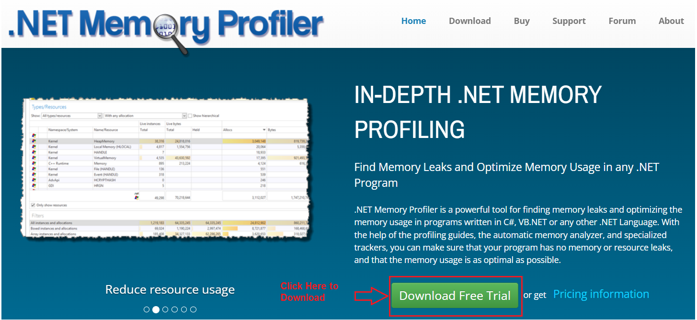

پس از کلیک بر روی دکمه‌ی «دانلود نسخه آزمایشی رایگان»، صفحه‌ی دیگری باز می‌شود که از شما می‌خواهد آدرس ایمیل خود را وارد کنید. می‌توانید آدرس ایمیل را وارد کنید یا بر روی دکمه‌ی «دانلود» کلیک کنید تا .NET Memory Profiler را دانلود کنید، همانطور که در تصویر زیر نشان داده شده است.

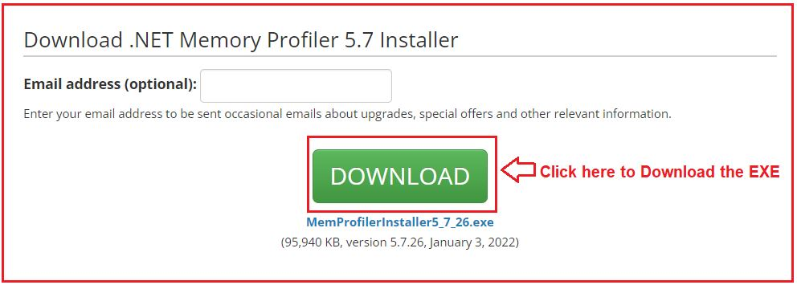

پس از کلیک بر روی دکمه دانلود، فایل اجرایی .NET Memory Profiler EXE دانلود می‌شود و پس از دانلود فایل اجرایی .NET Memory Profiler EXE، برای نصب آن روی فایل اجرایی دانلود شده کلیک کنید. پس از کلیک بر روی فایل اجرایی، پنجره توافقنامه مجوز زیر باز می‌شود. کافیست کادر انتخاب را علامت بزنید و مطابق تصویر زیر، روی دکمه بعدی کلیک کنید.

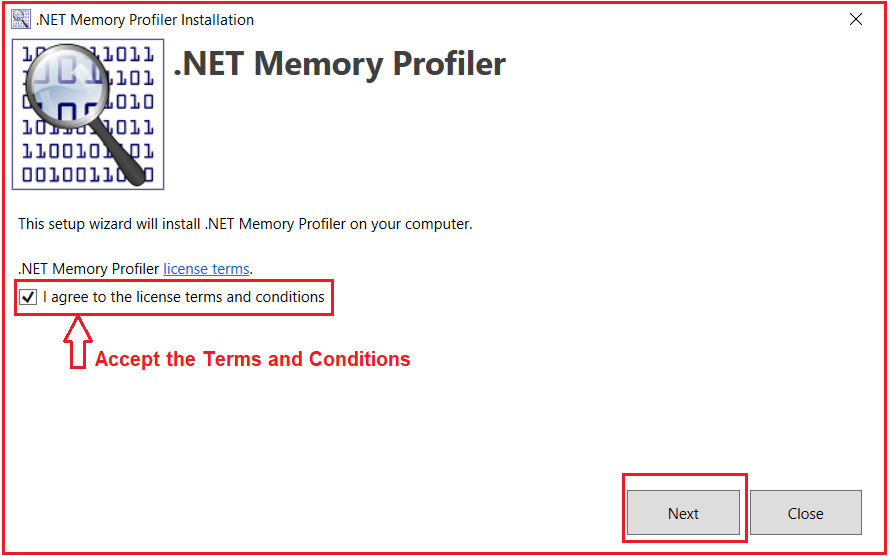

وقتی روی دکمه‌ی «بعدی» کلیک کنید، پنجره‌ی «ادغام با ویژوال استودیو» باز می‌شود. از آنجایی که من ویژوال استودیو ۲۰۱۷، ۲۰۱۹ و ۲۰۲۲ را نصب کرده‌ام، تمام گزینه‌ها را به من نشان می‌دهد و می‌خواهم از این پروفایلر حافظه‌ی دات‌نت با تمام نسخه‌ها استفاده کنم. بنابراین، تمام کادرهای انتخاب را علامت زدم و سپس همانطور که در تصویر زیر نشان داده شده است، روی دکمه‌ی «بعدی» کلیک کردم.

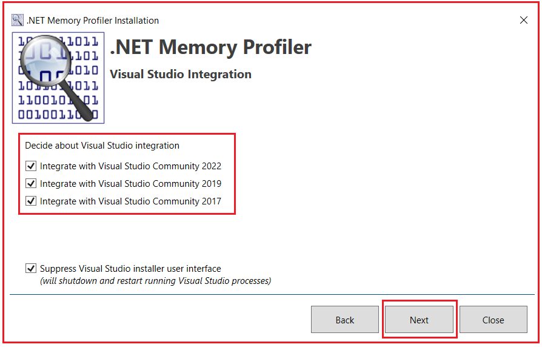

پس از کلیک بر روی دکمه Next، پنجره Ready to Install باز می‌شود. مطابق تصویر زیر، بر روی دکمه Install کلیک کنید.

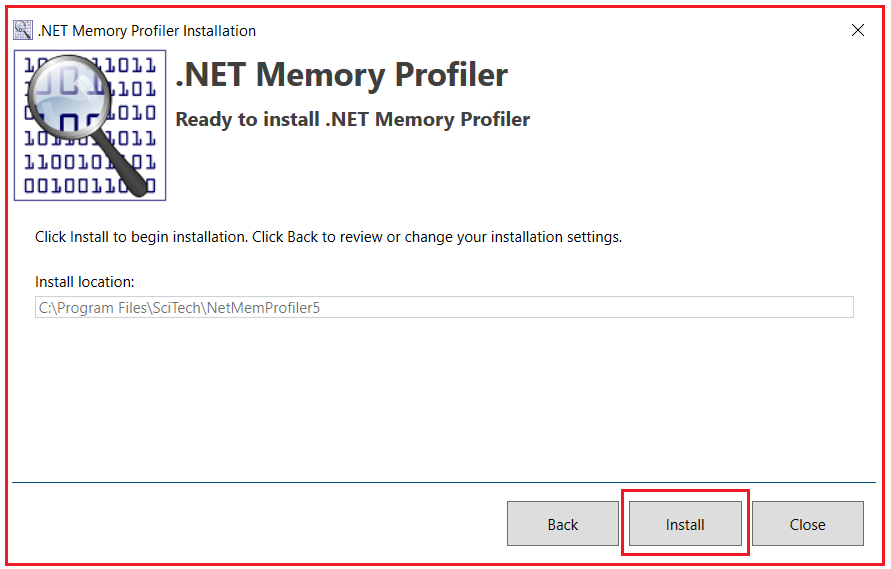

پس از کلیک بر روی دکمه‌ی نصب، از شما پرسیده می‌شود که آیا می‌خواهید تغییراتی در این رایانه ایجاد کنید، روی بله کلیک کنید تا نصب .NET Memory Profiler روی دستگاه شما شروع شود. پس از اتمام نصب، پیام زیر را دریافت خواهید کرد. برای بستن این پنجره، روی دکمه‌ی بستن کلیک کنید.

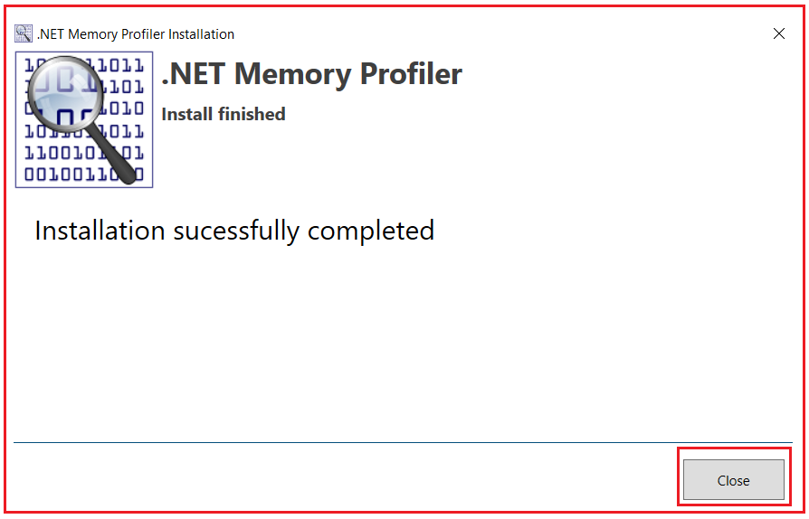

##### **ایجاد یک برنامه کنسول سی شارپ:**

حالا، یک برنامه کنسول با نام **GarbageCollectionDemo** در **دایرکتوری D:\\Projects\\** با استفاده از زبان C# ایجاد کنید، همانطور که در تصویر زیر نشان داده شده است.

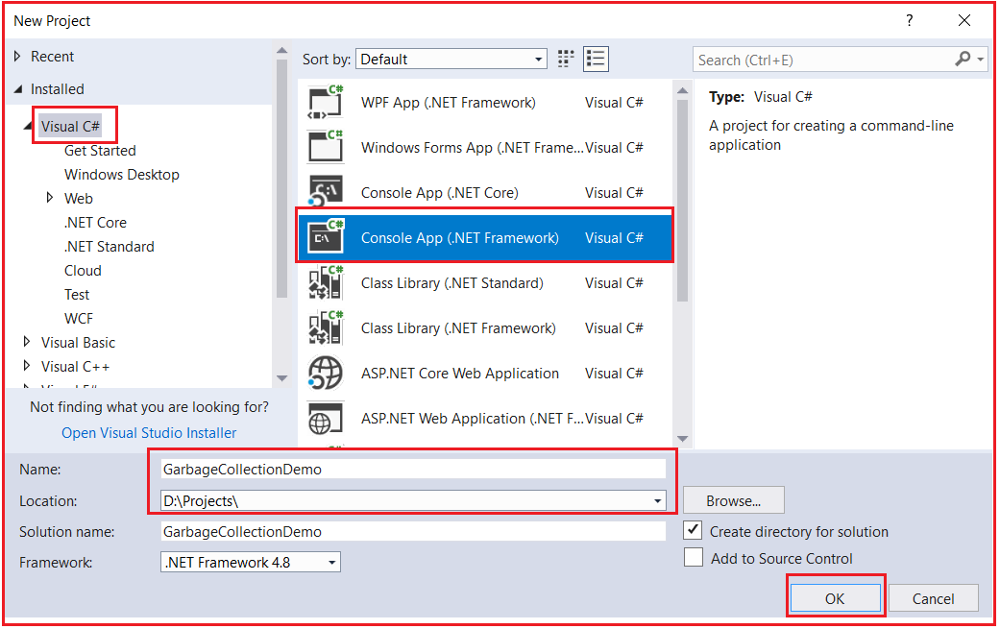

حالا، کد زیر را کپی و در کلاس Program قرار دهید. لطفاً توجه داشته باشید که ما در اینجا از destructor استفاده نمی‌کنیم.

```csharp
using System;

namespace GarbageCollectionDemo
{
    class Program
    {
        static void Main(string[] args)
        {
            for (int i = 0; i <= 1000000; i++)
            {
                MyClass1 obj1 = new MyClass1();
                MyClass2 obj2 = new MyClass2();
                MyClass3 obj3 = new MyClass3();
            }

            Console.Read();
        }
    }

    public class MyClass1
    {
    }

    public class MyClass2
    {
    }

    public class MyClass3
    {
    }
}
```

حالا، راه‌حل را بسازید و مطمئن شوید که هیچ خطایی وجود ندارد. حالا، این برنامه را با استفاده از .NET Memory Profiler اجرا می‌کنیم و نسل‌های مختلف garbage collectors را مشاهده خواهیم کرد.

##### **چگونه از .NET Memory Profiler برای اجرای برنامه کنسول سی شارپ استفاده می‌کنید؟**

نرم‌افزار .NET Memory Profiler را باز کنید، و پس از باز کردن آن، پنجره زیر را مشاهده خواهید کرد. از این پنجره، همانطور که در تصویر زیر نشان داده شده است، روی گزینه Profile Application کلیک کنید.

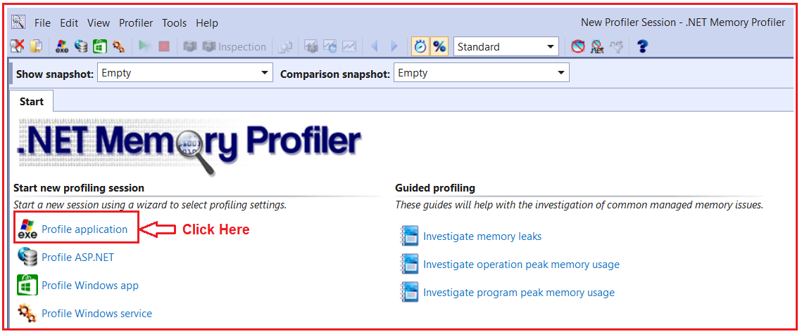

پس از کلیک روی گزینه درخواست پروفایل، پنجره زیر باز می‌شود. در این پنجره، مطابق تصویر زیر، روی دکمه مرور کلیک کنید.

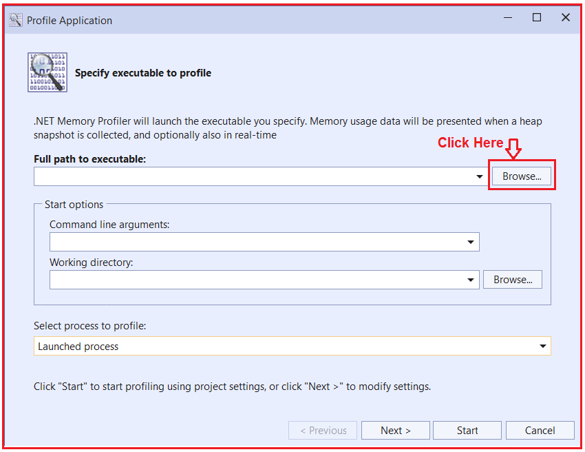

پس از کلیک بر روی دکمه‌ی Browse، فایل EXE، یعنی فایل موجود در پوشه‌ی Bin=>Deubg یا پروژه‌ی خود را انتخاب کنید و مطابق تصویر زیر، روی Open Folder کلیک کنید.

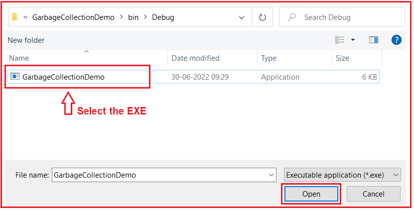

پس از کلیک بر روی دکمه Open، به پنجره Profile Application باز خواهید گشت و در اینجا، همانطور که در تصویر زیر نشان داده شده است، باید بر روی دکمه Start کلیک کنید.

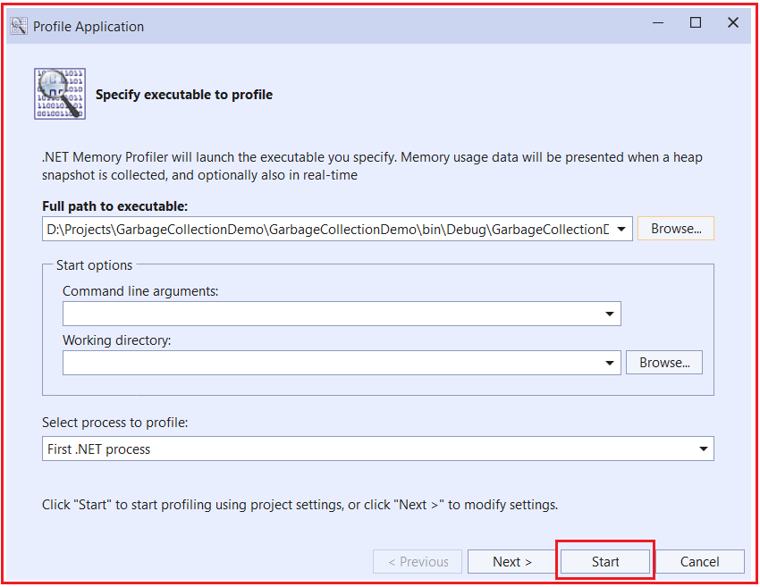

به محض اینکه روی دکمه‌ی شروع کلیک کنید، برنامه‌ی کنسول شما شروع به اجرا می‌کند و می‌توانید نسل‌ها را نیز مشاهده کنید. می‌توانید ببینید که بیشتر اشیاء در نسل ۰ هستند.

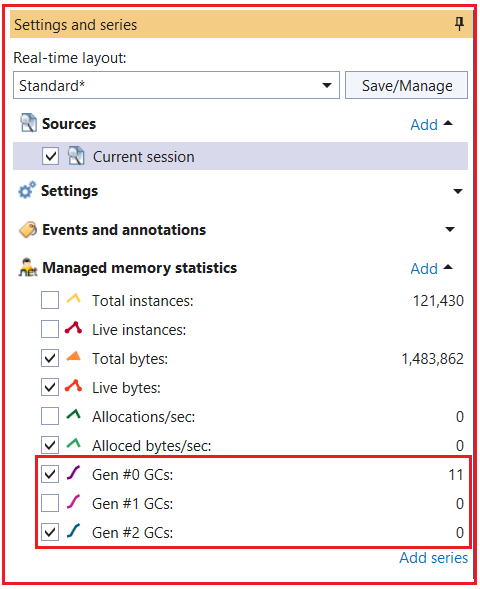

بنابراین، هرچه اشیاء بیشتری در نسل ۰ وجود داشته باشند، عملکرد بهتر شده و حافظه به شیوه‌ای بهینه‌تر مورد استفاده قرار می‌گیرد.

##### **چگونه استفاده از یک مخرب در یک کلاس منجر به حلقه‌ی جمع‌آوری زباله‌ی دوگانه می‌شود؟**

همانطور که قبلاً بحث کردیم، زباله‌روب‌ها فقط کد مدیریت‌شده را پاک می‌کنند. به عبارت دیگر، برای هر کد مدیریت‌نشده، برای اینکه آن کدها پاک شوند، باید توسط کد مدیریت‌نشده ارائه شوند و زباله‌روب هیچ کنترلی بر آنها برای پاک کردن حافظه ندارد.

برای مثال، فرض کنید یک کلاس MyClass در VB6 دارید. سپس باید یک تابع، مثلاً CleanUp() را نمایش دهید و در آن تابع، منطق مربوط به پاکسازی کد مدیریت نشده را بنویسید. برای شروع پاکسازی، باید آن متد (CleanUp()) را از کد دات نت خود فراخوانی کنید.

محلی که می‌خواهید عملیات پاکسازی را از آنجا فراخوانی کنید، مخرب یک کلاس است. به نظر می‌رسد این مکان بهترین مکان برای نوشتن کد پاکسازی باشد. اما، وقتی که عملیات پاکسازی را در یک مخرب می‌نویسید، یک مشکل بزرگ با آن همراه است. بیایید بفهمیم مشکل چیست.

وقتی یک تخریب‌کننده در کلاس خود تعریف می‌کنید، زباله‌روب قبل از تخریب شیء، از کلاس می‌پرسد که آیا تخریب‌کننده دارید یا خیر، اگر دارید، شیء را به سطل نسل بعدی منتقل کنید. به عبارت دیگر، شیء دارای تخریب‌کننده را در آن لحظه، حتی اگر استفاده نشود، پاک نمی‌کند. بنابراین، منتظر می‌ماند تا تخریب‌کننده اجرا شود و سپس می‌رود و شیء را پاک می‌کند. به همین دلیل، اشیاء بیشتری در نسل ۱ و نسل ۲ نسبت به نسل ۰ خواهید یافت.

##### **مثال استفاده از مخرب برای از بین بردن منابع مدیریت نشده:**

لطفاً به کد زیر نگاهی بیندازید. این همان مثال قبلی است، با این تفاوت که ما مخرب‌های مربوطه را در کلاس اضافه کرده‌ایم.

```csharp
using System;

namespace GarbageCollectionDemo
{
    class Program
    {
        static void Main(string[] args)
        {
            for (int i = 0; i <= 1000000; i++)
            {
                MyClass1 obj1 = new MyClass1();
                MyClass2 obj2 = new MyClass2();
                MyClass3 obj3 = new MyClass3();
            }

            Console.Read();
        }
    }

    public class MyClass1
    {
        ~MyClass1()
        {
            //Here, you need to write the code for
            //Unmanaged resource clean up
        }
    }

    public class MyClass2
    {
        ~MyClass2()
        {            
            //Here, you need to write the code for
            //Unmanaged resource clean up
        }
    }

    public class MyClass3
    {
        ~MyClass3()
        {
            //Here, you need to write the code for
            //Unmanaged resource clean up
        }
    }
}
```

حالا، solution را دوباره بسازید. حالا، .NET Memory Profile را ببندید و همان مراحل را برای اجرای برنامه کنسول با استفاده از .NET Memory Profiler دنبال کنید. این بار، همانطور که در تصویر زیر نشان داده شده است، مشاهده خواهید کرد که برخی از اشیاء نیز در نسل ۱ هستند.

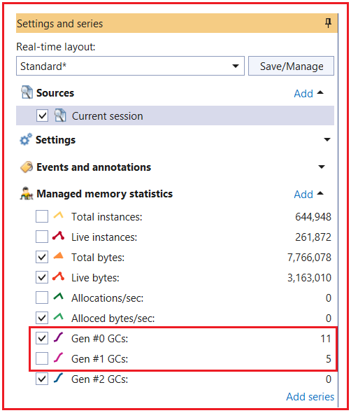

بنابراین، اگر کد پاکسازی را در مخرب خود می‌نویسید، اشیاء را در نسل ۱ و نسل ۲ ایجاد خواهید کرد، به این معنی که از حافظه به درستی استفاده نمی‌کنید.

##### **چگونه بر مشکل فوق غلبه کنیم؟**

این مشکل را می‌توان با استفاده از الگویی به نام الگوی Finalized Dispose برطرف کرد. برای پیاده‌سازی این الگو، کلاس شما باید رابط IDisposable را پیاده‌سازی کرده و پیاده‌سازی متد Dispose را فراهم کند. در داخل متد Dispose، باید کد پاکسازی اشیاء مدیریت نشده را بنویسید و در نهایت، باید متد GC.SuppressFinalize(true) را با ارسال مقدار ورودی true فراخوانی کنید. این متد هر نوع تخریب‌کننده‌ای را سرکوب می‌کند و فقط اشیاء را پاکسازی می‌کند. برای درک بهتر، لطفاً به تصویر زیر نگاهی بیندازید.

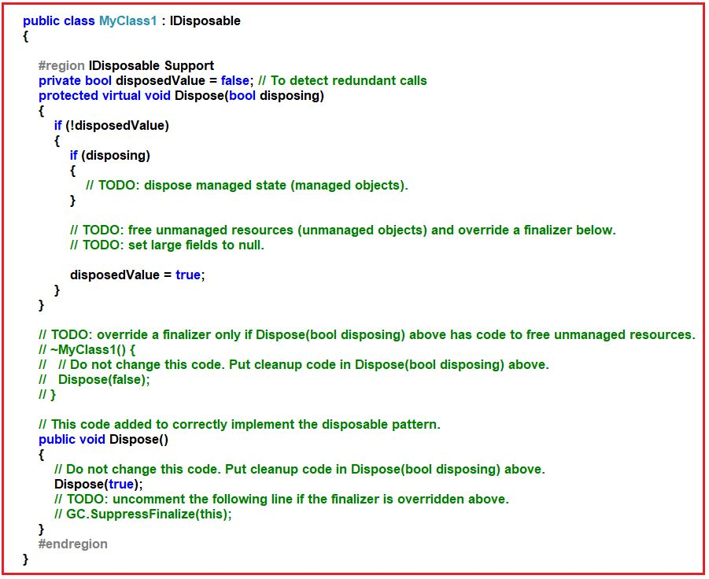

پس از استفاده از شیء، باید متد Dispose را فراخوانی کنید تا حلقه‌ی دوگانه‌ی جمع‌آوری زباله، همانطور که در زیر نشان داده شده است، رخ ندهد.

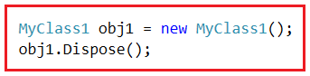

##### **مثال استفاده از الگوی Dispose برای از بین بردن شیء مدیریت نشده در سی شارپ:**

```csharp
using System;

namespace GarbageCollectionDemo
{
    class Program
    {
        static void Main(string[] args)
        {
            for (int i = 0; i <= 1000000; i++)
            {
                MyClass1 obj1 = new MyClass1();
                obj1.Dispose();
                MyClass2 obj2 = new MyClass2();
                obj2.Dispose();
                MyClass3 obj3 = new MyClass3();
                obj3.Dispose();
            }

            Console.Read();
        }
    }

    public class MyClass1 : IDisposable
    {

        #region IDisposable Support
        private bool disposedValue = false; // To detect redundant calls

        protected virtual void Dispose(bool disposing)
        {
            if (!disposedValue)
            {
                if (disposing)
                {
                    // TODO: dispose managed state (managed objects).
                }

                // TODO: free unmanaged resources (unmanaged objects) and override a finalizer below.
                // TODO: set large fields to null.

                disposedValue = true;
            }
        }

        // TODO: override a finalizer only if Dispose(bool disposing) above has code to free unmanaged resources.
        ~MyClass1()
        {
            // Do not change this code. Put cleanup code in Dispose(bool disposing) above.
            Dispose(false);
        }

        // This code added to correctly implement the disposable pattern.
        public void Dispose()
        {
            // Do not change this code. Put cleanup code in Dispose(bool disposing) above.
            Dispose(true);
            // TODO: uncomment the following line if the finalizer is overridden above.
             GC.SuppressFinalize(this);
        }
        #endregion

    }

    public class MyClass2 : IDisposable
    {

        #region IDisposable Support
        private bool disposedValue = false; // To detect redundant calls

        protected virtual void Dispose(bool disposing)
        {
            if (!disposedValue)
            {
                if (disposing)
                {
                }
                disposedValue = true;
            }
        }

        // TODO: override a finalizer only if Dispose(bool disposing) above has code to free unmanaged resources.
        ~MyClass2()
        {
            // Do not change this code. Put cleanup code in Dispose(bool disposing) above.
            Dispose(false);
        }

        // This code added to correctly implement the disposable pattern.
        public void Dispose()
        {
            // Do not change this code. Put cleanup code in Dispose(bool disposing) above.
            Dispose(true);
            // TODO: uncomment the following line if the finalizer is overridden above.
            GC.SuppressFinalize(this);
        }
        #endregion

    }

    public class MyClass3 : IDisposable
    {
        #region IDisposable Support
        private bool disposedValue = false; 

        protected virtual void Dispose(bool disposing)
        {
            if (!disposedValue)
            {
                if (disposing)
                {
                }
                
                disposedValue = true;
            }
        }
        
        ~MyClass3()
        {
            Dispose(false);
        }

        public void Dispose()
        {
            Dispose(true);
            GC.SuppressFinalize(this);
        }
        #endregion
    }
}
```

حالا، راه‌حل را دوباره بسازید. نمایه حافظه دات‌نت را ببندید و همان مراحل را برای اجرای برنامه کنسول با استفاده از این نمایه‌ساز حافظه دات‌نت دنبال کنید. این بار، مشاهده خواهید کرد که اشیاء فقط در نسل ۰ ایجاد می‌شوند، که با استفاده مؤثر از حافظه، عملکرد برنامه شما را بهبود می‌بخشد.

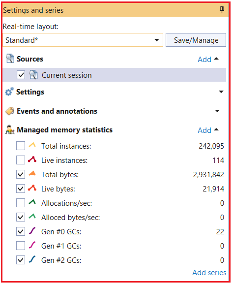

حال، سوالی که باید به ذهن شما خطور کند این است که چرا مخرب آنجاست. دلیل آن این است که، به عنوان یک توسعه‌دهنده، ممکن است هنگام استفاده از شیء، فراخوانی متد Dispose را فراموش کنید. در این صورت، مخرب آن را فراخوانی می‌کند و شیء را پاک‌سازی می‌کند.
