## **آرایه‌ها در سی شارپ به همراه مثال**

با مثال‌هایی مورد بحث قرار خواهم داد **در این مقاله، آرایه‌ها را در سی‌شارپ** . این یکی از مهمترین مفاهیم در زبان‌های برنامه‌نویسی است. آرایه‌ها از زبان‌های برنامه‌نویسی سنتی ما مانند C و C++ وجود دارند و در سی‌شارپ نیز موجود هستند. به عنوان بخشی از این مقاله، قصد داریم در مورد اشاره‌گرهای زیر بحث کنیم.

1. **چرا در برنامه‌نویسی به آرایه‌ها نیاز داریم؟**
2. **آرایه در سی شارپ چیست؟**
3. **انواع آرایه‌ها در سی شارپ**
4. **چگونه یک آرایه ایجاد و مقداردهی اولیه کنیم؟**
5. **چگونه در سی شارپ به عناصر آرایه دسترسی پیدا کنیم؟**
6. **درک نحوه نمایش آرایه در حافظه در سی شارپ**
7. **آرایه یک بعدی در سی شارپ به همراه مثال**
8. **تفاوت بین حلقه for و حلقه for each در سی شارپ برای دسترسی به مقادیر آرایه چیست؟**
9. **کلاس Array در سی شارپ چیست؟**
10. **آشنایی با متدها و ویژگی‌های کلاس Array**
11. **آرایه نوع ضمنی در سی شارپ چیست؟**

##### **چرا در برنامه‌نویسی به آرایه‌ها نیاز داریم؟**

همانطور که می‌دانیم، یک متغیر از نوع اولیه مانند int، double، bool و غیره می‌تواند در هر نقطه از زمان فقط یک مقدار واحد را در خود نگه دارد. برای مثال، **int Number = 10;.** در اینجا متغیر **Number** مقدار **10** را در خود نگه می‌دارد. طبق نیاز تجاری شما، اگر می‌خواهید 100 مقدار صحیح را ذخیره کنید، باید 100 متغیر صحیح در برنامه خود ایجاد کنید که رویکرد برنامه‌نویسی خوبی نیست زیرا زمان زیادی می‌برد و همچنین کد شما بزرگتر می‌شود. ما می‌توانیم با استفاده از مفهومی به نام آرایه‌ها بر این مشکل غلبه کنیم و آرایه‌ها در C# جدید نیستند، آنها در زبان‌های برنامه‌نویسی دیگری مانند C، C++، Java و غیره وجود دارند. با استفاده از آرایه‌ها، به جای ایجاد 100 متغیر برای نگهداری 100 مقدار، می‌توانیم یک متغیر واحد ایجاد کنیم که می‌تواند 100 مقدار را در خود نگه دارد.

##### **آرایه در سی شارپ چیست؟**

آرایه به عنوان مجموعه‌ای از عناصر داده‌ای مشابه تعریف می‌شود. اگر چند مجموعه از اعداد صحیح و چند مجموعه از اعداد اعشاری داشته باشید، می‌توانید آنها را تحت یک نام به عنوان یک آرایه گروه‌بندی کنید. بنابراین، به عبارت ساده، می‌توانیم یک آرایه را به عنوان مجموعه‌ای از مقادیر با انواع مشابه تعریف کنیم که در یک مکان حافظه مجاور تحت یک نام واحد ذخیره می‌شوند.

آرایه نوعی ساختار داده ترتیبی است که برای ذخیره مجموعه‌ای از اقلام از یک نوع استفاده می‌شود. مطمئنم که این تعریف از آرایه را متوجه نشده‌اید. بیایید عبارت فوق را به زبان ساده و نه برنامه‌نویسی بررسی کنیم.

ما قبلاً یاد گرفتیم که متغیرها برای ذخیره مقادیر استفاده می‌شوند. اما یک متغیر می‌تواند در هر نقطه از زمان فقط یک مقدار از یک نوع داده خاص را در خود نگه دارد. برای درک بهتر، لطفاً به نمودار زیر نگاهی بیندازید. در مثال زیر، در هر نقطه از زمان، x می‌تواند فقط یک مقدار از نوع عدد صحیح را در خود نگه دارد.

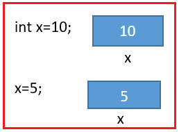

حالا در برنامه‌نویسی بلادرنگ، سناریویی پیش می‌آید که باید گروهی از مقادیر را ذخیره کنیم. متوجه نشدید، درست است؟ بله، بیایید اینطور فکر کنیم. من می‌خواهم شماره کارمند ۱۰ کارمند را ذخیره کنم. سپس بدون آرایه، اینطور می‌شود

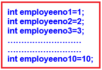

می‌دانم که همین الان هم این حس ناخوشایند را دارید. بله، اگر ساختار داده‌ای از نوع آرایه وجود نداشته باشد، برنامه‌نویسی کمی پیچیده‌تر خواهد بود. برای هر چیزی باید یک متغیر جدید تعریف کنیم، حتی اگر از همان نوع باشد. اما بیایید ببینیم آرایه چگونه این مشکل را حل می‌کند. در ادامه‌ی این مقاله، به تفصیل در مورد سینتکس و قوانین اعلان و مقداردهی اولیه‌ی آرایه بحث خواهیم کرد. فعلاً، فقط روی مفهوم آن تمرکز کنید.

**‎int\[\] employeeno = { 1, 2, 3, 4, 5 }; }‎**

##### **استفاده از \[\] this در حافظه واقعی چگونه کار می‌کند؟**

**تابع \`\`int\[\]empno = {1, 2, 3, 4, 5}}**

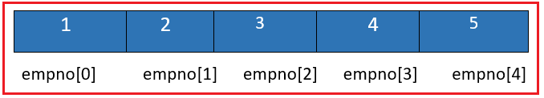

ببینید با استفاده از این \[\] بعد از نوع داده، شما به کامپایلر اطلاع می‌دهید که متغیر یک آرایه است و یک بلوک از حافظه را همانطور که توسط آرایه مشخص شده است، اختصاص می‌دهید.

##### **انواع آرایه‌ها در سی شارپ:**

سی شارپ از دو نوع آرایه پشتیبانی می‌کند. آن‌ها به شرح زیر هستند:

1. **آرایه تک بعدی**
2. **آرایه چند بعدی**

در آرایه تک بعدی، داده‌ها به شکل یک ردیف مرتب می‌شوند در حالی که در آرایه‌های چند بعدی، داده‌ها به شکل ردیف‌ها و ستون‌ها مرتب می‌شوند. باز هم، آرایه‌های چند بعدی دو نوع هستند

1. **آرایه دندانه‌دار** : آرایه‌ای که سطرها و ستون‌های آن برابر نیستند.
2. **آرایه مستطیلی** : آرایه‌ای که سطرها و ستون‌های آن برابر است

**نکته:** می‌توانیم با استفاده از موقعیت‌های اندیس به مقادیر یک آرایه دسترسی پیدا کنیم، در حالی که اندیس آرایه از ۰ شروع می‌شود، به این معنی که اولین آیتم آرایه در موقعیت ۰ ذخیره می‌شود و موقعیت آخرین آیتم آرایه، تعداد کل آیتم‌ها - ۱ - خواهد بود. در این مقاله، قصد دارم در مورد نحوه کار با آرایه تک بعدی بحث کنم و در مقاله بعدی، قصد دارم آرایه چند بعدی را در سی شارپ با مثال‌هایی مورد بحث قرار دهم.

##### **چگونه یک آرایه را در سی شارپ تعریف کنیم؟**

ما در مورد اهمیت آرایه نسبت به متغیرهای معمولی بحث کرده‌ایم، اما اکنون اجازه دهید روش‌های مختلف اعلان و مقداردهی اولیه آرایه در سی‌شارپ را با مثال بررسی کنیم.  
**نحو کلی: <نوع داده>\[\] نام متغیر = جدید <نوع داده>\[اندازه آرایه\];**  
**مثال: int\[\] A = new int\[5\];**

در اینجا ما یک آرایه با نام A و با اندازه ۵ ایجاد کرده‌ایم. بنابراین، می‌توانید ۵ مقدار با نام یکسان A را ذخیره کنید. در حافظه چگونه به نظر می‌رسد؟ این آرایه به ۵ عدد صحیح حافظه اختصاص می‌دهد. همه این ۵ عدد از نوع int هستند. برای آن حافظه، اندیس‌گذاری از ۰ به بعد شروع می‌شود، همانطور که در تصویر زیر نشان داده شده است.

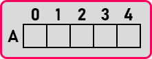

ما یک آرایه داریم. بنابراین، همه این ۵ عدد صحیح کنار هم یا مجاور هستند. فرض کنید آدرس بایت اول ۳۰۰ است و فرض کنیم **int** دو بایت را اشغال می‌کند، در این صورت در حافظه به شکل زیر خواهد بود:

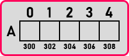

بنابراین در اینجا A\[0\] مقادیر 300-301 را می‌گیرد. A\[1\] مقادیر 302-303 را می‌گیرد. A\[2\] مقادیر 303-304 را می‌گیرد و به همین ترتیب. در مجموع چند بایت مصرف می‌کند؟ 10 بایت حافظه مصرف خواهد کرد. به این ترتیب می‌توانیم 5 متغیر با یک نام ایجاد کنیم، بنابراین می‌گوییم که این یک آرایه است. در زیر نیز مثالی از تعریف آرایه با مشخص کردن اندازه با استفاده از یک متغیر آمده است.

**اندازه عدد صحیح = ۵;**  
**عدد صحیح\[\] A = عدد صحیح جدید\[اندازه\];**

##### **اعلان و مقداردهی اولیه آرایه با یک دستور در سی شارپ**

درست مانند تعریف و مقداردهی اولیه یک متغیر معمولی در یک دستور، می‌توانیم همین کار را برای یک آرایه نیز انجام دهیم اگر بخواهیم ورودی آرایه را به صورت ثابت (hardcode) تعریف کنیم؛ برای مثال **:**

**تابع ()int\[\] A = { 1, 2, 3, 4, 5 };**

##### **چگونه می‌توانیم به عناصر آرایه در سی شارپ دسترسی پیدا کنیم؟**

پاسخ با استفاده از اندیس‌ها است. بیایید ادامه دهیم و سعی کنیم بفهمیم چگونه می‌توانیم با استفاده از اندیس‌ها به عناصر آرایه دسترسی پیدا کنیم.

##### **اندیس یک آرایه چیست؟**

اندیس یک آرایه اساساً یک اشاره‌گر است که برای نشان دادن اینکه کدام عنصر در آرایه استفاده خواهد شد، استفاده می‌شود. آرایه از صفر تا n-1 به صورت ترتیبی است، شما می‌توانید به راحتی به هر عنصری در یک آرایه با اندیس دسترسی داشته باشید. به عنوان مثال:

**عدد صحیح \[\] empno = {1،2،3،4،5};**

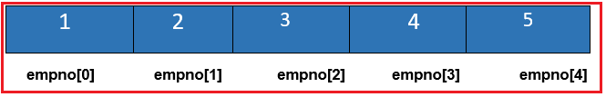

در مثال بالا برای دسترسی به مقدار چهار می‌توانیم از اندیس ۳ به صورت زیر استفاده کنیم:

**خط نوشتن کنسول (empno\[3\])؛**

**نکته:** اندیس آرایه یک عدد صحیح است که از ۰ شروع می‌شود. و آخرین اندیس، تعداد عناصر یا اندازه آرایه -۱ است. می‌توانید از اندیس برای تنظیم و دریافت عناصر یک آرایه در سی شارپ استفاده کنید.

##### **نمایش آرایه‌ها در حافظه در سی شارپ:**

لطفا به نمودار زیر نگاهی بیندازید:

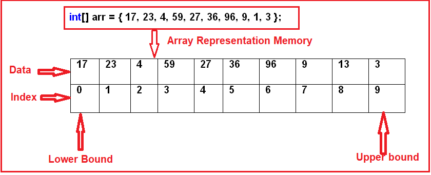

همانطور که در نمودار بالا مشاهده می‌کنید، ما یک آرایه عدد صحیح با ۱۰ عنصر داریم. اندیس آرایه از ۰ شروع می‌شود که اولین عنصر آرایه را ذخیره می‌کند. از آنجایی که آرایه شامل ۱۰ عنصر است، آخرین موقعیت اندیس ۹ خواهد بود. مقادیر یا عناصر آرایه به صورت متوالی در حافظه یعنی در یک مکان مجاور از حافظه ذخیره می‌شوند و به همین دلیل است که عملکرد سریع‌تری دارد.

در سی شارپ، آرایه‌ها می‌توانند به صورت طول ثابت یا پویا تعریف شوند. آرایه با طول ثابت به این معنی است که می‌توانیم تعداد ثابتی از عناصر را ذخیره کنیم در حالی که در مورد آرایه پویا، اندازه آرایه با اضافه شدن موارد جدید به آرایه به طور خودکار افزایش می‌یابد. آرایه‌ها در سی شارپ از نوع‌های مرجع هستند که از **کلاس System.Array** مشتق شده‌اند .

##### **اختصاص مقادیر به آرایه در سی شارپ:**

با نوشتن **‎int\[\] n={1,2,3};** ‎ ما همزمان آرایه را تعریف و به آن مقداردهی اولیه می‌کنیم و در نتیجه آن را مقداردهی اولیه می‌کنیم. اما وقتی آرایه‌ای مانند **‎int\[\] n = new int\[3\];** ‎ را تعریف می‌کنیم ، باید مقادیر را جداگانه به آن اختصاص دهیم. زیرا **‎int\[\] n = new int\[3\];** ‎ فضایی را برای ۳ عدد صحیح در حافظه heap اختصاص می‌دهد اما هیچ مقداری در آن فضا وجود ندارد. برای مقداردهی اولیه، همانطور که در زیر نشان داده شده است، به هر یک از عناصر آرایه با استفاده از موقعیت اندیس آن، مقداری اختصاص دهید.

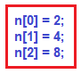

درست مثل این است که ما چند متغیر را تعریف می‌کنیم و سپس به صورت زیر به آنها مقدار می‌دهیم:

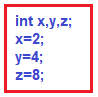

بنابراین، اولین روش برای اختصاص مقادیر به عناصر یک آرایه، انجام این کار در زمان تعریف آن است، یعنی **int\[\] n={1,2,3};** و روش دوم، ابتدا تعریف آرایه و سپس اختصاص مقادیر به عناصر آن است، همانطور که در زیر نشان داده شده است.

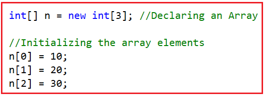

شما می‌توانید این را با در نظر گرفتن n\[0\]، n\[1\] و n\[2\] به عنوان متغیرهای مختلفی که قبلاً استفاده کرده‌اید، درک کنید. درست مانند یک متغیر، یک آرایه نیز می‌تواند از هر نوع داده دیگری باشد.

**float\[\] f = new float\[3\];** ‎ در اینجا، 'f' آرایه‌ای از اعداد اعشاری است.

##### **چگونه در سی شارپ به عناصر آرایه دسترسی پیدا کنیم؟**

فرض کنید آرایه‌ای به شکل زیر داریم:  
**عدد صحیح \[\] n={1,2,3};**

حالا، می‌خواهید عدد ۳ را چاپ کنید و می‌بینید که مقدار سه در موقعیت اندیس ۲ قرار دارد، بنابراین برای چاپ مقدار ۸، باید از موقعیت اندیس آرایه تا ۲ به صورت زیر استفاده کنید:  
**خط نوشتن کنسول (n\[2\]);**

بنابراین، ما باید از نام آرایه و اندیس آن برای مقداری که می‌خواهیم به آن دسترسی داشته باشیم استفاده کنیم. حال اگر بنویسیم:  
**آیا کل آرایه را چاپ می‌کند؟ خیر ،** ما باید تک تک عناصر را جداگانه چاپ کنیم. یا اگر می‌خواهید همه را چاپ کنید، می‌توانیم آنها را با استفاده از یک حلقه مانند حلقه for چاپ کنیم.

##### **آیا می‌توانیم از حلقه for each برای تکرار روی آرایه‌ها در سی‌شارپ استفاده کنیم؟**

بله. از آنجایی که آرایه‌ها در سی‌شارپ از **کلاس System.Array** مشتق شده‌اند که **IEnumerable** را پیاده‌سازی می‌کند ، بنابراین می‌توانیم از   حلقه for-each برای تکرار روی آرایه‌ها در سی‌شارپ استفاده کنیم. این را عملاً پس از شروع برنامه‌نویسی خواهیم دید.

حالا، امیدوارم متوجه شده باشید که آرایه چیست، چرا به آرایه نیاز داریم و چگونه می‌توان عناصر یک آرایه را در سی‌شارپ ایجاد، مقداردهی اولیه و به آنها دسترسی پیدا کرد. حالا، بیایید با استفاده از چند مثال، این مفهوم را به شیوه‌ای بهتر درک کنیم. در این مقاله، ما فقط بر روی آرایه‌های تک‌بعدی تمرکز می‌کنیم و در مقاله بعدی، آرایه‌های چندبعدی را مورد بحث قرار خواهیم داد.

##### **آرایه یک بعدی در سی شارپ به همراه مثال**

آرایه‌ای که داده‌ها را به شکل ردیف‌هایی به ترتیب متوالی ذخیره می‌کند، آرایه تک‌بعدی نامیده می‌شود. سینتکس ایجاد آرایه تک‌بعدی در سی‌شارپ در زیر آمده است.

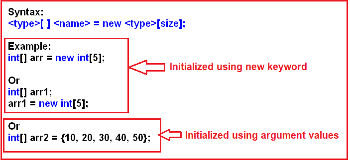

همانطور که در تصویر بالا مشاهده می‌کنید، می‌توانیم یک آرایه را در سی‌شارپ با استفاده از **کلمه کلیدی new** یا با استفاده از **مقادیر آرگومان‌ها** مقداردهی اولیه کنیم . با استفاده از کلمه کلیدی new، مشخص کردن اندازه الزامی است و اگر آرایه را با استفاده از مقادیر آرگومان‌ها مقداردهی اولیه می‌کنید، بر اساس تعداد آرگومان‌ها، اندازه آن تعیین می‌شود.

##### **مثال ۱: ایجاد و مقداردهی اولیه یک آرایه با یک دستور واحد**

در مثال زیر، ما یک آرایه عدد صحیح با ۳ عنصر ایجاد می‌کنیم. سپس با استفاده از موقعیت اندیس آرایه به صورت جداگانه به هر عنصر دسترسی پیدا می‌کنیم، سپس با استفاده از حلقه for به عنصر آرایه دسترسی پیدا می‌کنیم و همچنین با استفاده از حلقه for each به عناصر آرایه دسترسی پیدا می‌کنیم.

```csharp
using System;

namespace ArayDemo
{
    class Program
    {
        static void Main(string[] args)
        {
            // Creating and Initializing an Array
            // Here, the size will be decided based on the number of elements
            // In this case size will be 3
            int[] Numbers = { 10, 20, 30 };

            // Accessing the Array Elements separately
            Console.WriteLine("Accessing the Array Elements separately");
            Console.WriteLine($"Numbers[0] = {Numbers[0]}");
            Console.WriteLine($"Numbers[1] = {Numbers[1]}");
            Console.WriteLine($"Numbers[2] = {Numbers[2]}");

            // Accessing the Array Elements using for Loop
            Console.WriteLine("\nAccessing the Array Elements using For Loop");
            for (int i = 0; i <= Numbers.Length - 1; i++)
            {
                Console.WriteLine($"Numbers[{i}] = {Numbers[i]}");
            }

            // Accessing the Array Elements using foreach Loop
            Console.WriteLine("\nAccessing the Array Elements using ForEach Loop");
            foreach (int Number in Numbers)
            {
                Console.WriteLine($"{Number}");
            }
            Console.ReadKey();
        }
    }
}
```

###### **خروجی:**

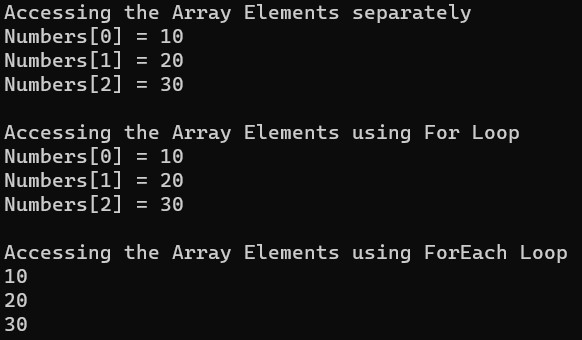

##### **مثال ۲: ایجاد و مقداردهی اولیه یک آرایه به صورت جداگانه**

در مثال زیر، ما یک آرایه عدد صحیح با اندازه ۳ ایجاد می‌کنیم. این بدان معناست که این آرایه می‌تواند حداکثر ۳ عدد صحیح را ذخیره کند. بدون اختصاص هیچ مقداری به مکان حافظه، مقادیر را چاپ می‌کنیم تا ببینیم چه مقادیر پیش‌فرضی ذخیره شده‌اند. سپس با استفاده از موقعیت اندیس آرایه، مقادیر را به آرایه اختصاص می‌دهیم و سپس با استفاده از یک حلقه for مقادیر را چاپ می‌کنیم.

```csharp
using System;

namespace ArayDemo
{
    class Program
    {
        static void Main(string[] args)
        {
            // Creating an Integer Array with size 3
            int[] Numbers = new int[3];

            // Accessing the Array Elements Before Initialization
            Console.WriteLine("Accessing the Array Elements Before Initialization");
            for (int i = 0; i <= Numbers.Length - 1; i++)
            {
                Console.WriteLine($"Numbers[{i}] = {Numbers[i]}");
            }

            // Initializing the Array Elements using the Index Position
            Numbers[0] = 10;
            Numbers[1] = 20;
            Numbers[2] = 30;

            // Accessing the Array Elements After Initialization
            Console.WriteLine("\nAccessing the Array Elements After Initialization");
            for (int i = 0; i <= Numbers.Length - 1; i++)
            {
                Console.WriteLine($"Numbers[{i}] = {Numbers[i]}");
            }
            
            Console.ReadKey();
        }
    }
}
```

###### **خروجی:**

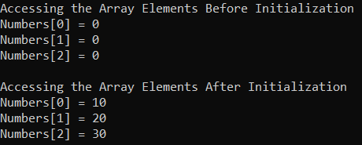

##### **مثال ۳: مقداردهی اولیه پویای یک آرایه در سی شارپ**

در مثال زیر، ابتدا یک آرایه با اندازه ۳ ایجاد می‌کنیم. برای بررسی مقادیر پیش‌فرض یک آرایه در C# store، بدون مقداردهی اولیه آرایه، مقادیر را با استفاده از حلقه for در کنسول چاپ می‌کنیم. سپس دوباره با استفاده از حلقه for عناصر را به آرایه اختصاص می‌دهیم. در نهایت، با استفاده از حلقه for each به عناصر آرایه دسترسی پیدا می‌کنیم و مقادیر را در کنسول چاپ می‌کنیم.

```csharp
using System;

namespace ArayDemo
{
    class Program
    {
        static void Main(string[] args)
        {
            // Creating an array with size 3
            int[] integerArray = new int[3];

            // Accessing array values using loop
            // Here it will display the default values
            // as we are not assigning any values
            for (int i = 0; i < integerArray.Length; i++)
            {
               Console.Write(integerArray[i] + " ");
            }

            Console.WriteLine();
            int a = 0;

            // Here we are assigning values to array using for loop
            for (int i = 0; i < integerArray.Length; i++)
            {
                a += 10;
                integerArray[i] = a;
            }

            // accessing array values using foreach loop
            foreach (int i in integerArray)
            {
                Console.Write(i + " ");
            }

            Console.ReadKey();
        }
    }
}
```

###### **خروجی:**

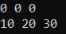

همانطور که در خروجی بالا مشاهده می‌کنید، مقدار پیش‌فرض ۰، برای آرایه از نوع عدد صحیح ذخیره می‌شود. تاکنون، در مثال‌های خود، از یک حلقه ویژه به نام for each loop برای دسترسی به عناصر آرایه استفاده کرده‌ایم. ابتدا بیایید بفهمیم که این for each loop چیست و سپس تفاوت بین for و for each loop را در C# بررسی خواهیم کرد.

##### **برای هر حلقه در سی شارپ:**

حلقه For Each به طور خاص در سی شارپ برای دسترسی به مقادیر یک مجموعه مانند Array، ArrayList، List و غیره طراحی شده است. وقتی از حلقه for-each برای دسترسی به مقادیر یک آرایه یا مجموعه استفاده می‌کنیم، فقط باید آرایه یا مجموعه را به حلقه تحویل دهیم که نیازی به مقداردهی اولیه، شرط یا تکرار ندارد. خود حلقه اجرای خود را با فراهم کردن دسترسی به تک تک عناصر موجود در آرایه یا مجموعه از اولین تا آخرین عنصر به ترتیب متوالی آغاز می‌کند.

##### **تفاوت بین حلقه for و حلقه for each در سی شارپ برای دسترسی به مقادیر آرایه چیست؟**

در مورد حلقه for در سی شارپ، متغیر حلقه به اندیس یک آرایه اشاره دارد در حالی که در مورد حلقه for-each، متغیر حلقه به مقادیر آرایه اشاره دارد.

صرف نظر از مقادیر ذخیره شده در آرایه، متغیر حلقه در مورد حلقه for باید از نوع **int** باشد . دلیل این امر این است که در اینجا متغیر حلقه به موقعیت اندیس آرایه اشاره دارد. در مورد حلقه for-each، نوع داده متغیر حلقه باید با نوع مقادیر ذخیره شده در آرایه یکسان باشد. به عنوان مثال، اگر یک آرایه رشته‌ای دارید، متغیر حلقه در مورد حلقه for-each باید از نوع **string** و در مورد حلقه for در C# از نوع int باشد. برای درک بهتر، لطفاً به مثال زیر نگاهی بیندازید.

```csharp
using System;

namespace ArayDemo
{
    class Program
    {
        static void Main(string[] args)
        {
            // Creating an array with size 3
            string[] Countries = {"India", "USA", "UK" };

            // Accessing array values using for loop
            // Here, the loop variable is of integer type
            for (int i = 0; i < Countries.Length; i++)
            {
               Console.Write(Countries[i] + " ");
            }
            Console.WriteLine();

            // accessing array values using foreach loop
            // Here, the loop variable is of type string
            foreach (string country in Countries)
            {
                Console.Write(country + " ");
            }

            Console.ReadKey();
        }
    }
}
```

مهمترین نکته‌ای که باید در نظر داشته باشید این است که حلقه for در سی شارپ می‌تواند هم برای دسترسی به مقادیر از یک آرایه و هم برای اختصاص مقادیر به یک آرایه استفاده شود، در حالی که حلقه for-each در سی شارپ فقط می‌تواند برای دسترسی به مقادیر از یک آرایه استفاده شود، اما برای اختصاص مقادیر به یک آرایه قابل استفاده نیست.

##### **چه اتفاقی می‌افتد وقتی سعی می‌کنید به عنصری دسترسی پیدا کنید که اندیس آن خارج از محدوده است؟**

اگر می‌خواهید به یک آرایه دسترسی پیدا کنید، چه برای تنظیم مقدار و چه برای دریافت مقدار، اگر آن اندیس خارج از محدوده آرایه باشد، یک استثنا ایجاد می‌شود. برای درک بهتر، لطفاً به مثال زیر نگاهی بیندازید. در اینجا، ما یک آرایه با اندازه ۳ ایجاد می‌کنیم، یعنی موقعیت اندیس از ۰ تا ۲ است و ما سعی داریم مقداری را به ۳ اختصاص دهیم. <sup>rd </sup> موقعیت index که وجود ندارد. در این حالت، یک استثنا ایجاد می‌کند.

```csharp
using System;

namespace ArayDemo
{
    class Program
    {
        static void Main(string[] args)
        {
            // Creating an array with size 3
            string[] Countries =new string[3];

            Countries[3] = "India";

            Console.ReadKey();
        }
    }
}
```

هیچ خطایی در زمان کامپایل به شما نمی‌دهد، اما وقتی کد بالا را اجرا می‌کنید، در زمان اجرا، استثنای زیر را ایجاد می‌کند.

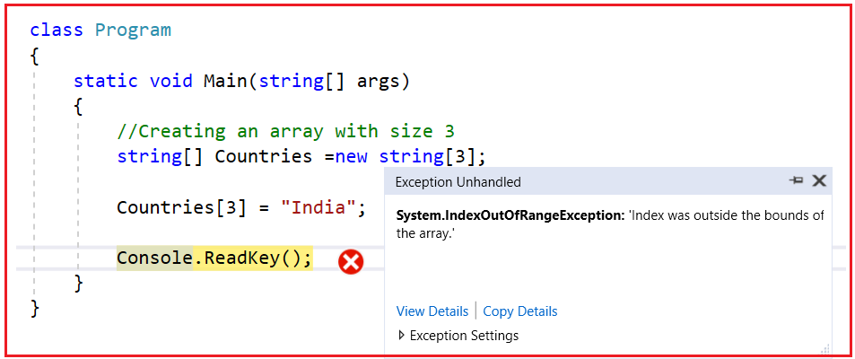

##### **کلاس آرایه در سی شارپ:**

کلاس **Array** در سی شارپ یک کلاس از پیش تعریف شده است که درون **فضاهای نام System** تعریف شده است . این کلاس به عنوان کلاس پایه برای همه آرایه‌ها در سی شارپ عمل می‌کند. **کلاس Array** مجموعه‌ای از اعضا (متدها و ویژگی‌ها) را برای کار با آرایه‌ها مانند ایجاد، دستکاری، جستجو، معکوس کردن و مرتب‌سازی عناصر یک آرایه و غیره فراهم می‌کند. تعریف کلاس Array در سی شارپ در زیر gen آمده است.

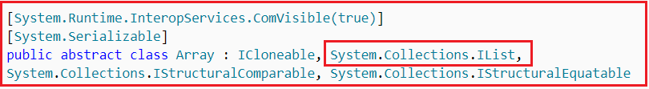

نیست **کلاس Array در C# بخشی از فضای نام System.Collections** . بلکه بخشی از **فضای نام System** است . اما با این حال، ما آن را به عنوان یک مجموعه در نظر گرفتیم زیرا **رابط IList** را پیاده‌سازی می‌کند . کلاس Array متدها و ویژگی‌های زیر را ارائه می‌دهد:

1. **مرتب‌سازی (\<Array>) :** مرتب‌سازی عناصر آرایه
2. **معکوس کردن (\<array>) :** معکوس کردن عناصر آرایه
3. **کپی (src، dest، n) :** کپی کردن برخی از عناصر یا تمام عناصر از آرایه قدیمی به آرایه جدید
4. **GetLength(int) :** یک عدد صحیح ۳۲ بیتی که تعداد عناصر در بُعد مشخص شده را نشان می‌دهد.
5. **طول (Length) :** تعداد کل عناصر در تمام ابعاد آرایه را برمی‌گرداند؛ اگر هیچ عنصری در آرایه وجود نداشته باشد، صفر برمی‌گرداند.

##### **مثالی برای درک متدها و ویژگی‌های کلاس آرایه در سی شارپ**

بیایید مثالی برای درک متد و ویژگی‌های کلاس آرایه در سی‌شارپ ببینیم. مثال زیر نیازی به توضیح ندارد، بنابراین لطفاً از طریق خطوط کامنت به آن بپردازید.

```csharp
using System;

namespace ArayDemo
{
    class Program
    {
        static void Main(string[] args)
        {
            // Creating and Initializing an Array of Integers
            // Size of the Array is 10
            int[] Numbers = { 17, 23, 4, 59, 27, 36, 96, 9, 1, 3 };

            // Printing the Array Elements using a for Loop
            Console.WriteLine("Original Array Elements :");
            for (int i = 0; i < Numbers.Length; i++)
            {
                Console.Write(Numbers[i] + " ");
            }
            Console.WriteLine();

            // Sorting the Array Elements by using the Sort method of Array Class
            Array.Sort(Numbers);
            // Printing the Array Elements After Sorting using a foreach loop
            Console.WriteLine("\nArray Elements After Sorting :");
            foreach (int i in Numbers)
            {
                Console.Write(i + " ");
            }
            Console.WriteLine();

            // Reversing the array elements by using the Reverse method of Array Class
            Array.Reverse(Numbers);
            // Printing the Array Elements in Reverse Order
            Console.WriteLine("\nArray Elements in the Reverse Order :");
            foreach (int i in Numbers)
            {
                Console.Write(i + " ");
            }
            Console.WriteLine();

            // Creating a New Array
            int[] NewNumbers = new int[10];
            // Copying Some of the Elements from Old array to new array
            // We declare the array with size 10 and we copy only 5 elements. 
            // So the rest 5 elements will take the default value. In this array, it will take 0
            Array.Copy(Numbers, NewNumbers, 5);

            // Printing the Array Elements using for Each Loop
            Console.WriteLine("\nNew Array Elements :");
            foreach (int i in NewNumbers)
            {
                Console.Write(i + " ");
            }

            Console.WriteLine();
            Console.WriteLine($"\nNew Array Length using Length Property :{NewNumbers.Length}");
            Console.WriteLine($"New Array Length using GetLength Method :{NewNumbers.GetLength(0)}");
            Console.ReadKey();
        }
    }
}
```

###### **خروجی:**

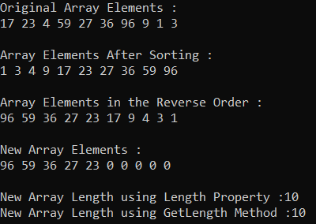

##### **درک آرایه‌های با نوع ضمنی در سی شارپ:**

وقتی ما یک آرایه را با استفاده از کلمه کلیدی var تعریف می‌کنیم، به چنین نوع آرایه‌هایی در سی شارپ، آرایه‌های با نوع ضمنی (implicitly typed arrays) می‌گویند.

**مثال:**   **var arr = new[] {10, 20, 30, 40, 50};**

برای درک بهتر آرایه با نوع ضمنی در سی شارپ، مثالی را بررسی می‌کنیم.

```csharp
using System;

namespace ArayDemo
{
    class Program
    {
        static void Main(string[] args)
        {
            var Numbers = new[] { 10, 20, 30, 40, 50};
            for (int i = 0; i < Numbers.Length; i++)
            {
                Console.Write(Numbers[i] + " ");
            }
            Console.ReadKey();
        }
    }
}
```

**خروجی: ۱۰ ۲۰ ۳۰ ۴۰ ۵۰**