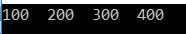

## **مزایا و معایب مجموعه‌های غیر ژنریک در سی شارپ**

در این مقاله، قصد دارم **مزایا و معایب مجموعه‌های غیر ژنریک در سی‌شارپ** را مورد بحث قرار دهم . لطفاً مقاله قبلی ما را که در آن به بررسی کلاس مجموعه‌های غیر ژنریک SortedList در سی‌شارپ به همراه مثال پرداختیم، مطالعه کنید. در اینجا مزایا و معایب استفاده از کلاس مجموعه ArrayList را که می‌تواند برای سایر کلاس‌های مجموعه غیر ژنریک مانند Stack، Queue، Hashtable، SortedList و غیره نیز اعمال شود، مورد بحث قرار خواهیم داد.

##### **مزایای استفاده از کلاس‌های مجموعه غیر ژنریک در سی شارپ:**

همانطور که قبلاً بحث کردیم، کلاس‌های مجموعه غیر ژنریک می‌توانند هنگام اضافه کردن آیتم‌ها به مجموعه، به طور خودکار از نظر اندازه بزرگ شوند و این یک مزیت است. بیایید این را با یک مثال ثابت کنیم.

در مثال زیر، ما یک مجموعه ایجاد می‌کنیم، یعنی Numbers از نوع ArrayList با اندازه اولیه ۳. اما سپس ۴ عنصر به مجموعه اضافه می‌کنیم و هیچ خطایی دریافت نکردیم، هیچ خطای زمان کامپایل و هیچ خطای زمان اجرا وجود ندارد و همانطور که انتظار می‌رفت کار می‌کند. از این رو، ثابت می‌شود که مجموعه‌هایی مانند ArrayList، Stack، Queue، Hashtable، SortedList و غیره می‌توانند هنگام اضافه کردن عناصر به مجموعه، به صورت پویا از نظر اندازه رشد کنند. اگر این یک آرایه عدد صحیح باشد، وقتی عنصر چهارم را به مجموعه اضافه می‌کنیم، شاخص را از خطای زمان اجرای محدود خارج می‌کنیم.

```csharp
using System;
using System.Collections;

namespace CollectionDemo
{
    class Program
    {
        static void Main(string[] args)
        {
            ArrayList Numbers = new ArrayList(3);
            Numbers.Add(100);
            Numbers.Add(200);
            Numbers.Add(300);
            Numbers.Add(400);
            foreach (int Number in Numbers)
            {
                Console.Write(Number + "  ");
            }
            Console.ReadKey();
        }
    }
}
```

###### **خروجی:**



کلاس‌های مجموعه غیر ژنریک مانند ArrayList، Stack، Queue، SortedList و Hashtable و غیره، چندین روش مفید برای اضافه کردن و حذف آیتم‌ها به مجموعه ارائه می‌دهند، همچنین روش‌هایی را نیز ارائه می‌دهند که با استفاده از آنها می‌توانیم آیتم‌ها را از وسط یک مجموعه اضافه یا حذف کنیم و این مزایای دیگری است که در کلاس‌های مجموعه غیر ژنریک در C# به دست می‌آوریم، در حالی که نمی‌توانیم آنها را در آرایه‌ها دریافت کنیم. حال، بیایید ادامه دهیم و سعی کنیم معایب کلاس‌های مجموعه غیر ژنریک در C# را درک کنیم.

##### **معایب استفاده از کلاس‌های مجموعه غیر ژنریک در سی شارپ:**

کلاس‌های مجموعه غیر ژنریک مانند **ArrayList، Stack، Queue، Hashtable، SortedList** و غیره بر روی نوع داده شیء عمل می‌کنند. از آنجایی که آنها بر روی نوع داده شیء عمل می‌کنند، از نوع داده آزادانه (loosely typed) هستند. نوع داده آزادانه به این معنی است که می‌توانید هر نوع مقداری را در مجموعه ذخیره کنید. به دلیل همین ماهیت نوع داده آزادانه، ممکن است با خطاهای زمان اجرا مواجه شویم. برای درک بهتر، لطفاً به مثال زیر نگاهی بیندازید.

```csharp
using System;
using System.Collections;

namespace CollectionDemo
{
    class Program
    {
        static void Main(string[] args)
        {
            ArrayList Numbers = new ArrayList(3);
            Numbers.Add(100);
            Numbers.Add(200);
            Numbers.Add(300);

            //It is also possible to store string values
            Numbers.Add("Hi");

            foreach (int Number in Numbers)
            {
                Console.Write(Number + "  ");
            }
            Console.ReadKey();
        }
    }
}
```

###### **خروجی:**


نه تنها به دلیل ماهیت loosely typed با خطاهای زمان اجرا مواجه می‌شویم، بلکه به دلیل boxing و unboxing نیز بر عملکرد برنامه تأثیر می‌گذارد. اجازه دهید این موضوع را با یک مثال درک کنیم.

در مثال زیر، یک مجموعه غیر ژنریک (Non-Generic Collection) ایجاد می‌کنیم، یعنی اعداد (Numbers) از نوع ArrayList با اندازه اولیه ۲. سپس دو عنصر مانند ۱۰۰ و ۲۰۰ را ذخیره می‌کنیم. این دو آیتم ۱۰۰ و ۲۰۰ هم عدد صحیح (Integer) و هم نوع مقداری (Value Type) هستند.

کلاس‌های Collection متعلق به فضای نام System.Collections هستند و بر روی نوع داده object عمل می‌کنند. نوع داده object در C# یک نوع داده reference است. بنابراین مقداری که در collection ذخیره می‌کنیم به نوع reference تبدیل می‌شود. بنابراین در مثال ما، مقادیر ۱۰۰ و ۲۰۰ کادربندی شده و به نوع reference تبدیل می‌شوند. در مثال ما، ما فقط دو مقدار را ذخیره کرده‌ایم. سناریویی را در نظر بگیرید که در آن باید ۱۰۰۰ مقدار صحیح ذخیره کنیم. سپس همه ۱۰۰۰ عدد صحیح باید کادربندی شوند، به این معنی که آنها به انواع reference تبدیل شده و سپس در collection ذخیره می‌شوند.

به طور مشابه، وقتی می‌خواهیم آیتم‌ها را از مجموعه بازیابی کنیم، دوباره باید نوع شیء را به نوع عدد صحیح تبدیل کنیم، به این معنی که یک unboxing انجام می‌دهیم. بنابراین این boxing و unboxing غیرضروری هر بار که انواع مقداری را به مجموعه اضافه و بازیابی می‌کنیم، در پشت صحنه اتفاق می‌افتد. بنابراین اگر روی یک مجموعه بزرگ از انواع مقداری کار می‌کنید، ممکن است عملکرد برنامه شما را کاهش دهد . بنابراین، همیشه سعی کنید هنگام توسعه برنامه بلادرنگ خود از boxing و unboxing اجتناب کنید.

```csharp
using System;
using System.Collections;

namespace CollectionDemo
{
    class Program
    {
        static void Main(string[] args)
        {
            ArrayList Numbers = new ArrayList(2);
            // Boxing happens - Converting Value type (100, 200) to reference type
            // Means Integer to object type
            Numbers.Add(100);
            Numbers.Add(200);

            // Unboxing happens - 100 and 200 stored as object type
            // now converted to Integer type
            foreach (int Number in Numbers)
            {
                Console.Write(Number + "  ");
            }
            Console.ReadKey();
        }
    }
}
```

##### **مشکلات کلاس‌های مجموعه غیر ژنریک در سی شارپ:**

بنابراین، به طور خلاصه، می‌توانیم بگوییم که کلاس‌های مجموعه غیر ژنریک در سی شارپ از نظر نوع داده ایمن نیستند، زیرا بر روی انواع داده‌های شیء عمل می‌کنند، بنابراین می‌توانند هر نوع مقداری را ذخیره کنند.

1. آرایه از نظر نوع داده ایمن است
2. لیست آرایه، جدول درهم‌سازی، پشته، لیست مرتب‌شده و صف از نظر نوع ایمن نیستند.

برای مثال، اگر بخواهم n عدد صحیح ذخیره کنم

1. من نمی‌توانم از آرایه استفاده کنم چون آرایه‌ها طول ثابتی دارند. در این مورد، طول نامشخص است.
2. می‌توانم از ArrayList یا HashTable استفاده کنم، اما اگر از ArrayList یا HashTable استفاده کنیم، احتمال ذخیره انواع دیگر مقادیر وجود دارد، زیرا آنها از نوع ایمن نیستند زیرا روی نوع داده شیء عمل می‌کنند.

بنابراین راه حل، مجموعه‌های عمومی (Generic Collections) در سی شارپ است.

1. **آرایه** : نوع امن اما با طول ثابت
2. **مجموعه‌ها** : تغییر اندازه خودکار اما نه ایمن در برابر تایپ
3. **مجموعه‌های عمومی** : نوع امن و تغییر اندازه خودکار