## **مجموعه‌های عمومی در سی شارپ به همراه مثال**

در این مقاله، قصد دارم مقدمه‌ای کوتاه بر **مجموعه‌های عمومی (Generic Collections) در سی‌شارپ به همراه مثال** ارائه دهم . لطفاً مقاله قبلی ما را که در آن مزایا و معایب مجموعه‌های غیر عمومی (Non-Generic Collection) در سی‌شارپ به همراه مثال بررسی کردیم، مطالعه کنید. در بخشی از این مقاله، ابتدا مشکلات مجموعه‌های غیر عمومی (Non-Generic Collection) را بررسی خواهیم کرد و سپس نحوه غلبه بر مشکلات مجموعه‌های غیر عمومی با مجموعه‌های عمومی (Generic Collection) در سی‌شارپ را بررسی خواهیم کرد. در نهایت، مثال‌هایی از کلاس مجموعه عمومی (Generic Collection) در سی‌شارپ را بررسی خواهیم کرد.

**نکته:** **مجموعه‌های عمومی (Generic Collections)** معرفی شدند **به عنوان بخشی از C# 2.0** در مورد آنها بحث کرده‌ایم. می‌توانید این مجموعه عمومی را به عنوان افزونه‌ای برای کلاس‌های مجموعه غیر عمومی (Non-Generic Collection Classes) که قبلاً در مقالات قبلی خود مانند ArrayList، Hashtable، SortedList، Stack و Queue در نظر بگیرید.

##### **مشکلات مربوط به مجموعه‌های غیر ژنریک در سی شارپ**

کلاس‌های مجموعه غیر ژنریک مانند **ArrayList** ، **Hashtable** ، **SortedList** ، **Stack** و **Queue** روی نوع داده شیء کار می‌کنند. این بدان معناست که عناصر اضافه شده به مجموعه از نوع شیء هستند. از آنجایی که این کلاس‌های مجموعه غیر ژنریک روی نوع داده شیء کار می‌کنند، می‌توانیم هر نوع مقداری را که ممکن است به دلیل عدم تطابق نوع منجر به استثنائات زمان اجرا شود، ذخیره کنیم. اما با **مجموعه‌های ژنریک** ، اکنون می‌توانیم نوع خاصی از داده (چه نوع اولیه و چه نوع مرجع) را ذخیره کنیم که با حذف عدم تطابق نوع در زمان اجرا، ایمنی نوع را فراهم می‌کند. برای درک بهتر، لطفاً به مثال زیر نگاهی بیندازید.

```csharp
using System;
using System.Collections;

namespace CollectionDemo
{
    class Program
    {
        static void Main(string[] args)
        {
            ArrayList Numbers = new ArrayList(3);
            Numbers.Add(100);
            Numbers.Add(200);
            Numbers.Add(300);

            //It is also possible to store string values
            Numbers.Add("Hi");

            foreach (int Number in Numbers)
            {
                Console.Write(Number + "  ");
            }
            Console.ReadKey();
        }
    }
}
```

###### **خروجی:**

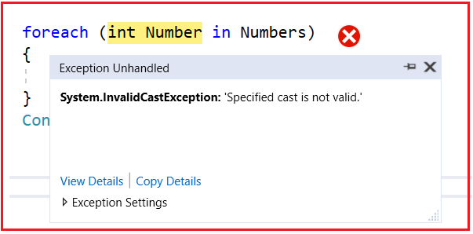

مشکل دوم کلاس‌های مجموعه غیر ژنریک این است که سربار عملکرد را متحمل می‌شویم. دلیل این امر Boxing و Unboxing است. همانطور که قبلاً بحث کردیم، این کلاس‌های مجموعه بر روی نوع داده شیء کار می‌کردند. بنابراین اگر داده‌های نوع مقداری را در مجموعه ذخیره کنیم، آن داده‌های نوع مقداری ابتدا به نوع شیء تبدیل می‌شوند و سپس فقط در مجموعه ذخیره می‌شوند که چیزی جز انجام Boxing نیست. به طور مشابه، اگر بخواهیم داده‌ها را از مجموعه بازیابی کنیم، باید داده‌ها را از نوع شیء به نوع مقداری تبدیل کنیم که به معنای انجام Unboxing است. به دلیل این Boxing و Unboxing، اگر مجموعه ما بزرگ باشد، عملکرد ضعیفی خواهیم داشت. برای درک بهتر، لطفاً به مثال زیر نگاهی بیندازید.

```csharp
using System;
using System.Collections;

namespace CollectionDemo
{
    class Program
    {
        static void Main(string[] args)
        {
            ArrayList Numbers = new ArrayList(2);
            // Boxing happens - Converting Value type (100, 200) to reference type
            // Means Integer to object type
            Numbers.Add(100);
            Numbers.Add(200);

            // Unboxing happens - 100 and 200 stored as object type
            // now converted to Integer type
            foreach (int Number in Numbers)
            {
                Console.Write(Number + "  ");
            }
            Console.ReadKey();
        }
    }
}
```

**نکته:** Boxing به معنای تبدیل یک نوع مقداری به یک نوع شیء و Unboxing به معنای تبدیل مجدد یک نوع شیء به نوع مقداری است.

##### **راه حل مشکلات مجموعه‌های غیر ژنریک**

دو مشکل فوق در مورد مجموعه‌های غیر ژنریک با استفاده از مجموعه‌های ژنریک در سی‌شارپ برطرف می‌شوند. چارچوب دات‌نت تمام کلاس‌های مجموعه غیر ژنریک موجود مانند ArrayList، Hashtable، SortedList، Stack و Queue و غیره را در مجموعه‌های ژنریک مانند **ArrayList<T>، Dictionary<TKey, TValue>، SortedList<TKey, TValue>، Stack<T>** و **Queue<T>** مجدداً پیاده‌سازی کرده است . در اینجا T چیزی جز نوع مقادیری نیست که می‌خواهیم در مجموعه ذخیره کنیم. بنابراین، مهمترین نکته‌ای که باید به خاطر داشته باشید این است که هنگام ایجاد اشیاء از کلاس‌های مجموعه ژنریک، باید صریحاً نوع مقادیری را که می‌خواهید در مجموعه ذخیره کنید، ارائه دهید.

یک مجموعه ژنریک از نظر نوع داده کاملاً ایمن است. اینکه می‌خواهید چه نوع داده‌ای را در نوع ژنریک ذخیره کنید، این اطلاعات را باید در زمان کامپایل ارائه دهید. این بدان معناست که فقط می‌توانید یک نوع داده را در آن قرار دهید. این امر عدم تطابق نوع را در زمان اجرا از بین می‌برد.

کلاس‌های Generic Collection تحت **فضای نام System.Collections.Generic** پیاده‌سازی شده‌اند . کلاس‌هایی که در این فضای نام وجود دارند به شرح زیر هستند.

1. **Stack<T> :** این Stack مجموعه‌ای از نمونه‌های با اندازه متغیر و به ترتیب ورود و خروج (LIFO) از یک نوع مشخص را نشان می‌دهد.
2. **Queue<T> :** مجموعه‌ای از اشیاء را نشان می‌دهد که به ترتیب ورود و خروج، اولین هستند.
3. **HashSet<T> :** مجموعه‌ای از مقادیر را نشان می‌دهد. عناصر تکراری را حذف می‌کند.
4. **SortedList<TKey, TValue> :** این مجموعه ای از جفت های کلید/مقدار را نشان می دهد که بر اساس کلید و بر اساس پیاده سازی مرتبط System.Collections.Generic.IComparer مرتب شده اند. این به طور خودکار عناصر را به ترتیب صعودی کلید و به طور پیش فرض اضافه می کند.
5. **List<T> :** این یک لیست از اشیاء با نوع داده Strongly Typed است که می‌توان از طریق اندیس به آنها دسترسی داشت. متدهایی برای جستجو، مرتب‌سازی و دستکاری لیست‌ها ارائه می‌دهد. با اضافه کردن عناصر به آن، به طور خودکار رشد می‌کند.
6. **Dictionary<TKey, Tvalue> :** مجموعه‌ای از کلیدها و مقادیر را نشان می‌دهد.
7. **SortedSet<T>:** مجموعه‌ای از اشیاء را نشان می‌دهد که به ترتیب مرتب‌شده نگهداری می‌شوند.
8. **SortedDictionary<TKey, TValue> :** مجموعه‌ای از جفت‌های کلید/مقدار را نشان می‌دهد که بر اساس کلید مرتب شده‌اند.
9. **LinkedList<T> :** یک لیست دو پیوندی را نشان می‌دهد.

**نکته:** در اینجا <T> به نوع مقادیری که می‌خواهیم زیر آنها ذخیره کنیم اشاره دارد.

##### **مثال‌ها:**

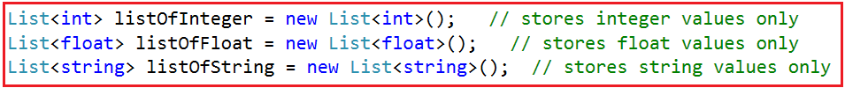

همچنین می‌توان یک نوع تعریف‌شده توسط کاربر مانند نوع کلاس یا نوع ساختار را مانند شکل زیر ذخیره کرد.  
**لیست <مشتری> customerList = لیست جدید <مشتری> ();**  
فرض کنید **مشتری** یک نوع کلاس تعریف‌شده توسط کاربر است که نشان‌دهنده یک موجودیت به نام Customer است. در اینجا می‌توانیم اشیاء مشتری را در مجموعه customerList ذخیره کنیم که در آن هر شیء مشتری می‌تواند به صورت داخلی ویژگی‌های مختلف مشتری مانند شناسه، نام، شهر، استان و غیره را نشان دهد.

##### **مجموعه‌های عمومی (Generic Collections) در سی شارپ چیستند؟**

مجموعه‌های عمومی در سی‌شارپ از نوع قوی (strongly typed) هستند. ماهیت قوی به این کلاس‌های مجموعه اجازه می‌دهد تا فقط یک نوع مقدار را در خود ذخیره کنند. این امر نه تنها عدم تطابق نوع را در زمان اجرا از بین می‌برد، بلکه عملکرد بهتری نیز خواهد داشت زیرا در هنگام ذخیره داده‌های نوع مقداری نیازی به boxing و unboxing ندارند. بنابراین، همیشه استفاده از کلاس‌های مجموعه عمومی در سی‌شارپ به جای استفاده از کلاس‌های مجموعه غیر عمومی، یک انتخاب برنامه‌نویسی ترجیحی و خوب است.

**نکته:** در بیشتر موارد، توصیه می‌شود از مجموعه‌های عمومی استفاده کنید زیرا آنها سریع‌تر از مجموعه‌های غیر عمومی عمل می‌کنند و همچنین با ایجاد خطاهای زمان کامپایل، خطاها را به حداقل می‌رسانند.

در این مقاله، قصد دارم کاربرد هر کلاس مجموعه عمومی را با یک مثال ساده ارائه دهم و از مقاله بعدی به بعد، هر کلاس مجموعه عمومی را با جزئیات توضیح خواهیم داد.

##### **کلاس List<T> در سی شارپ**

کلاس مجموعه عمومی List<T> در سی‌شارپ برای ذخیره و واکشی عناصر استفاده می‌شود. این کلاس می‌تواند عناصر تکراری داشته باشد. این کلاس به فضای نام System.Collections.Generic تعلق دارد. همچنین می‌توانید مجموعه List<T> را به عنوان نسخه عمومی ArrayList در نظر بگیرید. در اینجا، باید نوع مقادیری را که می‌خواهیم در مجموعه ذخیره کنیم، ذکر کنیم. مانند ArrayList، ما نمی‌توانیم هیچ نوع مقداری را به مجموعه List<T> اضافه کنیم، که این امر مانع از بروز استثناهای زمان اجرا به دلیل عدم تطابق نوع می‌شود. بیایید مثالی از یک کلاس مجموعه عمومی List<T> را ببینیم که عناصر را با استفاده از متد Add() ذخیره می‌کند و عناصر را با استفاده از حلقه for-each تکرار می‌کند.

```csharp
using System;
using System.Collections.Generic;

namespace GenericCollections
{
    public class GenericListDemo
    {
        public static void Main(string[] args)
        {
            List<int> integerList = new List<int>();
            integerList.Add(11);
            integerList.Add(22);
            integerList.Add(55);
            integerList.Add(65);
            integerList.Add(10);

            //The following line give you compile time error as the value is string
            //integerList.Add("Hello");

            Console.Write("List of Elements: ");
            foreach (int item in integerList)
            {
                Console.Write($"{item} ");
            }
            Console.ReadKey();
        }
    }
}
```

###### **خروجی:**

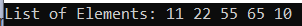

##### **کلاس HashSet<T> در سی شارپ**

کلاس مجموعه عمومی HashSet<T> در سی شارپ می‌تواند برای ذخیره، حذف یا مشاهده عناصر استفاده شود. این کلاس اجازه اضافه کردن عناصر تکراری را نمی‌دهد. اگر مجبورید فقط عناصر منحصر به فرد را ذخیره کنید، پیشنهاد می‌شود از کلاس HashSet استفاده کنید. این کلاس متعلق به فضای نام System.Collections.Generic است. بیایید مثالی از یک کلاس مجموعه عمومی HashSet<T> را ببینیم که عناصر را با استفاده از متد Add() ذخیره می‌کند و عناصر را با استفاده از حلقه for-each تکرار می‌کند.

```csharp
using System;
using System.Collections.Generic;

namespace GenericCollections
{
    public class GenericHashSetDemo
    {
        public static void Main(string[] args)
        {
            HashSet<int> integerHashSet = new HashSet<int>();
            integerHashSet.Add(11);
            integerHashSet.Add(22);
            integerHashSet.Add(55);
            integerHashSet.Add(65);

            //Adding Duplicate Elements
            integerHashSet.Add(55);

            //The following line give you compile time error as the value is string
            //integerHashSet.Add("Hello");

            Console.Write("List of Elements: ");
            foreach (int item in integerHashSet)
            {
                Console.Write($"{item} ");
            }
            Console.ReadKey();
        }
    }
}
```

اگر توجه کرده باشید، ما دو بار ۵۵ عنصر اضافه کرده‌ایم. اکنون، برنامه را اجرا کنید و خواهید دید که عنصر تکراری را حذف می‌کند و فقط یک بار ۵۵ را نشان می‌دهد، همانطور که در تصویر زیر نشان داده شده است.

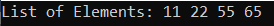

##### **کلاس SortedSet<T> در سی شارپ:**

کلاس مجموعه Generic SortedSet<T> در سی شارپ برای ذخیره، حذف یا مشاهده عناصر استفاده می‌شود. به طور پیش‌فرض، عناصر را به ترتیب صعودی ذخیره می‌کند و عناصر تکراری را ذخیره نمی‌کند. اگر مجبور به ذخیره عناصر منحصر به فرد هستید و همچنین می‌خواهید ترتیب صعودی را حفظ کنید، استفاده از آن توصیه می‌شود. کلاس SortedSet<T> متعلق به فضای نام System.Collections.Generic است. بیایید مثالی از یک کلاس مجموعه Generic SortedSet<T> در سی شارپ را ببینیم که عناصر را با استفاده از متد Add() ذخیره می‌کند و عناصر را با استفاده از حلقه for-each تکرار می‌کند.

```csharp
using System;
using System.Collections.Generic;

namespace GenericCollections
{
    public class GenericSortedSetDemo
    {
        public static void Main(string[] args)
        {
            SortedSet<int> integerSortedSet = new SortedSet<int>();
            integerSortedSet.Add(11);
            integerSortedSet.Add(66);
            integerSortedSet.Add(55);
            integerSortedSet.Add(88);
            integerSortedSet.Add(22);
            integerSortedSet.Add(77);

            //Adding Duplicate Elements
            integerSortedSet.Add(55);

            //The following line give you compile time error as the value is string
            //integerSortedSet.Add("Hello");

            Console.WriteLine("List of Elements of SortedSet:");
            foreach (int item in integerSortedSet)
            {
                Console.Write($"{item} ");
            }
            Console.ReadKey();
        }
    }
}
```

همانطور که در مجموعه مرتب شده بالا مشاهده می‌کنید، ما ۵۵ عنصر را دو بار اضافه کرده‌ایم. اکنون، برنامه را اجرا کنید و خواهید دید که عنصر تکراری را حذف کرده و فقط یک بار ۵۵ را نشان می‌دهد، همچنین عناصر را به ترتیب صعودی مرتب می‌کند، همانطور که در تصویر زیر نشان داده شده است.

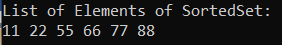

##### **کلاس Stack<T> در سی شارپ**

کلاس مجموعه عمومی Stack<T> در سی شارپ برای اضافه کردن و حذف کردن عناصر به ترتیب LIFO (آخرین ورودی اولین خروجی) استفاده می‌شود. عملیات push یک عنصر را به یک مجموعه اضافه می‌کند، در حالی که عملیات pop برای حذف جدیدترین عنصر اضافه شده از یک مجموعه استفاده می‌شود. این کلاس می‌تواند عناصر تکراری داشته باشد. کلاس Stack<T> متعلق به فضای نام System.Collections.Generic است. بیایید مثالی از یک کلاس مجموعه عمومی Stack<T> در سی شارپ را ببینیم که عناصر را با استفاده از متد Push() ذخیره می‌کند، عناصر را با استفاده از متد Pop() حذف می‌کند و عناصر را با استفاده از حلقه for-each تکرار می‌کند.

```csharp
using System;
using System.Collections.Generic;

namespace GenericCollections
{
    public class GenericStackDemo
    {
        public static void Main(string[] args)
        {
            Stack<string> countriesStack = new Stack<string>();
            countriesStack.Push("India");
            countriesStack.Push("USA");
            countriesStack.Push("UK");
            countriesStack.Push("China");
            countriesStack.Push("Nepal");

            Console.WriteLine("Stack Elements: ");
            foreach (string country in countriesStack)
            {
                Console.Write($"{country} ");
            }

            Console.WriteLine("\n\nPeek Element: " + countriesStack.Peek());
            Console.WriteLine("Element Popped: " + countriesStack.Pop());
            Console.WriteLine("\nStack Elements: ");
            foreach (string country in countriesStack)
            {
                Console.Write($"{country} ");
            }
            Console.ReadKey();
        }
    }
}
```

###### **خروجی:**

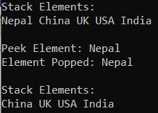

##### **کلاس Queue<T> در سی شارپ:**

کلاس مجموعه عمومی Queue<T> در سی شارپ برای Enqueue کردن و Dequeue کردن عناصر به ترتیب FIFO (اولین ورودی، اولین خروجی) استفاده می‌شود. عملیات Enqueue یک عنصر را به یک مجموعه اضافه می‌کند، در حالی که عملیات Dequeue برای حذف اولین عنصر اضافه شده از مجموعه صف استفاده می‌شود. این کلاس می‌تواند عناصر تکراری داشته باشد. کلاس مجموعه Queue<T> متعلق به فضای نام System.Collections.Generic است. بیایید مثالی از یک کلاس مجموعه عمومی Queue<T> در سی شارپ را ببینیم که عناصر را با استفاده از متد Enqueue() اضافه می‌کند، عناصر را با استفاده از متد Dequeue() حذف می‌کند و عناصر را با استفاده از حلقه for-each تکرار می‌کند.

```csharp
using System;
using System.Collections.Generic;

namespace GenericCollections
{
    public class GenericQueueDemo
    {
        public static void Main(string[] args)
        {
            Queue<string> countriesQueue = new Queue<string>();
            countriesQueue.Enqueue("India");
            countriesQueue.Enqueue("USA");
            countriesQueue.Enqueue("UK");
            countriesQueue.Enqueue("China");
            countriesQueue.Enqueue("Nepal");

            Console.WriteLine("Queue Elements: ");
            foreach (string country in countriesQueue)
            {
                Console.Write($"{country} ");
            }

            Console.WriteLine("\n\nPeek Element: " + countriesQueue.Peek());
            Console.WriteLine("Element Removed: " + countriesQueue.Dequeue());
            Console.WriteLine("\nQueue Elements: ");
            foreach (string country in countriesQueue)
            {
                Console.Write($"{country} ");
            }
            Console.ReadKey();
        }
    }
}
```

###### **خروجی:**

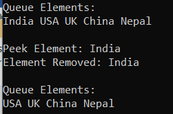

##### **کلاس Dictionary<TKey, TValue> در سی شارپ:**

کلاس مجموعه Generic Dictionary<TKey, TValue> در سی شارپ، نسخه عمومی Hashtable است. این کلاس نیز مانند Hashtable عمل می‌کند، با این تفاوت که روی یک شیء از نوع عمل می‌کند و یکی از مفیدترین مجموعه‌ها بر اساس جفت‌های کلید و مقدار است. مقادیر را بر اساس کلیدها ذخیره می‌کند. فقط شامل کلیدهای منحصر به فرد است. با کمک کلید، می‌توانیم به راحتی عناصر را جستجو یا حذف کنیم. کلاس مجموعه Dictionary<TKey, TValue> متعلق به فضای نام System.Collections.Generic است. بیایید مثالی از یک کلاس مجموعه Generic Dictionary<TKey, TValue> در سی شارپ را ببینیم که عناصر را با استفاده از متد Add() ذخیره می‌کند و عناصر را با استفاده از حلقه for-each تکرار می‌کند. در اینجا، ما از کلاس KeyValuePair برای دریافت کلیدها و مقادیر استفاده می‌کنیم.

```csharp
using System;
using System.Collections.Generic;

namespace GenericCollections
{
    public class GenericDictionaryDemo
    {
        public static void Main(string[] args)
        {
            Dictionary<int, string> dictionary = new Dictionary<int, string>();
            dictionary.Add(1, "One");
            dictionary.Add(2, "Two");
            dictionary.Add(3, "Three");
            dictionary.Add(4, "Four");
            dictionary.Add(5, "Five");

            Console.WriteLine("Dictionary Elements: ");
            foreach (KeyValuePair<int, string> kvp in dictionary)
            {
                Console.WriteLine($"Key: {kvp.Key}, Value: {kvp.Value}");
            }
            Console.ReadKey();
        }
    }
}
```

###### **خروجی:**

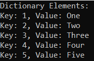

##### **کلاس SortedDictionary<TKey, TValue> در سی شارپ**

کلاس مجموعه Generic SortedDictionary<TKey, TValue> در سی شارپ مشابه کلاس مجموعه Dictionary<TKey, TValue> عمل می‌کند. این کلاس مقادیر را بر اساس کلیدها ذخیره می‌کند. این کلاس شامل کلیدهای منحصر به فرد است و مهمترین نکته این است که عناصر را به ترتیب صعودی بر روی کلید ذخیره می‌کند. با کمک یک کلید، می‌توانیم به راحتی عناصر را جستجو یا حذف کنیم. کلاس مجموعه SortedDictionary<TKey, TValue> متعلق به فضای نام System.Collections.Generic است. بیایید مثالی از یک کلاس مجموعه Generic SortedDictionary<TKey, TValue> در سی شارپ ببینیم که عناصر را با استفاده از متد Add() ذخیره می‌کند و عناصر را با استفاده از حلقه for-each تکرار می‌کند. در اینجا، ما از کلاس KeyValuePair برای دریافت کلیدها و مقادیر استفاده می‌کنیم.

```csharp
using System;
using System.Collections.Generic;

namespace GenericCollections
{
    public class GenericSortedDictionaryDemo
    {
        public static void Main(string[] args)
        {
            SortedDictionary<int, string> sortedDictionary = new SortedDictionary<int, string>();
            sortedDictionary.Add(1, "One");
            sortedDictionary.Add(5, "Five");
            sortedDictionary.Add(2, "Two");
            sortedDictionary.Add(4, "Four");
            sortedDictionary.Add(3, "Three");

            Console.WriteLine("SortedDictionary Elements: ");
            foreach (KeyValuePair<int, string> kvp in sortedDictionary)
            {
                Console.WriteLine($"Key: {kvp.Key}, Value: {kvp.Value}");
            }
            Console.ReadKey();
        }
    }
}
```

###### **خروجی:**

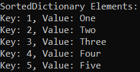

##### **کلاس SortedList<TKey, TValue> در سی شارپ**

کلاس مجموعه Generic SortedList<TKey, TValue> در سی شارپ، مجموعه‌ای از جفت‌های کلید/مقدار است که بر اساس کلیدها مرتب شده‌اند. به طور پیش‌فرض، این مجموعه جفت‌های کلید/مقدار را به ترتیب صعودی مرتب می‌کند. با کمک یک کلید، می‌توانیم به راحتی عناصر را جستجو یا حذف کنیم. کلاس SortedList<TKey, TValue> متعلق به فضای نام System.Collections.Generic است.

بیایید مثالی از یک کلاس مجموعه عمومی SortedList<TKey, TValue> در سی‌شارپ را ببینیم که عناصر را با استفاده از متد Add() ذخیره می‌کند و عناصر را با استفاده از حلقه for-each تکرار می‌کند. در اینجا، ما از کلاس KeyValuePair برای دریافت کلیدها و مقادیر استفاده می‌کنیم.

```csharp
using System;
using System.Collections.Generic;

namespace GenericCollections
{
    public class GenericSortedListDemo
    {
        public static void Main(string[] args)
        {
            SortedList<int, string> sortedList = new SortedList<int, string>();
            sortedList.Add(1, "One");
            sortedList.Add(5, "Five");
            sortedList.Add(2, "Two");
            sortedList.Add(4, "Four");
            sortedList.Add(3, "Three");
            
            Console.WriteLine("SortedList Elements: ");
            foreach (KeyValuePair<int, string> kvp in sortedList)
            {
                Console.WriteLine($"Key: {kvp.Key}, Value: {kvp.Value}");
            }
            Console.ReadKey();
        }
    }
}
```

###### **خروجی:**

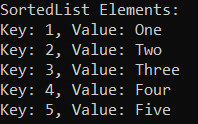

##### **کلاس LinkedList<T> در سی شارپ:**

کلاس مجموعه عمومی LinkedList<T> در سی شارپ از مفهوم لیست پیوندی استفاده می‌کند. این کلاس به ما امکان می‌دهد عناصر را به سرعت وارد و حذف کنیم. این کلاس می‌تواند عناصر تکراری داشته باشد. کلاس مجموعه LinkedList<T> متعلق به فضای نام System.Collections.Generic است. این کلاس به ما امکان می‌دهد عناصر را قبل یا بعد از آخرین اندیس اضافه و حذف کنیم. بیایید مثالی از یک کلاس مجموعه عمومی LinkedList<T> در سی شارپ ببینیم که عناصر را با استفاده از متدهای AddLast() و AddFirst() ذخیره می‌کند و عناصر را با استفاده از حلقه for-each تکرار می‌کند.

```csharp
using System;
using System.Collections.Generic;

namespace GenericCollections
{
    public class GenericLinkedListDemo
    {
        public static void Main(string[] args)
        {
            LinkedList<string> linkedList = new LinkedList<string>();
            linkedList.AddLast("One");
            linkedList.AddLast("Two");
            linkedList.AddLast("Three");
            linkedList.AddLast("Four");
            linkedList.AddFirst("Five"); //Added to first index

            Console.WriteLine("LinkedList Elements: ");
            foreach (var item in linkedList)
            {
                Console.WriteLine($"{item} ");
            }
            Console.ReadKey();
        }
    }
}
```

###### **خروجی:**

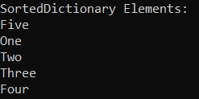