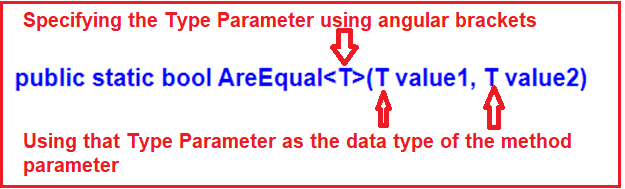
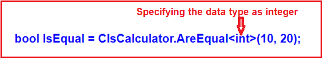
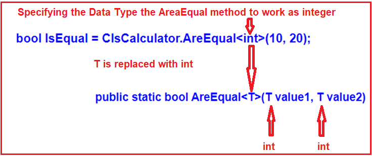
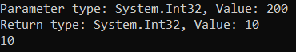
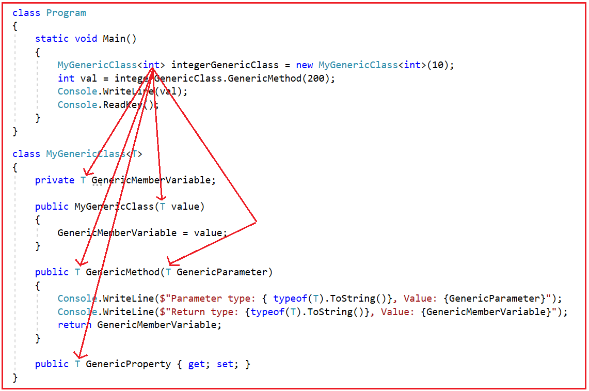
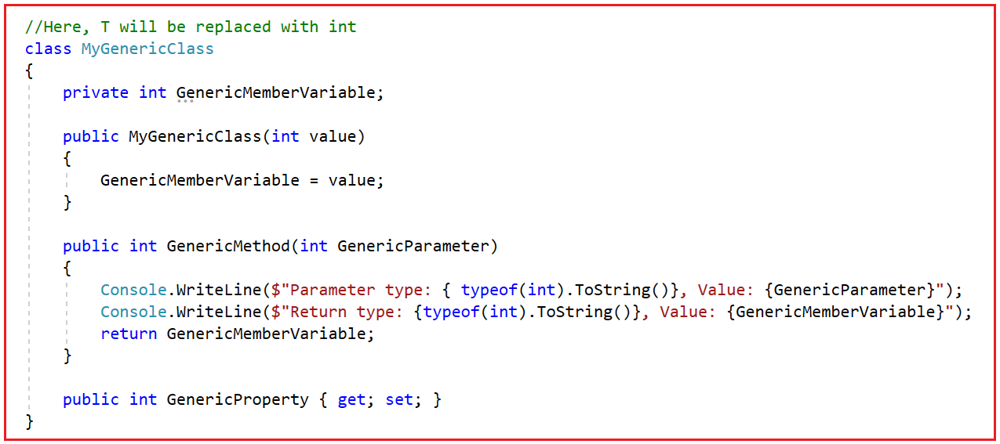
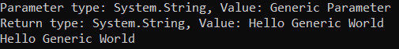
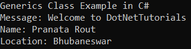
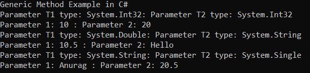
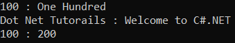

## **Generic‌ها در سی‌شارپ به همراه مثال**

در این مقاله، قصد دارم نحوه پیاده‌سازی **Genericها در سی‌شارپ را** با مثال‌هایی مورد بحث قرار دهم. لطفاً مقاله قبلی ما را که در آن در مورد مجموعه Generic در سی‌شارپ بحث کردیم، مطالعه کنید. در سی‌شارپ، Generic به معنای عدم وابستگی به یک نوع داده خاص است، و آن نوع توسط کامپایلر در زمان کامپایل تعیین می‌شود. به عنوان بخشی از این مقاله، قصد داریم نکات زیر را مورد بحث قرار دهیم.

1. **چرا در سی شارپ به Generic ها نیاز داریم؟**
2. **Generic ها در سی شارپ چیستند؟**
3. **مزایای Generic ها در سی شارپ**
4. **چگونه می‌توان Genericها را در سی شارپ با مثال پیاده‌سازی کرد؟**
5. **چگونه می‌توان از Genericها با کلاس و اعضای آن در سی شارپ استفاده کرد؟**

##### **چرا در سی شارپ به Generic ها نیاز داریم؟**

Generic مفهومی است که به ما امکان می‌دهد کلاس‌ها و متدها را با placeholder تعریف کنیم. کامپایلر C# این placeholderها را در زمان کامپایل با نوع مشخص شده جایگزین می‌کند. مفهوم generics برای ایجاد کلاس‌ها و متدهای همه منظوره استفاده می‌شود.

بیایید با یک مثال، نیاز به Genericها در C# را درک کنیم. بیایید یک برنامه ساده برای بررسی برابری یا عدم برابری دو عدد صحیح ایجاد کنیم. پیاده‌سازی کد زیر بسیار سرراست است. در اینجا دو کلاس با نام‌های **ClsCalculator** و **ClsMain** ایجاد کرده‌ایم . در **کلاس ClsCalculator** را داریم **، متد AreEqual()** که دو مقدار صحیح را به عنوان پارامتر ورودی می‌گیرد و سپس بررسی می‌کند که آیا دو مقدار ورودی برابر هستند یا خیر. اگر هر دو برابر باشند، مقدار true را برمی‌گرداند، در غیر این صورت مقدار false را برمی‌گرداند. و از **کلاس ClsMain** را فراخوانی می‌کنیم **، متد استاتیک AreEqual()** و خروجی را بر اساس مقدار بازگشتی نشان می‌دهیم.

```csharp
using System;

namespace GenericsDemo
{
    public class ClsMain
    {
        private static void Main()
        {
            bool IsEqual = ClsCalculator.AreEqual(10, 20);
            if (IsEqual)
            {
                Console.WriteLine("Both are Equal");
            }
            else
            {
                Console.WriteLine("Both are Not Equal");
            }

            Console.ReadKey();
        }
    }

    public class ClsCalculator
    {
        public static bool AreEqual(int value1, int value2)
        {
            return value1 == value2;
        }
    }
}
```

فوق **متد AreEqual()** همانطور که انتظار می‌رود کار می‌کند و مهم‌تر از آن، فقط با مقادیر صحیح کار می‌کند، زیرا این نیاز اولیه ماست. فرض کنید نیاز ما تغییر کند، اکنون باید بررسی کنیم که آیا دو مقدار رشته‌ای برابر هستند یا خیر.

در مثال بالا، اگر سعی کنیم مقادیری غیر از مقادیر صحیح را ارسال کنیم، با خطای زمان کامپایل مواجه خواهیم شد. دلیل این امر آن است که **متد AreEqual()** از **کلاس ClsCalculator** به شدت به نوع داده صحیح وابسته است و از این رو فراخوانی متد AreEqual به غیر از مقادیر نوع داده صحیح امکان‌پذیر نیست. بنابراین، هنگامی که سعی می‌کنیم **متد AreEqual()** را با ارسال مقادیر رشته‌ای مطابق شکل زیر فراخوانی کنیم، با خطای زمان کامپایل مواجه می‌شویم.

**bool Equal = ClsCalculator.AreEqual(“ABC”, “XYZ”);**

یکی از راه‌هایی که می‌توانیم متد AreEqual() فوق را طوری تنظیم کنیم که مقادیر نوع رشته و همچنین مقادیر نوع عدد صحیح را بپذیرد، این است که از   نوع داده شیء (object) به عنوان پارامتر استفاده کنیم. اگر پارامترهای متد AreEqual() را از نوع داده شیء (Object) تعیین کنیم، آنگاه با هر نوع داده‌ای کار خواهد کرد.

**نکته:** مهمترین نکته‌ای که باید به خاطر داشته باشید این است که هر نوع داده .NET، چه نوع داده اولیه باشد و چه نوع داده مرجع، به طور مستقیم یا غیرمستقیم از **نوع داده System.Object** ارث‌بری می‌کند .

##### **اصلاح متد AreEqual() برای پذیرش هر نوع داده‌ای:**

بیایید متد AreEqual() از **ClsCalculator** کلاس را طوری تغییر دهیم که از نوع داده Object استفاده کند، به طوری که بتواند هر نوع مقداری را همانطور که در زیر نشان داده شده است، بپذیرد.

```csharp
using System;

namespace GenericsDemo
{
    public class ClsMain
    {
        private static void Main()
        {
           // bool IsEqual = ClsCalculator.AreEqual(10, 20);
            bool IsEqual = ClsCalculator.AreEqual("ABC", "ABC");
            if (IsEqual)
            {
                Console.WriteLine("Both are Equal");
            }
            else
            {
                Console.WriteLine("Both are Not Equal");
            }
            Console.ReadKey();
        }
    }

    public class ClsCalculator
    {
        //Now this method can accept any data type
        public static bool AreEqual(object value1, object value2)
        {
            return value1 == value2;
        }
    }
}
```

همین. برنامه را اجرا کنید و خواهید دید که مطابق انتظار کار می‌کند. بیایید مشکل پیاده‌سازی کد بالا را بررسی کنیم.

1. به دلیل boxing و unboxing، عملکرد ضعیفی داریم. نوع شیء باید به نوع مقداری تبدیل شود.
2. اکنون، متد AreEuqal() از نوع ایمن (type-safe) نیست. اکنون می‌توان یک مقدار رشته‌ای برای پارامتر اول و یک مقدار صحیح برای پارامتر دوم ارسال کرد.

##### **سربارگذاری متد برای دستیابی به همان هدف:**

گزینه دیگر این است که ما باید متد AreEqual را که انواع مختلفی از پارامترها را می‌پذیرد، همانطور که در زیر نشان داده شده است، overload کنیم. همانطور که در کد زیر مشاهده می‌کنید، اکنون سه متد مختلف با نام یکسان اما با انواع مختلف پارامترها ایجاد کرده‌ایم. این چیزی جز overloading متد نیست. اکنون، برنامه را اجرا کنید و خواهید دید که همه چیز مطابق انتظار کار می‌کند.

```csharp
using System;

namespace GenericsDemo
{
    public class ClsMain
    {
        private static void Main()
        {
           // bool IsEqual = ClsCalculator.AreEqual(10, 20);
           // bool IsEqual = ClsCalculator.AreEqual("ABC", "ABC");
            bool IsEqual = ClsCalculator.AreEqual(10.5, 20.5);

            if (IsEqual)
            {
                Console.WriteLine("Both are Equal");
            }
            else
            {
                Console.WriteLine("Both are Not Equal");
            }

            Console.ReadKey();
        }
    }

    public class ClsCalculator
    {
        public static bool AreEqual(int value1, int value2)
        {
            return value1 == value2;
        }

        public static bool AreEqual(string value1, string value2)
        {
            return value1 == value2;
        }

        public static bool AreEqual(double value1, double value2)
        {
            return value1 == value2;
        }
    }
}
```

مشکل پیاده‌سازی کد بالا این است که ما منطق یکسانی را در هر متد تکرار می‌کنیم. با این حال، اگر فردا نیاز به مقایسه دو مقدار اعشاری یا دو مقدار طولانی داشته باشیم، باید دو متد دیگر ایجاد کنیم. من نمی‌خواهم منطق را بارها و بارها تکرار کنم، یعنی فقط به یک متد با منطق نیاز دارم و اگر فردا دو متد داشته باشیم، باید دو مقدار اعشاری یا دو مقدار طولانی را مقایسه کنیم، متد من باید این کار را انجام دهد. راه حل چیست؟

##### **چگونه مشکلات فوق را در سی شارپ حل کنیم؟**

ما می‌توانیم مشکلات فوق را با Genericها در C# حل کنیم. با Genericها، متد AreEqual() را طوری تنظیم می‌کنیم که با انواع مختلف داده‌ها کار کند. ابتدا پیاده‌سازی کد را برای استفاده از Genericها تغییر می‌دهیم و سپس نحوه عملکرد آن را مورد بحث قرار خواهیم داد.

```csharp
using System;

namespace GenericsDemo
{
    public class ClsMain
    {
        private static void Main()
        {
            //bool IsEqual = ClsCalculator.AreEqual<int>(10, 20);
            //bool IsEqual = ClsCalculator.AreEqual<string>("ABC", "ABC");
            bool IsEqual = ClsCalculator.AreEqual<double>(10.5, 20.5);
            if (IsEqual)
            {
                Console.WriteLine("Both are Equal");
            }
            else
            {
                Console.WriteLine("Both are Not Equal");
            }
            Console.ReadKey();
        }
    }

    public class ClsCalculator
    {
        //public static bool AreEqual(int value1, int value2)
        //{
        //    return value1 == value2;
        //}

        public static bool AreEqual<T>(T value1, T value2)
        {
            return value1.Equals(value2);
        }
    }
}
```

در مثال بالا، برای اینکه **متد AreEqual()** را عمومی کنیم (عمومی به این معنی است که یک متد با انواع داده‌های مختلف کار می‌کند)، نوع پارامتر T را با استفاده از براکت‌های زاویه‌دار <T> مشخص کرده‌ایم. سپس از آن نوع به عنوان نوع داده برای پارامترهای متد، همانطور که در تصویر زیر نشان داده شده است، استفاده می‌کنیم.



در این مرحله، اگر می‌خواهید **متد AreEqual()** فوق را فراخوانی کنید ، باید نوع داده‌ای را که متد باید روی آن عمل کند، مشخص کنید. برای مثال، اگر می‌خواهید با مقادیر صحیح کار کنید، باید **متد AreEqual()** را با مشخص کردن int به عنوان نوع داده، همانطور که در تصویر زیر با استفاده از براکت‌های زاویه‌دار نشان داده شده است، فراخوانی کنید.



متد ژنریک AreEqual() فوق به صورت زیر عمل می‌کند:



اگر می‌خواهید با مقادیر رشته‌ای کار کنید، باید متد AreEqual() را مطابق شکل زیر فراخوانی کنید.  
**bool IsEqual= ClsCalculator.AreEqual<string>("ABC", "ABC"); // معادل بولی مساوی است با ClsCalculator.AreEqual<string>("ABC", "ABC");**

حالا، امیدوارم که نیاز و اهمیت Genericها را در C# درک کرده باشید.

##### **Generic ها در سی شارپ چیستند؟**

همانطور که قبلاً بحث کردیم، Genericها به عنوان بخشی از C# 2.0 معرفی شدند. Genericها به ما امکان می‌دهند کلاس‌ها و متدهایی را تعریف کنیم که از نوع داده جدا هستند. به عبارت دیگر، می‌توان گفت که Genericها به ما امکان می‌دهند کلاس‌هایی را با استفاده از براکت‌های زاویه‌ای که نوع داده اعضای آن را مشخص می‌کنند، ایجاد کنیم. در زمان کامپایل، این براکت‌های زاویه‌ای با برخی از انواع داده خاص جایگزین می‌شوند. در C#، Genericها را می‌توان در موارد زیر اعمال کرد:

1. **رابط**
2. **کلاس انتزاعی**
3. **کلاس**
4. **روش**
5. **روش استاتیک**
6. **ملک**
7. **رویداد**
8. **نمایندگان**

##### **مزایای Generic ها در سی شارپ**

1. **قابلیت استفاده مجدد از کد را افزایش می‌دهد** : برای مثال، می‌توانید یک متد عمومی برای جمع دو عدد ایجاد کنید. این متد می‌تواند برای جمع دو عدد صحیح و همچنین دو عدد اعشاری بدون هیچ گونه تغییری در کد استفاده شود.
2. **ژنریک‌ها از نظر نوع داده ایمن هستند:** ژنریک‌ها، به خصوص در مورد مجموعه‌ها، از نظر نوع داده ایمن هستند. هنگام استفاده از ژنریک‌ها، باید نوع اشیاء مورد نظر برای ارسال به یک مجموعه را تعریف کنیم. این به کامپایلر کمک می‌کند تا اطمینان حاصل کند که فقط آن دسته از اشیاء که در تعریف تعریف شده‌اند، می‌توانند به مجموعه ارسال شوند. اگر سعی کنیم از نوع داده متفاوتی به جای نوع داده‌ای که در تعریف مشخص کرده‌ایم استفاده کنیم، با خطای زمان کامپایل مواجه خواهیم شد.
3. **عمومی‌ها عملکرد بهتری ارائه می‌دهند** : در مقایسه با غیر عمومی‌ها، عملکرد بهتری ارائه می‌دهند زیرا نیاز به boxing، unboxing و typecasting متغیرها یا اشیاء را کاهش می‌دهند.

##### **چگونه می‌توان از Genericها با کلاس و اعضای آن در سی شارپ استفاده کرد؟**

بیایید یک کلاس عمومی با یک سازنده عمومی، متغیر عضو عمومی، ویژگی عمومی و یک متد عمومی ایجاد کنیم. لطفاً یک فایل کلاس با نام MyGenericClass.cs ایجاد کنید و سپس کد زیر را در آن کپی و جایگذاری کنید. کد مثال زیر خود گویای همه چیز است، بنابراین لطفاً خطوط توضیحات را مطالعه کنید.

```csharp
using System;

namespace GenericsDemo
{
    //MyGenericClass is a Generic Class
    //Here T specifies the Data Types of the class Members
    class MyGenericClass<T>
    {
        //Generic variable
        //The data type is generic i.e. T
        private T GenericMemberVariable;

        //Generic Constructor
        //Constructor accepts one parameter of Generic type i.e. T
        public MyGenericClass(T value)
        {
            GenericMemberVariable = value;
        }

        //Generic Method
        //Method accepts one Generic type Parameter i.e. T
        //Method return type also Generic i.e. T
        public T GenericMethod(T GenericParameter)
        {
            Console.WriteLine($"Parameter type: { typeof(T).ToString()}, Value: {GenericParameter}");
            Console.WriteLine($"Return type: {typeof(T).ToString()}, Value: {GenericMemberVariable}");
            return GenericMemberVariable;
        }

        //Generic Property
        //The data type is generic i.e. T
        public T GenericProperty { get; set; }
    }
}
```

در مثال بالا، ما کلاس MyGenericClass را با پارامتر <T> ایجاد کردیم. براکت‌های زاویه‌دار (<T>) نشان می‌دهند که MyGenericClass یک کلاس عمومی است و نوع این <T> بعداً تعریف خواهد شد. بعداً باید هنگام ایجاد نمونه‌ای از کلاس MyGenericClass، نوع داده T را مشخص کنیم. می‌توانید نوع داده T را به عنوان انواع داده اولیه مانند int، float، long و غیره یا انواع داده مرجع مانند String، Object، Customer، Employee و غیره مشخص کنید.

بنابراین، هنگام ایجاد نمونه‌ای از کلاس MyGenericClass، باید نوع آن را مشخص کنیم و کامپایلر آن نوع را به T اختصاص می‌دهد. در مثال زیر، از int به عنوان نوع داده استفاده می‌کنیم. هنگامی که نمونه‌ای از MyGenericClass ایجاد می‌کنیم، متد GenericMethod را فراخوانی می‌کنیم. از آنجایی که هنگام ایجاد نمونه، T را به عنوان int مشخص کرده‌ایم، نیازی به تعیین همان نوع در هنگام فراخوانی اعضای کلاس نداریم.

```csharp
using System;

namespace GenericsDemo
{
    class Program
    {
        static void Main()
        {
            MyGenericClass<int> integerGenericClass = new MyGenericClass<int>(10);
            int val = integerGenericClass.GenericMethod(200);
            Console.WriteLine(val);
            Console.ReadKey();
        }
    }
}
```

برنامه را اجرا کنید و خروجی زیر را به شما خواهد داد.



**نمودار زیر نشان می‌دهد که چگونه کامپایلر، T را با نوع داده int جایگزین می‌کند.**



**کامپایلر، کلاس فوق را برای نمونه‌سازی کلاس با نوع داده int، همانطور که در تصویر زیر نشان داده شده است، کامپایل می‌کند.**



در زمان نمونه‌سازی، می‌توانید از هر نوعی که نیاز دارید استفاده کنید. اگر می‌خواهید از نوع رشته‌ای استفاده کنید، باید کلاس را مطابق شکل زیر نمونه‌سازی کنید.

```csharp
using System;

namespace GenericsDemo
{
    class Program
    {
        static void Main()
        {
            MyGenericClass<string> stringGenericClass = new MyGenericClass<string>("Hello Generic World");
            stringGenericClass.GenericProperty = "This is a generic property example.";
            string result = stringGenericClass.GenericMethod("Generic Parameter");
            Console.WriteLine(result);
            Console.ReadKey();
        }
    }
}
```

###### **خروجی:**



حالا، امیدوارم مفهوم Genericها را در سی شارپ درک کرده باشید. Genericها به شدت توسط کلاس‌های collection که متعلق به **فضای نام System.Collections.Generic** هستند، استفاده می‌شوند . حالا، بیایید چند مثال بزنیم تا نحوه استفاده از Genericها با کلاس‌ها، فیلدها و متدها در سی شارپ را درک کنیم.

##### **مثال کلاس عمومی در سی شارپ**

مثال زیر نحوه ایجاد یک کلاس عمومی با استفاده از پارامتر نوع (T) به همراه براکت‌های زاویه (<>) در زبان C# را نشان می‌دهد. در مثال زیر، ما کلاسی با نوع <T> ایجاد می‌کنیم و سپس یک متغیر و متد با استفاده از پارامتر T ایجاد کرده‌ایم. سپس هنگام ایجاد نمونه، نوع T را به عنوان یک رشته مشخص کرده‌ایم. بنابراین، در زمان کامپایل، هر کجا که از T در GenericClass استفاده کرده‌اید، با نوع داده رشته جایگزین خواهد شد.

```csharp
using System;

namespace GenericsDemo
{
    public class GenericClass<T>
    {
        public T Message;
        public void GenericMethod(T Name, T Location)
        {
            Console.WriteLine($"Message: {Message}");
            Console.WriteLine($"Name: {Name}");
            Console.WriteLine($"Location: {Location}");
        }
    }
    class Program
    {
        static void Main(string[] args)
        {
            Console.WriteLine("Generics Class Example in C#");
            //Instantiate GenericClass, string is the type argument
            GenericClass<string> myGenericClass = new GenericClass<string>
            {
                Message = "Welcome to DotNetTutorials"
            };
            myGenericClass.GenericMethod("Pranata Rout", "Bhubaneswar");
            Console.ReadLine();
        }
    }
}
```

حالا، وقتی کد بالا را اجرا کنید، خروجی زیر را دریافت خواهید کرد.



##### **مثال متد عمومی در سی شارپ:**

همچنین در سی شارپ می‌توان یک متد را به صورت عمومی تعریف کرد، یعنی می‌توانیم هنگام ایجاد متد، <T> را تعریف کنیم. در این صورت، می‌توانیم متد عمومی را با ارسال هر نوع آرگومانی فراخوانی کنیم. برای درک بهتر، لطفاً به مثال زیر نگاهی بیندازید که نحوه ایجاد و فراخوانی یک متد عمومی در سی شارپ را نشان می‌دهد. لطفاً توجه داشته باشید که در اینجا ما کلاس را عمومی نمی‌سازیم، بلکه فقط متد را عمومی می‌کنیم. در مثال زیر، متد عمومی را با دو پارامتر عمومی کار می‌کنیم. بنابراین، هنگام فراخوانی متد، باید نوع T1 و T2 را مشخص کنیم.

```csharp
using System;

namespace GenericsDemo
{
    public class SomeClass
    {
        //Making the Method as Generic by using the <T1, T2> 
        //Then using T1 and T2 as parameters of the method
        public void GenericMethod<T1, T2>(T1 Param1, T2 Param2)
        {
            Console.WriteLine($"Parameter T1 type: {typeof(T1)}: Parameter T2 type: {typeof(T2)}");
            Console.WriteLine($"Parameter 1: {Param1} : Parameter 2: {Param2}");
        }
    }

    class Program
    {
        static void Main(string[] args)
        {
            Console.WriteLine("Generic Method Example in C#");
            SomeClass s = new SomeClass();
            //While calling the method we need to specify the type for both T1 and T2
            s.GenericMethod<int, int>(10, 20);
            s.GenericMethod<double, string>(10.5, "Hello");
            s.GenericMethod<string, float>("Anurag", 20.5f);
            Console.ReadLine();
        }
    }
}
```

حالا، وقتی کد بالا را اجرا کنید، خروجی زیر را دریافت خواهید کرد.



##### **مثال فیلد عمومی در سی شارپ:**

یک کلاس جنریک می‌تواند شامل فیلدهای جنریک از انواع جنریک مختلف باشد. برای درک بهتر، لطفاً به مثال زیر نگاهی بیندازید که نحوه ایجاد و استفاده از یک فیلد جنریک در سی شارپ را نشان می‌دهد. در مثال زیر، ما دو نوع جنریک یعنی T1 و T2 را تعریف می‌کنیم. هنگام ایجاد نمونه، باید انواع T1 و T2 را مشخص کنیم.

```csharp
using System;

namespace GenericsDemo
{
    public class GenericClass<T1, T2>
    {
        public GenericClass(T1 Parameter1, T2 Parameter2)
        {
            Param1 = Parameter1;
            Param2 = Parameter2;
        }
        public T1 Param1 { get; }
        public T2 Param2 { get; }
    }

    class Program
    {
        static void Main()
        {
            var obj1 = new GenericClass<int, string>(100, "One Hundred");
            Console.WriteLine($"{obj1.Param1} : {obj1.Param2}");

            var obj2 = new GenericClass<string, string>("Dot Net Tutorails", "Welcome to C#.NET");
            Console.WriteLine($"{obj2.Param1} : {obj2.Param2}");

            var obj3 = new GenericClass<int, int>(100, 200);
            Console.WriteLine($"{obj3.Param1} : {obj3.Param2}");

            Console.ReadKey();
        }
    }
}
```

حالا، وقتی کد بالا را اجرا کنید، خروجی زیر را دریافت خواهید کرد.


