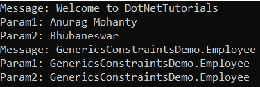
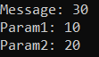
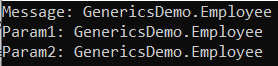
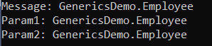
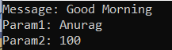

## **محدودیت‌های عمومی در سی شارپ به همراه مثال**

در این مقاله، قصد دارم **محدودیت‌های عمومی (Generic Constraints) در سی‌شارپ را** با مثال‌هایی مورد بحث قرار دهم. لطفاً مقاله قبلی ما را که در آن نحوه پیاده‌سازی ژنریک‌ها در سی‌شارپ را با مثال‌هایی مورد بحث قرار دادیم، مطالعه کنید.

##### **محدودیت‌های عمومی در سی شارپ**

محدودیت‌ها در سی‌شارپ چیزی جز اعتبارسنجی‌هایی نیستند که می‌توانیم روی پارامتر نوع عمومی قرار دهیم. این بدان معناست که از محدودیت‌ها برای محدود کردن انواعی که می‌توانند جایگزین پارامترهای نوع شوند، استفاده می‌شود. اگر سعی کنید یک نوع عمومی را با استفاده از نوعی که توسط محدودیت‌های مشخص شده مجاز نیست، جایگزین کنید، خطای زمان کامپایل به شما داده می‌شود. همچنین می‌توان یک یا چند محدودیت را روی نوع عمومی با استفاده از عبارت where بعد از نام نوع عمومی مشخص کرد. اگر در حال حاضر این موضوع برایتان واضح نیست، نگران نباشید، سعی خواهیم کرد این موضوع را با مثال‌هایی درک کنیم.

##### **چرا در سی شارپ به محدودیت‌های عمومی نیاز داریم؟**

ابتدا بیایید بفهمیم که چرا به قیدها نیاز داریم و سپس انواع مختلف قیدهای عمومی (generic constraints) را در سی‌شارپ (C#) با مثال بررسی خواهیم کرد. همانطور که قبلاً بحث کردیم، از قیدهای عمومی برای تعریف یک کلاس یا ساختار یا متد با متغیرهایی (پارامترهای نوع) استفاده می‌شود تا نشان دهد که می‌توانند از هر یک از انواع استفاده کنند. برای درک بهتر، لطفاً به مثال زیر نگاهی بیندازید. مثال زیر یک کلاس عمومی با پارامتر نوع (T) را به عنوان متغیر با براکت‌های زاویه (<>) نشان می‌دهد.

```csharp
using System;

namespace GenericsConstraintsDemo
{
    public class GenericClass<T>
    {
        public T Message;
        public void GenericMethod(T Param1, T Param2)
        {
            Console.WriteLine($"Message: {Message}");
            Console.WriteLine($"Param1: {Param1}");
            Console.WriteLine($"Param2: {Param2}");
        }
    }
}
```

همانطور که در کد بالا مشاهده می‌کنید، در اینجا ما یک کلاس به نام GenericClass با یک متغیر به نام Message و یک متد به نام GenericMethod با استفاده از پارامتر نوع T ایجاد کرده‌ایم و این پارامتر نوع را با نام کلاس با استفاده از براکت‌های زاویه‌دار (<>) تعریف کرده‌ایم. در اینجا، GenericClass چیزی در مورد متغیر تعریف شده یعنی T نمی‌داند و از این رو هر نوع مقداری را بر اساس نیازهای ما می‌پذیرد، یعنی می‌تواند یک رشته، int، struct، boolean، class و غیره را بپذیرد. به همین دلیل است که ما در C# از genericها استفاده می‌کنیم.

اما اگر می‌خواهید یک کلاس عمومی را محدود کنید تا فقط نوع خاصی از placeholder را بپذیرد، باید از Generic Constraints استفاده کنیم. بنابراین، با استفاده از Generic Constraints در C#، می‌توانیم مشخص کنیم که کلاس عمومی چه نوع placeholderی را می‌تواند بپذیرد. اگر سعی کنیم یک کلاس عمومی را با نوع placeholder که توسط یک constraint مجاز نیست، نمونه‌سازی کنیم، کامپایلر خطای زمان کامپایل می‌دهد. به عنوان مثال، اگر نوع عمومی را برای پذیرش در نوع کلاس مشخص کنیم، بعداً اگر سعی کنیم int، bool یا هر نوع مقداری را ارسال کنیم، با خطای زمان کامپایل مواجه خواهیم شد. حال، امیدوارم متوجه شده باشید که چرا در C# به Generic Constraints نیاز داریم.

**سینتکس: GenericTypeName<T> که در آن T: محدودیت ۱، محدودیت ۲**

##### **انواع محدودیت‌های عمومی در سی شارپ:**

محدودیت‌ها، اعتبارسنجی‌هایی هستند که می‌توانیم روی پارامترهای نوع عمومی قرار دهیم. در زمان نمونه‌سازی کلاس عمومی، اگر نوع نامعتبری ارائه دهیم، کامپایل خطا می‌دهد. در سی شارپ، محدودیت‌های عمومی با استفاده از کلمه کلیدی where مشخص می‌شوند. در زیر لیستی از انواع مختلف محدودیت‌های عمومی موجود در سی شارپ آمده است.

1. **که در آن T: struct** \=> آرگومان نوع باید از نوع مقادیر غیر تهی مانند انواع داده اولیه int، double، char، bool، float و غیره باشد. محدودیت struct را نمی‌توان با محدودیت مدیریت نشده ترکیب کرد.
2. **که در آن T: class** \=> آرگومان type باید از نوع ارجاعی باشد. این محدودیت می‌تواند به هر نوع کلاس (غیر تهی‌پذیر)، رابط، نماینده یا آرایه در C# اعمال شود.
3. **که در آن T: new()** \=> آرگومان نوع باید یک نوع مرجع باشد که دارای سازنده عمومی (پیش‌فرض) بدون پارامتر باشد.
4. **که در آن T: <نام کلاس پایه>** \=> نوع آرگومان باید از کلاس پایه مشخص شده باشد یا از آن مشتق شود.
5. **که در آن T: <interface name>** \=> آرگومان نوع باید رابط مشخص شده باشد یا آن را پیاده‌سازی کند. همچنین، می‌توان چندین محدودیت رابط را مشخص کرد.
6. **که در آن T: U** \=> آرگومان نوع ارائه شده برای آن باید از آرگومان ارائه شده برای U باشد یا از آن مشتق شود. در یک زمینه nullable، اگر U یک نوع مرجع غیر nullable باشد، T باید یک نوع مرجع غیر nullable باشد. اگر U یک نوع مرجع nullable باشد، T می‌تواند nullable یا non-nullable باشد.

حال، بیایید بیشتر پیش برویم و کاربرد هر قید در ژنریک‌ها را با مثال‌هایی درک کنیم.

#### **که در آن T: محدودیت عمومی کلاس در سی شارپ**

آرگومان نوع باید از نوع مرجع باشد. ما می‌دانیم که یک کلاس در سی شارپ از نوع مرجع است. بنابراین « **که در آن T: class** » یک قید نوع مرجع است. این بدان معناست که این قید می‌تواند برای هر کلاس (غیر تهی‌پذیر)، رابط، نماینده یا نوع آرایه در سی شارپ اعمال شود. برای درک بهتر، لطفاً به مثال زیر نگاهی بیندازید.

```csharp
using System;

namespace GenericsConstraintsDemo
{
    public class GenericClass<T> where T : class
    {
        public T Message;
        public void GenericMethod(T Param1, T Param2)
        {
            Console.WriteLine($"Message: {Message}");
            Console.WriteLine($"Param1: {Param1}");
            Console.WriteLine($"Param2: {Param2}");
        }
    }
}
```

اگر به کد بالا توجه کنید، در اینجا، ما GenericClass را با قید « **که در آن T: clas** **s** » تعریف کرده‌ایم. این یعنی، اکنون GenericClass فقط آرگومان‌های نوع مرجع را می‌پذیرد. بیایید با ارسال آرگومان‌های نوع مرجع به شرح زیر، یک نمونه از کلاس Generic ایجاد کنیم. در C#، رشته یک نوع مرجع است.  
**کلاس عمومی <string> stringClass = new کلاس عمومی <string>();**

دستور زیر خطای زمان کامپایل به شما می‌دهد زیرا int یک نوع مقداری است، نه یک نوع ارجاعی.  
**کلاس عمومی intClass = new کلاس عمومی();**

##### **مثالی برای درک محل T: class Generic Constraint در سی شارپ**

وقتی با استفاده از آرگومان‌های نوع مرجع مانند string و class یک نمونه از GenericClass ایجاد می‌کنیم، به خوبی کار می‌کند. اما وقتی سعی می‌کنیم با انواع داخلی مانند int، bool و غیره یک نمونه ایجاد کنیم، با خطای زمان کامپایل مواجه می‌شویم.

```csharp
using System;

namespace GenericsConstraintsDemo
{
    public class GenericClass<T> where T : class
    {
        public T Message;
        public void GenericMethod(T Param1, T Param2)
        {
            Console.WriteLine($"Message: {Message}");
            Console.WriteLine($"Param1: {Param1}");
            Console.WriteLine($"Param2: {Param2}");
        }
    }

    public class Employee
    {
        public string Name { get; set; }
        public string Location { get; set; }
    }

    class Program
    {
        static void Main()
        {
            // Instantiate Generic Class with Constraint
            GenericClass<string> stringClass = new GenericClass<string>();
            stringClass.Message = "Welcome to DotNetTutorials";
            stringClass.GenericMethod("Anurag Mohanty", "Bhubaneswar");

            GenericClass<Employee> EmployeeClass = new GenericClass<Employee>();
            Employee emp1 = new Employee() { Name = "Anurag", Location = "Bhubaneswar" };
            Employee emp2 = new Employee() { Name = "Mohanty", Location = "Cuttack" };
            Employee emp3 = new Employee() { Name = "Sambit", Location = "Delhi" };
            EmployeeClass.Message = emp1;
            EmployeeClass.GenericMethod(emp2, emp3);

            // The following statement will giveCompile Time Error as int is a value type, not reference type
            //GenericClass<int> intClass = new GenericClass<int>();  
            Console.ReadKey();
        }
    }
}
```

###### **خروجی:**



#### **که در آن T: struct محدودیت عمومی در سی شارپ**

اگر می‌خواهید آرگومان نوع فقط نوع مقدار را بپذیرد، باید از محدودیت‌های where T:struct در C# استفاده کنید. در این حالت، آرگومان نوع باید از انواع مقادیر غیر تهی مانند int، double، char، bool، float و غیره باشد. محدودیت struct را نمی‌توان با محدودیت unmanaged ترکیب کرد. برای درک بهتر، مثالی را بررسی می‌کنیم. برای درک بهتر، لطفاً به مثال زیر نگاهی بیندازید.

```csharp
using System;

namespace GenericsConstraintsDemo
{
    public class GenericClass<T> where T : struct
    {
        public T Message;
        public void GenericMethod(T Param1, T Param2)
        {
            Console.WriteLine($"Message: {Message}");
            Console.WriteLine($"Param1: {Param1}");
            Console.WriteLine($"Param2: {Param2}");
        }
    }
}
```

اگر به کد بالا توجه کنید، در اینجا، ما GenericClass را با قید generic " **where T: struct** " تعریف کرده‌ایم. این یعنی، اکنون GenericClass فقط آرگومان‌های نوع مقداری را می‌پذیرد. بیایید با ارسال آرگومان‌های نوع مقداری به صورت زیر، یک نمونه از GenericClass ایجاد کنیم.  
**کلاس عمومی intClass = new کلاس عمومی();**

دستور زیر به شما خطای زمان کامپایل می‌دهد زیرا رشته از نوع ارجاعی است، نه از نوع مقداری.  
**کلاس عمومی <string> stringClass = new کلاس عمومی <string>();**

##### **مثالی برای درک محل T: struct** **Generics** **Constraint در سی شارپ**

وقتی با استفاده از آرگومان‌های نوع مقداری مانند int، یک نمونه از GenericClass ایجاد می‌کنیم، به خوبی کار می‌کند. اما وقتی سعی می‌کنیم با انواع ارجاعی مانند String، Employee و غیره یک نمونه ایجاد کنیم، با خطای زمان کامپایل مواجه خواهیم شد.

```csharp
using System;

namespace GenericsConstraintsDemo
{
    public class GenericClass<T> where T : struct
    {
        public T Message;
        public void GenericMethod(T Param1, T Param2)
        {
            Console.WriteLine($"Message: {Message}");
            Console.WriteLine($"Param1: {Param1}");
            Console.WriteLine($"Param2: {Param2}");
        }
    }

    public class Employee
    {
        public string Name { get; set; }
        public string Location { get; set; }
    }

    public class Program
    {
        static void Main()
        {
            // Instantiate Generic Class with Constraint
            GenericClass<int> intClass = new GenericClass<int>();
            intClass.Message = 30;
            intClass.GenericMethod(10, 20);

            //Compile Time Error as string is not a value type, it is a reference type
            //GenericClass<string> stringClass = new GenericClass<string>();

            //Compile Time Error as Employee is not a value type, it is a reference type
            //GenericClass<Employee> EmployeeClass = new GenericClass<Employee>();
            Console.ReadKey();
        }
    }
}
```

###### **خروجی:**



#### **که در آن T: محدودیت عمومی new() در سی شارپ**

در اینجا، آرگومان نوع باید یک نوع مرجع باشد که دارای سازنده عمومی (پیش‌فرض) بدون پارامتر باشد. این بدان معناست که با کمک محدودیت new()، فقط می‌توانیم انواعی را مشخص کنیم که دارای سازنده بدون پارامتر باشند. برای درک بهتر، لطفاً به مثال زیر نگاهی بیندازید.

```csharp
using System;

namespace GenericsDemo
{
    public class GenericClass<T> where T : new()
    {
        public T Message;
        public void GenericMethod(T Param1, T Param2)
        {
            Console.WriteLine($"Message: {Message}");
            Console.WriteLine($"Param1: {Param1}");
            Console.WriteLine($"Param2: {Param2}");
        }
    }
}
```

همانطور که در کد بالا می‌بینید، ما **از قید ()t:new** استفاده کرده‌ایم که به نوع داده‌ای اجازه می‌دهد سازنده پیش‌فرض بدون پارامتر داشته باشد. حال، دو کلاس دیگر ایجاد می‌کنیم که یکی از آنها سازنده پیش‌فرض بدون پارامتر و دیگری سازنده پارامتری دارد، به شرح زیر.

```csharp
namespace GenericsDemo
{
    public class Employee
    {
        public string Name { get; set; }
        public string Location { get; set; }
    }
    public class Customer
    {
        public string Name { get; set; }
        public string Location { get; set; }
        public Customer(string customerName, string customerLocation)
        {
            Name = customerName;
            Location = customerLocation;
        }
    }
}
```

همانطور که در کد بالا مشاهده می‌کنید، ما هیچ سازنده‌ای را به صراحت در کلاس Employee تعریف نکرده‌ایم، بنابراین کامپایلر یک سازنده پیش‌فرض بدون پارامتر ارائه می‌دهد. از سوی دیگر، در کلاس Customer، ما یک سازنده پارامتردار را به صراحت تعریف کرده‌ایم. حال، بیایید یک نمونه از GenericClass با دور زدن آرگومان‌های نوع Employee به شرح زیر ایجاد کنیم.  
**کلاس کارمند GenericClass = new کلاس کارمند GenericClass();**

دستور زیر به شما خطای زمان کامپایل می‌دهد، زیرا کلاس Customer دارای سازنده پارامتردار است یا می‌توان گفت که کلاس Customer سازنده پیش‌فرض بدون پارامتر ندارد.  
**کلاس عمومی <مشتری> customer = کلاس عمومی جدید <مشتری>();**

##### **مثالی برای درک اینکه T: new() محدودیت عمومی در سی شارپ کجاست**

وقتی با استفاده از آرگومان نوع Employee یک نمونه از GenericClass ایجاد می‌کنیم، به خوبی کار می‌کند. اما وقتی سعی می‌کنیم نمونه‌ای از نوع Customer ایجاد کنیم، با خطای زمان کامپایل مواجه می‌شویم.

```csharp
using System;

namespace GenericsDemo
{
    public class GenericClass<T> where T : new()
    {
        public T Message;
        public void GenericMethod(T Param1, T Param2)
        {
            Console.WriteLine($"Message: {Message}");
            Console.WriteLine($"Param1: {Param1}");
            Console.WriteLine($"Param2: {Param2}");
        }
    }

    public class Employee
    {
        public string Name { get; set; }
        public string Location { get; set; }
    }

    public class Customer
    {
        public string Name { get; set; }
        public string Location { get; set; }
        public Customer(string customerName, string customerLocation)
        {
            Name = customerName;
            Location = customerLocation;
        }
    }

    class Program
    {
        static void Main()
        {
            //No Error, as Emplyoee class has parameterless constructor
            GenericClass<Employee> employee = new GenericClass<Employee>();
            Employee emp1 = new Employee() { Name = "Anurag", Location = "Bhubaneswar" };
            Employee emp2 = new Employee() { Name = "Mohanty", Location = "Cuttack" };
            Employee emp3 = new Employee() { Name = "Sambit", Location = "Delhi" };

            employee.Message = emp1;
            employee.GenericMethod(emp2, emp3);

            //CompileTime Error, as Customer class has Parameterized constructor
            //GenericClass<Customer> customer = new GenericClass<Customer>();

            Console.ReadKey();
        }
    }
}
```

###### **خروجی:**

 در Generic های سی شارپ کجاست")

#### **که در آن T: قید عمومی BaseClass در سی شارپ**

در اینجا، نوع آرگومان باید از کلاس پایه مشخص شده مشتق شده باشد. این بدان معناست که در قید <base class>، فقط می‌توانیم انواعی را مشخص کنیم که از <base class> به ارث رسیده‌اند. مثال زیر قید کلاس پایه را نشان می‌دهد که آرگومان نوع را به یک کلاس مشتق شده از کلاس مشخص شده محدود می‌کند. برای درک بهتر، لطفاً به مثال زیر نگاهی بیندازید.

```csharp
using System;

namespace GenericsDemo
{
    public class GenericClass<T> where T : BaseEmployee
    {
        public T Message;
        public void GenericMethod(T Param1, T Param2)
        {
            Console.WriteLine($"Message: {Message}");
            Console.WriteLine($"Param1: {Param1}");
            Console.WriteLine($"Param2: {Param2}");
        }
    }
}
```

همانطور که در کد بالا می‌بینید، در اینجا از استفاده می‌کنیم **که در آن T:** محدودیت BaseEmployee اجازه می‌دهد تا نوع داده‌ای که شامل کلاس مشتق شده، کلاس انتزاعی و رابط از نوع BaseEmployee است، تعریف شود. حال، اجازه دهید سه کلاس دیگر به شرح زیر ایجاد کنیم.

```csharp
namespace GenericsDemo
{
    public class BaseEmployee
    {
    }

    public class Employee : BaseEmployee
    {
        public string Name { get; set; }
    }

    public class Customer
    {
        public string Name { get; set; }
    }
}
```

همانطور که در کد بالا مشاهده می‌کنید، کلاس Employee از کلاس BaseEmployee به ارث رسیده است، یعنی Employee کلاس مشتق شده از کلاس BaseEmployee است. از سوی دیگر، Customer از کلاس BaseEmployee مشتق نشده است. حال، بیایید یک نمونه از GenericClass با صرف نظر از آرگومان‌های نوع Employee به صورت زیر ایجاد کنیم. این روش به خوبی کار می‌کند زیرا Employee از کلاس BaseEmployee مشتق شده است.  
**کلاس کارمند GenericClass = new کلاس کارمند GenericClass();**

دستور زیر به شما خطای زمان کامپایل می‌دهد زیرا کلاس Customer از نوع BaseEmployee مشتق نشده است.  
**کلاس عمومی <مشتری> customer = کلاس عمومی جدید <مشتری>();**

##### **مثالی برای درک محل T: محدودیت BaseClass در Generic های سی شارپ**

وقتی با استفاده از آرگومان نوع Employee یک نمونه از GenericClass ایجاد می‌کنیم، به خوبی کار می‌کند زیرا Employee کلاس مشتق شده از کلاس BaseEmployee است. اما وقتی سعی می‌کنیم نمونه‌ای از نوع Customer ایجاد کنیم، با خطای زمان کامپایل مواجه می‌شویم زیرا Customer کلاس مشتق شده از کلاس BaseEmployee نیست.

```csharp
using System;

namespace GenericsDemo
{
    public class GenericClass<T> where T : BaseEmployee
    {
        public T Message;
        public void GenericMethod(T Param1, T Param2)
        {
            Console.WriteLine($"Message: {Message}");
            Console.WriteLine($"Param1: {Param1}");
            Console.WriteLine($"Param2: {Param2}");
        }
    }
    public class BaseEmployee
    {
    }
    public class Employee : BaseEmployee
    {
        public string Name { get; set; }
    }
    public class Customer
    {
        public string Name { get; set; }
    }
    class Program
    {
        static void Main()
        {
            //No Error, as Emplyoee is a derived class of BaseEmployee class
            GenericClass<Employee> employee = new GenericClass<Employee>();
            Employee emp1 = new Employee() { Name = "Anurag" };
            Employee emp2 = new Employee() { Name = "Mohanty" };
            Employee emp3 = new Employee() { Name = "Sambit" };

            employee.Message = emp1;
            employee.GenericMethod(emp2, emp3);

            //CompileTime Error, as Customer is not a derived class of BaseEmployee class
            //GenericClass<Customer> customer = new GenericClass<Customer>(); 

            Console.ReadKey();
        }
    }
}
```

###### **خروجی:**



#### **که در آن T: محدودیت عمومی رابط در C#**

در اینجا، آرگومان نوع باید رابط مشخص شده را پیاده‌سازی کند یا خیر. همچنین، می‌توان چندین محدودیت رابط را مشخص کرد. این بدان معناست که در محدودیت <interface>، فقط می‌توانیم انواعی را مشخص کنیم که <interface> را پیاده‌سازی می‌کنند. برای درک بهتر، لطفاً به مثال زیر نگاهی بیندازید.

```csharp
using System;

namespace GenericsDemo
{
    public class GenericClass<T> where T : IEmployee
    {
        public T Message;
        public void GenericMethod(T Param1, T Param2)
        {
            Console.WriteLine($"Message: {Message}");
            Console.WriteLine($"Param1: {Param1}");
            Console.WriteLine($"Param2: {Param2}");
        }
    }
}
```

همانطور که در کد بالا می‌بینید، در اینجا از uses استفاده می‌کنیم **که در آن T: IEmployee** constraint اجازه می‌دهد تا نوعی که باید رابط IEmployee را پیاده‌سازی کند، تعریف شود. حال، اجازه دهید یک رابط و دو کلاس دیگر به شرح زیر ایجاد کنیم.

```csharp
namespace GenericsDemo
{
    public interface IEmployee
    {
    }

    public class Employee : IEmployee
    {
        public string Name { get; set; }
    }

    public class Customer
    {
        public string Name { get; set; }
    }
}
```

همانطور که در کد بالا مشاهده می‌کنید، کلاس Employee رابط IEmployee را پیاده‌سازی کرده است. از سوی دیگر، کلاس Customer رابط IEmployee را پیاده‌سازی نکرده است. حال، بیایید یک نمونه از GenericClass با نادیده گرفتن آرگومان‌های نوع Employee به شرح زیر ایجاد کنیم. این روش به خوبی کار می‌کند زیرا کلاس Employee رابط IEmployee را پیاده‌سازی می‌کند.  
**کلاس کارمند GenericClass = new کلاس کارمند GenericClass();**

دستور زیر یک خطای زمان کامپایل به شما می‌دهد زیرا کلاس Customer رابط IEmployee را پیاده‌سازی نکرده است.  
**کلاس عمومی <مشتری> customer = کلاس عمومی جدید <مشتری>();**

##### **مثالی برای درک محل T: محدودیت رابط در Generic های سی شارپ**

وقتی با استفاده از آرگومان نوع Employee یک نمونه از GenericClass ایجاد می‌کنیم، به خوبی کار می‌کند زیرا کلاس Employee رابط IEmployee را پیاده‌سازی می‌کند. اما وقتی سعی می‌کنیم نمونه‌ای از نوع Customer ایجاد کنیم، با خطای زمان کامپایل مواجه می‌شویم زیرا کلاس Customer رابط IEmployee را پیاده‌سازی نمی‌کند.

```csharp
using System;

namespace GenericsDemo
{
    public class GenericClass<T> where T : IEmployee
    {
        public T Message;
        public void GenericMethod(T Param1, T Param2)
        {
            Console.WriteLine($"Message: {Message}");
            Console.WriteLine($"Param1: {Param1}");
            Console.WriteLine($"Param2: {Param2}");
        }
    }
    public interface IEmployee
    {
    }

    public class Employee : IEmployee
    {
        public string Name { get; set; }
    }
    public class Customer
    {
        public string Name { get; set; }
    }
    class Program
    {
        static void Main()
        {
            //No Error, as Emplyoee class Implement the IEmployee Interface
            GenericClass<Employee> employee = new GenericClass<Employee>();
            Employee emp1 = new Employee() { Name = "Anurag" };
            Employee emp2 = new Employee() { Name = "Mohanty" };
            Employee emp3 = new Employee() { Name = "Sambit" };

            employee.Message = emp1;
            employee.GenericMethod(emp2, emp3);

            //CompileTime Error, as Customer is not Implement the IEmployee Interface
            //GenericClass<Customer> customer = new GenericClass<Customer>(); 

            Console.ReadKey();
        }
    }
}
```

###### **خروجی:**



#### **که در آن T: U محدودیت عمومی در C#**

در اینجا، آرگومان نوع ارائه شده باید یا از آرگومان ارائه شده برای U باشد یا از آن مشتق شود. در یک زمینه nullable، اگر U یک نوع مرجع غیر nullable باشد، T باید یک نوع مرجع غیر nullable باشد. اگر U یک نوع مرجع nullable باشد، T می‌تواند nullable یا non-nullable باشد. بنابراین، در این محدودیت، دو آرگومان نوع وجود دارد، یعنی T و U. U می‌تواند یک رابط، کلاس انتزاعی یا کلاس ساده باشد. T باید کلاس U را به ارث ببرد یا پیاده‌سازی کند. برای درک بهتر، لطفاً به کد زیر نگاهی بیندازید.

```csharp
using System;

namespace GenericsDemo
{
    public class GenericClass<T, U> where T : U
    {
        public T Message;
        public void GenericMethod(T Param1, U Param2)
        {
            Console.WriteLine($"Message: {Message}");
            Console.WriteLine($"Param1: {Param1}");
            Console.WriteLine($"Param2: {Param2}");
        }
    }
}
```

همانطور که در کد بالا می‌بینید، در اینجا **از قید where T:U** استفاده کرده‌ایم که به نوع (T) اجازه می‌دهد کلاس U را به ارث ببرد یا پیاده‌سازی کند. حال، اجازه دهید یک رابط و دو کلاس دیگر به شرح زیر ایجاد کنیم.

```csharp
namespace GenericsDemo
{
    public interface IEmployee
    {
    }

    public class Employee : IEmployee
    {
        public string Name { get; set; }
    }

    public class Customer
    {
        public string Name { get; set; }
    }
}
```

همانطور که در کد بالا مشاهده می‌کنید، کلاس Employee رابط IEmployee را پیاده‌سازی می‌کند. از سوی دیگر، کلاس Customer رابط IEmployee را پیاده‌سازی نمی‌کند. حال، بیایید یک نمونه از Genericclass ایجاد کنیم که Employee و IEmployee را به عنوان آرگومان‌های نوع برای T و U به صورت زیر نادیده می‌گیرد. این روش به خوبی کار می‌کند زیرا کلاس Employee رابط IEmployee را پیاده‌سازی می‌کند.  
**کلاس GenericClass<Employee, IEmployee> employeeGenericClass = new کلاس GenericClass<Employee, IEmployee>();**

دستور زیر یک خطای زمان کامپایل به شما می‌دهد زیرا کلاس Customer رابط IEmployee را پیاده‌سازی نمی‌کند، یعنی T رابط U را پیاده‌سازی نمی‌کند.  
**کلاس عمومی <مشتری، IEmployee> customerGenericClass = new کلاس عمومی <مشتری، IEmployee>();**

##### **مثالی برای درک محل محدودیت T:U در ژنریک‌های سی‌شارپ**

وقتی با استفاده از Employee و آرگومان نوع IEmployee یک نمونه از GenericClass ایجاد می‌کنیم، به خوبی کار می‌کند زیرا کلاس Employee رابط IEmployee را پیاده‌سازی می‌کند. اما وقتی سعی می‌کنیم نمونه‌ای با نوع Customer ایجاد کنیم، با خطای زمان کامپایل مواجه می‌شویم زیرا کلاس Customer رابط IEmployee را پیاده‌سازی نمی‌کند.

```csharp
using System;

namespace GenericsDemo
{
    public class GenericClass<T, U> where T : U
    {
        public T Message;
        public void GenericMethod(T Param1, U Param2)
        {
            Console.WriteLine($"Message: {Message}");
            Console.WriteLine($"Param1: {Param1}");
            Console.WriteLine($"Param2: {Param2}");
        }
    }
    public interface IEmployee
    {
    }

    public class Employee : IEmployee
    {
        public string Name { get; set; }
    }

    public class Customer
    {
        public string Name { get; set; }
    }

    class Program
    {
        static void Main()
        {
            //No Error, as Emplyoee class Implement the IEmployee Interface i.e. T Implements U
            GenericClass<Employee, IEmployee> employeeGenericClass = new GenericClass<Employee, IEmployee>();

            //CompileTime Error, as Customer is not Implement the IEmployee Interface i.e. T does not Implements U
            // GenericClass<Customer, IEmployee> customerGenericClass = new GenericClass<Customer, IEmployee>();

            Console.ReadKey();
        }
    }
}
```

#### **محدودیت‌های عمومی چندگانه در سی شارپ:**

در ژنریک‌های سی‌شارپ، همچنین می‌توان بر اساس نیازهای خود، چندین محدودیت را بر روی کلاس‌های ژنریک اعمال کرد. اجازه دهید این موضوع را با یک مثال درک کنیم. در مثال زیر، ما کلاس ژنریک را با دو محدودیت ایجاد می‌کنیم. محدودیت اول مشخص می‌کند که پارامتر T باید از نوع مرجع باشد در حالی که محدودیت دوم مشخص می‌کند که پارامتر X باید از نوع مقداری باشد.

```csharp
using System;

namespace GenericsDemo
{
    public class GenericClass<T, X> where T: class where X: struct
    {
        public T Message;
        public void GenericMethod(T Param1, X Param2)
        {
            Console.WriteLine($"Message: {Message}");
            Console.WriteLine($"Param1: {Param1}");
            Console.WriteLine($"Param2: {Param2}");
        }
    }
   
    class Program
    {
        static void Main()
        {
            GenericClass<string, int> multipleGenericConstraints = new GenericClass<string, int>();
            multipleGenericConstraints.Message = "Good Morning";
            multipleGenericConstraints.GenericMethod("Anurag", 100);
            Console.ReadKey();
        }
    }
}
```

###### **خروجی:**

