## **کلاس مجموعه Generic List<T> در سی شارپ به همراه مثال**

در این مقاله، قصد دارم **کلاس مجموعه Generic List<T> را در C#** با مثال‌هایی مورد بحث قرار دهم. لطفاً مقاله قبلی ما را که در آن نحوه پیاده‌سازی Genericها در C# با مثال‌ها را مورد بحث قرار دادیم، مطالعه کنید. کلاس Generic List<T> در C# یک کلاس مجموعه است که در **فضای نام System.Collections.Generic** وجود دارد . کلاس List Collection یکی از پرکاربردترین کلاس‌های مجموعه Generic در برنامه‌های بلادرنگ است. در پایان این مقاله، اشاره‌گرهای زیر را با مثال‌هایی درک خواهید کرد.

1. **مجموعه Generic List<T> در سی شارپ چیست؟**
2. **چگونه در سی شارپ لیست ایجاد کنیم؟**
3. **چگونه عناصر را به یک مجموعه Generic List<T> در C# اضافه کنیم؟**
4. **چگونه به یک مجموعه Generic List<T> در سی شارپ دسترسی پیدا کنیم؟**
5. **چگونه عناصر را در یک موقعیت خاص در لیست سی شارپ قرار دهیم؟**
6. **چگونه در سی شارپ، موجود بودن یک عنصر در یک مجموعه لیست را بررسی کنیم؟**
7. **چگونه عناصر را از یک مجموعه لیست عمومی در سی شارپ حذف کنیم؟**
8. **چگونه یک آرایه را در سی شارپ به یک لیست کپی کنیم؟**
9. **مجموعه لیست عمومی با نوع پیچیده در سی شارپ**
10. **چگونه عنصر را در یک مجموعه لیست عمومی در سی شارپ پیدا کنیم؟**
11. **چگونه لیستی از انواع ساده و پیچیده را در سی شارپ مرتب کنیم؟**

##### **مجموعه Generic List<T> در سی شارپ چیست؟**

کلاس Generic List<T> در سی شارپ یک کلاس Collection است که به فضای نام System.Collections.Generic تعلق دارد. این کلاس Collection از نوع Generic List<T> لیستی از اشیاء را نشان می‌دهد که می‌توان با استفاده از اندیس عدد صحیح که از ۰ شروع می‌شود، به آنها دسترسی داشت. همچنین متدهای زیادی را ارائه می‌دهد که می‌توان از آنها برای جستجو، مرتب‌سازی و دستکاری لیست اقلام استفاده کرد.

ما می‌توانیم با استفاده از کلاس Generic List<T> Collection در سی‌شارپ، مجموعه‌ای از هر نوع داده‌ای ایجاد کنیم. برای مثال، اگر بخواهید، می‌توانید لیستی از رشته‌ها، لیستی از اعداد صحیح و لیستی از اعداد دو رقمی ایجاد کنید و همچنین می‌توانید لیستی از انواع پیچیده تعریف شده توسط کاربر مانند لیستی از مشتریان، لیستی از محصولات، لیستی از دانشجویان و غیره ایجاد کنید. مهمترین نکته‌ای که باید در نظر داشته باشید این است که اندازه مجموعه با اضافه کردن آیتم‌ها به مجموعه، به طور خودکار افزایش می‌یابد.

##### **چگونه یک مجموعه لیست عمومی در سی شارپ ایجاد کنیم؟**

اگر می‌خواهید عناصری را به مجموعه لیست عمومی اضافه کنید، باید از متدهای Add() و AddRange() زیر استفاده کنید. اگر توجه کرده باشید، متدهای Add و Add داده‌هایی از نوع T را انتظار دارند. و در اینجا، T چیزی جز نوع پارامتری نیست که باید هنگام ایجاد نمونه از کلاس لیست عمومی مشخص کنید.

1. **Add(T item):** متد Add(T item) برای اضافه کردن یک عنصر به انتهای لیست عمومی استفاده می‌شود. در اینجا، پارامتر item مشخص می‌کند که چه شیئی باید به انتهای لیست عمومی اضافه شود. مقدار می‌تواند برای نوع مرجع null باشد.
2. **AddRange(IEnumerable<T> collection):** متد AddRange(IEnumerable<T> collection) برای اضافه کردن عناصر مجموعه مشخص شده به انتهای لیست عمومی استفاده می‌شود. پارامتر collection، مجموعه‌ای را مشخص می‌کند که عناصر آن باید به انتهای لیست عمومی اضافه شوند. خود مجموعه نمی‌تواند null باشد، اما اگر نوع T یک نوع مرجع باشد، می‌تواند شامل عناصری باشد که null هستند.

برای مثال، اضافه کردن عناصر با استفاده از متد Add از کلاس List. همانطور که در کد زیر مشاهده می‌کنید، هنگام ایجاد نمونه مجموعه Generic List، ما پارامتر نوع را به عنوان رشته مشخص می‌کنیم و این به مجموعه اجازه می‌دهد تا فقط عناصر از نوع رشته را ذخیره کند. در این حالت، عنصر در انتهای مجموعه اضافه خواهد شد.  
**فهرست کشورها = فهرست جدید ();**  
**countries.Add(“هند”);**  
**countries.Add(“سریلانکا”);**

از آنجایی که مجموعه countries فوق را با مشخص کردن پارامتر نوع به عنوان رشته ایجاد کردیم، بنابراین فقط می‌توانیم مقادیر از نوع رشته را در این مجموعه ذخیره کنیم. به غیر از رشته، کامپایلر خطای زمان کامپایل ایجاد می‌کند. دو عبارت زیر خطاهای زمان کامپایل را نشان می‌دهند زیرا مقادیر از نوع رشته نیستند.  
**کشورها.اضافه کردن(100)؛**  
**countries.Add(true);**

اضافه کردن عناصر با استفاده از متد AddRange از کلاس List. در این مورد، ما دو مجموعه داریم و باید یک مجموعه را به مجموعه دیگر به صورت زیر اضافه کنیم. در ادامه اولین مجموعه ما آمده است.  
**فهرست کشورها = فهرست جدید ();**  
**countries.Add(“هند”);**  
**countries.Add(“سریلانکا”);**

مجموعه زیر دومین مجموعه ماست.  
**لیست<string> newCountries = لیست جدید<string>();**  
**newCountries.Add(“ایالات متحده آمریکا”);**  
**newCountries.Add(“بریتانیا”);**

حالا می‌خواهیم مجموعه دوم را به انتهای مجموعه اول اضافه کنیم. برای انجام این کار، باید از متد AddRange به صورت زیر استفاده کنیم:  
**countries.AddRange(newCountries);**

حتی، در سی شارپ می‌توان با استفاده از سینتکس مقداردهی اولیه مجموعه (Collection Initializer Syntax)، یک مجموعه List<T> ایجاد کرد:  
**فهرست<string> کشورها = فهرست جدید<string>**  
**{**  
**«هند»،**  
**«سریلانکا»،**  
**«آمریکا»**  
**};**  
بنابراین، اینها روش‌های مختلف برای اضافه کردن عناصر به انتهای یک مجموعه لیست عمومی هستند.

##### **چگونه به یک مجموعه Generic List<T> در C# دسترسی پیدا کنیم؟**

ما می‌توانیم به عناصر مجموعه Generic List<T> در سی شارپ با استفاده از سه روش مختلف دسترسی پیدا کنیم. این روش‌ها به شرح زیر هستند:

###### **استفاده از اندیس برای دسترسی به مجموعه Generic List<T> در سی شارپ:**

کلاس List<T> رابط IList<T> را پیاده‌سازی می‌کند. بنابراین، می‌توانیم با استفاده از اندیس صحیح به عناصر منفرد مجموعه لیست در C# دسترسی پیدا کنیم. در این حالت، فقط باید موقعیت اندیس عنصری را که می‌خواهیم به آن دسترسی پیدا کنیم، مشخص کنیم. اندیس بر اساس 0 است. اگر اندیس مشخص شده وجود نداشته باشد، کامپایلر یک استثنا ایجاد می‌کند. سینتکس آن در زیر آمده است.  
**countries[0]; // عنصر اول**  
**کشورها[1]؛ // عنصر دوم**  
**کشورها[2]؛ // عنصر سوم**

###### **استفاده از حلقه For-Each برای دسترسی به مجموعه Generic List<T> در سی شارپ:**

همچنین می‌توانید از یک حلقه for-each برای دسترسی به عناصر یک مجموعه Generic List<T> در C# به صورت زیر استفاده کنید. در اینجا، متغیر حلقه باید از همان نوع عناصری باشد که در مجموعه ذخیره کرده‌اید.  
**foreach (رشته‌ی مورد نظر در کشورها)**  
**{**  
**خط نوشتن کنسول (مورد)؛**  
**}**  
حتی می‌توانید از کلمه کلیدی var برای تعریف متغیر حلقه استفاده کنید و بر اساس مقادیر، نوع داده به طور خودکار به شرح زیر تعیین می‌شود.  
**foreach (متغیر آیتم در کشورها)**  
**{**  
**خط نوشتن کنسول (مورد)؛**  
**}**

###### **استفاده از حلقه For برای دسترسی به مجموعه Generic List<T> در سی شارپ:**

همچنین می‌توانید با استفاده از یک حلقه for به صورت زیر به مجموعه Generic List<T> در C# دسترسی پیدا کنید. در اینجا، باید تعداد مجموعه لیست را با استفاده از ویژگی‌های Count از کلاس List بدست آوریم و سپس حلقه را از 0 شروع کنیم و عنصر مجموعه لیست را با استفاده از موقعیت Index دریافت کنیم. در اینجا، متغیر حلقه از نوع عدد صحیح خواهد بود که به موقعیت index مجموعه اشاره می‌کند.  
**برای (عدد صحیح i = 0; i < countries.Count; i++)**  
**{**  
**عنصر متغیر = countries[i];**  
**}**

##### **مثالی برای درک نحوه ایجاد یک مجموعه List<T> و افزودن عناصر در C#:**

برای درک بهتر نحوه ایجاد یک مجموعه Generic List<T> در سی شارپ و نحوه اضافه کردن عناصر به مجموعه لیست با استفاده از متدهای Add و AddRange و نحوه دسترسی به عناصر مجموعه لیست Generic در سی شارپ، لطفاً به مثال زیر نگاهی بیندازید. کد زیر به خودی خود توضیح داده شده است، بنابراین لطفاً از طریق خط کامنت ادامه دهید.

```csharp
using System;
using System.Collections.Generic;

namespace GenericListCollectionDemo
{
    class Program
    {
        static void Main()
        {
            //Creating a Generic List of string type to store string elements
            List<string> countries = new List<string>();

            //Adding String Elements to the Generic List using the Add Method
            countries.Add("INDIA");
            countries.Add("USA");

            //The following Two Statements will give compile time error as element is not string type
            //countries.Add(100);
            //countries.Add(true);

            //Creating Another Generic List Collection of String Type
            List<string> newCountries = new List<string>();

            //Adding Elements using Add Method
            newCountries.Add("JAPAN");
            newCountries.Add("UK");

            //Adding the newCountries collection into countries collection using AddRange Method
            countries.AddRange(newCountries);

            //Accessing Generic List Elements using ForEach Loop
            Console.WriteLine("Accessing Generic List using For Each Loop");
            foreach (var item in countries)
            {
                Console.WriteLine(item);
            }

            //Accessing Generic List Elements using For Loop
            Console.WriteLine("\nAccessing Generic List using For Loop");
            for (int i = 0; i < countries.Count; i++)
            {
                var element = countries[i];
                Console.WriteLine(element);
            }

            //Accessing List Elements by using the Integral Index Position
            Console.WriteLine("\nAccessing Individual List Element by Index Position");
            Console.WriteLine($"First Element: {countries[0]}");
            Console.WriteLine($"Second Element: {countries[1]}");
            Console.WriteLine($"Third Element: {countries[2]}");
            Console.WriteLine($"Fourth Element: {countries[3]}");

            Console.ReadKey();
        }
    }
}
```

###### **خروجی:**

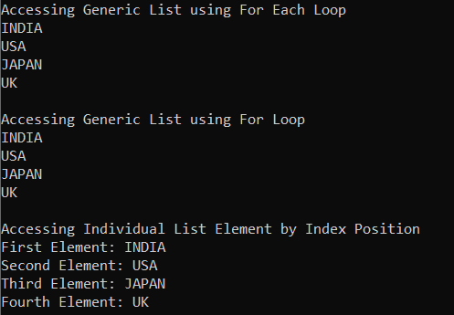

##### **مثال برای اضافه کردن عناصر به یک لیست با استفاده از مقداردهی اولیه مجموعه در سی شارپ:**

این یک ویژگی جدید اضافه شده به C# 3.0 است که امکان مقداردهی اولیه یک مجموعه را مستقیماً در زمان تعریف، مانند یک آرایه، فراهم می‌کند. در مثال زیر، ما به جای متد Add از کلاس Generic List Collection، از سینتکس Collection Initializer برای اضافه کردن عناصر به شیء مجموعه در C# استفاده می‌کنیم.

```csharp
using System;
using System.Collections.Generic;

namespace GenericListCollectionDemo
{
    class Program
    {
        static void Main()
        {
            //Creating a Generic List of string type and adding elements using collection initializer
            List<string> countries = new List<string>
            {
                "INDIA",
                "USA",
                "JAPAN",
                "UK"
            };

            //Accessing List Elements using ForEach Loop
            Console.WriteLine("Accessing Generic List Elemenst using For Each Loop");
            foreach (var item in countries)
            {
                Console.WriteLine(item);
            }

            Console.ReadKey();
        }
    }
}
```

###### **خروجی:**

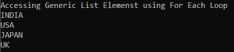

##### **چگونه عناصر را در یک موقعیت خاص در یک مجموعه لیست عمومی در C# قرار دهیم؟**

اگر می‌خواهید یک عنصر خاص یا مجموعه‌ای از عناصر را در یک موقعیت خاص در یک مجموعه لیست عمومی وارد کنید، باید از دو روش زیر که توسط کلاس مجموعه لیست عمومی در C# ارائه شده است، استفاده کنید. روش Insert برای وارد کردن یک عنصر خاص و روش InsertRange برای وارد کردن مجموعه‌ای از عناصر استفاده می‌شود.

1. **درج(int index, T item):** این متد برای درج یک عنصر در لیست عمومی در اندیس مشخص شده استفاده می‌شود. در اینجا، پارامتر index اندیس مبتنی بر صفر را که یک آیتم باید در آن درج شود، مشخص می‌کند و پارامتر item شیء مورد نظر برای درج را مشخص می‌کند. مقدار می‌تواند برای انواع مرجع null باشد. اگر اندیس کمتر از 0 باشد یا اندیس بزرگتر از تعداد لیست عمومی باشد، خطای ArgumentOutOfRangeException رخ می‌دهد.
2. **InsertRange(int index, IEnumerable<T> collection):** این متد برای درج عناصر یک مجموعه در فهرست عمومی در اندیس مشخص شده استفاده می‌شود. در اینجا، پارامتر index، اندیس مبتنی بر صفر را که یک آیتم باید در آن درج شود، مشخص می‌کند. پارامتر collection، مجموعه‌ای را که عناصر آن باید در فهرست عمومی درج شوند، مشخص می‌کند. خود مجموعه نمی‌تواند null باشد، اما اگر نوع T یک نوع مرجع باشد، می‌تواند شامل عناصری باشد که null هستند. اگر مجموعه null باشد، خطای ArgumentNullException رخ می‌دهد. اگر اندیس کمتر از 0 باشد یا اندیس بزرگتر از Generic List Count باشد، خطای ArgumentOutOfRangeException رخ می‌دهد.

برای درک بهتر متدهای Insert و InsertRange از کلاس Generic List Collection در سی شارپ، لطفاً به مثال زیر نگاهی بیندازید. کد مثال زیر نیازی به توضیح ندارد، بنابراین لطفاً خطوط کامنت را مطالعه کنید.

```csharp
using System;
using System.Collections.Generic;

namespace GenericListCollectionDemo
{
    class Program
    {
        static void Main()
        {
            //Creating a Generic List of string type
            List<string> countries = new List<string>
            {
                "INDIA",
                "USA"
            };

            Console.WriteLine("Accessing List Elements Before Inserting");
            foreach (var item in countries)
            {
                Console.WriteLine(item);
            }

            //Insert Element at Index Position 1
            countries.Insert(1, "China");
            Console.WriteLine($"\nIndex of China Element in the List : {countries.IndexOf("China")}");

            //Accessing List After Insert Method
            Console.WriteLine("\nAccessing List After Inserting China At Index 1");
            foreach (var item in countries)
            {
                Console.WriteLine(item);
            }

            //Creating Another Generic List Collection of string type
            List<string> newCountries = new List<string>
            {
                "JAPAN",
                "UK"
            };

            //Inserting the newCountries collection into the existing countries list at Index 2 using InsertRange Method
            countries.InsertRange(2, newCountries);

            //Accessing countries List After InsertRange Method
            Console.WriteLine("\nAccessing List After InsertRange At Index 2");
            foreach (var item in countries)
            {
                Console.WriteLine(item);
            }

            Console.ReadKey();
        }
    }
}
```

###### **خروجی:**

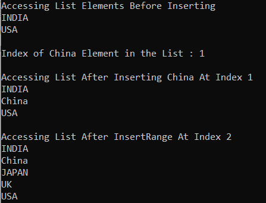

##### **چگونه در سی شارپ، موجود بودن یک عنصر در یک مجموعه لیست را بررسی کنیم؟**

اگر می‌خواهید بررسی کنید که آیا یک عنصر در مجموعه لیست عمومی وجود دارد یا خیر، باید از متد Contains زیر از کلاس مجموعه لیست عمومی در C# استفاده کنید.

1. **Contains(T item):** متد Contains(T item) از کلاس Generic List Collection برای بررسی وجود یا عدم وجود آیتم داده شده در List استفاده می‌شود. پارامتر item، شیء مورد نظر برای قرار دادن در Generic List را مشخص می‌کند. مقدار آن می‌تواند برای انواع ارجاعی null باشد. اگر آیتم در Generic List یافت شود، مقدار true و در غیر این صورت مقدار false را برمی‌گرداند.

بگذارید این موضوع را با یک مثال درک کنیم. مثال زیر نحوه استفاده از متد Contains از کلاس Generic List Collection در C# را برای بررسی وجود یا عدم وجود یک عنصر در مجموعه نشان می‌دهد.

```csharp
using System;
using System.Collections.Generic;

namespace GenericListCollectionDemo
{
    class Program
    {
        static void Main()
        {
            //Creating a Generic List of string type and adding elements using collection initializer
            List<string> countries = new List<string>
            {
                "INDIA",
                "USA",
                "JAPAN",
                "UK"
            };

            //Accessing List Elements using ForEach Loop
            Console.WriteLine("All Generic List Elemenst");
            foreach (var item in countries)
            {
                Console.WriteLine(item);
            }

            //Checking the Item using the Contains method
            Console.WriteLine("\nIs INDIA Exists in List: " + countries.Contains("INDIA"));
            Console.WriteLine("Is NZ Exists in List: " + countries.Contains("NZ"));

            Console.ReadKey();
        }
    }
}
```

###### **خروجی:**

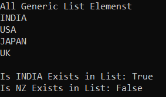

##### **چگونه عناصر را از یک مجموعه لیست عمومی در سی شارپ حذف کنیم؟**

اگر می‌خواهید عناصر را از لیست حذف کنید، می‌توانید از متدهای زیر از کلاس مجموعه List استفاده کنید.

1. **حذف(T item):** این متد برای حذف اولین مورد از یک شیء خاص از لیست عمومی استفاده می‌شود. در اینجا، پارامتر item شیء مورد نظر برای حذف از لیست عمومی را مشخص می‌کند. اگر آیتم با موفقیت حذف شود، مقدار true و در غیر این صورت، مقدار false را برمی‌گرداند. این متد همچنین اگر آیتم در لیست عمومی یافت نشود، مقدار false را برمی‌گرداند.
2. **RemoveAll(Predicate<T> match):** این متد برای حذف تمام عناصری که با شرایط تعریف شده توسط predicate مشخص شده مطابقت دارند، استفاده می‌شود. در اینجا، پارامتر match، نماینده predicate را مشخص می‌کند که شرایط عناصری را که باید حذف شوند، تعریف می‌کند. این پارامتر تعداد عناصر حذف شده از Generic List را برمی‌گرداند. اگر پارامتر match تهی باشد، خطای ArgumentNullException رخ می‌دهد.
3. **RemoveAt(int index):** این متد برای حذف عنصر در اندیس مشخص شده از لیست عمومی استفاده می‌شود. در اینجا، پارامتر index، اندیس مبتنی بر صفر عنصری است که باید حذف شود. اگر اندیس کمتر از 0 باشد یا اندیس برابر یا بزرگتر از Generic List Count باشد، خطای ArgumentOutOfRangeException رخ می‌دهد.
4. **RemoveRange(int index, int count):** این متد برای حذف طیفی از عناصر از لیست عمومی استفاده می‌شود. در اینجا، پارامتر index، شاخص شروع مبتنی بر صفر از طیف عناصری است که باید حذف شوند و پارامتر count، تعداد عناصری است که باید حذف شوند. اگر index کمتر از 0 باشد یا count کمتر از 0 باشد، خطای ArgumentOutOfRangeException رخ می‌دهد. اگر index و count نشان‌دهنده طیف معتبری از عناصر در لیست عمومی نباشند، خطای ArgumentException رخ می‌دهد.
5. **Clear():** این متد برای حذف تمام عناصر از لیست عمومی استفاده می‌شود.

برای درک بهتر نحوه استفاده از متدهای فوق در کلاس Generic List Collection در سی شارپ، لطفاً به مثال زیر نگاهی بیندازید.

```csharp
using System;
using System.Collections.Generic;

namespace GenericListCollectionDemo
{
    class Program
    {
        static void Main()
        {
            //Creating a Generic List of string type and adding elements using collection initializer
            List<string> countries = new List<string>
            {
                "INDIA",
                "USA",
                "JAPAN",
                "UK",
                "AUSTRALIA",
                "SRILANKA",
                "BANGLADESG",
                "NEPAL",
                "CHINA",
                "NZ",
                "SOUTH AFRICA"
            };

            Console.WriteLine($"Before Removing Element Count : {countries.Count}");

            //Using Remove method to Remove an Element from the List
            Console.WriteLine($"\nRemoving Element SRILANKA : {countries.Remove("SRILANKA")}");
            Console.WriteLine($"After Removing SRILANKA Element Count : {countries.Count}");

            //Removing Element using Index Position from the List
            countries.RemoveAt(2);
            Console.WriteLine($"\nAfter Removing Index 2 Element Count : {countries.Count}");

            // Using RemoveAll method to Remove Elements from the List
            // Here, we are removing element whose length is less than 3 i.e. UK and NZ
            //countries.RemoveAll(x => x.Length < 3);
            Console.WriteLine($"\nRemoveAll Method Removes: {countries.RemoveAll(x => x.Length < 3)} Element(s)");
            Console.WriteLine($"After RemoveAll Method Element Count : {countries.Count}");

            //Removing Element using RemoveRange(int index, int count) Method
            //Here, we are removing the first two elements
            countries.RemoveRange(0, 2);
            Console.WriteLine($"\nAfter RemoveRange Method Element Count : {countries.Count}");

            //Removing All Elements using Clear method
            countries.Clear();
            Console.WriteLine($"\nAfter Clear Method Element Count : {countries.Count}");

            Console.ReadKey();
        }
    }
}
```

###### **خروجی:**

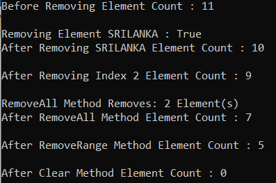

##### **چگونه یک آرایه را در سی شارپ به یک لیست کپی کنیم؟**

برای کپی کردن یک آرایه به یک لیست، باید از سازنده‌ی overload شده‌ی زیر از کلاس List در سی‌شارپ استفاده کنیم. همانطور که شما

1. **public List(IEnumerable<T> collection):** این سازنده برای مقداردهی اولیه یک نمونه جدید از کلاس Generic List استفاده می‌شود که شامل عناصر کپی شده از مجموعه مشخص شده است و ظرفیت کافی برای جای دادن تعداد عناصر کپی شده را دارد. پارامتر collection، مجموعه ای را مشخص می‌کند که عناصر آن در لیست جدید کپی می‌شوند.

برای درک بهتر، لطفاً به مثال زیر نگاهی بیندازید. در اینجا ما یک لیست با عناصر یک آرایه ایجاد می‌کنیم. ما از سازنده List استفاده می‌کنیم و آرایه را به عنوان آرگومان ارسال می‌کنیم. لیست این پارامتر را دریافت می‌کند و مقادیر خود را از آن پر می‌کند. نوع عنصر آرایه باید با نوع عنصر List مطابقت داشته باشد، در غیر این صورت کامپایل با شکست مواجه می‌شود.

```csharp
using System;
using System.Collections.Generic;

namespace GenericsDemo
{
    class Program
    {
        static void Main()
        {
            // Create new array with 3 elements.
            string[] array = new string[] { "INDIA", "USA", "UK" };

            // Copy the array to a List.
            List<string> copiedList = new List<string>(array);

            Console.WriteLine("Copied Elements in List");
            foreach (var item in copiedList)
            {
                Console.WriteLine(item);
            }

            Console.ReadKey();
        }
    }
}
```

###### **خروجی:**

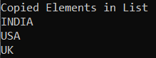

در حال حاضر، ما با مجموعه لیست عمومی (Generic List Collection) با انواع داده‌های اولیه (primitive types) داخلی کار می‌کنیم. حال، بیایید بیشتر پیش برویم و سعی کنیم نحوه کار با انواع داده‌های پیچیده (Complex Data Types) مانند دانشجو (Student)، کارمند (Employee)، محصول (Product) و غیره را درک کنیم.

##### **مجموعه لیست عمومی با نوع پیچیده در سی شارپ:**

بیایید مثالی از کلاس List Collection با انواع پیچیده در C# را بررسی کنیم. لطفاً به کد مثال زیر نگاهی بیندازید. همانطور که در کد زیر مشاهده می‌کنید، ما یک کلاس به نام Employee ایجاد کرده‌ایم. سپس چند شیء employee ایجاد می‌کنیم و سپس یک Generic List Collection از نوع Employee ایجاد می‌کنیم و تمام اشیاء employee را در آن مجموعه ذخیره می‌کنیم. در نهایت، ما انواع مختلفی از عملیات را با استفاده از متدهای ارائه شده توسط کلاس List<T> Generic Collection انجام می‌دهیم. کد مثال زیر خود توضیح است. بنابراین لطفاً خطوط کامنت را بررسی کنید.

```csharp
using System;
using System.Collections.Generic;

namespace GenericListCollectionDemo
{
    public class Program
    {
        public static void Main()
        {
            // Create Employee Objects
            Employee emp1 = new Employee() { ID = 101, Name = "Pranaya", Gender = "Male", Salary = 5000 };
            Employee emp2 = new Employee() { ID = 102, Name = "Priyanka", Gender = "Female", Salary = 7000 };
            Employee emp3 = new Employee() { ID = 103, Name = "Anurag", Gender = "Male", Salary = 5500 };

            // Create a Generic List of type Employee
            List<Employee> listEmployees = new List<Employee>();

            //Adding Employees to the listEmployees collection using Add Method
            listEmployees.Add(emp1);
            listEmployees.Add(emp2);
            listEmployees.Add(emp3);

            Console.WriteLine("Retrive the First Employee By Index");
            //Retrieving Items from the collection by using Index. 
            //The following line of code will retrieve the employee from the list. 
            //The List index is  0 based.
            Employee FirstEmployee = listEmployees[0]; //Fetch the First Added Employee from the Collection
            Console.WriteLine($"ID = {FirstEmployee.ID}, Name = {FirstEmployee.Name}, Gender = {FirstEmployee.Gender}, Salary = {FirstEmployee.Salary}");

            //Retrieving All Employees of Generic List Collection using For loop
            Console.WriteLine("\nRetrieving All Employees using For Loop");
            for (int i = 0; i < listEmployees.Count; i++)
            {
                Employee employee = listEmployees[i];
                Console.WriteLine($"ID = {employee.ID}, Name = {employee.Name}, Gender = {employee.Gender}, Salary = {employee.Salary}");
            }

            //Retrieving All Employees of Generic List Collection using For Each loop
            Console.WriteLine("\nRetrieving All Employees using For Each Loop");
            foreach (Employee employee in listEmployees)
            {
                Console.WriteLine($"ID = {employee.ID}, Name = {employee.Name}, Gender = {employee.Gender}, Salary = {employee.Salary}");
            }

            //Inserting an Employee into the Index Position 1.
            Employee emp4 = new Employee() { ID = 104, Name = "Sambit", Gender = "Male", Salary = 6500 };
            listEmployees.Insert(1, emp4);

            //Retrieving the list after inserting the employee in index position 1
            Console.WriteLine("\nRetriving the List After Inserting New Employee in Index 1");
            foreach (Employee employee in listEmployees)
            {
                Console.WriteLine($"ID = {employee.ID}, Name = {employee.Name}, Gender = {employee.Gender}, Salary = {employee.Salary}");
            }

            //If you want to get the index postion of a specific employee then use Indexof() method as follows
            Console.WriteLine("\nIndex of emp3 object in the List = " + listEmployees.IndexOf(emp3));
            Console.ReadKey();
        }
    }
    public class Employee
    {
        public int ID { get; set; }
        public string Name { get; set; }
        public string Gender { get; set; }
        public int Salary { get; set; }
    }
}
```

###### **خروجی:**

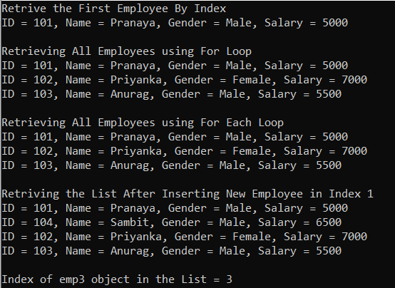

**نکته:** تمام کلاس‌های Generic Collection در سی‌شارپ از نوع Strongly Typed هستند. این یعنی اگر لیستی از نوع Employee ایجاد کرده باشیم، فقط می‌توانیم اشیاء از نوع Employee را به لیست اضافه کنیم. اگر سعی کنیم شیء‌ای از نوع متفاوت اضافه کنیم، با خطای زمان کامپایل مواجه خواهیم شد.

##### **چگونه عنصر را در یک مجموعه لیست عمومی در سی شارپ پیدا کنیم؟**

کلاس Generic List Collection در سی شارپ متدهای مفید زیادی را ارائه می‌دهد که می‌توانیم برای یافتن عناصر در مجموعه‌ای از انواع لیست از آنها استفاده کنیم. کلاس List Collection متدهای مهم زیر را برای یافتن عناصر در یک مجموعه ارائه می‌دهد.

1. **Find():** از متد Find() برای یافتن اولین عنصر از یک لیست بر اساس شرطی که توسط یک عبارت لامبدا مشخص شده است، استفاده می‌شود.
2. **FindLast():** متد FindLast() برای جستجوی عنصری که با شرایط مشخص شده توسط یک گزاره مطابقت دارد، استفاده می‌شود. اگر عنصری با آن شرایط مشخص شده پیدا کند، آخرین عنصر مطابق را از لیست برمی‌گرداند.
3. **FindAll():** از متد FindAll() برای بازیابی تمام عناصر از یک لیست که با شرایط مشخص شده توسط یک گزاره مطابقت دارند، استفاده می‌شود.
4. **FindIndex():** متد FindIndex() برای برگرداندن موقعیت اندیس اولین عنصری که با شرایط مشخص شده توسط یک گزاره مطابقت دارد، استفاده می‌شود. نکته‌ای که باید به خاطر داشته باشید این است که اندیس در اینجا در مجموعه‌های عمومی مبتنی بر صفر است. این متد اگر عنصری که با شرایط مشخص شده مطابقت دارد پیدا نشود، مقدار -1 را برمی‌گرداند. دو نسخه بارگذاری شده دیگر از این متد موجود است، یکی از نسخه‌های بارگذاری شده به ما امکان می‌دهد محدوده عناصر را برای جستجو در لیست مشخص کنیم.
5. **FindLastIndex():** متد FindLastIndex() عنصری را در لیست جستجو می‌کند که با شرط مشخص شده توسط عبارت لامبدا مطابقت داشته باشد و سپس اندیس آخرین رخداد آیتم را در لیست برمی‌گرداند. دو نسخه سربارگذاری شده دیگر از این متد موجود است، یکی از نسخه‌های سربارگذاری شده به ما امکان می‌دهد محدوده عناصر را برای جستجو در لیست مشخص کنیم.
6. **Exists():** متد Exists() برای بررسی یا تعیین وجود یا عدم وجود یک آیتم در یک لیست بر اساس یک شرط استفاده می‌شود. اگر آیتم وجود داشته باشد، مقدار true و در غیر این صورت مقدار false را برمی‌گرداند.
7. **Contains():** متد Contains() برای تعیین وجود یا عدم وجود آیتم مشخص شده در لیست استفاده می‌شود. اگر آیتم مشخص شده وجود داشته باشد، مقدار true و در غیر این صورت مقدار false را برمی‌گرداند.

بیایید تمام متدهای کلاس List Collection در سی شارپ که در بالا توضیح داده شد را با یک مثال بررسی کنیم. مثال زیر نیاز به توضیح ندارد، بنابراین لطفاً به توضیحات داخل کامنت‌ها توجه کنید.

```csharp
using System;
using System.Collections.Generic;

namespace ListCollectionDemo
{
    public class Program
    {
        public static void Main()
        {
            // Create Employee Objects
            Employee Employee1 = new Employee() { ID = 101, Name = "Pranaya", Gender = "Male", Salary = 5000 };
            Employee Employee2 = new Employee() { ID = 102, Name = "Priyanka", Gender = "Female", Salary = 7000 };
            Employee Employee3 = new Employee() { ID = 103, Name = "Anurag", Gender = "Male", Salary = 5500 };
            Employee Employee4 = new Employee() { ID = 104, Name = "Sambit", Gender = "Male", Salary = 6500 };

            //Creating a list of type Employee
            List<Employee> listEmployees = new List<Employee>
            {
                Employee1,
                Employee2,
                Employee3,
                Employee4
            };

            // use Contains method to check if an item exists or not in the list 
            Console.WriteLine("Contains Method Check Employee2 Object");
            if (listEmployees.Contains(Employee2))
            {
                Console.WriteLine("Employee2 Object Exists in the List");
            }
            else
            {
                Console.WriteLine("Employee2 Object Does Not Exists in the List");
            }

            // Use Exists method when you want to check if an item exists or not
            // in the list based on a condition
            Console.WriteLine("\nExists Method Name StartsWith P");
            if (listEmployees.Exists(x => x.Name.StartsWith("P")))
            {
                Console.WriteLine("List contains Employees whose Name Starts With P");
            }
            else
            {
                Console.WriteLine("List does not Contain Any Employee whose Name Starts With P");
            }

            // Use Find() method, if you want to return the First Matching Element by a conditions 
            Console.WriteLine("\nFind Method to Return First Matching Employee whose Gender = Male");
            Employee? emp = listEmployees.Find(employee => employee.Gender == "Male");
            Console.WriteLine($"ID = {emp?.ID}, Name = {emp?.Name}, Gender = {emp?.Gender}, Salary = {emp?.Salary}");

            // Use FindLast() method when you want to searche an item by a conditions and returns the Last matching item from the list
            Console.WriteLine("\nFindLast Method to Return Last Matching Employee whose Gender = Male");
            Employee? lastMatchEmp = listEmployees.FindLast(employee => employee.Gender == "Male");
            Console.WriteLine($"ID = {lastMatchEmp?.ID}, Name = {lastMatchEmp?.Name}, Gender = {lastMatchEmp?.Gender}, Salary = {lastMatchEmp?.Salary}");

            // Use FindAll() method when you want to return all the items that matches the conditions
            Console.WriteLine("\nFindAll Method to return All Matching Employees Where Gender = Male");
            List<Employee> filteredEmployees = listEmployees.FindAll(employee => employee.Gender == "Male");
            foreach (Employee femp in filteredEmployees)
            {
                Console.WriteLine($"ID = {femp.ID}, Name = {femp.Name}, Gender = {femp.Gender}, Salary = {femp.Salary}");
            }
            
            // Use FindIndex() method when you want to return the index of the first item by a condition
            Console.WriteLine($"\nIndex of the First Matching Employee whose Gender is Male = {listEmployees.FindIndex(employee => employee.Gender == "Male")}");
            
            // Use FindLastIndex() method when you want to return the index of the last item by a condition
            Console.WriteLine($"Index of the Last Matching Employee whose Gender is Male = {listEmployees.FindLastIndex(employee => employee.Gender == "Male")}");

            Console.ReadKey();
        }
    }
    public class Employee
    {
        public int ID { get; set; }
        public string Name { get; set; }
        public string Gender { get; set; }
        public int Salary { get; set; }
    }
}
```

###### **خروجی:**

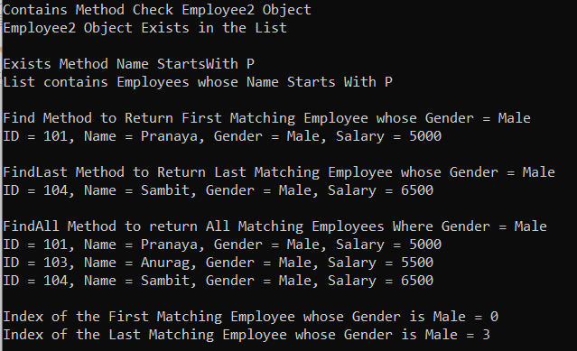

##### **متدهای مهم کلاس لیست عمومی در سی شارپ:**

1. **TrueForAll():** این متد بسته به اینکه آیا هر عنصر در لیست با شرایط تعریف شده توسط گزاره مشخص شده مطابقت دارد یا خیر، مقدار درست یا نادرست را برمی‌گرداند.
2. **AsReadOnly():** این متد یک پوشش فقط خواندنی برای مجموعه فعلی برمی‌گرداند. اگر نمی‌خواهید کلاینت مجموعه را تغییر دهد، یعنی عناصری را به مجموعه اضافه یا حذف کند، از این متد استفاده کنید. ReadOnlyCollection متدی برای اضافه یا حذف موارد از مجموعه نخواهد داشت. ما فقط می‌توانیم موارد این مجموعه را بخوانیم.
3. **TrimExcess() :** این متد ظرفیت را به تعداد واقعی عناصر موجود در لیست تنظیم می‌کند، اگر آن عدد کمتر از یک مقدار آستانه باشد.

##### **مثالی برای درک سه متد فوق از کلاس Generic List Collection در سی شارپ.**

```csharp
using System;
using System.Collections.Generic;

namespace ListCollectionDemo
{
    public class Program
    {
        public static void Main()
        {
            //Creating a list of type Employee
            List<Employee> listEmployees = new List<Employee>
            {
                new Employee() { ID = 101, Name = "Pranaya", Gender = "Male", Salary = 5000 },
                new Employee() { ID = 102, Name = "Priyanka", Gender = "Female", Salary = 7000 },
                new Employee() { ID = 103, Name = "Anurag", Gender = "Male", Salary = 5500 },
                new Employee() { ID = 104, Name = "Sambit", Gender = "Male", Salary = 6500 },
                new Employee() { ID = 105, Name = "Hina", Gender = "Female", Salary = 6500 }
            };

            //TrueForAll
            Console.WriteLine($"Are all salaries greater than 5000: {listEmployees.TrueForAll(x => x.Salary > 5000)}");
                            
            // ReadOnlyCollection will not have Add() or Remove() methods
            System.Collections.ObjectModel.ReadOnlyCollection<Employee> readOnlyEmployees = listEmployees.AsReadOnly();
            Console.WriteLine($"\nTotal Items in ReadOnlyCollection: {readOnlyEmployees.Count}");

            // listEmployees list is created with an initial capacity of 8
            // but only 5 items are in the list. The filled percentage is less than 90 percent threshold.
            Console.WriteLine($"\nList Capacity Before invoking TrimExcess: {listEmployees.Capacity}"); 

            // Invoke TrimExcess() to set the capacity to the actual number of elements in the List
            listEmployees.TrimExcess();
            Console.WriteLine($"\nList Capacity After invoking TrimExcess: {listEmployees.Capacity} "); 

            Console.ReadKey();
        }
    }
    public class Employee
    {
        public int ID { get; set; }
        public string Name { get; set; }
        public string Gender { get; set; }
        public int Salary { get; set; }
    }
}
```

###### **خروجی:**

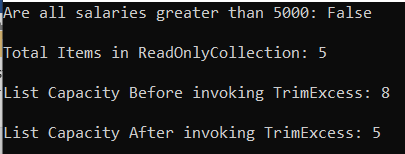

##### **چگونه لیستی از انواع ساده را در سی شارپ مرتب کنیم؟**

در سی شارپ، مرتب‌سازی لیستی از انواع ساده مانند int، double، char، string و غیره سرراست است. در اینجا، فقط باید متد Sort() را که توسط کلاس Generic List در نمونه لیست ارائه شده است، فراخوانی کنیم و سپس داده‌ها به طور خودکار به ترتیب صعودی مرتب می‌شوند. به عنوان مثال، اگر لیستی از اعداد صحیح مانند شکل زیر داشته باشیم.  
**لیست اعداد لیست = لیست جدید { ۱، ۸، ۷، ۵، ۲ };**

سپس فقط باید متد Sort() را روی مجموعه numbersList فراخوانی کنیم، همانطور که در زیر نشان داده شده است.  
**numbersList.Sort();**

اگر می‌خواهید داده‌ها به ترتیب نزولی بازیابی شوند، از متد Reverse() روی نمونه لیست، همانطور که در زیر نشان داده شده است، استفاده کنید.  
**‎numbersList.Reverse();‎‏ ...**

##### **مثالی برای درک کلاس مجموعه لیست عمومی و متد مرتب‌سازی معکوس در سی‌شارپ:**

```csharp
using System;
using System.Collections.Generic;

namespace ListCollectionSortReverseMethodDemo
{
    public class Program
    {
        public static void Main()
        {
            List<int> numbersList = new List<int> { 1, 8, 7, 5, 2 };
            Console.WriteLine("Numbers Before Sorting");
            foreach (int i in numbersList)
            {
                Console.Write($"{i} ");
            }

            // The Sort() of List Collection class will sort the data in ascending order 
            numbersList.Sort();
            Console.WriteLine("\n\nNumbers After Sorting");
            foreach (int i in numbersList)
            {
                Console.Write($"{i} ");
            }

            // If you want to  to retrieve data in descending order then use the Reverse() method
            numbersList.Reverse();
            Console.WriteLine("\n\nNumbers in Descending order");
            foreach (int i in numbersList)
            {
                Console.Write($"{i} ");
            }

            //Another Example of Sorting String
            List<string> names = new List<string>() { "Pranaya", "Anurag", "Sambit", "Hina", "Rakesh"};
            Console.WriteLine("\n\nNames Before Sorting");
            foreach (string name in names)
            {
                Console.WriteLine(name);
            }

            names.Sort();
            Console.WriteLine("\nNames After Sorting");
            foreach (string name in names)
            {
                Console.WriteLine(name);
            }

            names.Reverse();
            Console.WriteLine("\nNames in Descending Order");
            foreach (string name in names)
            {
                Console.WriteLine(name);
            }

            Console.ReadKey();
        }
    }
}
```

###### **خروجی:**

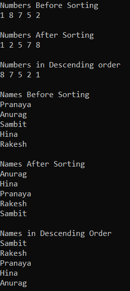

با این حال، وقتی همین کار را روی انواع پیچیده‌ای مانند کارمند، محصول، مشتری، دپارتمان و غیره انجام می‌دهیم، با خطای زمان اجرا به صورت « **خطای عملیات نامعتبر - مقایسه ۲ عنصر در آرایه ناموفق بود** » مواجه می‌شویم. برای درک بهتر، لطفاً به مثال زیر نگاهی بیندازید. در اینجا، ما مجموعه‌ای از کارمندان را ایجاد می‌کنیم و سپس متد مرتب‌سازی را فراخوانی می‌کنیم که خطای زمان اجرا را ایجاد می‌کند.

```csharp
using System;
using System.Collections.Generic;

namespace ListCollectionDemo
{
    public class Program
    {
        public static void Main()
        {
            //Creating a list of type Employee
            List<Employee> listEmployees = new List<Employee>
            {
                new Employee() { ID = 101, Name = "Pranaya", Gender = "Male", Salary = 5000 },
                new Employee() { ID = 102, Name = "Priyanka", Gender = "Female", Salary = 7000 },
                new Employee() { ID = 103, Name = "Anurag", Gender = "Male", Salary = 5500 },
                new Employee() { ID = 104, Name = "Sambit", Gender = "Male", Salary = 6500 },
                new Employee() { ID = 105, Name = "Hina", Gender = "Female", Salary = 6500 }
            };

            listEmployees.Sort();

            Console.ReadKey();
        }
    }
    public class Employee
    {
        public int ID { get; set; }
        public string Name { get; set; }
        public string Gender { get; set; }
        public int Salary { get; set; }
    }
}
```

###### **خروجی:**

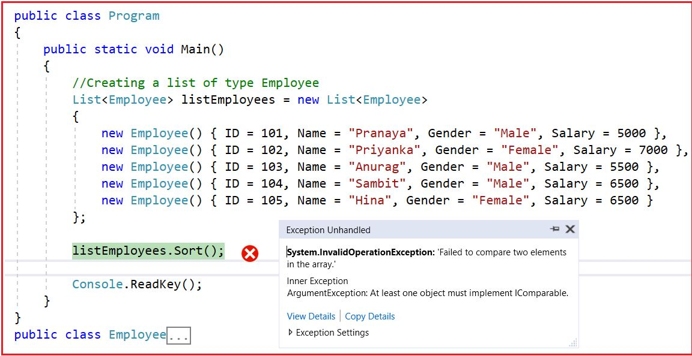

ما با خطای زمان اجرای بالا مواجه می‌شویم زیرا در زمان اجرا، چارچوب دات‌نت نحوه مرتب‌سازی انواع پیچیده را تشخیص نمی‌دهد. در این حالت، زمان اجرای دات‌نت قادر به تشخیص این نیست که آیا داده‌ها را بر اساس ویژگی ID، یا بر اساس ویژگی Name، یا بر اساس ویژگی Gender، یا بر اساس ویژگی Salary یا ترکیبی از هر ویژگی دیگری مرتب کند. بنابراین، اگر می‌خواهیم یک نوع پیچیده را مرتب کنیم، باید نحوه مرتب‌سازی داده‌ها در لیست را مشخص کنیم و برای انجام این کار باید رابط IComparable را پیاده‌سازی کنیم. در مقاله بعدی خود به این موضوع خواهیم پرداخت.

##### **قابلیت مرتب‌سازی برای انواع داده‌های ساده مانند int، double، string، char و غیره در سی‌شارپ چگونه کار می‌کند؟**

این کار می‌کند زیرا این نوع‌ها (int، double، string، decimal، char و غیره) از قبل رابط IComparable را پیاده‌سازی کرده‌اند. اگر به تعریف هر نوع داده‌ی داخلی بروید، خواهید دید که کلاس، همانطور که در تصویر زیر نشان داده شده است، رابط IComparable را پیاده‌سازی کرده است و به همین دلیل است که قابلیت مرتب‌سازی کار می‌کند.

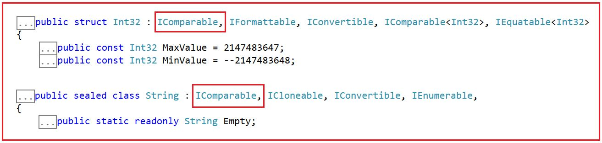

##### **خلاصه کلاس مجموعه Generic List<T> در سی شارپ:**

1. مجموعه List<T> با آرایه‌ها متفاوت است. اندازه لیست را می‌توان به صورت پویا تغییر داد اما اندازه آرایه‌ها را نمی‌توان به صورت پویا تغییر داد.
2. کلاس مجموعه Generic List<T> در سی شارپ می‌تواند مقادیر null را برای انواع ارجاعی بپذیرد و همچنین مقادیر تکراری را نیز می‌پذیرد.
3. وقتی تعداد عناصر برابر با ظرفیت مجموعه لیست شود، ظرفیت لیست به طور خودکار با تخصیص مجدد آرایه داخلی افزایش می‌یابد. عناصر موجود قبل از اضافه شدن عنصر جدید به آرایه جدید کپی می‌شوند.
4. کلاس Generic List معادل عمومی کلاس Non-Generic ArrayList است.
5. کلاس Generic List<T> رابط عمومی IList<T> را پیاده‌سازی می‌کند.
6. ما می‌توانیم هم از مقایسه‌گر برابری و هم از مقایسه‌گر ترتیبی با کلاس عمومی List استفاده کنیم.
7. عناصر کلاس List<T> به طور پیش‌فرض مرتب نشده‌اند و عناصر از طریق یک اندیس مبتنی بر صفر قابل دسترسی هستند.
8. برای اشیاء بسیار بزرگ List<T>، می‌توانید با تنظیم ویژگی enabled عنصر پیکربندی به true در محیط زمان اجرا، حداکثر ظرفیت را در یک سیستم ۶۴ بیتی به ۲ میلیارد عنصر افزایش دهید.