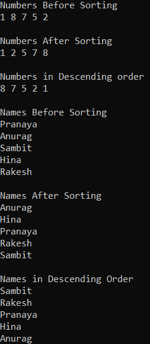
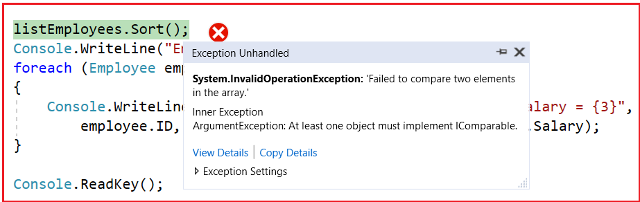
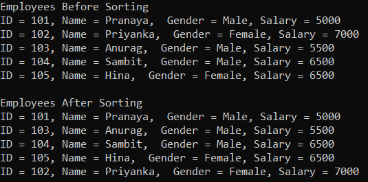
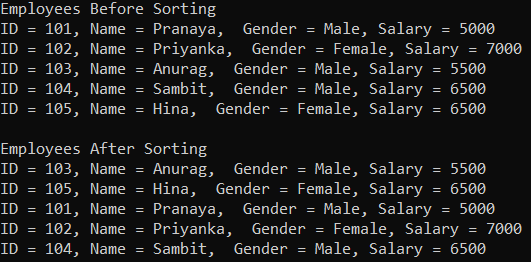
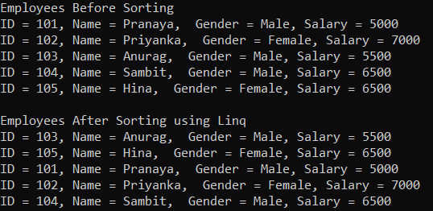

## **نحوه مرتب سازی لیستی از انواع پیچیده در سی شارپ**

در این مقاله، قصد دارم **نحوه مرتب‌سازی لیستی از انواع پیچیده در سی‌شارپ** مانند کارمند، مشتری، محصول، دپارتمان و غیره را با مثال‌هایی مورد بحث قرار دهم. لطفاً مقاله قبلی ما را که در آن در مورد لیست عمومی در سی‌شارپ با مثال‌ها بحث کردیم، مطالعه کنید. قبل از درک نحوه مرتب‌سازی یک نوع پیچیده، ابتدا اجازه دهید نحوه مرتب‌سازی انواع ساده مانند int، double، char، string و غیره را درک کنیم.

##### **متدهای مرتب‌سازی کلاس مجموعه لیست عمومی<T> در سی شارپ:**

کلاس مجموعه لیست عمومی در سی شارپ چهار متد مرتب سازی زیر را ارائه می‌دهد.

1. **مرتب‌سازی() :** این متد برای مرتب‌سازی عناصر در کل لیست عمومی با استفاده از مقایسه‌گر پیش‌فرض استفاده می‌شود.
2. **مرتب‌سازی(مقایسه‌گر IComparer<T>):** این متد برای مرتب‌سازی عناصر در کل لیست عمومی با استفاده از مقایسه‌گر مشخص شده استفاده می‌شود.
3. **مرتب‌سازی(مقایسه<T>):**   این متد برای مرتب‌سازی عناصر در کل لیست عمومی با استفاده از System.Comparison مشخص شده استفاده می‌شود.
4. **مرتب‌سازی(int index, int count, IComparer<T> comparer):** این متد برای مرتب‌سازی عناصر در محدوده‌ای از عناصر در یک لیست عمومی با استفاده از مقایسه‌گر مشخص شده استفاده می‌شود.

##### **نحوه مرتب سازی لیستی از انواع ساده در سی شارپ:**

مرتب‌سازی مجموعه‌ای از لیست‌های عمومی از انواع ساده بسیار سرراست است. ما فقط باید متد Sort() (که توسط کلاس Generic List ارائه می‌شود) را روی نمونه لیست فراخوانی کنیم و داده‌ها به طور خودکار به ترتیب صعودی مرتب می‌شوند. به عنوان مثال، اگر لیستی از اعداد صحیح مانند زیر داشته باشیم،  
**لیست اعداد لیست = لیست جدید { ۱، ۸، ۷، ۵، ۲ };**

سپس فقط باید متد Sort() را روی مجموعه numbersList فراخوانی کنیم، همانطور که در زیر نشان داده شده است.  
**numbersList.Sort();**

اگر می‌خواهید داده‌ها به ترتیب نزولی بازیابی شوند، پس از فراخوانی متد Sort، باید متد Reverse() را روی نمونه لیست، مطابق شکل زیر فراخوانی کنید.  
**‎numbersList.Reverse();‎‏ ...**

##### **مثالی برای درک نحوه مرتب‌سازی مجموعه‌ای از انواع ساده در سی‌شارپ:**

در مثال زیر، ما مجموعه‌هایی از لیست‌ها از نوع int و string ایجاد می‌کنیم و سپس متد Sort را برای مرتب‌سازی مجموعه و متد Reverse را برای معکوس کردن مجموعه فراخوانی می‌کنیم.

```csharp
using System;
using System.Collections.Generic;

namespace ListCollectionSortReverseMethodDemo
{
    public class Program
    {
        public static void Main()
        {
            List<int> numbersList = new List<int> { 1, 8, 7, 5, 2 };
            Console.WriteLine("Numbers Before Sorting");
            foreach (int i in numbersList)
            {
                Console.Write($"{i} ");
            }

            // The Sort() of List Collection class will sort the data in ascending order 
            numbersList.Sort();
            Console.WriteLine("\n\nNumbers After Sorting");
            foreach (int i in numbersList)
            {
                Console.Write($"{i} ");
            }

            // If you want to retrieve data in descending order then use the Reverse() method
            numbersList.Reverse();
            Console.WriteLine("\n\nNumbers in Descending order");
            foreach (int i in numbersList)
            {
                Console.Write($"{i} ");
            }

            //Another Example of Sorting String
            List<string> names = new List<string>() { "Pranaya", "Anurag", "Sambit", "Hina", "Rakesh" };
            Console.WriteLine("\n\nNames Before Sorting");
            foreach (string name in names)
            {
                Console.WriteLine(name);
            }

            names.Sort();
            Console.WriteLine("\nNames After Sorting");
            foreach (string name in names)
            {
                Console.WriteLine(name);
            }

            names.Reverse();
            Console.WriteLine("\nNames in Descending Order");
            foreach (string name in names)
            {
                Console.WriteLine(name);
            }

            Console.ReadKey();
        }
    }
}
```

###### **خروجی:**



با این حال، وقتی همین کار را روی انواع پیچیده‌ای مانند کارمند، محصول، مشتری، دپارتمان و غیره انجام می‌دهیم، با خطای زمان اجرا به صورت « **خطای عملیات نامعتبر - مقایسه ۲ عنصر در آرایه ناموفق بود** » مواجه می‌شویم. برای درک بهتر، لطفاً به مثال زیر نگاهی بیندازید. در اینجا، ما مجموعه‌ای از کارمندان را ایجاد می‌کنیم و سپس متد مرتب‌سازی را فراخوانی می‌کنیم که یک خطای زمان اجرا ایجاد می‌کند.

```csharp
using System;
using System.Collections.Generic;

namespace ListCollectionDemo
{
    public class Program
    {
        public static void Main()
        {
            //Creating a list of type Employee
            List<Employee> listEmployees = new List<Employee>
            {
                new Employee() { ID = 101, Name = "Pranaya", Gender = "Male", Salary = 5000 },
                new Employee() { ID = 102, Name = "Priyanka", Gender = "Female", Salary = 7000 },
                new Employee() { ID = 103, Name = "Anurag", Gender = "Male", Salary = 5500 },
                new Employee() { ID = 104, Name = "Sambit", Gender = "Male", Salary = 6500 },
                new Employee() { ID = 105, Name = "Hina", Gender = "Female", Salary = 6500 }
            };

            Console.WriteLine("Employees Before Sorting");
            foreach (Employee employee in listEmployees)
            {
                Console.WriteLine("ID = {0}, Name = {1},  Gender = {2}, Salary = {3}",
                    employee.ID, employee.Name, employee.Gender, employee.Salary);
            }

            listEmployees.Sort();
            Console.WriteLine("\nEmployees After Sorting");
            foreach (Employee employee in listEmployees)
            {
                Console.WriteLine("ID = {0}, Name = {1},  Gender = {2}, Salary = {3}",
                    employee.ID, employee.Name, employee.Gender, employee.Salary);
            }

            Console.ReadKey();
        }
    }
    public class Employee 
    {
        public int ID { get; set; }
        public string Name { get; set; }
        public string Gender { get; set; }
        public int Salary { get; set; }
    }
}
```

###### **خروجی:**



ما با خطای زمان اجرای بالا مواجه می‌شویم زیرا در زمان اجرا، چارچوب دات‌نت نحوه مرتب‌سازی انواع پیچیده را تشخیص نمی‌دهد. در این حالت، زمان اجرای دات‌نت قادر به تشخیص این نیست که آیا داده‌ها را بر اساس ویژگی ID، یا بر اساس ویژگی Name، یا بر اساس ویژگی Gender، یا بر اساس ویژگی Salary یا ترکیبی از هر ویژگی دیگری مرتب کند. بنابراین، اگر می‌خواهیم یک نوع پیچیده را مرتب کنیم، باید نحوه مرتب‌سازی داده‌ها در لیست را مشخص کنیم و برای انجام این کار باید رابط IComparable را پیاده‌سازی کنیم.

##### **قابلیت مرتب‌سازی برای انواع داده‌های ساده مانند int، double، string، char و غیره در سی‌شارپ چگونه کار می‌کند؟**

این کار می‌کند زیرا این نوع‌ها (int، double، string، decimal، char و غیره) از قبل رابط IComparable را پیاده‌سازی کرده‌اند. اگر به تعریف هر نوع داده‌ی داخلی بروید، خواهید دید که کلاس، همانطور که در تصویر زیر نشان داده شده است، رابط IComparable را پیاده‌سازی کرده است و به همین دلیل است که قابلیت مرتب‌سازی کار می‌کند.


##### **چگونه لیستی از انواع پیچیده را در سی شارپ مرتب کنیم؟**

برای مرتب‌سازی لیستی از انواع پیچیده بدون استفاده از LINQ، نوع پیچیده باید **رابط IComparable** را پیاده‌سازی کند و نیاز به پیاده‌سازی **متد CompareTo()** به شرح زیر دارد. **متد CompareTo()** یک مقدار صحیح و معنای مقدار بازگشتی را مطابق شکل زیر برمی‌گرداند.

1. **مقداری بزرگتر از صفر برمی‌گرداند** \- نمونه فعلی بزرگتر از شیء مورد مقایسه است.
2. **مقدار بازگشتی کمتر از صفر** \- نمونه فعلی کوچکتر از شیء مورد مقایسه است.
3. **مقدار بازگشتی صفر است** \- نمونه فعلی برابر با شیء مورد مقایسه است.

به عنوان یک روش جایگزین، می‌توانیم متد CompareTo() را مستقیماً فراخوانی کنیم. ویژگی Salary شیء Employee از نوع int است و متد CompareTo() از قبل روی نوع عدد صحیح که قبلاً در مورد آن صحبت کردیم، پیاده‌سازی شده است، بنابراین می‌توانیم این متد را فراخوانی کرده و مقدار آن را مطابق شکل زیر برگردانیم.

**تابع ()this.Salary.CompareTo(obj.Salary) را برمی‌گرداند.**

##### **پیاده‌سازی رابط IComparable در سی‌شارپ در کلاس Employee**

بگذارید این را با یک مثال درک کنیم. چیزی که ما می‌خواهیم این است که کارمندان را بر اساس حقوقشان مرتب کنیم. برای انجام این کار، کلاس Employee ما باید **رابط IComparable** را پیاده‌سازی کند و باید پیاده‌سازی برای **متد CompareTo()** ارائه دهد . این متد شیء فعلی (که با this مشخص شده است) و شیء مورد مقایسه را که به عنوان پارامتر دریافت می‌کند، مقایسه می‌کند. بنابراین، کلاس Employee را به صورت زیر تغییر دهید و کد زیر دقیقاً همین کار را انجام می‌دهد.

```csharp
public class Employee : IComparable<Employee>
{
    public int ID { get; set; }
    public string Name { get; set; }
    public string Gender { get; set; }
    public int Salary { get; set; }
    public int CompareTo(Employee obj)
    {
        if (this.Salary > obj.Salary)
        {
            return 1;
        }
        else if (this.Salary < obj.Salary)
        {
            return -1;
        }
        else
        {
            return 0;
        }
    }
}
```

کد کامل مثال در ادامه آمده است.

```csharp
using System;
using System.Collections.Generic;

namespace ListCollectionDemo
{
    public class Program
    {
        public static void Main()
        {
            //Creating a list of type Employee
            List<Employee> listEmployees = new List<Employee>
            {
                new Employee() { ID = 101, Name = "Pranaya", Gender = "Male", Salary = 5000 },
                new Employee() { ID = 102, Name = "Priyanka", Gender = "Female", Salary = 7000 },
                new Employee() { ID = 103, Name = "Anurag", Gender = "Male", Salary = 5500 },
                new Employee() { ID = 104, Name = "Sambit", Gender = "Male", Salary = 6500 },
                new Employee() { ID = 105, Name = "Hina", Gender = "Female", Salary = 6500 }
            };

            Console.WriteLine("Employees Before Sorting");
            foreach (Employee employee in listEmployees)
            {
                Console.WriteLine("ID = {0}, Name = {1},  Gender = {2}, Salary = {3}",
                    employee.ID, employee.Name, employee.Gender, employee.Salary);
            }
            
            listEmployees.Sort();
            Console.WriteLine("\nEmployees After Sorting");
            foreach (Employee employee in listEmployees)
            {
                Console.WriteLine("ID = {0}, Name = {1},  Gender = {2}, Salary = {3}",
                    employee.ID, employee.Name, employee.Gender, employee.Salary);
            }

            Console.ReadKey();
        }
    }

    public class Employee : IComparable<Employee>
    {
        public int ID { get; set; }
        public string Name { get; set; }
        public string Gender { get; set; }
        public int Salary { get; set; }
        public int CompareTo(Employee obj)
        {
            if (this.Salary > obj.Salary)
            {
                return 1;
            }
            else if (this.Salary < obj.Salary)
            {
                return -1;
            }
            else
            {
                return 0;
            }
        }
    }
}
```

اکنون کد بالا را اجرا کنید و همانطور که در تصویر زیر نشان داده شده است، نتیجه را به ترتیب صعودی بر اساس حقوق کارمندان دریافت خواهید کرد.



اگر ترجیح نمی‌دهید از قابلیت مرتب‌سازی ارائه شده توسط کلاس Employee استفاده کنید، می‌توانید پیاده‌سازی خودتان را با پیاده‌سازی **رابط IComparer** ارائه دهید . برای مثال، اگر می‌خواهید کارمندان به **بر اساس نام** جای **حقوق،** مرتب شوند ، باید دو مرحله زیر را دنبال کنید.

###### **مرحله ۱: پیاده‌سازی رابط IComparer**

یک کلاس ایجاد کنید که **رابط IComparer** <T> را پیاده‌سازی می‌کند و پیاده‌سازی متد Compare را به صورت زیر فراهم کنید.

```csharp
public class SortByName : IComparer<Employee>
{
    public int Compare(Employee x, Employee y)
    {
        return x.Name.CompareTo(y.Name);
    }
}
```

###### **مرحله ۲: از نسخه سربارگذاری شده متد Sort که رابط IComparer را به عنوان پارامتر می‌گیرد، استفاده کنید:**

یک نمونه از کلاسی که رابط IComparer را پیاده‌سازی می‌کند، به عنوان آرگومان به متد ()Sort ارسال کنید، همانطور که در زیر نشان داده شده است.  
**مرتب‌سازی بر اساس نام sortByName = new SortByName();**  
**listEmployees.Sort(sortByName);**

##### **مثال کامل برای استفاده از مقایسه‌گر خود برای مرتب‌سازی کارمند بر اساس نام:**

```csharp
using System;
using System.Collections.Generic;

namespace ListCollectionDemo
{
    public class Program
    {
        public static void Main()
        {
            //Creating a list of type Employee
            List<Employee> listEmployees = new List<Employee>
            {
                new Employee() { ID = 101, Name = "Pranaya", Gender = "Male", Salary = 5000 },
                new Employee() { ID = 102, Name = "Priyanka", Gender = "Female", Salary = 7000 },
                new Employee() { ID = 103, Name = "Anurag", Gender = "Male", Salary = 5500 },
                new Employee() { ID = 104, Name = "Sambit", Gender = "Male", Salary = 6500 },
                new Employee() { ID = 105, Name = "Hina", Gender = "Female", Salary = 6500 }
            };

            Console.WriteLine("Employees Before Sorting");
            foreach (Employee employee in listEmployees)
            {
                Console.WriteLine("ID = {0}, Name = {1},  Gender = {2}, Salary = {3}",
                    employee.ID, employee.Name, employee.Gender, employee.Salary);
            }

            SortByName sortByName = new SortByName();
            listEmployees.Sort(sortByName);
            Console.WriteLine("\nEmployees After Sorting");
            foreach (Employee employee in listEmployees)
            {
                Console.WriteLine("ID = {0}, Name = {1},  Gender = {2}, Salary = {3}",
                    employee.ID, employee.Name, employee.Gender, employee.Salary);
            }

            Console.ReadKey();
        }
    }

    public class SortByName : IComparer<Employee>
    {
        public int Compare(Employee x, Employee y)
        {
            return x.Name.CompareTo(y.Name);
        }
    }

    public class Employee
    {
        public int ID { get; set; }
        public string Name { get; set; }
        public string Gender { get; set; }
        public int Salary { get; set; }
    }
}
```

###### **خروجی:**



##### **مرتب سازی مجموعه ای از انواع پیچیده با استفاده از LINQ در سی شارپ:**

با استفاده از متدهای LINQ OrderBy و OrderByDescending می‌توانیم به راحتی عناصر یک مجموعه از انواع پیچیده را در C# مرتب کنیم. کاری که باید انجام دهیم این است که اگر می‌خواهیم عناصر را به صورت صعودی مرتب کنیم، باید متد OrderBy و اگر می‌خواهیم عناصر را به صورت نزولی مرتب کنیم، باید متد OrderByDescending را فراخوانی کنیم. برای درک بهتر، لطفاً به مثال زیر نگاهی بیندازید.

```csharp
using System;
using System.Collections.Generic;
using System.Linq;

namespace ListCollectionDemo
{
    public class Program
    {
        public static void Main()
        {
            //Creating a list of type Employee
            List<Employee> listEmployees = new List<Employee>
            {
                new Employee() { ID = 101, Name = "Pranaya", Gender = "Male", Salary = 5000 },
                new Employee() { ID = 102, Name = "Priyanka", Gender = "Female", Salary = 7000 },
                new Employee() { ID = 103, Name = "Anurag", Gender = "Male", Salary = 5500 },
                new Employee() { ID = 104, Name = "Sambit", Gender = "Male", Salary = 6500 },
                new Employee() { ID = 105, Name = "Hina", Gender = "Female", Salary = 6500 }
            };

            Console.WriteLine("Employees Before Sorting");
            foreach (Employee employee in listEmployees)
            {
                Console.WriteLine($"ID = {employee.ID}, Name = {employee.Name},  Gender = {employee.Gender}, Salary = {employee.Salary}");
            }

            //Sorting Employee using Linq OrderBy Method
            listEmployees = listEmployees.OrderBy(x => x.Name).ToList();
            Console.WriteLine("\nEmployees After Sorting using Linq");
            foreach (Employee employee in listEmployees)
            {
                Console.WriteLine($"ID = {employee.ID}, Name = {employee.Name},  Gender = {employee.Gender}, Salary = {employee.Salary}");
            }

            Console.ReadKey();
        }
    }

    public class Employee
    {
        public int ID { get; set; }
        public string Name { get; set; }
        public string Gender { get; set; }
        public int Salary { get; set; }
    }
}
```

###### **خروجی:**


