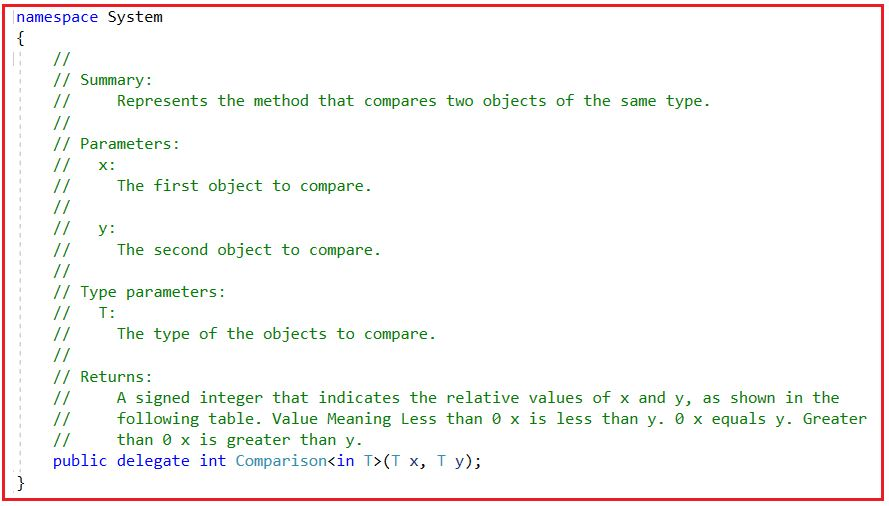
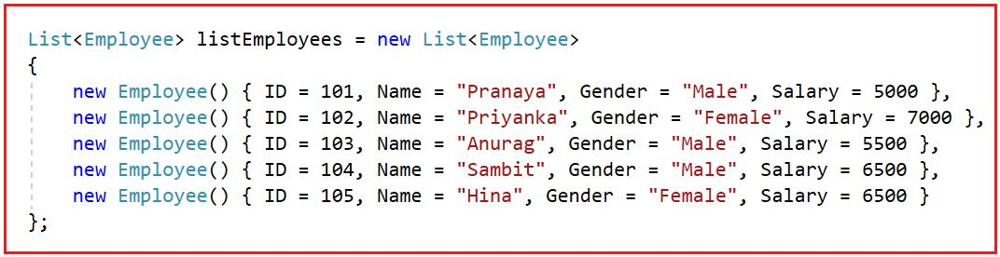
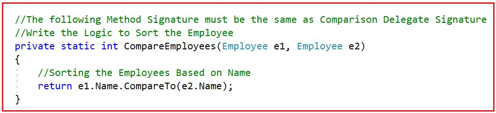
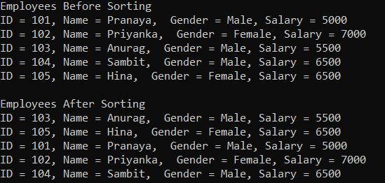
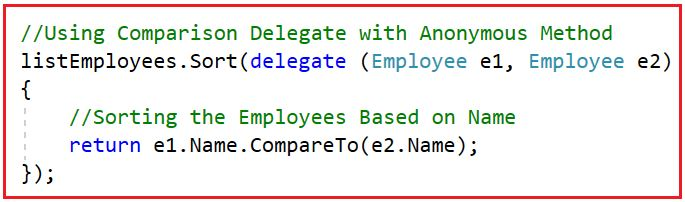

## **مقایسه Delegate در سی شارپ به همراه مثال**

در این مقاله، قصد دارم **نحوه مرتب‌سازی لیستی از انواع پیچیده با استفاده از Comparison Delegate در سی‌شارپ را** با مثال‌هایی مورد بحث قرار دهم. لطفاً مقاله قبلی ما را که در آن نحوه مرتب‌سازی لیستی از نوع پیچیده در سی‌شارپ را با مثال‌هایی مورد بحث قرار دادیم، مطالعه کنید.

##### **متد مرتب‌سازی کلاس مجموعه لیست عمومی<T> در سی شارپ:**

کلاس مجموعه لیست عمومی در سی شارپ چهار متد مرتب سازی زیر را ارائه می‌دهد.

1. **مرتب‌سازی():** این متد برای مرتب‌سازی عناصر در کل لیست عمومی با استفاده از مقایسه‌گر پیش‌فرض استفاده می‌شود.
2. **مرتب‌سازی(مقایسه‌گر IComparer<T>):** این متد برای مرتب‌سازی عناصر در کل لیست عمومی با استفاده از مقایسه‌گر مشخص شده استفاده می‌شود.
3. **مرتب‌سازی(مقایسه<T>):** این متد برای مرتب‌سازی عناصر در کل لیست عمومی با استفاده از System.Comparison مشخص شده استفاده می‌شود.
4. **مرتب‌سازی(int index, int count, IComparer<T> comparer):** این متد برای مرتب‌سازی عناصر در محدوده‌ای از عناصر در یک لیست عمومی با استفاده از مقایسه‌گر مشخص شده استفاده می‌شود.

اگر توجه کرده باشید، **متد Sort(Comparison<T> comparison)** در کلاس List، انتظار دارد که نماینده مقایسه (Comparison delegate) به عنوان یک آرگومان ارسال شود. ما می‌دانیم نماینده چیست. نماینده یک اشاره‌گر تابع است و وقتی نماینده را فراخوانی می‌کنیم، تابعی که به آن اشاره می‌کند اجرا خواهد شد. بنابراین، باید یک متد ایجاد کنیم که امضای آن باید با امضای نماینده مقایسه (Comparison delegate) مطابقت داشته باشد و سپس باید یک نمونه از نماینده مقایسه (Comparison delegate) ایجاد کنیم و به سازنده نماینده مقایسه (Constructor) نام متدی را که می‌خواهیم اجرا شود، ارسال کنیم. بیایید این نماینده مقایسه (Comparison delegate) را با جزئیات درک کنیم.

##### **نماینده مقایسه در سی شارپ:**

حالا، روی Comparison Delegate کلیک راست کرده و سپس go to definition را انتخاب کنید، سپس تعریف زیر از Comparison Delegate در سی شارپ را مشاهده خواهید کرد.



##### **نماینده مقایسه‌ای در سی شارپ چیست؟**

نماینده مقایسه (Comparison Delegate) روشی را نشان می‌دهد که دو شیء از یک نوع را با هم مقایسه می‌کند. در اینجا، پارامتر x اولین شیء برای مقایسه است. پارامتر y دومین شیء برای مقایسه است. و در اینجا T نوع اشیاء مورد مقایسه را نشان می‌دهد. این تابع یک عدد صحیح علامت‌دار را برمی‌گرداند که مقادیر نسبی x و y را نشان می‌دهد، همانطور که در جدول زیر نشان داده شده است.

1. مقداری بزرگتر از صفر برمی‌گرداند - x از y بزرگتر است.
2. مقداری کمتر از صفر برمی‌گرداند - x از y کوچکتر است
3. مقدار بازگشتی صفر است - x برابر است با y

##### **مثالی برای درک مقایسه Delegate در سی شارپ**

حال، بیایید ادامه دهیم و ببینیم چگونه می‌توانیم از Comparison Delegate در سی‌شارپ برای مقایسه مجموعه‌ای از انواع پیچیده استفاده کنیم. فرض کنید کلاسی به نام Employee به صورت زیر داریم.

```csharp
public class Employee
{
    public int ID { get; set; }
    public string Name { get; set; }
    public string Gender { get; set; }
    public int Salary { get; set; }
}
```

همچنین، فرض کنید مجموعه‌ای از کارمندان به شرح زیر داریم:



حال، می‌خواهیم مجموعه listEmployees فوق را با استفاده از متد Sort از کلاس Generic List<T> Collection که Comparison Delegate را به عنوان پارامتر می‌گیرد، یعنی **Sort(Comparison<T> comparison)** مرتب کنیم .

##### **چگونه از Comparison Delegate در سی شارپ استفاده کنیم؟**

**مرحله ۱:** تابعی ایجاد کنید که امضای آن باید با امضای Comparison Delegate مطابقت داشته باشد. این روشی است که در آن باید منطق مقایسه ۲ شیء Employee را بنویسیم. در مقاله delegate خود بحث کردیم که امضای delegate و امضای متدی که delegateها به آن اشاره می‌کنند باید یکسان باشند، در غیر این صورت، خطای زمان کامپایل به شما می‌دهد.



**مرحله ۲:** یک نمونه از Comparison Delegate ایجاد کنید و سپس نام تابع ایجاد شده در مرحله ۱ را به عنوان آرگومان به آن ارسال کنید. بنابراین، در این مرحله Comparison Delegate به تابع ما که شامل منطق مقایسه ۲ شیء کارمند است، اشاره می‌کند.  
**مقایسه<کارمند> employeeComparer= new مقایسه<کارمند>(CompareEmployees);**

**مرحله ۳:** نمونه delegate را به عنوان آرگومان به متد ()Sort که Comparison Delegate را به عنوان پارامتر دریافت می‌کند، به صورت زیر ارسال کنید.  
**مرتب‌سازی لیست کارمندان (listEmployees.Sort(employeeComparer);)**

در این مرحله، listEmployees باید با استفاده از منطق تعریف شده در تابع CompareEmployees() مرتب شود. کد کامل مثال زیر است:

```csharp
using System;
using System.Collections.Generic;

namespace ComparisonDelegateDemo
{
    public class Program
    {
        public static void Main()
        {
            //Creating a List of Type Employee
            List<Employee> listEmployees = new List<Employee>
            {
                new Employee() { ID = 101, Name = "Pranaya", Gender = "Male", Salary = 5000 },
                new Employee() { ID = 102, Name = "Priyanka", Gender = "Female", Salary = 7000 },
                new Employee() { ID = 103, Name = "Anurag", Gender = "Male", Salary = 5500 },
                new Employee() { ID = 104, Name = "Sambit", Gender = "Male", Salary = 6500 },
                new Employee() { ID = 105, Name = "Hina", Gender = "Female", Salary = 6500 }
            };

            Console.WriteLine("Employees Before Sorting");
            foreach (Employee employee in listEmployees)
            {
                Console.WriteLine($"ID = {employee.ID}, Name = {employee.Name},  Gender = {employee.Gender}, Salary = {employee.Salary}");
            }

            //Create an instance of the Comparison Delegate
            Comparison<Employee> employeeComparer = new Comparison<Employee>(CompareEmployees);

            //Passing Comparison Delegate as an argument to the Sort method
            listEmployees.Sort(employeeComparer);

            Console.WriteLine("\nEmployees After Sorting");
            foreach (Employee employee in listEmployees)
            {
                Console.WriteLine($"ID = {employee.ID}, Name = {employee.Name},  Gender = {employee.Gender}, Salary = {employee.Salary}");
            }

            Console.ReadKey();
        }

        //The following Method Signature must be the same as Comparison Delegate Signature
        //Write the Logic to Sort the Employee
        private static int CompareEmployees(Employee e1, Employee e2)
        {
            //Sorting the Employees Based on Name
            return e1.Name.CompareTo(e2.Name);
        }
    }

    public class Employee
    {
        public int ID { get; set; }
        public string Name { get; set; }
        public string Gender { get; set; }
        public int Salary { get; set; }
    }
}
```

###### **خروجی:**



در این رویکرد، این کاری است که ما انجام داده‌ایم

1. ما یک تابع خصوصی ایجاد کرده‌ایم که شامل منطق مقایسه کارمندان است.
2. سپس یک نمونه از delegate مقایسه‌ای ایجاد کرد و سپس نام تابع خصوصی را به delegate ارسال کرد.
3. در نهایت، نمونه‌ی delegate به متد ()Sort ارسال شد.

##### **مقایسه Delegate با متد ناشناس در سی شارپ:**

کد بالا را می‌توان با استفاده از کلمه کلیدی delegate همانطور که در زیر نشان داده شده است، ساده کرد که به عنوان یک متد ناشناس نیز شناخته می‌شود. امضای این متد ناشناس نیز مشابه Comparison Delegate است و از این رو نیز پذیرفته می‌شود.



###### **کد کامل**   **در زیر آمده است:**

```csharp
using System;
using System.Collections.Generic;

namespace ComparisonDelegateDemo
{
    public class Program
    {
        public static void Main()
        {
            //Creating a List of Type Employee
            List<Employee> listEmployees = new List<Employee>
            {
                new Employee() { ID = 101, Name = "Pranaya", Gender = "Male", Salary = 5000 },
                new Employee() { ID = 102, Name = "Priyanka", Gender = "Female", Salary = 7000 },
                new Employee() { ID = 103, Name = "Anurag", Gender = "Male", Salary = 5500 },
                new Employee() { ID = 104, Name = "Sambit", Gender = "Male", Salary = 6500 },
                new Employee() { ID = 105, Name = "Hina", Gender = "Female", Salary = 6500 }
            };

            Console.WriteLine("Employees Before Sorting");
            foreach (Employee employee in listEmployees)
            {
                Console.WriteLine($"ID = {employee.ID}, Name = {employee.Name},  Gender = {employee.Gender}, Salary = {employee.Salary}");
            }

            //Using Comparison Delegate with Anonymous Method
            listEmployees.Sort(delegate (Employee e1, Employee e2)
            {
                //Sorting the Employees Based on Name
                return e1.Name.CompareTo(e2.Name);
            });

            Console.WriteLine("\nEmployees After Sorting");
            foreach (Employee employee in listEmployees)
            {
                Console.WriteLine($"ID = {employee.ID}, Name = {employee.Name},  Gender = {employee.Gender}, Salary = {employee.Salary}");
            }
            Console.ReadKey();
        }
    }

    public class Employee
    {
        public int ID { get; set; }
        public string Name { get; set; }
        public string Gender { get; set; }
        public int Salary { get; set; }
    }
}
```

###### **خروجی:**


##### **مقایسه Delegate با Lambda Expression در سی شارپ**

کدی که در مثال قبلی خود با استفاده از متد ناشناس نوشتیم، می‌تواند با استفاده از عبارت لامبدا همانطور که در زیر نشان داده شده است، ساده‌تر شود.

**listEmployees.Sort((e1, e2) => e1.Name.CompareTo(e2.Name));**

###### **کد کامل**   **در زیر آمده است:**

```csharp
using System;
using System.Collections.Generic;

namespace ComparisonDelegateDemo
{
    public class Program
    {
        public static void Main()
        {
            //Creating a List of Type Employee
            List<Employee> listEmployees = new List<Employee>
            {
                new Employee() { ID = 101, Name = "Pranaya", Gender = "Male", Salary = 5000 },
                new Employee() { ID = 102, Name = "Priyanka", Gender = "Female", Salary = 7000 },
                new Employee() { ID = 103, Name = "Anurag", Gender = "Male", Salary = 5500 },
                new Employee() { ID = 104, Name = "Sambit", Gender = "Male", Salary = 6500 },
                new Employee() { ID = 105, Name = "Hina", Gender = "Female", Salary = 6500 }
            };

            Console.WriteLine("Employees Before Sorting");
            foreach (Employee employee in listEmployees)
            {
                Console.WriteLine($"ID = {employee.ID}, Name = {employee.Name},  Gender = {employee.Gender}, Salary = {employee.Salary}");
            }

            //Using Lambda Expression
            listEmployees.Sort((e1, e2) => { return e1.Name.CompareTo(e2.Name); });
            //listEmployees.Sort((e1, e2) => e1.Name.CompareTo(e2.Name));

            Console.WriteLine("\nEmployees After Sorting");
            foreach (Employee employee in listEmployees)
            {
                Console.WriteLine($"ID = {employee.ID}, Name = {employee.Name},  Gender = {employee.Gender}, Salary = {employee.Salary}");
            }
            Console.ReadKey();
        }
    }

    public class Employee
    {
        public int ID { get; set; }
        public string Name { get; set; }
        public string Gender { get; set; }
        public int Salary { get; set; }
    }
}
```

###### **خروجی:**


