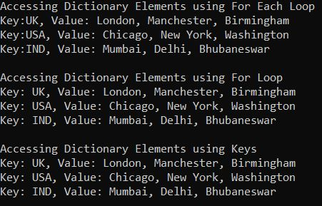
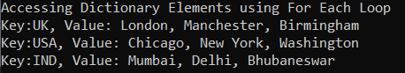
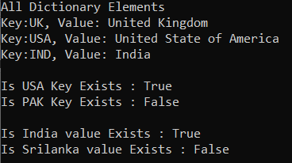
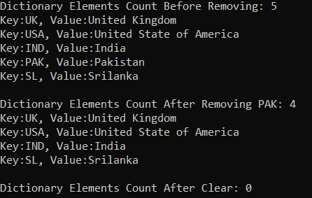
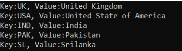
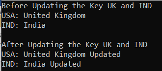
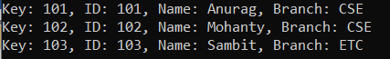
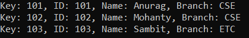
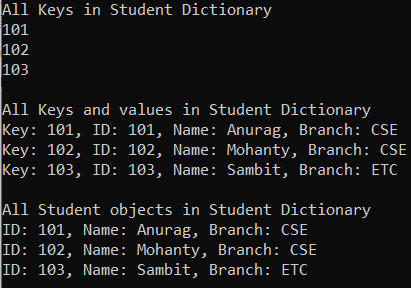

## **کلاس مجموعه دیکشنری عمومی در سی شارپ**

در این مقاله، قصد دارم **کلاس مجموعه Generic Dictionary<TKey, TValue> را در C#** به همراه مثال بررسی کنم. لطفاً مقاله قبلی ما را که در آن کلاس Generic List<T> Collection را در C# به همراه مثال بررسی کردیم، مطالعه کنید. کلاس Dictionary یک ساختار داده است که مجموعه‌ای از جفت داده کلید و مقدار را نشان می‌دهد. در پایان این مقاله، اشاره‌گرهای زیر را به طور مفصل خواهید آموخت.

1. **دیکشنری در سی شارپ چیست؟**
2. **چگونه یک مجموعه دیکشنری عمومی در سی شارپ ایجاد کنیم؟**
3. **چگونه عناصر را به یک مجموعه دیکشنری عمومی <TKey, TValue> در سی شارپ اضافه کنیم؟**
4. **چگونه به یک مجموعه Generic Dictionary<TKey, TValue> در C# دسترسی پیدا کنیم؟**
5. **چگونه در دسترس بودن یک جفت کلید/مقدار را در یک دیکشنری در سی شارپ بررسی کنیم؟**
6. **چگونه عناصر را از یک مجموعه دیکشنری عمومی در سی شارپ حذف کنیم؟**
7. **چگونه می‌توان با استفاده از Indexer در سی شارپ، مقادیر را به یک دیکشنری اختصاص داد و آن‌ها را به‌روزرسانی کرد؟**
8. **مجموعه دیکشنری عمومی با نوع پیچیده در سی شارپ**
9. **کاربرد متد TryGetValue() از کلاس Dictionary در سی شارپ چیست؟**
10. **چگونه یک آرایه را در سی شارپ به دیکشنری تبدیل کنیم؟**
11. **چگونه می‌توان تمام کلیدها و مقادیر یک دیکشنری را در سی شارپ دریافت کرد؟**

##### **کلاس Dictionary<TKey, TValue> در سی شارپ چیست؟**

دیکشنری در سی شارپ یک مجموعه عمومی (Generic Collection) است که عنصر را به شکل جفت‌های کلید-مقدار (Key-Value Pairs) ذخیره می‌کند. نحوه کار دیکشنری عمومی (Generic Dictionary) بسیار شبیه به نحوه کار مجموعه Hashtable غیر عمومی (Non-Generic Hashtable) است. تفاوت این است که هنگام ایجاد شیء دیکشنری عمومی، باید نوع کلیدها و همچنین نوع مقادیر را مشخص کنیم. از آنجایی که Dictionary<TKey, TValue> یک کلاس مجموعه عمومی است، بنابراین به فضای نام System.Collection.Generic تعلق دارد. مجموعه عمومی Dictionary<TKey, TValue> ذاتاً پویا است، به این معنی که با اضافه شدن آیتم‌ها به مجموعه، اندازه دیکشنری به طور خودکار افزایش می‌یابد. در ادامه چند نکته وجود دارد که باید هنگام کار با دیکشنری در سی شارپ به خاطر داشته باشید.

1. در مجموعه Generic Dictionary<TKey, TValue>، کلید نمی‌تواند تهی باشد، اما مقدار می‌تواند تهی باشد اگر نوع TValue آن از نوع مرجع باشد.
2. هر کلید در مجموعه Generic Dictionary<TKey, TValue> باید منحصر به فرد باشد. کلیدهای تکراری مجاز نیستند. اگر سعی کنید یک کلید تکراری اضافه کنید، کامپایلر یک استثنا ایجاد می‌کند.
3. در مجموعه Generic Dictionary<TKey, TValue>، فقط می‌توانید عناصری با انواع یکسان را ذخیره کنید.
4. ظرفیت یک مجموعه Dictionary تعداد عناصری است که Dictionary می‌تواند در خود جای دهد.

##### **چگونه یک مجموعه دیکشنری عمومی در سی شارپ ایجاد کنیم؟**

کلاس Generic Dictionary Collection در سی شارپ، سازنده‌های زیر را ارائه می‌دهد که می‌توانیم از آنها برای ایجاد یک نمونه از کلاس Dictionary collection استفاده کنیم.

1. **Dictionary():** این متد یک نمونه جدید از کلاس Generic Dictionary را که خالی است، ظرفیت اولیه پیش‌فرض را دارد و از مقایسه‌گر برابری پیش‌فرض برای نوع کلید استفاده می‌کند، مقداردهی اولیه می‌کند.
2. **Dictionary(IDictionary<TKey, TValue> dictionary)** : این متد یک نمونه جدید از کلاس Generic Dictionary را مقداردهی اولیه می‌کند که شامل عناصر کپی شده از System.Collections.Generic.IDictionary مشخص شده است و از مقایسه‌گر برابری پیش‌فرض برای نوع کلید استفاده می‌کند.
3. **Dictionary(IEnumerable<KeyValuePair<TKey, TValue>> collection):** این متد یک نمونه جدید از کلاس Generic Dictionary را مقداردهی اولیه می‌کند که شامل عناصر کپی شده از System.Collections.Generic.IDictionary مشخص شده است و از مقایسه‌گر برابری پیش‌فرض برای نوع کلید استفاده می‌کند.
4. **Dictionary(IEqualityComparer<TKey>? comparer):** این تابع یک نمونه جدید از کلاس Generic Dictionary را که خالی است، ظرفیت اولیه پیش‌فرض را دارد و از System.Collections.Generic.IEqualityComparer مشخص شده استفاده می‌کند، مقداردهی اولیه می‌کند.
5. **Dictionary(int capacity):** این متد یک نمونه جدید از کلاس Generic Dictionary را که خالی است، ظرفیت اولیه مشخص شده را دارد و از مقایسه‌گر برابری پیش‌فرض برای نوع کلید استفاده می‌کند، مقداردهی اولیه می‌کند.
6. **Dictionary(IDictionary<TKey, TValue> dictionary, IEqualityComparer<TKey>? comparer):** این متد یک نمونه جدید از کلاس Generic Dictionary را مقداردهی اولیه می‌کند که شامل عناصر کپی شده از System.Collections.Generic.IDictionary مشخص شده است و از System.Collections.Generic.IEqualityCompare مشخص شده استفاده می‌کند.
7. **Dictionary(int capacity, IEqualityComparer<TKey>? comparer):** این تابع یک نمونه جدید از کلاس Generic Dictionary را که خالی است، ظرفیت اولیه مشخص شده را دارد و از System.Collections.Generic.IEqualityComparer مشخص شده استفاده می‌کند، مقداردهی اولیه می‌کند.
8. **Dictionary(SerializationInfo info, StreamingContext context):** یک نمونه جدید از کلاس Generic Dictionary را با داده‌های سریالی مقداردهی اولیه می‌کند.

بیایید ببینیم چگونه می‌توان با استفاده از سازنده Dictionary() در سی شارپ، یک نمونه از کلاس مجموعه Dictionary ایجاد کرد. سازنده Dictionary() برای ایجاد یک نمونه از کلاس Dictionary که خالی است و ظرفیت اولیه پیش‌فرض را دارد، استفاده می‌شود.

**مرحله ۱:**  
از آنجایی که کلاس مجموعه Dictionary<TKey, TValue> متعلق به فضای نام System.Collections.Generic است، بنابراین ابتدا باید فضای نام System.Collections.Generic را به صورت زیر در برنامه خود وارد کنیم:  
**با استفاده از System.Collections.Generic؛**

**مرحله ۲:**  
در مرحله بعد، باید با استفاده از سازنده Dictionary() به صورت زیر، یک نمونه از کلاس Dictionary<TKey, TValue> ایجاد کنیم:  
**دیکشنری<KeyDataType, ValueDataType> dictionary_name = دیکشنری جدید<KeyDataType, ValueDataType>();**

##### **چگونه عناصر را به یک مجموعه دیکشنری عمومی <TKey, TValue> در سی شارپ اضافه کنیم؟**

حال، اگر می‌خواهید عناصری، یعنی یک جفت کلید/مقدار، را به دیکشنری اضافه کنید، باید از متد Add() زیر از کلاس Generic Dictionary Collection در سی شارپ استفاده کنید.

1. **Add(TKey key, TValue value):** متد Add(TKey key, TValue value) برای اضافه کردن یک عنصر با کلید و مقدار مشخص شده به دیکشنری استفاده می‌شود. در اینجا، پارامتر key، کلید عنصری که باید اضافه شود را مشخص می‌کند و پارامتر value، مقدار عنصری که باید اضافه شود را مشخص می‌کند. مقدار می‌تواند برای یک نوع مرجع null باشد، اما Key نمی‌تواند null باشد.

برای مثال:

**دیکشنری<string, string> dictionaryCountries = دیکشنری جدید<string, string>();**  
**dictionaryCountries.Add(“UK”, “London, Manchester, Birmingham”);**  
**dictionaryCountries.Add(“ایالات متحده آمریکا”, “شیکاگو، نیویورک، واشنگتن”);**  
**dictionaryCountries.Add(“IND”, “بمبئی، دهلی، بوبانسور”);**

حتی می‌توان با استفاده از سینتکس Collection Initializer، یک شیء Dictionary<TKey, TValue> به صورت زیر ایجاد کرد:  
**دیکشنری<string, string> dictionaryCountries = new دیکشنری<string, string>**  
**{**  
**{"بریتانیا"، "لندن، منچستر، بیرمنگام"}،**  
**{"ایالات متحده آمریکا"، "شیکاگو، نیویورک، واشنگتن"}،**  
**{"هند"، "بمبئی، دهلی، بوبانسور"}**  
**};**

##### **چگونه به یک مجموعه Generic Dictionary<TKey, TValue> در C# دسترسی پیدا کنیم؟**

ما می‌توانیم به جفت‌های کلید/مقدار مجموعه Dictionary<TKey, TValue> در سی‌شارپ با استفاده از سه روش مختلف دسترسی پیدا کنیم. این روش‌ها به شرح زیر هستند:

**استفاده از کلید برای دسترسی به مجموعه Dictionary<TKey, TValue> در سی شارپ:**  
شما می‌توانید با استفاده از کلیدها به مقادیر تکی مجموعه Dictionary در C# دسترسی پیدا کنید. در این حالت، فقط باید کلید را مشخص کنیم تا مقدار را از dictionary داده شده دریافت کنیم، نیازی به مشخص کردن موقعیت اندیس نیست. اگر کلید مشخص شده وجود نداشته باشد، کامپایلر یک استثنا ایجاد می‌کند. سینتکس آن در زیر آمده است.  
**فرهنگ لغت کشورها["بریتانیا"]**  
**فرهنگ لغت کشورها["ایالات متحده آمریکا"]**

**استفاده از حلقه for-each برای دسترسی به مجموعه Dictionary<TKey,TValue> در سی شارپ:**  
همچنین می‌توانیم از یک حلقه for-each برای دسترسی به جفت‌های کلید/مقدار یک Dictionary<TKey, TValue> در سی‌شارپ به صورت زیر استفاده کنیم.  
**foreach (جفت کلید و مقدار<string, string> KVP در dictionaryCountries)**  
**{**  
**Console.WriteLine($”کلید:{KVP.Key}, مقدار: {KVP.Value}”);**  
**}**

**استفاده از حلقه for برای دسترسی به مجموعه Dictionary<TKey, TValue> در سی شارپ:**  
همچنین می‌توانیم در سی‌شارپ با استفاده از یک حلقه for به صورت زیر به مجموعه Dictionary<TKey, TValue> دسترسی پیدا کنیم. متد ElementAt متعلق به کلاس استاتیک Enumerable است که در **فضای نام System.Linq** باید **فضای نام System.Linq را نیز اضافه کنیم.** تعریف شده است. بنابراین، برای کار با کد زیر،  
**برای (عدد صحیح i = 0; i < dictionaryCountries.Count; i++)**  
**{**  
**رشته کلید = dictionaryCountries.Keys.ElementAt(i);**  
**مقدار رشته = dictionaryCountries[key];**  
**}**

##### **مثالی برای درک نحوه ایجاد یک مجموعه Dictionary<TKey, TValue> و افزودن عناصر در C#:**

برای درک بهتر نحوه ایجاد یک مجموعه Dictionary<TKey, TValue> و نحوه افزودن عناصر به یک Dictionary و نحوه دسترسی به عناصر یک Dictionary در C#، لطفاً به مثال زیر نگاهی بیندازید.

```csharp
using System;
using System.Collections.Generic;
using System.Linq;

namespace GenericDictionaryDemo
{
    class Program
    {
        static void Main()
        {
            //Creating a Dictionary with Key and value both are string type
            Dictionary<string, string> dictionaryCountries = new Dictionary<string, string>();

            //Adding Elements to the Dictionary using Add Method of Dictionary class
            dictionaryCountries.Add("UK", "London, Manchester, Birmingham");
            dictionaryCountries.Add("USA", "Chicago, New York, Washington");
            dictionaryCountries.Add("IND", "Mumbai, Delhi, Bhubaneswar");

            //Accessing Dictionary Elements using For Each Loop
            Console.WriteLine("Accessing Dictionary Elements using For Each Loop");
            foreach (KeyValuePair<string, string> KVP in dictionaryCountries)
            {
                Console.WriteLine($"Key:{KVP.Key}, Value: {KVP.Value}");
            }

            //Accessing Dictionary Elements using For Loop
            Console.WriteLine("\nAccessing Dictionary Elements using For Loop");
            for (int i = 0; i < dictionaryCountries.Count; i++)
            {
                string key = dictionaryCountries.Keys.ElementAt(i);
                string value = dictionaryCountries[key];
                Console.WriteLine($"Key: {key}, Value: {value}");
            }

            //Accessing Dictionary Elements using Keys
            Console.WriteLine("\nAccessing Dictionary Elements using Keys");
            Console.WriteLine($"Key: UK, Value: {dictionaryCountries["UK"]}");
            Console.WriteLine($"Key: USA, Value: {dictionaryCountries["USA"]}");
            Console.WriteLine($"Key: IND, Value: {dictionaryCountries["IND"]}");

            Console.ReadKey();
        }
    }
}
```

###### **خروجی:**



##### **مثال برای اضافه کردن عناصر به یک دیکشنری با استفاده از مقداردهی اولیه مجموعه در سی شارپ:**

این یک ویژگی جدید اضافه شده به C# 3.0 است که امکان مقداردهی اولیه یک مجموعه را مستقیماً در زمان تعریف مانند یک آرایه فراهم می‌کند. یک Dictionary<TKey, TValue> شامل مجموعه‌ای از جفت‌های کلید/مقدار است. متد Add آن دو پارامتر می‌گیرد، یکی برای کلید و دیگری برای مقدار. برای مقداردهی اولیه یک Dictionary<TKey, TValue> یا هر مجموعه دیگری که متد Add آن چندین پارامتر می‌گیرد، هر مجموعه از پارامترها را داخل پرانتز قرار دهید.

در مثال زیر، ما به جای متد Add از کلاس مجموعه Dictionary، از سینتکس Collection Initializer برای اضافه کردن جفت‌های کلید-مقدار به شیء dictionary در C# استفاده می‌کنیم.

```csharp
using System;
using System.Collections.Generic;
using System.Linq;

namespace GenericDictionaryDemo
{
    class Program
    {
        static void Main()
        {
            //Creating a Dictionary with Key and value both are string type using Collection Initializer
            Dictionary<string, string> dictionaryCountries = new Dictionary<string, string>
            {
                { "UK", "London, Manchester, Birmingham" },
                { "USA", "Chicago, New York, Washington" },
                { "IND", "Mumbai, Delhi, Bhubaneswar" }
            };

            //Accessing Dictionary Elements using For Each Loop
            Console.WriteLine("Accessing Dictionary Elements using For Each Loop");
            foreach (KeyValuePair<string, string> KVP in dictionaryCountries)
            {
                Console.WriteLine($"Key:{KVP.Key}, Value: {KVP.Value}");
            }

            Console.ReadKey();
        }
    }
}
```

###### **خروجی:**



##### **چگونه در دسترس بودن یک جفت کلید/مقدار را در یک دیکشنری در سی شارپ بررسی کنیم؟**

اگر می‌خواهید بررسی کنید که آیا جفت کلید/مقدار در مجموعه Dictionary وجود دارد یا خیر، می‌توانید از متدهای زیر از کلاس Generic Dictionary Collection در سی شارپ استفاده کنید.

1. **ContainsKey(TKey key):** متد ContainsKey(TKey key) از Dictionary برای بررسی وجود یا عدم وجود کلید داده شده در Dictionary استفاده می‌شود. پارامتر key برای قرار دادن کلید در شیء Dictionary است. اگر کلید داده شده در مجموعه موجود باشد، مقدار true و در غیر این صورت مقدار false را برمی‌گرداند. اگر کلید null باشد، خطای System.ArgumentNullException رخ می‌دهد.
2. **ContainsValue(TValue value) :** متد ContainsValue(TValue value) از کلاس Dictionary برای بررسی وجود یا عدم وجود مقدار داده شده در Dictionary استفاده می‌شود. مقدار پارامتری که باید در شیء Dictionary قرار گیرد. اگر مقدار داده شده در مجموعه موجود باشد، مقدار true و در غیر این صورت مقدار false را برمی‌گرداند.

بگذارید این موضوع را با یک مثال درک کنیم. مثال زیر نحوه استفاده از متدهای ContainsKey و ContainsValue از کلاس Generic Dictionary Collection در سی شارپ را نشان می‌دهد.

```csharp
using System;
using System.Collections.Generic;
using System.Linq;

namespace GenericsDemo
{
    class Program
    {
        static void Main()
        {
            //Creating a Dictionary with Key and value both are string type using Collection Initializer
            Dictionary<string, string> dictionaryCountries = new Dictionary<string, string>
            {
                { "UK", "United Kingdom" },
                { "USA", "United State of America" },
                { "IND", "India" }
            };

            //Accessing Dictionary Elements using For Each Loop
            Console.WriteLine("All Dictionary Elements");
            foreach (KeyValuePair<string, string> KVP in dictionaryCountries)
            {
                Console.WriteLine($"Key:{KVP.Key}, Value: {KVP.Value}");
            }

            //Checking the key using the ContainsKey methid
            Console.WriteLine("\nIs USA Key Exists : " + dictionaryCountries.ContainsKey("USA"));
            Console.WriteLine("Is PAK Key Exists : " + dictionaryCountries.ContainsKey("PAK"));

            //Checking the value using the ContainsValue method
            Console.WriteLine("\nIs India value Exists : " + dictionaryCountries.ContainsValue("India"));
            Console.WriteLine("Is Srilanka value Exists : " + dictionaryCountries.ContainsValue("Srilanka"));

            Console.ReadKey();
        }
    }
}
```

###### **خروجی:**



##### **چگونه عناصر را از یک مجموعه دیکشنری عمومی در سی شارپ حذف کنیم؟**

اگر می‌خواهید یک عنصر را از Dictionary حذف کنید، می‌توانید از متد Remove زیر از کلاس مجموعه Dictionary استفاده کنید.

1. **حذف(کلید TKey):** این متد برای حذف عنصر با کلید مشخص شده از مجموعه دیکشنری استفاده می‌شود. در اینجا، پارامتر key عنصری را که باید حذف شود مشخص می‌کند. اگر کلید مشخص شده در دیکشنری یافت نشود، خطای KeyNotfoundException رخ می‌دهد، بنابراین قبل از حذف آن، با استفاده از متد ContainsKey() وجود کلید موجود را بررسی کنید.

اگر می‌خواهید تمام عناصر را از مجموعه Dictionary حذف کنید، باید از متد Clear زیر از کلاس Dictionary در C# استفاده کنید.

1. **Clear():** این متد برای حذف تمام عناصر، یعنی تمام کلیدها و مقادیر، از شیء Dictionary استفاده می‌شود.

برای درک بهتر نحوه استفاده از متدهای Remove و Clear از کلاس مجموعه Generic Dictionary، لطفاً به مثال زیر نگاهی بیندازید.

```csharp
using System;
using System.Collections.Generic;
using System.Linq;

namespace GenericsDemo
{
    class Program
    {
        static void Main()
        {
            //Creating a Dictionary with Key and value both are string type using Collection Initializer
            Dictionary<string, string> dictionaryCountries = new Dictionary<string, string>
            {
                { "UK", "United Kingdom" },
                { "USA", "United State of America" },
                { "IND", "India" },
                { "PAK", "Pakistan" },
                { "SL", "Srilanka" }
            };

            Console.WriteLine($"Dictionary Elements Count Before Removing: {dictionaryCountries.Count}");
            foreach (var item in dictionaryCountries)
            {
                Console.WriteLine($"Key:{item.Key}, Value:{item.Value}");
            }

            // Remove element PAK from Dictionary Using Remove() method
            if (dictionaryCountries.ContainsKey("PAK"))
            {
                dictionaryCountries.Remove("PAK");
                Console.WriteLine($"\nDictionary Elements Count After Removing PAK: {dictionaryCountries.Count}");
                foreach (var item in dictionaryCountries)
                {
                    Console.WriteLine($"Key:{item.Key}, Value:{item.Value}");
                }
            }

            // Remove all Elements from Dictionary Using Clear method
            dictionaryCountries.Clear();
            Console.WriteLine($"\nDictionary Elements Count After Clear: {dictionaryCountries.Count}");

            Console.ReadKey();
        }
    }
}
```

###### **خروجی:**



##### **استفاده از متد ParallelEnumerable.ForAll() برای تکرار یک مجموعه دیکشنری در سی شارپ**

استفاده از متد ParallelEnumerable.ForAll() روشی ساده اما کارآمد برای پیمایش روی دیکشنری‌های بزرگ است. مثال زیر نحوه پیمایش روی یک دیکشنری با استفاده از متد ParallelEnumerable.ForAll() را نشان می‌دهد.

```csharp
using System;
using System.Collections.Generic;
using System.Linq;

namespace GenericsDemo
{
    class Program
    {
        static void Main()
        {
            //Creating a Dictionary with Key and value both are string type using Collection Initializer
            Dictionary<string, string> dictionaryCountries = new Dictionary<string, string>
            {
                { "UK", "United Kingdom" },
                { "USA", "United State of America" },
                { "IND", "India" },
                { "PAK", "Pakistan" },
                { "SL", "Srilanka" }
            };

            Console.WriteLine($"Iterating Dictionary Using AsParallel().ForAll Method");
            dictionaryCountries.AsParallel()
            .ForAll(entry => Console.WriteLine(entry.Key + " : " + entry.Value));

            Console.ReadKey();
        }
    }
}
```

###### **خروجی:**

 برای تکرار یک مجموعه دیکشنری در سی شارپ")

##### **چگونه می‌توان با استفاده از Indexer در سی شارپ، مقادیری را به یک دیکشنری اختصاص داد؟**

برای اضافه کردن مقدار به یک دیکشنری با استفاده از اندیس‌گذار، باید بعد از نام دیکشنری از براکت استفاده کنیم. دلیل این امر این است که دیکشنری با جفت‌های کلید/مقدار کار می‌کند و ما باید هنگام اضافه کردن عناصر، هم کلید و هم مقدار را مشخص کنیم. کلید بین براکت مشخص می‌شود. سینتکس آن در زیر آمده است.

**دیکشنری[کلید] = مقدار؛**

برای درک بهتر، لطفاً به مثال زیر نگاهی بیندازید. در مثال زیر، ابتدا دیکشنری را با چند جفت کلید-مقدار ایجاد کرده‌ایم. سپس با استفاده از شاخص‌گذار، جفت کلید-مقدار جدیدی را به dictionaryCountries اضافه کرده‌ایم. در اینجا، IND، PAK و SL کلیدها هستند و هند، پاکستان و سریلانکا به ترتیب مقادیری هستند که با هر کلید مطابقت دارند.

```csharp
using System;
using System.Collections.Generic;
using System.Linq;

namespace GenericsDemo
{
    class Program
    {
        static void Main()
        {
            //Creating a Dictionary with Key and value both are string type using Collection Initializer
            Dictionary<string, string> dictionaryCountries = new Dictionary<string, string>
            {
                { "UK", "United Kingdom" },
                { "USA", "United State of America" }
            };

            //Assign Values to a Dictionary with Indexer 
            dictionaryCountries["IND"] = "India";
            dictionaryCountries["PAK"] = "Pakistan";
            dictionaryCountries["SL"] = "Srilanka";

            //Accessing the Dictionary using For Each Loop
            foreach (var item in dictionaryCountries)
            {
                Console.WriteLine($"Key:{item.Key}, Value:{item.Value}");
            }

            Console.ReadKey();
        }
    }
}
```

###### **خروجی:**



##### **چگونه یک دیکشنری را در سی شارپ با استفاده از Indexer به‌روزرسانی کنیم؟**

قبلاً بحث کردیم که می‌توانیم با استفاده از کلید در اندیس‌گذار، مقدار را از دیکشنری بازیابی کنیم. به همین ترتیب، می‌توانیم از اندیس‌گذار کلید برای به‌روزرسانی یک جفت کلید-مقدار موجود در مجموعه دیکشنری در سی‌شارپ نیز استفاده کنیم. برای درک بهتر، لطفاً به مثال زیر نگاهی بیندازید.

```csharp
using System;
using System.Collections.Generic;
using System.Linq;

namespace GenericsDemo
{
    class Program
    {
        static void Main()
        {
            //Creating a Dictionary with Key and value both are string type using Collection Initializer
            Dictionary<string, string> dictionaryCountries = new Dictionary<string, string>
            {
                { "UK", "United Kingdom" },
                { "USA", "United State of America" },
                { "IND", "India"},
                { "SL", "Srilanka"}
            };

            Console.WriteLine("Before Updating the Key UK and IND");
            Console.WriteLine($"USA: {dictionaryCountries["UK"]}");
            Console.WriteLine($"IND: {dictionaryCountries["IND"]}");

            //Updating the key UK and USA using Indexer
            dictionaryCountries["UK"] = "United Kingdom Updated"; 
            dictionaryCountries["IND"] = "India Updated";

            Console.WriteLine("\nAfter Updating the Key UK and IND");
            Console.WriteLine($"USA: {dictionaryCountries["UK"]}");
            Console.WriteLine($"IND: {dictionaryCountries["IND"]}");

            Console.ReadKey();
        }
    }
}
```

###### **خروجی:**



**نکته:** هنگام دسترسی به مقدار یک دیکشنری از طریق کلید، مطمئن شوید که دیکشنری حاوی کلید مورد نظر است، در غیر این صورت با خطای KeyNotFound مواجه خواهید شد.

##### **مجموعه دیکشنری عمومی با نوع پیچیده در سی شارپ:**

تاکنون، ما از انواع رشته‌ای و عدد صحیح داخلی با Dictionary استفاده کرده‌ایم. حال، بیایید ببینیم چگونه یک مجموعه Dictionary با انواع پیچیده ایجاد کنیم. برای این کار، کلاسی به نام Student ایجاد می‌کنیم. سپس یک مجموعه Dictionary ایجاد می‌کنیم که کلید آن یک عدد صحیح است که چیزی جز ویژگی Id دانشجو نیست و مقدار آن نوع Student است. برای درک بهتر، لطفاً به مثال زیر نگاهی بیندازید.

```csharp
using System;
using System.Collections.Generic;
using System.Linq;

namespace GenericsDemo
{
    class Program
    {
        static void Main()
        {
            Dictionary<int, Student> dictionaryStudents = new Dictionary<int, Student>
            {
                { 101, new Student(){ ID = 101, Name ="Anurag", Branch="CSE"} },
                { 102, new Student(){ ID = 102, Name ="Mohanty", Branch="CSE"} },
                { 103, new Student(){ ID = 103, Name ="Sambit", Branch="ETC"}},

                //The following Statement will give runtime error
                //System.ArgumentException: 'An item with the same key has already been added. Key: 101'
                //{ 101, new Student(){ ID = 101, Name ="Anurag", Branch="CSE"}}
            };

            foreach (KeyValuePair<int, Student> item in dictionaryStudents)
            {
                Console.WriteLine($"Key: {item.Key}, ID: {item.Value.ID}, Name: {item.Value.Name}, Branch: {item.Value.Branch}");
            }

            Console.ReadKey();
        }
    }
    public class Student
    {
        public int ID { get; set; }
        public string Name { get; set; }
        public string Branch { get; set; }
    }
}
```

###### **خروجی:**



##### **کاربرد متد TryGetValue() از کلاس Dictionary در سی شارپ چیست؟**

این یکی از متدهای مهم کلاس مجموعه Dictionary در C# است. این متد دو پارامتر می‌گیرد، یکی کلید و دیگری مقدار. مقدار از نوع پارامتر out است. اگر کلید در دیکشنری وجود داشته باشد، مقدار true را برمی‌گرداند و مقداری که با آن کلید مرتبط است در متغیر خروجی ذخیره می‌شود.

اگر مطمئن نیستید که یک کلید در دیکشنری وجود دارد یا خیر، می‌توانید از متد TryGetValue() برای دریافت مقدار از دیکشنری استفاده کنید، زیرا اگر از TryGetValue استفاده نکنید، در این صورت با خطای KeyNotFoundException مواجه خواهید شد.

برای درک بهتر، لطفاً به مثال زیر نگاهی بیندازید. در اولین متد TryGetValue، ما کلید را به عنوان ۱۰۲ و متغیر خروجی یعنی std102 ارسال می‌کنیم. همانطور که می‌بینیم، کلید ۱۰۲ در دیکشنری وجود دارد، بنابراین، این متد مقدار true را برمی‌گرداند و مقدار مرتبط در متغیر std102 قرار می‌گیرد. و از آنجایی که متد مقدار true را برمی‌گرداند، بدنه شرط if اجرا می‌شود و می‌توانید داده‌های دانش‌آموز را در پنجره کنسول مشاهده کنید.

در متد دوم TryGetValue، ما کلید را به عنوان ۱۰۵ و متغیر خروجی یعنی std105 ارسال می‌کنیم. همانطور که می‌بینیم، کلید ۱۰۵ در دیکشنری وجود ندارد، بنابراین، این متد مقدار false را برمی‌گرداند و از این رو مقدار در متغیر std105 قرار داده نمی‌شود و از آنجایی که متد مقدار false را برمی‌گرداند، بخش else از شرط if اجرا می‌شود و می‌توانید آن را در پنجره کنسول مشاهده کنید.

```csharp
using System;
using System.Collections.Generic;

namespace GenericDictionaryDemo
{
    class Program
    {
        static void Main()
        {
            Dictionary<int, Student> dictionaryStudents = new Dictionary<int, Student>
            {
                { 101, new Student(){ ID = 101, Name ="Anurag", Branch="CSE"} },
                { 102, new Student(){ ID = 102, Name ="Mohanty", Branch="CSE"} },
                { 103, new Student(){ ID = 103, Name ="Sambit", Branch="ETC"}}
            };

            foreach (KeyValuePair<int, Student> item in dictionaryStudents)
            {
                Console.WriteLine($"Key: {item.Key}, ID: {item.Value.ID}, Name: {item.Value.Name}, Branch: {item.Value.Branch}");
            }

            Student std102;
            if (dictionaryStudents.TryGetValue(102, out std102))
            {
                Console.WriteLine("\nStudent with Key = 102 is found in the dictionary");
                Console.WriteLine($"ID: {std102.ID}, Name: {std102.Name}, Branch: {std102.Branch}");
            }
            else
            {
                Console.WriteLine("\nStudent with Key = 102 is not found in the dictionary");
            }

            Student std105;
            if (dictionaryStudents.TryGetValue(105, out std105))
            {
                Console.WriteLine("\nStudent with Key = 102 is found in the dictionary");
                Console.WriteLine($"ID: {std105.ID}, Name: {std105.Name}, Branch: {std105.Branch}");
            }
            else
            {
                Console.WriteLine("\nStudent with Key = 105 is not found in the dictionary");
            }

            Console.ReadKey();
        }
    }
    public class Student
    {
        public int ID { get; set; }
        public string Name { get; set; }
        public string Branch { get; set; }
    }
}
```

###### **خروجی:**

 از کلاس Dictionary در سی شارپ چیست؟")

**نکته:** اگر مطمئن نیستید که یک کلید در دیکشنری وجود دارد یا خیر، می‌توانید از متد TryGetValue() برای دریافت مقدار از دیکشنری استفاده کنید، زیرا اگر از TryGetValue استفاده نکنید، در این صورت با خطای KeyNotFoundException مواجه خواهید شد.

##### **چگونه یک آرایه را در سی شارپ به دیکشنری تبدیل کنیم؟**

برای تبدیل یک آرایه به دیکشنری، باید از متد ToDictionary() استفاده کنیم. برای درک بهتر، لطفاً به مثال زیر نگاهی بیندازید. در مثال زیر، ما آرایه Student را با استفاده از متد ToDictionary() به دیکشنری تبدیل می‌کنیم. در اینجا، در دیکشنری، کلید، شناسه دانشجویی و مقدار، خود شیء employee است.

```csharp
using System;
using System.Collections.Generic;
using System.Linq;

namespace GenericsDemo
{
    class Program
    {
        static void Main()
        {
            Student[] arrayStudents = new Student[3];
            arrayStudents[0] = new Student() { ID = 101, Name = "Anurag", Branch = "CSE" };
            arrayStudents[1] = new Student() { ID = 102, Name = "Mohanty", Branch = "CSE" };
            arrayStudents[2] = new Student() { ID = 103, Name = "Sambit", Branch = "ETC" };

            Dictionary<int, Student> dictionaryStudents = arrayStudents.ToDictionary(std => std.ID, std => std);
            // OR        
            // Dictionary<int, Student> dictionaryStudents = arrayStudents.ToDictionary(employee => employee.ID);
            //OR use a foreach loop
            //Dictionary<int, Student> dict = new Dictionary<int, Student>();
            //foreach (Student std in arrayStudents)
            //{
            //    dict.Add(std.ID, std);
            //}

            foreach (KeyValuePair<int, Student> item in dictionaryStudents)
            {
                Console.WriteLine($"Key: {item.Key}, ID: {item.Value.ID}, Name: {item.Value.Name}, Branch: {item.Value.Branch}");
            }

            Console.ReadKey();
        }
    }
    public class Student
    {
        public int ID { get; set; }
        public string Name { get; set; }
        public string Branch { get; set; }
    }
}
```

###### **خروجی:**



##### **چگونه می‌توان تمام کلیدها و مقادیر یک دیکشنری را در سی شارپ دریافت کرد؟**

برای دریافت تمام کلیدهای موجود در دیکشنری، باید از ویژگی‌های Keys شیء دیکشنری استفاده کنیم. برای دریافت تمام مقادیر یک دیکشنری، ابتدا باید کلیدها را دریافت کنیم، سپس باید مقادیر را با استفاده از کلیدها دریافت کنیم. حتی اگر فقط مقادیر را می‌خواهید، می‌توانید از ویژگی Values شیء دیکشنری استفاده کنید. برای درک بهتر، لطفاً به مثال زیر نگاهی بیندازید.

```csharp
using System;
using System.Collections.Generic;
using System.Linq;

namespace GenericsDemo
{
    class Program
    {
        static void Main()
        {
            Dictionary<int, Student> dictionaryStudents = new Dictionary<int, Student>
            {
                { 101, new Student(){ ID = 101, Name ="Anurag", Branch="CSE"} },
                { 102, new Student(){ ID = 102, Name ="Mohanty", Branch="CSE"} },
                { 103, new Student(){ ID = 103, Name ="Sambit", Branch="ETC"}}
            };

            // To get all the keys in the dictionary use the keys properties of dictionary
            Console.WriteLine("All Keys in Student Dictionary");
            foreach (int key in dictionaryStudents.Keys)
            {
                Console.WriteLine(key + " ");
            }
            
            // Once you get the keys, then get the values using the keys
            Console.WriteLine("\nAll Keys and values in Student Dictionary");
            foreach (int key in dictionaryStudents.Keys)
            {
                var student = dictionaryStudents[key];
                Console.WriteLine($"Key: {key}, ID: {student.ID}, Name: {student.Name}, Branch: {student.Branch}");
            }
            
            //To get all the values in the dictionary use Values property
            Console.WriteLine("\nAll Student objects in Student Dictionary");
            foreach (Student student in dictionaryStudents.Values)
            {
                Console.WriteLine($"ID: {student.ID}, Name: {student.Name}, Branch: {student.Branch}");
            }

            Console.ReadKey();
        }
    }
    public class Student
    {
        public int ID { get; set; }
        public string Name { get; set; }
        public string Branch { get; set; }
    }
}
```

###### **خروجی:**



**نکته:** کلاس عمومی Dictionary<TKey, TValue> نگاشتی از مجموعه‌ای از کلیدها به مجموعه‌ای از مقادیر ارائه می‌دهد. هر مقدار اضافه شده به دیکشنری شامل یک مقدار و کلید مرتبط با آن است. بازیابی یک مقدار با استفاده از کلید آن بسیار سریع و نزدیک به O(1) است زیرا کلاس Dictionary<TKey, TValue> به عنوان یک جدول هش پیاده‌سازی شده است که عملکرد برنامه را افزایش می‌دهد. سرعت بازیابی به کیفیت الگوریتم هشینگ از نوع مشخص شده برای TKey بستگی دارد.

##### **خلاصه کلاس مجموعه دیکشنری عمومی سی شارپ:**

1. یک دیکشنری مجموعه‌ای از جفت‌های کلید-مقدار است.
2. کلاس Dictionary Generic Collection در فضای نام System.Collections.Generic موجود است.
3. هنگام ایجاد یک دیکشنری، باید نوع کلید و همچنین نوع مقدار را مشخص کنیم.
4. سریع‌ترین راه برای پیدا کردن یک مقدار در دیکشنری، استفاده از کلیدها است.
5. کلیدها در یک دیکشنری باید منحصر به فرد باشند.
