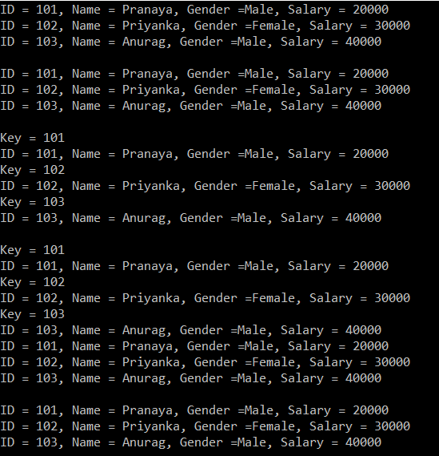

## **تبدیل بین آرایه، لیست و دیکشنری در سی شارپ**

در این مقاله، ما در مورد نحوه انجام **تبدیل بین لیست آرایه و دیکشنری در سی شارپ** با مثال بحث خواهیم کرد. لطفاً مقاله قبلی ما را که در آن در مورد دیکشنری در سی شارپ بحث کردیم، مطالعه کنید. به عنوان بخشی از این مقاله، شش مورد زیر را مورد بحث قرار خواهیم داد.

1. **تبدیل آرایه به لیست - استفاده از ToList() متد**
2. **تبدیل یک لیست به آرایه - استفاده از ToArray() متد**
3. **تبدیل یک لیست به دیکشنری - استفاده از ToDictionary() متد**
4. **تبدیل یک آرایه به دیکشنری - استفاده از ToDictionary() متد**
5. **تبدیل یک دیکشنری به آرایه – استفاده از متد ToArray() روی ویژگی Values ​​شیء دیکشنری**
6. **تبدیل یک دیکشنری به لیست - استفاده از متد ToList() در ویژگی Values ​​شیء دیکشنری**

##### **بگذارید این را با یک مثال درک کنیم.**

کد به طور کامل توضیح داده شده است. لطفاً به قسمت نظرات مراجعه کنید.  

```csharp
using System;
using System.Collections.Generic;
using System.Linq;

namespace CollectionDemo
{
    public class Program
    {
        static void Main(string[] args)
        {
            //Create Employee object
            Employee emp1 = new Employee()
            {
                ID = 101,
                Name = "Pranaya",
                Gender = "Male",
                Salary = 20000
            };
            Employee emp2 = new Employee()
            {
                ID = 102,
                Name = "Priyanka",
                Gender = "Female",
                Salary = 30000
            };
            Employee emp3 = new Employee()
            {
                ID = 103,
                Name = "Anurag",
                Gender = "Male",
                Salary = 40000
            };

            // Create an array of employees with size 3
            // and then Store the 3 employees into the array
            Employee[] arrayEmployees = new Employee[3];
            arrayEmployees[0] = emp1;
            arrayEmployees[1] = emp2;
            arrayEmployees[2] = emp3;

            // To convert an array to a List, use ToList() method
            List<Employee> listEmployees = arrayEmployees.ToList();
            foreach (Employee emp in listEmployees)
            {
                Console.WriteLine("ID = {0}, Name = {1}, Gender ={2}, Salary = {3}",
                               emp.ID, emp.Name, emp.Gender, emp.Salary);
            }
            Console.WriteLine();

            // To convert a List to an array, use ToArray() method
            Employee[] arrayAllEmployeesFromList = listEmployees.ToArray();
            foreach (Employee emp in arrayAllEmployeesFromList)
            {
                Console.WriteLine("ID = {0}, Name = {1}, Gender ={2}, Salary = {3}",
                               emp.ID, emp.Name, emp.Gender, emp.Salary);
            }
            Console.WriteLine();

            // To convert a List to a Dictionary, use ToDictionary() method
            Dictionary<int, Employee> dictionaryEmployees = listEmployees.ToDictionary(employee => employee.ID, employee => employee);
            foreach (KeyValuePair<int, Employee> keyValuePairEmployees in dictionaryEmployees)
            {
                Console.WriteLine("Key = {0}", keyValuePairEmployees.Key);
                Employee emp = keyValuePairEmployees.Value;
                Console.WriteLine("ID = {0}, Name = {1}, Gender ={2}, Salary = {3}",
                               emp.ID, emp.Name, emp.Gender, emp.Salary);
            }
            Console.WriteLine();

            // To convert an Array to a Dictionary, use ToDictionary() method
            Dictionary<int, Employee> dictionaryEmployeesFromArray = arrayEmployees.ToDictionary(employee => employee.ID, employee => employee);
            // Loop thru the dictionary and print the key/value pairs
            foreach (KeyValuePair<int, Employee> kvp in dictionaryEmployeesFromArray)
            {
                Console.WriteLine("Key = {0}", kvp.Key);
                Employee emp = kvp.Value;
                Console.WriteLine("ID = {0}, Name = {1}, Gender ={2}, Salary = {3}",
                               emp.ID, emp.Name, emp.Gender, emp.Salary);
            }

            // To Convert a dictionary to an array, use ToArray method on the Values 
            // Property of the dictionary object
            Employee[] arrayAllEmployeesFromDictionary = dictionaryEmployeesFromArray.Values.ToArray();
            foreach (Employee emp in arrayAllEmployeesFromDictionary)
            {
                Console.WriteLine("ID = {0}, Name = {1}, Gender ={2}, Salary = {3}",
                               emp.ID, emp.Name, emp.Gender, emp.Salary);
            }
            Console.WriteLine();

            // To Convert a dictionary to a List, use ToList method on the Values
            // Property of the dictionary object
            List<Employee> listAllEmployeesFromDictionary = dictionaryEmployeesFromArray.Values.ToList();
            foreach (Employee emp in listAllEmployeesFromDictionary)
            {
                Console.WriteLine("ID = {0}, Name = {1}, Gender ={2}, Salary = {3}",
                               emp.ID, emp.Name, emp.Gender, emp.Salary);
            }

            Console.ReadKey();
        }
    }
    public class Employee
    {
        public int ID { get; set; }
        public string Name { get; set; }
        public string Gender { get; set; }
        public int Salary { get; set; }
    }
}
```

###### **خروجی:**

