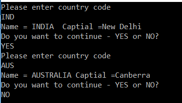

## **لیست در مقابل دیکشنری در سی شارپ به همراه مثال**

در این مقاله، قصد دارم **لیست در مقابل دیکشنری را در سی شارپ** با مثال‌هایی مورد بحث قرار دهم. لطفاً مقاله قبلی ما را که در آن در مورد تبدیل بین لیست آرایه و دیکشنری در سی شارپ بحث کردیم، مطالعه کنید. در پایان این مقاله، تفاوت بین لیست و دیکشنری را خواهید فهمید و همچنین متوجه خواهید شد که چه زمانی باید از لیست به جای دیکشنری و برعکس استفاده کنید.

##### **لیست در مقابل دیکشنری در سی شارپ**

لیست‌ها و دیکشنری‌ها هر دو متعلق به مجموعه‌های Generic هستند که برای ذخیره مجموعه‌ای از داده‌ها استفاده می‌شوند. هر دو **Dictionary <TKey, TValue>** و **List <T>** مشابه هستند و هر دو دارای ساختار داده دسترسی تصادفی در چارچوب .NET می‌باشند. Dictionary بر اساس جدول هش است، به این معنی که از جستجوی هش استفاده می‌کند، که یک الگوریتم کارآمد برای جستجوی موارد است، از سوی دیگر، یک لیست باید عنصر به عنصر بررسی کند تا نتیجه را از ابتدا پیدا کند. در این مقاله، ما List در مقابل Dictionary در C# را مورد بحث قرار خواهیم داد. در مقایسه با ساختار داده List، Dictionary همیشه زمان جستجوی کم و بیش ثابتی دارد.

##### **بیایید وارد جزئیات شویم.**

دیکشنری از الگوریتم هشینگ برای جستجوی عنصر (داده) استفاده می‌کند. یک دیکشنری ابتدا مقدار هش را برای کلید محاسبه می‌کند و این مقدار هش منجر به سطل داده هدف می‌شود. پس از آن، هر عنصر در سطل باید از نظر برابری بررسی شود. اما در واقع، لیست در جستجوی مورد اول سریع‌تر از دیکشنری خواهد بود زیرا در مرحله اول چیزی برای جستجو وجود ندارد. اما در مرحله دوم، لیست باید مورد اول و سپس مورد دوم را جستجو کند. بنابراین هر مرحله از جستجو زمان بیشتری می‌برد. هرچه لیست بزرگتر باشد، زمان بیشتری طول می‌کشد. البته، دیکشنری در اصل جستجوی سریع‌تری با O(1) دارد در حالی که عملکرد جستجوی یک لیست یک عملیات O(n) است.

دیکشنری یک کلید را به یک مقدار نگاشت می‌کند و نمی‌تواند کلیدهای تکراری داشته باشد، در حالی که یک لیست فقط شامل مجموعه‌ای از مقادیر است. همچنین، لیست‌ها اجازه می‌دهند آیتم‌های تکراری وجود داشته باشند و از پیمایش خطی پشتیبانی می‌کنند.

به مثال زیر توجه کنید:  
**دیکشنری <string, int> = دیکشنری جدید <string, int>();**  
**لیست newList = لیست جدید ();**

اضافه کردن داده به لیست  
**newList.Add(data);**

یک لیست می‌تواند به سادگی آیتم را به انتهای آیتم لیست موجود اضافه کند. اضافه کردن داده به دیکشنری  
**dictionary.Add(key, data);**

وقتی داده‌ها را به یک دیکشنری اضافه می‌کنید، باید یک کلید منحصر به فرد برای داده‌ها مشخص کنید تا بتوان آن‌ها را به صورت منحصر به فرد شناسایی کرد.

یک دیکشنری یک شناسه منحصر به فرد دارد، بنابراین هر زمان که شما مقداری را در یک دیکشنری جستجو می‌کنید، زمان اجرا باید یک کد هش را از کلید محاسبه کند. این الگوریتم بهینه شده توسط برخی از جابجایی‌های بیت سطح پایین یا تقسیم‌های مدول پیاده‌سازی می‌شود. ما نقطه‌ای را تعیین می‌کنیم که در آن دیکشنری برای جستجوها نسبت به لیست کارآمدتر می‌شود.

##### **مثال برای درک** **List در مقابل Dictionary در C#** **:**

متد Find() از کلاس List، هر شیء در لیست را تا زمانی که یک مورد منطبق پیدا شود، پیمایش می‌کند. بنابراین، اگر می‌خواهیم با استفاده از یک کلید، مقداری را جستجو کنیم، یک دیکشنری برای عملکرد بهتر در لیست مناسب‌تر است. بنابراین، زمانی که می‌دانیم مجموعه در درجه اول برای جستجوها استفاده خواهد شد، باید از دیکشنری استفاده کنیم.

```csharp
using System;
using System.Collections.Generic;

namespace DictionaryVSListCollectionDemo
{
    public class Program
    {
        public static void Main()
        {
            Country country1 = new Country()
            {
                Code = "AUS",
                Name = "AUSTRALIA",
                Capital = "Canberra"
            };
            Country country2 = new Country()
            {
                Code = "IND",
                Name = "INDIA ",
                Capital = "New Delhi"
            };
            Country country3 = new Country()
            {
                Code = "USA",
                Name = "UNITED STATES",
                Capital = "Washington D.C."
            };
            Country country4 = new Country()
            {
                Code = "GBR",
                Name = "UNITED KINGDOM",
                Capital = "London"
            };
            Country country5 = new Country()
            {
                Code = "CAN",
                Name = "CANADA",
                Capital = "Ottawa"
            };

            //List<Country> listCountries = new List<Country>();
            //listCountries.Add(country1);
            //listCountries.Add(country2);
            //listCountries.Add(country3);
            //listCountries.Add(country4);
            //listCountries.Add(country5);

            Dictionary<string, Country> dictionaryCountries = new Dictionary<string, Country>();
            dictionaryCountries.Add(country1.Code, country1);
            dictionaryCountries.Add(country2.Code, country2);
            dictionaryCountries.Add(country3.Code, country3);
            dictionaryCountries.Add(country4.Code, country4);
            dictionaryCountries.Add(country5.Code, country5);

            string strUserChoice = string.Empty;
            do
            {
                Console.WriteLine("Please enter country code");
                string strCountryCode = Console.ReadLine().ToUpper();

                // Find() method of the list class loops thru each object in the list until a match is found. So, if we want to 
                // lookup a value using a key dictionary is better for performance over list. 
                // Country resultCountry = listCountries. Find(country => country.Code == strCountryCode);

                Country resultCountry = dictionaryCountries.ContainsKey(strCountryCode) ? dictionaryCountries[strCountryCode] : null;

                if (resultCountry == null)
                {
                    Console.WriteLine("The country code you entered does not exist");
                }
                else
                {
                    Console.WriteLine("Name = " + resultCountry.Name + " Captial =" + resultCountry.Capital);
                }

                do
                {
                    Console.WriteLine("Do you want to continue - YES or NO?");
                    strUserChoice = Console.ReadLine().ToUpper();
                }
                while (strUserChoice != "NO" && strUserChoice != "YES");
            }
            while (strUserChoice == "YES");
        }
    }

    public class Country
    {
        public string Name { get; set; }
        public string Code { get; set; }
        public string Capital { get; set; }
    }
}
```

###### **خروجی:**

