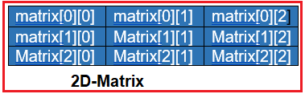
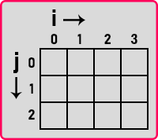
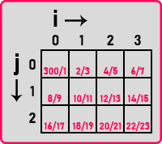
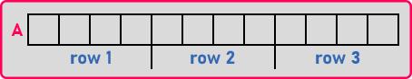
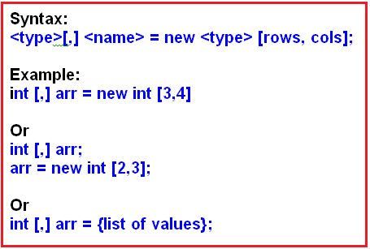
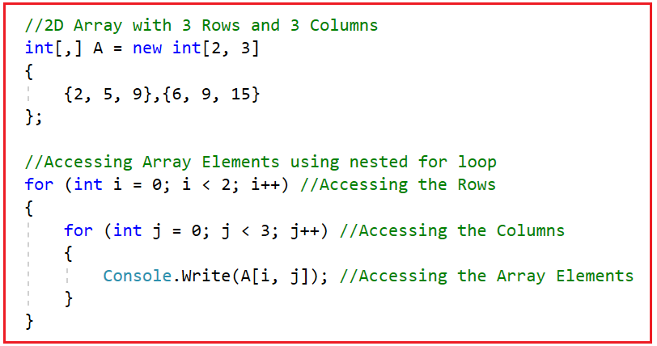
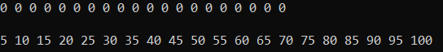
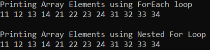
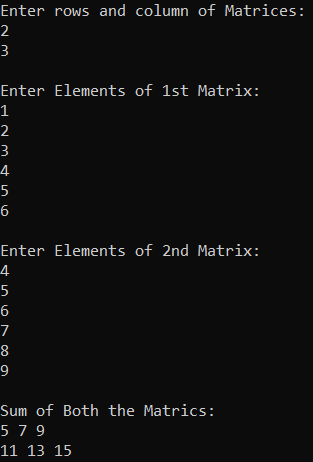
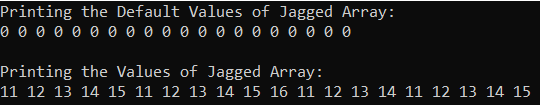

## **آرایه‌های دوبعدی در سی شارپ به همراه مثال**

در این مقاله، قصد دارم **آرایه‌های دوبعدی در سی‌شارپ را** با مثال‌هایی مورد بحث قرار دهم. لطفاً قبل از ادامه این مقاله، مقاله قبلی ما را که در آن آرایه‌های یک‌بعدی در سی‌شارپ را با مثال‌هایی مورد بحث قرار دادیم، مطالعه کنید.

##### **آرایه دو بعدی در سی شارپ چیست؟**

آرایه‌هایی که عناصر را به شکل سطر و ستون ذخیره می‌کنند، در سی شارپ آرایه دو بعدی نامیده می‌شوند. آرایه دو بعدی که آرایه چند بعدی نیز نامیده می‌شود، در سی شارپ دو نوع دارد. آنها به شرح زیر هستند:

1. **آرایه مستطیلی** : آرایه‌ای که تعداد سطرها و ستون‌های آن برابر باشد، آرایه مستطیلی نامیده می‌شود.
2. **آرایه دندانه‌دار (Jagged Array)** : آرایه‌ای که تعداد سطرها و ستون‌های آن با هم برابر نباشد، آرایه دندانه‌دار نامیده می‌شود.

##### **آرایه‌های دوبعدی مستطیلی در سی شارپ:**

یک آرایه دوبعدی، آرایه‌ای است که در آن به هر عنصر با دو اندیس اشاره می‌شود. عنصر در آرایه دوبعدی به شکل ماتریس ذخیره می‌شود. اندیس اول سطر ماتریس و اندیس دوم ستون ماتریس را نشان می‌دهد.

**مثال: int[,] matrix = new int[3,3];**

نمایش آرایه دوبعدی در حافظه در زیر نشان داده شده است. برای دسترسی به عناصر در اندیس صفر، باید دو اندیس matrix[0][0] را مشخص کنیم.



##### **نحوه ایجاد و دسترسی به آرایه دوبعدی در سی شارپ**

روش ایجاد یک آرایه دوبعدی مستطیلی به شرح زیر است:  
**‎int[,] A = ‎new int[3,4]‎; ;‎‏‎ ‎ ...**  
اگر آن را به این صورت ایجاد کنیم، آرایه دوبعدی با ۳ سطر و ۴ ستون ایجاد می‌شود که نام آرایه A است. برای درک بهتر، لطفاً به نمودار زیر نگاهی بیندازید.



در اینجا، j نشان دهنده شماره ردیف و i نشان دهنده شماره ستون است. همانطور که آرایه را با اندازه‌های ۳ و ۴ ایجاد کردیم، در اینجا می‌توانید ببینید که آرایه با ۳ ردیف و ۴ ستون ایجاد شده است. می‌توانیم به هر عنصری با شماره ردیف و ستون به صورت زیر دسترسی پیدا کنیم:  
**خط نوشتن کنسول (A[1,2]);**  
این یعنی ردیف دوم و ستون سوم به عنوان آرایه اندیس‌گذاری شده، اندیس‌هایی مبتنی بر ۰ هستند.

**نکته:** اندیس‌گذاری در آرایه از ۰ به بعد شروع می‌شود. بنابراین، ما سطر و ستون را از ۰ شروع کرده‌ایم. به این ترتیب می‌توانیم به هر مکانی دسترسی داشته باشیم. آدرس‌دهی آرایه دوبعدی مانند آرایه تک‌بعدی نگاشت می‌شود.



مکان‌های حافظه به طور مداوم در کنار هم اختصاص داده می‌شوند. بنابراین اساساً، یک آرایه تک بعدی با اندازه ۱۲ ایجاد می‌شود که در آن چهار مکان اول به عنوان ردیف‌های اول، چهار مکان دوم به عنوان ردیف دوم و چهار مکان باقی مانده به عنوان ردیف سوم استفاده می‌شوند. بنابراین، در یک کامپیوتر، حافظه به صورت زیر نمایش داده می‌شود:



اما کامپایلر به ما اجازه می‌دهد تا به این آرایه تک‌بعدی به عنوان یک آرایه دوبعدی دسترسی داشته باشیم. در ادامه، نحوه ایجاد و مقداردهی اولیه یک آرایه دوبعدی را بررسی خواهیم کرد.

##### **مقداردهی اولیه آرایه دو بعدی در سی شارپ:**

بیایید با یک مثال نحوه مقداردهی اولیه یک آرایه دوبعدی را درک کنیم. لطفاً به دستور زیر که اعلان و مقداردهی اولیه یک آرایه دوبعدی را نشان می‌دهد، نگاهی بیندازید.  
**‎int[,] A = {{2, 5, 9},{6, 9, 15}};‎‏‎ ...**  
این اعلان + مقداردهی اولیه یک آرایه دوبعدی در سی شارپ است. در اینجا ۲،۵،۹ ردیف اول و ۶،۹،۱۵ ردیف دوم هستند. اینگونه پر می‌شوند و می‌توانیم با کمک دو اندیس که شماره ردیف و شماره ستون هستند به هر عنصر دسترسی پیدا کنیم. حال، روش دیگر مقداردهی اولیه آن به صورت زیر است:  
**عدد صحیح[,] A = عدد صحیح جدید[2,3]**  
**{**  
**{۲، ۵، ۹}،{۶، ۹، ۱۵}**  
**};**  
در بخش بعدی این مقاله، نحوه مقداردهی اولیه آرایه دوبعدی به صورت پویا در سی شارپ را بررسی خواهیم کرد. تصویر زیر نحوه مقداردهی اولیه آرایه مستطیلی دوبعدی را در سی شارپ نشان می‌دهد.



در ادامه، نحوه دسترسی به عناصر آرایه دوبعدی را بررسی خواهیم کرد.

##### **دسترسی به عناصر آرایه دوبعدی در سی شارپ:**

برای دسترسی به تمام عناصر آرایه دوبعدی مستطیلی در سی شارپ، به یک حلقه for تودرتو نیاز داریم، یکی برای دسترسی به سطرها و دیگری برای دسترسی به ستون‌ها. بنابراین، با استفاده از یک حلقه for تودرتو می‌توانیم به عناصر آرایه دوبعدی دسترسی پیدا کنیم. برای درک بهتر، لطفاً به تصویر زیر نگاهی بیندازید.



##### **مثال برای درک آرایه دوبعدی در سی شارپ:**

بیایید برای درک بهتر آرایه دوبعدی مستطیلی در سی شارپ، مثالی بزنیم. در مثال زیر، ما یک آرایه عدد صحیح دوبعدی با ۴ سطر و ۵ ستون ایجاد می‌کنیم. سپس با استفاده از حلقه for each، مقادیر آرایه دوبعدی را چاپ می‌کنیم تا ببینیم چه مقادیر پیش‌فرضی را ذخیره می‌کند. سپس با استفاده از حلقه for تودرتو، مقادیر را به آرایه دوبعدی اختصاص می‌دهیم و همچنین مقادیر آرایه دوبعدی را چاپ می‌کنیم. در مثال زیر، ما از متد GetLength کلاس Array استفاده می‌کنیم، وقتی ۰ را به آن ارسال می‌کنیم، اندازه سطرها و وقتی ۱ را به آن ارسال می‌کنیم، اندازه ستون‌ها را برمی‌گرداند.

```csharp
using System;

namespace TwoDimensionalArayDemo
{
    class Program
    {
        static void Main(string[] args)
        {
            // Creating a 2D Array with 4 Rows and 5 Columns
            int[,] RectangleArray = new int[4, 5];
            int a = 0;

            // Printing the values of 2D array using foreach loop
            // It will print the default values as we are not assigning
            // any values to the array
            foreach (int i in RectangleArray)
            {
                Console.Write(i + " ");
            }
            Console.WriteLine("\n");

            // Assigning values to the 2D array by using nested for loop
            // arr.GetLength(0): Returns the size of the Row
            // arr.GetLength(1): Returns the size of the Column
            for (int i = 0; i < RectangleArray.GetLength(0); i++)
            {
                for (int j = 0; j < RectangleArray.GetLength(1); j++)
                {
                    a += 5;
                    RectangleArray[i, j] = a;
                }
            }

            // Printing the values of array by using nested for loop
            // arr.GetLength(0): Returns the size of the Row
            // arr.GetLength(1): Returns the size of the Column
            for (int i = 0; i < RectangleArray.GetLength(0); i++)
            {
                for (int j = 0; j < RectangleArray.GetLength(1); j++)
                {
                    Console.Write(RectangleArray[i, j] + " ");
                }
            }
            Console.ReadKey();
        }
    }
}
```

###### **خروجی:**



در مثال بالا، عناصر آرایه دوبعدی را با استفاده از حلقه for تودرتو مقداردهی کردیم. همچنین این امکان وجود دارد که مقادیر را در زمان تعریف یک آرایه دوبعدی در سی شارپ به آن اختصاص دهیم.

##### **اعلان و مقداردهی اولیه آرایه دوبعدی در یک دستور:**

در مثال زیر، ما در زمان اعلان آرایه دوبعدی، مقادیری را به آن اختصاص می‌دهیم. در اینجا، نیازی به مشخص کردن اندازه نداریم، زیرا بر اساس مقادیر آرگومان، آرایه به طور خودکار اندازه را انتخاب می‌کند. در اینجا، آرایه با اندازه ۳ سطر و ۴ ستون ایجاد می‌شود. سپس، عناصر آرایه را با استفاده از حلقه ForEach و حلقه for تودرتو چاپ کردیم. در حلقه for تودرتو، متغیر حلقه i در حلقه for اول به سطرها اشاره می‌کند و در حلقه for دوم، متغیر حلقه I به ستون‌های آرایه دوبعدی اشاره می‌کند.

```csharp
using System;

namespace TwoDimensionalArayDemo
{
    class Program
    {
        static void Main(string[] args)
        {
            // Assigning the Array Elements at the time of declaration
            // Row Size: 3
            // Column Size: 4
            int[,] NumbersArray = {{11,12,13,14},
                          {21,22,23,24},
                          {31,32,33,34}};

            // Printing Array Elements using for each loop
            Console.WriteLine("Printing Array Elements using ForEach loop");
            foreach (int i in NumbersArray)
            {
                Console.Write(i + " ");
            }

            // Printing Array Elements using nested for each
            Console.WriteLine("\n\nPrinting Array Elements using Nested For Loop");
            for (int i = 0; i < NumbersArray.GetLength(0); i++)
            {
                for (int j = 0; j < NumbersArray.GetLength(1); j++)
                {
                    Console.Write(NumbersArray[i, j] + " ");
                }
            }

            Console.ReadKey();
        }
    }
}
```

###### **خروجی:**



##### **برنامه جمع دو ماتریس با استفاده از سی شارپ:**

```csharp
using System;

namespace TwoDimensionalArayDemo
{
    class Program
    {
        static void Main(string[] args)
        {
            Console.WriteLine("Enter rows and column of Matrices: ");
            int Rows = Convert.ToInt32(Console.ReadLine());
            int Columns = Convert.ToInt32(Console.ReadLine());

            //Create 3 2D Arrays with the above size
            int[,] Matrix1 = new int[Rows, Columns];
            int[,] Matrix2 = new int[Rows, Columns];
            int[,] ResultMatrix = new int[Rows, Columns];

            //Enter Matrix 1 Elements
            Console.WriteLine("\nEnter Elements of 1st Matrix:");
            for (int i = 0; i < Rows; i++)
            {
                for (int j = 0; j < Columns; j++)
                {
                    Matrix1[i, j] = Convert.ToInt32(Console.ReadLine());
                }
            }

            //Enter Matrix 2 Elements
            Console.WriteLine("\nEnter Elements of 2nd Matrix:");
            for (int i = 0; i < Rows; i++)
            {
                for (int j = 0; j < Columns; j++)
                {
                    Matrix2[i, j] = Convert.ToInt32(Console.ReadLine());
                }
            }

            //Adding Both Matrix Elements and Store the Result in ResultMatrix
            Console.WriteLine("\nSum of Both the Matrics:");
            for (int i = 0; i < 2; i++)
            {
                for (int j = 0; j < 3; j++)
                {
                    ResultMatrix[i,j] = Matrix1[i,j] + Matrix2[i,j];

                    Console.Write($"{ResultMatrix[i, j]} ");
                }
                Console.WriteLine();
            }

            Console.ReadKey();
        }
    }
}
```

###### **خروجی:**



##### **آرایه دندانه‌دار (Jagged array) در سی شارپ:**

اینها نیز آرایه‌های دوبعدی هستند که داده‌ها را به شکل سطر و ستون ذخیره می‌کنند. اما در اینجا، در آرایه دندانه‌دار، اندازه ستون از سطری به سطر دیگر متفاوت خواهد بود. این بدان معناست که اگر سطر اول شامل ۵ ستون باشد، سطر دوم ممکن است شامل ۴ ستون باشد در حالی که سطر سوم ممکن است شامل ۱۰ ستون باشد. بنابراین، نکته‌ای که باید به خاطر داشته باشید این است که اگر اندازه ستون از سطری به سطر دیگر متفاوت باشد، آن آرایه دندانه‌دار است. اگر اندازه ستون برای همه سطرها یکسان باقی بماند، آن آرایه دوبعدی مستطیلی است.

آرایه ناهموار در سی شارپ، آرایه آرایه‌ها نیز نامیده می‌شود. دلیل این امر این است که در مورد آرایه ناهموار، هر سطر یک آرایه تک بعدی است. بنابراین، ترکیبی از چندین آرایه تک بعدی با اندازه ستون‌های مختلف، یک آرایه ناهموار در سی شارپ را تشکیل می‌دهد.

**نحو: <type> [][] <name> = new <type> [rows][];**  
**مثال:**  
**عدد صحیح [][] arr = new عدد صحیح [3][];**  
**//یا**  
**‎int [][] arr = {لیست مقادیر};‎**

برای تعریف یک آرایه دندانه‌دار (jagged array) در سی‌شارپ، در زمان تعریف آن، فقط باید تعداد ردیف‌هایی را که می‌خواهید در آرایه باشند، مشخص کنید. برای مثال  
**عدد صحیح [][] arr = new عدد صحیح [4][];**

در اعلان آرایه بالا، ما مشخص می‌کنیم که می‌خواهیم چهار ردیف در آرایه داشته باشیم. پس از مشخص کردن تعداد ردیف‌های مورد نظر در آرایه، باید هر ردیف را با تعداد ستون‌ها با استفاده از یک آرایه تک‌بعدی، همانطور که در زیر نشان داده شده است، مقداردهی اولیه کنید.  
**arr[0] = new int[5];** // می‌خواهیم پنج ستون در ردیف اول داشته باشیم  
**arr[1] = new int[6];** // می‌خواهیم شش ستون در ردیف اول داشته باشیم  
**arr[2] = new int[4];** // ما چهار ستون در ردیف اول می‌خواهیم  
**arr[3] = new int[5];** // می‌خواهیم پنج ستون در ردیف اول داشته باشیم

##### **مثال برای درک آرایه‌های ناهموار (Jagged Array) در سی شارپ:**

آرایه‌های دندانه‌دار (Jagged Arrays) در سی‌شارپ چیزی جز ترکیب چندین آرایه یک‌بعدی نیستند. در مثال زیر، ما یک آرایه دندانه‌دار با ۴ ردیف ایجاد کرده‌ایم و سپس هر ردیف از آرایه دندانه‌دار را با آرایه‌های یک‌بعدی مختلف مقداردهی اولیه کرده‌ایم. سپس مقادیر پیش‌فرض آرایه دندانه‌دار را با استفاده از حلقه for تودرتو چاپ کرده‌ایم و سپس آرایه دندانه‌دار را با استفاده از حلقه for تودرتو مقداردهی اولیه کرده‌ایم. و در نهایت، پس از مقداردهی اولیه آرایه دندانه‌دار، عناصر یک آرایه دندانه‌دار را با استفاده از یک حلقه for و برای هر حلقه چاپ کرده‌ایم.

```csharp
using System;

namespace TwoDimensionalArayDemo
{
    class Program
    {
        static void Main(string[] args)
        {
            // Creating An jagged array with four Rows
            int[][] arr = new int[4][];

            // Initializing each row with different column size
            // Uisng one dimensional array
            arr[0] = new int[5];
            arr[1] = new int[6];
            arr[2] = new int[4];
            arr[3] = new int[5];

            // Printing the values of Jagged array using nested for loop
            // It will print the default values as we are not assigning any
            // values to the array
            // GetLength(0): Returns the Size of the Rows (4)
            Console.WriteLine("Printing the Default Values of Jagged Array:");
            for (int i = 0; i < arr.GetLength(0); i++)
            {
                // arr[i].Length: Returns the Length of Each Row
                for (int j = 0; j < arr[i].Length; j++)
                {
                    Console.Write(arr[i][j] + " ");
                }
            }
            
            // Assigning values to the Jagged array by using nested for loop
            for (int i = 0; i < arr.GetLength(0); i++)
            {
                int num = 10;
                for (int j = 0; j < arr[i].Length; j++)
                {
                    num++;
                    arr[i][j] = num;
                }
            }

            // Printing the values of Jagged array by using foreach loop within for loop
            Console.WriteLine("\n\nPrinting the Values of Jagged Array:");
            for (int i = 0; i < arr.GetLength(0); i++)
            {
                foreach (int x in arr[i])
                {
                    Console.Write(x + " ");
                }
            }

            // You cannot simply use a foreach loop to Print the Values of a foreach loop
            // foreach (var item in arr)
            // {
            //     Console.Write(item);
            // }
            Console.ReadKey();
        }
    }
}
```

###### **خروجی:**

