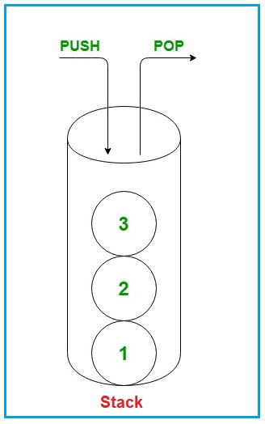
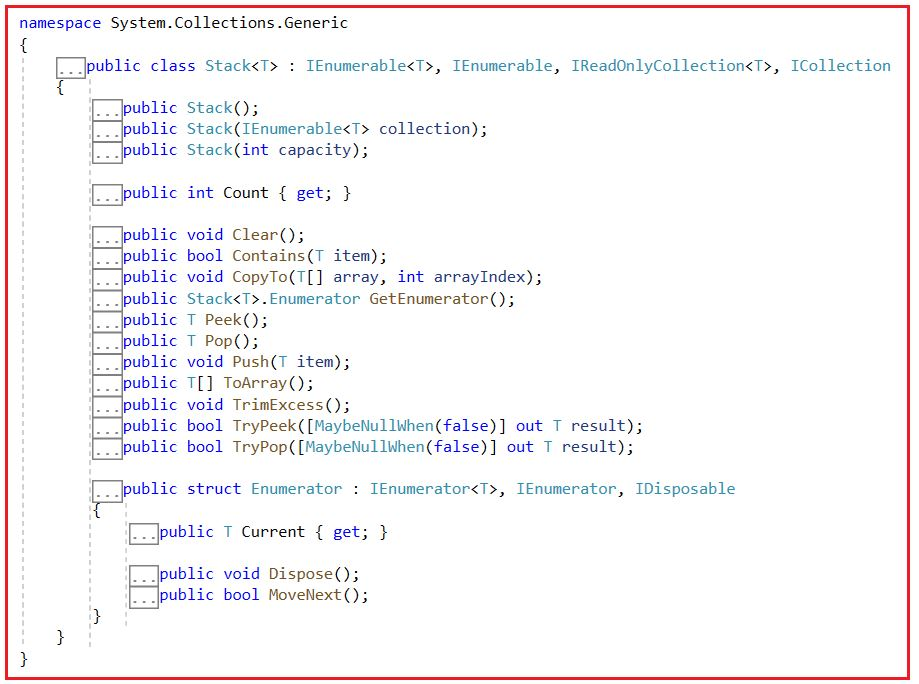
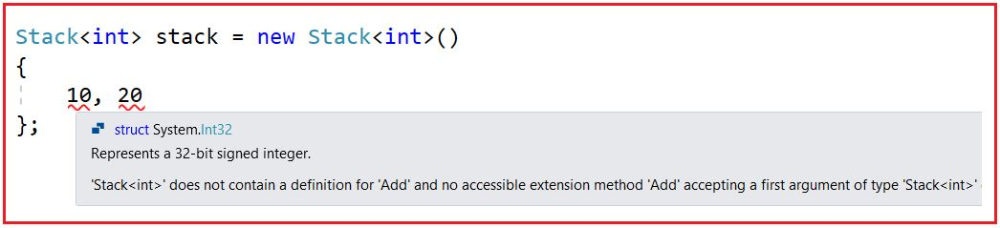
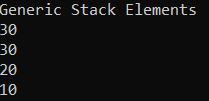
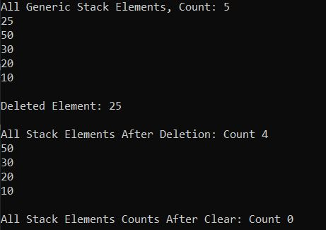
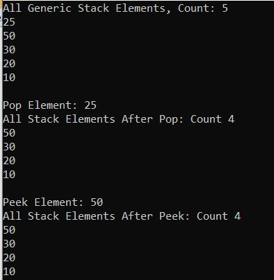
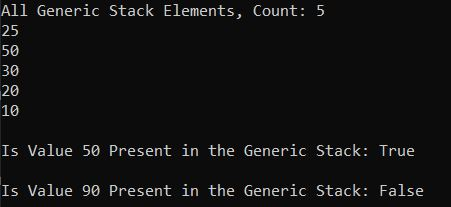
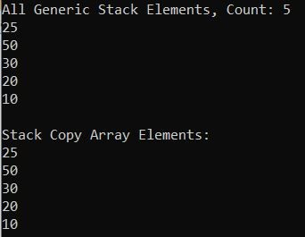
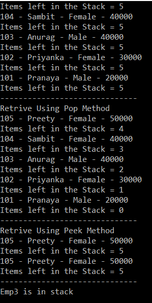

## **کلاس مجموعه عمومی Stack<T> در سی شارپ به همراه مثال**

در این مقاله، قصد دارم **کلاس مجموعه Generic Stack<T> را در C#** با مثال‌هایی مورد بحث قرار دهم. لطفاً مقاله قبلی ما را که در آن تفاوت بین List و Dictionary در C# را با مثال‌هایی مورد بحث قرار دادیم، بخوانید. Stack<T> یک مجموعه Generic است که عناصر را به سبک LIFO (آخرین ورودی، اولین خروجی) ذخیره می‌کند. C# شامل هر دو کلاس مجموعه Generic Stack<T> و Non-Generic Stack است. مایکروسافت توصیه می‌کند از مجموعه Generic Stack<T> استفاده کنید زیرا از نظر نوع ایمن است و نیازی به boxing و unboxing ندارد. در اینجا در این مقاله، کلاس مجموعه Generic Stack را در C# با مثال‌هایی مورد بحث قرار خواهیم داد. در پایان این مقاله، نکات زیر را خواهید فهمید.

1. **Generic Stack<T> در سی شارپ چیست؟**
2. **چگونه یک مجموعه عمومی Stack<T> در سی شارپ ایجاد کنیم؟**
3. **چگونه عناصر را به یک مجموعه Stack<T> در سی شارپ اضافه کنیم؟**
4. **چگونه به یک مجموعه Generic Stack<T> در C# دسترسی پیدا کنیم؟**
5. **چگونه عناصر را از یک مجموعه عمومی Stack<T> در C# حذف کنیم؟**
6. **چگونه بالاترین عنصر یک پشته عمومی را در C# بدست آوریم؟**
7. **تفاوت بین متدهای Pop() و Peek() چیست؟**
8. **چگونه بررسی کنیم که آیا یک عنصر در مجموعه Generic Stack<T> در C# وجود دارد یا خیر؟**
9. **چگونه یک Generic Stack را در C# به یک آرایه موجود کپی کنیم؟**
10. **کلاس مجموعه پشته عمومی در سی شارپ با نوع پیچیده**
11. **پشته عمومی در مقابل پشته غیر عمومی در سی شارپ**

##### **Generic Stack<T> در سی شارپ چیست؟**

پشته عمومی در سی شارپ یک کلاس مجموعه است که بر اساس اصل آخرین ورودی، اولین خروجی (LIFO) کار می‌کند و این کلاس در فضای نام System.Collections.Generic وجود دارد. مجموعه پشته عمومی زمانی استفاده می‌شود که به دسترسی به آیتم‌ها بر اساس آخرین ورودی، اولین خروجی (LIFO) نیاز داریم.

این کلاس مجموعه Stack مشابه یک پشته از کتاب‌ها است. برای مثال، اگر بخواهیم یک کتاب جدید به پشته کتاب‌ها اضافه کنیم، آن را فقط روی تمام کتاب‌های موجود قرار می‌دهیم. به طور مشابه، اگر بخواهیم کتابی را از پشته حذف کنیم، فقط کتابی را که آخرین بار اضافه کرده‌ایم حذف می‌کنیم. برای درک بهتر، لطفاً به تصویر زیر نگاهی بیندازید.


کلاس مجموعه پشته نیز به روشی مشابه عمل می‌کند. آخرین آیتمی که به پشته اضافه (push) می‌شود، اولین آیتمی است که از پشته حذف (pop) می‌شود. وقتی یک عنصر را به پشته اضافه می‌کنیم، به آن push کردن عنصر و وقتی یک عنصر را از پشته حذف می‌کنیم، به آن pop کردن عنصر می‌گویند. برای درک بهتر، لطفاً به تصویر زیر نگاهی بیندازید.



ظرفیت یک پشته (Stack) تعداد عناصری است که پشته می‌تواند در خود نگه دارد. با اضافه شدن عناصر به پشته، ظرفیت آن به طور خودکار افزایش می‌یابد. در مجموعه پشته‌های عمومی (Generic Stack Collection)، می‌توانیم عناصر تکراری را ذخیره کنیم. یک پشته همچنین می‌تواند مقدار null را به عنوان یک مقدار معتبر برای انواع مرجع بپذیرد.

##### **متدها، ویژگی‌ها و سازنده‌های کلاس Generic Stack<T> Collection در سی شارپ:**

اگر به تعریف کلاس Generic Stack<T> Collection بروید، موارد زیر را مشاهده خواهید کرد. همانطور که می‌بینید، کلاس Generic Stack رابط‌های IEnumerable<T>، IEnumerable، IReadOnlyCollection<T> و ICollection را پیاده‌سازی می‌کند.



##### **چگونه یک مجموعه عمومی Stack<T> در سی شارپ ایجاد کنیم؟**

کلاس Generic Collection Stack<T> در سی شارپ، سه سازنده زیر را برای ایجاد یک نمونه از کلاس Generic Stack<T> ارائه می‌دهد.

1. **Stack():** برای مقداردهی اولیه یک نمونه جدید از کلاس Generic Stack که خالی است و ظرفیت اولیه پیش‌فرض را دارد، استفاده می‌شود.
2. **Stack(IEnumerable<T> collection):** برای مقداردهی اولیه یک نمونه جدید از کلاس Generic Stack استفاده می‌شود که شامل عناصر کپی شده از مجموعه مشخص شده است و ظرفیت کافی برای جای دادن تعداد عناصر کپی شده را دارد. در اینجا، پارامترهای collection، مجموعه ای را که باید عناصر از آن کپی شوند، مشخص می‌کنند. اگر مجموعه null باشد، ArgumentNullException رخ می‌دهد.
3. **Stack(int capacity):** برای مقداردهی اولیه یک نمونه جدید از کلاس Generic Stack که خالی است و ظرفیت اولیه مشخص شده یا ظرفیت اولیه پیش‌فرض را دارد، هر کدام که بیشتر باشد، استفاده می‌شود. در اینجا، پارامتر capacity تعداد اولیه عناصری را که Stack می‌تواند در خود جای دهد، مشخص می‌کند. اگر capacity کمتر از صفر باشد، خطای ArgumentOutOfRangeException رخ می‌دهد.

بیایید ببینیم چگونه می‌توان با استفاده از سازنده‌ی Stack() یک نمونه از Generic Stack ایجاد کرد:

**مرحله ۱:**  
از آنجایی که کلاس Generic Stack<T> متعلق به فضای نام System.Collections.Generic است، بنابراین ابتدا باید فضای نام System.Collections.Generic را به صورت زیر در برنامه خود وارد کنیم:  
**با استفاده از System.Collections.Generic؛**

**مرحله ۲:**  
در مرحله بعد، باید با استفاده از سازنده Stack() به صورت زیر یک نمونه از کلاس Generic Stack ایجاد کنیم:  
**Stack<type> stack = new Stack<type>();**  
در اینجا، نوع می‌تواند هر نوع داده‌ی داخلی مانند int، double یا string یا هر نوع داده‌ی تعریف‌شده توسط کاربر مانند Customer، Employee، Product و غیره باشد.

##### **چگونه عناصر را به یک مجموعه Stack<T> در سی شارپ اضافه کنیم؟**

اگر می‌خواهید عناصری را به یک مجموعه عمومی پشته در سی شارپ اضافه کنید، باید از متد Push() زیر از کلاس Stack<T> استفاده کنید.

1. **Push(T item):** از متد Push(T item) برای درج یک عنصر در بالای پشته (Stack) استفاده می‌شود. در اینجا، پارامتر item عنصری را که باید به پشته اضافه شود، مشخص می‌کند. مقدار می‌تواند برای یک نوع مرجع null باشد، یعنی وقتی T یک نوع مرجع است، می‌توانیم null را به پشته اضافه کنیم.

برای مثال،  
**Stack<int>stack = Stack جدید<int>();**  
دستور بالا یک پشته عمومی از انواع عدد صحیح ایجاد می‌کند. بنابراین، در اینجا فقط می‌توانیم عناصر از نوع عدد صحیح را روی پشته قرار دهیم. اگر سعی کنیم چیزی غیر از عدد صحیح را قرار دهیم، با خطای زمان کامپایل مواجه خواهیم شد.  
**پشته.فشار دادن(10)؛**  
**پشته.فشار دادن(20)؛**  
**stack.Push(“Hell0”);** **//خطای زمان کامپایل**

**نکته:** ما نمی‌توانیم با استفاده از Collection Initializer عناصر را به Stack اضافه کنیم و دلیل این امر این است که کلاس Generic Stack<T> Collection متد Add ندارد. بنابراین، نکته‌ای که باید به خاطر داشته باشید این است که اگر هر کلاس collection متد Add را نداشته باشد، نمی‌توانید از Collection Initializer برای اضافه کردن عناصر استفاده کنید. اگر این کار را امتحان کنید، همانطور که در تصویر زیر نشان داده شده است، خطای زمان کامپایل دریافت خواهید کرد.



##### **چگونه به یک مجموعه Generic Stack<T> در C# دسترسی پیدا کنیم؟**

ما می‌توانیم با استفاده از حلقه for each به صورت زیر به تمام عناصر مجموعه Generic Stack<T> در سی شارپ دسترسی پیدا کنیم.  
**foreach (مورد متغیر در پشته)**  
**{**  
**خط نوشتن کنسول (مورد)؛**  
**}**

**نکته:** شما نمی‌توانید از حلقه for برای دسترسی به عناصر یک مجموعه پشته عمومی استفاده کنید و دلیل این امر این است که کلاس مجموعه Generic Stack<T> هیچ اندیس‌گذار عدد صحیحی ندارد.

##### **مثالی برای درک نحوه ایجاد یک پشته عمومی و اضافه کردن عناصر در سی شارپ:**

برای درک بهتر نحوه ایجاد یک Generic Stack، نحوه اضافه کردن عناصر به یک stack و نحوه دسترسی به همه عناصر یک stack در C#، لطفاً به مثال زیر نگاهی بیندازید.

```csharp
using System;
using System.Collections.Generic;

namespace GenericStackCollection
{
    public class Program
    {
        public static void Main()
        {
            Stack<int> stack = new Stack<int>();
            stack.Push(10);
            stack.Push(20);
            stack.Push(30);

            //Adding Duplicate
            stack.Push(30);

            //As int is not a Reference type so null can not be accepted by this stack
            //stack.Push(null); //Compile-Time Error

            //As the stack is integer type, so string values can not be accepted
            //stack.Push("Hell0"); //Compile-Time Error

            Console.WriteLine("Generic Stack Elements");
            foreach (var item in stack)
            {
                Console.WriteLine(item);
            }

            Console.ReadKey();
        }
    } 
}
```

###### **خروجی:**



##### **چگونه عناصر را از یک مجموعه عمومی Stack<T> در C# حذف کنیم؟**

در Stack، ما فقط مجاز به حذف عناصر از بالای stack هستیم. کلاس Generic Stack Collection در C# دو روش زیر را برای حذف عناصر ارائه می‌دهد.

1. **Pop():** این متد برای حذف و بازگرداندن شیء در بالای پشته عمومی استفاده می‌شود. این متد شیء (عنصر) حذف شده از بالای پشته را برمی‌گرداند.
2. **Clear():** این متد برای حذف تمام اشیاء از Generic Stack استفاده می‌شود.

بیایید مثالی برای درک متدهای Pop و Clear از کلاس Generic Stack<T> Collection در سی شارپ ببینیم. لطفاً به مثال زیر که نحوه استفاده از متد Pop و Clear را نشان می‌دهد، نگاهی بیندازید.

```csharp
using System;
using System.Collections.Generic;

namespace GenericStackCollection
{
    public class Program
    {
        public static void Main()
        {
            //Creating a Generic Stack to Store Intger Elements
            Stack<int> genericStack = new Stack<int>();

            //Pushing Elements to the Stack using Push Method
            genericStack.Push(10);
            genericStack.Push(20);
            genericStack.Push(30);
            genericStack.Push(50);
            genericStack.Push(25);

            //Printing the Stack Elements using Foreach loop
            Console.WriteLine($"All Generic Stack Elements, Count: {genericStack.Count}");
            foreach (var element in genericStack)
            {
                Console.WriteLine(element);
            }

            // Removing and Returning an Element from the Generic Stack using Pop method
            Console.WriteLine($"\nDeleted Element: {genericStack.Pop()}");
            
            //Printing Elements After Removing the Last Added Element
            Console.WriteLine($"\nAll Stack Elements After Deletion: Count {genericStack.Count}");
            foreach (var element in genericStack)
            {
                Console.WriteLine($"{element} ");
            }

            //Removing All Elements from Generic Stack using Clear Method
            genericStack.Clear();
            Console.WriteLine($"\nAll Stack Elements Counts After Clear: Count {genericStack.Count}");
                
            Console.ReadKey();
        }
    } 
}
```

###### **خروجی:**



##### **چگونه بالاترین عنصر یک پشته عمومی را در C# بدست آوریم؟**

کلاس Generic Stack در سی شارپ دو متد زیر را برای دریافت بالاترین عنصر Stack ارائه می‌دهد.

1. **Pop():** این متد برای حذف و بازگرداندن شیء در بالای Generic Stack استفاده می‌شود. این متد شیء (عنصر) حذف شده از بالای Stack را برمی‌گرداند. اگر هیچ شیء (یا عنصری) در پشته وجود نداشته باشد و اگر سعی دارید یک آیتم یا شیء را با استفاده از متد pop() از پشته حذف کنید، آنگاه یک استثنا به نام System.InvalidOperationException ایجاد می‌کند.
2. **Peek():** این متد برای برگرداندن شیء در بالای Generic Stack بدون حذف آن استفاده می‌شود. اگر هیچ شیء (یا عنصری) در پشته وجود نداشته باشد و اگر سعی دارید یک آیتم (شی) را از پشته با استفاده از متد peek() برگردانید، آنگاه یک استثنا به نام System.InvalidOperationException ایجاد می‌شود.

برای درک بهتر، لطفاً به مثال زیر نگاهی بیندازید که نحوه دریافت بالاترین عنصر از پشته را نشان می‌دهد.

```csharp
using System;
using System.Collections.Generic;

namespace GenericStackCollection
{
    public class Program
    {
        public static void Main()
        {
            //Creating a Generic Stack to Store Intger Elements
            Stack<int> genericStack = new Stack<int>();

            //Pushing Elements to the Stack using Push Method
            genericStack.Push(10);
            genericStack.Push(20);
            genericStack.Push(30);
            genericStack.Push(50);
            genericStack.Push(25);

            //Printing the Stack Elements using Foreach loop
            Console.WriteLine($"All Generic Stack Elements, Count: {genericStack.Count}");
            foreach (var element in genericStack)
            {
                Console.WriteLine(element);
            }

            // Removing and Returning an Element from the Generic Stack using Pop method
            Console.WriteLine($"\nPop Element: {genericStack.Pop()}");
            
            //Printing Elements After Removing the Last Added Element
            Console.WriteLine($"All Stack Elements After Pop: Count {genericStack.Count}");
            foreach (var element in genericStack)
            {
                Console.WriteLine($"{element} ");
            }

            // Returning an Element from the Generic Stack using Peek method without Removing
            Console.WriteLine($"\nPeek Element: {genericStack.Peek()}");

            //Printing Elements After Peek the Last Added Element
            Console.WriteLine($"All Stack Elements After Peek: Count {genericStack.Count}");
            foreach (var element in genericStack)
            {
                Console.WriteLine($"{element} ");
            }

            Console.ReadKey();
        }
    } 
}
```

###### **خروجی:**



##### **تفاوت بین متدهای Pop() و Peek() چیست؟**

متد Pop() آیتم بالای پشته را حذف کرده و برمی‌گرداند، در حالی که متد Peek() آیتم بالای پشته را بدون حذف آن برمی‌گرداند. این تنها تفاوت بین این دو متد از کلاس Stack در C# است.

##### **چگونه بررسی کنیم که آیا یک عنصر در مجموعه Generic Stack<T> در C# وجود دارد یا خیر؟**

اگر می‌خواهید بررسی کنید که آیا یک عنصر در مجموعه Generic Stack<T> وجود دارد یا خیر، باید از متد Contains() که توسط کلاس Generic Stack در C# ارائه شده است، استفاده کنید. حتی می‌توانید از این متد برای جستجوی یک عنصر در پشته داده شده نیز استفاده کنید.

1. **Contains(T item):** متد Contains(T item) برای تعیین وجود یا عدم وجود یک عنصر در پشته عمومی استفاده می‌شود. اگر عنصر در پشته عمومی یافت شود، مقدار true و در غیر این صورت، مقدار false را برمی‌گرداند. در اینجا، پارامتر item عنصری را که باید در پشته قرار گیرد، مشخص می‌کند. مقدار می‌تواند برای یک نوع مرجع null باشد.

بیایید متد Contains(T item) را با یک مثال درک کنیم. مثال زیر نحوه استفاده از متد Contains() از کلاس Generic Stack Collection در سی شارپ را نشان می‌دهد.

```csharp
using System;
using System.Collections.Generic;

namespace GenericStackCollection
{
    public class Program
    {
        public static void Main()
        {
            //Creating a Generic Stack to Store Intger Elements
            Stack<int> genericStack = new Stack<int>();

            //Pushing Elements to the Stack using Push Method
            genericStack.Push(10);
            genericStack.Push(20);
            genericStack.Push(30);
            genericStack.Push(50);
            genericStack.Push(25);

            //Printing the Stack Elements using Foreach loop
            Console.WriteLine($"All Generic Stack Elements, Count: {genericStack.Count}");
            foreach (var element in genericStack)
            {
                Console.WriteLine(element);
            }

            Console.WriteLine($"\nIs Value 50 Present in the Generic Stack: {genericStack.Contains(50)}");
            Console.WriteLine($"\nIs Value 90 Present in the Generic Stack: {genericStack.Contains(90)}");

            Console.ReadKey();
        }
    } 
}
```

###### **خروجی:**



**نکته:** متد Contains(T item) از کلاس Generic Stack زمان O(n) را برای بررسی وجود عنصر در پشته صرف می‌کند. این نکته باید هنگام استفاده از این متد در نظر گرفته شود.

##### **چگونه یک Generic Stack را در C# به یک آرایه موجود کپی کنیم؟**

برای کپی کردن یک Generic Stack به یک آرایه موجود در C#، باید از متد CopyTo زیر از کلاس Generic Stack Collection استفاده کنیم.

1. **CopyTo(T[] array, int arrayIndex):** این متد برای کپی کردن عناصر Stack به یک آرایه تک بعدی موجود، با شروع از اندیس آرایه مشخص شده، استفاده می‌شود. در اینجا، پارامتر array، آرایه تک بعدی را مشخص می‌کند که مقصد عناصر کپی شده از پشته عمومی است. آرایه باید دارای اندیس گذاری مبتنی بر صفر باشد. پارامتر arrayIndex، اندیس مبتنی بر صفر را در آرایه‌ای که کپی از آن شروع می‌شود، مشخص می‌کند. اگر پارامتر array تهی باشد، خطای ArgumentNullException رخ می‌دهد. اگر اندیس پارامتر کمتر از صفر باشد، خطای ArgumentOutOfRangeException رخ می‌دهد. اگر تعداد عناصر موجود در پشته عمومی منبع بیشتر از فضای موجود از arrayIndex تا انتهای آرایه مقصد باشد، خطای ArgumentException رخ می‌دهد.

این متد روی آرایه‌های تک‌بعدی کار می‌کند و وضعیت پشته عمومی را تغییر نمی‌دهد. عناصر در آرایه به همان ترتیبی که ترتیب عناصر از ابتدای پشته تا انتهای آن است، مرتب می‌شوند. برای درک بهتر متد CopyTo(T[] array, int arrayIndex) از کلاس Generic Stack<T> Collection در سی‌شارپ، مثالی را بررسی می‌کنیم.

```csharp
using System;
using System.Collections.Generic;

namespace GenericStackCollection
{
    public class Program
    {
        public static void Main()
        {
            //Creating a Generic Stack to Store Intger Elements
            Stack<int> genericStack = new Stack<int>();

            //Pushing Elements to the Stack using Push Method
            genericStack.Push(10);
            genericStack.Push(20);
            genericStack.Push(30);
            genericStack.Push(50);
            genericStack.Push(25);

            //Printing the Stack Elements using Foreach loop
            Console.WriteLine($"All Generic Stack Elements, Count: {genericStack.Count}");
            foreach (var element in genericStack)
            {
                Console.WriteLine(element);
            }

            //Copying the stack to an object array
            int[] stackCopy = new int[5];
            genericStack.CopyTo(stackCopy, 0);
            Console.WriteLine("\nStack Copy Array Elements:");
            foreach (var item in stackCopy)
            {
                Console.WriteLine(item);
            }

            Console.ReadKey();
        }
    } 
}
```

###### **خروجی:**



##### **کلاس مجموعه پشته عمومی در سی شارپ با نوع پیچیده.**

تاکنون، ما از کلاس Generic Stack<T> Collection با انواع داده اولیه مانند int استفاده کرده‌ایم. حال، بیایید بیشتر پیش برویم و ببینیم چگونه می‌توان از کلاس Generic Stack<T> Collection در C# با انواع داده‌های پیچیده مانند Employee، Customer، Product و غیره استفاده کرد. برای درک بهتر، لطفاً به مثال زیر نگاهی بیندازید که در آن از Generic Stack Collection با Employee تعریف شده توسط کاربر استفاده می‌کنیم و انواع مختلفی از عملیات را انجام می‌دهیم. کد زیر خود توضیح است، بنابراین لطفاً خطوط نظر را مرور کنید.

```csharp
using System;
using System.Collections.Generic;

namespace GenericStackDemo
{
    public class Program
    {
        static void Main(string[] args)
        {
            //Create Employee object
            Employee emp1 = new Employee()
            {
                ID = 101,
                Name = "Pranaya",
                Gender = "Male",
                Salary = 20000
            };
            Employee emp2 = new Employee()
            {
                ID = 102,
                Name = "Priyanka",
                Gender = "Female",
                Salary = 30000
            };
            Employee emp3 = new Employee()
            {
                ID = 103,
                Name = "Anurag",
                Gender = "Male",
                Salary = 40000
            };
            Employee emp4 = new Employee()
            {
                ID = 104,
                Name = "Sambit",
                Gender = "Female",
                Salary = 40000
            };
            Employee emp5 = new Employee()
            {
                ID = 105,
                Name = "Preety",
                Gender = "Female",
                Salary = 50000
            };

            // Create a Generic Stack of Employees
            Stack<Employee> stackEmployees = new Stack<Employee>();

            // To add an item into the stack, use the Push() method.
            // emp1 is inserted at the top of the stack
            stackEmployees.Push(emp1);

            // emp2 will be inserted on top of emp1 and now is on top of the stack
            stackEmployees.Push(emp2);

            // emp3 will be inserted on top of emp2 and now is on top of the stack
            stackEmployees.Push(emp3);

            // emp4 will be inserted on top of emp3 and now is on top of the stack
            stackEmployees.Push(emp4);

            // emp5 will be inserted on top of emp4 and now is on top of the stack
            stackEmployees.Push(emp5);

            // If you need to loop thru each items in the stack, then we can use the foreach loop 
            // in the same way as we use it with other collection classes. 
            // The foreach loop will only iterate thru the items in the stack, but will not remove them. 
            // Notice that the items from the stack are retrieved in LIFO (Last In First Out), order. 
            // The last element added to the Stack is the first one to be removed.
            Console.WriteLine("Retrive Using Foreach Loop");
            foreach (Employee emp in stackEmployees)
            {
                Console.WriteLine(emp.ID + " - " + emp.Name + " - " + emp.Gender + " - " + emp.Salary);
                Console.WriteLine("Items left in the Stack = " + stackEmployees.Count);
            }
            Console.WriteLine("------------------------------");

            // To retrieve an item from the stack, use the Pop() method. 
            // This method removes and returns an object at the top of the stack. 
            // Since emp5 object is the one that is pushed onto the stack last, this object will be
            // first to be removed and returned from the stack by the Pop() method

            Console.WriteLine("Retrive Using Pop Method");
            Employee e1 = stackEmployees.Pop();
            Console.WriteLine(e1.ID + " - " + e1.Name + " - " + e1.Gender + " - " + e1.Salary);
            Console.WriteLine("Items left in the Stack = " + stackEmployees.Count);

            Employee e2 = stackEmployees.Pop();
            Console.WriteLine(e2.ID + " - " + e2.Name + " - " + e2.Gender + " - " + e2.Salary);
            Console.WriteLine("Items left in the Stack = " + stackEmployees.Count);

            Employee e3 = stackEmployees.Pop();
            Console.WriteLine(e3.ID + " - " + e3.Name + " - " + e3.Gender + " - " + e3.Salary);
            Console.WriteLine("Items left in the Stack = " + stackEmployees.Count);

            Employee e4 = stackEmployees.Pop();
            Console.WriteLine(e4.ID + " - " + e4.Name + " - " + e4.Gender + " - " + e4.Salary);
            Console.WriteLine("Items left in the Stack = " + stackEmployees.Count);

            Employee e5 = stackEmployees.Pop();
            Console.WriteLine(e5.ID + " - " + e5.Name + " - " + e5.Gender + " - " + e5.Salary);
            Console.WriteLine("Items left in the Stack = " + stackEmployees.Count);
            Console.WriteLine("------------------------------");

            // Now there will be no items left in the stack. 
            // So, let's push the five objects once again
            stackEmployees.Push(emp1);
            stackEmployees.Push(emp2);
            stackEmployees.Push(emp3);
            stackEmployees.Push(emp4);
            stackEmployees.Push(emp5);

            // To retrieve an item that is present at the top of the stack, 
            // without removing it, then use the Peek() method.

            Console.WriteLine("Retrive Using Peek Method");
            Employee e105 = stackEmployees.Peek();
            Console.WriteLine(e105.ID + " - " + e105.Name + " - " + e105.Gender + " - " + e105.Salary);
            Console.WriteLine("Items left in the Stack = " + stackEmployees.Count);

            Employee e104 = stackEmployees.Peek();
            Console.WriteLine(e104.ID + " - " + e104.Name + " - " + e104.Gender + " - " + e104.Salary);
            Console.WriteLine("Items left in the Stack = " + stackEmployees.Count);
            
            Console.WriteLine("------------------------------");

            // To check if an item exists in the stack, use Contains() method.
            if (stackEmployees.Contains(emp3))
            {
                Console.WriteLine("Emp3 is in stack");
            }
            else
            {
                Console.WriteLine("Emp3 is not in stack");
            }

            Console.ReadKey();
        }
    }
    public class Employee
    {
        public int ID { get; set; }
        public string Name { get; set; }
        public string Gender { get; set; }
        public int Salary { get; set; }
    }
}
```

###### **خروجی:**



##### **پشته عمومی در مقابل پشته غیر عمومی در سی شارپ**

1. کلاس مجموعه عمومی Stack<T> در فضای نام System.Collections.Generic تعریف شده است، در حالی که کلاس مجموعه غیر عمومی Stack در فضای نام System.Collections تعریف شده است.
2. کلاس پشته عمومی (Generic Stack<T>) در سی شارپ فقط می‌تواند عناصر از یک نوع را ذخیره کند در حالی که کلاس پشته غیر عمومی (Non-Generic Stack Class) می‌تواند عناصر از یک نوع یا نوع متفاوت را هنگام کار روی نوع داده شیء ذخیره کند.
3. در Generic Stack<T>، باید نوع عناصری را که می‌خواهیم در پشته ذخیره کنیم، تعریف کنیم. از طرف دیگر، در یک Non-Generic Stack، نیازی به تعریف نوع عناصری که می‌خواهیم در پشته ذخیره کنیم، نیست زیرا روی نوع داده شیء عمل می‌کند، یعنی می‌توانیم هر نوع داده‌ای را ذخیره کنیم.
4. پشته عمومی<T> از نظر نوع داده ایمن است در حالی که پشته غیر عمومی از نظر نوع داده ایمن نیست. عملیات Boxing و Unboxing در پشته عمومی لازم نیست در حالی که عملیات Boxing و Unboxing در پشته غیر عمومی لازم است که باعث کاهش عملکرد برنامه می‌شود.
5. به دلیل عدم تطابق نوع، ممکن است در یک پشته غیر ژنریک با استثنائات زمان اجرا مواجه شویم، در حالی که در مورد پشته ژنریک، اگر انواع دیگری از عناصر را ذخیره کنیم، با خطای زمان کامپایل مواجه خواهیم شد.

##### **خلاصه کلاس مجموعه Generic Stack<T> در سی شارپ:**

نکات مهمی که باید هنگام کار با کلاس Generic Stack Collection در سی شارپ به خاطر داشته باشید، در ادامه آمده است.

1. مجموعه پشته (Stack Collection) برای ذخیره مجموعه‌ای از عناصر از یک نوع به سبک LIFO (آخرین ورودی، اولین خروجی) استفاده می‌شود، یعنی عنصری که آخر اضافه شده، اول از همه بیرون می‌آید.
2. از آنجایی که Stack<T> یک مجموعه عمومی (Generic Collection) است، بنابراین تحت فضای نام System.Collection.Generic قرار می‌گیرد.
3. مجموعه Generic Stack<T> عناصری از نوع مشخص شده را ذخیره می‌کند. این مجموعه بررسی نوع در زمان کامپایل را فراهم می‌کند و به دلیل عمومی بودن، boxing-unboxing را انجام نمی‌دهد.
4. با استفاده از متد Push()، می‌توانیم عناصر را به یک مجموعه پشته اضافه کنیم. در اینجا، نمی‌توانیم از سینتکس collection-initializer برای اضافه کردن عناصر به پشته استفاده کنیم.
5. متد Pop() بالاترین عنصر را از پشته حذف و برمی‌گرداند. این متد از اندیس‌گذار پشتیبانی نمی‌کند.
6. متد Peek() آخرین عنصر درج شده (بالاترین) در پشته را برمی‌گرداند و عنصر را از پشته حذف نمی‌کند.
7. مجموعه پشته‌ای برای ذخیره داده‌های موقت به سبک «آخرین ورودی، اولین خروجی» (LIFO) بسیار مفید است، جایی که ممکن است بخواهید یک عنصر را پس از بازیابی مقدار آن حذف کنید.
8. عناصر جدید همیشه در انتهای Stack<T> اضافه می‌شوند.
9. عناصر از انتهای Stack<T> حذف می‌شوند.
10. عناصر تکراری می‌توانند در یک پشته (Stack) ذخیره شوند.
11. از آنجایی که Stack<T> مجموعه‌ای از اشیاء را به صورت LIFO نگهداری می‌کند، می‌توانید از Stack<T> در مواقعی که نیاز به دسترسی به اطلاعات به ترتیب معکوس دارید، استفاده کنید.
12. برای پیمایش عناصر Stack<T>، می‌توانیم از حلقه for each استفاده کنیم.