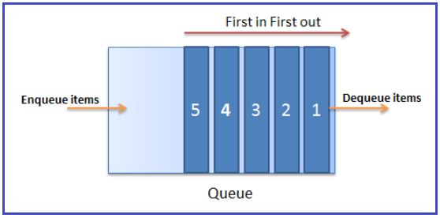
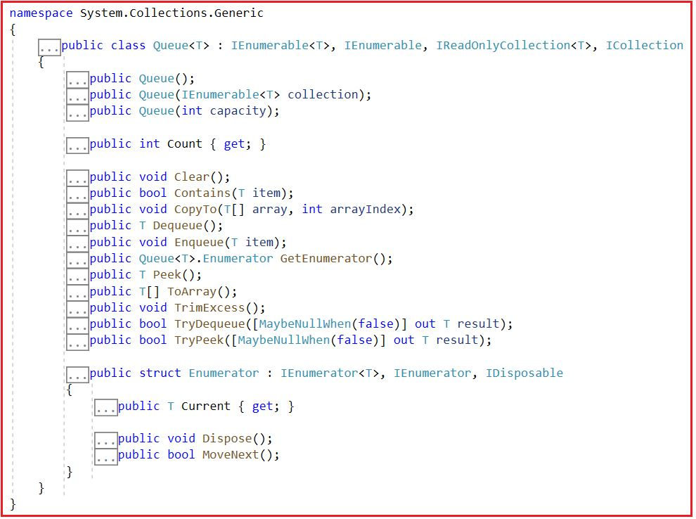
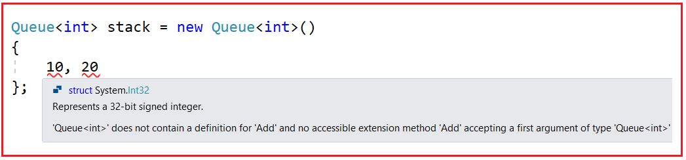
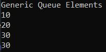
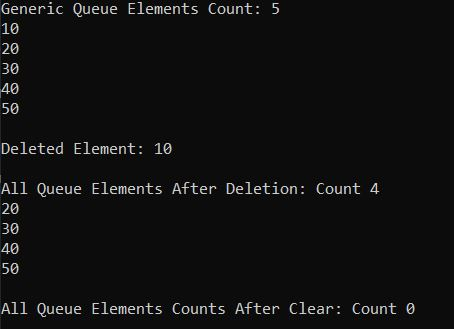
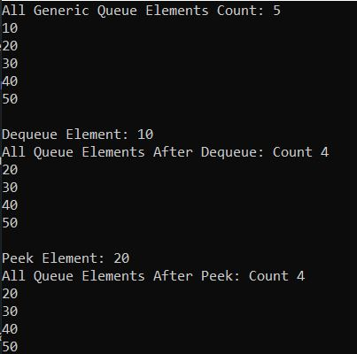
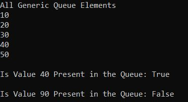
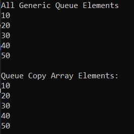
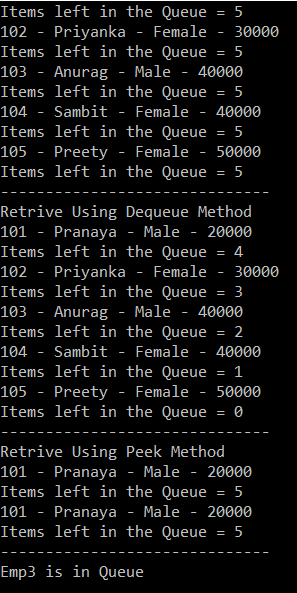

## **کلاس مجموعه عمومی Queue<T> در سی شارپ به همراه مثال**

در این مقاله، قصد دارم **کلاس مجموعه Generic Queue<T> را در C#** با مثال بررسی کنم. لطفاً مقاله قبلی ما را که در آن کلاس مجموعه Generic Stack در C# را با مثال بررسی کردیم، بخوانید. Queue<T> یک مجموعه Generic است که عناصر را به سبک FIFO (اولین ورودی، اولین خروجی) ذخیره می‌کند. زبان C# شامل کلاس‌های مجموعه Generic Queue<T> و Non-Generic Queue است. مایکروسافت توصیه می‌کند از کلاس Generic Queue<T> Collection استفاده کنید زیرا از نظر نوع ایمن است و نیازی به boxing و unboxing ندارد. در اینجا در این مقاله، کلاس مجموعه Generic Queue<T> را در C# با مثال بررسی خواهیم کرد. در پایان این مقاله، نکات زیر را خواهید فهمید.

1. **صف عمومی (Generic Queue<T>) در سی شارپ چیست؟**
2. **چگونه یک مجموعه Generic Queue<T> در سی شارپ ایجاد کنیم؟**
3. **چگونه عناصر را به یک مجموعه Queue<T> در سی شارپ اضافه کنیم؟**
4. **چگونه در سی شارپ به یک مجموعه صف عمومی دسترسی پیدا کنیم؟**
5. **چگونه عناصر را از یک مجموعه Generic Queue<T> در سی شارپ حذف کنیم؟**
6. **چگونه اولین عنصر را از صف عمومی در سی شارپ دریافت کنیم؟**
7. **تفاوت بین متدهای Dequeue() و Peek() چیست؟**
8. **چگونه بررسی کنیم که آیا یک عنصر در مجموعه صف عمومی در C# وجود دارد یا خیر؟**
9. **چگونه یک مجموعه صف عمومی را در یک آرایه موجود در C# کپی کنیم؟**
10. **کلاس مجموعه صف عمومی با انواع پیچیده در سی شارپ**
11. **صف عمومی در مقابل صف غیر عمومی در سی شارپ**

##### **صف عمومی (Generic Queue<T>) در سی شارپ چیست؟**

صف عمومی (Generic Queue) در سی شارپ (C#) یک کلاس مجموعه (collection) است که بر اساس اصل «اولین ورودی، اولین خروجی» (FIFO) کار می‌کند و این کلاس در فضای نام System.Collections.Generic وجود دارد. این بدان معناست که وقتی به دسترسی به آیتم‌ها بر اساس «اولین ورودی، اولین خروجی» (FIFO) نیاز داریم، باید از مجموعه صف عمومی (Generic Queue Collection) استفاده کنیم.

کلاس Queue Collection مشابه صف برداشت پول در دستگاه خودپرداز است. ترتیبی که افراد در صف قرار می‌گیرند، همان ترتیبی است که می‌توانند از صف خارج شوند و از دستگاه خودپرداز پول برداشت کنند. بنابراین، اولین کسی که در صف قرار می‌گیرد، اولین کسی است که پول را برداشت می‌کند و همچنین اولین کسی است که از دستگاه خودپرداز خارج می‌شود. برای درک بهتر، لطفاً به تصویر زیر نگاهی بیندازید.


کلاس مجموعه Queue نیز به همین روش عمل می‌کند. اولین آیتمی که به صف اضافه (در صف قرار می‌گیرد) می‌شود، اولین آیتمی نیز خواهد بود که از صف حذف (از صف خارج) می‌شود. وقتی یک عنصر را به صف اضافه می‌کنیم، به آن en-queue کردن عنصر و وقتی یک عنصر را از صف حذف می‌کنیم، به آن dequeu کردن عنصر می‌گویند. برای درک بهتر، لطفاً به تصویر زیر نگاهی بیندازید.



ظرفیت یک صف (Queue) تعداد عناصری است که صف می‌تواند در خود نگه دارد. با اضافه کردن عناصر به یک صف، ظرفیت آن به طور خودکار افزایش می‌یابد. در مجموعه عمومی صف (Generic Queue Collection)، می‌توانیم عناصر تکراری را ذخیره کنیم. یک صف همچنین می‌تواند مقدار null را به عنوان یک مقدار معتبر برای یک نوع مرجع بپذیرد.

##### **متدها، ویژگی‌ها و سازنده‌های کلاس مجموعه Generic Queue<T> در سی‌شارپ:**

اگر به تعریف کلاس Generic Queue<T> Collection بروید، موارد زیر را مشاهده خواهید کرد. در اینجا، می‌توانید ببینید که کلاس Generic Queue رابط‌های IEnumerable<T>، IEnumerable، IReadOnlyCollection<T> و ICollection را پیاده‌سازی می‌کند.



##### **چگونه یک مجموعه Generic Queue<T> در سی شارپ ایجاد کنیم؟**

کلاس مجموعه Generic Queue<T> در سی شارپ، سه سازنده زیر را برای ایجاد یک نمونه از کلاس Generic Queue<T> ارائه می‌دهد.

1. **Queue():** برای مقداردهی اولیه یک نمونه جدید از کلاس Generic Queue که خالی است و ظرفیت اولیه پیش‌فرض را دارد، استفاده می‌شود.
2. **Queue(IEnumerable<T> collection):** برای مقداردهی اولیه یک نمونه جدید از کلاس Generic Queue استفاده می‌شود که شامل عناصر کپی شده از مجموعه مشخص شده است و ظرفیت کافی برای جای دادن تعداد عناصر کپی شده را دارد. در اینجا، مجموعه پارامترها، مجموعه‌ای را مشخص می‌کند که عناصر آن در Generic Queue جدید کپی می‌شوند. اگر مجموعه تهی باشد، خطای ArgumentNullException رخ می‌دهد.
3. **Queue(int capacity):** برای مقداردهی اولیه یک نمونه جدید از کلاس Generic Queue که خالی است و ظرفیت اولیه مشخصی دارد، استفاده می‌شود. در اینجا، پارامتر capacity تعداد اولیه عناصری را که Queue می‌تواند در خود جای دهد، مشخص می‌کند. اگر capacity کمتر از صفر باشد، خطای ArgumentOutOfRangeException رخ می‌دهد.

بیایید ببینیم چگونه می‌توان با استفاده از سازنده‌ی Queue() یک نمونه از Generic Queue ایجاد کرد:

**مرحله ۱:**  
از آنجایی که کلاس Generic Queue<T> متعلق به فضای نام System.Collections.Generic است، بنابراین ابتدا باید فضای نام System.Collections.Generic را به صورت زیر در برنامه خود وارد کنیم:  
**با استفاده از System.Collections.Generic؛**

**مرحله ۲:**  
در مرحله بعد، باید با استفاده از سازنده Queue() به صورت زیر یک نمونه از کلاس Generic Queue ایجاد کنیم:  
**صف <نوع> صف_نام = صف جدید <نوع>();**  
در اینجا، نوع می‌تواند هر نوع داده‌ی داخلی مانند int، double، string و غیره، یا هر نوع داده‌ی تعریف‌شده توسط کاربر مانند Customer، Employee، Product و غیره باشد.

##### **چگونه عناصر را به یک مجموعه Queue<T> در سی شارپ اضافه کنیم؟**

اگر می‌خواهید عناصری را به یک مجموعه صف عمومی در سی‌شارپ اضافه کنید، باید از متد Enqueue() از کلاس Queue<T> به صورت زیر استفاده کنید.

1. **Enqueue(T item):** متد Enqueue(T item) برای اضافه کردن یک عنصر به انتهای صف استفاده می‌شود. در اینجا، پارامتر item عنصری را که باید به صف اضافه شود، مشخص می‌کند. مقدار می‌تواند برای نوع مرجع، یعنی وقتی T یک نوع مرجع است، تهی باشد.

برای مثال،  
**صف <int> صف = صف جدید <int>();**  
دستور بالا یک صف عمومی از انواع اعداد صحیح ایجاد می‌کند. بنابراین، در اینجا فقط می‌توانیم عناصری از نوع اعداد صحیح را به صف اضافه کنیم. اگر سعی کنیم چیزی غیر از عدد صحیح اضافه کنیم، با خطای زمان کامپایل مواجه خواهیم شد.  
**صف.در صف قرار دادن(10)؛**  
**صف.در صف قرار دادن(20)؛**  
**queue.Enqueue(“Hell0”); // خطای زمان کامپایل**

**نکته:** ما نمی‌توانیم با استفاده از Collection Initializer عناصر را به یک Queue Collection اضافه کنیم و دلیل این امر این است که کلاس Generic Queue<T> Collection متد Add ندارد. بنابراین، نکته‌ای که باید به خاطر داشته باشید این است که اگر هر کلاس collection متد Add را نداشته باشد، نمی‌توانید از Collection Initializer برای اضافه کردن عناصر استفاده کنید. اگر این کار را امتحان کنید، همانطور که در تصویر زیر نشان داده شده است، خطای زمان کامپایل دریافت خواهید کرد.



##### **چگونه در سی شارپ به یک مجموعه صف عمومی دسترسی پیدا کنیم؟**

ما می‌توانیم با استفاده از حلقه for each به صورت زیر به تمام عناصر مجموعه Generic Queue در سی شارپ دسترسی پیدا کنیم.  
**foreach (مورد متغیر در صف)**  
**{**  
**خط نوشتن کنسول (مورد)؛**  
**}**

**نکته:** شما نمی‌توانید از حلقه for برای دسترسی به عناصر یک مجموعه صف عمومی استفاده کنید و دلیل این امر این است که کلاس مجموعه صف عمومی هیچ اندیس‌گذار عدد صحیحی ندارد.

##### **مثالی برای درک نحوه ایجاد یک صف عمومی و افزودن عناصر در سی شارپ:**

برای درک بهتر نحوه ایجاد یک صف عمومی، نحوه اضافه کردن عناصر به یک صف و نحوه دسترسی به همه عناصر یک صف در سی شارپ با استفاده از حلقه for-each، لطفاً به مثال زیر که سه مورد فوق را نشان می‌دهد، نگاهی بیندازید.

```csharp
using System;
using System.Collections.Generic;

namespace GenericQueueCollection
{
    public class Program
    {
        public static void Main()
        {
            //Creating a Queue to Store Integer Values
            Queue<int> queue = new Queue<int>();

            //Adding Elements to the Queue using Enqueue Method
            queue.Enqueue(10);
            queue.Enqueue(20);
            queue.Enqueue(30);
            //Adding Duplicate
            queue.Enqueue(30);

            //As int is not a Reference type so null can not be accepted by this queue
            //queue.Enqueue(null); //Compile-Time Error
            //As the queue is integer type, so string values can not be accepted
            //queue.Enqueue("Hell0"); //Compile-Time Error

            //Accesing all the Elements of the Queue using For Each Loop
            Console.WriteLine("Generic Queue Elements");
            foreach (var item in queue)
            {
                Console.WriteLine(item);
            }

            Console.ReadKey();
        }
    } 
}
```

###### **خروجی:**



##### **چگونه عناصر را از یک مجموعه Generic Queue<T> در سی شارپ حذف کنیم؟**

در صف، عناصری که ابتدا اضافه می‌شوند، عنصری هستند که ابتدا حذف می‌شوند. این بدان معناست که ما مجاز به حذف عناصر از ابتدای صف هستیم. کلاس Generic Queue Collection در C# دو روش زیر را برای حذف عناصر ارائه می‌دهد.

1. **Dequeue():** این متد برای حذف و بازگرداندن شیء در ابتدای صف عمومی استفاده می‌شود. این متد شیء (عنصر) حذف شده از ابتدای صف عمومی را برمی‌گرداند. اگر صف خالی باشد، خطای InvalidOperationException رخ می‌دهد.
2. **Clear():** این متد برای حذف تمام اشیاء از صف عمومی (Generic Queue) استفاده می‌شود.

بیایید مثالی برای درک متدهای Dequeue() و Clear() از کلاس Generic Queue<T> Collection در سی شارپ ببینیم. لطفاً به مثال زیر که نحوه استفاده از متدهای Dequeue و Clear را نشان می‌دهد، نگاهی بیندازید.

```csharp
using System;
using System.Collections.Generic;

namespace GenericQueueCollection
{
    public class Program
    {
        public static void Main()
        {
            //Creating a Queue to Store Integer Values
            Queue<int> queue = new Queue<int>();

            //Adding Elements to the Queue using Enqueue Method
            queue.Enqueue(10);
            queue.Enqueue(20);
            queue.Enqueue(30);
            queue.Enqueue(40);
            queue.Enqueue(50);

            //Accesing all the Elements of the Queue using For Each Loop
            Console.WriteLine($"Generic Queue Elements Count: {queue.Count}");
            foreach (var item in queue)
            {
                Console.WriteLine(item);
            }

            // Removing and Returning an Element from the Begining of the Stack using Dequeue method
            Console.WriteLine($"\nDeleted Element: {queue.Dequeue()}");

            //Printing Elements After Removing the First Added Element
            Console.WriteLine($"\nAll Queue Elements After Deletion: Count {queue.Count}");
            foreach (var element in queue)
            {
                Console.WriteLine($"{element} ");
            }
            
            //Removing All Elements from Queue using Clear Method
            queue.Clear();
            Console.WriteLine($"\nAll Queue Elements Counts After Clear: Count {queue.Count}");

            Console.ReadKey();
        }
    } 
}
```

###### **خروجی:**



##### **چگونه اولین عنصر را از صف عمومی در سی شارپ دریافت کنیم؟**

کلاس مجموعه Generic Queue<T> در سی شارپ دو متد زیر را برای دریافت اولین عنصر مجموعه صف ارائه می‌دهد.

1. **Dequeue():** متد Dequeue() از کلاس Queue برای حذف و بازگرداندن شیء از ابتدای صف استفاده می‌شود. این بدان معناست که شیء حذف شده از ابتدای صف عمومی را برمی‌گرداند. اگر صف خالی باشد، خطای InvalidOperationException رخ می‌دهد.
2. **Peek():** متد peek() از کلاس Queue برای برگرداندن شیء در ابتدای صف بدون حذف آن استفاده می‌شود. این بدان معناست که شیء را از ابتدای صف برمی‌گرداند. اگر صف خالی باشد، خطای InvalidOperationException رخ می‌دهد.

برای درک بهتر، لطفاً به مثال زیر نگاهی بیندازید که نحوه دریافت اولین عنصر از صف را با استفاده از متدهای Dequeue() و Peek() از کلاس Queue<T> در سی شارپ نشان می‌دهد.

```csharp
using System;
using System.Collections.Generic;

namespace GenericQeueuCollection
{
    public class Program
    {
        public static void Main()
        {
            //Creating a Queue to Store Integer Values
            Queue<int> queue = new Queue<int>();

            //Adding Elements to the Queue using Enqueue Method
            queue.Enqueue(10);
            queue.Enqueue(20);
            queue.Enqueue(30);
            queue.Enqueue(40);
            queue.Enqueue(50);

            //Accesing all the Elements of the Queue using For Each Loop
            Console.WriteLine($"All Generic Queue Elements Count: {queue.Count}");
            foreach (var item in queue)
            {
                Console.WriteLine(item);
            }

            // Removing and Returning the First Element from queue using Dequeue method
            Console.WriteLine($"\nDequeue Element: {queue.Dequeue()}");

            //Printing Elements After Removing the First Added Element
            Console.WriteLine($"All Queue Elements After Dequeue: Count {queue.Count}");
            foreach (var element in queue)
            {
                Console.WriteLine($"{element} ");
            }

            // Returning an Element from the Queue using Peek method
            Console.WriteLine($"\nPeek Element: {queue.Peek()}");
            //Printing Elements After Peek the Last Added Element
            Console.WriteLine($"All Queue Elements After Peek: Count {queue.Count}");
            foreach (var element in queue)
            {
                Console.WriteLine($"{element} ");
            }

            Console.ReadKey();
        }
    } 
}
```

###### **خروجی:**



##### **تفاوت بین متدهای Dequeue() و Peek() چیست؟**

متد Dequeue() عنصر ابتدای صف را حذف کرده و برمی‌گرداند، در حالی که متد Peek() عنصر ابتدای صف را بدون حذف آن برمی‌گرداند. بنابراین، اگر می‌خواهید اولین عنصر را از صف حذف کرده و برگردانید، از متد Dequeue استفاده کنید و اگر فقط می‌خواهید اولین عنصر را از صف بدون حذف آن برگردانید، از متد Peek استفاده کنید و این تنها تفاوت بین این دو متد از کلاس Generic Queue<T> Collection در C# است.

##### **چگونه بررسی کنیم که آیا یک عنصر در مجموعه Generic Queue<T> در C# وجود دارد یا خیر؟**

اگر می‌خواهید بررسی کنید که آیا یک عنصر در مجموعه Generic Queue<T> وجود دارد یا خیر، باید از متد Contains() که توسط کلاس Generic Queue در C# ارائه شده است، استفاده کنید. حتی می‌توانید از این متد برای جستجوی یک عنصر در پشته داده شده نیز استفاده کنید.

1. **Contains(T item) :** متد Contains(T item) برای تعیین وجود یا عدم وجود یک عنصر در صف عمومی استفاده می‌شود. اگر عنصر در صف عمومی یافت شود، مقدار true و در غیر این صورت، مقدار false را برمی‌گرداند. در اینجا، پارامتر item عنصری را که باید در صف قرار گیرد، مشخص می‌کند. مقدار آن برای نوع مرجع می‌تواند null باشد.

بیایید متد Contains(T item) را با یک مثال درک کنیم. مثال زیر نحوه استفاده از متد Contains() از کلاس Generic Queue Collection در سی شارپ را نشان می‌دهد.

```csharp
using System;
using System.Collections.Generic;

namespace GenericQueueCollection
{
    public class Program
    {
        public static void Main()
        {
            //Creating a Queue to Store Integer Values
            Queue<int> queue = new Queue<int>();

            //Adding Elements to the Queue using Enqueue Method
            queue.Enqueue(10);
            queue.Enqueue(20);
            queue.Enqueue(30);
            queue.Enqueue(40);
            queue.Enqueue(50);

            //Accesing all the Elements of the Queue using For Each Loop
            Console.WriteLine($"All Generic Queue Elements");
            foreach (var item in queue)
            {
                Console.WriteLine(item);
            }

            Console.WriteLine($"\nIs Value 40 Present in the Queue: {queue.Contains(50)}");
            Console.WriteLine($"\nIs Value 90 Present in the Queue: {queue.Contains(90)}");

            Console.ReadKey();
        }
    } 
}
```

###### **خروجی:**



##### **چگونه یک مجموعه صف عمومی را در یک آرایه موجود در C# کپی کنیم؟**

برای کپی کردن یک مجموعه Generic Queue به یک آرایه موجود در C#، باید از متد CopyTo زیر از کلاس Generic Queue Collection استفاده کنیم.

1. **CopyTo(T[] array, int arrayIndex):** این متد برای کپی کردن عناصر مجموعه صف عمومی به یک آرایه تک بعدی موجود، با شروع از اندیس آرایه مشخص شده، استفاده می‌شود. در اینجا، پارامتر array، آرایه تک بعدی را که مقصد عناصر کپی شده از صف عمومی است، مشخص می‌کند. آرایه باید دارای اندیس‌گذاری مبتنی بر صفر باشد. پارامتر arrayIndex، اندیس مبتنی بر صفر را در آرایه‌ای که کپی از آن شروع می‌شود، مشخص می‌کند. اگر پارامتر array تهی باشد، خطای ArgumentNullException رخ می‌دهد. اگر اندیس پارامتر کمتر از صفر باشد، خطای ArgumentOutOfRangeException رخ می‌دهد. اگر تعداد عناصر موجود در صف عمومی منبع بیشتر از فضای موجود از arrayIndex تا انتهای آرایه مقصد باشد، خطای ArgumentException رخ می‌دهد.

این متد روی آرایه‌های تک‌بعدی کار می‌کند و وضعیت صف عمومی را تغییر نمی‌دهد. عناصر در آرایه به همان ترتیبی که عناصر از ابتدای صف تا انتهای آن مرتب شده‌اند، مرتب می‌شوند. برای درک بهتر متد CopyTo(T[] array, int arrayIndex) از کلاس Generic Queue<T> Collection در سی‌شارپ، مثالی را بررسی می‌کنیم.

```csharp
using System;
using System.Collections.Generic;

namespace GenericQueueCollection
{
    public class Program
    {
        public static void Main()
        {
            //Creating a Queue to Store Integer Values
            Queue<int> queue = new Queue<int>();

            //Adding Elements to the Queue using Enqueue Method
            queue.Enqueue(10);
            queue.Enqueue(20);
            queue.Enqueue(30);
            queue.Enqueue(40);
            queue.Enqueue(50);

            //Accesing all the Elements of the Queue using For Each Loop
            Console.WriteLine($"All Generic Queue Elements");
            foreach (var item in queue)
            {
                Console.WriteLine(item);
            }

            //Copying the queue to an object array
            int[] queueCopy = new int[5];
            queue.CopyTo(queueCopy, 0);
            Console.WriteLine("\nQueue Copy Array Elements:");
            foreach (var item in queueCopy)
            {
                Console.WriteLine(item);
            }

            Console.ReadKey();
        }
    } 
}
```

###### **خروجی:**



##### **کلاس مجموعه صف عمومی با انواع پیچیده در سی شارپ.**

تاکنون، ما از کلاس Generic Queue<T> Collection با انواع داده اولیه مانند int، double و غیره استفاده کرده‌ایم. حال، بیایید ببینیم چگونه از کلاس Generic Queue<T> Collection با انواع داده‌های پیچیده مانند Employee، Customer، Product و غیره استفاده کنیم. برای درک بهتر، لطفاً به مثال زیر نگاهی بیندازید که در آن از Generic Queue<T> Collection با Employee تعریف شده توسط کاربر استفاده می‌کنیم و انواع مختلفی از عملیات را روی صف انجام می‌دهیم. کد زیر خود توضیح است، بنابراین لطفاً خطوط نظر را مرور کنید.

```csharp
using System;
using System.Collections.Generic;

namespace GenericQueueDemo
{
    public class Program
    {
        static void Main(string[] args)
        {
            //Create Employee object
            Employee emp1 = new Employee()
            {
                ID = 101,
                Name = "Pranaya",
                Gender = "Male",
                Salary = 20000
            };
            Employee emp2 = new Employee()
            {
                ID = 102,
                Name = "Priyanka",
                Gender = "Female",
                Salary = 30000
            };
            Employee emp3 = new Employee()
            {
                ID = 103,
                Name = "Anurag",
                Gender = "Male",
                Salary = 40000
            };
            Employee emp4 = new Employee()
            {
                ID = 104,
                Name = "Sambit",
                Gender = "Female",
                Salary = 40000
            };
            Employee emp5 = new Employee()
            {
                ID = 105,
                Name = "Preety",
                Gender = "Female",
                Salary = 50000
            };

            // Create a Generic Queue of Employees
            Queue<Employee> queueEmployees = new Queue<Employee>();

            // To add an item into the queue, use the Enqueue() method.
            // emp1 is added first, so this employee, will be the first to get out of the queue
            queueEmployees.Enqueue(emp1);

            // emp2 will be queued up next, so employee 2 will be second to get out of the queue
            queueEmployees.Enqueue(emp2);

            // emp3 will be queued up next, so employee 3 will be third to get out of the queue
            queueEmployees.Enqueue(emp3);

            // emp3 will be queued up next, so employee 4 will be fourth to get out of the queue
            queueEmployees.Enqueue(emp4);

            // emp5 will be queued up next, so employee 5 will be fifth to get out of the queue
            queueEmployees.Enqueue(emp5);

            // If you need to loop thru each items in the queue, then we can use the foreach loop 
            // in the same way as we use it with other collection classes. 
            // The foreach loop will only iterate thru the items in the queue, but will not remove them. 
            // Notice that the items from the queue are retrieved in FIFI (First In First Out), order. 
            // The First element added to the queue is the first one to be removed.
            Console.WriteLine("Retrive Using Foreach Loop");
            foreach (Employee emp in queueEmployees)
            {
                Console.WriteLine(emp.ID + " - " + emp.Name + " - " + emp.Gender + " - " + emp.Salary);
                Console.WriteLine("Items left in the Queue = " + queueEmployees.Count);
            }
            Console.WriteLine("------------------------------");

            // To retrieve an item from the queue, use the Dequeue() method. 
            // Notice that the items are dequeued in the same order in which they were enqueued.
            // Dequeue() method removes and returns the item at the beginning of the Queue.
            // Since emp1 object is the one that is enqueued onto the queue first, this object will be
            // first to be dequeued and returned from the queue by using Dequeue() method

            Console.WriteLine("Retrive Using Dequeue Method");
            Employee e1 = queueEmployees.Dequeue();
            Console.WriteLine(e1.ID + " - " + e1.Name + " - " + e1.Gender + " - " + e1.Salary);
            Console.WriteLine("Items left in the Queue = " + queueEmployees.Count);

            Employee e2 = queueEmployees.Dequeue();
            Console.WriteLine(e2.ID + " - " + e2.Name + " - " + e2.Gender + " - " + e2.Salary);
            Console.WriteLine("Items left in the Queue = " + queueEmployees.Count);

            Employee e3 = queueEmployees.Dequeue();
            Console.WriteLine(e3.ID + " - " + e3.Name + " - " + e3.Gender + " - " + e3.Salary);
            Console.WriteLine("Items left in the Queue = " + queueEmployees.Count);

            Employee e4 = queueEmployees.Dequeue();
            Console.WriteLine(e4.ID + " - " + e4.Name + " - " + e4.Gender + " - " + e4.Salary);
            Console.WriteLine("Items left in the Queue = " + queueEmployees.Count);

            Employee e5 = queueEmployees.Dequeue();
            Console.WriteLine(e5.ID + " - " + e5.Name + " - " + e5.Gender + " - " + e5.Salary);
            Console.WriteLine("Items left in the Queue = " + queueEmployees.Count);
            Console.WriteLine("------------------------------");

            // Now there will be no items left in the queue. 
            // So, let's Enqueue the five objects once again
            queueEmployees.Enqueue(emp1);
            queueEmployees.Enqueue(emp2);
            queueEmployees.Enqueue(emp3);
            queueEmployees.Enqueue(emp4);
            queueEmployees.Enqueue(emp5);

            // To retrieve an item that is present at the beginning of the queue,
            // without removing it, then use the Peek() method.

            Console.WriteLine("Retrive Using Peek Method");
            Employee e101 = queueEmployees.Peek();
            Console.WriteLine(e101.ID + " - " + e101.Name + " - " + e101.Gender + " - " + e101.Salary);
            Console.WriteLine("Items left in the Queue = " + queueEmployees.Count);

            Employee e103 = queueEmployees.Peek();
            Console.WriteLine(e103.ID + " - " + e103.Name + " - " + e103.Gender + " - " + e103.Salary);
            Console.WriteLine("Items left in the Queue = " + queueEmployees.Count);

            Console.WriteLine("------------------------------");

            // To check if an item exists in the stack, use Contains() method.
            if (queueEmployees.Contains(emp3))
            {
                Console.WriteLine("Emp3 is in Queue");
            }
            else
            {
                Console.WriteLine("Emp3 is not in queue");
            }

            Console.ReadKey();
        }
    }
    public class Employee
    {
        public int ID { get; set; }
        public string Name { get; set; }
        public string Gender { get; set; }
        public int Salary { get; set; }
    }
}
```

###### **خروجی:**



**نکته:** برای اضافه کردن آیتم‌ها به انتهای صف، از **متد Enqueue()** استفاده کنید . به طور مشابه، برای حذف آیتمی که در ابتدای صف قرار دارد، **از متد Dequeue()** استفاده کنید . یک حلقه foreach روی تمام آیتم‌های موجود در صف تکرار می‌شود. متد peek آیتم را از ابتدای صف برمی‌گرداند اما آن آیتم را از صف حذف نمی‌کند. برای بررسی وجود یا عدم وجود یک آیتم در صف، از **متد Contains()** استفاده کنید .

##### **صف عمومی در مقابل صف غیر عمومی در سی شارپ**

1. کلاس مجموعه Generic Queue<T> در فضای نام System.Collections.Generic تعریف شده است، در حالی که کلاس مجموعه Non-Generic Queue در فضای نام System.Collections تعریف شده است.
2. کلاس Generic Queue<T> در سی شارپ فقط می‌تواند عناصر از یک نوع را ذخیره کند در حالی که کلاس Non-Generic Queue می‌تواند عناصر از یک نوع یا نوع متفاوت را هنگام کار بر روی نوع داده شیء ذخیره کند.
3. در صف عمومی (Generic Queue<T>)، باید نوع عناصری را که می‌خواهیم در صف ذخیره کنیم، تعریف کنیم. از طرف دیگر، در یک صف غیر عمومی (Non-Generic Queue)، نیازی به تعریف نوع عناصری که می‌خواهیم در صف ذخیره کنیم، نیست زیرا بر روی نوع داده شیء عمل می‌کند، یعنی می‌توانیم هر نوع داده‌ای را ذخیره کنیم.
4. صف عمومی<T> از نظر نوع داده ایمن است در حالی که صف غیر عمومی از نظر نوع داده ایمن نیست.

##### **خلاصه کلاس مجموعه Generic Queue<T> در سی شارپ:**

نکات مهمی که باید هنگام کار با کلاس Generic Queue Collection در سی شارپ به خاطر داشته باشید، در ادامه آمده است.

1. مجموعه صف (Queue Collection) برای ذخیره مجموعه‌ای از عناصر از یک نوع به روش FIFO (اولین ورودی، اولین خروجی) استفاده می‌شود، یعنی عنصری که ابتدا اضافه شده است، ابتدا حذف خواهد شد.
2. از آنجایی که Queue<T> یک مجموعه عمومی (Generic Collection) است، بنابراین تحت فضای نام System.Collection.Generic قرار می‌گیرد.
3. مجموعه Generic Queue<T> عناصری از نوع مشخص شده را ذخیره می‌کند. این مجموعه بررسی نوع در زمان کامپایل را فراهم می‌کند و به دلیل عمومی بودن، boxing-unboxing را انجام نمی‌دهد.
4. با استفاده از متد Enqueue()، می‌توانیم عناصر را به یک مجموعه صف اضافه کنیم. در اینجا، نمی‌توانیم از سینتکس collection-initializer برای اضافه کردن عناصر به یک صف استفاده کنیم.
5. متد Dequeue() اولین عنصر را از ابتدای صف حذف کرده و برمی‌گرداند.
6. متد Peek() اولین عنصر درج شده در صف را بدون حذف آن از مجموعه، برمی‌گرداند.
7. صف‌بندی برای ذخیره داده‌های موقت به سبک «اولین ورودی، اولین خروجی» (FIFO) بسیار مفید است، جایی که ممکن است بخواهید یک عنصر را پس از بازیابی مقدار آن حذف کنید.