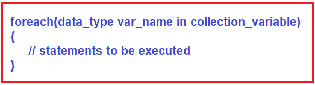
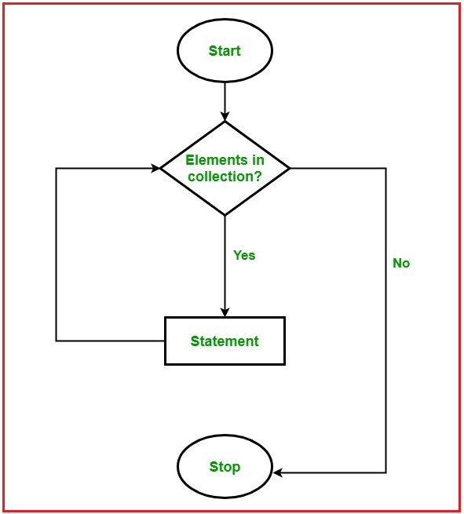
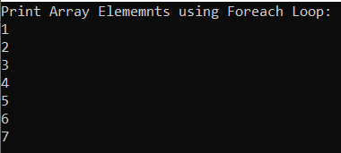
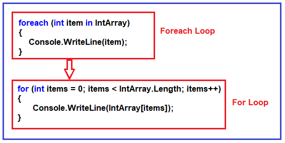
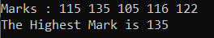
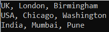
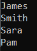
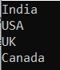

## **حلقه Foreach در سی شارپ به همراه مثال**

در این مقاله، قصد دارم **حلقه Foreach را در سی شارپ** با مثال بررسی کنم. لطفاً مقاله قبلی ما را که در آن به بررسی صف عمومی در سی شارپ با مثال پرداختیم، مطالعه کنید.

##### **حلقه Foreach در سی شارپ چیست؟**

حلقه زدن راهی برای اجرای چندین باره یک دستور (دستورات) بسته به نتیجه یک شرط است. تا زمانی که شرط داده شده برقرار باشد، حلقه اجرا می‌شود. به محض اینکه شرط برقرار نشد، حلقه خاتمه می‌یابد.

حلقه Foreach در سی شارپ نوع متفاوتی از حلقه است که شامل ویژگی‌های مقداردهی اولیه، خاتمه و افزایش/کاهش نمی‌شود. این حلقه از مجموعه برای دریافت مقادیر به صورت تک تک و سپس پردازش آنها استفاده می‌کند.

حلقه foreach در سی شارپ برای پیمایش عناصر یک مجموعه استفاده می‌شود. در اینجا، مجموعه می‌تواند یک آرایه، لیست، دیکشنری و غیره باشد. همانطور که از نامش پیداست، یعنی foreach، بدنه حلقه را برای هر عنصر موجود در آرایه یا مجموعه اجرا می‌کند.

در سی شارپ، حلقه foreach انواع مجموعه مانند Array، ArrayList، List، Hashtable، Dictionary و غیره را تکرار می‌کند. این حلقه می‌تواند با هر نوعی که رابط IEnumerable را پیاده‌سازی می‌کند، مورد استفاده قرار گیرد.

##### **سینتکس استفاده از حلقه Foreach در زبان سی شارپ:**

فضای نام System.Collections.Generic شامل متد الحاقی ForEach() است که می‌تواند با هر کلاس کلکسیون داخلی مانند List، Dictionary، SortedList و غیره استفاده شود.



همانطور که در سینتکس بالا نشان داده شده است، لازم است دستورات حلقه foreach را داخل آکولاد {} قرار دهیم. در اینجا، به جای تعریف و مقداردهی اولیه یک متغیر شمارنده حلقه، باید یک متغیر از همان نوع نوع مجموعه یا نوع آرایه تعریف کنیم و به دنبال آن کلمه کلیدی in را بنویسیم که در نهایت نام آرایه یا نام مجموعه را می‌آوریم. در بدنه حلقه foreach، می‌توانید به جای استفاده از یک عنصر آرایه اندیس‌گذاری شده یا موقعیت اندیس مجموعه، از متغیر حلقه‌ای که ایجاد کرده‌اید استفاده کنید.

##### **فلوچارت برای درک حلقه Foreach:**



##### **مثالی برای درک کاربرد حلقه foreach در سی شارپ:**

```csharp
using System;

namespace ForeachLoopDemo
{
    class Program
    {
        static void Main(string[] args)
        {
            // creating an array of integer type
            int[] IntArray = new int[] { 1, 2, 3, 4, 5, 6, 7 };

            Console.WriteLine("Print Array Elememnts using Foreach Loop:");
            // The foreach loop will run till the last element of the array
            foreach (int item in IntArray)
            {
                Console.WriteLine(item);
            }

            Console.ReadKey();
        }
    }
}
```

###### **خروجی:**



تصویر زیر معادل حلقه for مربوط به حلقه foreach بالا را در زبان سی شارپ نشان می‌دهد.



**نکته:** کلمه کلیدی "in" در حلقه foreach برای پیمایش روی مجموعه استفاده می‌شود. کلمه کلیدی in در هر تکرار یک آیتم از مجموعه را انتخاب کرده و آن را در متغیر element ذخیره می‌کند. در تکرار اول، اولین آیتم مجموعه در element ذخیره می‌شود. در تکرار دوم، عنصر دوم انتخاب می‌شود و به همین ترتیب ادامه می‌یابد. تعداد دفعاتی که حلقه foreach اجرا می‌شود برابر با تعداد عناصر موجود در آرایه یا مجموعه است.

##### **مثال برای درک حلقه Foreach در زبان سی شارپ**

```csharp
using System;

namespace ForeachLoopDemo
{
    class Program
    {
        static void Main(string[] args)
        {
            int[] Marks = { 115, 135, 105, 116, 122 };

            Console.Write("Marks :");
            foreach (int mark in Marks)
            {
                Console.Write($" {mark}");
            }
            Console.WriteLine();
            int Highest_Mark = Maximum(Marks);

            Console.WriteLine("The Highest Mark is " + Highest_Mark);
            Console.ReadKey();
        }

        public static int Maximum(int[] Marks)
        {
            int maxSoFar = Marks[0];

            // for each loop 
            foreach (int mark in Marks)
            {
                if (mark > maxSoFar)
                {
                    maxSoFar = mark;
                }
            }
            return maxSoFar;
        }
    }
}
```

###### **خروجی:**



##### **مثال: حلقه Foreach با مجموعه دیکشنری در سی شارپ**

مثال زیر نحوه استفاده از حلقه foreach را روی یک مجموعه دیکشنری با استفاده از زبان سی شارپ نشان می‌دهد. کلاس مجموعه دیکشنری متعلق به فضای نام System.Collections.Generic است.

```csharp
using System;
using System.Collections.Generic;

namespace ForeachLoopDemo
{
    class Program
    {
        static void Main(string[] args)
        {
            var citiesOfCountry = new Dictionary<string, string>()
            {
                {"UK", "London, Birmingham"},
                {"USA", "Chicago, Washington"},
                {"India", "Mumbai, Pune"}
            };

            foreach (var city in citiesOfCountry)
            {
                Console.WriteLine("{0}, {1}", city.Key, city.Value);
            }

            Console.ReadKey();
        }
    }
}
```

###### **خروجی:**



##### **پیاده‌سازی رابط IEnumerable در سی‌شارپ**

همانطور که قبلاً ذکر شد، حلقه foreach در سی شارپ می‌تواند برای تکرار هر کلاسی که رابط IEnumerable را پیاده‌سازی می‌کند، استفاده شود. مثال زیر نحوه پیاده‌سازی رابط IEnumerable را به منظور استفاده از حلقه foreach با کلاس سفارشی نشان می‌دهد.

```csharp
using System;
using System.Collections;

namespace ForeachLoopDemo
{
    class Program
    {
        static void Main(string[] args)
        {
            Shop objShop = new Shop();

            foreach (Customer cust in objShop)
            {
                Console.WriteLine(cust.Name);
            }

            Console.ReadKey();
        }
    }

    class Customer
    {
        public int Id { get; set; }
        public string Name { get; set; }
    }

    class Shop : IEnumerable
    {
        private Customer[] CustomerArray = new Customer[4];
        public Shop()
        {
            CustomerArray[0] = new Customer() { Id = 1, Name = "James" };
            CustomerArray[1] = new Customer() { Id = 2, Name = "Smith" };
            CustomerArray[2] = new Customer() { Id = 3, Name = "Sara" };
            CustomerArray[3] = new Customer() { Id = 4, Name = "Pam" };
        }

        //Here implementation for the GetEnumerator method.
        public IEnumerator GetEnumerator()
        {
            return CustomerArray.GetEnumerator();
        }
    }
}
```

###### **خروجی:**



در مثال بالا، کلاس Shop رابط IEnumerable را پیاده‌سازی کرده است که شامل متد GetEnumerator() است. این امر کلاس Shop را قادر می‌سازد تا با حلقه foreach که اشیاء Customer را برمی‌گرداند، استفاده شود.

##### **Foreach با مجموعه لیست در سی شارپ**

در مثال زیر، ما از حلقه foreach برای پیمایش روی مجموعه‌ای از نوع List استفاده می‌کنیم.

```csharp
using System;
using System.Collections.Generic;

namespace ForeachLoopDemo
{
    class Program
    {
        static void Main(string[] args)
        {
            List<string> Countries = new List<string> { "India", "USA", "UK", "Canada" };

            foreach (string country in Countries)
            {
                Console.WriteLine(country);
            }

            Console.ReadKey();
        }
    }
}
```

###### **خروجی:**



##### **محدودیت‌های حلقه Foreach:**

۱. حلقه Foreach در سی شارپ برای زمانی که می‌خواهیم آرایه یا مجموعه را تغییر دهیم مناسب نیست.  
**foreach(یک آیتم عدد صحیح در مجموعه)**  
**{**  
**// فقط متغیر آیتم را تغییر می‌دهد، نه عنصر مجموعه را**  
**مورد = مورد + ۲؛**  
**}**

۲. حلقه Foreach در سی شارپ اندیس‌ها را پیگیری نمی‌کند. بنابراین، دریافت اندیس آرایه یا اندیس مجموعه با استفاده از حلقه Foreach امکان‌پذیر نیست.  
**foreach (یک آیتم عدد صحیح در مجموعه)**  
**{**  
**اگر مورد == هدف)**  
**{**  
**// اندیس آیتم را نمی‌دانم. // return ???;**  
**}**  
**}**

۳. حلقه Foreach در سی شارپ فقط در جهت رو به جلو تکرار می‌شود. حلقه foreach زیر را نمی‌توان به حلقه foreach تبدیل کرد زیرا از آخرین عنصر شروع می‌کنیم.  
**برای (عدد صحیح i = اعداد.طول – ۱؛ i > ۰؛ i–)**  
**{**  
**Console.WriteLine(numbers[i]);**  
**}**

##### **تفاوت بین حلقه For و حلقه Foreach:**

حلقه for در سی شارپ، یک دستور یا مجموعه‌ای از دستورات را تا زمانی که شرط داده شده درست باشد، اجرا می‌کند. در حالی که حلقه foreach برای هر عنصر موجود در آرایه یا مجموعه، یک دستور یا مجموعه‌ای از دستورات را اجرا می‌کند و نیازی به تعریف حداقل یا حداکثر حد نیست.

در حلقه for، می‌توان عناصر آرایه را در هر دو جهت رو به جلو و عقب، مثلاً از اندیس 0 تا 9 و از اندیس 9 تا 0، تکرار کرد. اما در حلقه foreach، فقط می‌توان یک آرایه را در جهت رو به جلو تکرار کرد، جهت رو به عقب امکان‌پذیر نیست.

##### **نکاتی که هنگام کار با حلقه Foreach باید به خاطر داشته باشید:**

1. حلقه foreach در سی شارپ فقط در جهت رو به جلو تکرار می‌شود. جهت رو به عقب امکان‌پذیر نیست.
2. از نقطه نظر عملکرد، حلقه foreach در مقایسه با حلقه for زمان بیشتری می‌برد. زیرا به صورت داخلی از فضای حافظه اضافی استفاده می‌کند.
3. حلقه foreach از متد GetEnumarator() از رابط IEnumerable استفاده می‌کند. بنابراین، حلقه foreach را می‌توان با هر کلاسی که رابط را پیاده‌سازی کرده است، استفاده کرد.
4. ما می‌توانیم با استفاده از دستورات break، return، Goto و throw از حلقه foreach در سی شارپ خارج شویم.
