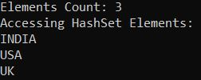
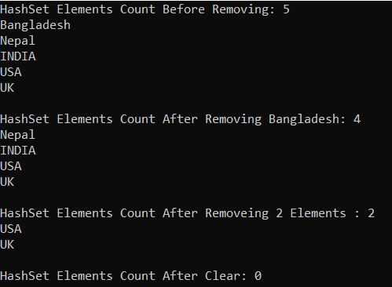
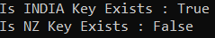
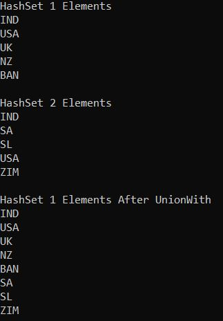
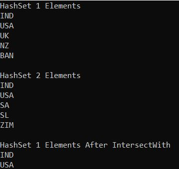
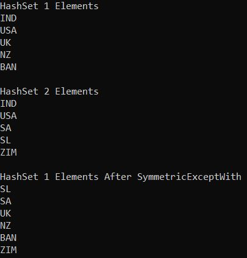
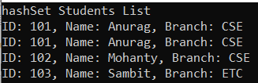
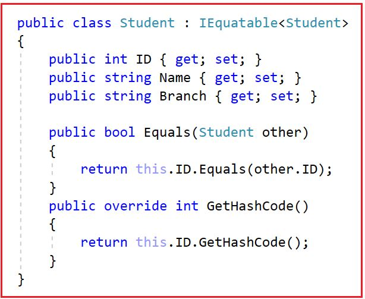
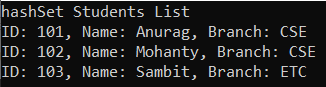
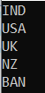

## **کلاس مجموعه عمومی HashSet<T> در سی شارپ به همراه مثال**

در این مقاله، قصد دارم **کلاس مجموعه Generic HashSet<T> را در سی شارپ** با مثال‌هایی مورد بحث قرار دهم. لطفاً مقاله قبلی ما را که در آن حلقه For Each در سی شارپ را با مثال‌هایی مورد بحث قرار دادیم، مطالعه کنید. در پایان این مقاله، اشاره‌گرهای زیر را با مثال‌هایی درک خواهید کرد.

1. **HashSet<T> در سی شارپ چیست؟**
2. **چگونه یک مجموعه عمومی HashSet در سی شارپ ایجاد کنیم؟**
3. **چگونه عناصر را به یک مجموعه HashSet در C# اضافه کنیم؟**
4. **چگونه در سی شارپ به یک مجموعه عمومی HashSet<T> دسترسی پیدا کنیم؟**
5. **مثالی برای درک نحوه ایجاد HashSet و افزودن عناصر در سی شارپ**
6. **چگونه عناصر را از یک مجموعه عمومی HashSet<T> در C# حذف کنیم؟**
7. **چگونه در دسترس بودن یک عنصر در HashSet را در C# بررسی کنیم؟**
8. **عملیات تنظیم روی کلاس مجموعه Generic HashSet<T> در سی شارپ**
9. **مجموعه عمومی HashSet با نوع پیچیده در سی شارپ**
10. **دریافت یک Enumerator که از طریق مجموعه HashSet<T> در سی شارپ تکرار می‌شود**

##### **HashSet<T> در سی شارپ چیست؟**

کلاس مجموعه عمومی HashSet<T> در سی شارپ می‌تواند برای ذخیره، حذف یا مشاهده عناصر استفاده شود. این یک مجموعه نامرتب از عناصر منحصر به فرد است. مجموعه HashSet<T> در .NET Framework 3.5 معرفی شده است. این مجموعه اجازه اضافه کردن عناصر تکراری را نمی‌دهد. بنابراین، اگر می‌خواهید فقط عناصر منحصر به فرد را ذخیره کنید، توصیه می‌شود از مجموعه HashSet استفاده کنید. این مجموعه از نوع مجموعه عمومی است و از این رو به فضای نام System.Collections.Generic تعلق دارد. عملکرد HashSet در مقایسه با مجموعه لیست در سی شارپ بسیار بهتر است.

##### **چگونه یک مجموعه عمومی HashSet در C# ایجاد کنیم؟**

کلاس Generic HashSet Collection در سی شارپ هفت سازنده ارائه می‌دهد که می‌توانیم از آنها برای ایجاد یک نمونه از HashSet استفاده کنیم. این سازنده‌ها به شرح زیر هستند:

1. **public HashSet():** این تابع یک نمونه جدید از کلاس System.Collections.Generic.HashSet را که خالی است، مقداردهی اولیه می‌کند و از مقایسه‌گر برابری پیش‌فرض برای نوع مجموعه استفاده می‌کند.
2. **public HashSet(IEnumerable<T> collection) :** این متد یک نمونه جدید از کلاس System.Collections.Generic.HashSet را مقداردهی اولیه می‌کند که از مقایسه‌گر برابری پیش‌فرض برای نوع مجموعه استفاده می‌کند، شامل عناصر کپی‌شده از مجموعه مشخص‌شده است و ظرفیت کافی برای جای دادن تعداد عناصر کپی‌شده را دارد.
3. **public HashSet(IEqualityComparer<T> comparer) :** این متد یک نمونه جدید از کلاس System.Collections.Generic.HashSet را که خالی است، مقداردهی اولیه می‌کند و از مقایسه‌گر برابری مشخص شده برای نوع مجموعه استفاده می‌کند.
4. **public HashSet(int capacity) :** این متد یک نمونه جدید از کلاس System.Collections.Generic.HashSet را مقداردهی اولیه می‌کند که خالی است، اما فضای رزرو شده‌ای برای آیتم‌های ظرفیت دارد و از مقایسه‌گر برابری پیش‌فرض برای نوع مجموعه استفاده می‌کند.
5. **public HashSet(IEnumerable<T> collection, IEqualityComparer<T> comparer) :** این متد یک نمونه جدید از کلاس System.Collections.Generic.HashSet را مقداردهی اولیه می‌کند که از مقایسه‌گر برابری مشخص شده برای نوع مجموعه استفاده می‌کند، شامل عناصر کپی شده از مجموعه مشخص شده است و ظرفیت کافی برای جای دادن تعداد عناصر کپی شده را دارد.
6. **public HashSet(int capacity, IEqualityComparer<T> comparer) :** این متد یک نمونه جدید از کلاس System.Collections.Generic.HashSet را مقداردهی اولیه می‌کند که از مقایسه‌گر برابری مشخص شده برای نوع مجموعه استفاده می‌کند و ظرفیت کافی برای جای دادن عناصر ظرفیت را دارد.
7. **protectedHashSet(SerializationInfo info, StreamingContext context) :** یک نمونه جدید از کلاس System.Collections.Generic.HashSet را با داده‌های سریالی مقداردهی اولیه می‌کند.

بیایید ببینیم چگونه می‌توان با استفاده از سازنده HashSet() در سی‌شارپ، یک نمونه از HashSet ایجاد کرد. HashSet() برای ایجاد یک نمونه از کلاس HashSet که خالی است استفاده می‌شود و از مقایسه‌گر برابری پیش‌فرض برای نوع مجموعه استفاده می‌کند.

**مرحله ۱:**  
از آنجایی که کلاس HashSet<T> متعلق به فضای نام System.Collections.Generic است، بنابراین ابتدا باید فضای نام System.Collections.Generic را به صورت زیر در برنامه خود وارد کنیم:  
**با استفاده از System.Collections.Generic؛**

**مرحله ۲:**  
در مرحله بعد، باید با استفاده از سازنده HashSet() به صورت زیر یک نمونه از کلاس HashSet ایجاد کنیم:  
**HashSet<Type_of_hashset> hashSet = new HashSet<Type_of_hashset>();**

##### **چگونه عناصر را به یک مجموعه HashSet در C# اضافه کنیم؟**

اگر می‌خواهید عناصری را به مجموعه HashSet خود اضافه کنید، باید از متد Add() زیر از کلاس HashSet استفاده کنید.

- **Add(T item):** این متد برای اضافه کردن عنصر مشخص شده به یک مجموعه استفاده می‌شود. پارامتر item عنصری را که باید به مجموعه اضافه شود، مشخص می‌کند. اگر عنصر به شیء System.Collections.Generic.HashSet اضافه شده باشد، مقدار true و اگر عنصر از قبل موجود باشد، مقدار false را برمی‌گرداند.

در ادامه نحوه اضافه کردن عناصر با استفاده از متد Add از کلاس HashSet نشان داده شده است. در اینجا، فقط می‌توانید مقادیر رشته‌ای را ذخیره کنید و اگر سعی کنید انواع دیگری از مقادیر را ذخیره کنید، با خطای زمان کامپایل مواجه خواهید شد.  
**HashSet<string> hashSetCountries = new HashSet<string>();**  
**hashSetCountries.Add(“هند”);**  
**hashSetCountries.Add(“ایالات متحده آمریکا”);**  
**hashSetCountries.Add(“بریتانیا”);**

افزودن عناصر تکراری: حال، اگر عناصر تکراری را به مجموعه اضافه کنید، با خطای زمان کامپایل مواجه نخواهید شد، اما از آنجایی که این عناصر از قبل به مجموعه اضافه شده‌اند، دوباره آنها را اضافه نمی‌کند و به این ترتیب، مطمئن می‌شود که مجموعه هیچ عنصر تکراری ندارد.  
**hashSetCountries.Add(“ایالات متحده آمریکا”);**  
**hashSetCountries.Add(“بریتانیا”);**

از آنجایی که کلاس HashSet متد Add را ارائه می‌دهد که عنصری از نوع T را می‌پذیرد، می‌توانید عناصر را در مجموعه Generic HashSet با استفاده از Collection Initializer به شرح زیر ذخیره کنید.  
**HashSet<string> hashSetCountries = new HashSet<string>**  
**{**  
**«هند»،**  
**«آمریکا»،**  
**«بریتانیا»**  
**};**

##### **چگونه در سی شارپ به یک مجموعه عمومی HashSet<T> دسترسی پیدا کنیم؟**

می‌توانیم با استفاده از حلقه ForEach به صورت زیر به عناصر مجموعه HashSet<T> در C# دسترسی پیدا کنیم:  
**foreach (مورد متغیر در hashSetCountries)**  
**{**  
**خط نوشتن کنسول (مورد)؛**  
**}**  
**نکته:** شما نمی‌توانید از حلقه for برای دسترسی به عناصر یک مجموعه عمومی HashSet استفاده کنید و دلیل این امر این است که کلاس مجموعه عمومی HashSet هیچ شاخص عدد صحیحی ندارد.

##### **مثالی برای درک نحوه ایجاد HashSet و افزودن عناصر در C#:**

برای درک بهتر نحوه ایجاد یک مجموعه Generic HashSet<T> و نحوه اضافه کردن عناصر به یک HashSet، و نحوه دسترسی به عناصر یک HashSet در C# با استفاده از حلقه For Each، لطفاً به مثال زیر نگاهی بیندازید که در آن یک HashSet از نوع رشته ایجاد کرده‌ایم. در اینجا، وقتی سعی می‌کنیم عناصر تکراری را اضافه کنیم، هیچ خطایی در زمان کامپایل دریافت نمی‌کنیم، اما عناصر تکراری به مجموعه اضافه نمی‌شوند. عناصر تکراری به سادگی نادیده گرفته می‌شوند و به این ترتیب، مجموعه Generic HashSet<T> منحصر به فرد بودن مقادیر را حفظ می‌کند.  

```csharp
using System;
using System.Collections.Generic;

namespace GenericHashSetDemo
{
    class Program
    {
        static void Main()
        {
            //Creating HashSet
            HashSet<string> hashSetCountries = new HashSet<string>();

            //Adding Elements to HashSet using Add Method
            hashSetCountries.Add("INDIA");
            hashSetCountries.Add("USA");
            hashSetCountries.Add("UK");

            //Adding Duplicate Elements will not give compile time error
            //But duplicate elements are simply ignored and will not be added into the collection
            hashSetCountries.Add("UK");
            hashSetCountries.Add("INDIA");

            Console.WriteLine($"Elements Count: {hashSetCountries.Count}");

            //Accessing HashSet collection using For Each Loop
            //Here, you can observe UK and INDIA are printed once
            Console.WriteLine($"Accessing HashSet Elements:");
            foreach (var item in hashSetCountries)
            {
                Console.WriteLine(item);
            }

            Console.ReadKey();
        }
    }
}
```

###### **خروجی:**



همانطور که در خروجی بالا مشاهده می‌کنید، UK و INDIA فقط یک بار چاپ شده‌اند و ویژگی count مقدار ۳ را برمی‌گرداند که ثابت می‌کند آن عناصر تکراری توسط کلاس مجموعه Generic HashSet در C# پذیرفته نمی‌شوند.

##### **اضافه کردن عناصر به مجموعه HashSet با استفاده از مقداردهنده اولیه مجموعه در سی شارپ:**

در مثال زیر، ما به جای متد Add از سینتکس Collection Initializer برای اضافه کردن عناصر به مجموعه Generic HashSet در سی شارپ استفاده می‌کنیم. مثال زیر همان خروجی مثال قبلی را به شما می‌دهد. در اینجا نیز عناصر تکراری توسط مجموعه Generic HashSet پذیرفته نمی‌شوند.

```csharp
using System;
using System.Collections.Generic;

namespace GenericHashSetDemo
{
    class Program
    {
        static void Main()
        {
            //Creating HashSet
            HashSet<string> hashSetCountries = new HashSet<string>
            {
                //Adding Elements to HashSet using Add Method
                "INDIA",
                "USA",
                "UK",

                //Adding Duplicate Elements will not give compile time error
                //But duplicate elements are simply ignored and will not be added into the collection
                "UK",
                "INDIA"
            };

            Console.WriteLine($"Elements Count: {hashSetCountries.Count}");

            //Accessing HashSet collection using For Each Loop
            //Here, you can observe UK and INDIA are printed once
            Console.WriteLine($"Accessing HashSet Elements:");
            foreach (var item in hashSetCountries)
            {
                Console.WriteLine(item);
            }

            Console.ReadKey();
        }
    }
}
```

###### **خروجی:**


##### **چگونه عناصر را از یک مجموعه عمومی HashSet<T> در C# حذف کنیم؟**

کلاس مجموعه Generic HashSet<T> در سی شارپ سه روش زیر را برای حذف عناصر از HashSet ارائه می‌دهد.

1. **Remove(T item) :** این متد برای حذف عنصر مشخص شده از یک شیء HashSet استفاده می‌شود. در اینجا، پارامتر item عنصری را که باید حذف شود مشخص می‌کند. اگر عنصر با موفقیت پیدا و حذف شود، مقدار true و در غیر این صورت، مقدار false را برمی‌گرداند. اگر عنصر در شیء System.Collections.Generic.HashSet پیدا نشود، این متد مقدار false را برمی‌گرداند.
2. **RemoveWhere(Predicate<T> match) :** این متد برای حذف تمام عناصری که با شرایط تعریف شده توسط predicate مشخص شده از یک مجموعه HashSet مطابقت دارند، استفاده می‌شود. این متد تعداد عناصری را که از مجموعه HashSet حذف شده‌اند، برمی‌گرداند. در اینجا، پارامتر match نماینده Predicate را مشخص می‌کند که شرایط عناصری را که باید حذف شوند، تعریف می‌کند.
3. **Clear() :** این متد برای حذف تمام عناصر از یک شیء HashSet استفاده می‌شود.

بیایید مثالی برای درک متدهای فوق از کلاس مجموعه Generic HashSet در C# ببینیم. لطفاً به مثال زیر نگاهی بیندازید که در آن یک مجموعه Generic HashSet از انواع رشته برای ذخیره نام کشورها ایجاد کرده‌ایم.

```csharp
using System;
using System.Collections.Generic;

namespace GenericHashSetDemo
{
    class Program
    {
        static void Main()
        {
            //Creating HashSet and Adding Elements to HashSet using Collection Initializer 
            HashSet<string> hashSetCountries = new HashSet<string>()
            {
                "Bangladesh",
                "Nepal"
            };

            //Adding Elements to HashSet using Add Method
            hashSetCountries.Add("INDIA");
            hashSetCountries.Add("USA");
            hashSetCountries.Add("UK");

            //Adding Duplicate Elements will not give compile time error
            //But duplicate elements are simply ignored and will not be added into the collection
            hashSetCountries.Add("UK");
            hashSetCountries.Add("INDIA");
            
            Console.WriteLine($"HashSet Elements Count Before Removing: {hashSetCountries.Count}");
            foreach (var item in hashSetCountries)
            {
                Console.WriteLine(item);
            }

            //Removing element Bangladesh from HashSet Using Remove() method
            hashSetCountries.Remove("Bangladesh");
            Console.WriteLine($"\nHashSet Elements Count After Removing Bangladesh: {hashSetCountries.Count}");
            foreach (var item in hashSetCountries)
            {
                Console.WriteLine(item);
            }

            //Remove Element from HashSet Using RemoveWhere() method where element length is > 3
            int NumberOfElementRemoved = hashSetCountries.RemoveWhere(x => x.Length > 3);
            Console.WriteLine($"\nHashSet Elements Count After Removeing {NumberOfElementRemoved} Elements : {hashSetCountries.Count}");
            foreach (var item in hashSetCountries)
            {
                Console.WriteLine(item);
            }

            //Remove All Elements Using Clear method
            hashSetCountries.Clear();
            Console.WriteLine($"\nHashSet Elements Count After Clear: {hashSetCountries.Count}");

            Console.ReadKey();
        }
    }
}
```

###### **خروجی:**



##### **چگونه در دسترس بودن یک عنصر در HashSet را در C# بررسی کنیم؟**

اگر می‌خواهید بررسی کنید که آیا یک عنصر در HashSet وجود دارد یا خیر، می‌توانید از متد Contains() از کلاس HashSet استفاده کنید.

1. **public bool Contains(T item):** این متد برای تعیین اینکه آیا یک شیء HashSet حاوی عنصر مشخص شده است یا خیر، استفاده می‌شود. پارامتر item عنصری را که باید در شیء HashSet قرار گیرد، مشخص می‌کند. اگر شیء HashSet حاوی عنصر مشخص شده باشد، مقدار true و در غیر این صورت، مقدار false را برمی‌گرداند.

بگذارید این موضوع را با یک مثال درک کنیم. مثال زیر نحوه استفاده از متد Contains() از کلاس Generic HashSet Collection در سی شارپ را نشان می‌دهد.

```csharp
using System;
using System.Collections.Generic;

namespace GenericHashSetDemo
{
    class Program
    {
        static void Main()
        {
            //Creating HashSet 
            HashSet<string> hashSetCountries = new HashSet<string>();
           
            //Adding Elements to HashSet using Add Method
            hashSetCountries.Add("INDIA");
            hashSetCountries.Add("USA");
            hashSetCountries.Add("UK");

            //Checking the key using the Contains method
            Console.WriteLine("Is INDIA Key Exists : " + hashSetCountries.Contains("INDIA"));
            Console.WriteLine("Is NZ Key Exists : " + hashSetCountries.Contains("NZ"));

            Console.ReadKey();
        }
    }
}
```

###### **خروجی:**



##### **عملیات تنظیم روی کلاس مجموعه Generic HashSet<T> در سی شارپ**

کلاس Generic HashSet Collection در سی شارپ همچنین متدهایی را ارائه می‌دهد که می‌توانیم برای انجام عملیات مختلف مجموعه از آنها استفاده کنیم. این متدها به شرح زیر هستند.

1. **UnionWith(IEnumerable<T> other) :** این متد برای تغییر شیء HashSet فعلی به منظور شامل کردن تمام عناصری که در خودش، مجموعه مشخص شده یا هر دو وجود دارند، استفاده می‌شود. در اینجا، پارامتر other، مجموعه مورد مقایسه با شیء HashSet فعلی را مشخص می‌کند. اگر پارامتر other تهی باشد، با خطای ArgumentNullException مواجه خواهیم شد.
2. **IntersectWith(IEnumerable<T> other):** این متد برای تغییر شیء HashSet فعلی به گونه‌ای استفاده می‌شود که فقط شامل عناصری باشد که در آن شیء و در مجموعه مشخص شده وجود دارند. در اینجا، پارامتر other، مجموعه‌ای را که باید با شیء HashSet فعلی مقایسه شود، مشخص می‌کند. اگر پارامتر other تهی باشد، با خطای ArgumentNullException مواجه خواهیم شد.
3. **ExceptWith(IEnumerable<T> other):** این متد برای حذف تمام عناصر موجود در مجموعه مشخص شده از شیء HashSet فعلی استفاده می‌شود. در اینجا، پارامتر other مجموعه اقلامی را که باید از شیء HashSet حذف شوند، مشخص می‌کند. اگر پارامتر other تهی باشد، با خطای ArgumentNullException مواجه خواهیم شد.
4. **SymmetricExceptWith(IEnumerable<T> other):** این متد برای تغییر شیء HashSet فعلی به گونه‌ای استفاده می‌شود که فقط شامل عناصری باشد که یا در آن شیء یا در مجموعه مشخص شده وجود دارند، اما نه هر دو. در اینجا، پارامتر other، مجموعه‌ای را که باید با شیء HashSet فعلی مقایسه شود، مشخص می‌کند. اگر پارامتر other تهی باشد، خطای ArgumentNullException رخ می‌دهد.

##### **مثال HashSet UnionWith(IEnumerable<T> other) در سی شارپ:**

متد UnionWith شامل تمام عناصری است که در هر دو مجموعه وجود دارند و عناصر تکراری را حذف می‌کند. برای درک بهتر، لطفاً به مثال زیر نگاهی بیندازید که در آن دو مجموعه HashSet از نوع رشته ایجاد کرده‌ایم. و سپس متد UnionWith را روی نمونه HashSet اول فراخوانی می‌کنیم و مجموعه HashSet دوم را به این متد ارسال می‌کنیم. اکنون، مجموعه HashSet اول با حذف عناصر تکراری، عناصری را که در هر دو مجموعه hash وجود دارند، ذخیره می‌کند. در اینجا، می‌توانید مشاهده کنید که IND و USA در هر دو مجموعه hash موجود هستند.

```csharp
using System;
using System.Collections.Generic;

namespace GenericHashSetDemo
{
    class Program
    {
        static void Main()
        {
            //Creating HashSet Collection1
            HashSet<string> hashSetCountries1 = new HashSet<string>();

            //Adding Elements to HashSet using Add Method
            hashSetCountries1.Add("IND");
            hashSetCountries1.Add("USA");
            hashSetCountries1.Add("UK");
            hashSetCountries1.Add("NZ");
            hashSetCountries1.Add("BAN");

            Console.WriteLine("HashSet 1 Elements");
            foreach (var item in hashSetCountries1)
            {
                Console.WriteLine(item);
            }

            //Creating HashSet Collection2
            HashSet<string> hashSetCountries2 = new HashSet<string>();

            //Adding Elements to HashSet using Add Method
            hashSetCountries2.Add("IND");
            hashSetCountries2.Add("SA");
            hashSetCountries2.Add("SL");
            hashSetCountries2.Add("USA");
            hashSetCountries2.Add("ZIM");

            Console.WriteLine("\nHashSet 2 Elements");
            foreach (var item in hashSetCountries2)
            {
                Console.WriteLine(item);
            }

            // Using UnionWith method
            hashSetCountries1.UnionWith(hashSetCountries2);
            Console.WriteLine("\nHashSet 1 Elements After UnionWith");
            foreach (var item in hashSetCountries1)
            {
                Console.WriteLine(item);
            }

            Console.ReadKey();
        }
    }
}
```

###### **خروجی:**

'

##### **مثال HashSet IntersectWith(IEnumerable<T> other) در سی شارپ:**

متد IntersectWith از کلاس Generic HashSet Collection شامل عناصر مشترکی است که در هر دو مجموعه وجود دارند. برای درک بهتر، لطفاً به مثال زیر نگاهی بیندازید که در آن دو مجموعه HashSet از نوع رشته ایجاد کرده‌ایم. اگر هر دو مجموعه را مشاهده کنید، خواهید دید که IND و USA عناصری هستند که در هر دو مجموعه موجود هستند. سپس متد IntersectWith را روی نمونه اول HashSet فراخوانی می‌کنیم و به این متد، مجموعه دوم HashSet را ارسال می‌کنیم. اکنون، اولین مجموعه HashSet عناصری را که در هر دو مجموعه هش مشترک هستند، ذخیره می‌کند، یعنی فقط شامل عناصر IND و USA خواهد بود.

```csharp
using System;
using System.Collections.Generic;

namespace GenericHashSetDemo
{
    class Program
    {
        static void Main()
        {
            //Creating HashSet Collection1
            HashSet<string> hashSetCountries1 = new HashSet<string>();

            //Adding Elements to HashSet using Add Method
            hashSetCountries1.Add("IND");
            hashSetCountries1.Add("USA");
            hashSetCountries1.Add("UK");
            hashSetCountries1.Add("NZ");
            hashSetCountries1.Add("BAN");

            Console.WriteLine("HashSet 1 Elements");
            foreach (var item in hashSetCountries1)
            {
                Console.WriteLine(item);
            }

            //Creating HashSet Collection2
            HashSet<string> hashSetCountries2 = new HashSet<string>();

            //Adding Elements to HashSet using Add Method
            hashSetCountries2.Add("IND");
            hashSetCountries2.Add("USA");
            hashSetCountries2.Add("SA");
            hashSetCountries2.Add("SL");
            hashSetCountries2.Add("ZIM");

            Console.WriteLine("\nHashSet 2 Elements");
            foreach (var item in hashSetCountries2)
            {
                Console.WriteLine(item);
            }

            //Using IntersectWith method
            hashSetCountries1.IntersectWith(hashSetCountries2);
            Console.WriteLine("\nHashSet 1 Elements After IntersectWith");
            foreach (var item in hashSetCountries1)
            {
                Console.WriteLine(item);
            }

            Console.ReadKey();
        }
    }
}
```

###### **خروجی:**



##### **مثال HashSet ExceptWith(IEnumerable<T> other) در سی شارپ:**

متد ExceptWith از کلاس Generic HashSet Collection شامل عناصری از مجموعه اول است که در مجموعه دوم وجود ندارند. برای درک بهتر، لطفاً به مثال زیر نگاهی بیندازید که در آن دو HashSet از نوع رشته ایجاد کرده‌ایم. اگر هر دو مجموعه را مشاهده کنید، خواهید دید که IND و USA عناصری هستند که در هر دو مجموعه موجود هستند. سپس متد ExceptWith را روی نمونه HashSet اول فراخوانی می‌کنیم و مجموعه HashSet دوم را به این متد ارسال می‌کنیم. اکنون، مجموعه HashSet اول عناصر مجموعه اول به جز USA و IND را ذخیره می‌کند، زیرا این دو عنصر در مجموعه دوم نیز موجود هستند.

```csharp
using System;
using System.Collections.Generic;

namespace GenericHashSetDemo
{
    class Program
    {
        static void Main()
        {
            //Creating HashSet Collection1
            HashSet<string> hashSetCountries1 = new HashSet<string>();

            //Adding Elements to HashSet using Add Method
            hashSetCountries1.Add("IND");
            hashSetCountries1.Add("USA");
            hashSetCountries1.Add("UK");
            hashSetCountries1.Add("NZ");
            hashSetCountries1.Add("BAN");

            Console.WriteLine("HashSet 1 Elements");
            foreach (var item in hashSetCountries1)
            {
                Console.WriteLine(item);
            }

            //Creating HashSet Collection2
            HashSet<string> hashSetCountries2 = new HashSet<string>();

            //Adding Elements to HashSet using Add Method
            hashSetCountries2.Add("IND");
            hashSetCountries2.Add("USA");
            hashSetCountries2.Add("SA");
            hashSetCountries2.Add("SL");
            hashSetCountries2.Add("ZIM");

            Console.WriteLine("\nHashSet 2 Elements");
            foreach (var item in hashSetCountries2)
            {
                Console.WriteLine(item);
            }

            //Using ExceptWith method
            hashSetCountries1.ExceptWith(hashSetCountries2);
            Console.WriteLine("\nHashSet 1 Elements After ExceptWith ");
            foreach (var item in hashSetCountries1)
            {
                Console.WriteLine(item);
            }

            Console.ReadKey();
        }
    }
}
```

###### **خروجی:**

 در سی شارپ")

##### **مثال HashSet SymmetricExceptWith(IEnumerable<T> other) در سی شارپ:**

متد SymmetricExceptWith شامل عناصری است که در هر دو مجموعه مشترک نیستند. برای درک بهتر، لطفاً به مثال زیر نگاهی بیندازید که در آن دو مجموعه HashSet از نوع رشته ایجاد کرده‌ایم. اگر هر دو مجموعه را مشاهده کنید، خواهید دید که IND و USA عناصری هستند که در هر دو مجموعه موجود هستند. در اینجا، ما متد SymmetricExceptWith را در نمونه HashSet اول فراخوانی می‌کنیم و به این متد، مجموعه HashSet دوم را ارسال می‌کنیم. اکنون، اولین مجموعه HashSet شامل عناصری خواهد بود که در هر دو HashSet مشترک نیستند، یعنی شامل همه عناصر به جز عناصر IND و USA خواهد بود.

```csharp
using System;
using System.Collections.Generic;

namespace GenericHashSetDemo
{
    class Program
    {
        static void Main()
        {
            //Creating HashSet Collection1
            HashSet<string> hashSetCountries1 = new HashSet<string>();

            //Adding Elements to HashSet using Add Method
            hashSetCountries1.Add("IND");
            hashSetCountries1.Add("USA");
            hashSetCountries1.Add("UK");
            hashSetCountries1.Add("NZ");
            hashSetCountries1.Add("BAN");

            Console.WriteLine("HashSet 1 Elements");
            foreach (var item in hashSetCountries1)
            {
                Console.WriteLine(item);
            }

            //Creating HashSet Collection2
            HashSet<string> hashSetCountries2 = new HashSet<string>();

            //Adding Elements to HashSet using Add Method
            hashSetCountries2.Add("IND");
            hashSetCountries2.Add("USA");
            hashSetCountries2.Add("SA");
            hashSetCountries2.Add("SL");
            hashSetCountries2.Add("ZIM");

            Console.WriteLine("\nHashSet 2 Elements");
            foreach (var item in hashSetCountries2)
            {
                Console.WriteLine(item);
            }

            //Using SymmetricExceptWith  method
            hashSetCountries1.SymmetricExceptWith(hashSetCountries2);
            Console.WriteLine("\nHashSet 1 Elements After SymmetricExceptWith  ");
            foreach (var item in hashSetCountries1)
            {
                Console.WriteLine(item);
            }

            Console.ReadKey();
        }
    }
}
```

###### **خروجی:**



##### **مجموعه عمومی HashSet با نوع پیچیده در C#:**

تاکنون، ما از نوع رشته‌ای داخلی با HashSet استفاده کرده‌ایم. حال، بیایید بیشتر پیش برویم و ببینیم چگونه می‌توان مجموعه‌ای از HashSet از انواع پیچیده را ایجاد کرد. بیایید یک کلاس به نام Student ایجاد کنیم و سپس مجموعه‌ای از انواع Student ایجاد کنیم و عناصر تکراری را نیز اضافه کنیم.

```csharp
using System;
using System.Collections.Generic;

namespace GenericHashSetDemo
{
    class Program
    {
        static void Main()
        {
            HashSet<Student> hashSetStudents = new HashSet<Student>()
            {
                new Student(){ ID = 101, Name ="Anurag", Branch="CSE"},
                //Adding Duplicate Element
                new Student(){ ID = 101, Name ="Anurag", Branch="CSE"},
                new Student(){ ID = 102, Name ="Mohanty", Branch="CSE"},
                new Student(){ ID = 103, Name ="Sambit", Branch="ETC"}
            };

            Console.WriteLine("HashSet Students List");
            foreach (var item in hashSetStudents)
            {
                Console.WriteLine($"ID: {item.ID}, Name: {item.Name}, Branch: {item.Branch}");
            }

            Console.ReadKey();
        }
    }

    public class Student
    {
        public int ID { get; set; }
        public string Name { get; set; }
        public string Branch { get; set; }
    }
}
```

###### **خروجی:**



قبلاً بحث کردیم که کلاس مجموعه Generic HashSet<T> در C# اجازه ورود داده‌های تکراری به مجموعه را نمی‌دهد. اما اگر خروجی ما را مشاهده کنید، هنوز رکوردهای تکراری داریم. برای غلبه بر این مشکل، باید رابط IEquatable، متدهای Equals و GetHashCode را همانطور که در تصویر زیر نشان داده شده است، پیاده‌سازی کنیم. در اینجا، می‌خواهیم عناصر تکراری را بر اساس ویژگی ID بررسی کنیم و از این رو از ویژگی ID در داخل متدهای Equals و GetHashCode استفاده می‌کنیم.



##### **رابط IEquatable<T> چیست؟**

این رابط یک متد به نام Equals ارائه می‌دهد و از این متد برای تعیین برابری نمونه‌ها استفاده می‌شود.

بنابراین، با اعمال تغییرات فوق، اکنون HashSet منحصر به فرد بودن مقادیر ستون ID را بررسی می‌کند و در صورت یافتن هرگونه تکراری، آن رکورد را حذف می‌کند. کد کامل در زیر آورده شده است.

```csharp
using System;
using System.Collections.Generic;

namespace GenericHashSetDemo
{
    class Program
    {
        static void Main()
        {
            HashSet<Student> hashSetStudents = new HashSet<Student>()
            {
                new Student(){ ID = 101, Name ="Anurag", Branch="CSE"},
                //Adding Dupliocate Element
                new Student(){ ID = 101, Name ="Anurag", Branch="CSE"},
                new Student(){ ID = 102, Name ="Mohanty", Branch="CSE"},
                new Student(){ ID = 103, Name ="Sambit", Branch="ETC"}
            };

            Console.WriteLine("HashSet Students List");
            foreach (var item in hashSetStudents)
            {
                Console.WriteLine($"ID: {item.ID}, Name: {item.Name}, Branch: {item.Branch}");
            }

            Console.ReadKey();
        }
    }

    public class Student : IEquatable<Student>
    {
        public int ID { get; set; }
        public string Name { get; set; }
        public string Branch { get; set; }

        public bool Equals(Student other)
        {
            return this.ID.Equals(other.ID);
        }
        public override int GetHashCode()
        {
            return this.ID.GetHashCode();
        }
    }
}
```

###### **خروجی:**



**نکته:** اگرچه میانگین پیچیدگی زمانی برای دسترسی به یک عنصر در یک آرایه O(n) است، که در آن n تعداد عناصر موجود در آرایه را نشان می‌دهد، پیچیدگی برای دسترسی به یک عنصر خاص در یک HashSet فقط O(1) است. این امر HashSet را به انتخاب خوبی برای جستجوهای سریع و انجام عملیات مجموعه تبدیل می‌کند. اگر می‌خواهید مجموعه‌ای از اقلام را با ترتیب خاصی ذخیره کنید و شاید موارد تکراری را نیز در آن بگنجانید، می‌توانید از لیست استفاده کنید.

##### **دریافت یک Enumerator که در مجموعه HashSet<T> در سی شارپ تکرار می‌شود:**

متد HashSet<T>.GetEnumerator برای دریافت یک enumerator که از طریق یک شیء HashSet پیمایش می‌کند، استفاده می‌شود. این متد یک شیء HashSet<T>.Enumerator برای شیء HashSet<T> برمی‌گرداند. برای درک بهتر، لطفاً به مثال زیر نگاهی بیندازید.

```csharp
using System;
using System.Collections.Generic;

namespace GenericsDemo
{
    class Program
    {
        static void Main()
        {
            //Creating HashSet 
            HashSet<string> hashSetCountries1 = new HashSet<string>();

            //Adding Elements to HashSet using Add Method
            hashSetCountries1.Add("IND");
            hashSetCountries1.Add("USA");
            hashSetCountries1.Add("UK");
            hashSetCountries1.Add("NZ");
            hashSetCountries1.Add("BAN");

            HashSet<string>.Enumerator em = hashSetCountries1.GetEnumerator();
            while (em.MoveNext())
            {
                string val = em.Current;
                Console.WriteLine(val);
            }

            Console.ReadKey();
        }
    }
}
```

###### **خروجی:**



##### **نکاتی که باید در مورد آمارگیران به خاطر داشت**

1. دستور For Each در زبان سی شارپ، پیچیدگی شمارشگرها را پنهان می‌کند. بنابراین، توصیه می‌شود به جای دستکاری مستقیم شمارشگر، از حلقه for each استفاده کنید.
2. شمارنده‌ها (Enumerators) در سی شارپ فقط می‌توانند برای خواندن داده‌های موجود در مجموعه استفاده شوند، اما نمی‌توان از آنها برای تغییر مجموعه اصلی استفاده کرد.
3. تابع Current تا زمانی که MoveNext یا Reset فراخوانی شوند، همان شیء را برمی‌گرداند. تابع MoveNext، عنصر فعلی را به عنصر بعدی تنظیم می‌کند.
4. یک شمارنده تا زمانی که مجموعه بدون تغییر باقی بماند، معتبر باقی می‌ماند. اگر تغییراتی در مجموعه ایجاد شود، مانند اضافه کردن، تغییر دادن یا حذف عناصر، شمارنده به طور غیرقابل برگشتی نامعتبر می‌شود و رفتار آن تعریف نشده خواهد بود.
5. این روش یک عملیات O(1) است.

##### **ویژگی‌های کلاس مجموعه Generic HashSet در سی شارپ:**

1. **تعداد** : تعداد عناصر موجود در مجموعه را برمی‌گرداند.
2. **Comparer** : شیء System.Collections.Generic.IEqualityComparer را برمی‌گرداند که برای تعیین برابری مقادیر موجود در مجموعه استفاده می‌شود.

##### **خلاصه کلاس مجموعه Generic HashSet<T>:**

1. کلاس مجموعه Generic HashSet<T> رابط‌های ICollection<T>، IEnumerable<T>، IEnumerable، IReadOnlyCollection<T>، ISet<T>، IDeserializationCallback و ISerializable را پیاده‌سازی می‌کند.
2. این یک مجموعه نامرتب است و از این رو نمی‌توانیم عناصر HashSet را مرتب کنیم زیرا ترتیب عنصر تعریف نشده است.
3. اجازه اضافه کردن عناصر تکراری را نمی‌دهد، یعنی عناصر باید در HashSet منحصر به فرد باشند.
4. مجموعه عمومی HashSet<T> بسیاری از عملیات ریاضی روی مجموعه‌ها، مانند تقاطع، اجتماع و تفاضل را ارائه می‌دهد.
5. ظرفیت یک مجموعه HashSet تعداد عناصری است که می‌تواند در خود نگه دارد.
6. مجموعه هش عمومی <T> در سی شارپ یک مجموعه پویا است. این بدان معناست که با اضافه شدن عناصر جدید به مجموعه، اندازه مجموعه هش به طور خودکار افزایش می‌یابد.
7. از آنجایی که HashSet <T> یک مجموعه عمومی است، بنابراین ما فقط می‌توانیم عناصر از یک نوع را ذخیره کنیم.