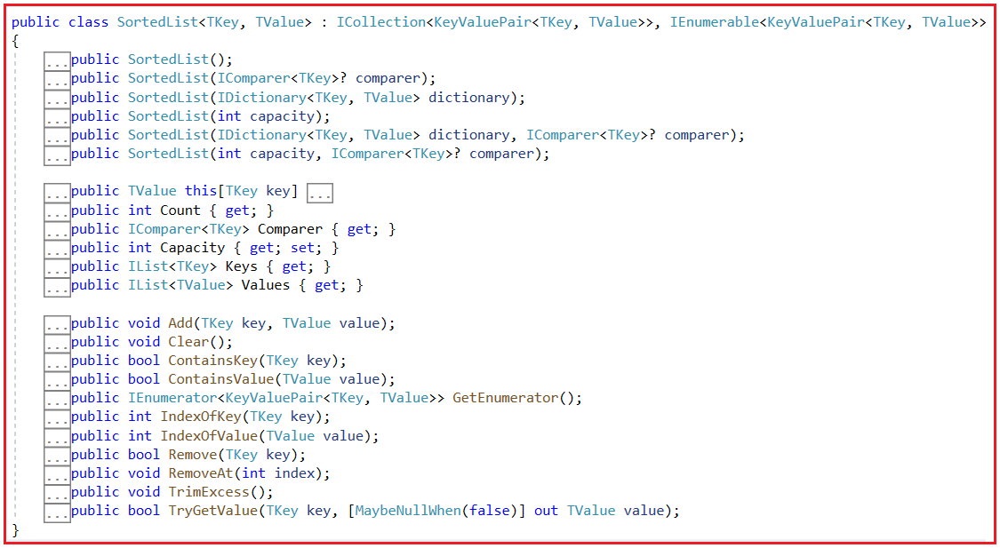
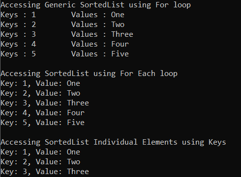
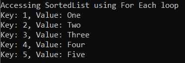
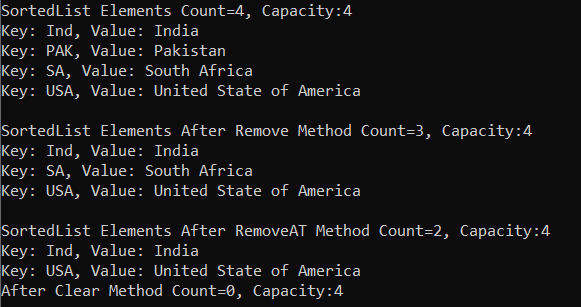
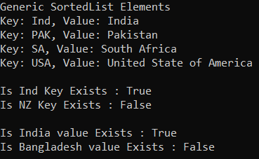
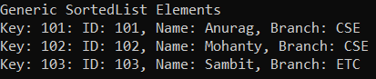
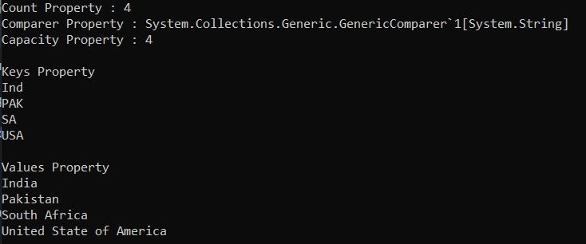

## **کلاس مجموعه Generic SortedList <TKey, TValue> در سی شارپ به همراه مثال**

در این مقاله، قصد دارم **کلاس کلکسیون Generic SortedList<TKey, TValue> را در سی شارپ** با مثال بررسی کنم. لطفاً مقاله قبلی ما را که در آن کلاس کلکسیون Generic HashSet<T> را در سی شارپ با مثال بررسی کردیم، مطالعه کنید. کلاس کلکسیون Generic SortedList<TKey, TValue> متعلق به فضای نام System.Collections.Generic است. در پایان این مقاله، اشاره‌گرهای زیر را با مثال درک خواهید کرد.

1. **SortedList<TKey, TValue> در سی شارپ چیست؟**
2. **متدها، ویژگی‌ها و سازنده‌ی کلاس مجموعه‌ی Generic SortedList<TKey, TValue> در سی‌شارپ**
3. **چگونه یک مجموعه SortedList<TKey, TValue> در سی شارپ ایجاد کنیم؟**
4. **چگونه عناصر را به یک مجموعه Generic SortedList در سی شارپ اضافه کنیم؟**
5. **چگونه در سی شارپ به یک مجموعه Generic SortedList دسترسی پیدا کنیم؟**
6. **چگونه عناصر را از یک مجموعه Generic SortedList در C# حذف کنیم؟**
7. **چگونه در دسترس بودن جفت‌های کلید/مقدار را در یک مجموعه Generic SortedList در C# بررسی کنیم؟**
8. **مجموعه Generic SortedList با نوع پیچیده در سی شارپ**
9. **تفاوت‌های بین SortedList<TKey, TValue> و SortedDictionary<TKey, TValue> در سی شارپ چیست؟**
10. **چه زمانی از مجموعه Generic SortedList استفاده کنیم؟**

##### **SortedList<TKey, TValue> در سی شارپ چیست؟**

کلاس مجموعه Generic SortedList<TKey, TValue> در سی شارپ، مجموعه‌ای از جفت‌های کلید/مقدار را نشان می‌دهد که بر اساس کلیدهای مبتنی بر پیاده‌سازی IComparer مرتبط، مرتب شده‌اند. به طور پیش‌فرض، جفت‌های کلید/مقدار را به ترتیب صعودی مرتب می‌کند. برای مثال، اگر کلیدها از نوع داده‌های اولیه باشند، مجموعه را به ترتیب صعودی کلیدها مرتب می‌کند و اگر کلیدها از نوع رشته باشند، عنصر را بر اساس حروف الفبا مرتب می‌کند.

با کمک یک کلید، می‌توانیم به راحتی عناصر را از مجموعه SortedList جستجو یا حذف کنیم. مجموعه عمومی SortedList می‌تواند یا با استفاده از کلیدها یا با استفاده از اندیس انتگرالی قابل دسترسی باشد.

در سی شارپ، مجموعه SortedList<TKey, TValue> به ما امکان ذخیره مقادیر تکراری را می‌دهد، اما کلیدها باید منحصر به فرد باشند و نمی‌توانند تهی (null) باشند. اندازه SortedList به صورت پویا تغییر می‌کند، بنابراین می‌توانید بر اساس نیازهای برنامه خود، عناصری را به مجموعه SortedList اضافه یا حذف کنید.

##### **متدها، ویژگی‌ها و سازنده‌ی کلاس مجموعه‌ی Generic SortedList<TKey, TValue> در سی‌شارپ:**

اگر به تعریف کلاس Generic SortedList<TKey, TValue> Collection بروید، شکل زیر را مشاهده خواهید کرد.



##### **چگونه یک مجموعه SortedList<TKey, TValue> در سی شارپ ایجاد کنیم؟**

کلاس Generic SortedList<TKey, TValue> Collection در سی شارپ شش سازنده زیر را ارائه می‌دهد که می‌توانیم از آنها برای ایجاد یک نمونه از SortedList استفاده کنیم.

1. **SortedList():** این تابع یک نمونه جدید از کلاس System.Collections.Generic.SortedList را که خالی است، ظرفیت اولیه پیش‌فرض را دارد و از System.Collections.Generic.IComparer پیش‌فرض استفاده می‌کند، مقداردهی اولیه می‌کند.
2. **SortedList(IComparer<TKey> comparer):** این تابع یک نمونه جدید از کلاس System.Collections.Generic.SortedList را مقداردهی اولیه می‌کند که خالی است، ظرفیت اولیه پیش‌فرض را دارد و از System.Collections.Generic.IComparer مشخص شده استفاده می‌کند. پارامتر comparer، پیاده‌سازی System.Collections.Generic.IComparer را برای استفاده هنگام مقایسه کلیدها مشخص می‌کند. -or- برای استفاده از System.Collections.Generic.Compare برای نوع کلید، null را انتخاب کنید.
3. **دیکشنری SortedList(IDictionary<TKey, TValue>):** این دیکشنری یک نمونه جدید از کلاس System.Collections.Generic.SortedList را مقداردهی اولیه می‌کند که شامل عناصر کپی شده از System.Collections.Generic.IDictionary مشخص شده است، ظرفیت کافی برای جای دادن تعداد عناصر کپی شده را دارد و از System.Collections.Generic.IComparer پیش‌فرض استفاده می‌کند. دیکشنری پارامتر، System.Collections.Generic.IDictionary را مشخص می‌کند که عناصر آن در System.Collections.Generic.SortedList جدید کپی می‌شوند.
4. **SortedList(int capacity):** این تابع یک نمونه جدید از کلاس System.Collections.Generic.SortedList را که خالی است، ظرفیت اولیه مشخص شده را دارد و از System.Collections.Generic.IComparer پیش‌فرض استفاده می‌کند، مقداردهی اولیه می‌کند. پارامتر capacity تعداد اولیه عناصری را که System.Collections.Generic.SortedList می‌تواند شامل شود، مشخص می‌کند.
5. **public SortedList(IDictionary<TKey, TValue> dictionary, IComparer<TKey>? comparer):** این متد یک نمونه جدید از کلاس System.Collections.Generic.SortedList را مقداردهی اولیه می‌کند که شامل عناصر کپی شده از System.Collections.Generic.IDictionary مشخص شده است، ظرفیت کافی برای جای دادن تعداد عناصر کپی شده را دارد و از System.Collections.Generic.IComparer مشخص شده استفاده می‌کند. Parameter comparer پیاده‌سازی System.Collections.Generic.IComparer را برای استفاده هنگام مقایسه کلیدها مشخص می‌کند. -or- برای استفاده از System.Collections.Generic.Comparer پیش‌فرض برای نوع کلید. Parameter dictionary، System.Collections.Generic.IDictionary را مشخص می‌کند که عناصر آن در System.Collections.Generic.SortedList جدید کپی می‌شوند.
6. **SortedList(int capacity, IComparer<TKey>? comparer):** این تابع یک نمونه جدید از کلاس System.Collections.Generic.SortedList را مقداردهی اولیه می‌کند که خالی است، ظرفیت اولیه مشخص شده را دارد و از System.Collections.Generic.IComparer مشخص شده استفاده می‌کند. مقایسه‌کننده پارامتر، پیاده‌سازی System.Collections.Generic.IComparer را برای استفاده هنگام مقایسه کلیدها مشخص می‌کند. -or- برای استفاده از System.Collections.Generic.Comparer پیش‌فرض برای نوع کلید. ظرفیت پارامتر، تعداد اولیه عناصری را که System.Collections.Generic.SortedList می‌تواند شامل باشد، مشخص می‌کند.

بیایید ببینیم چگونه می‌توان یک مجموعه SortedList<TKey, TValue> با استفاده از سازنده SortedList() در سی شارپ ایجاد کرد:

**مرحله ۱:**  
از آنجایی که کلاس Collection مربوط به SortedList<TKey, TValue> متعلق به فضای نام System.Collections.Generic است، بنابراین ابتدا باید فضای نام System.Collections.Generic را به صورت زیر در برنامه خود وارد کنیم:  
**با استفاده از System.Collections.Generic؛**

**مرحله ۲:**  
در مرحله بعد، باید با استفاده از سازنده ()SortedList به صورت زیر، یک نمونه از کلاس مجموعه SortedList<TKey, TValue> ایجاد کنیم:  
**SortedList<TKey, TValue> sortedListName = new SortedList<TKey, TValue>();**

##### **چگونه عناصر را به یک مجموعه Generic SortedList در سی شارپ اضافه کنیم؟**

اگر می‌خواهید یک جفت کلید/مقدار را به یک مجموعه Generic SortedList اضافه کنید، باید از متد Add() که توسط کلاس Generic SortedList ارائه شده است، استفاده کنید.

- **Add(TKey key, TValue value):** متد Add(TKey key, TValue value) برای اضافه کردن یک عنصر با کلید و مقدار مشخص شده به Generic SortedList استفاده می‌شود. در اینجا، پارامتر key، کلید عنصری را که باید اضافه شود و پارامتر value، عنصری را که باید اضافه شود، مشخص می‌کند. مقدار می‌تواند برای انواع ارجاعی null باشد. اگر کلید null باشد، خطای ArgumentNullException رخ می‌دهد و اگر عنصری با همان کلید از قبل در Generic SortedList وجود داشته باشد، خطای ArgumentException رخ می‌دهد.

برای مثال، در اینجا ما یک SortedList ژنریک با مشخص کردن کلید به عنوان یک عدد صحیح و مقدار به عنوان یک رشته ایجاد می‌کنیم.  
**\` ...**  
**تابع ()genericSortedList.Add(1, “یک”) را اجرا کنید.**  
**‎genericSortedList.Add(3, “سه”);**  
**تابع ()genericSortedList.Add(2, “دو”) را اجرا کنید.**  
دستور زیر هنگام ارسال کلید به عنوان null، خطای زمان کامپایل به ما می‌دهد.  
**genericSortedList.Add(null, “چهار”); (اضافه کردن لیست مرتب شده عمومی، null، “چهار”)**  
دستور زیر خطای ArgumentException را صادر می‌کند که می‌گوید **ورودی با همین کلید از قبل وجود دارد،** زیرا ما کلید ۲ را که از قبل در مجموعه وجود دارد، ارسال می‌کنیم.  
**‎genericSortedList.Add(2, “هر مقداری”);‎**

از آنجایی که این کلاس دارای متد Add است، می‌توانید جفت‌های کلید/مقدار را با استفاده از Collection Initializer به صورت زیر در Generic SortedList Collection ذخیره کنید.  
**SortedList<int, string> genericSortedList = new SortedList<int, string>**  
**{**  
**{۱، «یک»}،**  
**{۳، «سه»}،**  
**{۲، «دو»}**  
**};**

##### **چگونه در سی شارپ به یک مجموعه Generic SortedList دسترسی پیدا کنیم؟**

ما می‌توانیم به جفت‌های کلید/مقدار مجموعه Generic SortedList در سی شارپ با استفاده از سه روش مختلف دسترسی پیدا کنیم. این روش‌ها به شرح زیر هستند:

###### **استفاده از حلقه for برای دسترسی به مجموعه Generic SortedList در سی شارپ:**

از آنجایی که مجموعه SortedList دارای Indexer است، می‌توانید از یک حلقه for برای دسترسی به جفت‌های کلید/مقدار، همانطور که در زیر نشان داده شده است، استفاده کنید.  
**برای (int i = 0; i < genericSortedList.Count; i++)**  
**{**  
**Console.WriteLine(“Keys : ” + genericSortedList.Keys[i] + “\\tValues : ” + genericSortedList.Values[i]);**  
**}**

###### **استفاده از اندیس برای دسترسی به مجموعه Generic SortedList در سی شارپ:**

شما می‌توانید با استفاده از اندیس به مقادیر تکی مجموعه Generic SortedList در سی‌شارپ دسترسی پیدا کنید. در این حالت، باید کلید را به عنوان پارامتر برای یافتن مقدار مربوطه ارسال کنیم. برای مثال،  
**Console.WriteLine($”مقدار کلید ۲ برابر است با:{ genericSortedList[2]}”);**  
**رشته val = (رشته)genericSortedList[3];**  
**خط نوشتن کنسول (مقدار)؛**

###### **استفاده از حلقه for-each برای دسترسی به مجموعه Generic SortedList در سی شارپ:**

همچنین می‌توانید از یک حلقه for-each برای دسترسی به جفت‌های کلید/مقدار مجموعه Generic SortedList در سی‌شارپ به شرح زیر استفاده کنید.  
**foreach (یک آیتم از نوع <KeyValuePair<int, string در genericSortedList)**  
**{**  
**Console.WriteLine($”کلید: { item.Key}, مقدار: { item.Value}”);**  
**}**

**نکته:** می‌توانید عناصر را به صورت تصادفی به مجموعه SortedList اضافه کنید. اما آن‌ها بر اساس کلید و به ترتیب صعودی در مجموعه ذخیره خواهند شد.

##### **مثالی برای درک نحوه ایجاد یک مجموعه Generic SortedList و افزودن عناصر در سی شارپ:**

برای درک بهتر نحوه ایجاد یک مجموعه Generic SortedList و نحوه اضافه کردن عناصر به مجموعه و نحوه دسترسی به عناصر از مجموعه، لطفاً به مثال زیر نگاهی بیندازید.

```csharp
using System;
using System.Collections.Generic;

namespace GenericSortedListDemo
{
    class Program
    {
        static void Main()
        {
            //Creating Generic SortedList Collection
            SortedList<int, string> genericSortedList = new SortedList<int, string>();

            //Adding Elements to SortedList Collection using Add Method in Random Order
            genericSortedList.Add(1, "One");
            genericSortedList.Add(5, "Five");
            genericSortedList.Add(4, "Four");
            genericSortedList.Add(2, "Two");
            genericSortedList.Add(3, "Three");

            //You cannot pass null as a key
            //genericSortedList.Add(null, "Ten"); //Compile-Time Error

            //Duplicate Key not allowed
            //System.ArgumentException: 'An entry with the same key already exists.'
            //genericSortedList.Add(2, "Any Value");

            //Accessing Generic SortedList Collection using For loop
            Console.WriteLine("Accessing Generic SortedList using For loop");
            for (int i = 0; i < genericSortedList.Count; i++)
            {
                Console.WriteLine("Keys : " + genericSortedList.Keys[i] + "\tValues : " + genericSortedList.Values[i]);
            }

            //Accessing Generic SortedList Collection using For Each loop
            Console.WriteLine("\nAccessing SortedList using For Each loop");
            foreach (KeyValuePair<int, string> item in genericSortedList)
            {
                Console.WriteLine($"Key: { item.Key}, Value: { item.Value}");
            }

            //Accessing Generic SortedList Individual Elements using Keys
            Console.WriteLine("\nAccessing SortedList Individual Elements using Keys");
            Console.WriteLine($"Key: 1, Value: {genericSortedList[1]}");
            Console.WriteLine($"Key: 2, Value: {genericSortedList[2]}");
            Console.WriteLine($"Key: 3, Value: {genericSortedList[3]}");

            Console.ReadKey();
        }
    }
}
```

###### **خروجی:**



لطفاً توجه داشته باشید که در اینجا، خروجی را بر اساس ترتیب صعودی کلیدها هنگام دسترسی به عناصر، چه با استفاده از حلقه for و چه با استفاده از حلقه For Each، دریافت می‌کنیم.

##### **اضافه کردن عناصر به مجموعه Generic SortedList با استفاده از مقداردهنده اولیه مجموعه در سی شارپ:**

از آنجایی که کلاس Generic SortedList دارای متد Add است که TKey و TValue را به عنوان پارامتر می‌گیرد، می‌توانیم از مقداردهی اولیه مجموعه برای مقداردهی اولیه مجموعه در حین ایجاد آن استفاده کنیم. در مثال زیر، ما به جای متد Add از سینتکس Collection Initializer برای اضافه کردن جفت‌های کلید-مقدار به مجموعه Generic SortedList در C# استفاده می‌کنیم.

```csharp
using System;
using System.Collections.Generic;

namespace GenericSortedListDemo
{
    class Program
    {
        static void Main()
        {
            //Creating Generic SortedList Collection using Collection Initializer
            SortedList<int, string> genericSortedList = new SortedList<int, string>
            {
                { 1, "One" },
                { 5, "Five" },
                { 4, "Four" },
                { 2, "Two" },
                { 3, "Three" }
            };

            //Accessing Generic SortedList Collection using For Each loop
            Console.WriteLine("Accessing SortedList using For Each loop"); 
            foreach (KeyValuePair<int, string> item in genericSortedList)
            {
                Console.WriteLine($"Key: { item.Key}, Value: { item.Value}");
            }

            Console.ReadKey();
        }
    }
}
```

###### **خروجی:**



##### **چگونه عناصر را از یک مجموعه Generic SortedList در C# حذف کنیم؟**

کلاس Generic SortedList Collection در سی شارپ، متدهای زیر را برای حذف عناصر از SortedList ارائه می‌دهد.

1. **Remove(TKey key):** این متد برای حذف عنصر با کلید مشخص شده از System.Collections.Generic.SortedList استفاده می‌شود. پارامتر key عنصری را که باید حذف شود مشخص می‌کند. اگر عنصر با موفقیت حذف شود، مقدار true و در غیر این صورت، مقدار false را برمی‌گرداند. این متد همچنین اگر کلید در Generic SortedList اصلی یافت نشود، مقدار false را برمی‌گرداند.
2. **RemoveAt(int index):** این متد برای حذف عنصر در اندیس مشخص شده از یک Generic SortedList استفاده می‌شود. پارامتر index عنصری را که باید حذف شود مشخص می‌کند. این اندیس بر اساس 0 است.
3. **Clear():** این متد برای حذف تمام عناصر از یک مجموعه Generic SortedList استفاده می‌شود.

بیایید مثالی بزنیم تا سه متد بالا از کلاس Generic SortedList Collection در سی شارپ را درک کنیم. لطفاً به مثال زیر نگاهی بیندازید.

```csharp
using System;
using System.Collections.Generic;

namespace GenericSortedListDemo
{
    class Program
    {
        static void Main()
        {
            //Creating a Generic SortedList Collection Object
            //Here both the keys and values are of string type
            SortedList<string, string> genericSortedList = new SortedList<string, string>();

            //Adding Elements to Generic SortedList Collection using Add Method
            genericSortedList.Add("Ind", "India");
            genericSortedList.Add("USA", "United State of America");
            genericSortedList.Add("SA", "South Africa");
            genericSortedList.Add("PAK", "Pakistan");

            //Accessing Generic SortedList Collection using For Each loop
            Console.WriteLine($"SortedList Elements Count={genericSortedList.Count}, Capacity:{genericSortedList.Capacity}"); 
            foreach (KeyValuePair<string, string> item in genericSortedList)
            {
                Console.WriteLine($"Key: { item.Key}, Value: { item.Value}");
            }

            // Remove value having key PAK Using Remove() method
            genericSortedList.Remove("PAK");
            Console.WriteLine($"\nSortedList Elements After Remove Method Count={genericSortedList.Count}, Capacity:{genericSortedList.Capacity}");
            foreach (KeyValuePair<string, string> item in genericSortedList)
            {
                Console.WriteLine($"Key: { item.Key}, Value: { item.Value}");
            }

            // Remove element at index 1 Using RemoveAt() method
            genericSortedList.RemoveAt(1);
            Console.WriteLine($"\nSortedList Elements After RemoveAT Method Count={genericSortedList.Count}, Capacity:{genericSortedList.Capacity}");
            foreach (KeyValuePair<string, string> item in genericSortedList)
            {
                Console.WriteLine($"Key: { item.Key}, Value: { item.Value}");
            }

            // Remove all key/value pairs Using Clear method
            genericSortedList.Clear();
            Console.WriteLine($"After Clear Method Count={genericSortedList.Count}, Capacity:{genericSortedList.Capacity}");

            Console.ReadKey();
        }
    }
}
```

###### **خروجی:**



##### **چگونه در دسترس بودن جفت‌های کلید/مقدار را در یک مجموعه Generic SortedList در C# بررسی کنیم؟**

اگر می‌خواهید بررسی کنید که آیا جفت کلید/مقدار در مجموعه Generic SortedList در سی شارپ وجود دارد یا خیر، می‌توانید از متدهای زیر که توسط کلاس Generic SortedList ارائه می‌شوند، بسته به نیاز خود استفاده کنید، یعنی اینکه آیا می‌خواهید یک عنصر را بر اساس کلید یا یک عنصر را بر اساس مقدار جستجو کنید.

1. **ContainsKey(TKey key):** این متد برای تعیین اینکه آیا مجموعه Generic SortedList حاوی یک کلید خاص است یا خیر، استفاده می‌شود. پارامتر key برای قرار دادن شیء Generic SortedList. اگر مجموعه Generic SortedList حاوی عنصری با کلید مشخص شده باشد، مقدار true و در غیر این صورت، مقدار false را برمی‌گرداند. اگر کلید null باشد، خطای System.ArgumentNullException رخ می‌دهد.
2. **ContainsValue(TValue value):** این متد برای تعیین اینکه آیا یک Generic SortedList حاوی یک مقدار خاص است یا خیر، استفاده می‌شود. مقدار پارامتری که باید در مجموعه Generic SortedList قرار گیرد. این مقدار می‌تواند برای انواع مرجع null باشد. اگر Generic SortedList Collection حاوی عنصری با مقدار مشخص شده باشد، مقدار true را برمی‌گرداند؛ در غیر این صورت، مقدار false را برمی‌گرداند.

بگذارید این موضوع را با یک مثال درک کنیم. مثال زیر نحوه استفاده از هر دو متد ContainsKey و ContainsValue از کلاس مجموعه Generic SortedList در سی شارپ را نشان می‌دهد.

```csharp
using System;
using System.Collections.Generic;

namespace GenericSortedListDemo
{
    class Program
    {
        static void Main()
        {
            //Creating a Generic SortedList Collection Object
            //Here both the keys and values are of string type
            SortedList<string, string> genericSortedList = new SortedList<string, string>
            {
                { "Ind", "India" },
                { "USA", "United State of America" },
                { "SA", "South Africa" },
                { "PAK", "Pakistan" }
            };

            //Accessing Generic SortedList Collection using For Each loop
            Console.WriteLine("Generic SortedList Elements"); 
            foreach (KeyValuePair<string, string> item in genericSortedList)
            {
                Console.WriteLine($"Key: { item.Key}, Value: { item.Value}");
            }

            //Checking the key using the ContainsKey methid
            Console.WriteLine("\nIs Ind Key Exists : " + genericSortedList.ContainsKey("Ind"));
            Console.WriteLine("Is NZ Key Exists : " + genericSortedList.ContainsKey("NZ"));
            //Checking the value using the ContainsValue method
            Console.WriteLine("\nIs India value Exists : " + genericSortedList.ContainsValue("India"));
            Console.WriteLine("Is Bangladesh value Exists : " + genericSortedList.ContainsValue("Bangladesh"));

            Console.ReadKey();
        }
    }
}
```

###### **خروجی:**



##### **مجموعه Generic SortedList با نوع پیچیده در سی شارپ:**

تاکنون، ما از نوع داده داخلی با کلاس SortedList استفاده کرده‌ایم. حال، بیایید بیشتر پیش برویم و ببینیم چگونه می‌توان یک مجموعه Generic SortedList از انواع Complex ایجاد کرد. بیایید یک کلاس به نام Student ایجاد کنیم و سپس مجموعه‌ای از انواع Student ایجاد کنیم و عناصر تکراری را نیز اضافه کنیم.

```csharp
using System;
using System.Collections.Generic;

namespace GenericsDemo
{
    class Program
    {
        static void Main()
        {
            //Here we are creating a sortedlist whose key is int and value is Student
            SortedList<int, Student> genericSortedList = new SortedList<int, Student>
            {
                { 101, new Student(){ ID = 101, Name ="Anurag", Branch="CSE"} },
                { 102, new Student(){ ID = 102, Name ="Mohanty", Branch="CSE"}},
                { 103, new Student(){ ID = 103, Name ="Sambit", Branch="ETC"}}
            };

            //The following Statement will give you Runtime Exception as the key is already exists
            //genericSortedList.Add(101, new Student() { ID = 101, Name = "Anurag", Branch = "CSE" });

            //Accessing Generic SortedList Collection using For Each loop
            Console.WriteLine("Generic SortedList Elements"); 
            foreach (KeyValuePair<int, Student> item in genericSortedList)
            {
                Console.WriteLine($"Key: { item.Key}: ID: { item.Value.ID}, Name: { item.Value.Name}, Branch: { item.Value.Branch}");
            }

            Console.ReadKey();
        }
    }

    public class Student
    {
        public int ID { get; set; }
        public string Name { get; set; }
        public string Branch { get; set; }
    }
}
```

###### **خروجی:**



##### **ویژگی‌های کلاس Generic SortedList Collection در سی شارپ:**

1. **تعداد :** تعداد جفت‌های کلید/مقدار موجود در مجموعه Generic SortedList را برمی‌گرداند.
2. **Comparer :** مقدار System.IComparable را برای شیء Generic SortedList فعلی برمی‌گرداند.
3. **Capacity :** برای دریافت یا تنظیم تعداد عناصری که Generic SortedList می‌تواند شامل شود، استفاده می‌شود. این تابع تعداد عناصری را که Generic SortedList می‌تواند شامل شود، برمی‌گرداند.
4. **کلیدها :** مجموعه‌ای شامل کلیدهای موجود در Generic SortedList را به ترتیب مرتب‌شده برمی‌گرداند.
5. **مقادیر :** مجموعه‌ای شامل مقادیر موجود در Generic SortedList را برمی‌گرداند.

##### **مثالی برای درک** **Generic SortedList در سی شارپ** **ویژگی‌های کلاس مجموعه**

```csharp
using System;
using System.Collections.Generic;

namespace GenericsDemo
{
    class Program
    {
        static void Main()
        {
            SortedList<string, string> genericSortedList = new SortedList<string, string>
            {
                { "Ind", "India" },
                { "USA", "United State of America" },
                { "SA", "South Africa" },
                { "PAK", "Pakistan" }
            };

            Console.WriteLine($"Count Property : {genericSortedList.Count}");
            Console.WriteLine($"Comparer Property : {genericSortedList.Comparer}");
            Console.WriteLine($"Capacity Property : {genericSortedList.Capacity}");

            Console.WriteLine("\nKeys Property");
            foreach (var item in genericSortedList.Keys)
            {
                Console.WriteLine(item);
            }

            Console.WriteLine("\nValues Property");
            foreach (var item in genericSortedList.Values)
            {
                Console.WriteLine(item);
            }
            Console.ReadKey();
        }
    }
}
```

###### **خروجی:**



##### **تفاوت‌های بین SortedList<TKey, TValue> و SortedDictionary<TKey, TValue> در سی شارپ چیست؟**

تفاوت‌های بین SortedList<TKey, TValue> و SortedDictionary<TKey, TValue> در سی‌شارپ به شرح زیر است:

1. مجموعه SortedList<TKey, TValue> حافظه کمتری نسبت به مجموعه SortedDictionary<TKey, TValue> مصرف می‌کند.
2. مجموعه‌ی SortedDictionary<TKey, TValue> در مقایسه با مجموعه‌ی SortedList<TKey, TValue> عملیات درج و حذف سریع‌تری برای داده‌های نامرتب دارد.
3. اگر عناصر به طور همزمان از داده‌های مرتب‌شده پر شوند، مجموعه‌ی SortedList<TKey, TValue> سریع‌تر از مجموعه‌ی SortedDictionary<TKey, TValue> عمل می‌کند.
4. SortedList از بازیابی کارآمد کلیدها و مقادیر بر اساس شاخص پشتیبانی می‌کند، چیزی که SortedDictionary از آن پشتیبانی نمی‌کند.
5. مجموعه‌ی SortedList<TKey, TValue> اجازه‌ی درج مقادیر تهی و تکراری برای کلیدها را نمی‌دهد. هر کلید در یک SortedList باید منحصر به فرد باشد، در غیر این صورت خطای ArgumentException رخ می‌دهد.

**نکته:** زبان برنامه‌نویسی سی‌شارپ از هر دو مجموعه SortedList عمومی و غیر عمومی پشتیبانی می‌کند. توصیه می‌شود از SortedList<TKey, TValue> عمومی استفاده شود زیرا در مقایسه با SortedList غیر عمومی، عملکرد سریع‌تری دارد و احتمال خطای کمتری دارد.

##### **خلاصه کلاس مجموعه Generic SortedList<TKey, TValue>:**

نکات مهمی که باید در مورد لیست مرتب شده در سی شارپ به خاطر داشته باشید در ادامه آمده است.

1. مجموعه Generic SortedList برای ذخیره مجموعه‌ای از جفت‌های کلید/مقدار که بر اساس کلید و بر اساس پیاده‌سازی مرتبط IComparer<T> مرتب شده‌اند، استفاده می‌شود.
2. مجموعه Generic SortedList به ما امکان ذخیره مقادیر تکراری را می‌دهد، اما کلیدها باید منحصر به فرد باشند تا مقادیر موجود در لیست مرتب شده شناسایی شوند. علاوه بر این، کلید نمی‌تواند تهی باشد اما مقدار می‌تواند برای یک نوع مرجع تهی باشد.
3. شما می‌توانید با استفاده از کلیدها یا با حلقه‌های for و for each به عناصر Generic SortedList دسترسی پیدا کنید. در حلقه for-each، باید از KeyValuePair<TKey, TValue> برای دریافت جفت‌های کلید/مقدار از SortedList استفاده کنیم.
