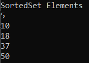
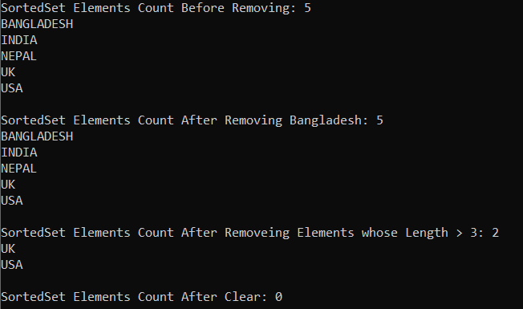
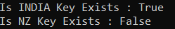
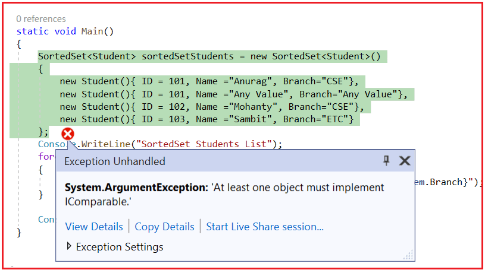
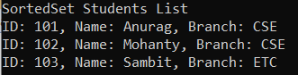
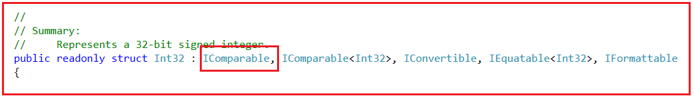
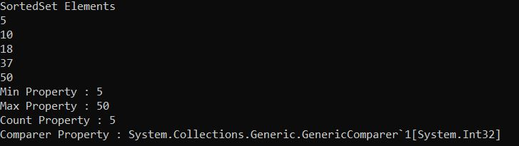

## **کلاس مجموعه عمومی SortedSet<T> در سی شارپ به همراه مثال**

در این مقاله، قصد دارم **کلاس مجموعه Generic SortedSet<T> را در سی شارپ** با مثال بررسی کنم. لطفاً مقاله قبلی ما را که در آن کلاس مجموعه Generic SortedList<TKey, TValue> را در سی شارپ با مثال بررسی کردیم، مطالعه کنید. در پایان این مقاله، اشاره‌گرهای زیر را با مثال‌ها خواهید فهمید.

1. **SortedSet<T> در سی شارپ چیست؟**
2. **چگونه یک مجموعه Generic SortedSet در سی شارپ ایجاد کنیم؟**
3. **چگونه عناصر را به یک مجموعه SortedSet در سی شارپ اضافه کنیم؟**
4. **چگونه در سی شارپ به یک مجموعه Generic SortedSet<T> دسترسی پیدا کنیم؟**
5. **چگونه عناصر را از یک مجموعه Generic SortedSet<T> در C# حذف کنیم؟**
6. **چگونه در سی شارپ، موجود بودن یک عنصر در یک SortedSet را بررسی کنیم؟**
7. **عملیات تنظیم روی کلاس Generic SortedSet<T> Collection در سی شارپ**
8. **مجموعه عمومی SortedSet با نوع پیچیده در سی شارپ**
9. **چگونه یک لیست را در یک SortedSet در سی شارپ کپی کنیم؟**
10. **چه زمانی از کلاس مجموعه SortedSet<T> در سی شارپ استفاده کنیم؟**

##### **مجموعه Generic SortedSet<T> در سی شارپ چیست؟**

کلاس مجموعه Generic SortedSet<T> در سی شارپ برای ذخیره، حذف یا مشاهده عناصر استفاده می‌شود. مجموعه SortedSet عناصر را به ترتیب مرتب شده ذخیره می‌کند. این بدان معناست که عنصر را به ترتیب صعودی ذخیره می‌کند و همچنین عناصر تکراری را ذخیره نمی‌کند. بنابراین، اگر می‌خواهید فقط عناصر منحصر به فرد را به ترتیب صعودی ذخیره کنید، توصیه می‌شود از مجموعه SortedSet استفاده کنید. این مجموعه از نوع مجموعه عمومی است و از این رو به فضای نام System.Collections.Generic تعلق دارد.

همچنین بسیاری از عملیات ریاضی مجموعه، مانند اشتراک، اجتماع و تفاضل را فراهم می‌کند. این یک مجموعه پویا است، به این معنی که اندازه SortedSet با اضافه شدن عناصر جدید به طور خودکار افزایش می‌یابد.

##### **چگونه یک مجموعه Generic SortedSet در سی شارپ ایجاد کنیم؟**

کلاس Generic SortedSet Collection در سی شارپ پنج سازنده ارائه می‌دهد که می‌توانیم از آنها برای ایجاد یک نمونه از SortedSet استفاده کنیم. این سازنده‌ها به شرح زیر هستند:

1. **SortedSet() :** یک نمونه جدید از کلاس Generic SortedSet را مقداردهی اولیه می‌کند.
2. **SortedSet(IComparer<T> comparer) :** یک نمونه جدید از کلاس Generic SortedSet را که از یک مقایسه‌گر مشخص استفاده می‌کند، مقداردهی اولیه می‌کند.
3. **SortedSet(IEnumerable<T> collection) :** این متد یک نمونه جدید از کلاس Generic SortedSet را مقداردهی اولیه می‌کند که شامل عناصر کپی شده از یک مجموعه شمارش‌پذیر مشخص است.
4. **SortedSet(IEnumerable<T> collection, IComparer<T> comparer) :** این تابع یک نمونه جدید از کلاس Generic SortedSet را مقداردهی اولیه می‌کند که شامل عناصر کپی شده از یک مجموعه شمارش‌پذیر مشخص است و از یک مقایسه‌کننده مشخص استفاده می‌کند.
5. **SortedSet(SerializationInfo info, StreamingContext context) :** این متد یک نمونه جدید از کلاس Generic SortedSet را که حاوی داده‌های سریالی شده است، مقداردهی اولیه می‌کند. پارامتر info شیء‌ای را مشخص می‌کند که حاوی اطلاعات مورد نیاز برای سریالی کردن شیء Generic SortedSet است و پارامتر context ساختاری را مشخص می‌کند که شامل منبع و مقصد جریان سریالی شده مرتبط با شیء Generic SortedSet است.

بیایید ببینیم چگونه می‌توان با استفاده از سازنده‌ی SortedSet() در سی‌شارپ، یک نمونه از SortedSet ایجاد کرد.

**مرحله ۱:**  
از آنجایی که کلاس SortedSet<T> متعلق به فضای نام System.Collections.Generic است، بنابراین ابتدا باید فضای نام System.Collections.Generic را به صورت زیر در برنامه خود وارد کنیم:  
**با استفاده از System.Collections.Generic؛**

**مرحله ۲:**  
در مرحله بعد، باید با استفاده از سازنده (constructor) SortedSet() به صورت زیر یک نمونه از کلاس SortedSet ایجاد کنیم:  
**SortedSet<Type_of_SortedSet> sortedSet = new SortedSet<Type_of_SortedSet>();**

##### **چگونه عناصر را به یک مجموعه SortedSet در سی شارپ اضافه کنیم؟**

اگر می‌خواهید عناصری را به مجموعه SortedSet خود اضافه کنید، باید از متد Add() زیر از کلاس SortedSet استفاده کنید.

1. **Add(T item) :** این متد برای اضافه کردن یک عنصر به مجموعه استفاده می‌شود و مقداری را برمی‌گرداند که نشان می‌دهد آیا با موفقیت اضافه شده است یا خیر. پارامتر item عنصری را که باید به مجموعه اضافه شود مشخص می‌کند. اگر عنصر به شیء SortedSet اضافه شود، مقدار true و در غیر این صورت، مقدار false را برمی‌گرداند.

در ادامه نحوه اضافه کردن عناصر با استفاده از متد Add از کلاس HashSet نشان داده شده است.  
**SortedSet<int> sortedSetNumbers = new SortedSet<int>();**  
**hashSetCountries.Add(10);**  
**hashSetCountries.Add(5);**  
**hashSetCountries.Add(50);**

حتی می‌توانیم عناصر را در مجموعه SortedSet با استفاده از Collection Initializer به شرح زیر ذخیره کنیم.  
**SortedSet<int> sortedSetNumbers = مجموعه مرتب‌شده جدید<int>**  
**{**  
**۱۰،**  
**۵،**  
**۵۰**  
**};**

##### **چگونه در سی شارپ به یک مجموعه Generic SortedSet<T> دسترسی پیدا کنیم؟**

می‌توانیم با استفاده از حلقه ForEach به صورت زیر به عناصر مجموعه SortedSet<T> در سی شارپ دسترسی پیدا کنیم:  
**foreach (متغیر آیتم در sortedSetNumbers)**  
**{**  
**خط نوشتن کنسول (مورد)؛**  
**}**

حتی می‌توانیم یک enumerator ایجاد کنیم که به صورت زیر روی SortedSet حلقه بزند.  
**SortedSet<int>.Enumerator em = sortedSetNumbers.GetEnumerator();**  
**در حالی که (em.MoveNext()) {**  
**متغیر `int val = em.Current;`**  
**خط نوشتن کنسول (مقدار)؛**  
**}**

##### **مثالی برای درک نحوه ایجاد یک شیء SortedSet و افزودن عناصر در C#:**

برای درک بهتر نحوه ایجاد یک مجموعه SortedSet<T> و نحوه اضافه کردن عناصر به یک SortedSet و نحوه دسترسی به عناصر یک SortedSet در C# با استفاده از ForEach، لطفاً به مثال زیر نگاهی بیندازید. در اینجا، ما مجموعه HashSet را از نوع int ایجاد کردیم. بنابراین، این مجموعه فقط مقادیر از نوع عدد صحیح را ذخیره می‌کند.

```csharp
using System;
using System.Collections.Generic;

namespace GenericsDemo
{
    class Program
    {
        static void Main()
        {
            //Creating an Instance of SortedSet class to store Integer values
            SortedSet<int> sortedSetNumbers = new SortedSet<int>();

            //Adding Elements to SortedSet using Add Method
            sortedSetNumbers.Add(10);
            sortedSetNumbers.Add(5);
            sortedSetNumbers.Add(50);
            sortedSetNumbers.Add(37);
            sortedSetNumbers.Add(18);
            sortedSetNumbers.Add(37);

            //Accessing the SortedSet Elements using For Each Loop
            Console.WriteLine("SortedSet Elements");
            foreach (var item in sortedSetNumbers)
            {
                Console.WriteLine(item);
            }

            Console.ReadKey();
        }
    }
}
```

اگر در کد بالا دقت کرده باشید، ما اعداد را به صورت تصادفی اضافه کرده‌ایم و همچنین عدد ۳۷ را دو بار اضافه کرده‌ایم. حال اگر کد بالا را اجرا کنید، خواهید دید که اعداد با حذف ورودی‌های تکراری به ترتیب صعودی ذخیره می‌شوند، یعنی همانطور که در تصویر زیر نشان داده شده است، عدد ۳۷ را فقط یک بار خواهید دید.



##### **استفاده از Enumerator برای پیمایش مجموعه SortedSet<T> در سی شارپ:**

متد SortedSet<T>.GetEnumerator برای دریافت یک شمارنده که از طریق یک شیء SortedSet تکرار می‌شود، استفاده می‌شود. این متد یک شیء SortedSet<T>.Enumerator برای شیء SortedSet<T> برمی‌گرداند. برای درک بهتر، لطفاً به مثال زیر نگاهی بیندازید. مثال زیر همان خروجی مثال قبلی را به شما می‌دهد. در اینجا، ما از Collection Initializer برای ایجاد و مقداردهی اولیه SortedSet استفاده می‌کنیم.

```csharp
using System;
using System.Collections.Generic;

namespace GenericsDemo
{
    class Program
    {
        static void Main()
        {
            //Creating an Instance of SortedSet and Adding Elements using Collection Initializer
            SortedSet<int> sortedSetNumbers = new SortedSet<int>
            {
                10,
                5,
                50,
                37,
                18,
                37
            };

            //Accessing the SortedSet Elements using Enumerator
            Console.WriteLine("SortedSet Elements");
            SortedSet<int>.Enumerator em = sortedSetNumbers.GetEnumerator();
            while (em.MoveNext())
            {
                int val = em.Current;
                Console.WriteLine(val);
            }

            Console.ReadKey();
        }
    }
}
```

##### **چگونه عناصر را از یک مجموعه Generic SortedSet<T> در C# حذف کنیم؟**

کلاس Generic SortedSet<T> Collection در سی شارپ، سه متد زیر را برای حذف عناصر از HashSet ارائه می‌دهد.

1. **Remove(T item):** این متد برای حذف عنصر مشخص شده از یک شیء SortedSet استفاده می‌شود. در اینجا، پارامتر item عنصری را که باید حذف شود مشخص می‌کند. اگر عنصر با موفقیت پیدا و حذف شود، مقدار true و در غیر این صورت، مقدار false را برمی‌گرداند. اگر عنصر در مجموعه Generic SortedSe یافت نشود، این متد مقدار false را برمی‌گرداند.
2. **RemoveWhere(Predicate<T> match):** این متد برای حذف تمام عناصری که با شرایط تعریف شده توسط predicate مشخص شده از یک مجموعه SortedSet مطابقت دارند، استفاده می‌شود. این متد تعداد عناصری را که از مجموعه SortedSet حذف شده‌اند، برمی‌گرداند. در اینجا، پارامتر match نماینده Predicate را مشخص می‌کند که شرایط عناصری را که باید حذف شوند، تعریف می‌کند.
3. **Clear() :** این متد برای حذف تمام عناصر از یک شیء SortedSet استفاده می‌شود.

بیایید مثالی بزنیم تا سه متد بالا از کلاس Generic SortedSet Collection در سی شارپ را درک کنیم. لطفاً به مثال زیر نگاهی بیندازید که در آن یک SortedSet از انواع رشته ایجاد کرده‌ایم.

```csharp
using System;
using System.Collections.Generic;

namespace GenericsDemo
{
    class Program
    {
        static void Main()
        {
            //Creating SortedSet and Adding Elements to SortedSet using Collection Initializer 
            SortedSet<string> sortedSetCountries = new SortedSet<string>()
            {
                "BANGLADESH",
                "NEPAL"
            };

            //Adding Elements to SortedSet using Add Method
            sortedSetCountries.Add("INDIA");
            sortedSetCountries.Add("USA");
            sortedSetCountries.Add("UK");

            Console.WriteLine($"SortedSet Elements Count Before Removing: {sortedSetCountries.Count}");
            foreach (var item in sortedSetCountries)
            {
                Console.WriteLine(item);
            }

            // Remove element Bangladesh from SortedSet Using Remove() method
            sortedSetCountries.Remove("Bangladesh");
            Console.WriteLine($"\nSortedSet Elements Count After Removing Bangladesh: {sortedSetCountries.Count}");
            foreach (var item in sortedSetCountries)
            {
                Console.WriteLine(item);
            }

            // Remove Element from SortedSet Using RemoveWhere() method where element length is > 3
            sortedSetCountries.RemoveWhere(x => x.Length > 3);
            Console.WriteLine($"\nSortedSet Elements Count After Removeing Elements whose Length > 3: {sortedSetCountries.Count}");
            foreach (var item in sortedSetCountries)
            {
                Console.WriteLine(item);
            }

            // Remove all Elements from SortedSet Using Clear method
            sortedSetCountries.Clear();
            Console.WriteLine($"\nSortedSet Elements Count After Clear: {sortedSetCountries.Count}");

            Console.ReadKey();
        }
    }
}
```

###### **خروجی:**



##### **چگونه در سی شارپ، موجود بودن یک عنصر در یک SortedSet را بررسی کنیم؟**

اگر می‌خواهید بررسی کنید که آیا یک عنصر در SortedSet وجود دارد یا خیر، می‌توانید از متد Contains() زیر از کلاس Generic SortedSet Collection در سی شارپ استفاده کنید.

1. **Contains(T item):** این متد برای تعیین اینکه آیا یک شیء SortedSet حاوی عنصر مشخص شده است یا خیر، استفاده می‌شود. پارامتر item عنصری را که باید در شیء SortedSet قرار گیرد، مشخص می‌کند. اگر شیء SortedSet حاوی عنصر مشخص شده باشد، مقدار true و در غیر این صورت، مقدار false را برمی‌گرداند.

بگذارید این موضوع را با یک مثال درک کنیم. مثال زیر نحوه استفاده از متد Contains() از کلاس Generic SortedSet Collection در سی شارپ را نشان می‌دهد.

```csharp
using System;
using System.Collections.Generic;

namespace GenericsDemo
{
    class Program
    {
        static void Main()
        {
            SortedSet<string> sortedSetCountries = new SortedSet<string>();
            //Adding Elements to SortedSet using Add Method
            sortedSetCountries.Add("INDIA");
            sortedSetCountries.Add("USA");
            sortedSetCountries.Add("UK");

            //Checking the key using the Contains methid
            Console.WriteLine("Is INDIA Key Exists : " + sortedSetCountries.Contains("INDIA"));
            Console.WriteLine("Is NZ Key Exists : " + sortedSetCountries.Contains("NZ"));
            Console.ReadKey();
        }
    }
}
```

###### **خروجی:**



##### **عملیات تنظیم روی کلاس Generic SortedSet<T> Collection در سی شارپ**

کلاس Generic SortedSet Collection در سی شارپ همچنین متدهایی را ارائه می‌دهد که می‌توانیم برای انجام عملیات مختلف مجموعه از آنها استفاده کنیم. این متدها به شرح زیر هستند.

1. **UnionWith(IEnumerable<T> other):** این متد برای تغییر شیء SortedSet فعلی به منظور شامل کردن تمام عناصری که در خودش، مجموعه مشخص شده یا هر دو وجود دارند، استفاده می‌شود. در اینجا، پارامتر other، مجموعه مورد مقایسه با شیء SortedSet فعلی را مشخص می‌کند. اگر پارامتر other تهی باشد، با خطای ArgumentNullException مواجه خواهیم شد.
2. **IntersectWith(IEnumerable<T> other):** این متد برای تغییر شیء SortedSet فعلی به گونه‌ای استفاده می‌شود که فقط شامل عناصری باشد که در آن شیء و در مجموعه مشخص شده وجود دارند. در اینجا، پارامتر other، مجموعه‌ای را که باید با شیء SortedSet فعلی مقایسه شود، مشخص می‌کند. اگر پارامتر other تهی باشد، با خطای ArgumentNullException مواجه خواهیم شد.
3. **ExceptWith(IEnumerable<T> other):** این متد برای حذف تمام عناصر موجود در مجموعه مشخص شده از شیء SortedSet فعلی استفاده می‌شود. در اینجا، پارامتر other مجموعه اقلامی را که باید از شیء SortedSet حذف شوند، مشخص می‌کند. اگر پارامتر other تهی باشد، با خطای ArgumentNullException مواجه خواهیم شد.
4. **SymmetricExceptWith(IEnumerable<T> other):** این متد برای تغییر شیء SortedSet فعلی به گونه‌ای استفاده می‌شود که فقط شامل عناصری باشد که یا در آن شیء یا در مجموعه مشخص شده وجود دارند، اما نه هر دو. در اینجا، پارامتر other، مجموعه‌ای را که باید با شیء SortedSet فعلی مقایسه شود، مشخص می‌کند. اگر پارامتر other تهی باشد، خطای ArgumentNullException رخ می‌دهد.

##### **مثال مجموعه Generic SortedSet از نوع UnionWith(IEnumerable<T> other) در سی شارپ:**

این متد برای تغییر شیء SortedSet فعلی به منظور شامل کردن تمام عناصری که در خودش، مجموعه مشخص شده یا هر دو وجود دارند، استفاده می‌شود. برای درک بهتر، لطفاً به مثال زیر نگاهی بیندازید که در آن یک شیء مجموعه SortedSet از نوع رشته ایجاد کرده‌ایم. در اینجا، خواهید دید که متد UnionWith با حذف عناصر تکراری، عناصری را که در هر دو مجموعه وجود دارند، در بر می‌گیرد.

```csharp
using System;
using System.Collections.Generic;

namespace GenericsDemo
{
    class Program
    {
        static void Main()
        {
            //Creating SortedSet 1
            SortedSet<string> sortedSetCountries1 = new SortedSet<string>();
            //Adding Elements to sortedSetCountries1 using Add Method
            sortedSetCountries1.Add("IND");
            sortedSetCountries1.Add("USA");
            sortedSetCountries1.Add("UK");
            sortedSetCountries1.Add("NZ");
            sortedSetCountries1.Add("BAN");

            Console.WriteLine("SortedSet 1 Elements");
            foreach (var item in sortedSetCountries1)
            {
                Console.WriteLine(item);
            }

            //Creating SortedSet 2
            SortedSet<string> sortedSetCountries2 = new SortedSet<string>();
            //Adding Elements to HashSet using Add Method
            sortedSetCountries2.Add("IND");
            sortedSetCountries2.Add("SA");
            sortedSetCountries2.Add("PAK");
            sortedSetCountries2.Add("USA");
            sortedSetCountries2.Add("ZIM");

            Console.WriteLine("\nSortedSet 2 Elements");
            foreach (var item in sortedSetCountries2)
            {
                Console.WriteLine(item);
            }

            // Using UnionWith method
            sortedSetCountries1.UnionWith(sortedSetCountries2);
            Console.WriteLine("\nSortedSet 1 Elements After UnionWith");
            foreach (var item in sortedSetCountries1)
            {
                Console.WriteLine(item);
            }

            Console.ReadKey();
        }
    }
}
```

###### **خروجی:**

 در سی شارپ")

##### **مثالی از مجموعه Generic SortedSet با نام IntersectWith(IEnumerable<T> other) در سی شارپ:**

این متد برای تغییر شیء SortedSet فعلی به گونه‌ای استفاده می‌شود که فقط شامل عناصری باشد که در آن شیء و در مجموعه مشخص شده وجود دارند. برای درک بهتر، لطفاً به مثال زیر نگاهی بیندازید که در آن یک شیء مجموعه SortedSet از نوع رشته ایجاد کرده‌ایم. در اینجا، خواهید دید که متد IntersectWith شامل عناصر مشترکی است که در هر دو مجموعه وجود دارند.

```csharp
using System;
using System.Collections.Generic;

namespace GenericsDemo
{
    class Program
    {
        static void Main()
        {
            //Creating SortedSet 1
            SortedSet<string> sortedSetCountries1 = new SortedSet<string>();
            //Adding Elements to sortedSetCountries1 using Add Method
            sortedSetCountries1.Add("IND");
            sortedSetCountries1.Add("USA");
            sortedSetCountries1.Add("UK");
            sortedSetCountries1.Add("NZ");
            sortedSetCountries1.Add("BAN");

            Console.WriteLine("SortedSet 1 Elements");
            foreach (var item in sortedSetCountries1)
            {
                Console.WriteLine(item);
            }

            //Creating SortedSet 2
            SortedSet<string> sortedSetCountries2 = new SortedSet<string>();
            //Adding Elements to HashSet using Add Method
            sortedSetCountries2.Add("IND");
            sortedSetCountries2.Add("SA");
            sortedSetCountries2.Add("PAK");
            sortedSetCountries2.Add("USA");
            sortedSetCountries2.Add("ZIM");

            Console.WriteLine("\nSortedSet 2 Elements");
            foreach (var item in sortedSetCountries2)
            {
                Console.WriteLine(item);
            }

            // Using IntersectWith method
            sortedSetCountries1.IntersectWith(sortedSetCountries2);
            Console.WriteLine("\nSortedSet 1 Elements After IntersectWith");
            foreach (var item in sortedSetCountries1)
            {
                Console.WriteLine(item);
            }

            Console.ReadKey();
        }
    }
}
```

###### **خروجی:**

 در سی شارپ")

##### **مثال مجموعه Generic SortedSet به نام ExceptWith(IEnumerable<T> other) در سی شارپ:**

این متد برای حذف تمام عناصر موجود در مجموعه مشخص شده از شیء SortedSet فعلی استفاده می‌شود. برای درک بهتر، لطفاً به مثال زیر نگاهی بیندازید که در آن یک شیء مجموعه SortedSet از نوع رشته ایجاد کرده‌ایم. در اینجا، خواهید دید که متد ExceptWith شامل عناصری از مجموعه اول است که در مجموعه دوم وجود ندارند.

```csharp
using System;
using System.Collections.Generic;

namespace GenericsDemo
{
    class Program
    {
        static void Main()
        {
            //Creating SortedSet 1
            SortedSet<string> sortedSetCountries1 = new SortedSet<string>();
            //Adding Elements to sortedSetCountries1 using Add Method
            sortedSetCountries1.Add("IND");
            sortedSetCountries1.Add("USA");
            sortedSetCountries1.Add("UK");
            sortedSetCountries1.Add("NZ");
            sortedSetCountries1.Add("BAN");

            Console.WriteLine("SortedSet 1 Elements");
            foreach (var item in sortedSetCountries1)
            {
                Console.WriteLine(item);
            }

            //Creating SortedSet 2
            SortedSet<string> sortedSetCountries2 = new SortedSet<string>();
            //Adding Elements to HashSet using Add Method
            sortedSetCountries2.Add("IND");
            sortedSetCountries2.Add("SA");
            sortedSetCountries2.Add("PAK");
            sortedSetCountries2.Add("USA");
            sortedSetCountries2.Add("ZIM");

            Console.WriteLine("\nSortedSet 2 Elements");
            foreach (var item in sortedSetCountries2)
            {
                Console.WriteLine(item);
            }

            // Using ExceptWith method
            sortedSetCountries1.ExceptWith(sortedSetCountries2);
            Console.WriteLine("\nSortedSet 1 Elements After ExceptWith ");
            foreach (var item in sortedSetCountries1)
            {
                Console.WriteLine(item);
            }

            Console.ReadKey();
        }
    }
}
```

###### **خروجی:**

 در سی شارپ")

##### **مثالی از مجموعه Generic SortedSet با نام SymmetricExceptWith(IEnumerable<T> other) در سی شارپ:**

این متد برای تغییر شیء SortedSet فعلی به گونه‌ای استفاده می‌شود که فقط شامل عناصری باشد که یا در آن شیء یا در مجموعه مشخص شده وجود دارند، اما نه هر دو. برای درک بهتر، لطفاً به مثال زیر نگاهی بیندازید که در آن یک مجموعه SortedSet از انواع رشته ایجاد کرده‌ایم. در اینجا، خواهید دید که متد SymmetricExceptWith شامل عناصری خواهد بود که در هر دو مجموعه مشترک نیستند.

```csharp
using System;
using System.Collections.Generic;

namespace GenericsDemo
{
    class Program
    {
        static void Main()
        {
            //Creating SortedSet 1
            SortedSet<string> sortedSetCountries1 = new SortedSet<string>();
            //Adding Elements to sortedSetCountries1 using Add Method
            sortedSetCountries1.Add("IND");
            sortedSetCountries1.Add("USA");
            sortedSetCountries1.Add("UK");
            sortedSetCountries1.Add("NZ");
            sortedSetCountries1.Add("BAN");

            Console.WriteLine("SortedSet 1 Elements");
            foreach (var item in sortedSetCountries1)
            {
                Console.WriteLine(item);
            }

            //Creating SortedSet 2
            SortedSet<string> sortedSetCountries2 = new SortedSet<string>();
            //Adding Elements to HashSet using Add Method
            sortedSetCountries2.Add("IND");
            sortedSetCountries2.Add("SA");
            sortedSetCountries2.Add("PAK");
            sortedSetCountries2.Add("USA");
            sortedSetCountries2.Add("ZIM");

            Console.WriteLine("\nSortedSet 2 Elements");
            foreach (var item in sortedSetCountries2)
            {
                Console.WriteLine(item);
            }

            // Using ExceptWith method
            sortedSetCountries1.SymmetricExceptWith(sortedSetCountries2);
            Console.WriteLine("\nSortedSet 1 Elements After SymmetricExceptWith");
            foreach (var item in sortedSetCountries1)
            {
                Console.WriteLine(item);
            }

            Console.ReadKey();
        }
    }
}
```

###### **خروجی:**

 در سی شارپ")

##### **مجموعه عمومی SortedSet با نوع پیچیده در C#:**

تاکنون، ما از نوع رشته‌ای و عدد صحیح داخلی با SortedSet استفاده کرده‌ایم. حال، بیایید ببینیم چگونه می‌توان یک مجموعه SortedSet از انواع پیچیده (Complex) یعنی انواع کلاس‌های تعریف‌شده توسط کاربر ایجاد کرد. بیایید یک کلاس به نام Student ایجاد کنیم و سپس یک مجموعه SortedSet از انواع Student ایجاد کنیم و همچنین چند عنصر تکراری اضافه کنیم. برای درک بهتر، لطفاً به مثال زیر نگاهی بیندازید.

```csharp
using System;
using System.Collections.Generic;

namespace GenericsDemo
{
    class Program
    {
        static void Main()
        {
            SortedSet<Student> sortedSetStudents = new SortedSet<Student>()
            {
                new Student(){ ID = 101, Name ="Anurag", Branch="CSE"},
                new Student(){ ID = 101, Name ="Any Value", Branch="Any Value"},
                new Student(){ ID = 102, Name ="Mohanty", Branch="CSE"},
                new Student(){ ID = 103, Name ="Sambit", Branch="ETC"}
            };
            Console.WriteLine("SortedSet Students List");
            foreach (var item in sortedSetStudents)
            {
                Console.WriteLine($"ID: {item.ID}, Name: {item.Name}, Branch: {item.Branch}");
            }

            Console.ReadKey();
        }
    }

    public class Student
    {
        public int ID { get; set; }
        public string Name { get; set; }
        public string Branch { get; set; }
    }
}
```

حالا، وقتی کد بالا را اجرا کنید، با خطای زیر مواجه خواهید شد.



دلیل این امر این است که SortedSet قادر به شناسایی نحوه مرتب‌سازی داده‌ها برای دانشجویان نیست. بنابراین، ما باید با پیاده‌سازی رابط IComparable و ارائه یک پیاده‌سازی برای متد CompareTo، نحوه مرتب‌سازی عناصر را مشخص کنیم. بنابراین، در مثال ما، کلاس Student باید رابط IComparable<Student> را پیاده‌سازی کند و یک پیاده‌سازی برای متد CompareTo ارائه دهد، همانطور که در مثال زیر نشان داده شده است. در اینجا، ما بر اساس مقادیر ستون ID مقایسه می‌کنیم.

```csharp
using System;
using System.Collections.Generic;

namespace GenericsDemo
{
    class Program
    {
        static void Main()
        {
            SortedSet<Student> sortedSetStudents = new SortedSet<Student>()
            {
                new Student(){ ID = 101, Name ="Anurag", Branch="CSE"},
                new Student(){ ID = 101, Name ="Any Value", Branch="Any Value"},
                new Student(){ ID = 102, Name ="Mohanty", Branch="CSE"},
                new Student(){ ID = 103, Name ="Sambit", Branch="ETC"}
            };
            Console.WriteLine("SortedSet Students List");
            foreach (var item in sortedSetStudents)
            {
                Console.WriteLine($"ID: {item.ID}, Name: {item.Name}, Branch: {item.Branch}");
            }

            Console.ReadKey();
        }
    }

    public class Student : IComparable<Student>
    {
        public int ID { get; set; }
        public string Name { get; set; }
        public string Branch { get; set; }

        public int CompareTo(Student other)
        {
            if (this.ID > other.ID)
            {
                return 1;
            }
            else if (this.ID < other.ID)
            {
                return -1;
            }
            else
            {
                return 0;
            }
        }
    }
}
```

حالا کد بالا را اجرا کنید، و خروجی مورد انتظار را همانطور که در تصویر زیر نشان داده شده است، دریافت خواهید کرد.



حالا، ممکن است یک سوال داشته باشید. چرا در کلاس تعریف‌شده توسط کاربر با این خطا مواجه می‌شویم؟ چرا در انواع داده‌ی داخلی با خطا مواجه نمی‌شویم؟ پاسخ این است که نوع داده‌ی داخلی از قبل رابط IComparable را پیاده‌سازی کرده است و از این رو ما با خطا مواجه نمی‌شویم. اگر به تعریف هر نوع داده‌ی داخلی مانند int بروید، خواهید دید که ساختار Int32 از قبل رابط IComparable را پیاده‌سازی کرده است، همانطور که در زیر نشان داده شده است.



##### **چگونه یک لیست را در یک SortedSet در C# کپی کنیم؟**

برای کپی کردن یک لیست به یک SortedSet، باید از سازنده‌ی overload شده‌ی زیر از کلاس SortedSet استفاده کنیم. این سازنده یک پارامتر از IEnumerable<T> می‌گیرد. همانطور که می‌دانیم List<T> IEnumerable<T> را پیاده‌سازی می‌کند، بنابراین می‌توانیم یک مجموعه List<T> را به عنوان پارامتر به سازنده‌ی زیر ارسال کنیم.

**مجموعه مرتب‌شده(مجموعه IEnumerable<T>)؛**

برای درک بهتر، لطفاً به مثال زیر نگاهی بیندازید. در اینجا، ابتدا یک لیست رشته‌ای برای ذخیره کشورها ایجاد کرده‌ایم و سپس با ارسال لیست رشته‌ای به عنوان پارامتر به سازنده، یک شیء مجموعه SortedList ایجاد کرده‌ایم.

```csharp
using System;
using System.Collections.Generic;

namespace GenericsDemo
{
    class Program
    {
        static void Main()
        {
            List<string> listCountries = new List<string>()
            {
                "INDIA",
                "USA",
                "UK"
            };

            SortedSet<string> sortedSetCountries = new SortedSet<string>(listCountries);
            foreach (var item in sortedSetCountries)
            {
                Console.WriteLine($"{item}");
            }

            Console.ReadKey();
        }
    }
}
```

##### **ویژگی‌های کلاس مجموعه Generic SortedSet در سی شارپ**

در ادامه ویژگی‌های ارائه شده توسط کلاس SortedSet<T> آمده است.

1. **حداقل** : حداقل مقدار در مجموعه را برمی‌گرداند
2. **حداکثر** : حداکثر مقدار در مجموعه را برمی‌گرداند
3. **تعداد** : تعداد عناصر موجود در SortedSet را برمی‌گرداند.
4. **Comparer** : مقایسه‌گری را برمی‌گرداند که برای مرتب‌سازی مقادیر در Generic SortedSet استفاده می‌شود.

##### **مثالی برای درک ویژگی‌های کلاس Generic SortedSet Collection در سی شارپ**

```csharp
using System;
using System.Collections.Generic;

namespace GenericsDemo
{
    class Program
    {
        static void Main()
        {
            SortedSet<int> sortedSetNumbers = new SortedSet<int>
            {
                10,
                5,
                50,
                37,
                18
            };

            Console.WriteLine("SortedSet Elements");
            foreach (var item in sortedSetNumbers)
            {
                Console.WriteLine(item);
            }

            Console.WriteLine($"Min Property : {sortedSetNumbers.Min}");
            Console.WriteLine($"Max Property : {sortedSetNumbers.Max}");
            Console.WriteLine($"Count Property : {sortedSetNumbers.Count}");
            Console.WriteLine($"Comparer Property : {sortedSetNumbers.Comparer}");

            Console.ReadKey();
        }
    }
}
```

###### **خروجی:**



##### **چه زمانی از کلاس مجموعه SortedSet<T> در سی شارپ استفاده کنیم؟**

اگر بخواهیم عناصر منحصر به فرد را ذخیره کنیم و ترتیب صعودی را حفظ کنیم، باید از مجموعه Generic SortedSet<T> استفاده کنیم.

**نکته:** یک شیء SortedSet<T> بدون تأثیر بر عملکرد هنگام درج و حذف عناصر، ترتیب مرتب‌سازی را حفظ می‌کند. عناصر تکراری مجاز نیستند. تغییر مقادیر مرتب‌سازی موارد موجود پشتیبانی نمی‌شود و ممکن است منجر به رفتار غیرمنتظره‌ای شود.

##### **خلاصه‌ای از کلاس Generic SortedSet<T> Collection در سی شارپ:**

1. کلاس مجموعه Generic SortedSet<T> رابط‌های ICollection<T>، IEnumerable<T>، IEnumerable، IReadOnlyCollection<T>، ISet<T>، ICollection، IDeserializationCallback و ISerializable را پیاده‌سازی می‌کند.
2. ظرفیت یک مجموعه‌ی SortedSet<T> برابر با تعداد عناصری است که می‌تواند در خود نگه دارد.
3. مجموعه Generic SortedSet<T> عملیات ریاضی زیادی روی مجموعه‌ها، مانند اشتراک، اجتماع و تفاضل، ارائه می‌دهد.
4. این اجازه اضافه کردن عناصر تکراری را نمی‌دهد، یعنی عناصر باید در SortedSet<T> منحصر به فرد باشند.
5. در SortedSet، ترتیب عناصر صعودی است.
6. مجموعه عمومی SortedSet<T> در سی شارپ یک مجموعه پویا است. این بدان معناست که با اضافه شدن عناصر جدید به مجموعه، اندازه SortedSet به طور خودکار افزایش می‌یابد.
7. از آنجایی که SortedSet<T> یک مجموعه عمومی است، بنابراین ما فقط می‌توانیم عناصر از یک نوع را ذخیره کنیم.