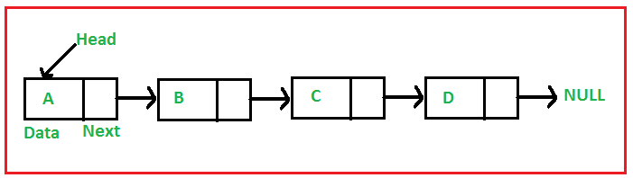
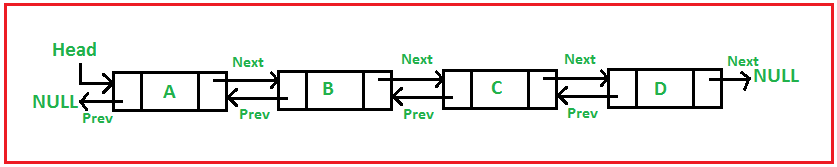
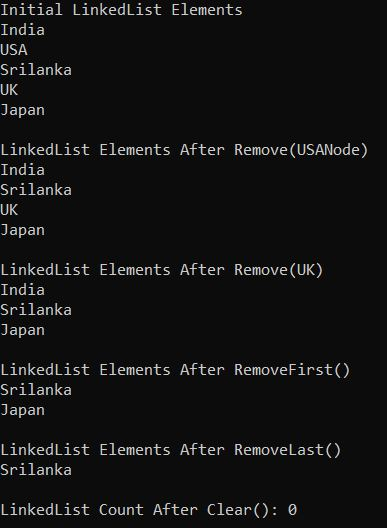

## **کلاس مجموعه Generic LinkedList<T> در سی شارپ به همراه مثال**

در این مقاله، قصد دارم **کلاس مجموعه Generic LinkedList<T> را در سی شارپ** با مثال بررسی کنم. لطفاً مقاله قبلی ما را که در آن کلاس مجموعه Generic SortedDictionary<TKey, TValue> را در سی شارپ با مثال بررسی کردیم، مطالعه کنید. در پایان این مقاله، اشاره‌گرهای زیر را با مثال درک خواهید کرد.

1. **LinkedList<T> در سی شارپ چیست؟**
2. **چگونه یک مجموعه LinkedList<T> در سی شارپ ایجاد کنیم؟**
3. **چگونه عناصر را به یک مجموعه Generic LinkedList<T> در C# اضافه کنیم؟**
4. **چگونه در سی شارپ به یک مجموعه Generic LinkedList<T> دسترسی پیدا کنیم؟**
5. **چگونه عناصر را از مجموعه LinkedList<T> در C# حذف کنیم؟**
6. **چگونه در دسترس بودن عناصر را در یک مجموعه Generic LinkedList<T> در C# بررسی کنیم؟**
7. **چگونه در سی شارپ، یک گره به اولین موقعیت یک لیست پیوندی اضافه کنیم؟**
8. **چگونه در سی شارپ، یک گره به آخرین موقعیت یک لیست پیوندی اضافه کنیم؟**
9. **چگونه در سی شارپ، یک گره بعد از یک گره مشخص در لیست پیوندی اضافه کنیم؟**
10. **چگونه در سی شارپ، یک گره قبل از گره داده شده در لیست پیوندی اضافه کنیم؟**
11. **مجموعه Generic LinkedList<T> با نوع پیچیده در سی شارپ**
12. **مزایای لیست پیوندی در سی شارپ**

##### **LinkedList<T> در سی شارپ چیست؟**

لیست پیوندی (LinkedList) یک ساختار داده خطی است که برای ذخیره عناصر به صورت غیرمجاور استفاده می‌شود. عناصر موجود در یک لیست پیوندی با استفاده از اشاره‌گرها به یکدیگر مرتبط هستند. یا به عبارت دیگر، لیست پیوندی از گره‌هایی تشکیل شده است که هر گره شامل یک فیلد داده و یک مرجع (لینک) به گره بعدی در لیست است. بنابراین، هر گره شامل دو بخش است.

1. **داده‌ها \-** هر گره از یک لیست پیوندی می‌تواند داده‌ها را ذخیره کند.
2. **آدرس (Address ) –** هر گره از یک لیست پیوندی شامل یک آدرس به گره بعدی است که «بعدی» (Next) نامیده می‌شود.

به عبارت ساده، یک لیست پیوندی از گره‌هایی تشکیل شده است که هر گره شامل یک فیلد داده و یک مرجع (لینک یا اشاره‌گر) به گره بعدی در لیست است. نمودار زیر یک لیست پیوندی واحد را نشان می‌دهد.



LinkedList<T> یک کلاس مجموعه عمومی در C# است که یک لیست پیوندی دو طرفه را پیاده‌سازی می‌کند و برای ذخیره مجموعه‌ای از مقادیر مشابه استفاده می‌شود. از آنجایی که این یک لیست پیوندی دو طرفه است، بنابراین هر گره به گره بعدی به جلو و به گره قبلی به عقب اشاره می‌کند. یک لیست پیوندی دو طرفه (DLL) شامل یک اشاره‌گر اضافی است که معمولاً اشاره‌گر قبلی نامیده می‌شود، به همراه اشاره‌گر بعدی و داده‌ها همانطور که در تصویر زیر نشان داده شده است.



**نکته:** در سی شارپ، LinkedList<T> یک مجموعه پویا است که با توجه به نیاز برنامه شما رشد می‌کند. همچنین امکان درج و حذف سریع عناصر را فراهم می‌کند.

##### **نکات مهم در کار با لیست پیوندی:**

1. LinkedList<T> متعلق به فضای نام System.Collections.Generic است و رابط‌های ICollection، ICollection<T>، IEnumerable، IEnumerable<T>، ISerializable و IDeserializationCallback را پیاده‌سازی می‌کند.
2. LinkedList<T> یک لیست پیوندی همه منظوره است. از شمارشگرها پشتیبانی می‌کند.
3. شما می‌توانید گره‌ها را حذف کرده و دوباره آنها را، چه در همان لیست و چه در لیست دیگری، وارد کنید، که در نتیجه هیچ شیء اضافی در هیپ تخصیص داده نمی‌شود. درج و حذف عملیات O(1) هستند.
4. هر گره در یک شیء LinkedList<T> از نوع LinkedListNode<T> است.
5. کلاس LinkedList از زنجیره‌سازی، تقسیم، چرخه‌ها یا سایر ویژگی‌هایی که می‌توانند لیست را در حالت ناسازگار قرار دهند، پشتیبانی نمی‌کند.
6. اگر LinkedList خالی باشد، ویژگی‌های First و Last حاوی null هستند.
7. لیست پیوندی (LinkedList) دو بار به هم متصل شده است، بنابراین هر گره به گره بعدی (Next) به جلو و به گره قبلی (Previous) به عقب اشاره می‌کند.
8. ظرفیت یک لیست پیوندی (LinkedList) تعداد عناصری است که آن لیست پیوندی می‌تواند در خود نگه دارد.
9. در LinkedList، ذخیره عناصر تکراری از یک نوع مجاز است.

##### **چگونه یک مجموعه LinkedList<T> در سی شارپ ایجاد کنیم؟**

کلاس Generic LinkedList<T> Collection در سی شارپ، سازنده‌های زیر را ارائه می‌دهد که می‌توانیم از آنها برای ایجاد یک نمونه از کلاس LinkedList<T> استفاده کنیم.

1. **LinkedList():** این تابع یک نمونه جدید از کلاس Generic LinkedList که خالی است را مقداردهی اولیه می‌کند.
2. **LinkedList(IEnumerable<T> collection):** این تابع یک نمونه جدید از کلاس Generic LinkedList را مقداردهی اولیه می‌کند که شامل عناصر کپی شده از System.Collections.IEnumerable مشخص شده است و ظرفیت کافی برای جای دادن تعداد عناصر کپی شده را دارد. در اینجا، پارامتر collection، System.Collections.IEnumerable را مشخص می‌کند که عناصر آن در Generic LinkedList جدید کپی می‌شوند. اگر مجموعه null باشد، خطای ArgumentNullException رخ می‌دهد.
3. **LinkedList(SerializationInfo info, StreamingContext context) :** این تابع یک نمونه جدید از کلاس Generic LinkedList را مقداردهی اولیه می‌کند که با System.Runtime.Serialization.SerializationInfo و System.Runtime.Serialization.StreamingContext مشخص شده، قابل سریالی شدن است. در اینجا، پارامتر info یک شیء System.Runtime.Serialization.SerializationInfo را مشخص می‌کند که حاوی اطلاعات مورد نیاز برای سریالی کردن Generic LinkedList است. پارامتر context یک شیء System.Runtime.Serialization.StreamingContext را مشخص می‌کند که حاوی منبع و مقصد جریان سریالی شده مرتبط با Generic LinkedList است.

بیایید ببینیم چگونه می‌توان با استفاده از سازنده‌ی LinkedList() در سی‌شارپ، یک مجموعه‌ی LinkedList<T> ایجاد کرد:

**مرحله ۱:**  
از آنجایی که کلاس مجموعه Generic LinkedList<T> متعلق به فضای نام System.Collections.Generic است، بنابراین ابتدا باید فضای نام System.Collections.Generic را به صورت زیر در برنامه خود وارد کنیم:  
**با استفاده از System.Collections.Generic؛**

**مرحله ۲:**  
در مرحله بعد، باید با استفاده از سازنده LinkedList() به صورت زیر، یک نمونه از کلاس مجموعه LinkedList<T> ایجاد کنیم:  
**LinkedList<Type_of_linkedlist> linkedlist_name = new LinkedList<Type_of_linkedlist>();**

##### **چگونه عناصر را به یک مجموعه Generic LinkedList<T> در C# اضافه کنیم؟**

اگر می‌خواهید عناصری را به یک مجموعه Generic LinkedList اضافه کنید، باید از متدهای زیر که توسط کلاس Generic LinkedList<T> ارائه شده‌اند، طبق نیاز خود استفاده کنید.

1. **AddAfter(LinkedListNode<T> node, LinkedListNode<T> newNode):** این متد برای اضافه کردن گره جدید مشخص شده بعد از گره موجود مشخص شده در لیست پیوند عمومی استفاده می‌شود.
2. **AddAfter(LinkedListNode<T> node, T value):** این متد برای اضافه کردن یک گره جدید حاوی مقدار مشخص شده، پس از گره موجود مشخص شده در Generic LinkedList استفاده می‌شود.
3. **AddBefore(LinkedListNode<T> node, LinkedListNode<T> newNode):** این متد برای اضافه کردن گره جدید مشخص شده قبل از گره موجود مشخص شده در Generic LinkedList استفاده می‌شود.
4. **AddBefore(LinkedListNode<T> node, T value):** این متد برای اضافه کردن یک گره جدید حاوی مقدار مشخص شده قبل از گره موجود مشخص شده در Generic LinkedList استفاده می‌شود.
5. **AddFirst(LinkedListNode<T> node):** این برای اضافه کردن گره جدید مشخص شده در ابتدای Generic LinkedList استفاده می‌شود.
6. **AddFirst(T value):** این برای اضافه کردن یک گره جدید حاوی مقدار مشخص شده در ابتدای Generic LinkedList استفاده می‌شود.
7. **AddLast(LinkedListNode<T> node):** این برای اضافه کردن گره جدید مشخص شده در انتهای Generic LinkedList استفاده می‌شود.
8. **LinkedListNode<T> AddLast(T value):** این برای اضافه کردن یک گره جدید حاوی مقدار مشخص شده در انتهای Generic LinkedList استفاده می‌شود.

برای مثال، در اینجا ما یک مجموعه عمومی LinkedList<T> با مشخص کردن نوع به عنوان یک رشته به شرح زیر ایجاد می‌کنیم و سپس عناصر را با استفاده از متد AddLast اضافه می‌کنیم.  
**لیست پیوندی <string> linkedList = لیست پیوندی جدید <string>();**  
**linkedList.AddLast("هند");**  
**linkedList.AddLast("ایالات متحده آمریکا");**  
**linkedList.AddLast("سریلانکا");**

**نکته:** از آنجایی که کلاس مجموعه LinkedList<T> متد Add که پارامتر T را دریافت می‌کند، ندارد، بنابراین نمی‌توانیم از سینتکس Collection Initializer برای اضافه کردن عناصر هنگام ایجاد مجموعه استفاده کنیم.

##### **چگونه در سی شارپ به یک مجموعه Generic LinkedList<T> دسترسی پیدا کنیم؟**

شما می‌توانید با استفاده از حلقه For Each به عناصر یک مجموعه Generic LinkedList<T> در سی شارپ به صورت زیر دسترسی پیدا کنید:  
**foreach (مورد متغیر در لیست پیوندی)**  
**{**  
**خط نوشتن کنسول (مورد)؛**  
**}**

**نکته:** از آنجایی که کلاس مجموعه LinkedList<T> هیچ اندیس‌گذاری ندارد، بنابراین نمی‌توانیم با استفاده از اندیس‌ها به عناصر دسترسی پیدا کنیم و از این رو نمی‌توانیم با استفاده از حلقه For نیز به عناصر دسترسی پیدا کنیم.

##### **مثالی برای درک نحوه ایجاد یک مجموعه Generic LinkedList<T> و افزودن عناصر در C#:**

برای درک بهتر نحوه ایجاد یک مجموعه Generic LinkedList<T> و نحوه اضافه کردن عناصر به مجموعه و نحوه دسترسی به عناصر از مجموعه، لطفاً به مثال زیر نگاهی بیندازید.

```csharp
using System;
using System.Collections.Generic;

namespace GenericLinkedListCollection
{
    public class Program
    {
        public static void Main()
        {
            LinkedList<string> linkedList = new LinkedList<string>();
            linkedList.AddLast("India");
            linkedList.AddLast("USA");
            linkedList.AddLast("Srilanka");
            linkedList.AddLast("UK");
            linkedList.AddLast("Japan");

            Console.WriteLine("LinkedList Elements");
            foreach (var item in linkedList)
            {
                Console.WriteLine(item);
            }

            Console.ReadKey();
        }
    }
}
```

###### **خروجی:**


##### **چگونه عناصر را از مجموعه LinkedList<T> در C# حذف کنیم؟**

کلاس مجموعه Generic LinkedList<T> در سی شارپ، متدهای زیر را برای حذف عناصر از مجموعه LinkedList ارائه می‌دهد.

1. **گره Remove(LinkedListNode<T>):** متد Remove(LinkedListNode<T> node) برای حذف گره مشخص شده از لیست پیوندی عمومی استفاده می‌شود.
2. **حذف(مقدار T):** از متد حذف(مقدار T) برای حذف اولین رخداد مقدار مشخص شده از لیست پیوندی عمومی استفاده می‌شود.
3. **RemoveFirst():** متد RemoveFirst() برای حذف گره در ابتدای لیست پیوندی عمومی استفاده می‌شود.
4. **RemoveLast():** متد RemoveLast() برای حذف گره در انتهای لیست پیوندی عمومی استفاده می‌شود.
5. **Clear():** متد Clear() برای حذف تمام گره‌ها از لیست پیوندی عمومی استفاده می‌شود.

بیایید مثالی برای درک متدهای فوق از کلاس Generic LinkedList<T> Collection در سی شارپ ببینیم. لطفاً به مثال زیر نگاهی بیندازید.

```csharp
using System;
using System.Collections.Generic;

namespace GenericLinkedListCollection
{
    public class Program
    {
        public static void Main()
        {
            LinkedList<string> linkedList = new LinkedList<string>();
            linkedList.AddLast("India");
            LinkedListNode<string> USANode = linkedList.AddLast("USA");
            linkedList.AddLast("Srilanka");
            LinkedListNode<string> UKNode = linkedList.AddLast("UK");
            linkedList.AddLast("Japan");

            Console.WriteLine("Initial LinkedList Elements");
            foreach (var item in linkedList)
            {
                Console.WriteLine(item);
            }

            // Removing Element using Remove(LinkedListNode) method
            // linkedList.Remove(linkedList.First); //Remove First Node
            // linkedList.Remove(linkedList.Last);  //Remove Second Node
            linkedList.Remove(USANode); //Remove Specific Node
            Console.WriteLine("\nLinkedList Elements After Remove(USANode)");
            foreach (string item in linkedList)
            {
                Console.WriteLine(item);
            }

            // Removing Element using Remove(T) method
            linkedList.Remove("UK");
            Console.WriteLine("\nLinkedList Elements After Remove(UK)");
            foreach (string item in linkedList)
            {
                Console.WriteLine(item);
            }

            // Removing Element using RemoveFirst() method
            linkedList.RemoveFirst();
            Console.WriteLine("\nLinkedList Elements After RemoveFirst()");
            foreach (string item in linkedList)
            {
                Console.WriteLine(item);
            }

            // Removing Element using RemoveLast() method
            linkedList.RemoveLast();
            Console.WriteLine("\nLinkedList Elements After RemoveLast()");
            foreach (string item in linkedList)
            {
                Console.WriteLine(item);
            }

            // Removing Element using Clear() method
            linkedList.Clear();
            Console.WriteLine($"\nLinkedList Count After Clear(): {linkedList.Count}");

            Console.ReadKey();
        }
    }
}
```

###### **خروجی:**



##### **چگونه در دسترس بودن عناصر را در یک مجموعه Generic LinkedList<T> در C# بررسی کنیم؟**

اگر می‌خواهید بررسی کنید که آیا یک عنصر در مجموعه Generic LinkedList<T> در C# وجود دارد یا خیر، می‌توانید از متد Contains(T value) زیر که توسط کلاس Generic LinkedList<T> ارائه شده است، استفاده کنید.

1. **Contains(T value):** این متد برای تعیین اینکه آیا یک مقدار در Generic LinkedList وجود دارد یا خیر، استفاده می‌شود. در اینجا، پارامتر value، مقداری را که باید در Generic LinkedList قرار گیرد، مشخص می‌کند. این مقدار می‌تواند برای انواع ارجاعی null باشد. اگر مقدار در Generic LinkedList یافت شود، مقدار true و در غیر این صورت، مقدار false را برمی‌گرداند.

بگذارید این موضوع را با یک مثال درک کنیم. مثال زیر نحوه استفاده از متد both Contains(T value) از کلاس مجموعه Generic LinkedList در سی شارپ را نشان می‌دهد.

```csharp
using System;
using System.Collections.Generic;

namespace GenericLinkedListCollection
{
    public class Program
    {
        public static void Main()
        {
            LinkedList<string> linkedList = new LinkedList<string>();
            linkedList.AddLast("India");
            linkedList.AddLast("USA");
            linkedList.AddLast("Srilanka");
            linkedList.AddLast("UK");
            linkedList.AddLast("Japan");

            Console.WriteLine("LinkedList Elements");
            foreach (var item in linkedList)
            {
                Console.WriteLine(item);
            }

            //Checking the value using the ContainsValue method
            Console.WriteLine("\nIs India value Exists : " + linkedList.Contains("India"));
            Console.WriteLine("\nIs Bangladesh value Exists : " + linkedList.Contains("Bangladesh"));

            Console.ReadKey();
        }
    }
}
```

###### **خروجی:**


### **عملیات لیست پیوندی در سی شارپ**

##### **چگونه در سی شارپ، یک گره به اولین موقعیت یک لیست پیوندی اضافه کنیم؟**

اگر می‌خواهید یک گره را در اولین موقعیت یک لیست پیوندی اضافه کنید، باید از متد AddFirst() از کلاس Generic LinkedList<T> استفاده کنید. برای درک بهتر، لطفاً به مثال زیر نگاهی بیندازید.

```csharp
using System;
using System.Collections.Generic;

namespace GenericLinkedListCollection
{
    public class Program
    {
        public static void Main()
        {
            LinkedList<string> linkedList = new LinkedList<string>();
            linkedList.AddLast("India");
            linkedList.AddLast("USA");
            linkedList.AddLast("Srilanka");
            
            Console.WriteLine("LinkedList Elements");
            foreach (var item in linkedList)
            {
                Console.WriteLine(item);
            }

            Console.WriteLine("\nAfter Adding a Node at First Position");
            linkedList.AddFirst("UK");
            foreach (var item in linkedList)
            {
                Console.WriteLine(item);
            }

            Console.ReadKey();
        }
    }
}
```

###### **خروجی:**


##### **چگونه در سی شارپ، یک گره به آخرین موقعیت یک لیست پیوندی اضافه کنیم؟**

اگر می‌خواهید یک گره را در آخرین موقعیت یک لیست پیوندی اضافه کنید، باید از متد AddLast() از کلاس Generic LinkedList<T> استفاده کنید. برای درک بهتر، لطفاً به مثال زیر نگاهی بیندازید.

```csharp
using System;
using System.Collections.Generic;

namespace GenericLinkedListCollection
{
    public class Program
    {
        public static void Main()
        {
            LinkedList<string> linkedList = new LinkedList<string>();
            linkedList.AddLast("India");
            linkedList.AddLast("USA");
            linkedList.AddLast("Srilanka");
            
            Console.WriteLine("LinkedList Elements");
            foreach (var item in linkedList)
            {
                Console.WriteLine(item);
            }

            Console.WriteLine("\nAfter Adding a Node at Last Position");
            linkedList.AddLast("UK");
            foreach (var item in linkedList)
            {
                Console.WriteLine(item);
            }

            Console.ReadKey();
        }
    }
}
```

###### **خروجی:**


##### **چگونه در سی شارپ، یک گره بعد از یک گره مشخص در لیست پیوندی اضافه کنیم؟**

اگر می‌خواهید بعد از یک گره مشخص در یک لیست پیوندی، یک گره اضافه کنید، باید از متد AddAfter() از کلاس Generic LinkedList<T> استفاده کنید. برای درک بهتر، لطفاً به مثال زیر نگاهی بیندازید.

```csharp
using System;
using System.Collections.Generic;

namespace GenericLinkedListCollection
{
    public class Program
    {
        public static void Main()
        {
            LinkedList<string> linkedList = new LinkedList<string>();
            linkedList.AddLast("India");
            LinkedListNode<string> USANode = linkedList.AddLast("USA");
            linkedList.AddLast("Srilanka");
            
            Console.WriteLine("LinkedList Elements");
            foreach (var item in linkedList)
            {
                Console.WriteLine(item);
            }

            Console.WriteLine("\nAfter Adding a Node After USA Node");
            linkedList.AddAfter(USANode, "UK");
            foreach (var item in linkedList)
            {
                Console.WriteLine(item);
            }

            Console.ReadKey();
        }
    }
}
```

###### **خروجی:**


##### **چگونه در سی شارپ، یک گره قبل از گره داده شده در لیست پیوندی اضافه کنیم؟**

اگر می‌خواهید یک گره قبل از گره‌ی مشخصی از یک لیست پیوندی اضافه کنید، باید از متد AddBefore() از کلاس Generic LinkedList<T> استفاده کنید. برای درک بهتر، لطفاً به مثال زیر نگاهی بیندازید.

```csharp
using System;
using System.Collections.Generic;

namespace GenericLinkedListCollection
{
    public class Program
    {
        public static void Main()
        {
            LinkedList<string> linkedList = new LinkedList<string>();
            linkedList.AddLast("India");
            LinkedListNode<string> USANode = linkedList.AddLast("USA");
            linkedList.AddLast("Srilanka");
            
            Console.WriteLine("LinkedList Elements");
            foreach (var item in linkedList)
            {
                Console.WriteLine(item);
            }

            Console.WriteLine("\nAfter Adding a Node Before USA Node");
            linkedList.AddBefore(USANode, "UK");
            foreach (var item in linkedList)
            {
                Console.WriteLine(item);
            }

            Console.ReadKey();
        }
    }
}
```

###### **خروجی:**


##### **مجموعه Generic LinkedList<T> با نوع پیچیده در سی شارپ:**

تاکنون، ما از انواع داده داخلی مانند int، string و غیره با کلاس LinkedList استفاده کرده‌ایم. حال، بیایید ببینیم چگونه می‌توان یک مجموعه Generic LinkedList با استفاده از انواع Complex ایجاد کرد. بیایید یک کلاس به نام Student ایجاد کنیم و سپس یک مجموعه LinkedList از انواع Student همانطور که در مثال زیر نشان داده شده است، ایجاد کنیم.

```csharp
using System;
using System.Collections.Generic;

namespace GenericLinkedListCollection
{
    public class Program
    {
        public static void Main()
        {
            Student student1 = new Student() { ID = 101, Name = "Anurag", Branch = "CSE" };
            Student student2 = new Student() { ID = 102, Name = "Mohanty", Branch = "CSE" };
            Student student3 = new Student() { ID = 103, Name = "Sambit", Branch = "ETC" };
            Student student4 = new Student() { ID = 104, Name = "Pranaya", Branch = "ETC" };

            LinkedList<Student> linkedList = new LinkedList<Student>();
            linkedList.AddLast(student1);
            linkedList.AddLast(student2);
            linkedList.AddLast(student3);
            linkedList.AddLast(student4);

            Console.WriteLine("LinkedList Elements");
            foreach (var item in linkedList)
            {
                Console.WriteLine($"Id: {item.ID}, Name: {item.Name}, Branch: {item.Branch}");
            }

            Console.ReadKey();
        }
    }

    public class Student
    {
        public int ID { get; set; }
        public string Name { get; set; }
        public string Branch { get; set; }
    }
}
```

###### **خروجی:**


##### **مزایای لیست پیوندی در سی شارپ**

1. آنها ذاتاً پویا هستند و در صورت نیاز حافظه را اختصاص می‌دهند.
2. درج و حذف به راحتی قابل پیاده‌سازی هستند.
3. سایر ساختارهای داده مانند Stack و Queue نیز می‌توانند به راحتی با استفاده از Linked List پیاده‌سازی شوند.
4. زمان دسترسی سریع‌تری دارد و می‌تواند در زمان ثابت و بدون سربار حافظه گسترش یابد.
5. از آنجایی که نیازی به تعریف اندازه اولیه برای لیست پیوندی نیست، از این رو استفاده از حافظه مؤثر است.
6. در لیست‌های پیوندی دوگانه، امکان بازگشت به عقب وجود دارد