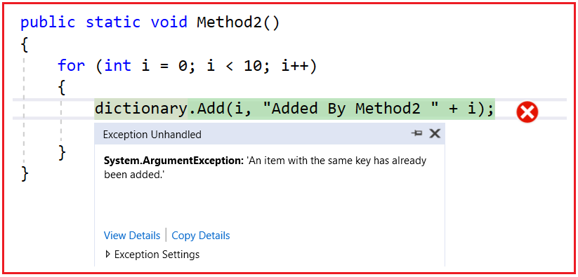
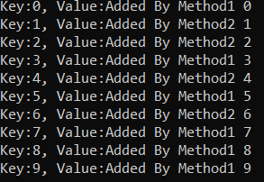

## **مجموعه همزمان در سی شارپ با مثال**

در این مقاله، قصد دارم در مورد مجموعه همزمان (Concurrent Collection) در سی شارپ با مثال صحبت کنم. لطفاً مقاله قبلی ما را که در آن در مورد کلاس مجموعه Generic LinkedList<T> در سی شارپ با مثال صحبت کردیم، مطالعه کنید.

##### **چرا به مجموعه همزمان (Concurrent Collection) در سی شارپ نیاز داریم؟**

در **C# 1.0** ، **چارچوب System.Collections** معرفی شد و کلاس‌های کلکسیونی مانند ArrayList، Hashtable، Stack، Queue و غیره متعلق به فضای نام System.Collections هستند. مشکل این کلاس‌های کلکسیونی این است که از نظر نوع داده ایمن نیستند. یعنی عناصر را به شکل اشیاء ذخیره می‌کنند و به همین دلیل، ممکن است با خطاهای عدم تطابق نوع داده و همچنین افت عملکرد به دلیل boxing و unboxing مواجه شویم.

در مرحله بعد، در C# 2.0، **چارچوب System.Collections.Generic** معرفی شد و کلاس‌های مجموعه List<T>، Dictionary<TKey, TValue>، Stack<T>، Queue<T> و غیره متعلق به فضای نام System.Collections.Generic هستند. این کلاس‌های مجموعه از نظر نوع ایمن هستند اما از نظر موضوع ایمن نیستند. Typesafe به این معنی است که هر زمان که قصد داریم هر مجموعه از نوع عمومی را اعلام کنیم، باید نوعی را که قرار است توسط مجموعه عمومی نگهداری شود، مشخص کنیم. و هر زمان که قصد داریم هر آیتمی را از مجموعه بازیابی کنیم، نوع واقعی آیتم را دریافت خواهیم کرد. این بدان معناست که boxing و unboxing لازم نیست.

اما کلاس‌های مجموعه عمومی، Thread Safe نیستند. بنابراین، به عنوان یک توسعه‌دهنده، مسئولیت ما فراهم کردن Thread Safety است. برای مثال، فرض کنید یک مجموعه دیکشنری داریم. و آن مجموعه دیکشنری توسط چندین Thread به اشتراک گذاشته شده است. در این صورت، وقتی دو یا چند Thread سعی می‌کنند در یک نقطه زمانی به مجموعه دیکشنری دسترسی پیدا کنند، ممکن است با برخی مشکلات همزمانی مواجه شویم، مانند اضافه کردن/حذف کردن آیتم‌ها از یک مجموعه دیکشنری به طور همزمان.

##### **مثالی برای درک مشکل ایمنی نخ با مجموعه‌های عمومی در سی‌شارپ:**

در مثال زیر، ما یک شیء دیکشنری با کلید از نوع int و مقدار از نوع string ایجاد کرده‌ایم. سپس دو متد به نام‌های Method1 و Method2 ایجاد کرده‌ایم و هر دوی این متدها سعی در اضافه کردن عناصری به مجموعه دیکشنری دارند. سپس درون متد main، دو thread به نام‌های t1 و t2 ایجاد کرده‌ایم. thread t1 به Method1 و thread t2 به Method2 اشاره می‌کند. و سپس متد start هر دو thread را فراخوانی می‌کنیم که هر دو متد را به طور همزمان اجرا می‌کند.

```csharp
using System;
using System.Collections.Generic;
using System.Threading;

namespace ConcurrentCollections
{
    class Program
    {
        static Dictionary<int, string> dictionary = new Dictionary<int, string>();

        static void Main(string[] args)
        {
            Thread t1 = new Thread(Method1);
            Thread t2 = new Thread(Method2);
            t1.Start();
            t2.Start();

            Console.ReadKey();
        }

        public static void Method1()
        {
            for (int i = 0; i < 10; i++)
            {
                dictionary.Add(i, "Added By Method1 " + i);
                Thread.Sleep(100);
            }
        }

        public static void Method2()
        {
            for (int i = 0; i < 10; i++)
            {
                dictionary.Add(i, "Added By Method2 " + i);
                Thread.Sleep(100);
            }
        }
    }
}
```

حالا کد بالا را اجرا کنید و پس از مدتی خطای زیر را دریافت خواهید کرد. دلیل این امر این است که کلیدهای دیکشنری باید منحصر به فرد باشند و همان کلید قبلاً توسط یکی از روش‌ها اضافه شده باشد. ما این خطا را دریافت کردیم زیرا Generic Dictionary به طور پیش‌فرض thread safety را ارائه نمی‌دهد.



به عنوان یک توسعه‌دهنده، می‌توانیم ایمنی نخ‌ها را با کمک قفل‌ها و مانیتورها پیاده‌سازی کنیم. اما قفل کردن کل لیست به منظور **اضافه/حذف** یک آیتم می‌تواند یک مشکل بزرگ در عملکرد باشد. اینجاست که به کلاس‌های Concurrent Collection نیاز است. Concurrent Collectionها را می‌توان بدون قفل‌های صریح بین چندین نخ به اشتراک گذاشت و همچنین عملکرد عملیات چند نخی را افزایش می‌دهد.

##### **مثال استفاده از ConcurrentDictionary در سی شارپ:**

حال، مثال قبلی را با استفاده از ConcurrentDictionary بازنویسی می‌کنیم و بررسی می‌کنیم که آیا با خطایی مواجه می‌شویم یا خیر. کلاس مجموعه ConcurrentDictionary متعلق به فضای نام System.Collections.Concurrent است. فعلاً، کد زیر را کپی و پیست کرده و اجرا کنید. از مقاله بعدی به بعد، تمام **کلاس‌های مجموعه System.Collections.Concurrent** را با جزئیات و مثال بررسی خواهیم کرد.

در مثال زیر، ما سه تغییر انجام داده‌ایم. ابتدا، **فضای نام System.Collections.Concurrent** استفاده می‌کنیم **را وارد می‌کنیم. سپس به جای کلاس مجموعه Dictionary از کلاس مجموعه ConcurrentDictionary** استفاده می‌کنیم . **TryAdd** . در نهایت، به جای متد Add از متد

```csharp
using System;
using System.Threading;
using System.Collections.Concurrent;
using System.Collections.Generic;

namespace ConcurrentCollections
{
    class Program
    {
        static ConcurrentDictionary<int, string> dictionary = new ConcurrentDictionary<int, string>();

        static void Main(string[] args)
        {
            Thread t1 = new Thread(Method1);
            Thread t2 = new Thread(Method2);
            t1.Start();
            t2.Start();
            t1.Join();
            t2.Join();

            foreach (KeyValuePair<int, string> item in dictionary)
            {
                Console.WriteLine($"Key:{item.Key}, Value:{item.Value}");
            }

            Console.ReadKey();
        }

        public static void Method1()
        {
            for (int i = 0; i < 10; i++)
            {
                dictionary.TryAdd(i, "Added By Method1 " + i);
                Thread.Sleep(100);
            }
        }

        public static void Method2()
        {
            for (int i = 0; i < 10; i++)
            {
                dictionary.TryAdd(i, "Added By Method2 " + i);
                Thread.Sleep(100);
            }
        }
    }
}
```

حالا کد بالا را اجرا کنید و هیچ استثنایی دریافت نخواهید کرد. اگر بیشتر دقت کنید، خواهید دید که برخی از عناصر توسط Method1 و برخی دیگر توسط Method2 اضافه شده‌اند، همانطور که در خروجی زیر نشان داده شده است.



##### **ConcurrentDictionary به صورت داخلی چه کاری انجام می‌دهد؟**

یک قابلیت اضافه/حذف امن از دیکشنری که متدهای کاربرپسندی را ارائه می‌دهد و باعث می‌شود کد قبل از اضافه/حذف کردن یک کلید، بررسی وجود آن را غیرضروری کند.

1. **AddOrUpdate** : اگر ورودی جدیدی وجود نداشته باشد، آن را اضافه می‌کند، در غیر این صورت ورودی موجود را به‌روزرسانی می‌کند.
2. **GetOrAdd** : در صورت وجود، یک آیتم را بازیابی می‌کند، در غیر این صورت ابتدا آن را اضافه می‌کند و سپس آن را بازیابی می‌کند.
3. **TryAdd** ، **TrygetValue** ، **TryUpdate** ، **TryRemove** : سعی کنید عملیات مشخص شده مانند Add/Get/Update/Remove را انجام دهید. در صورت انجام عملیات مقدار true و در صورت عدم موفقیت در انجام عملیات مقدار false را برمی‌گرداند.

**نکته:** پس از شروع بحث در مورد کلاس‌های مجموعه همزمان، روش‌های فوق را به تفصیل مورد بحث قرار خواهیم داد.

##### **مجموعه‌های همزمان در سی شارپ چیستند؟**

چارچوب دات‌نت ۴.۰ کلاس‌های جدیدی برای همزمانی به عنوان مجموعه‌های همزمان (Concurrent Collections) ارائه می‌دهد. مجموعه‌های همزمان به ما امکان می‌دهند مجموعه‌هایی از نوع ایمن (type-safe) (به دلیل پیاده‌سازی عمومی) و همچنین از نوع ایمن (thread-safe) ایجاد کنیم.

این کلاس‌های مجموعه به طور خاص در چندنخی (multithreading) استفاده می‌شوند. این مجموعه‌ها می‌توانند توسط چندین نخ (thread) در یک زمان قابل دسترسی باشند، از این رو به آنها مجموعه‌های همزمان (Concurrent collections) گفته می‌شود. آنها به ما امکان می‌دهند داده‌ها را بین چندین نخ با ایمنی نخ به اشتراک بگذاریم. آنها تحت فضای نام System.Collections.Concurrent در دسترس هستند. در زیر انواع مختلف مجموعه‌های همزمان آمده است.

1. ConcurrentDictionary<Key, Value> : نسخه thread-safe از دیکشنری Generic.
2. ConcurrentQueue<T> : نسخه thread-safe از صف عمومی (ساختار داده FIFO).
3. ConcurrentStact<T> : نسخه thread-safe از پشته عمومی (ساختار داده LIFO).
4. ConcurrentBag<T> : پیاده‌سازی thread-safe از یک مجموعه نامرتب.
5. BlockingCollection<T> : یک الگوی کلاسیک تولیدکننده-مصرف‌کننده ارائه می‌دهد.

**نکته:** الگوی تولیدکننده و مصرف‌کننده را می‌توان به راحتی هنگام استفاده از ConcurrentStack، ConcurrentQueue و ConcurrentBag پیاده‌سازی کرد، زیرا آن‌ها رابط IProducerConsumerCollection را پیاده‌سازی می‌کنند.

##### **مزایای مجموعه‌های همزمان در سی شارپ:**

1. به عنوان یک توسعه‌دهنده، لازم نیست نگران امنیت نخ‌ها باشیم.
2. از هماهنگ‌سازی سبک مانند SpinWait، SpinLock و غیره استفاده می‌کند که قبل از قرار دادن نخ‌ها در حالت انتظار، از چرخش استفاده می‌کند - برای دوره‌های انتظار کوتاه، چرخش ارزان‌تر از انتظار است که شامل انتقال هسته می‌شود.
3. این برنامه، عملیات افزودن/حذف/تکرار سریع‌تری را در یک محیط چندنخی بدون نوشتن کد برای آن فراهم می‌کند.
4. بعضی از کلاس‌ها مانند ConcurrentQueue و ConcurrentStack به جای قفل‌ها، به عملیات Interlocked متکی نیستند که باعث سریع‌تر شدن آنها می‌شود.

##### **چه زمانی در سی شارپ از مجموعه‌های همزمان به جای مجموعه‌های عمومی استفاده کنیم؟**

1. مجموعه‌های همزمان باید زمانی استفاده شوند که مجموعه‌ها تغییر می‌کنند یا داده‌ها توسط چندین نخ اضافه/به‌روزرسانی/حذف می‌شوند. اگر نیاز فقط برای عملیات خواندن در یک محیط چندنخی باشد، می‌توان از مجموعه‌های عمومی استفاده کرد.
2. اگر قفل‌گذاری در چند مکان مورد نیاز باشد، می‌توان از قفل‌گذاری دستی یا تکنیک‌های همگام‌سازی نیز استفاده کرد، اما اگر در چندین مکان مورد نیاز باشد، استفاده از جمع‌آوری همزمان انتخاب خوبی است.
3. مجموعه‌های همزمان طوری طراحی شده‌اند که در مواردی که به ایمنی بیش از حد نخ نیاز است، مورد استفاده قرار گیرند. استفاده بیش از حد از قفل دستی می‌تواند منجر به بن‌بست و سایر مشکلات شود.
4. از نظر داخلی، مجموعه‌های همزمان از چندین الگوریتم برای به حداقل رساندن انسداد نخ استفاده می‌کنند.