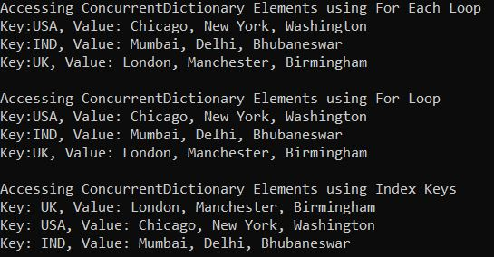
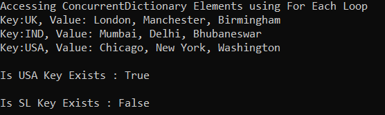
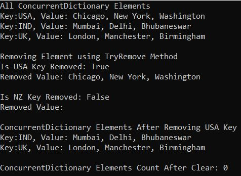
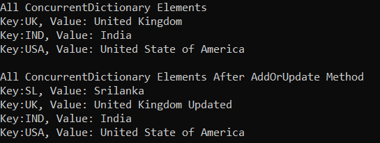
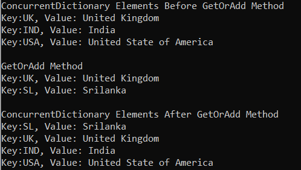
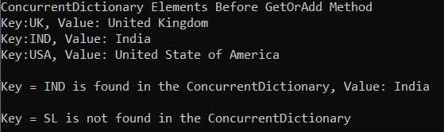
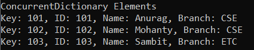
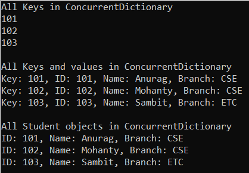

## **کلاس مجموعه ConcurrentDictionary در سی شارپ به همراه مثال**

در این مقاله، قصد دارم **کلاس مجموعه ConcurrentDictionary را در سی شارپ** با مثال‌هایی مورد بحث قرار دهم. لطفاً مقاله قبلی ما را که در آن به بحث در مورد مجموعه Concurrent در سی شارپ با مثال‌هایی پرداختیم، مطالعه کنید. مجموعه ConcurrentDictionary در دات نت ۴.۰ معرفی شد و متعلق به فضای نام System.Collections.Concurrent است. به عنوان بخشی از این مقاله، قصد داریم در مورد اشاره‌گرهای زیر بحث کنیم.

1. **دیکشنری همزمان (ConcurrentDictionary) در سی شارپ چیست؟**
2. **چگونه یک مجموعه ConcurrentDictionary در سی شارپ ایجاد کنیم؟**
3. **چگونه عناصر را به یک مجموعه ConcurrentDictionary <TKey, TValue> در C# اضافه کنیم؟**
4. **چگونه در سی شارپ به مجموعه ConcurrentDictionary <TKey, TValue> دسترسی پیدا کنیم؟**
5. **چگونه در دسترس بودن یک جفت کلید/مقدار را در مجموعه ConcurrentDictionary در C# بررسی کنیم؟**
6. **چگونه عناصر را از مجموعه ConcurrentDictionary در C# حذف کنیم؟**
7. **درک** **متد TryUpdate از کلاس ConcurrentDictionary Collection در سی شارپ**
8. **درک متدهای AddOrUpdate از کلاس مجموعه ConcurrentDictionary در سی شارپ**
9. **درک** **متدهای GetOrAdd از کلاس Collection ConcurrentDictionary در سی شارپ**
10. **درک** **متد TryGetValue از کلاس مجموعه ConcurrentDictionary در سی شارپ**
11. **مجموعه دیکشنری همزمان با نوع پیچیده در سی شارپ**
12. **چگونه می‌توان تمام کلیدها و مقادیر یک ConcurrentDictionary را در سی شارپ دریافت کرد؟**

##### **دیکشنری همزمان (ConcurrentDictionary) در سی شارپ چیست؟**

ConcurrentDictionary **<TKey, TValue>** مجموعه‌ای از جفت‌های کلید/مقدار را نشان می‌دهد که می‌توانند به صورت همزمان توسط چندین نخ (thread) قابل دسترسی باشند.

کلاس ConcurrentDictionary<TKey, TValue> یک مجموعه همزمان است که عنصر را به شکل جفت‌های کلید-مقدار ذخیره می‌کند. نحوه کار کلاس **ConcurrentDictionary<TKey, TValue>** بسیار شبیه به نحوه کار کلاس مجموعه Generic Dictionary<TKey, TValue> است . تنها تفاوت این است که Generic Dictionary در برابر thread-safe نیست در حالی که ConcurrentDictionary در برابر thread-safe است.

همچنین می‌توان از کلاس Dictionary به جای ConcurrentDictionary با چندین thread استفاده کرد، اما در این صورت، به عنوان یک توسعه‌دهنده، باید به طور صریح از قفل‌ها برای تأمین ایمنی thread استفاده کنیم که همیشه زمان‌بر و مستعد خطا است. بنابراین، انتخاب ایده‌آل استفاده از ConcurrentDictionary به جای Dictionary در یک محیط چند رشته‌ای است.

کلاس ConcurrentDictionary Collection به صورت داخلی قفل‌گذاری را مدیریت می‌کند که رابط کاربری آسانی برای افزودن/به‌روزرسانی/حذف آیتم‌ها در اختیار ما قرار می‌دهد. این کلاس متدهای مختلفی برای افزودن، بازیابی، به‌روزرسانی و حذف آیتم‌ها ارائه می‌دهد. در پایان این مقاله، شما با مثال‌هایی، تمام این متدها را خواهید آموخت.

##### **نکاتی که باید هنگام کار با مجموعه ConcurrentDictionary در سی شارپ به خاطر داشته باشید**

در ادامه نکات مهمی که باید هنگام کار با کلاس ConcurrentDictionary در سی شارپ در نظر داشته باشید، آورده شده است.

1. در مجموعه ConcurrentDictionary<TKey, TValue>، کلید نمی‌تواند تهی باشد، اما مقدار می‌تواند تهی باشد اگر نوع TValue آن از نوع مرجع باشد.
2. هر کلید در مجموعه ConcurrentDictionary<TKey, TValue> باید منحصر به فرد باشد. کلیدهای تکراری مجاز نیستند. اما اگر چندین thread سعی کنند کلیدهای تکراری اضافه کنند، اجازه این کار را نمی‌دهد و هیچ استثنایی ایجاد نمی‌کند.
3. در مجموعه ConcurrentDictionary<TKey, TValue>، شما فقط می‌توانید همان نوع عناصر را به عنوان ژنریک ذخیره کنید و هنگام ایجاد نمونه ConcurrentDictionary باید نوع کلید و مقدار را مشخص کنیم.
4. ظرفیت یک مجموعه ConcurrentDictionary تعداد عناصری است که ConcurrentDictionary می‌تواند در خود نگه دارد.
5. مجموعه ConcurrentDictionary<TKey, TValue> ذاتاً پویا است، به این معنی که با اضافه شدن آیتم‌ها به مجموعه، اندازه آن به طور خودکار افزایش می‌یابد.

##### **چگونه یک مجموعه ConcurrentDictionary در سی شارپ ایجاد کنیم؟**

کلاس مجموعه ConcurrentDictionary<TKey, TValue> در سی شارپ سازنده‌های زیر را ارائه می‌دهد که می‌توانیم از آنها برای ایجاد یک نمونه از کلاس مجموعه ConcurrentDictionary استفاده کنیم.

1. **ConcurrentDictionary():** این تابع یک نمونه جدید از کلاس ConcurrentDictionary را مقداردهی اولیه می‌کند که خالی است، سطح همزمانی پیش‌فرض دارد، ظرفیت اولیه پیش‌فرض دارد و از مقایسه‌گر پیش‌فرض برای نوع کلید استفاده می‌کند.
2. **ConcurrentDictionary(IEnumerable<KeyValuePair<TKey, TValue>> collection):** این تابع یک نمونه جدید از کلاس ConcurrentDictionary را مقداردهی اولیه می‌کند که شامل عناصر کپی شده از System.Collections.Generic.IEnumerable مشخص شده است و دارای سطح همزمانی پیش‌فرض، ظرفیت اولیه پیش‌فرض و مقایسه‌گر پیش‌فرض برای نوع کلید است.
3. **ConcurrentDictionary(IEqualityComparer<TKey> comparer):** این تابع یک نمونه جدید از کلاس ConcurrentDictionary را که خالی است، دارای سطح و ظرفیت همزمانی پیش‌فرض است و از System.Collections.Generic.IEqualityComparer مشخص شده استفاده می‌کند، مقداردهی اولیه می‌کند.
4. **ConcurrentDictionary(int concurrencyLevel, int capacity):** این تابع یک نمونه جدید از کلاس ConcurrentDictionary را که خالی است، دارای سطح و ظرفیت همزمانی مشخص شده است و از مقایسه‌گر پیش‌فرض برای نوع کلید استفاده می‌کند، مقداردهی اولیه می‌کند.
5. **ConcurrentDictionary(IEnumerable<KeyValuePair<TKey, TValue>> collection, IEqualityComparer<TKey> comparer):** این متد یک نمونه جدید از کلاس ConcurrentDictionary را مقداردهی اولیه می‌کند که شامل عناصر کپی شده از System.Collections.IEnumerable مشخص شده است. IEnumerable دارای سطح همزمانی پیش‌فرض، ظرفیت اولیه پیش‌فرض و استفاده از System.Collections.Generic.IEqualityComparer مشخص شده است.
6. **ConcurrentDictionary(int concurrencyLevel, IEnumerable<KeyValuePair<TKey, TValue>> collection, IEqualityComparer<TKey> comparer):** این متد یک نمونه جدید از کلاس ConcurrentDictionary را مقداردهی اولیه می‌کند که شامل عناصر کپی شده از System.Collections.IEnumerable مشخص شده است و از System.Collections.Generic.IEqualityComparer مشخص شده استفاده می‌کند.
7. **ConcurrentDictionary(int concurrencyLevel, int capacity, IEqualityComparer<TKey> comparer):** این تابع یک نمونه جدید از کلاس ConcurrentDictionary را که خالی است، سطح همزمانی مشخص شده، ظرفیت اولیه مشخص شده و از System.Collections.Generic.IEqualityComparer مشخص شده استفاده می‌کند، مقداردهی اولیه می‌کند.

بیایید ببینیم چگونه می‌توان با استفاده از سازنده‌ی ConcurrentDictionary() یک نمونه از کلاس مجموعه‌ی ConcurrentDictionary ایجاد کرد. سازنده‌ی ConcurrentDictionary() برای ایجاد یک نمونه‌ی جدید از کلاس ConcurrentDictionary استفاده می‌شود که خالی است، سطح همزمانی پیش‌فرض دارد، ظرفیت اولیه‌ی پیش‌فرض دارد و از مقایسه‌گر پیش‌فرض برای نوع کلید استفاده می‌کند.

###### **مرحله ۱:**

از آنجایی که کلاس مجموعه ConcurrentDictionary<TKey, TValue> متعلق به فضای نام System.Collections.Concurrent است، بنابراین ابتدا باید فضای نام System.Collections.Concurrent را در برنامه خود به صورت زیر وارد کنیم:  
**با استفاده از System.Collections.Concurrent؛**

**مرحله ۲:**  
در مرحله بعد، باید با استفاده از سازنده ConcurrentDictionary() به صورت زیر، یک نمونه از کلاس ConcurrentDictionary<TKey, TValue> ایجاد کنیم:  
**دیکشنری ConcurrentDictionary<KeyDataType, ValuDataType> نام دیکشنری = new دیکشنری ConcurrentDictionary<KeyDataType, ValuDataType>();**

##### **چگونه عناصر را به یک مجموعه ConcurrentDictionary <TKey, TValue> در C# اضافه کنیم؟**

حال، اگر می‌خواهید عناصری، یعنی یک جفت کلید/مقدار، را به ConcurrentDictionary اضافه کنید، باید از متد TryAdd() زیر از کلاس Collection ConcurrentDictionary در C# استفاده کنید.

1. **TryAdd(TKey key, TValue value):** متد TryAdd(TKey key, TValue value) برای اضافه کردن یک عنصر با کلید و مقدار مشخص شده به مجموعه ConcurrentDictionary استفاده می‌شود. در اینجا، پارامتر key، کلید عنصری را که باید اضافه شود و پارامتر value، مقدار عنصری را که باید اضافه شود، مشخص می‌کند. مقدار می‌تواند برای یک نوع مرجع null باشد، اما Key نمی‌تواند null باشد. اگر جفت کلید/مقدار با موفقیت به ConcurrentDictionary اضافه شده باشد، این متد مقدار true و اگر کلید از قبل وجود داشته باشد، مقدار false را برمی‌گرداند. اگر کلید null باشد، خطای ArgumentNullException رخ می‌دهد. اگر دیکشنری از قبل شامل حداکثر تعداد عناصر یعنی System.Int32.MaxValue باشد، خطای OverflowException رخ می‌دهد.

**برای مثال:**  
**دیکشنری ConcurrentDictionary<string, string> dictionaryCountries = new دیکشنری همزمان<string, string>();**  
**dictionaryCountries.TryAdd(“UK”, “London, Manchester, Birmingham”);**  
**dictionaryCountries.TryAdd("ایالات متحده آمریکا"، "شیکاگو، نیویورک، واشنگتن");**  
**dictionaryCountries.TryAdd(“IND”, “بمبئی، دهلی، بوبانسور”);**

##### **چگونه در سی شارپ به مجموعه ConcurrentDictionary <TKey, TValue> دسترسی پیدا کنیم؟**

ما می‌توانیم به جفت‌های کلید/مقدار مجموعه‌ی ConcurrentDictionary<TKey, TValue> در سی‌شارپ با استفاده از دو روش مختلف دسترسی پیدا کنیم. این روش‌ها به شرح زیر هستند:

###### **استفاده از اندیس برای دسترسی به عناصر مجموعه ConcurrentDictionary<TKey, TValue> به صورت جداگانه در سی شارپ:**

ما می‌توانیم با استفاده از اندیس‌گذار (indexer) به مقدار منفرد مجموعه ConcurrentDictionary در سی‌شارپ دسترسی پیدا کنیم. در این حالت، فقط باید کلید را در اندیس مشخص کنیم تا مقدار را از دیکشنری داده شده دریافت کنیم، نیازی به مشخص کردن اندیس نیست. اگر کلید مشخص شده وجود نداشته باشد، کامپایلر یک استثنا (exception) ایجاد می‌کند. سینتکس (syntax) در زیر آمده است.  
**فرهنگ لغت کشورها["بریتانیا"]**  
**فرهنگ لغت کشورها["ایالات متحده آمریکا"]**

##### **استفاده از حلقه For-Each برای دسترسی به مجموعه ConcurrentDictionary<TKey,TValue> در سی شارپ:**

می‌توانیم با استفاده از یک حلقه for به صورت زیر به جفت‌های کلید/مقدار یک ConcurrentDictionary<TKey, TValue> در C# دسترسی پیدا کنیم.  
**برای (عدد صحیح i = 0; i<dictionaryCountries.Count; i++)**  
**{**  
**رشته کلید = dictionaryCountries.Keys.ElementAt(i);**  
**مقدار رشته = dictionaryCountries[key];**  
**}**

###### **استفاده از حلقه For-Each برای دسترسی به مجموعه ConcurrentDictionary<TKey,TValue> در سی شارپ:**

همچنین می‌توانیم از یک حلقه for-each برای دسترسی به جفت‌های کلید/مقدار یک ConcurrentDictionary<TKey, TValue> در سی‌شارپ به صورت زیر استفاده کنیم.  
**foreach (جفت کلید و مقدار<string, string> KVP در dictionaryCountries)**  
**{**  
**Console.WriteLine($”کلید:{ KVP.Key}, مقدار: { KVP.Value}”);**  
**}**  
در حلقه به جای KeyValuePair<TKey, TValue>، می‌توانیم از var نیز به صورت زیر استفاده کنیم.  
**foreach (متغیر آیتم در dictionaryCountries)**  
**{**  
**Console.WriteLine($”کلید:{ item.Key}, مقدار: { item.Value}”);**  
**}**

##### **مثالی برای درک نحوه ایجاد یک مجموعه ConcurrentDictionary<TKey, TValue> و افزودن عناصر در سی شارپ:**

برای درک بهتر نحوه ایجاد یک مجموعه ConcurrentDictionary<TKey, TValue> و نحوه اضافه کردن عناصر و نحوه دسترسی به عناصر یک Concurrent Dictionary در C#، لطفاً به مثال زیر نگاهی بیندازید.

```csharp
using System;
using System.Collections.Concurrent;
using System.Collections.Generic;
using System.Linq;

namespace ConcurrentCollections
{
    class Program
    {
        static void Main(string[] args)
        {
            ConcurrentDictionary<string, string> dictionaryCountries = new ConcurrentDictionary<string, string>();
            dictionaryCountries.TryAdd("UK", "London, Manchester, Birmingham");
            dictionaryCountries.TryAdd("USA", "Chicago, New York, Washington");
            dictionaryCountries.TryAdd("IND", "Mumbai, Delhi, Bhubaneswar");

            //The following key will not be added as IND already exits
            //It will not throw exception, simply TryAdd method returns false
            bool IsDupliacteKeyAdded = dictionaryCountries.TryAdd("IND", "Mumbai, Bhubaneswar");
           
            //Accessing Dictionary Elements using For Each Loop
            Console.WriteLine("Accessing ConcurrentDictionary Elements using For Each Loop");
            foreach (KeyValuePair<string, string> KVP in dictionaryCountries)
            {
                Console.WriteLine($"Key:{KVP.Key}, Value: {KVP.Value}");
            }
            //Or
            //foreach (var item in dictionaryCountries)
            //{
            //    Console.WriteLine($"Key:{ item.Key}, Value: { item.Value}");
            //}

            //Accessing Dictionary Elements using For Loop
            Console.WriteLine("\nAccessing ConcurrentDictionary Elements using For Loop");
            for (int i = 0; i < dictionaryCountries.Count; i++)
            {
                string key = dictionaryCountries.Keys.ElementAt(i);
                string value = dictionaryCountries[key];
                Console.WriteLine($"Key:{key}, Value: {value}");
            }

            //Accessing Dictionary Elements using Index Keys
            Console.WriteLine("\nAccessing ConcurrentDictionary Elements using Index Keys");
            Console.WriteLine($"Key: UK, Value: {dictionaryCountries["UK"]}");
            Console.WriteLine($"Key: USA, Value: {dictionaryCountries["USA"]}");
            Console.WriteLine($"Key: IND, Value: {dictionaryCountries["IND"]}");

            Console.ReadKey();
        }
    }
}
```

###### **خروجی:**



##### **چگونه در دسترس بودن یک جفت کلید/مقدار را در مجموعه ConcurrentDictionary در C# بررسی کنیم؟**

اگر می‌خواهید بررسی کنید که آیا یک جفت کلید/مقدار در مجموعه ConcurrentDictionary وجود دارد یا خیر، می‌توانید از متد ContainsKey زیر از کلاس مجموعه ConcurrentDictionary در سی شارپ استفاده کنید.

1. **ContainsKey(TKey key):** متد ContainsKey(TKey key) از کلاس ConcurrentDictionary برای بررسی وجود یا عدم وجود کلید داده شده در ConcurrentDictionary استفاده می‌شود. پارامتر key برای قرار دادن کلید در شیء ConcurrentDictionary است. اگر کلید داده شده در مجموعه موجود باشد، مقدار true و در غیر این صورت مقدار false را برمی‌گرداند. اگر کلید null باشد، خطای System.ArgumentNullException رخ می‌دهد.

بگذارید این موضوع را با یک مثال درک کنیم. مثال زیر نحوه استفاده از متد ContainsKey از کلاس ConcurrentDictionary Collection در سی شارپ را نشان می‌دهد.

```csharp
using System;
using System.Collections.Concurrent;
using System.Collections.Generic;

namespace ConcurrentCollections
{
    class Program
    {
        static void Main(string[] args)
        {
            ConcurrentDictionary<string, string> dictionaryCountries = new ConcurrentDictionary<string, string>();
            dictionaryCountries.TryAdd("UK", "London, Manchester, Birmingham");
            dictionaryCountries.TryAdd("USA", "Chicago, New York, Washington");
            dictionaryCountries.TryAdd("IND", "Mumbai, Delhi, Bhubaneswar");

            //Accessing Dictionary Elements using For Each Loop
            Console.WriteLine("Accessing ConcurrentDictionary Elements using For Each Loop");
            foreach (KeyValuePair<string, string> KVP in dictionaryCountries)
            {
                Console.WriteLine($"Key:{KVP.Key}, Value: {KVP.Value}");
            }
           
            //Checking the key using the ContainsKey methid
            Console.WriteLine("\nIs USA Key Exists : " + dictionaryCountries.ContainsKey("USA"));
            Console.WriteLine("\nIs SL Key Exists : " + dictionaryCountries.ContainsKey("SL"));
           
            Console.ReadKey();
        }
    }
}
```

###### **خروجی:**



##### **چگونه عناصر را از مجموعه ConcurrentDictionary در C# حذف کنیم؟**

اگر می‌خواهید یک عنصر را از ConcurrentDictionary حذف کنید، می‌توانید از متد Remove زیر از کلاس مجموعه ConcurrentDictionary استفاده کنید.

1. **TryRemove(TKey key, out TValue value):** این متد تلاش می‌کند مقداری را که دارای کلید مشخص شده است از ConcurrentDictionary حذف و برگرداند. در اینجا، پارامتر key، کلید عنصری را که باید حذف و برگردانده شود، مشخص می‌کند. مقدار پارامتر شامل شیء حذف شده از ConcurrentDictionary یا مقدار پیش‌فرض نوع TValue در صورت عدم وجود کلید است. این متد در صورت حذف موفقیت‌آمیز شیء، مقدار true و در غیر این صورت، مقدار false را برمی‌گرداند. اگر کلید null باشد، خطای ArgumentNullException رخ می‌دهد.

اگر می‌خواهید تمام عناصر را از مجموعه ConcurrentDictionary حذف کنید، باید از متد Clear زیر از کلاس ConcurrentDictionary در سی شارپ استفاده کنید.

1. **Clear():** این متد برای حذف تمام عناصر، یعنی تمام کلیدها و مقادیر، از شیء ConcurrentDictionary استفاده می‌شود.

برای درک بهتر نحوه استفاده از متدهای Remove و Clear از کلاس مجموعه ConcurrentDictionary، لطفاً به مثال زیر نگاهی بیندازید.

```csharp
using System;
using System.Collections.Concurrent;
using System.Collections.Generic;

namespace ConcurrentDictionaryCollectionDemo
{
    class Program
    {
        static void Main(string[] args)
        {
            ConcurrentDictionary<string, string> dictionaryCountries = new ConcurrentDictionary<string, string>();
            dictionaryCountries.TryAdd("UK", "London, Manchester, Birmingham");
            dictionaryCountries.TryAdd("USA", "Chicago, New York, Washington");
            dictionaryCountries.TryAdd("IND", "Mumbai, Delhi, Bhubaneswar");

            //All ConcurrentDictionary Elements
            Console.WriteLine("All ConcurrentDictionary Elements");
            foreach (KeyValuePair<string, string> KVP in dictionaryCountries)
            {
                Console.WriteLine($"Key:{KVP.Key}, Value: {KVP.Value}");
            }

            //Removing Element using TryRemove Method
            Console.WriteLine("\nRemoving Element using TryRemove Method");
            string removedCountry = string.Empty;
            bool result = dictionaryCountries.TryRemove("USA", out removedCountry);
            Console.WriteLine($"Is USA Key Removed: {result}");
            Console.WriteLine($"Removed Value: {removedCountry}");

            //NZ key not exists, so it will return false and removedCountry will store the default of string i.e. null
            result = dictionaryCountries.TryRemove("NZ", out removedCountry);
            Console.WriteLine($"\nIs NZ Key Removed: {result}");
            Console.WriteLine($"Removed Value: {removedCountry}");

            //ConcurrentDictionary Elements After Removing USA Key
            Console.WriteLine("\nConcurrentDictionary Elements After Removing USA Key");
            foreach (KeyValuePair<string, string> KVP in dictionaryCountries)
            {
                Console.WriteLine($"Key:{KVP.Key}, Value: {KVP.Value}");
            }
            
            // Remove all Elements from ConcurrentDictionary Using Clear method
            dictionaryCountries.Clear();
            Console.WriteLine($"\nConcurrentDictionary Elements Count After Clear: {dictionaryCountries.Count}");

            Console.ReadKey();
        }
    }
}
```

###### **خروجی:**



### **متدهای مهم کلاس مجموعه ConcurrentDictionary در سی شارپ**

کلاس ConcurrentDictionary Collection در سی شارپ متدهای مهمی را ارائه می‌دهد. اجازه دهید آنها را یک به یک با مثال بررسی کنیم.

##### **متد TryUpdate** **از کلاس ConcurrentDictionary Collection در سی شارپ:**

**TryUpdate(TKey key, TValue newValue, TValue compareValue):** این متد برای به‌روزرسانی مقدار مرتبط با کلید به newValue در صورتی که مقدار موجود با کلید برابر با مقدار مقایسه باشد، استفاده می‌شود. در اینجا، پارامتر key، کلید مقداری را که با مقدار مقایسه مقایسه و احتمالاً جایگزین می‌شود، مشخص می‌کند. پارامتر newValue مقداری را مشخص می‌کند که در صورت تساوی نتیجه مقایسه، جایگزین مقدار عنصری می‌شود که کلید مشخص شده را دارد. و پارامتر compareValue مقداری را مشخص می‌کند که با مقدار عنصری که کلید مشخص شده را دارد، مقایسه می‌شود. اگر مقدار دارای کلید برابر با compareValue باشد و با newValue جایگزین شود، مقدار true را برمی‌گرداند؛ در غیر این صورت، مقدار false را برمی‌گرداند. اگر کلید null باشد، خطای ArgumentNullException رخ می‌دهد.

برای درک بهتر متد TryUpdate از کلاس ConcurrentDictionary در سی شارپ، لطفاً به مثال زیر نگاهی بیندازید.

```csharp
using System;
using System.Collections.Concurrent;
using System.Collections.Generic;

namespace ConcurrentCollections
{
    class Program
    {
        static void Main(string[] args)
        {
            ConcurrentDictionary<string, string> dictionaryCountries = new ConcurrentDictionary<string, string>();
            dictionaryCountries.TryAdd("UK", "United Kingdom");
            dictionaryCountries.TryAdd("USA", "United State of America");
            dictionaryCountries.TryAdd("IND", "India");

            //All ConcurrentDictionary Elements
            Console.WriteLine("All ConcurrentDictionary Elements");
            foreach (KeyValuePair<string, string> KVP in dictionaryCountries)
            {
                Console.WriteLine($"Key:{KVP.Key}, Value: {KVP.Value}");
            }

            // Try to update the key UK with new value if the old value = United
            bool result1 = dictionaryCountries.TryUpdate("UK", "United Kingdom Updated", "United");
            Console.WriteLine($"\nIs the key UK update with TryUpdate Method: {result1}");
            Console.WriteLine($"key UK, Value: {dictionaryCountries["UK"]}");

            // Try to update the key IND with new value if the old value = India
            bool result2 = dictionaryCountries.TryUpdate("IND", "Hindustan", "India");
            Console.WriteLine($"\nIs the key IND update with TryUpdate Method: {result2}");
            Console.WriteLine($"key IND, Value: {dictionaryCountries["IND"]}");

            Console.ReadKey();
        }
    }
}
```

###### **خروجی:**

")

##### **متدهای AddOrUpdate کلاس مجموعه ConcurrentDictionary در سی شارپ:**

اگر کلید وجود نداشته باشد، AddOrUpdate() آن را اضافه می‌کند. اگر کلید وجود داشته باشد، متد AddOrUpdate() آن را با مقداری که توسط نماینده updateValueFactory برگردانده شده است، بازنویسی می‌کند. این متد مقدار فعلی را به نماینده ارسال می‌کند که به شما امکان می‌دهد مقدار جدیدی را بر اساس مقدار فعلی محاسبه کنید. به عبارت دیگر، اگر می‌خواهید کلیدهای موجود را بر اساس مقدار فعلی به‌روزرسانی کنید، از AddOrUpdate() استفاده کنید. اگر می‌خواهید فقط کلیدهای موجود را بازنویسی کنید، از indexer استفاده کنید. کلاس ConcurrentDictionary Collection سه نسخه overload شده از متد AddOrUpdate زیر را ارائه می‌دهد.

**AddOrUpdate<TArg>(TKey key, Func<TKey, TArg, TValue> addValueFactory, Func<TKey, TValue, TArg, TValue> updateValueFactory, TArg factoryArgument) :** این متد از توابع و آرگومان مشخص شده برای اضافه کردن یک جفت کلید/مقدار به ConcurrentDictionary در صورت عدم وجود کلید، یا به‌روزرسانی یک جفت کلید/مقدار در ConcurrentDictionary در صورت وجود کلید استفاده می‌کند. مقدار جدید برای کلید را برمی‌گرداند. این مقدار یا نتیجه addValueFactory در صورت عدم وجود کلید یا نتیجه updateValueFactory در صورت وجود کلید خواهد بود. پارامترهای مورد استفاده در این متد در زیر آمده است.

1. **کلید:** کلیدی که قرار است اضافه شود یا مقدار آن به‌روزرسانی شود.
2. **addValueFactory:** تابعی که برای تولید مقدار برای یک کلید غایب استفاده می‌شود.
3. **updateValueFactory:** تابعی که برای تولید مقدار جدید برای یک کلید موجود بر اساس مقدار موجود آن کلید استفاده می‌شود.
4. **factoryArgument:** آرگومانی که به addValueFactory و updateValueFactory ارسال می‌شود.
5. پارامترهای نوع: **TArg:** نوع آرگومان برای ارسال به addValueFactory و updateValueFactory.

**AddOrUpdate(TKey key, Func<TKey, TValue> addValueFactory, Func<TKey, TValue, TValue> updateValueFactory):** این متد از توابع مشخص شده برای اضافه کردن یک جفت کلید/مقدار به ConcurrentDictionary در صورت عدم وجود کلید، یا به‌روزرسانی یک جفت کلید/مقدار در ConcurrentDictionary در صورت وجود کلید، استفاده می‌کند. مقدار جدید برای کلید را برمی‌گرداند. این مقدار یا نتیجه addValueFactory در صورت عدم وجود کلید یا نتیجه updateValueFactory در صورت وجود کلید خواهد بود. پارامترهای مورد استفاده در این متد در ادامه آمده است.

1. **کلید** : کلیدی که قرار است اضافه شود یا مقدار آن به‌روزرسانی شود.
2. **addValueFactory** : تابعی که برای تولید مقدار برای یک کلید غایب استفاده می‌شود.
3. **updateValueFactory** : تابعی که برای تولید مقدار جدید برای یک کلید موجود بر اساس مقدار موجود آن کلید استفاده می‌شود.

**AddOrUpdate(TKey key, TValue addValue, Func<TKey, TValue, TValue> updateValueFactory):** این متد در صورتی که کلید از قبل وجود نداشته باشد، یک جفت کلید/مقدار به ConcurrentDictionary اضافه می‌کند، یا در صورتی که کلید از قبل وجود داشته باشد، یک جفت کلید/مقدار را در ConcurrentDictionary با استفاده از تابع مشخص شده به‌روزرسانی می‌کند. مقدار جدید برای کلید را برمی‌گرداند. اگر کلید وجود نداشته باشد، این مقدار addValue خواهد بود یا اگر کلید وجود داشته باشد، نتیجه updateValueFactory است. پارامترهای مورد استفاده در این متد در ادامه آمده است.

1. **کلید** : کلیدی که قرار است اضافه شود یا مقدار آن به‌روزرسانی شود.
2. **addValueFactory** : تابعی که برای تولید مقدار برای یک کلید غایب استفاده می‌شود.
3. **updateValueFactory** : تابعی که برای تولید مقدار جدید برای یک کلید موجود بر اساس مقدار موجود آن کلید استفاده می‌شود.

برای درک روش‌های بالا، مثالی را بررسی می‌کنیم. در متد AddOrUpdate اول، کلید UK در dictionaryCountries وجود دارد، بنابراین مقدار را به‌روزرسانی می‌کند. در متد AddOrUpdate دوم، کلید SL در dictionaryCountries وجود ندارد، بنابراین کلید را اضافه می‌کند.

```csharp
using System;
using System.Collections.Concurrent;
using System.Collections.Generic;

namespace ConcurrentCollections
{
    class Program
    {
        static void Main(string[] args)
        {
            ConcurrentDictionary<string, string> dictionaryCountries = new ConcurrentDictionary<string, string>();
            dictionaryCountries.TryAdd("UK", "United Kingdom");
            dictionaryCountries.TryAdd("USA", "United State of America");
            dictionaryCountries.TryAdd("IND", "India");

            //All ConcurrentDictionary Elements
            Console.WriteLine("All ConcurrentDictionary Elements");
            foreach (KeyValuePair<string, string> KVP in dictionaryCountries)
            {
                Console.WriteLine($"Key:{KVP.Key}, Value: {KVP.Value}");
            }

            dictionaryCountries.AddOrUpdate("UK", "Kingdom United", (k, v) => "United Kingdom Updated");
            dictionaryCountries.AddOrUpdate("SL", "Srilanka", (k, v) => "Srilanka Updated");

            Console.WriteLine("\nAll ConcurrentDictionary Elements After AddOrUpdate Method");
            foreach (KeyValuePair<string, string> KVP in dictionaryCountries)
            {
                Console.WriteLine($"Key:{KVP.Key}, Value: {KVP.Value}");
            }

            Console.ReadKey();
        }
    }
}
```

###### **خروجی:**



##### **متدهای GetOrAdd کلاس مجموعه ConcurrentDictionary در سی شارپ**

متد GetOrAdd از کلاس ConcurrentDictionary در سی شارپ مشابه AddOrUpdate است با این تفاوت که مقدار موجود را تغییر نمی‌دهد: فقط آن را برمی‌گرداند. باز هم، کلاس ConcurrentDictionary سه نسخه مختلف overload شده از این متد را ارائه می‌دهد. آنها به شرح زیر هستند:

**GetOrAdd(TKey key, Func<TKey, TValue> valueFactory):** این متد برای اضافه کردن یک جفت کلید/مقدار به ConcurrentDictionary با استفاده از تابع مشخص شده در صورتی که کلید از قبل وجود نداشته باشد، استفاده می‌شود. مقدار جدید یا مقدار موجود را در صورت وجود کلید برمی‌گرداند. پارامترهای مورد استفاده در این متد در ادامه آمده است.

1. **کلید** : کلید عنصری که قرار است اضافه شود.
2. **valueFactory** : تابعی که برای تولید مقدار برای کلید استفاده می‌شود.

**.** مقدار کلید را برمی‌گرداند. اگر کلید از قبل در دیکشنری باشد، این مقدار، مقدار موجود برای کلید خواهد بود، یا اگر کلید در دیکشنری نباشد، مقدار جدید را برمی‌گرداند

**GetOrAdd(TKey key, TValue value):** این متد برای اضافه کردن یک جفت کلید/مقدار به ConcurrentDictionary در صورتی که کلید از قبل وجود نداشته باشد، استفاده می‌شود. مقدار جدید یا در صورت وجود کلید، مقدار موجود را برمی‌گرداند. پارامترهای مورد استفاده در این متد در ادامه آمده است.

1. **کلید:** کلید عنصری که قرار است اضافه شود.
2. **مقدار** : مقداری که باید اضافه شود، اگر کلید از قبل وجود نداشته باشد.

**تابع return** : مقدار کلید را برمی‌گرداند. اگر کلید از قبل در دیکشنری باشد، این مقدار می‌تواند مقدار موجود برای کلید باشد، یا اگر کلید در دیکشنری نباشد، مقدار جدید را برمی‌گرداند.

**GetOrAdd<TArg>(TKey key, Func<TKey, TArg, TValue> valueFactory, TArg factoryArgument):** این متد برای اضافه کردن یک جفت کلید/مقدار به ConcurrentDictionary با استفاده از تابع مشخص شده و یک آرگومان در صورتی که کلید از قبل وجود نداشته باشد، یا بازگرداندن مقدار موجود در صورت وجود کلید، استفاده می‌شود. پارامترهای مورد استفاده در این متد در ادامه آمده است.

1. **کلید:** کلید عنصری که قرار است اضافه شود.
2. **valueFactory** : تابعی که برای تولید مقدار برای کلید استفاده می‌شود.
3. **factoryArgument** : یک مقدار آرگومان برای ارسال به valueFactory.
4. پارامترهای نوع: **TArg** : نوع آرگومانی که قرار است به valueFactory ارسال شود.

**تابع return** : مقدار کلید را برمی‌گرداند. اگر کلید از قبل در دیکشنری باشد، این مقدار می‌تواند مقدار موجود برای کلید باشد، یا اگر کلید در دیکشنری نباشد، مقدار جدید را برمی‌گرداند.

بیایید برای درک روش‌های بالا یک مثال بزنیم. در متد اول GetOrAdd، کلید UK در dictionaryCountries وجود دارد، بنابراین به سادگی مقدار را بازیابی کرده و در متغیر Resilt1 ذخیره می‌کند. در متد دوم GetOrAdd، کلید SL در dictionaryCountries وجود ندارد، بنابراین کلید SL را به همراه مقدار به مجموعه dictionaryCountries اضافه می‌کند و سپس مقدار را برمی‌گرداند.

```csharp
using System;
using System.Collections.Concurrent;
using System.Collections.Generic;

namespace ConcurrentCollections
{
    class Program
    {
        static void Main(string[] args)
        {
            ConcurrentDictionary<string, string> dictionaryCountries = new ConcurrentDictionary<string, string>();
            dictionaryCountries.TryAdd("UK", "United Kingdom");
            dictionaryCountries.TryAdd("USA", "United State of America");
            dictionaryCountries.TryAdd("IND", "India");
            
            Console.WriteLine("ConcurrentDictionary Elements Before GetOrAdd Method");
            foreach (KeyValuePair<string, string> KVP in dictionaryCountries)
            {
                Console.WriteLine($"Key:{KVP.Key}, Value: {KVP.Value}");
            }

            Console.WriteLine("\nGetOrAdd Method");
            // Get UK or add it with value of United Kingdom.
            string Result1 = dictionaryCountries.GetOrAdd("UK", "United Kingdom");
            Console.WriteLine($"Key:UK, Value: {Result1}");

            // Get SL or add it with value Srilanka.
            string Result2 = dictionaryCountries.GetOrAdd("SL", "Srilanka");
            Console.WriteLine($"Key:SL, Value: {Result2}");

            Console.WriteLine("\nConcurrentDictionary Elements After GetOrAdd Method");
            foreach (KeyValuePair<string, string> KVP in dictionaryCountries)
            {
                Console.WriteLine($"Key:{KVP.Key}, Value: {KVP.Value}");
            }

            Console.ReadKey();
        }
    }
}
```

###### **خروجی:**



##### **متد TryGetValue از کلاس ConcurrentDictionary Collection در سی شارپ**

**TryGetValue(TKey key, out TValue value):** این متد تلاش می‌کند تا مقدار مرتبط با کلید مشخص شده را از ConcurrentDictionary دریافت کند. اگر کلید در ConcurrentDictionary یافت شود، مقدار true و در غیر این صورت، مقدار false را برمی‌گرداند. پارامتر key، کلید مقداری را که باید دریافت شود، مشخص می‌کند. مقدار پارامتر شامل شیء از ConcurrentDictionary است که کلید مشخص شده را دارد، یا مقدار پیش‌فرض نوع را در صورت عدم موفقیت عملیات، در بر می‌گیرد. بنابراین، اگر کلید در ConcurrentDictionary وجود داشته باشد، مقدار true را برمی‌گرداند و مقدار با آن کلید مرتبط در متغیر value ذخیره می‌شود.

اگر مطمئن نیستید که کلیدی در ConcurrentDictionary وجود دارد یا خیر، می‌توانید از متد TryGetValue() برای دریافت مقدار از ConcurrentDictionary استفاده کنید، زیرا اگر از TryGetValue استفاده نکنید، در این صورت با خطای KeyNotFoundException مواجه خواهید شد. برای درک بهتر، لطفاً به مثال زیر نگاهی بیندازید.

```csharp
using System;
using System.Collections.Concurrent;
using System.Collections.Generic;

namespace ConcurrentCollections
{
    class Program
    {
        static void Main(string[] args)
        {
            ConcurrentDictionary<string, string> dictionaryCountries = new ConcurrentDictionary<string, string>();
            dictionaryCountries.TryAdd("UK", "United Kingdom");
            dictionaryCountries.TryAdd("USA", "United State of America");
            dictionaryCountries.TryAdd("IND", "India");
            
            Console.WriteLine("ConcurrentDictionary Elements Before GetOrAdd Method");
            foreach (KeyValuePair<string, string> KVP in dictionaryCountries)
            {
                Console.WriteLine($"Key:{KVP.Key}, Value: {KVP.Value}");
            }

            if(dictionaryCountries.TryGetValue("IND",  out string Result1))
            {
                Console.WriteLine($"\nKey = IND is found in the ConcurrentDictionary, Value: {Result1}");
            }
            else
            {
                Console.WriteLine($"\nKey = IND is not found in the ConcurrentDictionary");
            }

            if (dictionaryCountries.TryGetValue("SL", out string Result2))
            {
                Console.WriteLine($"\nKey = SL is found in the ConcurrentDictionary, Value: {Result2}");
            }
            else
            {
                Console.WriteLine($"\nKey = SL is not found in the ConcurrentDictionary");
            }

            Console.ReadKey();
        }
    }
}
```

###### **خروجی:**



##### **مجموعه ConcurrentDictionary با نوع پیچیده در C#:**

تاکنون، ما از انواع رشته‌ای و عدد صحیح داخلی با ConcurrentDictionary استفاده کرده‌ایم. حال، بیایید ادامه دهیم و ببینیم چگونه می‌توان یک مجموعه ConcurrentDictionary با انواع پیچیده ایجاد کرد. برای این کار، کلاسی به نام Student ایجاد می‌کنیم. سپس یک مجموعه ConcurrentDictionary ایجاد می‌کنیم که کلید آن یک عدد صحیح است که چیزی جز ویژگی Id دانشجو نیست و مقدار آن از نوع Student است. برای درک بهتر، لطفاً به مثال زیر نگاهی بیندازید.

```csharp
using System;
using System.Collections.Concurrent;
using System.Collections.Generic;

namespace ConcurrentDictionaryCollections
{
    class Program
    {
        static void Main(string[] args)
        {
            ConcurrentDictionary<int, Student> dictionaryStudents = new ConcurrentDictionary<int, Student>();
            dictionaryStudents.TryAdd(101, new Student() { ID = 101, Name = "Anurag", Branch = "CSE" });
            dictionaryStudents.TryAdd(102,new Student() { ID = 102, Name = "Mohanty", Branch = "CSE" });
            dictionaryStudents.TryAdd(103, new Student() { ID = 103, Name = "Sambit", Branch = "ETC" });
            
            Console.WriteLine("ConcurrentDictionary Elements");
            foreach (KeyValuePair<int, Student> item in dictionaryStudents)
            {
                Console.WriteLine($"Key: {item.Key}, ID: {item.Value.ID}, Name: {item.Value.Name}, Branch: {item.Value.Branch}");
            }
            
            Console.ReadKey();
        }
    }

    public class Student
    {
        public int ID { get; set; }
        public string Name { get; set; }
        public string Branch { get; set; }
    }
}
```

###### **خروجی:**



##### **چگونه می‌توان تمام کلیدها و مقادیر یک ConcurrentDictionary را در سی شارپ دریافت کرد؟**

برای دریافت تمام کلیدهای مجموعه ConcurrentDictionary، باید از ویژگی‌های Keys کلاس ConcurrentDictionary استفاده کنیم. به طور مشابه، برای دریافت تمام مقادیر مجموعه ConcurrentDictionary، ابتدا باید کلیدها را دریافت کنیم، سپس باید مقادیر را با استفاده از کلیدها دریافت کنیم. حتی اگر فقط مقادیر را می‌خواهید، می‌توانید از ویژگی Values ​​کلاس مجموعه ConcurrentDictionary استفاده کنید. برای درک بهتر، لطفاً به مثال زیر نگاهی بیندازید.

```csharp
using System;
using System.Collections.Concurrent;

namespace ConcurrentDictionaryCollections
{
    class Program
    {
        static void Main(string[] args)
        {
            ConcurrentDictionary<int, Student> dictionaryStudents = new ConcurrentDictionary<int, Student>();
            dictionaryStudents.TryAdd(101, new Student() { ID = 101, Name = "Anurag", Branch = "CSE" });
            dictionaryStudents.TryAdd(102,new Student() { ID = 102, Name = "Mohanty", Branch = "CSE" });
            dictionaryStudents.TryAdd(103, new Student() { ID = 103, Name = "Sambit", Branch = "ETC" });

            //To get all the keys of ConcurrentDictionary use the keys properties of ConcurrentDictionary
            Console.WriteLine("All Keys in ConcurrentDictionary");
            foreach (int key in dictionaryStudents.Keys)
            {
                Console.WriteLine(key + " ");
            }

            // Once you get the keys, then get the values using the keys
            Console.WriteLine("\nAll Keys and values in ConcurrentDictionary");
            foreach (int key in dictionaryStudents.Keys)
            {
                var student = dictionaryStudents[key];
                Console.WriteLine($"Key: {key}, ID: {student.ID}, Name: {student.Name}, Branch: {student.Branch}");
            }

            //To get all the values in the ConcurrentDictionary use Values property
            Console.WriteLine("\nAll Student objects in ConcurrentDictionary");
            foreach (Student student in dictionaryStudents.Values)
            {
                Console.WriteLine($"ID: {student.ID}, Name: {student.Name}, Branch: {student.Branch}");
            }

            Console.ReadKey();
        }
    }

    public class Student
    {
        public int ID { get; set; }
        public string Name { get; set; }
        public string Branch { get; set; }
    }
}
```

###### **خروجی:**

