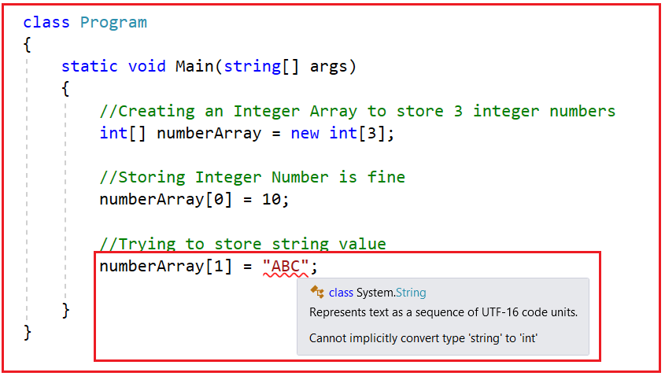
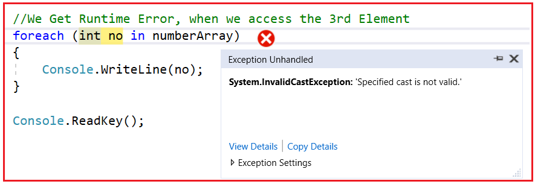

## **مزایا و معایب آرایه‌ها در سی شارپ**

در این مقاله، قصد دارم **مزایا و معایب آرایه‌ها در سی‌شارپ را** با مثال‌هایی مورد بحث قرار دهم. این یکی از سوالات متداول مصاحبه سی‌شارپ است. قبل از ادامه این مقاله، اکیداً توصیه می‌کنم دو مقاله زیر را بخوانید.

1. **آرایه‌ها در سی‌شارپ** - در اینجا مفاهیم اولیه آرایه‌ها را به همراه آرایه یک بعدی با مثال‌هایی مورد بحث قرار دادیم.
2. **آرایه‌های دوبعدی در سی‌شارپ** - در اینجا آرایه‌های دوبعدی را به همراه آرایه‌های دندانه‌دار در سی‌شارپ با مثال‌هایی مورد بحث قرار دادیم.

##### **مزایای استفاده از آرایه در سی شارپ:**

مزایای استفاده از آرایه در سی شارپ به شرح زیر است:

1. برای ذخیره انواع مشابه چندین آیتم داده با استفاده از یک نام واحد استفاده می‌شود.
2. ما می‌توانیم از آرایه‌ها برای پیاده‌سازی سایر ساختارهای داده مانند لیست‌های پیوندی، درخت‌ها، گراف‌ها، پشته‌ها، صف‌ها و غیره استفاده کنیم.
3. آرایه‌های دوبعدی در زبان برنامه‌نویسی سی‌شارپ برای نمایش ماتریس‌ها استفاده می‌شوند.
4. آرایه‌ها در سی‌شارپ از نوع Strongly Typed هستند. به این معنی که از آن‌ها برای ذخیره انواع مشابه چندین داده با استفاده از یک نام واحد استفاده می‌شود.

از آنجایی که آرایه‌ها از نوع Strongly typed هستند، دو مزیت به دست می‌آوریم. اول، عملکرد برنامه بسیار بهتر خواهد شد زیرا boxing و unboxing اتفاق نمی‌افتد. دوم، از خطاهای زمان اجرا به دلیل عدم تطابق نوع جلوگیری می‌شود. در این حالت، در زمان کامپایل، در صورت وجود عدم تطابق نوع، خطا را به شما نشان می‌دهد.

##### **مثال: آرایه‌ها هنگام عدم تطابق نوع، خطای کامپایل می‌دهند.**

در مثال زیر، یک آرایه عدد صحیح با نام numberArray ایجاد می‌کنیم. از آنجایی که این یک آرایه عدد صحیح است، بنابراین فقط می‌توانیم مقادیر عدد صحیح را در آرایه ذخیره کنیم. همانطور که می‌بینید وقتی سعی می‌کنیم یک مقدار رشته‌ای را در آرایه ذخیره کنیم، بلافاصله یک خطای کامپایلر به ما می‌دهد که می‌گوید " **نمی‌توان به طور ضمنی یک رشته را به یک عدد صحیح تبدیل کرد** ". به همین دلیل است که آرایه‌ها را در C# از نوع Strongly typed می‌نامیم.



شما می‌توانید با کلاس‌های مجموعه مانند **ArrayList** ، **Queue** ، **Stack** وجود دارند، **و غیره که در فضای نام System.Collections** با عدم تطابق نوع و خطاهای زمان اجرا مواجه شوید . ما در مقالات بعدی خود به تفصیل در مورد مجموعه‌ها بحث خواهیم کرد. اما در این مقاله، برای اینکه عدم تطابق نوع را درک کنید، اجازه دهید مثالی با استفاده از ArrayList که یک مجموعه در C# است، ایجاد کنیم.

##### **مثال عدم تطابق نوع با استفاده از مجموعه ArrayList در سی شارپ:**

در مثال زیر، ما یک مجموعه با استفاده از کلاس مجموعه ArrayList با نام numberArray ایجاد می‌کنیم. کلاس‌های مجموعه که در فضای نام System.Collections مانند **ArrayList** وجود دارند ، نوع داده آزادانه‌ای دارند. نوع داده آزادانه به این معنی است که می‌توانید هر نوع داده‌ای را در آن مجموعه ذخیره کنید. **ArrayList** در C# بر روی نوع داده شیء عمل می‌کند، که باعث می‌شود ArrayList نوع داده آزادانه‌ای داشته باشد. بنابراین، هیچ خطایی در زمان کامپایل دریافت نخواهید کرد، اما وقتی برنامه را اجرا می‌کنید، با خطای زمان اجرا مواجه خواهید شد.

```csharp
using System;
using System.Collections;

namespace ArayDemo
{
    class Program
    {
        static void Main(string[] args)
        {
            // Creating a Collection using Array List
            ArrayList numberArray = new ArrayList();
            numberArray.Add(10);
            numberArray.Add(200);

            // No CompileTime Error
            numberArray.Add("Pranaya");

            // We Get Runtime Error, when we access the 3rd Element
            foreach (int no in numberArray)
            {
                Console.WriteLine(no);
            }

            Console.ReadKey();
        }
    }
}
```

وقتی برنامه را اجرا می‌کنید، در زمان اجرا با خطای زیر مواجه خواهید شد. در اینجا، برنامه سعی دارد مقدار رشته را به یک متغیر عدد صحیح تبدیل و ذخیره کند و تبدیل نوع معتبر نیست، و از این رو خطایی صادر می‌کند که می‌گوید تبدیل نوع مشخص شده معتبر نیست. اگر به جای ArrayList از Array استفاده کنیم، این نوع خطا هرگز رخ نخواهد داد.



##### **معایب استفاده از آرایه‌ها در سی شارپ:**

1. اندازه آرایه ثابت است. بنابراین، باید از قبل بدانیم که چند عنصر قرار است در آرایه ذخیره شود. پس از ایجاد آرایه، دیگر هرگز نمی‌توانیم اندازه آرایه را افزایش یا کاهش دهیم. در صورت تمایل، می‌توانیم این کار را به صورت دستی با ایجاد یک آرایه جدید و کپی کردن عناصر آرایه قدیمی در آرایه جدید انجام دهیم.
2. از آنجایی که اندازه آرایه ثابت است، اگر حافظه بیشتری نسبت به نیاز اختصاص دهیم، حافظه اضافی هدر می‌رود. از طرف دیگر، اگر حافظه کمتری نسبت به نیاز اختصاص دهیم، مشکل ایجاد می‌شود.
3. ما هرگز نمی‌توانیم عنصری را در وسط یک آرایه قرار دهیم. همچنین حذف یا برداشتن عناصر از وسط یک آرایه امکان‌پذیر نیست.

برای غلبه بر مشکلات فوق، مجموعه‌ها (Collections) در سی‌شارپ معرفی شده‌اند. و در مقالات بعدی و مقالات بعدی، قصد داریم چارچوب مجموعه‌ها (Collections Framework) را به تفصیل مورد بحث قرار دهیم.