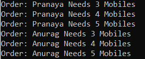
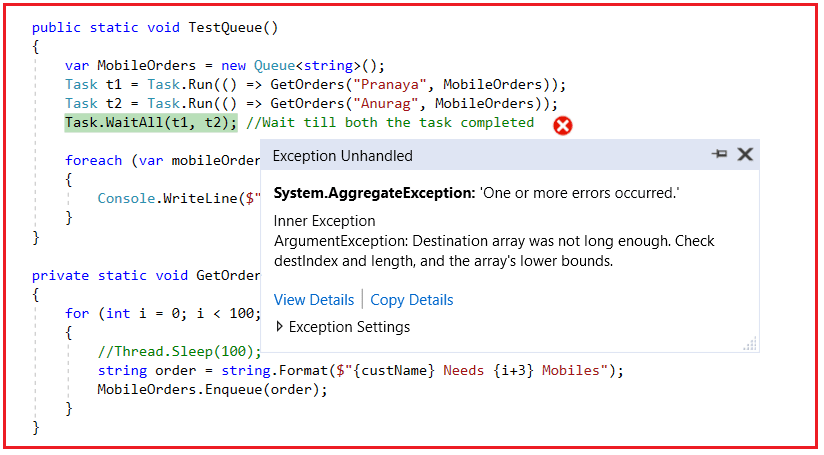
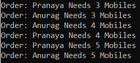
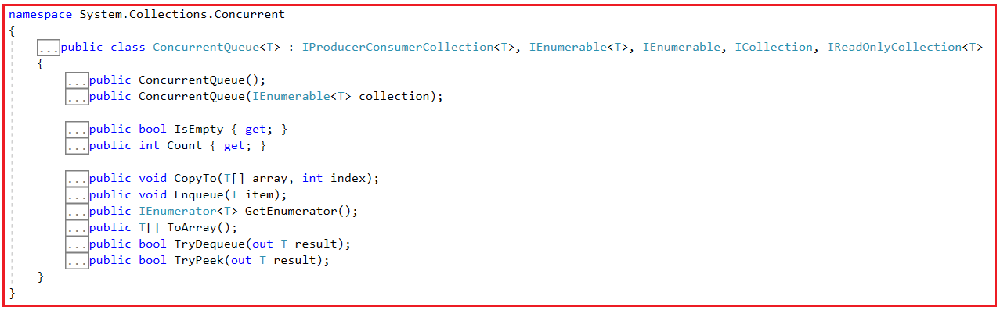
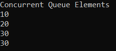
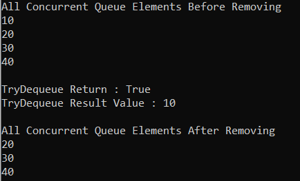
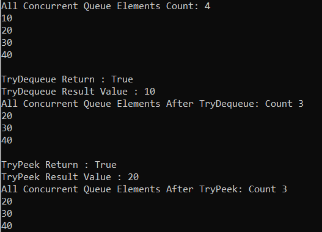
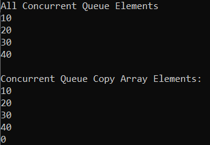

## **کلاس مجموعه ConcurrentQueue در سی شارپ به همراه مثال**

در این مقاله، قصد دارم **کلاس مجموعه ConcurrentQueue را در سی شارپ** با مثال‌هایی مورد بحث قرار دهم. لطفاً مقاله قبلی ما را که در آن کلاس مجموعه ConcurrentDictionary را در سی شارپ با مثال‌هایی مورد بحث قرار دادیم، مطالعه کنید. در پایان این مقاله، نکات زیر را خواهید فهمید.

1. **کلاس ConcurrentQueue\<T> در سی شارپ چیست؟**
2. **چرا به کلاس کلکسیون ConcurrentQueue\<T> در سی شارپ نیاز داریم؟**
3. **مثال صف عمومی با نخ واحد در سی شارپ**
4. **مثال صف عمومی با چند نخی در سی شارپ**
5. **صف عمومی با مکانیزم قفل در سی شارپ**
6. **مثال ConcurrentQueue با بیش از یک Thread در سی شارپ**
7. **چگونه یک مجموعه ConcurrentQueue\<T> در سی شارپ ایجاد کنیم؟**
8. **چگونه عناصر را به یک مجموعه ConcurrentQueue\<T> در سی شارپ اضافه کنیم؟**
9. **چگونه در سی شارپ به یک مجموعه ConcurrentQueue دسترسی پیدا کنیم؟**
10. **چگونه عناصر را از مجموعه ConcurrentQueue\<T> در سی شارپ حذف کنیم؟**
11. **چگونه اولین عنصر را از ConcurrentQueue در C# دریافت کنیم؟**
12. **چگونه یک مجموعه ConcurrentQueue را در یک آرایه موجود در C# کپی کنیم؟**
13. **کلاس مجموعه ConcurrentQueue\<T> با انواع پیچیده در سی شارپ**

##### **کلاس ConcurrentQueue\<T> در سی شارپ چیست؟**

کلاس ConcurrentQueue\<T> یک کلاس Collection Thread-Safe در C# است. این کلاس به عنوان بخشی از C# 4.0 معرفی شد و به **فضای نام System.Collections.Concurrent** تعلق دارد . این کلاس یک ساختار داده Thread-Safe First-In-First-Out (FIFO) ارائه می‌دهد. این بدان معناست که وقتی به دسترسی First-in First Out (FIFO) به آیتم‌های یک مجموعه در یک محیط چند رشته‌ای با thread safety نیاز داریم، باید از ConcurrentQueue\<T> Collection استفاده کنیم.

نحوه‌ی کار ConcurrentQueue\<T> بسیار شبیه به نحوه‌ی کار کلاس مجموعه‌ی Generic Queue\<T> است. تنها تفاوت بین آنها این است که Generic Queue\<T> از نظر thread-safe نیست در حالی که ConcurrentQueue\<T> از نظر thread-safe است. بنابراین، می‌توانیم از کلاس Queue\<T> به جای کلاس ConcurrentQueue\<T> با چندین thread استفاده کنیم، اما در این صورت، به عنوان یک توسعه‌دهنده، باید به طور صریح از قفل‌ها برای تأمین ایمنی thread استفاده کنیم که همیشه زمان‌بر و مستعد خطا است. بنابراین، انتخاب ایده‌آل این است که در یک محیط چند-threaded از ConcurrentQueue\<T> به جای Queue\<T> استفاده کنیم و با ConcurrentQueue\<T>، به عنوان یک توسعه‌دهنده، نیازی به پیاده‌سازی هیچ مکانیسم قفل‌گذاری نداریم.

##### **چرا به کلاس کلکسیون ConcurrentQueue\<T> در سی شارپ نیاز داریم؟**

بیایید بفهمیم که چرا به کلاس مجموعه ConcurrentQueue در C# نیاز داریم. بنابراین، کاری که در اینجا انجام خواهیم داد این است که ابتدا مثالی را با استفاده از Generic Queue مشاهده خواهیم کرد، سپس مشکل thread-safety با Generic Queue و نحوه حل این مشکل با پیاده‌سازی مکانیزم قفل‌گذاری را بررسی خواهیم کرد و در نهایت، نحوه استفاده از مجموعه ConcurrentQueue را بررسی خواهیم کرد.

##### **مثال صف عمومی با نخ واحد در سی شارپ:**

در مثال زیر، ما یک صف عمومی به نام **MobileOrders** برای ذخیره اطلاعات سفارش ایجاد کرده‌ایم. علاوه بر این، اگر در کد زیر توجه کرده باشید، متد GetOrders از متد TestQueue به صورت منظم و همگام فراخوانی می‌شود. و از متد main، ما به سادگی متد TestQueue را فراخوانی می‌کنیم.

```csharp
using System;
using System.Collections.Generic;
using System.Threading;

namespace ConcurrentQueueDemo
{
    class Program
    {
        static void Main()
        {
            TestQueue();
            Console.ReadKey();
        }

        public static void TestQueue()
        {
            var MobileOrders = new Queue<string>();
            GetOrders("Pranaya", MobileOrders);
            GetOrders("Anurag", MobileOrders);

            foreach (var mobileOrder in MobileOrders)
            {
                Console.WriteLine($"Order: {mobileOrder}");
            }
        }

        private static void GetOrders(string custName, Queue<string> MobileOrders)
        {
            for (int i = 0; i < 3; i++)
            {
                Thread.Sleep(100);
                string order = string.Format($"{custName} Needs {i+3} Mobiles");
                MobileOrders.Enqueue(order);
            }
        }
    }
}
```

###### **خروجی:**



از آنجایی که متد GetOrders به ​​صورت همزمان فراخوانی می‌شود، خروجی نیز به طور مشابه چاپ می‌شود، یعنی ابتدا Pranaya و سپس Anurag که همان چیزی است که می‌توانید در خروجی بالا مشاهده کنید.

##### **مثال صف عمومی با چند نخی در سی شارپ:**

حالا، بیایید مثال قبلی را طوری تغییر دهیم که ناهمگام باشد. برای این کار، از یک Task استفاده کرده‌ایم که GetOrders را توسط دو thread مختلف فراخوانی می‌کند. و این تغییرات را درون متد TestQueue انجام داده‌ایم. علاوه بر این، تعداد حلقه‌ها را درون متد GetOrders به ​​۱۰۰ تغییر داده‌ایم و دستور Thread.Sleep را همانطور که در مثال زیر نشان داده شده است، حذف کرده‌ایم.

```csharp
using System;
using System.Collections.Generic;
using System.Threading;
using System.Threading.Tasks;

namespace ConcurrentQueueDemo
{
    class Program
    {
        static void Main()
        {
            TestQueue();
            Console.ReadKey();
        }

        public static void TestQueue()
        {
            var MobileOrders = new Queue<string>();
            Task t1 = Task.Run(() => GetOrders("Pranaya", MobileOrders));
            Task t2 = Task.Run(() => GetOrders("Anurag", MobileOrders));
            Task.WaitAll(t1, t2); //Wait till both the task completed
            
            foreach (var mobileOrder in MobileOrders)
            {
                Console.WriteLine($"Order: {mobileOrder}");
            }
        }

        private static void GetOrders(string custName, Queue<string> MobileOrders)
        {
            for (int i = 0; i < 100; i++)
            {
                //Thread.Sleep(100);
                string order = string.Format($"{custName} Needs {i+3} Mobiles");
                MobileOrders.Enqueue(order);
            }
        }
    }
}
```

###### **خروجی:**



شما هر بار با خطای فوق مواجه نخواهید شد. سعی کنید برنامه را چندین بار اجرا کنید و در برخی موارد، با خطای فوق مواجه خواهید شد.

##### **چرا با خطای فوق مواجه می‌شویم؟**

دلیل این امر این است که متد Enqueue از کلاس Generic Queue\<T> Collection برای کار با بیش از یک نخ به صورت موازی طراحی نشده است، یعنی thread-safety نیست. بنابراین، Multi-Threading با Generic Queue\<T> غیرقابل پیش‌بینی است. ممکن است در برخی موارد کار کند، اما اگر چندین بار امتحان کنید، احتمالاً با یک استثنا مواجه خواهید شد.

##### **صف عمومی با مکانیزم قفل در سی شارپ:**

در مثال زیر، ما از کلمه کلیدی معروف lock برای دستوری که دستور را به صف اضافه می‌کند، استفاده می‌کنیم.

```csharp
using System;
using System.Collections.Generic;
using System.Threading;
using System.Threading.Tasks;

namespace ConcurrentQueueDemo
{
    class Program
    {
        static object lockObj = new object();

        static void Main()
        {
            TestQueue();
            Console.ReadKey();
        }

        public static void TestQueue()
        {
            var MobileOrders = new Queue<string>();
            Task t1 = Task.Run(() => GetOrders("Pranaya", MobileOrders));
            Task t2 = Task.Run(() => GetOrders("Anurag", MobileOrders));
            Task.WaitAll(t1, t2); //Wait till both the task completed
            
            foreach (var mobileOrder in MobileOrders)
            {
                Console.WriteLine($"Order: {mobileOrder}");
            }
        }

        private static void GetOrders(string custName, Queue<string> MobileOrders)
        {
            for (int i = 0; i < 100; i++)
            {
                //Thread.Sleep(100);
                string order = string.Format($"{custName} Needs {i+3} Mobiles");
                lock (lockObj)
                {
                    MobileOrders.Enqueue(order);
                }  
            }
        }
    }
}
```

حالا کد بالا را اجرا کنید و هیچ استثنایی دریافت نخواهید کرد. مشکلی نیست. بنابراین، پس از قرار دادن قفل روی متد Enqueue، هیچ استثنایی دریافت نخواهید کرد. اما اگر Enqueue چندین بار فراخوانی شود، آیا باید از دستور lock در همه جا استفاده کنید؟ اگر این کار را انجام دهید، این یک فرآیند زمان‌بر و مستعد خطا است زیرا ممکن است فراموش کنید که در جایی از lock استفاده کنید. راه حل استفاده از ConcurrentQueue است.

##### **صف همزمان با بیش از یک نخ در سی شارپ:**

ConcurrentQueue به طور خودکار در یک محیط چند رشته‌ای، thread-safety را فراهم می‌کند. بیایید همین مثال را با استفاده از کلاس ConcurrentQueue بازنویسی کنیم و خروجی را ببینیم و سپس کلاس مجموعه ConcurrentQueue را با جزئیات مورد بحث قرار خواهیم داد. در مثال زیر، ما به سادگی کلاس Queue را با ConcurrentQueue جایگزین می‌کنیم. و دستوری که برای قفل کردن استفاده شده است را حذف می‌کنیم. لطفاً توجه داشته باشید که کلاس ConcurrentQueue متعلق به فضای نام System.Collections.Concurrent است، بنابراین آن فضای نام را نیز اضافه کنید.

```csharp
using System;
using System.Collections.Concurrent;
using System.Threading;
using System.Threading.Tasks;

namespace ConcurrentQueueDemo
{
    class Program
    {
        static void Main()
        {
            TestQueue();
            Console.ReadKey();
        }

        public static void TestQueue()
        {
            var MobileOrders = new ConcurrentQueue<string>();
            Task t1 = Task.Run(() => GetOrders("Pranaya", MobileOrders));
            Task t2 = Task.Run(() => GetOrders("Anurag", MobileOrders));
            Task.WaitAll(t1, t2); //Wait till both the task completed
            
            foreach (var mobileOrder in MobileOrders)
            {
                Console.WriteLine($"Order: {mobileOrder}");
            }
        }

        private static void GetOrders(string custName, ConcurrentQueue<string> MobileOrders)
        {
            for (int i = 0; i < 3; i++)
            {
                Thread.Sleep(100);
                string order = string.Format($"{custName} Needs {i+3} Mobiles");
                MobileOrders.Enqueue(order);
            }
        }
    }
}
```

###### **خروجی:**



حالا، امیدوارم نیاز اساسی به کلاس کلکسیون ConcurrentQueue را درک کرده باشید.

##### **متدها، ویژگی‌ها و سازنده‌های کلاس ConcurrentQueue در سی‌شارپ:**

بیایید متدها، ویژگی‌ها و سازنده‌های مختلف کلاس ConcurrentQueue Collection را در سی‌شارپ درک کنیم. اگر روی کلاس ConcurrentQueue کلیک راست کرده و گزینه go to definition را انتخاب کنید، تصویر زیر را خواهید دید. کلاس ConcurrentQueue متعلق به فضای نام System.Collections.Concurrent است و رابط‌های IProducerConsumerCollection\<T>، IEnumerable\<T>، IEnumerable، ICollection، IReadOnlyCollection\<T> را پیاده‌سازی می‌کند.



##### **چگونه یک مجموعه ConcurrentQueue\<T> در سی شارپ ایجاد کنیم؟**

کلاس مجموعه ConcurrentQueue\<T> در سی شارپ، دو سازنده زیر را برای ایجاد یک نمونه از کلاس ConcurrentQueue\<T> ارائه می‌دهد.

1. **ConcurrentQueue():** برای مقداردهی اولیه یک نمونه جدید از کلاس ConcurrentQueue استفاده می‌شود.
2. **ConcurrentQueue(IEnumerable\<T> collection) :** برای مقداردهی اولیه یک نمونه جدید از کلاس ConcurrentQueue که شامل عناصر کپی شده از مجموعه مشخص شده است، استفاده می‌شود.

بیایید ببینیم چگونه می‌توان با استفاده از سازنده‌ی ConcurrentQueue() یک نمونه از ConcurrentQueue ایجاد کرد:

**مرحله ۱:**  
از آنجایی که کلاس ConcurrentQueue\<T> متعلق به فضای نام System.Collections.Concurrent است، بنابراین ابتدا باید فضای نام System.Collections.Concurrent را به برنامه خود اضافه کنیم:  
**با استفاده از System.Collections.Concurrent؛**

**مرحله ۲:**  
در مرحله بعد، باید با استفاده از سازنده ConcurrentQueue() به صورت زیر یک نمونه از کلاس ConcurrentQueue ایجاد کنیم:  
**ConcurrentQueue\<type> ConcurrentQueue_Name = new ConcurrentQueue\<type>();**  
در اینجا، نوع می‌تواند هر نوع داده‌ی داخلی مانند int، double، string و غیره، یا هر نوع داده‌ی تعریف‌شده توسط کاربر مانند Customer، Employee، Product و غیره باشد.

##### **چگونه عناصر را به یک مجموعه ConcurrentQueue\<T> در سی شارپ اضافه کنیم؟**

اگر می‌خواهید عناصری را به یک مجموعه ConcurrentQueue در سی‌شارپ اضافه کنید، باید از متد Enqueue() زیر از کلاس ConcurrentQueue\<T> استفاده کنید.

1. **Enqueue(T item):** متد Enqueue(T item) برای اضافه کردن یک عنصر به انتهای ConcurrentQueue استفاده می‌شود. در اینجا، پارامتر item شیء مورد نظر برای اضافه کردن به انتهای ConcurrentQueue را مشخص می‌کند. مقدار می‌تواند برای یک نوع مرجع، یعنی وقتی T یک نوع مرجع است، null باشد.

برای مثال،  
**ConcurrentQueue\<int> queue= new ConcurrentQueue\<int>();**  
دستور بالا یک ConcurrentQueue از نوع عدد صحیح ایجاد می‌کند. بنابراین، در اینجا فقط می‌توانیم عناصر از نوع عدد صحیح را به ConcurrentQueue اضافه کنیم. اگر سعی کنیم چیزی غیر از عدد صحیح اضافه کنیم، با خطای زمان کامپایل مواجه خواهیم شد.  
**صف.در صف قرار دادن(10)؛**  
**صف.در صف قرار دادن(20)؛**  
**queue.Enqueue(“Hell0”);** **// خطای زمان کامپایل**

**نکته:** ما نمی‌توانیم با استفاده از Collection Initializer عناصر را به ConcurrentQueue اضافه کنیم.

##### **چگونه در سی شارپ به یک مجموعه ConcurrentQueue دسترسی پیدا کنیم؟**

ما می‌توانیم با استفاده از حلقه for each به صورت زیر به تمام عناصر مجموعه ConcurrentQueue در سی شارپ دسترسی پیدا کنیم.  
**foreach (مورد متغیر در صف)**  
**{**  
**خط نوشتن کنسول (مورد)؛**  
**}**

##### **مثالی برای درک نحوه ایجاد یک ConcurrentQueue و افزودن عناصر در C#:**

برای درک بهتر نحوه ایجاد یک ConcurrentQueue، نحوه اضافه کردن عناصر و نحوه دسترسی به همه عناصر ConcurrentQueue در سی شارپ با استفاده از حلقه for-each، لطفاً به مثال زیر که سه مورد فوق را نشان می‌دهد، نگاهی بیندازید.

```csharp
using System;
using System.Collections.Concurrent;

namespace ConcurrentQueueDemo
{
    class Program
    {
        static void Main()
        {
            //Creating a ConcurrentQueue to Store Integer Values
            ConcurrentQueue<int> concurrentQueue = new ConcurrentQueue<int>();

            //Adding Elements to ConcurrentQueue using Enqueue Method
            concurrentQueue.Enqueue(10);
            concurrentQueue.Enqueue(20);
            concurrentQueue.Enqueue(30);
            //Adding Duplicate
            concurrentQueue.Enqueue(30);

            //As int is not a Reference type so null can not be accepted by this ConcurrentQueue
            //concurrentQueue.Enqueue(null); //Compile-Time Error

            //As the concurrentQueue is integer type, so string values can not be accepted
            //concurrentQueue.Enqueue("Hell0"); //Compile-Time Error

            //Accesing all the Elements of concurrentQueue using For Each Loop
            Console.WriteLine("Concurrent Queue Elements");
            foreach (var item in concurrentQueue)
            {
                Console.WriteLine(item);
            }
            Console.ReadKey();
        }
    }
}
```

###### **خروجی:**



##### **چگونه عناصر را از مجموعه ConcurrentQueue\<T> در سی شارپ حذف کنیم؟**

در ConcurrentQueue، عناصری که ابتدا اضافه می‌شوند، عنصری هستند که ابتدا حذف می‌شوند. این بدان معناست که ما مجاز به حذف عناصر از ابتدای ConcurrentQueue هستیم. کلاس مجموعه ConcurrentQueue در C# متد TryDequeue زیر را برای حذف یک عنصر ارائه می‌دهد.

1. **TryDequeue(out T result):** این متد سعی می‌کند شیء موجود در ابتدای صف همزمان را حذف و برگرداند. در اینجا، پارامتر result شامل شیء حذف شده در صورت موفقیت‌آمیز بودن عملیات است. اگر هیچ شیء برای حذف در دسترس نبود، مقدار آن نامشخص است. این متد در صورتی که عنصری حذف شده و با موفقیت از ابتدای ConcurrentQueue برگردانده شده باشد، مقدار true و در غیر این صورت مقدار false را برمی‌گرداند.

بیایید مثالی برای درک متدهای TryDequeue(out T result) از کلاس Collection به نام ConcurrentQueue\<T> در سی شارپ ببینیم. لطفاً به مثال زیر که نحوه‌ی استفاده از متد TryDequeue را نشان می‌دهد، نگاهی بیندازید.

```csharp
using System;
using System.Collections.Concurrent;

namespace ConcurrentQueueDemo
{
    class Program
    {
        static void Main()
        {
            //Creating a ConcurrentQueue to Store Integer Values
            ConcurrentQueue<int> concurrentQueue = new ConcurrentQueue<int>();

            //Adding Elements to ConcurrentQueue using Enqueue Method
            concurrentQueue.Enqueue(10);
            concurrentQueue.Enqueue(20);
            concurrentQueue.Enqueue(30);
            concurrentQueue.Enqueue(40);

            Console.WriteLine("All Concurrent Queue Elements Before Removing");
            foreach (var item in concurrentQueue)
            {
                Console.WriteLine(item);
            }

            bool IsRemoved = concurrentQueue.TryDequeue(out int Result);
            Console.WriteLine($"\nTryDequeue Return : {IsRemoved}");
            Console.WriteLine($"TryDequeue Result Value : {Result}");

            Console.WriteLine("\nAll Concurrent Queue Elements After Removing");
            foreach (var item in concurrentQueue)
            {
                Console.WriteLine(item);
            }
            
            Console.ReadKey();
        }
    }
}
```

###### **خروجی:**



##### **چگونه اولین عنصر را از ConcurrentQueue در C# دریافت کنیم؟**

کلاس مجموعه ConcurrentQueue\<T> در سی شارپ دو متد زیر را برای دریافت اولین عنصر از مجموعه ConcurrentQueue ارائه می‌دهد.

1. **TryDequeue(out T result):** این متد سعی می‌کند شیء موجود در ابتدای صف همزمان را حذف و برگرداند. در اینجا، پارامتر result شامل شیء حذف شده در صورت موفقیت‌آمیز بودن عملیات است. اگر هیچ شیء برای حذف در دسترس نبود، مقدار آن نامشخص است. این متد در صورتی که عنصری حذف شده و با موفقیت از ابتدای ConcurrentQueue برگردانده شده باشد، مقدار true و در غیر این صورت مقدار false را برمی‌گرداند.
2. **TryPeek(out T result):** این متد سعی می‌کند یک شیء را از ابتدای ConcurrentQueue بدون حذف آن برگرداند. در اینجا، پارامتر result شامل یک شیء از ابتدای ConcurrentQueue یا یک مقدار نامشخص در صورت عدم موفقیت عملیات است. اگر یک شیء با موفقیت برگردانده شود، مقدار true و در غیر این صورت، مقدار false را برمی‌گرداند.

برای درک بهتر، لطفاً به مثال زیر نگاهی بیندازید که نحوه دریافت اولین عنصر از ConcurrentQueue را با استفاده از متدهای TryDequeue(out T result) و TryPeek(out T result) از کلاس ConcurrentQueue\<T> Collection در سی شارپ نشان می‌دهد.

```csharp
using System;
using System.Collections.Concurrent;

namespace ConcurrentQueueDemo
{
    class Program
    {
        static void Main()
        {
            //Creating a ConcurrentQueue to Store Integer Values
            ConcurrentQueue<int> concurrentQueue = new ConcurrentQueue<int>();

            //Adding Elements to ConcurrentQueue using Enqueue Method
            concurrentQueue.Enqueue(10);
            concurrentQueue.Enqueue(20);
            concurrentQueue.Enqueue(30);
            concurrentQueue.Enqueue(40);

            //Accesing all the Elements of ConcurrentQueue using For Each Loop
            Console.WriteLine($"All Concurrent Queue Elements Count: {concurrentQueue.Count}");
            foreach (var item in concurrentQueue)
            {
                Console.WriteLine(item);
            }

            // Removing and Returning the First Element from ConcurrentQueue using TryDequeue method
            bool IsRemoved = concurrentQueue.TryDequeue(out int Result1);
            Console.WriteLine($"\nTryDequeue Return : {IsRemoved}");
            Console.WriteLine($"TryDequeue Result Value : {Result1}");

            //Printing Elements After Removing the First Element
            Console.WriteLine($"All Concurrent Queue Elements After TryDequeue: Count {concurrentQueue.Count}");
            foreach (var element in concurrentQueue)
            {
                Console.WriteLine($"{element} ");
            }

            // Removing and Returning the First Element from ConcurrentQueue using TryDequeue method
            bool IsPeeked = concurrentQueue.TryPeek(out int Result2);
            Console.WriteLine($"\nTryPeek Return : {IsPeeked}");
            Console.WriteLine($"TryPeek Result Value : {Result2}");

            //Printing Elements After Peek the First Element
            Console.WriteLine($"All Concurrent Queue Elements After TryPeek: Count {concurrentQueue.Count}");
            foreach (var element in concurrentQueue)
            {
                Console.WriteLine($"{element} ");
            }

            Console.ReadKey();
        }
    }
}
```

###### **خروجی:**



##### **چگونه یک مجموعه ConcurrentQueue را در یک آرایه موجود در C# کپی کنیم؟**

برای کپی کردن یک مجموعه ConcurrentQueue به یک آرایه موجود در سی شارپ، باید از متد CopyTo زیر از کلاس مجموعه ConcurrentQueue استفاده کنیم.

1. **CopyTo(T[] array, int index) :** این متد برای کپی کردن عناصر ConcurrentQueue به یک آرایه تک بعدی موجود، با شروع از اندیس آرایه مشخص شده، استفاده می‌شود. در اینجا، پارامتر array، آرایه تک بعدی را مشخص می‌کند که مقصد عناصر کپی شده از ConcurrentQueue است. آرایه باید دارای اندیس گذاری مبتنی بر صفر باشد. پارامتر index، اندیس مبتنی بر صفر را در آرایه‌ای که کپی از آن شروع می‌شود، مشخص می‌کند.

این متد روی آرایه‌های یک بعدی کار می‌کند و وضعیت ConcurrentQueue را تغییر نمی‌دهد. عناصر در آرایه به همان ترتیبی که از ابتدای ConcurrentQueue تا انتهای آن مرتب شده‌اند، مرتب می‌شوند. برای درک بهتر متد CopyTo(T[] array, int index) از کلاس Collection\<T>ConcurrentQueue در سی‌شارپ، مثالی را بررسی می‌کنیم.

```csharp
using System;
using System.Collections.Concurrent;

namespace ConcurrentQueueDemo
{
    class Program
    {
        static void Main()
        {
            //Creating a ConcurrentQueue to Store Integer Values
            ConcurrentQueue<int> concurrentQueue = new ConcurrentQueue<int>();

            //Adding Elements to ConcurrentQueue using Enqueue Method
            concurrentQueue.Enqueue(10);
            concurrentQueue.Enqueue(20);
            concurrentQueue.Enqueue(30);
            concurrentQueue.Enqueue(40);

            //Accesing all the Elements of ConcurrentQueue using For Each Loop
            Console.WriteLine($"All Concurrent Queue Elements");
            foreach (var item in concurrentQueue)
            {
                Console.WriteLine(item);
            }

            //Copying the ConcurrentQueue to an array
            int[] concurrentQueueCopy = new int[5];
            concurrentQueue.CopyTo(concurrentQueueCopy, 0);
            Console.WriteLine("\nConcurrent Queue Copy Array Elements:");
            foreach (var item in concurrentQueueCopy)
            {
                Console.WriteLine(item);
            }

            Console.ReadKey();
        }
    }
}
```

###### **خروجی:**



##### **کلاس مجموعه ConcurrentQueue\<T> با انواع پیچیده در سی شارپ.**

تاکنون، ما از کلاس ConcurrentQueue Collection با انواع داده اولیه مانند int، double و غیره استفاده کرده‌ایم. حال، بیایید ببینیم چگونه از ConcurrentQueue Collection با انواع داده‌های پیچیده مانند Employee، Student، Customer، Product و غیره استفاده کنیم. برای درک بهتر، لطفاً به مثال زیر نگاهی بیندازید که در آن از ConcurrentQueue\<T> Collection با نوع Student تعریف شده توسط کاربر استفاده می‌کنیم.

```csharp
using System;
using System.Collections.Concurrent;

namespace ConcurrentQueueDemo
{
    class Program
    {
        static void Main()
        {
            //Creating a ConcurrentQueue to Store Integer Values
            ConcurrentQueue<Student> concurrentQueue = new ConcurrentQueue<Student>();

            //Adding Elements to ConcurrentQueue using Enqueue Method
            concurrentQueue.Enqueue(new Student() { ID = 101, Name = "Anurag", Branch = "CSE" });
            concurrentQueue.Enqueue(new Student() { ID = 102, Name = "Mohanty", Branch = "CSE" });
            concurrentQueue.Enqueue(new Student() { ID = 103, Name = "Sambit", Branch = "ETC" });

            //Accesing all the Elements of ConcurrentQueue using For Each Loop
            Console.WriteLine($"All Concurrent Queue Elements");
            foreach (var item in concurrentQueue)
            {
                Console.WriteLine($"ID: {item.ID}, Name: {item.Name}, Branch: {item.Branch}");
            }
            
            Console.ReadKey();
        }
    }
    public class Student
    {
        public int ID { get; set; }
        public string Name { get; set; }
        public string Branch { get; set; }
    }
}
```

###### **خروجی:**

