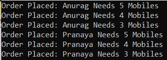
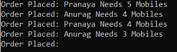
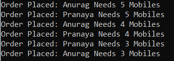
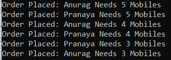
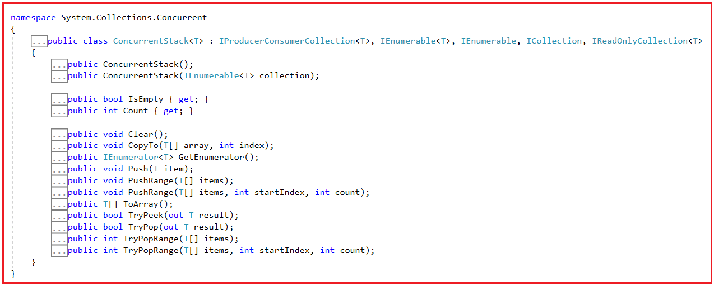
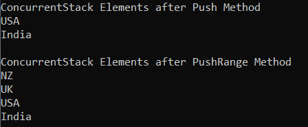
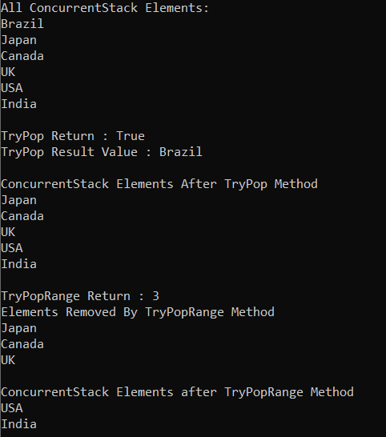
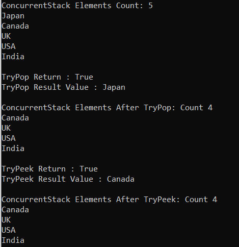
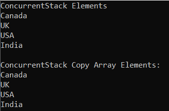
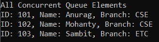

## **کلاس مجموعه ConcurrentStack\<T> در سی شارپ به همراه مثال**

در این مقاله، قصد دارم **کلاس مجموعه ConcurrentStack\<T> را در سی شارپ** با مثال‌هایی مورد بحث قرار دهم. لطفاً مقاله قبلی ما را که در آن کلاس مجموعه ConcurrentQueue را در سی شارپ با مثال‌هایی مورد بحث قرار دادیم، مطالعه کنید. در پایان این مقاله، نکات زیر را خواهید فهمید.

1. **کلاس ConcurrentStack\<T> در سی شارپ چیست؟**
2. **چرا به کلاس کلکسیون ConcurrentStack\<T> در سی شارپ نیاز داریم؟**
3. **مثال پشته عمومی با نخ واحد در سی شارپ**
4. **مثال پشته عمومی با چند نخی در سی شارپ**
5. **پشته عمومی با مکانیزم قفل در سی شارپ**
6. **کلاس مجموعه ConcurrentStack\<T> با چندین نخ در سی شارپ**
7. **چگونه یک مجموعه ConcurrentStack\<T> در سی شارپ ایجاد کنیم؟**
8. **چگونه عناصر را به یک مجموعه ConcurrentStack\<T> در سی شارپ اضافه کنیم؟**
9. **چگونه در سی شارپ به مجموعه ConcurrentStack دسترسی پیدا کنیم؟**
10. **چگونه عناصر را از مجموعه ConcurrentStack\<T> در سی شارپ حذف کنیم؟**
11. **چگونه عنصر بالا را از ConcurrentStack در C# دریافت کنیم؟**
12. **چگونه یک مجموعه ConcurrentStack را در یک آرایه موجود در C# کپی کنیم؟**
13. **کلاس مجموعه ConcurrentStack\<T> با انواع پیچیده در سی شارپ**
14. **تفاوت بین Stack\<T> و ConcurrentStack\<T> در سی شارپ**

##### **کلاس ConcurrentStack\<T> در سی شارپ چیست؟**

کلاس ConcurrentStack\<T> یک کلاس Collection با قابلیت Thread-Safe در زبان برنامه‌نویسی سی‌شارپ است. این کلاس به عنوان بخشی از .NET Framework 4.0 معرفی شد و به فضای نام System.Collections.Concurrent تعلق دارد. این کلاس یک ساختار داده‌ی LIFO (آخرین ورودی-اولین خروجی) با قابلیت Thread-Safe ارائه می‌دهد. این بدان معناست که وقتی به دسترسی LIFO (آخرین ورودی-اولین خروجی) به عناصر Collection در یک محیط چند رشته‌ای با قابلیت Thread Safety نیاز داریم، باید از ConcurrentStack\<T> Collection استفاده کنیم.

نحوه‌ی کار ConcurrentStack\<T> بسیار شبیه به نحوه‌ی کار کلاس کلکسیون Generic Stack\<T> در C# است. تنها تفاوت بین آنها این است که کلکسیون Generic Stack\<T> از نظر thread-safe نیست در حالی که ConcurrentStack\<T> از نظر thread-safe است. بنابراین، می‌توانیم از کلاس Generic Stack به جای ConcurrentStack با چندین thread استفاده کنیم، اما در این صورت، به عنوان یک توسعه‌دهنده، باید به طور صریح از قفل‌ها برای تأمین ایمنی thread استفاده کنیم که همیشه زمان‌بر و مستعد خطا است. بنابراین، انتخاب ایده‌آل این است که در یک محیط چند-رشته‌ای از ConcurrentStack\<T> به جای Generic Stack\<T> استفاده کنیم و با ConcurrentStack\<T>، به عنوان یک توسعه‌دهنده، نیازی به پیاده‌سازی صریح هیچ مکانیسم قفل‌گذاری نداریم. کلاس کلکسیون ConcurrentStack\<T> ایمنی thread را به صورت داخلی مدیریت می‌کند.

##### **چرا به کلاس کلکسیون ConcurrentStack\<T> در سی شارپ نیاز داریم؟**

بیایید با چند مثال بفهمیم که چرا به کلاس کلکسیون ConcurrentStack در C# نیاز داریم. بنابراین، کاری که در اینجا انجام خواهیم داد این است که ابتدا مثال‌هایی را با استفاده از Generic Stack مشاهده خواهیم کرد، سپس مشکل thread-safety با Generic Stack و نحوه حل مشکل thread-safety با پیاده‌سازی صریح مکانیسم قفل‌گذاری را بررسی خواهیم کرد و در نهایت، نحوه استفاده از کلاس کلکسیون ConcurrentStack ارائه شده توسط فضای نام System.Collections.Concurrent را خواهیم دید.

##### **مثال پشته عمومی با نخ واحد در سی شارپ:**

در مثال زیر، ما یک پشته عمومی به نام MobileOrders ایجاد کرده‌ایم تا اطلاعات سفارش برای موبایل را ذخیره کند. علاوه بر این، اگر در کد زیر توجه کرده باشید، متد GetOrders از متد TestStack به صورت منظم و همزمان فراخوانی می‌شود. و از متد اصلی، ما به سادگی متد TestStack را فراخوانی می‌کنیم.

```csharp
using System;
using System.Collections.Generic;
using System.Threading;

namespace ConcurrentStackDemo
{
    class Program
    {
        static void Main()
        {
            TestStack();
            Console.ReadKey();
        }

        public static void TestStack()
        {
            Stack<string> MobileOrders = new Stack<string>();
            GetOrders("Pranaya", MobileOrders);
            GetOrders("Anurag", MobileOrders);

            foreach (var mobileOrder in MobileOrders)
            {
                Console.WriteLine($"Order Placed: {mobileOrder}");
            }
        }

        private static void GetOrders(string custName, Stack<string> MobileOrders)
        {
            for (int i = 0; i < 3; i++)
            {
                Thread.Sleep(100);
                string order = string.Format($"{custName} Needs {i + 3} Mobiles");
                MobileOrders.Push(order);
            }
        }
    }
}
```

###### **خروجی:**



از آنجایی که متد GetOrders به ​​صورت همزمان فراخوانی می‌شود، خروجی نیز به طور مشابه چاپ می‌شود، یعنی ابتدا Pranaya و سپس Anurag که همان چیزی است که می‌توانید در خروجی بالا مشاهده کنید.

##### **مثال پشته عمومی با چند نخی در سی شارپ:**

حالا، بیایید مثال قبلی را طوری تغییر دهیم که ناهمزمان باشد. برای این کار، از Task استفاده کرده‌ایم که متد GetOrders را با استفاده از دو thread مختلف فراخوانی می‌کند. و ما این تغییرات را همانطور که در کد زیر نشان داده شده است، درون متد TestStack انجام داده‌ایم.

```csharp
using System;
using System.Collections.Generic;
using System.Threading;
using System.Threading.Tasks;

namespace ConcurrentStackDemo
{
    class Program
    {
        static void Main()
        {
            TestStack();
            Console.ReadKey();
        }

        public static void TestStack()
        {
            Stack<string> MobileOrders = new Stack<string>();
            
            Task t1 = Task.Run(() => GetOrders("Pranaya", MobileOrders));
            Task t2 = Task.Run(() => GetOrders("Anurag", MobileOrders));
            Task.WaitAll(t1, t2); //Wait till both the task completed
            
            foreach (var mobileOrder in MobileOrders)
            {
                Console.WriteLine($"Order Placed: {mobileOrder}");
            }
        }

        private static void GetOrders(string custName, Stack<string> MobileOrders)
        {
            for (int i = 0; i < 3; i++)
            {
                Thread.Sleep(100);
                string order = string.Format($"{custName} Needs {i + 3} Mobiles");
                MobileOrders.Push(order);
            }
        }
    }
}
```

حالا کد بالا را چندین بار اجرا کنید و هر بار خروجی متفاوتی دریافت خواهید کرد. این بدان معناست که خروجی مطابق تصویر زیر ثابت نیست.



##### **چرا خروجی مورد انتظار را دریافت نمی‌کنیم؟**

دلیل این امر این است که متد Push از کلاس Generic Stack\<T> Collection برای کار با بیش از یک نخ به صورت موازی طراحی نشده است، یعنی متد Push از نوع thread safety نیست. بنابراین، Multi-Threading با Generic Stack\<T> غیرقابل پیش‌بینی است. به این معنی که گاهی اوقات ممکن است کار کند اما اگر چندین بار آن را امتحان کنید، نتایج غیرمنتظره‌ای خواهید گرفت.

##### **پشته عمومی با مکانیزم قفل در سی شارپ:**

در مثال زیر، ما از کلمه کلیدی lock برای دستوری که دستور را به پشته اضافه می‌کند، یعنی متد Push، استفاده می‌کنیم.

```csharp
using System;
using System.Collections.Generic;
using System.Threading;
using System.Threading.Tasks;

namespace ConcurrentStackDemo
{
    class Program
    {
        static object lockObject = new object();
        static void Main()
        {
            TestStack();
            Console.ReadKey();
        }

        public static void TestStack()
        {
            Stack<string> MobileOrders = new Stack<string>();
            
            Task t1 = Task.Run(() => GetOrders("Pranaya", MobileOrders));
            Task t2 = Task.Run(() => GetOrders("Anurag", MobileOrders));
            Task.WaitAll(t1, t2); //Wait till both the task completed
            
            foreach (var mobileOrder in MobileOrders)
            {
                Console.WriteLine($"Order Placed: {mobileOrder}");
            }
        }

        private static void GetOrders(string custName, Stack<string> MobileOrders)
        {
            for (int i = 0; i < 3; i++)
            {
                Thread.Sleep(100);
                string order = string.Format($"{custName} Needs {i + 3} Mobiles");
                lock (lockObject)
                {
                    MobileOrders.Push(order);
                }
            }
        }
    }
}
```

حالا کد بالا را اجرا کنید و خروجی مورد انتظار را همانطور که در تصویر زیر نشان داده شده است، دریافت خواهید کرد.



اشکالی ندارد. بنابراین، پس از اعمال قفل روی متد Push، نتایج مورد انتظار را دریافت می‌کنیم. اما اگر Push چندین بار در مکان‌های مختلف برنامه ما فراخوانی شود، آیا می‌خواهید از دستور lock در همه جا استفاده کنید؟ اگر این کار را انجام دهید، این یک فرآیند زمان‌بر و همچنین مستعد خطا است زیرا ممکن است فراموش کنید که در جایی از قفل استفاده کنید. راه حل استفاده از ConcurrentStack است.

##### **کلاس مجموعه ConcurrentStack\<T> با چندین نخ در سی شارپ:**

ConcurrentStack به طور خودکار در یک محیط چند رشته‌ای، ایمنی نخ را فراهم می‌کند. بیایید مثال قبلی را با استفاده از کلاس مجموعه ConcurrentStack بازنویسی کنیم و خروجی را ببینیم و سپس کلاس مجموعه ConcurrentStack را با جزئیات مورد بحث قرار دهیم. در مثال زیر، ما به سادگی کلاس Stack را با ConcurrentStack جایگزین می‌کنیم. و عبارت مورد استفاده برای قفل کردن صریح را حذف می‌کنیم. لطفاً توجه داشته باشید که کلاس ConcurrentStack متعلق به فضای نام System.Collections.Concurrent است، بنابراین آن فضای نام را نیز اضافه کنید.

```csharp
using System;
using System.Collections.Concurrent;
using System.Threading;
using System.Threading.Tasks;

namespace ConcurrentStackDemo
{
    class Program
    {
        static void Main()
        {
            TestStack();
            Console.ReadKey();
        }

        public static void TestStack()
        {
            ConcurrentStack<string> MobileOrders = new ConcurrentStack<string>();

            Task t1 = Task.Run(() => GetOrders("Pranaya", MobileOrders));
            Task t2 = Task.Run(() => GetOrders("Anurag", MobileOrders));
            Task.WaitAll(t1, t2); //Wait till both the task completed

            foreach (var mobileOrder in MobileOrders)
            {
                Console.WriteLine($"Order Placed: {mobileOrder}");
            }
        }

        private static void GetOrders(string custName, ConcurrentStack<string> MobileOrders)
        {
            for (int i = 0; i < 3; i++)
            {
                Thread.Sleep(100);
                string order = string.Format($"{custName} Needs {i + 3} Mobiles");
                MobileOrders.Push(order);
            }
        }
    }
}
```

###### **خروجی:**



حالا، امیدوارم نیاز اساسی به کلاس مجموعه ConcurrentStack را درک کرده باشید. بیایید ادامه دهیم و کلاس مجموعه ConcurrentStack در سی شارپ را با جزئیات بررسی کنیم.

##### **متدها، ویژگی‌ها و سازنده‌های کلاس ConcurrentStack در سی‌شارپ:**

بیایید متدها، ویژگی‌ها و سازنده‌های مختلف کلاس ConcurrentStack Collection را در سی‌شارپ درک کنیم. اگر روی کلاس ConcurrentStack کلیک راست کرده و go to definition را انتخاب کنید، تعریف زیر را خواهید دید. کلاس ConcurrentStack متعلق به فضای نام System.Collections.Concurrent است و رابط‌های IProducerConsumerCollection\<T>، IEnumerable\<T>، IEnumerable، ICollection، IReadOnlyCollection\<T> را پیاده‌سازی می‌کند.



##### **چگونه یک مجموعه ConcurrentStack\<T> در سی شارپ ایجاد کنیم؟**

کلاس مجموعه ConcurrentStack\<T> در سی شارپ، دو سازنده زیر را برای ایجاد یک نمونه از کلاس ConcurrentStack\<T> ارائه می‌دهد.

1. **ConcurrentStack():** برای مقداردهی اولیه یک نمونه جدید از کلاس ConcurrentStack استفاده می‌شود.
2. **ConcurrentStack(IEnumerable\<T> collection):** برای مقداردهی اولیه یک نمونه جدید از کلاس ConcurrentStack که شامل عناصر کپی شده از مجموعه مشخص شده است، استفاده می‌شود.

بیایید ببینیم چگونه می‌توان با استفاده از سازنده‌ی ConcurrentStack() یک نمونه از ConcurrentStack ایجاد کرد:

**مرحله ۱:**  
از آنجایی که کلاس ConcurrentStack\<T> متعلق به فضای نام System.Collections.Concurrent است، ابتدا باید فضای نام System.Collections.Concurrent را به برنامه خود اضافه کنیم:  
**با استفاده از System.Collections.Concurrent؛**

**مرحله ۲:**  
در مرحله بعد، باید با استفاده از سازنده ConcurrentStack() به صورت زیر یک نمونه از کلاس ConcurrentStack ایجاد کنیم:  
**ConcurrentStack\<type>ConcurrentStack_Name = new ConcurrentStack\<type>();**  
در اینجا، نوع می‌تواند هر نوع داده‌ی داخلی مانند int، double، string و غیره، یا هر نوع داده‌ی تعریف‌شده توسط کاربر مانند Customer، Student، Employee، Product و غیره باشد.

##### **چگونه عناصر را به یک مجموعه ConcurrentStack\<T> در سی شارپ اضافه کنیم؟**

اگر می‌خواهید عناصری را به یک مجموعه ConcurrentStack در C# اضافه کنید، باید از متدهای زیر از کلاس ConcurrentStack\<T> استفاده کنید.

1. **Push(T item) :** این متد برای درج یک شیء در بالای ConcurrentStack استفاده می‌شود.
2. **PushRange(T[] items) :** این متد برای درج چندین شیء در بالای ConcurrentStack به صورت اتمی استفاده می‌شود.
3. **PushRange(T[] items, int startIndex, int count) :** این متد برای درج چندین شیء در بالای ConcurrentStack به صورت اتمی استفاده می‌شود. در اینجا، پارامتر items اشیاء مورد نظر برای درج در ConcurrentStack را مشخص می‌کند. پارامتر startIndex فاصله‌ی بین آیتم‌ها و شروع درج عناصر در بالای ConcurrentStack را مشخص می‌کند. و پارامتر count تعداد عناصری را که باید در بالای ConcurrentStack درج شوند، مشخص می‌کند.

**برای مثال،**  
**ConcurrentStack\<string> concurrentStack = new ConcurrentStack\<string>();**  
دستور بالا یک ConcurrentStack از انواع رشته ایجاد می‌کند. بنابراین، در اینجا فقط می‌توانیم مقادیر رشته‌ای را به ConcurrentStack اضافه کنیم. اگر سعی کنید چیزی غیر از رشته اضافه کنید، با خطای زمان کامپایل مواجه خواهید شد.  
**concurrentStack.Push("هند");**  
**همزمان‌سازی پشته.فشار دادن("ایالات متحده آمریکا");**  
**concurrentStack.Push(100); //خطای زمان کامپایل**

اضافه کردن چندین عنصر با استفاده از متد PushRange(T[] items)  
ایجاد یک آرایه رشته‌ای: **string[] countriesArray = { “UK”, “NZ” };**  
اضافه کردن آرایه رشته‌ای به ConcurrentStack با استفاده از متد PushRange  
**همزمانپشته.فشارمحدوده(آرایه کشورها)؛**

**نکته:** ما نمی‌توانیم با استفاده از Collection Initializer عناصر را به ConcurrentStack اضافه کنیم.

##### **چگونه در سی شارپ به مجموعه ConcurrentStack دسترسی پیدا کنیم؟**

ما می‌توانیم با استفاده از حلقه for each به صورت زیر به تمام عناصر مجموعه ConcurrentStack در سی شارپ دسترسی پیدا کنیم.  
**foreach (مورد متغیر در concurrentStack)**  
**{**  
**خط نوشتن کنسول (مورد)؛**  
**}**

##### **مثالی برای درک نحوه ایجاد یک ConcurrentStack و افزودن عناصر در C#:**

برای درک بهتر نحوه ایجاد یک ConcurrentStack، نحوه اضافه کردن عناصر و نحوه دسترسی به همه عناصر ConcurrentStack در C# با استفاده از حلقه for-each، لطفاً به مثال زیر که سه مورد فوق را نشان می‌دهد، نگاهی بیندازید.

```csharp
using System;
using System.Collections.Concurrent;

namespace ConcurrentStackDemo
{
    class Program
    {
        static void Main()
        {
            //Creating concurrentStack to store string values
            ConcurrentStack<string> concurrentStack = new ConcurrentStack<string>();

            //Adding Element using Push Method of ConcurrentStack Class
            //Only one element at a time
            concurrentStack.Push("India");
            concurrentStack.Push("USA");
            //concurrentStack.Push(100); //Compile-Time Error

            Console.WriteLine("ConcurrentStack Elements after Push Method");
            foreach (var item in concurrentStack)
            {
                Console.WriteLine(item);
            }
            
            //Creating a string array
            string[] countriesArray = { "UK", "NZ" };
            
            //Adding Elements to ConcurrentStack using PushRange Method
            //Adding collection at a time
            concurrentStack.PushRange(countriesArray);
            
            Console.WriteLine("\\nConcurrentStack Elements after PushRange Method");
            foreach (var item in concurrentStack)
            {
                Console.WriteLine(item);
            }

            Console.ReadKey();
        }
    }
}
```

###### **خروجی:**



##### **چگونه عناصر را از مجموعه ConcurrentStack\<T> در سی شارپ حذف کنیم؟**

در ConcurrentStack، عناصری که آخر اضافه می‌شوند، عنصری هستند که اول حذف می‌شوند. این یعنی ما مجاز به حذف عناصر از بالای ConcurrentStack هستیم. کلاس مجموعه ConcurrentStack در C# متدهای زیر را برای حذف عناصر ارائه می‌دهد.

1. **TryPop(out T result):** این متد تلاش می‌کند تا شیء موجود در بالای ConcurrentStack را برداشته و برگرداند. در اینجا، پارامتر خروجی result در صورت موفقیت‌آمیز بودن عملیات، شیء حذف شده را در بر خواهد داشت. اگر هیچ شیء برای حذف در دسترس نبود، مقدار آن نامشخص است. اگر عنصری حذف شده و با موفقیت از بالای ConcurrentStack برگردانده شده باشد، مقدار true و در غیر این صورت مقدار false را برمی‌گرداند.
2. **TryPopRange(T[] items):** این متد تلاش می‌کند تا چندین شیء را از بالای ConcurrentStack به صورت اتمی بیرون بکشد و برگرداند. پارامتر items آرایه‌ای را مشخص می‌کند که اشیاء بیرون آمده از بالای ConcurrentStack به آن اضافه می‌شوند. این متد تعداد اشیاء با موفقیت بیرون آمده از بالای ConcurrentStack و درج شده در items را برمی‌گرداند.
3. **TryPopRange(T[] items, int startIndex, int count):** این متد تلاش می‌کند تا چندین شیء را از بالای ConcurrentStack به صورت اتمی بیرون بکشد و برگرداند. در اینجا، پارامتر items آرایه‌ای را مشخص می‌کند که اشیاء بیرون آمده از بالای ConcurrentStack به آن اضافه می‌شوند. پارامتر startIndex فاصله‌ی مبتنی بر صفر را در آیتم‌ها مشخص می‌کند که از آن شروع به درج عناصر از بالای System.Collections.Concurrent.ConcurrentStack می‌شود. و پارامتر count تعداد عناصری را که باید از بالای ConcurrentStack بیرون کشیده شده و در آیتم‌ها قرار گیرند، مشخص می‌کند. این متد تعداد اشیاء با موفقیت از بالای پشته بیرون کشیده شده و در آیتم‌ها قرار گرفته‌اند را برمی‌گرداند.

بیایید مثالی برای درک متدهای TryPop و TryPopRange از کلاس ConcurrentStack\<T> Collection در سی شارپ ببینیم. لطفاً به مثال زیر که نحوه استفاده از متدهای TryPop و TryPopRange را نشان می‌دهد، نگاهی بیندازید.

```csharp
using System;
using System.Collections.Concurrent;

namespace ConcurrentStackDemo
{
    class Program
    {
        static void Main()
        {
            //Creating concurrentStack to store string values
            ConcurrentStack<string> concurrentStack = new ConcurrentStack<string>();

            //Adding Element using Push Method of ConcurrentStack Class
            concurrentStack.Push("India");
            concurrentStack.Push("USA");
            concurrentStack.Push("UK");
            concurrentStack.Push("Canada");
            concurrentStack.Push("Japan");
            concurrentStack.Push("Brazil");
            
            Console.WriteLine("All ConcurrentStack Elements:");
            foreach (var item in concurrentStack)
            {
                Console.WriteLine(item);
            }

            //Removing the top Element using TryPop Method
            bool IsRemoved = concurrentStack.TryPop(out string Result);
            Console.WriteLine($"\\nTryPop Return : {IsRemoved}");
            Console.WriteLine($"TryPop Result Value : {Result}");

            Console.WriteLine("\\nConcurrentStack Elements After TryPop Method");
            foreach (var item in concurrentStack)
            {
                Console.WriteLine(item);
            }
            
            //Creating a string array
            string[] countriesToRemove = { "UK", "NZ", "Brazil" };
            int NoOfCpuntriesRemoved = concurrentStack.TryPopRange(countriesToRemove);
            Console.WriteLine($"\\nTryPopRange Return : {NoOfCpuntriesRemoved}");
            Console.WriteLine("Elements Removed By TryPopRange Method");
            foreach (var item in countriesToRemove)
            {
                Console.WriteLine(item);
            }
 
            Console.WriteLine("\\nConcurrentStack Elements after TryPopRange Method");
            foreach (var item in concurrentStack)
            {
                Console.WriteLine(item);
            }

            Console.ReadKey();
        }
    }
}
```

###### **خروجی:**



##### **چگونه عنصر بالا را از ConcurrentStack در C# دریافت کنیم؟**

کلاس مجموعه ConcurrentStack\<T> در سی شارپ دو متد زیر را برای دریافت عنصر بالایی از مجموعه ConcurrentStack ارائه می‌دهد.

1. **TryPop(out T result):** این متد تلاش می‌کند تا شیء موجود در بالای ConcurrentStack را برداشته و برگرداند. در اینجا، پارامتر خروجی result در صورت موفقیت‌آمیز بودن عملیات، شیء حذف شده را در بر خواهد داشت. اگر هیچ شیء برای حذف در دسترس نبود، مقدار آن نامشخص است. اگر عنصری حذف شده و با موفقیت از بالای ConcurrentStack برگردانده شده باشد، مقدار true و در غیر این صورت مقدار false را برمی‌گرداند.
2. **TryPeek(out T result):** این متد تلاش می‌کند تا یک شیء را از بالای ConcurrentStack بدون حذف آن برگرداند. در اینجا، پارامتر result شامل یک شیء از بالای ConcurrentStack یا یک مقدار نامشخص در صورت عدم موفقیت عملیات است. اگر یک شیء با موفقیت برگردانده شود، مقدار true و در غیر این صورت، مقدار false را برمی‌گرداند.

برای درک بهتر، لطفاً به مثال زیر نگاهی بیندازید که نحوه دریافت عنصر بالایی از ConcurrentStack را با استفاده از متدهای TryPop(out T result) و TryPeek(out T result) از کلاس ConcurrentStack\<T> Collection در سی شارپ نشان می‌دهد.

```csharp
using System;
using System.Collections.Concurrent;

namespace ConcurrentStackDemo
{
    class Program
    {
        static void Main()
        {
            //Creating concurrentStack to store string values
            ConcurrentStack<string> concurrentStack = new ConcurrentStack<string>();

            //Adding Element using Push Method of ConcurrentStack Class
            concurrentStack.Push("India");
            concurrentStack.Push("USA");
            concurrentStack.Push("UK");
            concurrentStack.Push("Canada");
            concurrentStack.Push("Japan");

            //Accesing all the Elements of ConcurrentStack using For Each Loop
            Console.WriteLine($"ConcurrentStack Elements Count: {concurrentStack.Count}");
            foreach (var item in concurrentStack)
            {
                Console.WriteLine(item);
            }

            // Removing and Returning the Top Element from ConcurrentStack using TryPop method
            bool IsRemoved = concurrentStack.TryPop(out string Result1);
            Console.WriteLine($"\\nTryPop Return : {IsRemoved}");
            Console.WriteLine($"TryPop Result Value : {Result1}");

            //Printing Elements After Removing the Top Element
            Console.WriteLine($"\\nConcurrentStack Elements After TryPop: Count {concurrentStack.Count}");
            foreach (var element in concurrentStack)
            {
                Console.WriteLine($"{element} ");
            }

            //Returning the Top Element from ConcurrentStack using TryPeek method
            bool IsPeeked = concurrentStack.TryPeek(out string Result2);
            Console.WriteLine($"\\nTryPeek Return : {IsPeeked}");
            Console.WriteLine($"TryPeek Result Value : {Result2}");

            //Printing Elements After TryPeek the Top Element
            Console.WriteLine($"\\nConcurrentStack Elements After TryPeek: Count {concurrentStack.Count}");
            foreach (var element in concurrentStack)
            {
                Console.WriteLine($"{element} ");
            }
            
            Console.ReadKey();
        }
    }
}
```

###### **خروجی:**



##### **چگونه یک مجموعه ConcurrentStack را در یک آرایه موجود در C# کپی کنیم؟**

برای کپی کردن یک مجموعه ConcurrentStack به یک آرایه موجود در C#، باید از متد CopyTo زیر از کلاس ConcurrentStack Collection استفاده کنیم.

1. **CopyTo(T[] array, int index):** این متد برای کپی کردن عناصر ConcurrentStack به یک آرایه تک بعدی موجود، با شروع از اندیس آرایه مشخص شده، استفاده می‌شود. در اینجا، پارامتر array، آرایه تک بعدی را که مقصد عناصر کپی شده از ConcurrentStack است، مشخص می‌کند. آرایه باید اندیس گذاری مبتنی بر صفر داشته باشد. پارامتر index، اندیس مبتنی بر صفر را در آرایه‌ای که کپی از آن شروع می‌شود، مشخص می‌کند.

این متد روی آرایه‌های یک بعدی کار می‌کند و وضعیت ConcurrentStack را تغییر نمی‌دهد. عناصر در آرایه به همان ترتیبی که از ابتدای ConcurrentStack تا انتهای آن مرتب شده‌اند، مرتب می‌شوند. برای درک بهتر متد CopyTo(T[] array, int index) از کلاس ConcurrentStack\<T> Collection در سی شارپ، مثالی را بررسی می‌کنیم.

```csharp
using System;
using System.Collections.Concurrent;

namespace ConcurrentStackDemo
{
    class Program
    {
        static void Main()
        {
            //Creating concurrentStack to store string values
            ConcurrentStack<string> concurrentStack = new ConcurrentStack<string>();

            //Adding Element using Push Method of ConcurrentStack Class
            concurrentStack.Push("India");
            concurrentStack.Push("USA");
            concurrentStack.Push("UK");
            concurrentStack.Push("Canada");

            //Accesing all the Elements of ConcurrentStack using For Each Loop
            Console.WriteLine($"ConcurrentStack Elements");
            foreach (var item in concurrentStack)
            {
                Console.WriteLine(item);
            }

            //Copying the concurrentStack to an array
            string[] concurrentStackCopy = new string[5];
            concurrentStack.CopyTo(concurrentStackCopy, 0);
            Console.WriteLine("\\nConcurrentStack Copy Array Elements:");
            foreach (var item in concurrentStackCopy)
            {
                Console.WriteLine(item);
            }
            
            Console.ReadKey();
        }
    }
}
```

###### **خروجی:**



##### **کلاس مجموعه ConcurrentStack\<T> با انواع پیچیده در سی شارپ**

تاکنون، ما از کلاس ConcurrentStack Collection با انواع داده اولیه مانند int، double و غیره استفاده کرده‌ایم. حال، بیایید ببینیم چگونه از ConcurrentStack Collection با انواع داده‌های پیچیده مانند Employee، Student، Customer، Product و غیره استفاده کنیم. برای درک بهتر، لطفاً به مثال زیر نگاهی بیندازید که در آن از ConcurrentStack\<T> Collection با نوع Student تعریف شده توسط کاربر استفاده می‌کنیم.

```csharp
using System;
using System.Collections.Concurrent;

namespace ConcurrentStackDemo
{
    class Program
    {
        static void Main()
        {
            //Creating concurrentStack to store string values
            ConcurrentStack<Student> concurrentStack = new ConcurrentStack<Student>();
            
            //Adding Elements to ConcurrentStack using Push Method
            concurrentStack.Push(new Student() { ID = 101, Name = "Anurag", Branch = "CSE" });
            concurrentStack.Push(new Student() { ID = 102, Name = "Mohanty", Branch = "CSE" });
            concurrentStack.Push(new Student() { ID = 103, Name = "Sambit", Branch = "ETC" });
            
            //Accesing all the Elements of ConcurrentStack using For Each Loop
            Console.WriteLine($"ConcurrentStack Elements");
            foreach (var item in concurrentStack)
            {
                Console.WriteLine($"ID: {item.ID}, Name: {item.Name}, Branch: {item.Branch}");
            }

            Console.ReadKey();
        }
    }
    public class Student
    {
        public int ID { get; set; }
        public string Name { get; set; }
        public string Branch { get; set; }
    }
}
```

###### **خروجی:**



##### **تفاوت بین Stack\<T> و ConcurrentStack\<T> در سی شارپ:**

###### **پشته\<T>:**

1. این thread-safe نیست
2. این کلاس متد Pop را برای حذف آخرین آیتم درج شده از مجموعه دارد.
3. Stack\<T> می‌تواند با استفاده از متد Push، یک آیتم را در یک زمان اضافه کند.
4. ما می‌توانیم با استفاده از متد Pop، فقط یک آیتم را در یک زمان حذف کنیم.
5. در Stack\<T> می‌توانیم با استفاده از متد Pop آیتم‌ها را حذف کنیم.

###### **پشته همزمان\<T>:**

1. این موضوع ایمن است
2. ConcurrentStack متد TryPop را برای حذف آخرین آیتم درج شده از مجموعه دارد.
3. ConcurrentStack\<T> می‌تواند چندین آیتم را همزمان اضافه کند.
4. ما می‌توانیم چندین آیتم را همزمان با استفاده از متد TryPopRange حذف کنیم.
5. ما می‌توانیم با استفاده از متدهای Push و PushRange آیتم‌ها را اضافه کنیم.
6. در ConcurrentStack\<T> می‌توانیم آیتم‌ها را با استفاده از متدهای TryPop یا TryPopRange حذف کنیم.
