## **کلاس مجموعه ConcurrentBag در سی شارپ به همراه مثال**

در این مقاله، قصد دارم **کلاس مجموعه ConcurrentBag\<T> را در سی شارپ** با مثال‌هایی مورد بحث قرار دهم. لطفاً مقاله قبلی ما را که در آن کلاس مجموعه ConcurrentStack را در سی شارپ با مثال‌هایی مورد بحث قرار دادیم، مطالعه کنید. در پایان این مقاله، نکات زیر را خواهید فهمید.

1. **کلاس ConcurrentBag\<T> در سی شارپ چیست؟**
2. **چرا به کلاس کلکسیون ConcurrentBag\<T> در سی شارپ نیاز داریم؟**
3. **مثال لیست عمومی\<T> با نخ واحد در سی شارپ**
4. **مثال لیست عمومی با استفاده از چندین نخ در سی شارپ**
5. **لیست عمومی با مکانیزم قفل گذاری در سی شارپ**
6. **ConcurrentBag با چندین نخ در سی شارپ**
7. **چگونه یک مجموعه ConcurrentBag\<T> در سی شارپ ایجاد کنیم؟**
8. **چگونه عناصر را به یک مجموعه ConcurrentBag\<T> در سی شارپ اضافه کنیم؟**
9. **چگونه در سی شارپ به یک مجموعه ConcurrentBag دسترسی پیدا کنیم؟**
10. **چگونه عناصر را از مجموعه ConcurrentBag\<T> در سی شارپ حذف کنیم؟**
11. **چگونه عنصر را از ConcurrentBag در C# دریافت کنیم؟**
12. **چگونه یک مجموعه ConcurrentBag را در یک آرایه موجود در C# کپی کنیم؟**
13. **چگونه Con ConcurrentBag را در سی شارپ به آرایه تبدیل کنیم؟**
14. **کلاس مجموعه ConcurrentBag\<T> با انواع پیچیده در سی شارپ**
15. **مثال ConcurrentBag با تولیدکننده/مصرف‌کننده در سی‌شارپ**

##### **کلاس ConcurrentBag\<T> در سی شارپ چیست؟**

کلاس ConcurrentBag\<T> یک کلاس Collection با قابلیت Thread-Safe در زبان برنامه‌نویسی سی‌شارپ است. این کلاس به عنوان بخشی از .NET Framework 4.0 معرفی شد و به فضای نام System.Collections.Concurrent تعلق دارد. این کلاس امکان ذخیره داده‌های عمومی به صورت نامرتب را فراهم می‌کند. همچنین امکان ذخیره اشیاء تکراری را نیز فراهم می‌کند.

نحوه‌ی کار کلاس ConcurrentBag\<T> بسیار شبیه به کلاس Generic List\<T> Collection در C# است. تنها تفاوت بین آنها این است که کلاس Generic List\<T> Collection از نظر thread-safe نیست در حالی که کلاس ConcurrentBag\<T> thread-safe است. بنابراین، می‌توانیم از کلاس Generic List به جای ConcurrentBag با چندین thread استفاده کنیم، اما در این صورت، به عنوان یک برنامه‌نویس، وظیفه‌ی ما استفاده از قفل‌های صریح برای تأمین ایمنی thread است که نه تنها زمان‌بر است، بلکه مستعد خطا نیز می‌باشد. بنابراین، انتخاب ایده‌آل استفاده از ConcurrentBag\<T> به جای Generic List\<T> در یک محیط چند thread است و با ConcurrentBag\<T>، به عنوان یک برنامه‌نویس، نیازی به پیاده‌سازی صریح هیچ مکانیسم قفل‌گذاری نداریم. کلاس ConcurrentBag\<T> collection به صورت داخلی از ایمنی thread مراقبت خواهد کرد.

##### **چرا به کلاس کلکسیون ConcurrentBag\<T> در سی شارپ نیاز داریم؟**

بیایید با یک مثال بفهمیم که چرا به کلاس مجموعه ConcurrentBag در C# نیاز داریم. بنابراین، کاری که در اینجا انجام خواهیم داد این است که ابتدا مثال‌هایی را با استفاده از Generic List\<t> که عناصر را به شکل نامرتب ذخیره می‌کند، خواهیم دید، سپس مشکل thread-safety را با Generic List بررسی خواهیم کرد و نحوه حل مشکل thread-safety را با پیاده‌سازی صریح مکانیسم قفل‌گذاری خواهیم دید و در نهایت نحوه استفاده از کلاس مجموعه ConcurrentBag ارائه شده توسط فضای نام System.Collections.Concurrent را خواهیم دید.

##### **مثال لیست عمومی\<T> با نخ واحد در سی شارپ:**

در مثال زیر، ما یک لیست عمومی به نام MobileOrders ایجاد کرده‌ایم تا اطلاعات سفارش را برای موبایل ذخیره کند. علاوه بر این، اگر در کد زیر توجه کرده باشید، متد GetOrders از متد TestBag به صورت منظم و همزمان فراخوانی می‌شود. و از متد اصلی، ما به سادگی متد TestBag را فراخوانی می‌کنیم.

```csharp
using System;
using System.Collections.Generic;
using System.Threading;

namespace ConcurrentBagDemo
{
    class Program
    {
        static void Main()
        {
            TestBag();
            Console.ReadKey();
        }

        public static void TestBag()
        {
            List<string> MobileOrders = new List<string>();
            GetOrders("Pranaya", MobileOrders);
            GetOrders("Anurag", MobileOrders);

            foreach (var mobileOrder in MobileOrders)
            {
                Console.WriteLine($"Order Placed: {mobileOrder}");
            }
        }

        private static void GetOrders(string custName, List<string> MobileOrders)
        {
            for (int i = 0; i < 3; i++)
            {
                Thread.Sleep(100);
                string order = string.Format($"{custName} Needs {i + 3} Mobiles");
                MobileOrders.Add(order);
            }
        }
    }
}
```

###### **خروجی:**

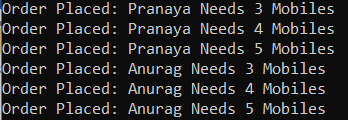

از آنجایی که متد GetOrders به ​​صورت همزمان فراخوانی می‌شود، خروجی نیز به طور مشابه چاپ می‌شود، یعنی ابتدا Pranaya و سپس Anurag که همان چیزی است که می‌توانید در خروجی بالا مشاهده کنید.

##### **مثال لیست عمومی با استفاده از چند نخ در سی شارپ:**

حالا، بیایید مثال قبلی را طوری تغییر دهیم که ناهمزمان باشد. برای این کار، از Task استفاده کرده‌ایم که متد GetOrders را با استفاده از دو thread مختلف فراخوانی می‌کند. و این تغییرات را همانطور که در کد زیر نشان داده شده است، درون متد TestBag انجام داده‌ایم.

```csharp
using System;
using System.Collections.Generic;
using System.Threading;
using System.Threading.Tasks;

namespace ConcurrentBagDemo
{
    class Program
    {
        static void Main()
        {
            TestBag();
            Console.ReadKey();
        }

        public static void TestBag()
        {
            List<string> MobileOrders = new List<string>();

            Task t1 = Task.Run(() => GetOrders("Pranaya", MobileOrders));
            Task t2 = Task.Run(() => GetOrders("Anurag", MobileOrders));
            Task.WaitAll(t1, t2); //Wait till both the task completed
            
            foreach (var mobileOrder in MobileOrders)
            {
                Console.WriteLine($"Order Placed: {mobileOrder}");
            }
        }

        private static void GetOrders(string custName, List<string> MobileOrders)
        {
            for (int i = 0; i < 3; i++)
            {
                Thread.Sleep(100);
                string order = string.Format($"{custName} Needs {i + 3} Mobiles");
                MobileOrders.Add(order);
            }
        }
    }
}
```

حالا کد بالا را چندین بار اجرا کنید، و هر بار ممکن است خروجی متفاوتی دریافت کنید. این بدان معناست که خروجی مطابق تصویر زیر ثابت نیست.

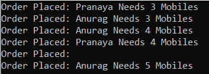

##### **چرا خروجی مورد انتظار را دریافت نمی‌کنیم؟**

دلیل این امر این است که متد Add از کلاس Generic List\<T> Collection در سی شارپ برای کار با چندین نخ به صورت موازی طراحی نشده است، یعنی متد Add از کلاس List از نظر نخ ایمن نیست. بنابراین، Multi-Threading با Generic List\<T> غیرقابل پیش‌بینی است. به این معنی که گاهی اوقات ممکن است کار کند اما اگر چندین بار امتحان کنید، نتایج غیرمنتظره‌ای خواهید گرفت.

##### **لیست عمومی با مکانیزم قفل در سی شارپ:**

در مثال زیر، ما از کلمه کلیدی معروف lock برای دستوری که ترتیب را به مجموعه لیست اضافه می‌کند، یعنی متد Add، استفاده می‌کنیم.

```csharp
using System;
using System.Collections.Generic;
using System.Threading;
using System.Threading.Tasks;

namespace ConcurrentBagDemo
{
    class Program
    {
        static object lockObject = new object();
        static void Main()
        {
            TestBag();
            Console.ReadKey();
        }

        public static void TestBag()
        {
            List<string> MobileOrders = new List<string>();

            Task t1 = Task.Run(() => GetOrders("Pranaya", MobileOrders));
            Task t2 = Task.Run(() => GetOrders("Anurag", MobileOrders));
            Task.WaitAll(t1, t2); //Wait till both the task completed
            
            foreach (var mobileOrder in MobileOrders)
            {
                Console.WriteLine($"Order Placed: {mobileOrder}");
            }
        }

        private static void GetOrders(string custName, List<string> MobileOrders)
        {
            for (int i = 0; i < 3; i++)
            {
                Thread.Sleep(100);
                string order = string.Format($"{custName} Needs {i + 3} Mobiles");
                lock (lockObject)
                {
                    MobileOrders.Add(order);
                }
            }
        }
    }
}
```

حالا کد بالا را اجرا کنید و خروجی مورد انتظار را همانطور که در تصویر زیر نشان داده شده است، دریافت خواهید کرد.

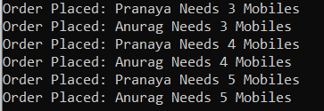

اشکالی ندارد. بنابراین، پس از اعمال قفل روی متد Add از کلاس Generic List، نتایج مورد انتظار را دریافت می‌کنیم. اما اگر متد Add چندین بار در چندین مکان در پروژه ما فراخوانی شود، آیا می‌خواهید از دستور lock در همه جا استفاده کنید؟ اگر این کار را انجام دهید، این یک فرآیند زمان‌بر و همچنین مستعد خطا است زیرا ممکن است در برخی مکان‌ها فراموش کنید که از دستور lock استفاده کنید. راه حل استفاده از ConcurrentBag است.

##### **ConcurrentBag با چندین نخ در سی شارپ:**

ConcurrentBag به طور خودکار در یک محیط چند رشته‌ای، ایمنی نخ را فراهم می‌کند. بیایید مثال قبلی را با استفاده از کلاس مجموعه ConcurrentBag بازنویسی کنیم و خروجی را ببینیم و سپس کلاس مجموعه ConcurrentBag را با جزئیات مورد بحث قرار دهیم. در مثال زیر، ما به سادگی کلاس List را با ConcurrentBag جایگزین می‌کنیم. و عبارت مورد استفاده برای قفل کردن صریح را حذف می‌کنیم. لطفاً توجه داشته باشید که کلاس ConcurrentBag متعلق به فضای نام System.Collections.Concurrent است، بنابراین آن فضای نام را نیز اضافه کنید.

```csharp
using System;
using System.Collections.Concurrent;
using System.Threading;
using System.Threading.Tasks;

namespace ConcurrentBagDemo
{
    class Program
    {
        static object lockObject = new object();
        static void Main()
        {
            TestBag();
            Console.ReadKey();
        }

        public static void TestBag()
        {
            ConcurrentBag<string> MobileOrders = new ConcurrentBag<string>();

            Task t1 = Task.Run(() => GetOrders("Pranaya", MobileOrders));
            Task t2 = Task.Run(() => GetOrders("Anurag", MobileOrders));
            Task.WaitAll(t1, t2); //Wait till both the task completed

            foreach (var mobileOrder in MobileOrders)
            {
                Console.WriteLine($"Order Placed: {mobileOrder}");
            }
        }

        private static void GetOrders(string custName, ConcurrentBag<string> MobileOrders)
        {
            for (int i = 0; i < 3; i++)
            {
                Thread.Sleep(100);
                string order = string.Format($"{custName} Needs {i + 3} Mobiles");
                MobileOrders.Add(order);
            }
        }
    }
}
```

###### **خروجی:**

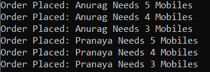

حالا، امیدوارم نیاز اساسی به کلاس مجموعه ConcurrentBag در سی شارپ را درک کرده باشید. بیایید ادامه دهیم و متدها، ویژگی‌ها و سازنده‌های مختلف ارائه شده توسط کلاس مجموعه ConcurrentBag در سی شارپ را درک کنیم.

##### **متدها، ویژگی‌ها و سازنده‌های کلاس ConcurrentBag در سی‌شارپ:**

بیایید متدها، ویژگی‌ها و سازنده‌های مختلف کلاس ConcurrentBag Collection را در سی‌شارپ درک کنیم. اگر روی کلاس ConcurrentBag کلیک راست کرده و گزینه go to definition را انتخاب کنید، تعریف زیر را مشاهده خواهید کرد. کلاس ConcurrentBag متعلق به فضای نام System.Collections.Concurrent است و رابط‌های IProducerConsumerCollection\<T>، IEnumerable\<T>، IEnumerable، ICollection، IReadOnlyCollection\<T> را پیاده‌سازی می‌کند.

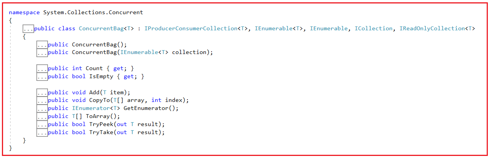

##### **چگونه یک مجموعه ConcurrentBag\<T> در سی شارپ ایجاد کنیم؟**

کلاس مجموعه ConcurrentBag\<T> در سی شارپ، دو سازنده زیر را برای ایجاد یک نمونه از کلاس ConcurrentBag\<T> ارائه می‌دهد.

1. **ConcurrentBag() :** برای مقداردهی اولیه یک نمونه جدید از کلاس ConcurrentBag استفاده می‌شود.
2. **ConcurrentBag(IEnumerable\<T> collection) :** برای مقداردهی اولیه یک نمونه جدید از کلاس ConcurrentBag که شامل عناصر کپی شده از مجموعه مشخص شده است، استفاده می‌شود.

بیایید ببینیم چگونه می‌توان با استفاده از سازنده‌ی ConcurrentBag() یک نمونه از ConcurrentBag ایجاد کرد:

**مرحله ۱:**  
از آنجایی که کلاس ConcurrentBag\<T> متعلق به فضای نام System.Collections.Concurrent است، بنابراین ابتدا باید فضای نام System.Collections.Concurrent را به برنامه خود اضافه کنیم:  
**با استفاده از System.Collections.Concurrent؛**

**مرحله ۲:**  
در مرحله بعد، باید با استفاده از سازنده ConcurrentBag() به صورت زیر یک نمونه از کلاس ConcurrentBag ایجاد کنیم:  
**ConcurrentBag\<type> ConcurrentBag_Name = new ConcurrentBag\<type>();**  
در اینجا، نوع می‌تواند هر نوع داده‌ی داخلی مانند int، double، string و غیره، یا هر نوع داده‌ی تعریف‌شده توسط کاربر مانند Customer، Student، Employee، Product و غیره باشد.

##### **چگونه عناصر را به یک مجموعه ConcurrentBag\<T> در سی شارپ اضافه کنیم؟**

اگر می‌خواهید عناصری را به یک مجموعه ConcurrentBag در C# اضافه کنید، باید از متدهای زیر از کلاس ConcurrentBag\<T> استفاده کنید.

1. **Add(T item) :** این متد برای اضافه کردن یک شیء به ConcurrentBag استفاده می‌شود. پارامتر item شیء مورد نظر برای اضافه شدن به ConcurrentBag را مشخص می‌کند. مقدار آن برای انواع ارجاعی می‌تواند null باشد.

برای مثال،  
**ConcurrentBag\<string> concurrentBag = new ConcurrentBag\<string>();**  
دستور بالا یک ConcurrentBag برای ذخیره عناصر رشته‌ای ایجاد می‌کند. بنابراین، در اینجا فقط می‌توانیم مقادیر رشته‌ای را اضافه کنیم. اگر سعی کنیم چیزی غیر از رشته اضافه کنیم، با خطای زمان کامپایل مواجه خواهیم شد.  
**concurrentBag.Add("هند");**  
**concurrentBag.Add(“ایالات متحده آمریکا”);**  
**concurrentBag.Add(100);** **//خطای زمان کامپایل**

همچنین می‌توانیم عناصر را با استفاده از Collection Initializer به صورت زیر به ConcurrentBag اضافه کنیم:  
**ConcurrentBag\<string> concurrentBag = new ConcurrentBag\<string>**  
**{**  
**«هند»،**  
**«آمریکا»،**  
**«بریتانیا»**  
**};**  
**نکته:** ConcurrentBag هیچ متد AddRange ارائه نمی‌دهد، بنابراین باید برای هر آیتم، متد Add را به صورت دستی فراخوانی کنیم.

##### **چگونه در سی شارپ به یک مجموعه ConcurrentBag دسترسی پیدا کنیم؟**

ما می‌توانیم با استفاده از حلقه for each به صورت زیر به تمام عناصر مجموعه ConcurrentBag در سی شارپ دسترسی پیدا کنیم.  
**foreach (مورد متغیر در concurrentBag)**  
**{**  
**خط نوشتن کنسول (مورد)؛**  
**}**

##### **مثالی برای درک نحوه ایجاد یک ConcurrentBag و افزودن عناصر در سی شارپ:**

برای درک بهتر نحوه ایجاد یک ConcurrentBag، نحوه اضافه کردن عناصر و نحوه دسترسی به تمام عناصر ConcurrentBag در C# با استفاده از حلقه for-each، لطفاً به مثال زیر که سه مورد فوق را نشان می‌دهد، نگاهی بیندازید.

```csharp
using System;
using System.Collections.Concurrent;

namespace ConcurrentBagDemo
{
    class Program
    {
        static object lockObject = new object();
        static void Main()
        {
            //Creating ConcurrentBag collection to store string values
            ConcurrentBag<string> concurrentBag = new ConcurrentBag<string>();

            //Adding Element using Add Method of ConcurrentBag Class
            concurrentBag.Add("India");
            concurrentBag.Add("USA");
            concurrentBag.Add("UK");
            //concurrentBag.Add(100); //Compile-Time Error

            Console.WriteLine("ConcurrentBag Elements");
            foreach (var item in concurrentBag)
            {
                Console.WriteLine(item);
            }

            //Creating a string array and passing the array to ConcurrentBag Constructor
            string[] countriesArray = { "Canada", "NZ", "Japan" };
            ConcurrentBag<string> concurrentBag2 = new ConcurrentBag<string>(countriesArray);
            Console.WriteLine("\\nConcurrentBag Elements");
            foreach (var item in concurrentBag2)
            {
                Console.WriteLine(item);
            }

            Console.ReadKey();
        }
    }
}
```

###### **خروجی:**

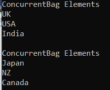

##### **چگونه عناصر را از مجموعه ConcurrentBag\<T> در سی شارپ حذف کنیم؟**

کلاس مجموعه ConcurrentBag در سی شارپ، متد TryTake زیر را برای حذف یک عنصر از مجموعه ارائه می‌دهد.

1. **TryTake(out T result):** این متد تلاش می‌کند تا یک شیء را از مجموعه ConcurrentBag حذف و برگرداند. وقتی این متد نتیجه را برمی‌گرداند، نتیجه شامل شیء حذف شده از ConcurrentBag یا مقدار پیش‌فرض T در صورت خالی بودن bag است. اگر یک شیء با موفقیت حذف شده باشد، مقدار true و در غیر این صورت مقدار false را برمی‌گرداند.

بیایید مثالی برای درک متد TryTake از کلاس Collection با نام ConcurrentBag\<T> در سی شارپ ببینیم. لطفاً به مثال زیر که نحوه‌ی استفاده از متد TryTake را نشان می‌دهد، نگاهی بیندازید.

```csharp
using System;
using System.Collections.Concurrent;

namespace ConcurrentBagDemo
{
    class Program
    {
        static object lockObject = new object();
        static void Main()
        {
            //Creating ConcurrentBag collection and Initialize with Collection Initializer
            ConcurrentBag<string> concurrentBag = new ConcurrentBag<string>
            {
                "India",
                "USA",
                "UK",
                "Canada"
            };
            
            Console.WriteLine("All ConcurrentBag Elements");
            foreach (var item in concurrentBag)
            {
                Console.WriteLine(item);
            }

            //Removing element using TryTake Method
            bool IsRemoved = concurrentBag.TryTake(out string Result);
            Console.WriteLine($"\\nTryTake Return : {IsRemoved}");
            Console.WriteLine($"TryTake Result Value : {Result}");

            Console.WriteLine("\\nConcurrentBag Elements After TryTake Method");
            foreach (var item in concurrentBag)
            {
                Console.WriteLine(item);
            }
            
            Console.ReadKey();
        }
    }
}
```

###### **خروجی:**

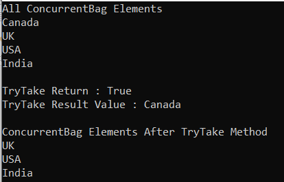

##### **چگونه عنصر را از ConcurrentBag در C# دریافت کنیم؟**

کلاس مجموعه ConcurrentBag\<T> در سی شارپ دو متد زیر را برای دریافت عنصر از مجموعه ConcurrentBag ارائه می‌دهد.

1. **TryTake(out T result) :** این متد تلاش می‌کند تا یک شیء را از مجموعه ConcurrentBag حذف و بازگرداند. هنگامی که این متد نتیجه را برمی‌گرداند، نتیجه شامل شیء حذف شده از ConcurrentBag یا مقدار پیش‌فرض T در صورت خالی بودن bag است. اگر یک شیء با موفقیت حذف شده باشد، مقدار true و در غیر این صورت مقدار false را برمی‌گرداند.
2. **TryPeek(out T result) :** این متد تلاش می‌کند تا یک شیء از ConcurrentBag را بدون حذف آن برگرداند. وقتی این متد برمی‌گرداند، پارامتر result شامل یک شیء از ConcurrentBag یا مقدار پیش‌فرض T در صورت عدم موفقیت عملیات است. اگر یک شیء با موفقیت برگردانده شود، مقدار true و در غیر این صورت، مقدار false را برمی‌گرداند.

برای درک بهتر، لطفاً به مثال زیر نگاهی بیندازید که نحوه دریافت عنصر از ConcurrentBag را با استفاده از **متدهای TryTake(out T result)** و **TryPeek(out T result)** از **کلاس ConcurrentBag\<T>** Collection در سی شارپ نشان می‌دهد.

```csharp
using System;
using System.Collections.Concurrent;

namespace ConcurrentBagDemo
{
    class Program
    {
        static object lockObject = new object();
        static void Main()
        {
            //Creating ConcurrentBag collection and Initialize with Collection Initializer
            ConcurrentBag<string> concurrentBag = new ConcurrentBag<string>
            {
                "India",
                "USA",
                "UK",
                "Canada",
                "Japan"
            };
            //Printing Elements After TryPeek the Element
            Console.WriteLine($"ConcurrentBag All Elements: Count {concurrentBag.Count}");
            foreach (var element in concurrentBag)
            {
                Console.WriteLine($"{element} ");
            }
            
            // Removing and Returning the Element from ConcurrentBag using TryPop method
            bool IsRemoved = concurrentBag.TryTake(out string Result1);
            Console.WriteLine($"\\nTryTake Return : {IsRemoved}");
            Console.WriteLine($"TryTake Result Value : {Result1}");

            //Printing Elements After Removing the Element
            Console.WriteLine($"\\nConcurrentBag Elements After TryTake: Count {concurrentBag.Count}");
            foreach (var element in concurrentBag)
            {
                Console.WriteLine($"{element} ");
            }

            //Returning the Element from ConcurrentBag using TryPeek method
            bool IsPeeked = concurrentBag.TryPeek(out string Result2);
            Console.WriteLine($"\\nTryPeek Return : {IsPeeked}");
            Console.WriteLine($"TryPeek Result Value : {Result2}");

            //Printing Elements After TryPeek the Element
            Console.WriteLine($"\\nConcurrentBag Elements After TryPeek: Count {concurrentBag.Count}");
            foreach (var element in concurrentBag)
            {
                Console.WriteLine($"{element} ");
            }
            
            Console.ReadKey();
        }
    }
}
```

###### **خروجی:**

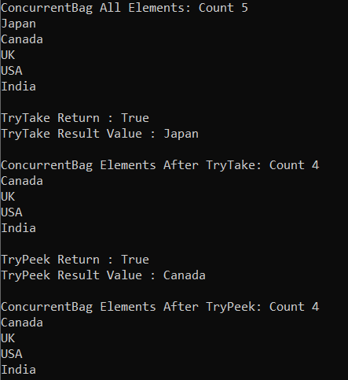

##### **چگونه یک مجموعه ConcurrentBag را در یک آرایه موجود در C# کپی کنیم؟**

برای کپی کردن یک مجموعه ConcurrentBag به یک آرایه موجود در C#، باید از متد CopyTo زیر از کلاس مجموعه ConcurrentBag استفاده کنیم.

1. **CopyTo(T[] array, int index) :** این متد برای کپی کردن عناصر ConcurrentBag به یک آرایه تک بعدی موجود، با شروع از اندیس آرایه مشخص شده، استفاده می‌شود. در اینجا، پارامتر array، آرایه تک بعدی را مشخص می‌کند که مقصد عناصر کپی شده از ConcurrentBag است. آرایه باید دارای اندیس گذاری مبتنی بر صفر باشد. پارامتر index، اندیس مبتنی بر صفر را در آرایه‌ای که کپی از آن شروع می‌شود، مشخص می‌کند.

این متد روی آرایه‌های یک بعدی کار می‌کند و وضعیت ConcurrentBag را تغییر نمی‌دهد. عناصر در آرایه به همان ترتیبی که از ابتدای ConcurrentBag تا انتهای آن مرتب شده‌اند، مرتب شده‌اند. برای درک بهتر متد CopyTo(T[] array, int index) از کلاس Collection\<T> در C#، مثالی را بررسی می‌کنیم.

```csharp
using System;
using System.Collections.Concurrent;

namespace ConcurrentBagDemo
{
    class Program
    {
        static object lockObject = new object();
        static void Main()
        {
            //Creating ConcurrentBag collection and Initialize with Collection Initializer
            ConcurrentBag<string> concurrentBag = new ConcurrentBag<string>
            {
                "India",
                "USA",
                "UK",
                "Canada",
                "Japan"
            };
            //Printing Elements After TryPeek the Element
            Console.WriteLine($"ConcurrentBag All Elements: Count {concurrentBag.Count}");
            foreach (var element in concurrentBag)
            {
                Console.WriteLine($"{element} ");
            }

            //Copying the concurrentBag to an array
            string[] concurrentBagCopy = new string[5];
            concurrentBag.CopyTo(concurrentBagCopy, 0);
            Console.WriteLine("\\nConcurrentBag Copy Array Elements:");
            foreach (var item in concurrentBagCopy)
            {
                Console.WriteLine(item);
            }
            
            Console.ReadKey();
        }
    }
}
```

###### **خروجی:**

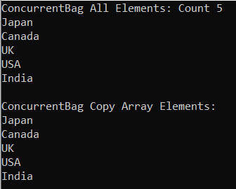

##### **چگونه Con ConcurrentBag را در سی شارپ به آرایه تبدیل کنیم؟**

اگر می‌خواهید مجموعه ConcurrentBag را به یک آرایه تبدیل کنید، باید از متد ToArray زیر از کلاس مجموعه ConcurrentBag\<T> در سی شارپ استفاده کنید.

1. **ToArray() :** این متد برای کپی کردن عناصر ConcurrentBag به یک آرایه جدید استفاده می‌شود. این متد یک آرایه جدید حاوی تصویری از عناصر کپی شده از ConcurrentBag را برمی‌گرداند.

برای درک بهتر، لطفاً به مثال زیر نگاهی بیندازید که نحوه‌ی استفاده از متد ToArray() از کلاس ConcurrentBag\<T> را نشان می‌دهد.

```csharp
using System;
using System.Collections.Concurrent;

namespace ConcurrentBagDemo
{
    class Program
    {
        static object lockObject = new object();
        static void Main()
        {
            //Creating ConcurrentBag collection and Initialize with Collection Initializer
            ConcurrentBag<string> concurrentBag = new ConcurrentBag<string>
            {
                "India",
                "USA",
                "UK",
                "Canada"
            };
            //Printing Elements After TryPeek the Element
            Console.WriteLine($"ConcurrentBag Elements");
            foreach (var element in concurrentBag)
            {
                Console.WriteLine($"{element} ");
            }

            //Copying the concurrentBag to an array
            string[] concurrentBagArray = concurrentBag.ToArray();
            Console.WriteLine("\\nConcurrentBag Array Elements:");
            foreach (var item in concurrentBagArray)
            {
                Console.WriteLine(item);
            }
            
            Console.ReadKey();
        }
    }
}
```

###### **خروجی:**

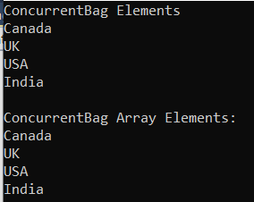

##### **کلاس مجموعه ConcurrentBag\<T> با انواع پیچیده در سی شارپ**

تاکنون، ما از کلاس ConcurrentBag Collection با انواع داده اولیه مانند int، double و غیره استفاده کرده‌ایم. حال، بیایید ببینیم چگونه از ConcurrentBag Collection با انواع داده‌های پیچیده مانند Employee، Student، Customer، Product و غیره استفاده کنیم. برای درک بهتر، لطفاً به مثال زیر نگاهی بیندازید که در آن از ConcurrentBag\<T> Collection با نوع Student تعریف شده توسط کاربر استفاده می‌کنیم.

```csharp
using System;
using System.Collections.Concurrent;

namespace ConcurrentBagDemo
{
    class Program
    {
        static void Main()
        {
            //Creating ConcurrentBag to store string values
            ConcurrentBag<Student> concurrentBag = new ConcurrentBag<Student>();

            //Adding Elements to ConcurrentBag using Push Method
            concurrentBag.Add(new Student() { ID = 101, Name = "Anurag", Branch = "CSE" });
            concurrentBag.Add(new Student() { ID = 102, Name = "Mohanty", Branch = "CSE" });
            concurrentBag.Add(new Student() { ID = 103, Name = "Sambit", Branch = "ETC" });

            //Accesing all the Elements of ConcurrentBag using For Each Loop
            Console.WriteLine($"ConcurrentBag Elements");
            foreach (var item in concurrentBag)
            {
                Console.WriteLine($"ID: {item.ID}, Name: {item.Name}, Branch: {item.Branch}");
            }

            Console.ReadKey();
        }
    }
    public class Student
    {
        public int ID { get; set; }
        public string Name { get; set; }
        public string Branch { get; set; }
    }
}
```

###### **خروجی:**

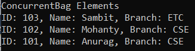

##### **مثال ConcurrentBag با تولیدکننده/مصرف‌کننده در سی‌شارپ:**

ConcurrentBag به چندین نخ اجازه می‌دهد تا اشیاء را در یک مجموعه ذخیره کنند. این برای سناریوهایی بهینه شده است که در آن‌ها یک نخ هم به عنوان تولیدکننده و هم به عنوان مصرف‌کننده عمل می‌کند. این بدان معناست که یک نخ عناصر را اضافه می‌کند و همچنین عناصر را بازیابی می‌کند.

برای مثال، فرض کنید دو نخ Thread1 و Thread2 داریم. نخ Thread1 چهار عنصر مانند 10،20،30،40 را به مجموعه ConcurrentBag اضافه کرده است. سپس نخ Thread2 سه عنصر مانند 50،60،70 را به همان مجموعه ConcurrentBag اضافه کرده است. هنگامی که هر دو نخ عناصر را به مجموعه اضافه کردند، نخ Thread1 شروع به بازیابی داده‌ها می‌کند. از آنجایی که نخ Thread1 عناصر 10،20،30،40 را به مجموعه اضافه کرده است، بنابراین این عناصر نسبت به 50،60،70 اولویت بیشتری دارند. هنگامی که نخ Thread1 هر چهار عنصری را که توسط نخ Thread1 اضافه شده‌اند بازیابی می‌کند، نخ Thread1 به سراغ بازیابی عناصر درج شده نخ Thread2 مانند 50،60،70 می‌رود. برای درک بهتر، لطفاً به مثال زیر نگاهی بیندازید.

```csharp
using System;
using System.Collections.Concurrent;
using System.Threading;
using System.Threading.Tasks;

namespace ConcurrentBagDemo
{
    class Program
    {
        static ConcurrentBag<int> concurrentBag = new ConcurrentBag<int>();
        static AutoResetEvent autoEvent1 = new AutoResetEvent(false);
        static void Main(string[] args)
        {
            Task thread1 = Task.Factory.StartNew(() => AddThread1Elements());
            Task thread2 = Task.Factory.StartNew(() => AddThread2Elements());
            Task.WaitAll(thread1, thread2);

            Console.WriteLine("End of the Main Method");
            Console.ReadKey();
        }

        public static void AddThread1Elements()
        {
            int[] array = { 10, 20, 30, 40 };
            for (int i = 0; i < array.Length; i++)
            {
                concurrentBag.Add(array[i]);
            }

            //wait for second thread to add its items
            autoEvent1.WaitOne();

            while (concurrentBag.IsEmpty == false)
            {
                if (concurrentBag.TryTake(out int item))
                {
                    Console.WriteLine($"Thread1 Reads: {item}");
                }
            }
        }

        public static void AddThread2Elements()
        {
            int[] array = { 50, 60, 70 };
            for (int i = 0; i < array.Length; i++)
            {
                concurrentBag.Add(array[i]);
            }
            autoEvent1.Set();
        }
    }
}
```

###### **خروجی:**

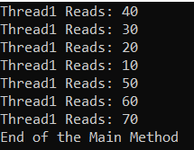

همانطور که در خروجی بالا نشان داده شده است، وقتی هر دو thread thread1 و thread2 اضافه کردن آیتم‌ها را کامل می‌کنند، Thread1 شروع به بازیابی آیتم‌ها می‌کند. در bag، 50،60،70 بعد از 40،30،20،10 اضافه می‌شود، اما از آنجایی که Thread1 در حال دسترسی به آیتم‌های 10،20،30،40 است، preferences را دریافت می‌کند.

**نکته:** Concurrent Bagها برای ذخیره اشیاء زمانی مفید هستند که ترتیب مهم نباشد، و برخلاف مجموعه‌ها، Bagها از تکرارها پشتیبانی می‌کنند. ConcurrentBag\<T> یک پیاده‌سازی thread-safe bag است که برای سناریوهایی بهینه شده است که در آن یک thread هم داده‌های ذخیره شده در bag را تولید و هم مصرف می‌کند. ConcurrentBag\<T> مقدار null را به عنوان یک مقدار معتبر برای انواع مرجع می‌پذیرد.
