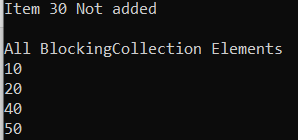
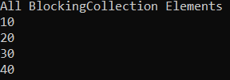
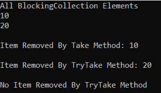
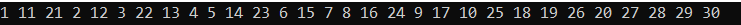

## **مسدود کردن مجموعه‌ها در سی شارپ به همراه مثال**

در این مقاله، قصد دارم **BlockingCollection را در سی شارپ** با مثال‌هایی مورد بحث قرار دهم. لطفاً مقاله قبلی ما را که در آن کلاس مجموعه ConcurrentBag را در سی شارپ با مثال‌هایی مورد بحث قرار دادیم، مطالعه کنید. کلاس BlockingCollection در سی شارپ یک کلاس مجموعه Thread-Safe است. این کلاس پیاده‌سازی الگوی تولیدکننده-مصرف‌کننده است. این کلاس ویژگی‌های bounding و blocking را برای پشتیبانی از الگوی تولیدکننده-مصرف‌کننده ارائه می‌دهد. تنها کلاس Concurrent Collection است که از ویژگی‌های Bounding و Blocking پشتیبانی می‌کند. در پایان این مقاله، نکات زیر را خواهید فهمید.

1. **BlockingCollection در سی شارپ چیست؟**
2. **چگونه یک نمونه BlockingCollection\<T> در سی شارپ ایجاد کنیم؟**
3. **چگونه عناصر را به BlockingCollection\<T> در سی شارپ اضافه کنیم؟**
4. **چگونه در سی شارپ به BlockingCollection دسترسی پیدا کنیم؟**
5. **مقداردهی اولیه BlockingCollection در سی شارپ با استفاده از Collection Initializer**
6. **چگونه عناصر را از مجموعه BlockingCollection\<T> در سی شارپ حذف کنیم؟**
7. **متد CompleteAdding و ویژگی IsCompleted از BlockingCollection\<T> در سی شارپ**
8. **BlockingCollection در حلقه Foreach**
9. **کار با چندین تولیدکننده و مصرف‌کننده با استفاده از BlockingCollection در سی‌شارپ**
10. **ویژگی‌های BlockingCollection در سی شارپ**

##### **BlockingCollection در سی شارپ چیست؟**

BlockingCollection یک کلاس Concurrent Collection در سی‌شارپ است که قابلیت Thread Safety را فراهم می‌کند. این بدان معناست که چندین Thread می‌توانند به طور همزمان اشیاء را از BlockingCollection حذف یا اضافه کنند.

BlockingCollection الگوی تولیدکننده-مصرف‌کننده را در سی‌شارپ پیاده‌سازی می‌کند. در الگوی تولیدکننده-مصرف‌کننده، ما دو نخ داریم که یکی نخ تولیدکننده و دیگری نخ مصرف‌کننده نامیده می‌شود. و نکته مهم این است که هر دو نخ یک کلاس جمع‌آوری مشترک برای تبادل داده‌ها بین خود به اشتراک می‌گذارند. و در این سناریو، می‌توانیم از BlockingCollection به عنوان کلاس جمع‌آوری استفاده کنیم که توسط نخ‌های تولیدکننده و مصرف‌کننده به اشتراک گذاشته می‌شود. نخ تولیدکننده داده‌ها را تولید می‌کند در حالی که نخ مصرف‌کننده داده‌ها را مصرف می‌کند. همچنین می‌توانیم حداکثر حد کلاس جمع‌آوری BlockingCollection را تعیین کنیم. و هنگامی که حداکثر حد مجموعه را تعیین کردیم، تولیدکننده نمی‌تواند اشیاء جدیدی بیش از حداکثر حد اضافه کند و مصرف‌کننده نمی‌تواند داده‌ها را از یک کلاس جمع‌آوری خالی حذف کند.

BlockingCollection دو ویژگی مهم دارد (این دو ویژگی در واقع به ما در پیاده‌سازی الگوی تولیدکننده-مصرف‌کننده کمک می‌کنند) که آن را از سایر کلاس‌های مجموعه همزمان در C# متمایز می‌کند. این دو ویژگی به شرح زیر هستند:

1. **محدود کردن:** محدود کردن به این معنی است که همانطور که قبلاً بحث کردیم، می‌توانیم حداکثر تعداد اشیاء قابل ذخیره در مجموعه را تعیین کنیم. وقتی یک نخ تولیدکننده به حداکثر حد BlockingCollection می‌رسد، برای اضافه کردن اشیاء جدید مسدود می‌شود. در مرحله مسدود شدن، نخ تولیدکننده به حالت خواب می‌رود. به محض اینکه نخ مصرف‌کننده اشیاء را از مجموعه حذف کند، از حالت مسدود خارج می‌شود.
2. **مسدود کردن:** مسدود کردن به این معنی است که همانطور که قبلاً بحث کردیم، وقتی BlockingCollection خالی است، نخ مصرف‌کننده مسدود می‌شود تا زمانی که نخ تولیدکننده اشیاء جدیدی را به مجموعه‌ها اضافه کند.

در نهایت، نخ تولیدکننده، متد CompleteAdding() از کلاس BlockingCollection را فراخوانی می‌کند. متد CompleteAdding() ویژگی IsCompleted را روی true تنظیم می‌کند. نخ مصرف‌کننده به صورت داخلی، ویژگی IsCompleted را بررسی می‌کند تا ببیند آیا آیتمی برای مصرف از مجموعه وجود دارد یا خیر. اگر در حال حاضر این موضوع برایتان واضح نیست، نگران نباشید، همه چیز را با مثال بررسی خواهیم کرد.

##### **چگونه یک نمونه BlockingCollection\<T> در سی شارپ ایجاد کنیم؟**

کلاس BlockingCollection\<T> در سی شارپ چهار سازنده زیر را ارائه می‌دهد که می‌توانیم از آنها برای ایجاد یک نمونه از کلاس BlockingCollection\<T> استفاده کنیم.

1. **BlockingCollection() :** این متد یک نمونه جدید از کلاس BlockingCollection را بدون حد بالا مقداردهی اولیه می‌کند.
2. **BlockingCollection(int boundedCapacity) :** این تابع یک نمونه جدید از کلاس BlockingCollection را با حد بالای مشخص شده مقداردهی اولیه می‌کند. پارامتر boundedCapacity اندازه محدود مجموعه را مشخص می‌کند. اگر ظرفیت محدود شده یک مقدار مثبت نباشد، خطای ArgumentOutOfRangeException رخ می‌دهد.
3. **BlockingCollection(IProducerConsumerCollection\<T> collection) :** این متد یک نمونه جدید از کلاس BlockingCollection را بدون حد بالا مقداردهی اولیه می‌کند و از IProducerConsumerCollection ارائه شده به عنوان محل ذخیره داده اصلی خود استفاده می‌کند. در اینجا، پارامتر collection، مجموعه‌ای را که قرار است به عنوان محل ذخیره داده اصلی استفاده شود، مشخص می‌کند. اگر آرگومان مجموعه null باشد، خطای ArgumentNullException رخ می‌دهد.
4. **BlockingCollection(IProducerConsumerCollection\<T> collection, int boundedCapacity) :** این تابع یک نمونه جدید از کلاس BlockingCollection را با حد بالای مشخص شده مقداردهی اولیه می‌کند و از IProducerConsumerCollection ارائه شده به عنوان محل ذخیره داده اصلی آن استفاده می‌کند. در اینجا، پارامتر boundedCapacity اندازه محدود مجموعه را مشخص می‌کند. پارامتر collection، مجموعه‌ای را که قرار است به عنوان محل ذخیره داده اصلی استفاده شود، مشخص می‌کند. اگر آرگومان مجموعه تهی باشد، خطای ArgumentNullException رخ می‌دهد. اگر ظرفیت محدود شده مقدار مثبتی نباشد، خطای ArgumentOutOfRangeException رخ می‌دهد.

بیایید ببینیم چگونه می‌توان با استفاده از سازنده‌ی BlockingCollection() یک نمونه از BlockingCollection ایجاد کرد:

**مرحله ۱:**  
از آنجایی که کلاس BlockingCollection\<T> متعلق به فضای نام System.Collections.Concurrent است، بنابراین ابتدا باید فضای نام System.Collections.Concurrent را به برنامه خود اضافه کنیم:  
**با استفاده از System.Collections.Concurrent؛**

**مرحله ۲:**  
در مرحله بعد، باید با استفاده از سازنده BlockingCollection() به صورت زیر یک نمونه از کلاس BlockingCollection ایجاد کنیم:  
**BlockingCollection\<type> BlockingCollection\_Name = new BlockingCollection\<type>();**  
در اینجا، نوع داده می‌تواند هر نوع داده‌ی از پیش تعریف‌شده‌ای مانند int، double، string و غیره، یا هر نوع داده‌ی تعریف‌شده توسط کاربر مانند Customer، Employee، Product و غیره باشد. از آنجایی که ما حداکثر تعداد آیتم‌ها را تعیین نکرده‌ایم، هر تعداد آیتم را می‌تواند در خود جای دهد. برای مثال،  
**BlockingCollection\<int> blockingCollection = new BlockingCollection\<int>();**

در مثال زیر، ما حداکثر مقدار مجاز را روی ۱۰ تنظیم کرده‌ایم، بنابراین نمونه‌ای با مقدار مشخص شده مانند ۱۰ ایجاد می‌شود.  
**BlockingCollection\<int> blockingCollection = new BlockingCollection\<int>(10);**

**نکته:** به طور پیش‌فرض، BlockingCollection از ConcurrentQueue به عنوان کلاس کلکسیون خود استفاده می‌کند. همچنین می‌توان کلاس‌های کلکسیون همزمان دیگری مانند ConcurrentStack و ConcurrentBag را نیز ارائه داد. اما مهمترین نکته‌ای که باید در نظر داشته باشید این است که در اینجا فقط می‌توانیم کلاس‌های کلکسیون همزمانی را ارسال کنیم که رابط IProducerConsumerCollection\<T> را پیاده‌سازی می‌کنند. و کلاس‌های کلکسیون ConcurrentStack\<T> و ConcurrentBag\<T> رابط IProducerConsumerCollection\<T> را پیاده‌سازی می‌کنند. همچنین می‌توانیم کلاس کلکسیون خودمان را تعریف کنیم که رابط IProducerConsumerCollection\<T> را پیاده‌سازی می‌کند و آن کلاس را به سازنده BlockingCollection ارسال کنیم.

دستور زیر نحوه ارسال ConcurrentStack به سازنده BlockingCollection را نشان می‌دهد.  
**BlockingCollection\<int> blockingCollection = new BlockingCollection\<int>(new ConcurrentStack\<int>());**

حتی، می‌توان حداکثر مقدار را به صورت زیر تنظیم کرد، در حالی که ConcurrentStack را به سازنده BlockingCollection ارسال می‌کنیم.  
**BlockingCollection\<int> blockingCollection = new BlockingCollection\<int>(new ConcurrentStack\<int>(), 10);**

بنابراین، ما در مورد استفاده از هر چهار نوع سازنده برای ایجاد نمونه‌ای از کلاس BlockingCollection در سی‌شارپ بحث کرده‌ایم.

##### **چگونه عناصر را به BlockingCollection\<T> در سی شارپ اضافه کنیم؟**

اگر می‌خواهید عناصری را به BlockingCollection\<T> در سی‌شارپ اضافه کنید، باید از متدهای زیر از کلاس BlockingCollection\<T> استفاده کنید.

1. **Add(T item) :** این متد برای اضافه کردن آیتم به BlockingCollection استفاده می‌شود. متد Add یک پارامتر واحد می‌گیرد، یعنی آیتمی که قرار است به مجموعه اضافه شود. مقدار می‌تواند برای یک نوع مرجع null باشد. این متد زمانی که به حداکثر حد مجاز برسد، مسدود می‌شود.

در ادامه مثالی از متد Add آمده است.  
**BlockingCollection\<int> blockingCollection = new BlockingCollection\<int>(2);**  
**blockingCollection.Add(10);**  
**blockingCollection.Add(20);**  
**blockingCollection.Add(30);**  
در مثال بالا، ما BlockingCollection را با حداکثر ظرفیت ۲ آیتم ایجاد کرده‌ایم. در این حالت، وقتی سعی می‌کنیم آیتم سوم را اضافه کنیم، تا زمانی که یک آیتم از مجموعه حذف نشود، مسدود خواهد شد.

2. **TryAdd(T item):** این متد سعی می‌کند آیتم مشخص شده را به BlockingCollection اضافه کند. پارامتر آیتمی که قرار است به مجموعه اضافه شود. اگر آیتم قابل اضافه شدن باشد، مقدار true و در غیر این صورت، مقدار false را برمی‌گرداند. اگر آیتم تکراری باشد و مجموعه اصلی آیتم‌های تکراری را نپذیرد، خطای InvalidOperationException رخ می‌دهد.

در ادامه مثالی از متد TryAdd آورده شده است.  
**BlockingCollection\<int> blockingCollection = new BlockingCollection\<int>(2);**  
**blockingCollection.TryAdd(10);**  
**blockingCollection.TryAdd(20);**  
**blockingCollection.TryAdd(30);**

ما یک متد TryAdd متفاوت داریم که یک مقدار timeout را به عنوان پارامتر دوم دریافت می‌کند. اگر عملیات Tryadd در بازه زمانی مشخص شده تکمیل نشود، متد TryAdd مقدار false را برمی‌گرداند. مثال زیر نشان داده شده است.  
**BlockingCollection\<int> blockingCollection = new BlockingCollection\<int>(2);**  
**blockingCollection.Add(10);**  
**blockingCollection.Add(20);**  
**if (blockingCollection.TryAdd(30, TimeSpan.FromSeconds(1)))**  
**{**  
**Console.WriteLine("مورد 30 اضافه شد");**  
**}**  
**else**  
**{**  
**Console.WriteLine("مورد 30 اضافه نشد");**  
**}**  
در مثال بالا، ما حداکثر ظرفیت را در سازنده روی ۲ تنظیم کرده‌ایم. بنابراین، وقتی سعی می‌کنیم مورد سوم را اضافه کنیم، ۱ ثانیه صبر می‌کند و مقدار false را برمی‌گرداند.

##### **چگونه در سی شارپ به BlockingCollection دسترسی پیدا کنیم؟**

ما می‌توانیم با استفاده از حلقه for each به صورت زیر به تمام عناصر BlockingCollection در سی شارپ دسترسی پیدا کنیم.  
**foreach (var item in blockingCollection)**  
**{**  
**Console.WriteLine(item);**  
**}**

##### **مثالی برای درک نحوه ایجاد یک BlockingCollection و افزودن عناصر در سی شارپ:**

برای درک بهتر نحوه ایجاد یک BlockingCollection، نحوه اضافه کردن عناصر و نحوه دسترسی به تمام عناصر BlockingCollection در سی شارپ با استفاده از حلقه for-each، لطفاً به مثال زیر که سه مورد فوق را نشان می‌دهد، نگاهی بیندازید.

```csharp
using System;
using System.Collections.Concurrent;

namespace ConcurrentBagDemo
{
    class Program
    {
        static void Main()
        {
            // Creating an Instance of BlockingCollection Class with Capacity 4
            BlockingCollection<int> blockingCollection = new BlockingCollection<int>(4);

            // Adding Element using Add Method
            blockingCollection.Add(10);
            blockingCollection.Add(20);

            // Adding Element using TryAdd Method
            blockingCollection.TryAdd(40);
            blockingCollection.TryAdd(50);

            if (blockingCollection.TryAdd(30, TimeSpan.FromSeconds(1)))
            {
                Console.WriteLine("Item 30 Added");
            }
            else
            {
                Console.WriteLine("Item 30 Not added");
            }

            // Accessing the BlockingCollection using For Each loop
            Console.WriteLine("\nAll BlockingCollection Elements");
            foreach (var item in blockingCollection)
            {
                Console.WriteLine(item);
            }

            Console.ReadKey();
        }
    }
}
```

###### **خروجی:**



##### **مقداردهی اولیه BlockingCollection در سی شارپ با استفاده از Collection Initializer:**

همچنین در سی شارپ می‌توان با استفاده از Collection Initializer، همانطور که در مثال زیر نشان داده شده است، یک BlockingCollection را مقداردهی اولیه کرد.

```csharp
using System;
using System.Collections.Concurrent;

namespace ConcurrentBagDemo
{
    class Program
    {
        static void Main()
        {
            // Creating an Instance of BlockingCollection Class with Capacity 4
            BlockingCollection<int> blockingCollection = new BlockingCollection<int>(4)
            {
                10,
                20,
                30,
                40,
                // 50 // It will block the blockingCollection as we set the capacity to 4
            };

            // Accessing the BlockingCollection using For Each loop
            Console.WriteLine("All BlockingCollection Elements");
            foreach (var item in blockingCollection)
            {
                Console.WriteLine(item);
            }

            Console.ReadKey();
        }
    }
}
```

###### **خروجی:**



**نکته:** اگر نمی‌خواهید تعداد عناصری که قرار است به مجموعه اضافه شوند را محدود کنید، کافیست هنگام ایجاد نمونه‌ای از کلاس BlockingCollection در سی‌شارپ، مقدار ظرفیت را از سازنده حذف کنید.

##### **چگونه عناصر را از مجموعه BlockingCollection\<T> در سی شارپ حذف کنیم؟**

کلاس BlockingCollection\<T> در سی شارپ متدهای زیر را برای حذف یک عنصر ارائه می‌دهد.

1. **Take():** این متد برای حذف یک آیتم از BlockingCollection استفاده می‌شود. این متد آیتم حذف شده از مجموعه را برمی‌گرداند. متد Take زمانی که مجموعه خالی باشد مسدود می‌شود. زمانی که یک آیتم توسط نخ دیگری اضافه شود، به طور خودکار از حالت مسدود خارج می‌شود.
2. **TryTake(out T item):** این متد سعی می‌کند یک آیتم را از BlockingCollection حذف کند. آیتم حذف شده را در پارامتر خروجی item ذخیره می‌کند. اگر یک آیتم قابل حذف باشد، مقدار true و در غیر این صورت، مقدار false را برمی‌گرداند.
3. **TryTake(out T item, TimeSpan timeout):** این متد سعی می‌کند یک آیتم را از BlockingCollection در بازه زمانی مشخص شده حذف کند. پارامتر timeout شیء‌ای را مشخص می‌کند که نشان دهنده تعداد میلی‌ثانیه‌هایی است که باید منتظر بماند یا شیء‌ای که نشان دهنده -1 میلی‌ثانیه‌هایی است که باید به طور نامحدود منتظر بماند. اگر بتوان یک آیتم را از مجموعه در مدت زمان مشخص شده حذف کرد، مقدار true را برمی‌گرداند؛ در غیر این صورت، مقدار false را برمی‌گرداند. اگر مجموعه خالی باشد، این متد به مدت زمان مشخص شده در پارامتر timeout منتظر می‌ماند. اگر آیتم جدید در مدت زمان مشخص شده اضافه نشود، مقدار false را برمی‌گرداند.
4. **TryTake(out T item, int millisecondsTimeout):** این متد سعی می‌کند یک آیتم را از System.Collections.Concurrent.BlockingCollection در بازه زمانی مشخص شده حذف کند. پارامتر millisecondsTimeout تعداد میلی‌ثانیه‌هایی که باید منتظر بماند یا System.Threading.Timeout.Infinite (-1) را برای انتظار نامحدود مشخص می‌کند. اگر بتوان یک آیتم را در مدت زمان مشخص شده از مجموعه حذف کرد، مقدار true را برمی‌گرداند؛ در غیر این صورت، مقدار false را برمی‌گرداند. اگر مجموعه خالی باشد، این متد به مدت زمان مشخص شده در پارامتر timeout منتظر می‌ماند. اگر آیتم جدید در مدت زمان مشخص شده اضافه نشود، مقدار false را برمی‌گرداند.

بیایید مثالی برای درک متدهای فوق از کلاس BlockingCollection\<T> در سی شارپ ببینیم. لطفاً به مثال زیر نگاهی بیندازید که نحوه استفاده از همه متدهای take و TryTake فوق را نشان می‌دهد.

```csharp
using System;
using System.Collections.Concurrent;

namespace ConcurrentBagDemo
{
    class Program
    {
        static void Main()
        {
            // Creating an Instance of BlockingCollection Class without Capacity
            BlockingCollection<int> blockingCollection = new BlockingCollection<int>()
            {
                10,
                20
            };

            // Accessing the BlockingCollection using For Each loop
            Console.WriteLine("All BlockingCollection Elements");
            foreach (var item in blockingCollection)
            {
                Console.WriteLine(item);
            }

            // Removing item using Take Method
            int Result1 = blockingCollection.Take();
            Console.WriteLine($"\nItem Removed By Take Method: {Result1}");

            // Removing item using TryTake Method
            if (blockingCollection.TryTake(out int Result2, TimeSpan.FromSeconds(1)))
            {
                Console.WriteLine($"\nItem Removed By TryTake Method: {Result2}");
            }
            else
            {
                Console.WriteLine("\nNo Item Removed By TryTake Method");
            }

            // No More Elements in the Collections and Trying to Remove Item using TryTake Method
            if (blockingCollection.TryTake(out int Result3, TimeSpan.FromSeconds(1)))
            {
                Console.WriteLine($"\nItem Removed By TryTake Method: {Result3}");
            }
            else
            {
                Console.WriteLine("\nNo Item Removed By TryTake Method");
            }

            Console.ReadKey();
        }
    }
}
```

###### **خروجی:**



##### **متد CompleteAdding و ویژگی IsCompleted از BlockingCollection\<T> در سی شارپ:**

نخ تولیدکننده (Producer thread) متد CompleteAdding را فراخوانی می‌کند. متد CompleteAdding به صورت داخلی خاصیت IsAddingCompleted را روی مقدار true تنظیم می‌کند. خاصیت IsCompleted توسط نخ‌های مصرف‌کننده (consumer threads) استفاده می‌شود. این متد زمانی مقدار true را برمی‌گرداند که IsAddingCompleted برابر با true باشد و BlockingCollection خالی باشد. این بدان معناست که وقتی IsCompleted برابر با true باشد، هیچ آیتمی در مجموعه وجود ندارد و سایر نخ‌های تولیدکننده هیچ آیتم جدیدی اضافه نخواهند کرد.

1. **CompleteAdding():** متد CompleteAdding نمونه‌های BlockingCollection را طوری علامت‌گذاری می‌کند که دیگر هیچ اضافه‌ای را نمی‌پذیرند.
2. **IsAddingCompleted {get;} :** این ویژگی در صورتی که BlockingCollection برای اضافه شدن به عنوان تکمیل شده علامت‌گذاری شده باشد، مقدار true را برمی‌گرداند، در غیر این صورت مقدار false را برمی‌گرداند.
3. **IsCompleted {get;}:** این ویژگی در صورتی که BlockingCollection برای اضافه شدن به عنوان تکمیل‌شده علامت‌گذاری شده باشد، مقدار true را برمی‌گرداند و در غیر این صورت مقدار false را برمی‌گرداند.

بیایید با یک مثال، متد CompleteAdding و ویژگی‌های IsAddingCompleted و IsCompleted فوق را درک کنیم. برای درک بهتر، لطفاً به مثال زیر نگاهی بیندازید. در مثال زیر، ما دو thread به نام‌های producerThread و consumerThread ایجاد کرده‌ایم. producerThread آیتم‌ها را به BlockingCollection اضافه می‌کند. پس از اضافه کردن تمام آیتم‌های مورد نیاز، متد CompleteAdding را فراخوانی می‌کند که کلاس collection را علامت‌گذاری می‌کند تا آیتم دیگری اضافه نشود. consumerThread یک شرط در حلقه while قرار می‌دهد. در حلقه، ویژگی IsCompleted را بررسی می‌کند. حلقه while تا زمانی که ویژگی IsCompleted مقدار false را برگرداند، اجرا خواهد شد. سپس، از BlockingCollection، با استفاده از متد Take، یک آیتم را در هر زمان حذف می‌کنیم و آن آیتم را در پنجره کنسول چاپ می‌کنیم.

```csharp
using System;
using System.Collections.Concurrent;
using System.Threading.Tasks;

namespace ConcurrentBagDemo
{
    class Program
    {
        static void Main()
        {
            BlockingCollection<int> blockingCollection = new BlockingCollection<int>();

            // Thread 1 (Producer Thread) Adding Item to blockingCollection
            Task producerThread = Task.Factory.StartNew(() =>
            {
                for (int i = 0; i < 10; ++i)
                {
                    blockingCollection.Add(i);
                }

                // Mark blockingCollection will not accept any more additions
                blockingCollection.CompleteAdding();
            });

            // Thread 2 (Consumer Thread) Removing Item from blockingCollection and Printing on the Console
            Task consumerThread = Task.Factory.StartNew(() =>
            {
                // Loop will continue as long as IsCompleted returns false
                while (!blockingCollection.IsCompleted)
                {
                    int item = blockingCollection.Take();
                    Console.Write($"{item} ");
                }
            });

            Task.WaitAll(producerThread, consumerThread);
            Console.ReadKey();
        }
    }
}
```

**خروجی: 0 1 2 3 4 5 6 7 8 9**

##### **BlockingCollection در حلقه Foreach:**

کلاس BlockingCollection\<T> در سی شارپ، متد GetConsumingEnumerable() را ارائه می‌دهد.

1. **IEnumerable\<T> GetConsumingEnumerable():** این متد IEnumerable\<T> را برمی‌گرداند تا بتوانیم از آن متد در حلقه foreach استفاده کنیم. این متد به محض اینکه آیتم‌ها در مجموعه موجود باشند، آیتم‌ها را برمی‌گرداند. متد GetConsumingEnumerable() دارای ویژگی مسدودکننده است. وقتی مجموعه خالی باشد، حلقه foreach را مسدود می‌کند. یک حلقه foreach زمانی پایان می‌یابد که نخ تولیدکننده، متد CompleteAdding را فراخوانی کند.

برای درک بهتر، لطفاً به مثال زیر نگاهی بیندازید. در مثال زیر، نخ تولیدکننده در حال اضافه کردن آیتم‌ها به BlockingCollection است. قبل از اضافه کردن آیتم‌ها به مجموعه، به مدت ۱ ثانیه در حالت خواب قرار می‌گیرد. متد GetConsumingEnumerable تا زمان فراخوانی متد CompleteAdded منتظر می‌ماند.

```csharp
using System;
using System.Collections.Concurrent;
using System.Threading;
using System.Threading.Tasks;

namespace ConcurrentBagDemo
{
    class Program
    {
        static void Main()
        {
            BlockingCollection<int> blockingCollection = new BlockingCollection<int>();

            // Thread 1 (Producer Thread) Adding Item to blockingCollection
            Task producerThread = Task.Factory.StartNew(() =>
            {
                for (int i = 0; i < 10; ++i)
                {
                    Thread.Sleep(TimeSpan.FromSeconds(1));
                    blockingCollection.Add(i);
                }

                // Mark blockingCollection will not accept any more additions
                blockingCollection.CompleteAdding();
            });

            foreach (int item in blockingCollection.GetConsumingEnumerable())
            {
                Console.Write($"{item} ");
            }
            Console.ReadKey();
        }
    }
}
```

**خروجی: 0 1 2 3 4 5 6 7 8 9**

##### **کار با چندین تولیدکننده و مصرف‌کننده با استفاده از BlockingCollection در سی‌شارپ**

گاهی اوقات، ما چندین نخ تولیدکننده و مصرف‌کننده داریم. BlockingCollection متدهای استاتیک زیر را برای کار با چندین نخ ارائه می‌دهد.

1. **AddToAny(BlockingCollection\<T>[] collections, T item):** این متد برای اضافه کردن آیتم مشخص شده به هر یک از نمونه‌های BlockingCollection استفاده می‌شود. پارامتر collections آرایه‌ای از مجموعه‌ها را مشخص می‌کند و پارامتر item آیتمی را که باید به یکی از مجموعه‌ها اضافه شود، مشخص می‌کند. این متد، اندیس مجموعه را در آرایه مجموعه‌هایی که آیتم به آن اضافه شده است، برمی‌گرداند.
2. **TryAddToAny(BlockingCollection\<T>[] collections, T item):** این متد سعی می‌کند آیتم مشخص شده را به هر یک از نمونه‌های BlockingCollection مشخص شده اضافه کند. پارامتر collections آرایه‌ای از مجموعه‌ها را مشخص می‌کند و پارامتر item آیتمی را که باید به یکی از مجموعه‌ها اضافه شود، مشخص می‌کند. این متد اندیس مجموعه در آرایه مجموعه‌هایی که آیتم به آن اضافه شده است را برمی‌گرداند، یا اگر آیتم قابل اضافه شدن نباشد -1 را برمی‌گرداند.
3. **TakeFromAny(BlockingCollection\<T>[] collections, out T item):** این متد یک آیتم از هر یک از نمونه‌های BlockingCollection مشخص شده را می‌گیرد. پارامتر collections آرایه‌ای از مجموعه‌ها را مشخص می‌کند و پارامتر item آیتم حذف شده از یکی از مجموعه‌ها را مشخص می‌کند. این متد اندیس مجموعه را در آرایه مجموعه‌هایی که آیتم از آن حذف شده است، برمی‌گرداند.
4. **TryTakeFromAny(BlockingCollection\<T>[] collections, out T item):** این متد سعی می‌کند یک آیتم را از هر یک از نمونه‌های BlockingCollection مشخص شده حذف کند. پارامتر collections آرایه‌ای از مجموعه‌ها را مشخص می‌کند و پارامتر item آیتم حذف شده از یکی از مجموعه‌ها را مشخص می‌کند. این متد اندیس مجموعه در آرایه مجموعه‌هایی که آیتم از آن حذف شده است را برمی‌گرداند، یا اگر آیتمی قابل حذف نباشد -1 را برمی‌گرداند.

بیایید روش بالا را با یک مثال درک کنیم. در مثال زیر، ما از سه نخ تولیدکننده در آرایه استفاده کرده‌ایم. ما سه نخ را شروع کرده‌ایم که همگی در حال اضافه کردن آیتم‌های جدید به آرایه BlockingCollection هستند. در آخرین حلقه while، ما از TryTakeFromAny برای حذف یک آیتم واحد از هر یک از آرایه‌های BlockingCollection و چاپ آن در کنسول استفاده می‌کنیم.

```csharp
using System;
using System.Collections.Concurrent;
using System.Threading;
using System.Threading.Tasks;

namespace ConcurrentBagDemo
{
    class Program
    {
        static void Main()
        {
            BlockingCollection<int>[] producers = new BlockingCollection<int>[3];
            producers[0] = new BlockingCollection<int>(boundedCapacity: 10);
            producers[1] = new BlockingCollection<int>(boundedCapacity: 10);
            producers[2] = new BlockingCollection<int>(boundedCapacity: 10);

            Task t1 = Task.Factory.StartNew(() =>
            {
                for (int i = 1; i <= 10; ++i)
                {
                    producers[0].Add(i);
                    Thread.Sleep(100);
                }
                producers[0].CompleteAdding();
            });

            Task t2 = Task.Factory.StartNew(() =>
            {
                for (int i = 11; i <= 20; ++i)
                {
                    producers[1].Add(i);
                    Thread.Sleep(150);
                }
                producers[1].CompleteAdding();
            });

            Task t3 = Task.Factory.StartNew(() =>
            {
                for (int i = 21; i <= 30; ++i)
                {
                    producers[2].Add(i);
                    Thread.Sleep(250);
                }
                producers[2].CompleteAdding();
            });

            while (!producers[0].IsCompleted || !producers[1].IsCompleted || !producers[2].IsCompleted)
            {
                BlockingCollection<int>.TryTakeFromAny(producers, out int item, TimeSpan.FromSeconds(1));
                if (item != default(int))
                {
                    Console.Write($"{item} ");
                }
            }
            Console.ReadKey();
        }
    }
}
```

###### **خروجی:**



##### **ویژگی‌های BlockingCollection در سی شارپ:**

BlockingCollection\<T> یک کلاس جمع‌آوری thread-safe است که ویژگی‌های زیر را ارائه می‌دهد:

1. پیاده‌سازی الگوی تولیدکننده-مصرف‌کننده.
2. اضافه کردن و گرفتن همزمان آیتم‌ها از چندین thread.
3. حداکثر ظرفیت اختیاری
4. عملیات درج و حذف زمانی که مجموعه خالی یا پر باشد، متوقف می‌شود.
5. عملیات‌های «امتحان» درج و حذف که مسدود نمی‌شوند یا تا یک دوره زمانی مشخص مسدود می‌شوند.
6. هر نوع مجموعه ای که IProducerConsumerCollection\<T> را پیاده سازی می کند، کپسوله سازی می کند.