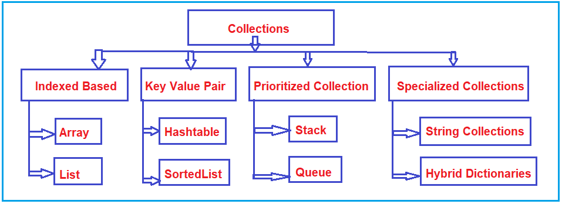
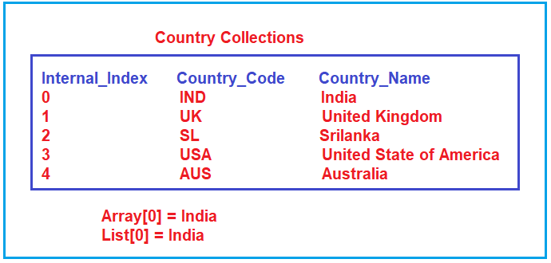
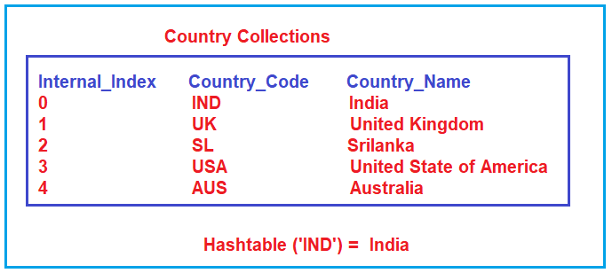
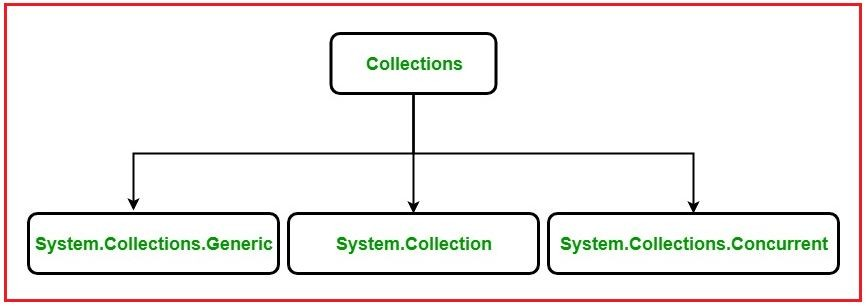

## **مقدمه‌ای بر مجموعه‌ها (Collections) در سی‌شارپ (C#)**

در این مقاله، قصد دارم مقدمه‌ای کوتاه بر **Collections در سی‌شارپ** ارائه دهم . لطفاً مقاله قبلی ما را که در آن مزایا و معایب آرایه‌ها در سی‌شارپ را با مثال‌هایی مورد بحث قرار دادیم، مطالعه کنید. Collections مشابه آرایه‌ها هستند و روش انعطاف‌پذیرتری برای کار با گروهی از اشیاء ارائه می‌دهند. به عنوان بخشی از این مقاله، قصد داریم نکات زیر را به تفصیل مورد بحث قرار دهیم.

1. **مقدمه‌ای بر مجموعه‌ها؟**
2. **دسته بندی های کلی مجموعه ها؟**
3. **آرایه‌ها و معایب آنها در سی شارپ چیست؟**
4. **مجموعه‌ها (Collections) در سی شارپ چیستند؟**
5. **چگونه مجموعه‌ها بر مشکلات آرایه در سی شارپ غلبه می‌کنند؟**
6. **انواع مختلف مجموعه‌ها (Collections) در سی شارپ (C#) چیست؟**

##### **مقدمه‌ای بر مجموعه‌ها:**

مجموعه‌ها چیزی جز گروه‌هایی از رکوردها نیستند که می‌توانند به عنوان یک واحد منطقی در نظر گرفته شوند. به عنوان مثال، می‌توانید یک مجموعه کشور داشته باشید که می‌تواند کد کشور و نام کشور را داشته باشد. می‌توانید یک مجموعه محصول داشته باشید که دارای شناسه محصول و نام محصول باشد. می‌توانید یک مجموعه کارمند داشته باشید که دارای نام و شناسه کارمند باشد. می‌توانید یک مجموعه کتاب داشته باشید که دارای شماره ISBN و نام کتاب باشد. برای درک بهتر، لطفاً به تصویر زیر نگاهی بیندازید.

 در سی‌شارپ (C#)")

##### **دسته بندی های کلی مجموعه ها:**

مجموعه‌ها به ۴ نوع طبقه‌بندی می‌شوند: مبتنی بر فهرست‌بندی، جفت کلید-مقدار، مجموعه اولویت‌بندی‌شده و مجموعه‌های تخصصی. برای درک بهتر، لطفاً به نمودار زیر نگاهی بیندازید.

##### **مجموعه‌های پایه فهرست‌بندی‌شده:**

در Indexed Based، ما دو نوع مجموعه داریم: Array و List. برای درک مجموعه Indexed Based، لطفاً به مجموعه country زیر نگاهی بیندازید. بنابراین، وقتی هر عنصری را به مجموعه‌های .NET مانند Array، List یا ArrayList اضافه می‌کنیم، شماره شاخص داخلی خود را حفظ می‌کند. این شماره شاخص داخلی به طور خودکار توسط چارچوب تولید می‌شود و با استفاده از این شماره شاخص می‌توانیم رکوردها را شناسایی کنیم.

##### **مجموعه‌های جفت کلید-مقدار**

در مجموعه جفت کلید-مقدار، ما Hashtable، Dictionary و SortedList داریم. در پروژه‌های بلادرنگ، به ندرت با استفاده از اعداد اندیس داخلی به رکوردها دسترسی پیدا می‌کنیم. ما معمولاً از نوعی کلید برای شناسایی رکوردها استفاده می‌کنیم و در آنجا از مجموعه‌های جفت کلید-مقدار مانند Hashtable، Dictionary و SortedList استفاده می‌کنیم. برای درک بهتر، لطفاً به نمودار زیر نگاهی بیندازید.

بنابراین، اساساً، اگر بخواهیم رکوردها را بر اساس یک کلید واکشی کنیم، باید از مجموعه‌های جفت کلید-مقدار مانند Hashtable، Dictionary و SortedList استفاده کنیم.

##### **مجموعه‌های اولویت‌دار:**

مجموعه‌های اولویت‌بندی‌شده به شما کمک می‌کنند تا به عناصر در یک توالی خاص دسترسی داشته باشید. مجموعه‌های Stack و Queue متعلق به دسته مجموعه‌های اولویت‌بندی‌شده هستند. اگر می‌خواهید به عناصر یک مجموعه بر اساس ورودی اول (FIFO) دسترسی داشته باشید، باید از مجموعه Queue استفاده کنید. از سوی دیگر، اگر می‌خواهید به عناصر یک مجموعه بر اساس ورودی اول (LIFO) دسترسی داشته باشید، باید از مجموعه Stack استفاده کنید. برای درک بهتر، لطفاً به تصویر زیر نگاهی بیندازید.

##### **مجموعه‌های تخصصی:**

مجموعه‌های تخصصی به‌طور خاص برای یک هدف خاص طراحی شده‌اند. برای مثال، یک دیکشنری ترکیبی (Hybrid Dictionary) با یک لیست شروع می‌شود و سپس به یک جدول درهم‌سازی (hashtable) تبدیل می‌شود.

حال، بیایید بفهمیم که مشکلات آرایه سنتی در سی شارپ چیست و چگونه می‌توانیم با استفاده از مجموعه‌ها در سی شارپ بر چنین مشکلاتی غلبه کنیم.

##### **آرایه‌ها و معایب آنها در سی شارپ چیست؟**

به عبارت ساده، می‌توان گفت که آرایه‌ها در سی‌شارپ، ساختار داده ساده‌ای هستند که برای ذخیره انواع مشابه اقلام داده به ترتیب متوالی استفاده می‌شوند. اگرچه آرایه‌ها در سی‌شارپ معمولاً مورد استفاده قرار می‌گیرند، اما محدودیت‌هایی نیز دارند.

برای مثال، شما باید اندازه آرایه را هنگام ایجاد آرایه مشخص کنید. اگر در زمان اجرا بخواهید آن را تغییر دهید، یعنی اگر می‌خواهید اندازه یک آرایه را افزایش یا کاهش دهید، باید این کار را به صورت دستی با ایجاد یک آرایه جدید یا با استفاده از متد Resize کلاس Array انجام دهید، که به صورت داخلی یک آرایه جدید ایجاد می‌کند و عنصر آرایه موجود را در آرایه جدید کپی می‌کند.

##### **محدودیت‌های آرایه در سی شارپ به شرح زیر است:**

1. اندازه آرایه ثابت است. پس از ایجاد آرایه، دیگر نمی‌توانیم اندازه آرایه را افزایش دهیم. در صورت تمایل، می‌توانیم این کار را به صورت دستی با ایجاد یک آرایه جدید و کپی کردن عناصر آرایه قدیمی در آرایه جدید یا با استفاده از متد Resize کلاس Array انجام دهیم که همان کار را انجام می‌دهد، یعنی یک آرایه جدید ایجاد کرده و عناصر آرایه قدیمی را در آرایه جدید کپی کرده و سپس آرایه قدیمی را از بین می‌برد.
2. ما هرگز نمی‌توانیم یک عنصر را در وسط یک آرایه قرار دهیم
3. حذف یا جابجایی عناصر از وسط آرایه.

برای غلبه بر مشکلات فوق، مجموعه‌ها (Collections) در C# 1.0 معرفی شدند.

##### **مجموعه (Collection) در سی شارپ چیست؟**

مجموعه‌ها **در سی‌شارپ** مجموعه‌ای از کلاس‌های از پیش تعریف‌شده هستند که در **فضای نام System.Collections** وجود دارند و قابلیت‌ها و عملکردهای بیشتری نسبت به آرایه‌های سنتی ارائه می‌دهند. مجموعه‌ها در سی‌شارپ قابل استفاده مجدد، قدرتمندتر و کارآمدتر هستند و از همه مهم‌تر، برای تضمین کیفیت و عملکرد طراحی و آزمایش شده‌اند.

بنابراین به زبان ساده، می‌توانیم بگوییم که یک مجموعه (Collection) در سی شارپ (C#) یک آرایه پویا است **.** این بدان معناست که مجموعه‌ها در سی شارپ قابلیت ذخیره چندین مقدار را دارند، اما با ویژگی‌های زیر.

1. اندازه را می‌توان به صورت پویا افزایش داد.
2. می‌توانیم یک عنصر را در وسط یک مجموعه قرار دهیم.
3. همچنین امکان حذف یا پاک کردن عناصر از وسط یک مجموعه را فراهم می‌کند.

مجموعه‌ها در سی‌شارپ کلاس‌هایی هستند که گروهی از اشیاء را نشان می‌دهند. با کمک مجموعه‌های سی‌شارپ، می‌توانیم انواع مختلفی از عملیات را روی اشیاء انجام دهیم، مانند ذخیره، به‌روزرسانی، حذف، بازیابی، جستجو و مرتب‌سازی اشیاء و غیره. به طور خلاصه، تمام کارهای مربوط به ساختار داده‌ها را می‌توان توسط مجموعه‌ها در سی‌شارپ انجام داد. این بدان معناست که مجموعه‌ها نحوه برخورد برنامه ما با اشیاء را استاندارد می‌کنند.

##### **انواع مجموعه‌ها در سی شارپ**

سه روش برای کار با مجموعه‌ها وجود دارد. این سه فضای نام در زیر آورده شده‌اند:

1. کلاس‌های System.Collections
2. کلاس‌های System.Collections.Generic
3. کلاس‌های همزمان System.Collections

##### **کلاس‌های مجموعه‌های غیر ژنریک در سی شارپ:**

تعریف می‌شوند **کلاس‌های مجموعه غیر عمومی (Non-Generic Collection Classes) با C# 1.0 ارائه می‌شوند و تحت فضای نام System.Collections** . کلاس‌های مجموعه غیر عمومی در C# روی اشیاء عمل می‌کنند و از این رو می‌توانند هر نوع داده‌ای را مدیریت کنند، اما نه به شیوه‌ای از نوع ایمن (safe-type). **فضای نام System.Collections** شامل کلاس‌های زیر است:

1. **ArrayList :** رابط System.Collections.IList را با استفاده از آرایه‌ای که اندازه آن به صورت پویا در صورت نیاز افزایش می‌یابد، پیاده‌سازی می‌کند.
2. **پشته (Stack) :** این نوع داده، مجموعه‌ای ساده و غیر ژنریک از اشیاء است که به ترتیب آخرین ورودی، اولین خروجی (LIFO) عمل می‌کند.
3. **صف (Queue) :** . مجموعه‌ای از اشیاء را نشان می‌دهد که به ترتیب ورود و خروج، اولین ورودی را دارند
4. **جدول درهم‌سازی (Hashtable) :** مجموعه‌ای از جفت‌های کلید/مقدار را نشان می‌دهد که بر اساس کد درهم‌سازی کلید سازماندهی شده‌اند.
5. **SortedList :** مجموعه‌ای از جفت‌های کلید/مقدار را نشان می‌دهد که بر اساس کلیدها مرتب شده‌اند و از طریق کلید و اندیس قابل دسترسی هستند.

##### **عمومی در سی شارپ:** **کلاس‌های مجموعه‌های**

کلاس‌های مجموعه عمومی (Generic Collection) با C# 2.0 ارائه می‌شوند و تحت **فضای نام System.Collection.Generic** تعریف می‌شوند . این فضا، پیاده‌سازی عمومی از ساختارهای داده استاندارد مانند لیست‌های پیوندی، پشته‌ها، صف‌ها و دیکشنری‌ها را فراهم می‌کند. این کلاس‌های مجموعه از نظر نوع ایمن هستند زیرا عمومی هستند، به این معنی که فقط مواردی که از نظر نوع با نوع مجموعه سازگار هستند، می‌توانند در یک مجموعه عمومی ذخیره شوند و این امر عدم تطابق تصادفی نوع را از بین می‌برد. فضای نام System.Collections.Generic دارای کلاس‌های زیر است:

1. **List\<T> :** این یک لیست از اشیاء با نوع داده Strongly Typed است که می‌توان از طریق اندیس به آنها دسترسی داشت. متدهایی برای جستجو، مرتب‌سازی و دستکاری لیست‌ها ارائه می‌دهد.
2. **Stack\<T> :** این Stack مجموعه‌ای از نمونه‌های با اندازه متغیر و به ترتیب ورود و خروج (LIFO) از یک نوع مشخص را نشان می‌دهد.
3. **Queue\<T> :** مجموعه‌ای از اشیاء را نشان می‌دهد که به ترتیب ورود و خروج، اولین هستند.
4. **HashSet\<T> :** مجموعه‌ای از مقادیر را نشان می‌دهد. عناصر تکراری را از مجموعه حذف می‌کند.
5. **Dictionary<TKey, TValue> :** مجموعه‌ای از کلیدها و مقادیر را نشان می‌دهد.
6. **SortedList<TKey, TValue> :** مجموعه‌ای از جفت‌های کلید/مقدار را نشان می‌دهد که بر اساس کلید و بر اساس پیاده‌سازی مرتبط System.Collections.Generic.IComparer مرتب شده‌اند.
7. **SortedSet\<T> :** مجموعه‌ای از اشیاء را نشان می‌دهد که به ترتیب مرتب‌شده نگهداری می‌شوند.
8. **SortedDictionary<TKey, TValue> :** مجموعه‌ای از جفت‌های کلید/مقدار را نشان می‌دهد که بر اساس کلید مرتب شده‌اند.
9. **LinkedList\<T> :** یک لیست دو پیوندی را نشان می‌دهد.

##### **همزمان** **کلاس‌های مجموعه** **در سی شارپ:**

این قابلیت در نسخه ۴ و بعد از .NET Framework ارائه شد. این قابلیت کلاس‌های کلکسیونی thread-safe مختلفی را ارائه می‌دهد که به جای انواع متناظر در **فضاهای نام System.Collections** و **System.Collections.Generic** ، زمانی که چندین thread به طور همزمان به مجموعه دسترسی دارند، استفاده می‌شوند. **فضای نام System.Collections.Concurrent** کلاس‌هایی را برای عملیات thread-safe ارائه می‌دهد. اکنون چندین thread مشکلی برای دسترسی به آیتم‌های مجموعه ایجاد نمی‌کنند. فضای نام System.Collections.Concurrent دارای کلاس‌های زیر است:

1. **BlockingCollection\<T> :** قابلیت‌های مسدودسازی و محدودسازی را برای مجموعه‌های thread-safe که System.Collections.Concurrent.IProderConsumerCollection را پیاده‌سازی می‌کنند، فراهم می‌کند.
2. **ConcurrentBag\<T> :** این یک مجموعه‌ی نامرتب و thread-safe از اشیاء را نشان می‌دهد.
3. **ConcurrentStack\<T> :** این یک مجموعه‌ی LIFO (آخرین ورودی-اولین خروجی) با قابلیت اطمینان نخ را نشان می‌دهد.
4. **ConcurrentQueue\<T> :** این یک مجموعه‌ی FIFO (اولین ورودی-اولین خروجی ایمن از نخ) را نشان می‌دهد.
5. **ConcurrentDictionary<TKey, TValue> :** این مجموعه، مجموعه‌ای از جفت‌های کلید/مقدار است که توسط چندین نخ به صورت همزمان قابل دسترسی هستند.