## **کلاس مجموعه ArrayList در سی شارپ به همراه مثال**

در این مقاله، قصد دارم **کلاس مجموعه ArrayList غیر ژنریک** **در C# را** با مثال‌هایی مورد بحث قرار دهم. لطفاً قبل از ادامه این مقاله، مقاله قبلی ما را که در آن مقدمه‌ای بر مجموعه‌ها در C# را مورد بحث قرار دادیم، مطالعه کنید. ArrayList یک ویژگی قدرتمند زبان C# است. این نوع مجموعه غیر ژنریک است که در **فضای نام System.Collections** تعریف شده است . در پایان این مقاله، نکات زیر را خواهید فهمید.

1. **ArrayList در سی شارپ چیست؟**
2. **چگونه یک ArrayList در سی شارپ با مثال ایجاد کنیم؟**
3. **چگونه عناصر را در ArrayList در C# اضافه کنیم؟**
4. **نحوه دسترسی به ArrayList در سی شارپ با مثال**
5. **چگونه یک ArrayList را در سی شارپ تکرار کنیم؟**
6. **چگونه یک عنصر را در موقعیت مشخص شده در یک مجموعه ArrayList در C# قرار دهیم؟**
7. **چگونه عناصر را از ArrayList در C# با مثال حذف کنیم؟**
8. **چگونه می‌توان تمام عناصر را از ArrayList در C# حذف کرد؟**
9. **چگونه در سی شارپ بررسی کنیم که آیا یک عنصر در ArrayList وجود دارد یا خیر؟**
10. **چگونه مجموعه ArrayList غیر ژنریک را در سی شارپ کلون کنیم؟**
11. **چگونه یک ArrayList را در یک آرایه موجود در C# کپی کنیم؟**
12. **چگونه عناصر یک مجموعه ArrayList را در سی شارپ مرتب کنیم؟**
13. **تفاوت بین آرایه (Array) و لیست آرایه (ArrayList) در سی شارپ چیست؟**

##### **ArrayList در سی شارپ چیست؟**

ArrayList در سی شارپ یک کلاس مجموعه غیر ژنریک است که مانند یک آرایه عمل می‌کند اما امکاناتی مانند تغییر اندازه پویا، اضافه کردن و حذف عناصر از وسط یک مجموعه را فراهم می‌کند. ArrayList در سی شارپ می‌تواند برای اضافه کردن داده‌های ناشناخته استفاده شود، یعنی وقتی نوع داده‌ها و اندازه داده‌ها را نمی‌دانیم، می‌توانیم از ArrayList استفاده کنیم.

از آن برای ایجاد یک آرایه پویا استفاده می‌شود، به این معنی که اندازه آرایه به طور خودکار با توجه به نیاز برنامه ما افزایش یا کاهش می‌یابد. نیازی به مشخص کردن اندازه ArrayList نیست. در ArrayList می‌توانیم عناصری از یک نوع و از انواع مختلف را ذخیره کنیم.

##### **ویژگی‌های کلاس ArrayList در سی شارپ:**

1. عناصر را می‌توان در هر زمانی به مجموعه Array List اضافه یا از آن حذف کرد.
2. تضمینی وجود ندارد که ArrayList مرتب شده باشد.
3. ظرفیت یک ArrayList تعداد عناصری است که ArrayList می‌تواند در خود نگه دارد.
4. عناصر این مجموعه با استفاده از یک اندیس عدد صحیح قابل دسترسی هستند. اندیس‌های این مجموعه از صفر شروع می‌شوند.
5. اجازه می‌دهد عناصر تکراری باشند.

##### **چگونه یک ArrayList در سی شارپ ایجاد کنیم؟**

ArrayList در سی شارپ سه سازنده زیر را ارائه می‌دهد که می‌توانیم از آنها برای ایجاد یک نمونه از کلاس ArrayList استفاده کنیم.

1. **ArrayList():** این متد برای مقداردهی اولیه یک نمونه جدید از کلاس ArrayList که خالی است و ظرفیت اولیه پیش‌فرض را دارد، استفاده می‌شود.
2. **ArrayList(ICollection c):** این متد برای مقداردهی اولیه یک نمونه جدید از کلاس ArrayList استفاده می‌شود که شامل عناصر کپی شده از مجموعه مشخص شده است و ظرفیت اولیه آن با تعداد عناصر کپی شده یکسان است. پارامتر c مجموعه ای را مشخص می‌کند که عناصر آن در لیست جدید کپی می‌شوند.
3. **ArrayList(int capacity):** این متد برای مقداردهی اولیه یک نمونه جدید از کلاس ArrayList که خالی است و ظرفیت اولیه مشخصی دارد، استفاده می‌شود. پارامتر capacity تعداد عناصری را که لیست جدید می‌تواند در ابتدا ذخیره کند، مشخص می‌کند.

ابتدا باید فضای نام System.Collections را وارد کنیم و سپس می‌توانیم با استفاده از سازنده اول به صورت زیر، یک نمونه از ArrayList ایجاد کنیم. می‌توانید از هر یک از سینتکس‌های زیر استفاده کنید:  
**ArrayList arrayList = new ArrayList();**  
// یا  
**var arrayList = new ArrayList();**

##### **چگونه عناصر را در ArrayList در C# اضافه کنیم؟**

کلاس غیر ژنریک ArrayList متد Add() را ارائه می‌دهد که می‌توانیم از آن برای اضافه کردن عناصر به لیست آرایه استفاده کنیم یا حتی می‌توانیم از سینتکس مقداردهی اولیه شیء برای اضافه کردن عناصر در یک ArrayList استفاده کنیم. مهمترین نکته این است که می‌توانیم چندین نوع مختلف عنصر را در یک ArrayList اضافه کنیم، اگرچه اضافه کردن عناصر تکراری نیز امکان‌پذیر است.

بیایید مثالی بزنیم تا هر دو رویکرد برای اضافه کردن عناصر در مجموعه‌ای از نوع ArrayList در C# را درک کنیم. لطفاً به مثال زیر نگاهی بیندازید. در اینجا، می‌توانید مشاهده کنید که ما انواع مختلف داده‌ها و همچنین داده‌های تکراری را اضافه کرده‌ایم و پذیرفته شده است.

```csharp
using System;
using System.Collections;

namespace Csharp8Features
{
    public class ArrayListDemo
    {
        public static void Main()
        {
            //Adding elements to ArrayList using Add() method
            ArrayList arrayList1 = new ArrayList();
            arrayList1.Add(101); //Adding Integer Value
            arrayList1.Add("James"); //Adding String Value
            arrayList1.Add("James"); //Adding Duplicate Value
            arrayList1.Add(" "); //Adding Empty
            arrayList1.Add(true); //Adding Boolean
            arrayList1.Add(4.5); //Adding double
            arrayList1.Add(null); //Adding null

            foreach (var item in arrayList1)
            {
                Console.WriteLine(item);
            }

            //Adding Elements to ArrayList using object initializer syntax
            var arrayList2 = new ArrayList()
            {
                102, "Smith", "Smith", true, 15.6
            };

            foreach (var item in arrayList2)
            {
                Console.WriteLine(item);
            }
            Console.ReadKey();
        }
    }
}
```

###### **خروجی:**

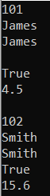

##### **چگونه در سی شارپ به یک ArrayList دسترسی پیدا کنیم؟**

اگر به تعریف ArrayList بروید، خواهید دید که کلاس ArrayList رابط IList را همانطور که در تصویر زیر نشان داده شده است، پیاده‌سازی می‌کند. از آنجایی که رابط IList را پیاده‌سازی می‌کند، می‌توانیم با استفاده از یک شاخص‌گذار، مانند یک آرایه، به عناصر آن دسترسی پیدا کنیم. شاخص از صفر شروع می‌شود و برای هر عنصر بعدی یک واحد افزایش می‌یابد. بنابراین، وقتی یک کلاس مجموعه رابط IList را پیاده‌سازی می‌کند، می‌توانیم با استفاده از شاخص‌های عدد صحیح به عناصر آن مجموعه دسترسی پیدا کنیم.

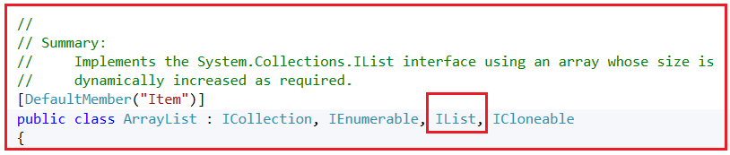

هنگام اضافه کردن عناصر به ArrayList، برنامه به طور خودکار عناصر را به انواع شیء تبدیل (cast) کرده و سپس آنها را در مجموعه ذخیره می‌کند. بنابراین، هنگام دسترسی به عناصر، تبدیل صریح به انواع مناسب لازم است، در غیر این صورت می‌توانید از متغیر var استفاده کنید. برای درک بهتر، لطفاً به مثال زیر نگاهی بیندازید. کد به خودی خود توضیح داده شده است، لطفاً نظرات را بخوانید.

```csharp
using System;
using System.Collections;

namespace Csharp8Features
{
    public class ArrayListDemo
    {
        public static void Main()
        {
            //Adding elements to ArrayList using Add() method
            ArrayList arrayList1 = new ArrayList();
            arrayList1.Add(101); //Adding Integer Value
            arrayList1.Add("James"); //Adding String Value
            arrayList1.Add(true); //Adding Boolean
            arrayList1.Add(4.5); //Adding double

            //Accessing individual elements from ArrayList using Indexer
            int firstElement = (int)arrayList1[0]; //returns 101
            string secondElement = (string)arrayList1[1]; //returns "James"
            //int secondElement = (int) arrayList1[1]; //Error: cannot cover string to int
            Console.WriteLine($"First Element: {firstElement}, Second Element: {secondElement}");

            //Using var keyword without explicit casting
            var firsItem = arrayList1[0]; //returns 101
            var secondItem = arrayList1[1]; //returns "James"
            //var fifthElement = arrayList1[5]; //Error: Index out of range
            Console.WriteLine($"First Item: {firsItem}, Second Item: {secondItem}");

            //update elements
            arrayList1[0] = "Smith";
            arrayList1[1] = 1010;
            //arrayList1[5] = 500; //Error: Index out of range

            foreach (var item in arrayList1)
            {
                Console.Write($"{item} ");
            }
            Console.ReadKey();
        }
    }
}
```

###### **خروجی:**

 در سی شارپ به همراه مثال")

##### **چگونه یک ArrayList را در سی شارپ تکرار کنیم؟**

اگر به تعریف ArrayList بروید، خواهید دید که کلاس مجموعه غیر ژنریک ArrayList، رابط ICollection را همانطور که در تصویر زیر نشان داده شده است، پیاده‌سازی می‌کند. و می‌دانیم که رابط ICollection از تکرار انواع مجموعه پشتیبانی می‌کند. بنابراین، می‌توانیم از حلقه foreach و for برای تکرار مجموعه‌ای از نوع ArrayList استفاده کنیم.

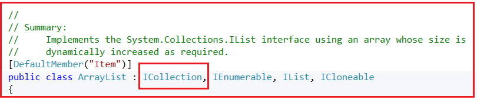

ویژگی Count از ArrayList تعداد کل عناصر موجود در یک ArrayList را برمی‌گرداند. اجازه دهید این موضوع را با یک مثال درک کنیم.

```csharp
using System;
using System.Collections;

namespace Csharp8Features
{
    public class ArrayListDemo
    {
        public static void Main()
        {
            //Adding elements to ArrayList using Add() method
            ArrayList arrayList1 = new ArrayList();
            arrayList1.Add(101); //Adding Integer Value
            arrayList1.Add("James"); //Adding String Value
            arrayList1.Add(true); //Adding Boolean
            arrayList1.Add(4.5); //Adding double

            //Iterating through foreach loop
            Console.WriteLine("Using ForEach Loop");
            foreach (var item in arrayList1)
            {
                Console.Write($"{item} ");
            }

            //Iterating through for loop
            Console.WriteLine("\n\nUsing For Loop");
            for (int i = 0; i < arrayList1.Count; i++)
            {
                Console.Write($"{arrayList1[i]} ");
            } 
            Console.ReadKey();
        }
    }
}
```

###### **خروجی:**

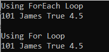

##### **چگونه یک عنصر را در موقعیت مشخص شده در یک مجموعه ArrayList در C# قرار دهیم؟**

متد Add عنصر را در انتهای مجموعه، یعنی بعد از آخرین عنصر، اضافه می‌کند. اما اگر می‌خواهید عنصر را در موقعیت مشخصی اضافه کنید، باید از متد Insert() از کلاس ArrayList استفاده کنید که یک عنصر را در موقعیت اندیس مشخص شده به مجموعه اضافه می‌کند. سینتکس استفاده از متد Insert در زیر آمده است.  
**درج از نوع void(شاخص صحیح، شیء؟ مقدار)؛**  
در اینجا، پارامتر اندیس، موقعیت اندیس را که مقدار باید در آن درج شود، مشخص می‌کند و مقدار پارامتر، شیء مورد نظر برای درج در لیست را مشخص می‌کند. این تابع بر اساس اندیس صفر است. برای درک بهتر، لطفاً به مثال زیر نگاهی بیندازید.

```csharp
using System;
using System.Collections;

namespace Csharp8Features
{
    public class ArrayListDemo
    {
        public static void Main()
        {
            ArrayList arrayList = new ArrayList()
            {
                    101,
                    "James",
                    true,
                    10.20
            };
            
            //Insert "First Element" at First Position i.e. Index 0
            arrayList.Insert(0, "First Element");

            //Insert "Third Element" at Third Position i.e. Index 2
            arrayList.Insert(2, "Third Element");

            //Iterating through foreach loop
            foreach (var item in arrayList)
            {
                Console.WriteLine($"{item}");
            }
            Console.ReadKey();
        }
    }
}
```

###### **خروجی:**

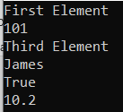

اگر یک مجموعه داشته باشیم و بخواهیم آن مجموعه را در مجموعه دیگری از Array List وارد کنیم، می‌توانیم از متد InsertRange() استفاده کنیم. متد InsertRange() عناصر یک مجموعه را در ArrayList با اندیس مشخص شده وارد می‌کند. سینتکس آن در زیر آمده است.

**void InsertRange(int index, ICollection c)**

در اینجا، پارامتر index مشخص می‌کند که عناصر جدید در کدام مکان باید درج شوند و پارامتر c مجموعه ای را مشخص می‌کند که عناصر آن باید در ArrayList درج شوند. خود مجموعه نمی‌تواند null باشد، اما می‌تواند شامل عناصری باشد که null هستند. برای درک بهتر، لطفاً به مثال زیر نگاهی بیندازید.

```csharp
using System;
using System.Collections;

namespace Csharp8Features
{
    public class ArrayListDemo
    {
        public static void Main()
        {
            ArrayList arrayList1 = new ArrayList()
            {
                    "India",
                    "USA",
                    "UK",
                    "Nepal"
            };
            Console.WriteLine("Array List Elements");
            foreach (var item in arrayList1)
            {
                Console.Write($"{item} ");
            }

            ArrayList arrayList2 = new ArrayList()
            {
                    "Srilanka",
                    "Japan",
                    "Britem"
            };
            arrayList1.InsertRange(2, arrayList2);
            
            Console.WriteLine("\n\nArray List Elements After InsertRange");
            foreach (var item in arrayList1)
            {
                Console.Write($"{item} ");
            }

            Console.ReadKey();
        }
    }
}
```

###### **خروجی:**

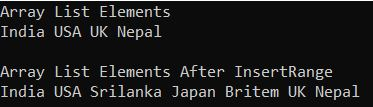

##### **چگونه عناصر را از ArrayList در C# حذف کنیم؟**

اگر می‌خواهید عناصری را از ArrayList در C# حذف کنید، می‌توانید از متدهای Remove()، RemoveAt() یا RemoveRange() از کلاس ArrayList در C# استفاده کنید.

1. **حذف(object? obj):** این متد برای حذف اولین رخداد یک شیء خاص از System.Collections.ArrayList استفاده می‌شود. پارامتر obj شیء مورد نظر برای حذف از ArrayList را مشخص می‌کند. مقدار آن می‌تواند null باشد.
2. **RemoveAt(int index):** این متد برای حذف عنصر در اندیس مشخص شده از ArrayList استفاده می‌شود. پارامتر index موقعیت اندیس عنصری را که باید حذف شود، مشخص می‌کند.
3. **RemoveRange(int index, int count):** این متد برای حذف محدوده‌ای از عناصر از ArrayList استفاده می‌شود. پارامتر index موقعیت شروع اندیس محدوده عناصری که باید حذف شوند را مشخص می‌کند و پارامتر count تعداد عناصری را که باید حذف شوند، مشخص می‌کند.

برای درک بهتر، لطفاً به مثال زیر توجه کنید.

```csharp
using System;
using System.Collections;

namespace Csharp8Features
{
    public class ArrayListDemo
    {
        public static void Main()
        {
            ArrayList arrayList = new ArrayList()
            {
                    "India",
                    "USA",
                    "UK",
                    "Nepal",
                    "HongKong",
                    "Srilanka",
                    "Japan",
                    "Britem",
                    "HongKong",
            };

            Console.WriteLine("Array List Elements");
            foreach (var item in arrayList)
            {
                Console.Write($"{item} ");
            }

            arrayList.Remove("HongKong"); //Removes first occurance of null
            Console.WriteLine("\n\nArray List Elements After Removing First Occurances of HongKong");
            foreach (var item in arrayList)
            {
                Console.Write($"{item} ");
            }

            arrayList.RemoveAt(3); //Removes element at index postion 3, it is 0 based index
            Console.WriteLine("\n\nArray List1 Elements After Removing Element from Index 3");
            foreach (var item in arrayList)
            {
                Console.Write($"{item} ");
            }

            arrayList.RemoveRange(0, 2);//Removes two elements starting from 1st item (0 index)
            Console.WriteLine("\n\nArray List Elements After Removing First Two Elements");
            foreach (var item in arrayList)
            {
                Console.Write($"{item} ");
            }
            Console.ReadKey();
        }
    }
}
```

###### **خروجی:**

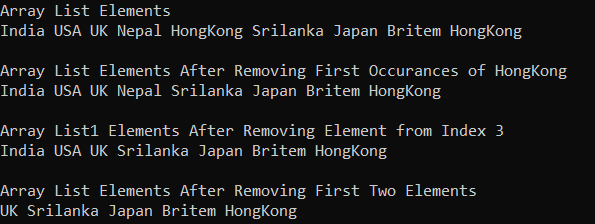

##### **چگونه تمام عناصر را از ArrayList در C# حذف کنیم؟**

اگر می‌خواهید تمام عناصر را از ArrayList حذف کنید یا تمام عناصر را پاک کنید، می‌توانید از متد Clear() از کلاس ArrayList استفاده کنید، اما این متد ظرفیت ArrayList را کاهش نمی‌دهد. برای درک بهتر، مثالی را بررسی می‌کنیم.

```csharp
using System;
using System.Collections;

namespace Csharp8Features
{
    public class ArrayListDemo
    {
        public static void Main()
        {
            ArrayList arrayList = new ArrayList()
            {
                    "India",
                    "USA",
                    "UK",
                    "Denmark",
                    "Nepal",
            };

            int totalItems = arrayList.Count;
            Console.WriteLine(string.Format($"Total Items: {totalItems}, Capacity: {arrayList.Capacity}"));
            //Remove all items from the Array list             
            arrayList.Clear();

            totalItems = arrayList.Count;
            Console.WriteLine(string.Format($"Total Items After Clear(): {totalItems}, Capacity: {arrayList.Capacity}"));
            Console.ReadKey();
        }
    }
}
```

###### **خروجی:**

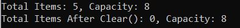

##### **چگونه در سی شارپ بررسی کنیم که آیا یک عنصر در ArrayList وجود دارد یا خیر؟**

برای بررسی وجود یا عدم وجود یک عنصر در ArrayList، باید از متد Contains() از کلاس مجموعه غیر ژنریک ArrayList در C# استفاده کنیم. در صورت وجود، مقدار true و در غیر این صورت مقدار false را برمی‌گرداند. در ادامه، سینتکس استفاده از متد Contains() آمده است.

1. **bool Contains(object? item) :** این متد برای تعیین وجود یک عنصر در ArrayList استفاده می‌شود. پارامتر item، شیء مورد نظر برای قرار دادن در ArrayList را مشخص می‌کند. مقدار می‌تواند null باشد. اگر عنصر در ArrayList یافت شود، مقدار true و در غیر این صورت، مقدار false را برمی‌گرداند.

برای درک بهتر، لطفاً به مثال زیر توجه کنید.

```csharp
using System;
using System.Collections;

namespace Csharp8Features
{
    public class ArrayListDemo
    {
        public static void Main()
        {
            ArrayList arrayList = new ArrayList()
            {
                    "India",
                    "UK",
                    "Nepal",
                    101
            };

            Console.WriteLine("Array List Elements");
            foreach (var item in arrayList)
            {
                Console.Write($"{item} ");
            }

            Console.WriteLine($"\n\nIs ArrayList Contains India: {arrayList.Contains("India")}"); // true
            Console.WriteLine($"Is ArrayList Contains USA: {arrayList.Contains("USA")}"); // false
            Console.WriteLine($"Is ArrayList Contains 101: {arrayList.Contains(101)}"); // true
            Console.WriteLine($"Is ArrayList Contains 10.5: {arrayList.Contains(10.5)}"); // false
            Console.ReadKey();
        }
    }
}
```

###### **خروجی:**

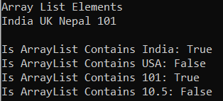

**نکته:** استفاده از کلاس مجموعه غیر ژنریک ArrayList در C# به دلیل مشکلات عملکردی مانند boxing و unboxing توصیه نمی‌شود، زیرا روی نوع داده object عمل می‌کند. بنابراین، به جای استفاده از ArrayList، توصیه می‌شود از مجموعه ژنریک List<object> برای ذخیره اشیاء ناهمگن استفاده کنید. برای ذخیره داده‌هایی از یک نوع داده، از Generic List<T> استفاده کنید.

##### **چگونه مجموعه ArrayList غیر ژنریک را در سی شارپ کلون کنیم؟**

اگر می‌خواهید مجموعه Non-Generic ArrayList را در C# کپی کنید، باید از متد Clone() زیر که توسط کلاس مجموعه ArrayList ارائه شده است، استفاده کنید.

1. **Clone():** این متد برای ایجاد و بازگرداندن یک کپی سطحی از ArrayList استفاده می‌شود.

برای درک بهتر، لطفاً به مثال زیر توجه کنید.

```csharp
using System;
using System.Collections;

namespace Csharp8Features
{
    public class ArrayListDemo
    {
        public static void Main()
        {
            ArrayList arrayList = new ArrayList()
            {
                    "India",
                    "USA",
                    "UK",
                    "Denmark",
                    "HongKong",
            };

            Console.WriteLine("Array List Elements:");
            foreach (var item in arrayList)
            {
                Console.WriteLine($"{item} ");
            }

            //Creating a clone of the arrayList using Clone method
            ArrayList cloneArrayList = (ArrayList)arrayList.Clone();
            Console.WriteLine("\nCloned ArrayList Elements:");
            foreach (var item in cloneArrayList)
            {
                Console.WriteLine($"{item} ");
            }

            Console.ReadKey();
        }
    }
}
```

###### **خروجی:**

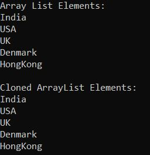

##### **چگونه یک ArrayList را در C# به یک آرایه موجود کپی کنیم؟**

برای کپی کردن یک ArrayList به یک آرایه موجود در C#، کلاس مجموعه ArrayList غیر ژنریک سه روش زیر را ارائه می‌دهد.

1. **CopyTo(Array array):** این متد برای کپی کردن کل ArrayList به یک آرایه تک بعدی سازگار، با شروع از ابتدای آرایه هدف، استفاده می‌شود. آرایه پارامتر، آرایه تک بعدی را که مقصد عناصر کپی شده از ArrayList است، مشخص می‌کند. آرایه باید دارای اندیس‌گذاری مبتنی بر صفر باشد. اگر آرایه پارامتر تهی باشد، خطای ArgumentNullException رخ می‌دهد.
2. **CopyTo(Array array, int arrayIndex):** این متد برای کپی کردن کل ArrayList به یک آرایه تک بعدی سازگار، با شروع از اندیس مشخص شده آرایه هدف، استفاده می‌شود. در اینجا، پارامتر array، آرایه تک بعدی را که مقصد عناصر کپی شده از ArrayList است، مشخص می‌کند. آرایه باید اندیس گذاری مبتنی بر صفر داشته باشد. پارامتر arrayIndex، اندیس مبتنی بر صفر را در آرایه‌ای که کپی از آن شروع می‌شود، مشخص می‌کند. اگر پارامتر array تهی باشد، خطای ArgumentNullException رخ می‌دهد. اگر پارامتر arrayIndex کمتر از صفر باشد، خطای ArgumentOutOfRangeException رخ می‌دهد.
3. **CopyTo(int index, Array array, int arrayIndex, int count)** : این متد برای کپی کردن طیفی از عناصر از System.Collections.ArrayList به یک آرایه تک بعدی سازگار، با شروع از اندیس مشخص شده آرایه هدف، استفاده می‌شود. پارامتر index، اندیس مبتنی بر صفر را در System.Collections.ArrayList منبع که کپی از آن شروع می‌شود، مشخص می‌کند. پارامتر array، اندیس مبتنی بر صفر را در آرایه‌ای که کپی از آن شروع می‌شود، مشخص می‌کند. پارامتر count، تعداد عناصری را که باید کپی شوند، مشخص می‌کند. اگر پارامتر array تهی باشد، خطای ArgumentNullException رخ می‌دهد. اگر اندیس پارامتر کمتر از صفر باشد، arrayIndex کمتر از صفر باشد یا تعداد کمتر از صفر باشد، خطای ArgumentOutOfRangeException رخ می‌دهد.

برای درک بهتر، مثالی را بررسی می‌کنیم.

```csharp
using System;
using System.Collections;

namespace Csharp8Features
{
    public class ArrayListDemo
    {
        public static void Main()
        {
            ArrayList arrayList = new ArrayList()
            {
                    "India",
                    "USA",
                    "UK",
                    "Denmark",
                    "HongKong",
            };

            Console.WriteLine("Array List Elements:");
            foreach (var item in arrayList)
            {
                Console.WriteLine($"{item} ");
            }

            //Copying the arrayList to an object array
            object[] arrayListCopy = new object[arrayList.Count];
            arrayList.CopyTo(arrayListCopy);
            Console.WriteLine("\nArrayList Copy Array Elements:");
            foreach (var item in arrayListCopy)
            {
                Console.WriteLine(item);
            }

            Console.ReadKey();
        }
    }
}
```

###### **خروجی:**

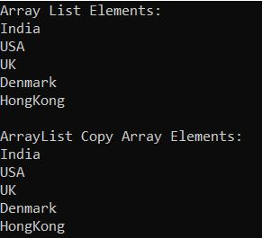

##### **چگونه عناصر یک مجموعه ArrayList را در سی شارپ مرتب کنیم؟**

اگر می‌خواهید عناصر ArrayList را در C# مرتب کنید، می‌توانید از متد Sort() زیر از کلاس ArrayList استفاده کنید.

1. **مرتب‌سازی():** این متد برای مرتب‌سازی عناصر در کل System.Collections.ArrayList استفاده می‌شود.
2. **مرتب‌سازی(IComparer? comparer):** این متد برای مرتب‌سازی عناصر در کل ArrayList با استفاده از مقایسه‌گر مشخص شده استفاده می‌شود.
3. **مرتب‌سازی(int index, int count, IComparer? comparer):** این متد برای مرتب‌سازی عناصر در محدوده‌ای از عناصر در ArrayList با استفاده از مقایسه‌گر مشخص شده استفاده می‌شود.

این متدها از الگوریتم QuickSort برای انجام مرتب‌سازی روی ArrayList استفاده می‌کنند و عناصر به ترتیب صعودی مرتب می‌شوند. برای درک بهتر، لطفاً به مثال زیر نگاهی بیندازید.

```csharp
using System;
using System.Collections;

namespace Csharp8Features
{
    public class ArrayListDemo
    {
        public static void Main()
        {
            ArrayList arrayList = new ArrayList()
            {
                    "India",
                    "USA",
                    "UK",
                    "Denmark",
                    "Nepal",
                    "HongKong",
                    "Austrailla",
                    "Srilanka",
                    "Japan",
                    "Britem",
                    "Brazil",
            };

            Console.WriteLine("Array List Elements Before Sorting");
            foreach (var item in arrayList)
            {
                Console.Write($"{item} ");
            }

            // Sorting the elements of  ArrayList Using sort() method
            arrayList.Sort();
            Console.WriteLine("\n\nArray List Elements After Sorting");
            foreach (var item in arrayList)
            {
                Console.Write($"{item} ");
            }
            Console.ReadKey();
        }
    }
}
```

###### **خروجی:**

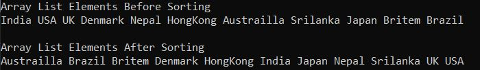

##### **تفاوت بین آرایه و لیست آرایه در سی شارپ چیست؟**

مجموعه ArrayList در سی شارپ بسیار شبیه به نوع داده Arrays است. تفاوت اصلی بین آنها ماهیت پویای مجموعه غیر ژنریک ArrayList است. برای آرایه‌ها، باید اندازه، یعنی تعداد عناصری که آرایه می‌تواند در زمان تعریف آرایه نگه دارد را تعریف کنیم. اما در مورد مجموعه ArrayList در سی شارپ، نیازی به انجام این کار از قبل نیست. عناصر را می‌توان در هر نقطه از زمان به مجموعه Array List اضافه یا حذف کرد.

این یکی از سوالات متداول مصاحبه در C# است. بنابراین بیایید تفاوت بین آرایه و ArrayList را مورد بحث قرار دهیم.

###### **آرایه:**

1. طول ثابت
2. نمی‌توان آن را در وسط قرار داد
3. از وسط نمیشه حذف کرد
4. این نوع داده از نوع امن (type-safe) است، بنابراین می‌توانیم فقط انواع مشابه داده‌ها را بر اساس نوع داده ذخیره کنیم.
5. Boxing و Unboxing لازم نیست.

###### **لیست آرایه:**

1. طول متغیر
2. می‌تواند یک عنصر را در وسط مجموعه وارد کند
3. می‌تواند عناصر را از وسط مجموعه حذف کند
4. این نوع داده از نوع امن نیست، بنابراین می‌توانیم هر نوع داده‌ای را ذخیره کنیم.
5. Boxing و Unboxing لازم هستند زیرا روی نوع داده شیء عمل می‌کنند.
