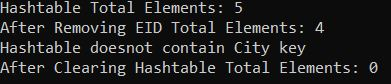
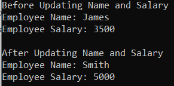
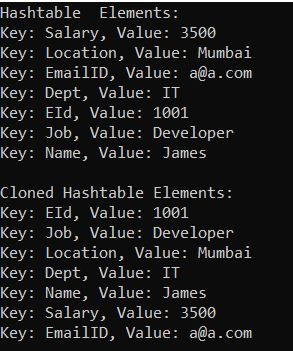
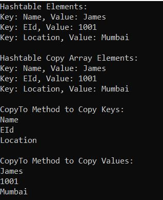

## **کلاس مجموعه Hashtable در سی شارپ با مثال**

در این مقاله، قصد دارم در مورد **کلاس مجموعه Hashtable غیر ژنریک در سی شارپ** با مثال بحث کنم. لطفاً مقاله قبلی ما را که در آن در مورد کلاس مجموعه ArrayList در سی شارپ با مثال بحث کردیم، مطالعه کنید. در پایان این مقاله، نکات زیر را خواهید فهمید.

1. **مشکلات آرایه و مجموعه ArrayList در سی شارپ چیست؟**
2. **جدول درهم‌سازی (Hashtable) در سی‌شارپ چیست و چگونه کار می‌کند؟**
3. **تفاوت‌های Hashtable و ArrayList در سی شارپ**
4. **چگونه یک مجموعه Hashtable غیر ژنریک در سی شارپ ایجاد کنیم؟**
5. **چگونه عناصر را به یک مجموعه Hashtable در سی شارپ اضافه کنیم؟**
6. **چگونه به یک مجموعه Hashtable غیر ژنریک در سی شارپ دسترسی پیدا کنیم؟**
7. **چگونه در دسترس بودن یک جفت کلید/مقدار را در یک جدول درهم‌سازی (Hashtable) در سی‌شارپ بررسی کنیم؟**
8. **چگونه عناصر را از یک مجموعه Hashtable غیر ژنریک در C# حذف کنیم؟**
9. **چگونه با استفاده از Indexer در سی شارپ، مقادیر را به یک Hashtable اختصاص داده و به‌روزرسانی کنیم؟**
10. **چگونه یک مجموعه Hashtable غیر ژنریک را در سی شارپ کلون کنیم؟**
11. **چگونه یک جدول درهم‌سازی (Hashtable) را در یک آرایه موجود در سی شارپ کپی کنیم؟**

قبل از درک Hashtable در سی شارپ، ابتدا بیایید مشکلاتی را که با مجموعه Array و ArrayList در سی شارپ مواجه می‌شویم و نحوه غلبه بر چنین مشکلاتی با Hashtable را درک کنیم.

##### **مشکلات آرایه و مجموعه ArrayList در سی شارپ چیست؟**

در مورد آرایه و لیست آرایه‌ای در سی‌شارپ، ما با استفاده از موقعیت اندیس به عناصر مجموعه دسترسی پیدا می‌کنیم. موقعیت اندیس عناصر از صفر (0) تا تعداد عناصر - 1 شروع می‌شود. اما، به خاطر سپردن موقعیت اندیس عنصر برای دسترسی به مقادیر برای ما بسیار دشوار است.

برای مثال، فرض کنید یک آرایه کارمند داریم که شامل نام، آدرس، تلفن همراه، شماره دپارتمان، شناسه ایمیل، شناسه کارمند، حقوق، موقعیت مکانی و غیره است. حال اگر بخواهم شناسه ایمیل یا شماره دپارتمان کارمند را بدانم، استفاده از موقعیت اندیس برای من بسیار دشوار است. مثال زیر این موضوع را نشان می‌دهد. در اینجا ما یک مجموعه با استفاده از ArrayList ایجاد می‌کنیم و سپس با استفاده از موقعیت اندیس به موقعیت مکانی و EmailId دسترسی پیدا می‌کنیم. در اینجا، باید موقعیت اندیس هر مقدار را به خاطر بسپاریم که کار دشواری است و بدون دانستن موقعیت اندیس نمی‌توانیم به مقدار دسترسی پیدا کنیم.

```csharp
using System;
using System.Collections;

namespace HasntableExample
{
    class Program
    {
        static void Main(string[] args)
        {
            ArrayList al = new ArrayList();

            al.Add(1001); //EId - Index Position = 0
            al.Add("James"); //Name - Index Position = 1
            al.Add("Manager"); //Job - Index Position = 2
            al.Add(3500); //Salary - Index Position = 3
            al.Add("Mumbai"); //Location - Index Position = 4
            al.Add("IT"); //Dept - Index Position = 5
            al.Add("a@a.com"); // Emailid - Index Position = 6

            //I want to print the Location, Index position is 4
            Console.WriteLine("Location : " + al[4]);

            //I want to print the Email ID, Index position is 6
            Console.WriteLine("Emaild ID : " + al[6]);

            Console.ReadKey();
        }
    }
}
```

اگر تعداد زیادی عنصر در مجموعه داشته باشید، به خاطر سپردن موقعیت اندیس هر عنصر بسیار دشوار است. بنابراین، خوب نیست که به جای استفاده از موقعیت اندیس عنصر، با استفاده از یک کلید به عناصر دسترسی پیدا کنیم. اینجاست که **Hashtable در C#** به کار می‌آید.

##### **جدول درهم‌سازی (Hashtable) در سی‌شارپ چیست؟**

جدول درهم‌سازی (Hashtable) در سی‌شارپ یک مجموعه غیر ژنریک (Non-Generic Collection) است که عنصر را به شکل «جفت‌های کلید-مقدار» (Key-Value Pairs) ذخیره می‌کند. داده‌های موجود در جدول درهم‌سازی بر اساس کد درهم‌سازی کلید سازماندهی می‌شوند. کلید در جدول درهم‌سازی توسط ما تعریف می‌شود و مهم‌تر از آن، آن کلید می‌تواند از هر نوع داده‌ای باشد. پس از ایجاد مجموعه جدول درهم‌سازی، می‌توانیم با استفاده از کلیدها به عناصر دسترسی پیدا کنیم. کلاس جدول درهم‌سازی (Hashtable) تحت فضای نام System.Collections قرار دارد.

جدول درهم‌سازی (Hashtable) برای هر کلید یک کد درهم‌سازی محاسبه می‌کند. سپس از آن کد درهم‌سازی برای جستجوی سریع عناصر استفاده می‌کند که باعث افزایش عملکرد برنامه می‌شود.

##### **ویژگی‌های جدول درهم‌سازی (Hashtable) در سی‌شارپ**

1. کلاس Hashtable Collection در سی شارپ، عناصر را به شکل جفت‌های کلید-مقدار ذخیره می‌کند.
2. کلاس Hashtable متعلق به فضای نام System.Collection است، یعنی یک کلاس Non-Generic Collection محسوب می‌شود.
3. رابط کاربری IDictionary را پیاده‌سازی می‌کند.
4. کلیدها می‌توانند از هر نوع داده‌ای باشند، اما باید منحصر به فرد باشند و تهی (null) نباشند.
5. جدول درهم‌سازی (Hashtable) هم مقادیر تهی (null) و هم مقادیر تکراری (duplicate) را می‌پذیرد.
6. ما می‌توانیم با استفاده از کلید مرتبط به مقادیر دسترسی پیدا کنیم.
7. ظرفیت یک جدول درهم‌سازی (Hashtable) تعداد عناصری است که یک جدول درهم‌سازی می‌تواند در خود جای دهد.
8. یک جدول درهم‌سازی (hashtable) یک مجموعه غیر ژنریک است، بنابراین می‌توانیم عناصری از یک نوع و همچنین عناصری از انواع مختلف را ذخیره کنیم.

##### **جدول درهم‌سازی (Hashtable) در سی‌شارپ چگونه کار می‌کند؟**

وقتی عناصری مانند رشته، عدد صحیح یا انواع پیچیده را به یک جدول درهم‌سازی اضافه می‌کنیم، آنگاه داده‌های کلیدی که می‌توانند رشته، عدد صحیح، عدد اعشاری یا هر چیز دیگری باشند، به مقادیر صحیح درهم‌سازی ساده تبدیل می‌شوند تا جستجو آسان شود. پس از انجام تبدیل، داده‌ها به مجموعه جدول درهم‌سازی اضافه می‌شوند. برای درک بهتر، لطفاً به تصویر زیر نگاهی بیندازید.

 در سی شارپ")

نکته‌ی دیگری که باید به خاطر داشته باشید این است که عملکرد جدول درهم‌سازی (hashtable) در مقایسه با ArrayList به دلیل همین تبدیل کلید (تبدیل کلید به یک کد درهم‌سازی صحیح) کمتر است.

##### **تفاوت‌های بین ArrayList و Hashtable در سی شارپ:**

1. **جستجو** : ArrayList فقط از طریق شماره اندیس که به صورت داخلی تولید می‌شود قابل جستجو است. Hashtable را می‌توان با یک کلید تعریف شده سفارشی جستجو کرد.
2. **عملکرد** : ArrayList به دلیل وظایف اضافی انجام شده در hashtables مانند hashing، سریع‌تر از hashtable است.
3. **سناریو** : اگر می‌خواهید یک کلید را جستجو کنید، از جدول درهم‌سازی (hashtable) استفاده کنید. اگر فقط می‌خواهید یک مجموعه را اضافه و مرور کنید، از ArrayList استفاده کنید.

##### **چگونه یک مجموعه Hashtable غیر ژنریک در سی شارپ ایجاد کنیم؟**

کلاس Hashtable غیر ژنریک در سی شارپ، 16 نوع سازنده مختلف ارائه می‌دهد که می‌توانیم از آنها برای ایجاد یک Hashtable همانطور که در تصویر زیر نشان داده شده است، استفاده کنیم. می‌توانید از هر یک از سازنده‌های overload شده برای ایجاد یک نمونه از Hashtable استفاده کنید.

 ایجاد کنیم؟")

در اینجا، ما قصد داریم از نسخه بارگذاری‌شده استفاده کنیم که هیچ پارامتری نمی‌گیرد، یعنی سازنده Hashtable زیر.

1. **public Hashtable() :** برای مقداردهی اولیه یک نمونه جدید و خالی از کلاس Hashtable با استفاده از ظرفیت اولیه پیش‌فرض، ضریب بار، ارائه‌دهنده کد هش و مقایسه‌گر استفاده می‌شود.

حالا، بیایید ببینیم چگونه یک جدول درهم‌سازی (hashtable) در سی‌شارپ ایجاد کنیم:

**مرحله ۱:**  
کلاس Hashtable متعلق به فضای نام System.Collections است. بنابراین، ابتدا باید فضای نام System.Collections را با کمک کلمه کلیدی "using" به شرح زیر در برنامه خود وارد کنیم.  
**با استفاده از System.Collections؛**

**مرحله ۲:**  
در مرحله بعد، باید با استفاده از سازنده Hashtable به شرح زیر، یک نمونه از کلاس Hashtable ایجاد کنیم. در اینجا، ما از سازنده با آرگومان 0 استفاده می‌کنیم.  
**جدول درهم‌سازی hashtable = جدول درهم‌سازی جدید();**

##### **چگونه عناصر را به یک مجموعه Hashtable در سی شارپ اضافه کنیم؟**

حال اگر می‌خواهید عناصری، مثلاً یک جفت کلید/مقدار، را به جدول درهم‌سازی اضافه کنید، باید از متد Add() از کلاس Hashtable استفاده کنید.

1. **Add(object key, object? value):** متد Add(object key, object? value) برای اضافه کردن یک عنصر با کلید و مقدار مشخص شده به Hashtable استفاده می‌شود. در اینجا، پارامتر key، کلید عنصری که باید اضافه شود را مشخص می‌کند و پارامتر value، مقدار عنصری که باید اضافه شود را مشخص می‌کند. مقدار می‌تواند null باشد.

**برای مثال**  
**hashtable.Add("EId", 1001); // اضافه کردن جدول درهم‌سازی ("EId", 1001);**  
**hashtable.Add("نام", "جیمز");**

حتی می‌توان با استفاده از سینتکس collection-initializer به صورت زیر یک Hashtable ایجاد کرد:  
**متغیر cities = new Hashtable(){ }**  
**{"بریتانیا"، "لندن، منچستر، بیرمنگام"}،**  
**{"ایالات متحده آمریکا"، "شیکاگو، نیویورک، واشنگتن"}،**  
**{«هند»، «مومبای، دهلی، BBSR»}**  
**};**

##### **چگونه به یک مجموعه Hashtable غیر ژنریک در C# دسترسی پیدا کنیم؟**

ما می‌توانیم به جفت‌های کلید/مقدار Hashtable در سی‌شارپ با استفاده از دو روش مختلف دسترسی پیدا کنیم. این روش‌ها به شرح زیر هستند:

###### **استفاده از کلیدها برای دسترسی به جدول درهم‌سازی (Hashtable) در سی شارپ:**

شما می‌توانید با استفاده از کلیدها به مقدار منفرد Hashtable در C# دسترسی پیدا کنید. در این حالت، باید کلید را به عنوان پارامتر برای یافتن مقدار مربوطه ارسال کنیم. اگر کلید مشخص شده وجود نداشته باشد، کامپایلر یک استثنا ایجاد می‌کند. سینتکس آن در زیر آمده است.  
**جدول درهم‌سازی["EId"]**  
**جدول درهم‌سازی["نام"]**

###### **استفاده از حلقه ForEach برای دسترسی به جدول درهم‌سازی (Hashtable) در سی‌شارپ:**

همچنین می‌توانیم از یک حلقه for-each برای دسترسی به جفت‌های کلید/مقدار یک مجموعه Hashtable در سی شارپ به صورت زیر استفاده کنیم.  
**foreach (شیء obj در hashtable.Keys)**  
**{**  
**Console.WriteLine(obj + " : " + جدول درهم‌سازی[obj]);**  
**}**  
عناصر موجود در Hashtable به صورت اشیاء DictionaryEntry ذخیره می‌شوند. بنابراین، به جای یک شیء، می‌توانید از DictionaryEntry نیز استفاده کنید.  
**foreach (مورد DictionaryEntry در جدول درهم‌سازی)**  
**{**  
**Console.WriteLine($"کلید: {item.Key}, مقدار: {item.Value}");**  
**}**

##### **مثالی برای درک نحوه ایجاد یک جدول درهم‌سازی (Hashtable) و افزودن عناصر در سی‌شارپ:**

برای درک بهتر نحوه ایجاد یک Hashtable و نحوه اضافه کردن عناصر به Hashtable و نحوه دسترسی به عناصر Hashtable در C#، لطفاً به مثال زیر نگاهی بیندازید.

```csharp
using System;
using System.Collections;

namespace HasntableExample
{
    class Program
    {
        static void Main(string[] args)
        {
            //Creating Hashtable collection with default constructor
            Hashtable hashtable = new Hashtable();

            //Adding elements to the Hash table using key value pair
            hashtable.Add("EId", 1001); //Here key is Eid and value is 1001
            hashtable.Add("Name", "James"); //Here key is Name and value is James
            hashtable.Add("Salary", 3500); //Here key is Salary and value is 3500
            hashtable.Add("Location", "Mumbai"); //Here key is Location and value is Mumbai
            hashtable.Add("EmailID", "a@a.com"); //Here key is EmailID and value is a@a.com

            //Printing the keys and their values using foreach loop
            Console.WriteLine("Printing Hashtable using Foreach Loop");
            foreach (object obj in hashtable.Keys)
            {
                Console.WriteLine(obj + " : " + hashtable[obj]);
            }
            //Or
            //foreach (DictionaryEntry de in hashtable)
            //{
            //    Console.WriteLine($"Key: {de.Key}, Value: {de.Value}");
            //}

            Console.WriteLine("\nPrinting Hashtable using Keys");
            //I want to print the Location by using the Location key
            Console.WriteLine("Location : " + hashtable["Location"]);

            //I want to print the Email ID by using the EmailID key
            Console.WriteLine("Emaild ID : " + hashtable["EmailID"]);

            Console.ReadKey();
        }
    }
}
```

###### **خروجی:**

 و افزودن عناصر در سی‌شارپ")

##### **مثال برای اضافه کردن عناصر به یک جدول درهم‌سازی (Hashtable) با استفاده از مقداردهی اولیه مجموعه (Collection Initializer) در سی شارپ:**

در مثال زیر، ما به جای متد Add از کلاس collection مربوط به Hashtable، از سینتکس Collection Initializer برای اضافه کردن جفت‌های کلید-مقدار به hashtable در سی شارپ استفاده می‌کنیم.

```csharp
using System;
using System.Collections;

namespace HasntableExample
{
    class Program
    {
        static void Main(string[] args)
        {
            //Creating a Hashtable using collection-initializer syntax
            Hashtable citiesHashtable = new Hashtable(){
                            {"UK", "London, Manchester, Birmingham"}, //Key:UK, Value:London, Manchester, Birmingham
                            {"USA", "Chicago, New York, Washington"}, //Key:USA, Value:Chicago, New York, Washington
                            {"India", "Mumbai, New Delhi, Pune"}      //Key:India, Value:Mumbai, New Delhi, Pune
                        };

            Console.WriteLine("Creating a Hashtable Using Collection-Initializer");
            foreach (DictionaryEntry city in citiesHashtable)
            {
                Console.WriteLine($"Key: {city.Key}, Value: {city.Value}");
            }

            Console.ReadKey();
        }
    }
}
```

###### **خروجی:**

 با استفاده از مقداردهی اولیه مجموعه (Collection Initializer) در سی شارپ")

##### **چگونه در دسترس بودن یک جفت کلید/مقدار را در یک جدول درهم‌سازی (Hashtable) در سی‌شارپ بررسی کنیم؟**

اگر می‌خواهید بررسی کنید که آیا جفت کلید/مقدار در Hashtable وجود دارد یا خیر، می‌توانید از متدهای زیر از کلاس Hashtable استفاده کنید.

1. **Contains(object key):** متد Contains(object key) از Hashtable برای بررسی اینکه آیا Hashtable حاوی یک کلید خاص است یا خیر، استفاده می‌شود. پارامتر key برای قرار دادن شیء Hashtable. اگر Hashtable حاوی عنصری با کلید مشخص شده باشد، مقدار true و در غیر این صورت، مقدار false را برمی‌گرداند. اگر کلید null باشد، خطای System.ArgumentNullException رخ می‌دهد.
2. **ContainsKey(object key):** متد ContainsKey(object key) از Hashtable برای بررسی وجود یا عدم وجود کلید داده شده در Hashtable استفاده می‌شود. پارامتر key برای یافتن شیء Hashtable. اگر کلید داده شده در مجموعه موجود باشد، مقدار true و در غیر این صورت مقدار false را برمی‌گرداند. اگر کلید null باشد، خطای System.ArgumentNullException رخ می‌دهد.
3. **ContainsValue(object value):** متد ContainsValue(object value) از کلاس Hashtable برای بررسی وجود یا عدم وجود یک مقدار در Hashtable استفاده می‌شود. مقدار پارامتری که باید در شیء hashtable قرار گیرد. اگر مقدار داده شده در مجموعه موجود باشد، مقدار true و در غیر این صورت مقدار false را برمی‌گرداند.

بگذارید این موضوع را با یک مثال درک کنیم. مثال زیر نحوه استفاده از متدهای Contains، ContainsKey و ContainsValue از کلاس Non-Generic Hashtable Collection در سی شارپ را نشان می‌دهد.

```csharp
using System;
using System.Collections;

namespace HasntableExample
{
    class Program
    {
        static void Main(string[] args)
        {
            //Creating Hashtable collection with default constructor
            Hashtable hashtable = new Hashtable();

            //Adding elements to the Hash table using key value pair
            hashtable.Add("EId", 1001); //Here key is Eid and value is 1001
            hashtable.Add("Name", "James"); //Here key is Name and value is James
            hashtable.Add("Job", "Developer");
            hashtable.Add("Salary", 3500);
            hashtable.Add("Location", "Mumbai");
            hashtable.Add("Dept", "IT");
            hashtable.Add("EmailID", "a@a.com");

            //Checking the key using the Contains methid
            Console.WriteLine("Is EmailID Key Exists : " + hashtable.Contains("EmailID"));
            Console.WriteLine("Is Department Key Exists : " + hashtable.Contains("Department"));

            //Checking the key using the ContainsKey methid
            Console.WriteLine("Is EmailID Key Exists : " + hashtable.ContainsKey("EmailID"));
            Console.WriteLine("Is Department Key Exists : " + hashtable.ContainsKey("Department"));

            //Checking the value using the ContainsValue method
            Console.WriteLine("Is Mumbai value Exists : " + hashtable.ContainsValue("Mumbai"));
            Console.WriteLine("Is Technology value Exists : " + hashtable.ContainsValue("Technology"));

            Console.ReadKey();
        }
    }
}
```

###### **خروجی:**

، ContainsKey() و ContainsValue() از کلاس Hashtable در سی شارپ")

##### **چگونه عناصر را از یک مجموعه Hashtable غیر ژنریک در C# حذف کنیم؟**

اگر می‌خواهید یک عنصر را از Hashtable حذف کنید، می‌توانید از متد Remove زیر از کلاس Hashtable در سی‌شارپ استفاده کنید.

1. **Remove(object key) :** این متد برای حذف عنصر با کلید مشخص شده از Hashtable استفاده می‌شود. در اینجا، پارامتر key عنصری را که باید حذف شود مشخص می‌کند. اگر کلید مشخص شده در Hashtable یافت نشود، خطای KeyNotfoundException رخ می‌دهد، بنابراین قبل از حذف آن، با استفاده از متد ContainsKey() وجود کلید موجود را بررسی کنید.

اگر می‌خواهید تمام عناصر را از جدول درهم‌سازی حذف کنید، می‌توانید از متد Clear زیر از کلاس Hashtable در سی‌شارپ استفاده کنید.

2. **Clear() :** این متد برای حذف تمام عناصر از Hashtable استفاده می‌شود.

برای درک بهتر نحوه استفاده از متدهای Remove و Clear از کلاس مجموعه Non-Generic Hashtable، لطفاً به مثال زیر نگاهی بیندازید.

```csharp
using System;
using System.Collections;

namespace HasntableExample
{
    class Program
    {
        static void Main(string[] args)
        {
            Hashtable employee = new Hashtable
            {
                { "EId", 1001 },
                { "Name", "James" },
                { "Salary", 3500 },
                { "Location", "Mumbai" },
                { "EmailID", "a@a.com" }
            };

            //Count Property returns the number of elements present in the collection
            Console.WriteLine($"Hashtable Total Elements: {employee.Count}");

            // Remove EId as this key exists
            employee.Remove("EId");
            Console.WriteLine($"After Removing EID Total Elements: {employee.Count}");

            //Following statement throws run-time exception: KeyNotFoundException
            //employee.Remove("City"); 

            //Check key before removing it
            if (employee.ContainsKey("City"))
            {
                employee.Remove("City");
            }
            else
            {
                Console.WriteLine("Hashtable doesnot contain City key");
            }

            //Removes all elements
            employee.Clear();
            Console.WriteLine($"After Clearing Hashtable Total Elements: {employee.Count}");

            Console.ReadKey();
        }
    }
}
```

###### **خروجی:**



##### **چگونه با استفاده از Indexer در سی شارپ به یک Hashtable مقادیر اختصاص دهیم؟**

برای اضافه کردن مقدار به یک Hashtable با استفاده از Indexer، باید بعد از نام Hashtable از براکت استفاده کنیم. دلیل این امر این است که Hashtable با جفت‌های کلید/مقدار کار می‌کند، بنابراین باید هنگام اضافه کردن عناصر، هم کلید و هم مقدار را مشخص کنیم. کلید بین براکت‌ها مشخص می‌شود. سینتکس آن در زیر آمده است.

**نحو: hashtable[key] = مقدار؛**

برای درک بهتر، لطفاً به مثال زیر نگاهی بیندازید. در مثال زیر، ما مقادیر جدیدی را با استفاده از اندیس‌گذار به یک جدول درهم‌سازی خالی اضافه کرده‌ایم. در اینجا، ۱، ۵ و ۳۰ کلیدها هستند و One، Five و Thirty به ترتیب مقادیری هستند که با هر کلید مطابقت دارند.

```csharp
using System;
using System.Collections;

namespace HasntableExample
{
    class Program
    {
        static void Main(string[] args)
        {
            Hashtable hashtable = new Hashtable();

            hashtable[1] = "One";
            hashtable[5] = "Five";
            hashtable[30] = "Thirty";

            foreach (DictionaryEntry de in hashtable)
            {
                Console.WriteLine($"Key: {de.Key}, Value: {de.Value}");
            }

            Console.ReadKey();
        }
    }
}
```

###### **خروجی:**

 اختصاص داد؟")

##### **چگونه یک جدول درهم‌سازی (Hashtable) را در سی‌شارپ با استفاده از ایندکسر به‌روزرسانی کنیم؟**

قبلاً بحث کردیم که می‌توانیم با استفاده از کلید در اندیس‌گذار، مقدار را از جدول درهم‌سازی (Hashtable) بازیابی کنیم. اما نکته‌ای که باید به خاطر داشته باشید این است که جدول درهم‌سازی در سی‌شارپ یک کلاس مجموعه غیر ژنریک است، بنابراین مسئولیت تبدیل نوع مقادیر به نوع مناسب هنگام بازیابی آن بر عهده ماست. به همین ترتیب، می‌توانید از اندیس‌گذار کلید برای به‌روزرسانی مقدار کلید موجود در جدول درهم‌سازی استفاده کنید. برای درک بهتر، لطفاً به مثال زیر نگاهی بیندازید.

```csharp
using System;
using System.Collections;

namespace HasntableExample
{
    class Program
    {
        static void Main(string[] args)
        {
            //Creating Hashtable collection using collection-initializer syntax
            Hashtable employee = new Hashtable
            {
                { "EId", 1001 }, 
                { "Name", "James" }, 
                { "Salary", 3500 },
                { "Location", "Mumbai" },
                { "EmailID", "a@a.com" }
            };

            string EmployeeName = (string)employee["Name"]; //Cast to String
            int EmployeeSalary = (int)employee["Salary"];   //Cast to Int

            Console.WriteLine("Before Updating Name and Salary");
            Console.WriteLine($"Employee Name: {EmployeeName}");
            Console.WriteLine($"Employee Salary: {EmployeeSalary}");

            //Updating the Name and Salary
            employee["Name"] = "Smith"; //Update value of Name key
            employee["Salary"] = 5000; //Update value of Salary key

            Console.WriteLine("\nAfter Updating Name and Salary");
            EmployeeName = (string)employee["Name"]; 
            EmployeeSalary = (int)employee["Salary"]; 

            Console.WriteLine($"Employee Name: {EmployeeName}");
            Console.WriteLine($"Employee Salary: {EmployeeSalary}");
 
            Console.ReadKey();
        }
    }
}
```

###### **خروجی:**



##### **چگونه یک مجموعه Hashtable غیر ژنریک را در سی شارپ کلون کنیم؟**

اگر می‌خواهید مجموعه Hashtable غیر عمومی را در C# کپی کنید، باید از متد Clone() زیر که توسط کلاس مجموعه Hashtable غیر عمومی ارائه شده است، استفاده کنید.

1. **Clone():** این متد برای ایجاد و بازگرداندن یک کپی سطحی از یک شیء Hashtable استفاده می‌شود.

برای درک بهتر، لطفاً به مثال زیر توجه کنید.

```csharp
using System;
using System.Collections;

namespace HasntableExample
{
    class Program
    {
        static void Main(string[] args)
        {
            //Creating Hashtable collection with default constructor
            Hashtable hashtable = new Hashtable();

            //Adding elements to the Hash table using Add method
            hashtable.Add("EId", 1001); 
            hashtable.Add("Name", "James"); 
            hashtable.Add("Job", "Developer");
            hashtable.Add("Salary", 3500);
            hashtable.Add("Location", "Mumbai");
            hashtable.Add("Dept", "IT");
            hashtable.Add("EmailID", "a@a.com");

            Console.WriteLine("Hashtable  Elements:");
            foreach (DictionaryEntry item in hashtable)
            {
                Console.WriteLine($"Key: {item.Key}, Value: {item.Value}");
            }

            //Creating a clone Hashtable using Clone method
            Hashtable cloneHashtable = (Hashtable)hashtable.Clone();
            Console.WriteLine("\nCloned Hashtable Elements:");
            foreach (DictionaryEntry item in cloneHashtable)
            {
                Console.WriteLine($"Key: {item.Key}, Value: {item.Value}");
            }

            Console.ReadKey();
        }
    }
}
```

###### **خروجی:**



##### **چگونه یک جدول درهم‌سازی (Hashtable) را در یک آرایه موجود در سی شارپ کپی کنیم؟**

برای کپی کردن یک جدول درهم‌سازی به یک آرایه موجود در سی‌شارپ، باید از متد CopyTo زیر از کلاس مجموعه جدول درهم‌سازی غیر ژنریک استفاده کنیم.

1. **CopyTo(Array array, int arrayIndex):** متد CopyTo از کلاس Non-Generic Hashtable Collection برای کپی کردن عناصر hashtable به یک شیء آرایه تک بعدی، با شروع از اندیس مشخص شده در آرایه، استفاده می‌شود. در اینجا، پارامتر array، شیء آرایه تک بعدی را مشخص می‌کند که مقصد اشیاء DictionaryEntry کپی شده از hashtable است. آرایه باید دارای اندیس‌گذاری مبتنی بر صفر باشد. پارامتر arrayIndex، اندیس مبتنی بر صفر را در آرایه‌ای که کپی از آن شروع می‌شود، مشخص می‌کند. اگر پارامتر array تهی باشد، خطای ArgumentNullException رخ می‌دهد. اگر پارامتر arrayIndex کمتر از صفر باشد، خطای ArgumentOutOfRangeException رخ می‌دهد.

جفت‌های کلید/مقدار به همان ترتیبی که شمارشگر در شیء Hashtable حرکت می‌کند، در شیء Array کپی می‌شوند. این روش یک عملیات O(n) است که در آن n معادل Count است.

1. برای کپی کردن فقط کلیدهای موجود در Hashtable، از Hashtable.Keys.CopyTo استفاده کنید.
2. برای کپی کردن فقط مقادیر موجود در Hashtable، از Hashtable.Values.CopyTo استفاده کنید.

برای درک بهتر، لطفاً به مثال زیر توجه کنید.

```csharp
using System;
using System.Collections;

namespace HasntableExample
{
    class Program
    {
        static void Main(string[] args)
        {
            //Creating Hashtable collection with default constructor
            Hashtable hashtable = new Hashtable();

            //Adding elements to the Hash table using Add method
            hashtable.Add("EId", 1001); 
            hashtable.Add("Name", "James"); 
            hashtable.Add("Location", "Mumbai");

            //Printing All Queue Elements using For Each Loop
            Console.WriteLine("Hashtable Elements:");
            foreach (DictionaryEntry item in hashtable)
            {
                Console.WriteLine($"Key: {item.Key}, Value: {item.Value}");
            }

            //Copying the Hashtable to an object array
            DictionaryEntry[] myArray = new DictionaryEntry[hashtable.Count];
            hashtable.CopyTo(myArray, 0);
            Console.WriteLine("\nHashtable Copy Array Elements:");
            foreach (DictionaryEntry item in myArray)
            {
                Console.WriteLine($"Key: {item.Key}, Value: {item.Value}");
            }

            Object[] myObjArrayKey = new Object[hashtable.Count];
            Object[] myObjArrayValue = new Object[hashtable.Count];
            Console.WriteLine("\nCopyTo Method to Copy Keys:");
            hashtable.Keys.CopyTo(myObjArrayKey, 0);
            foreach (var key in myObjArrayKey)
            {
                Console.WriteLine($"{key} ");
            }

            Console.WriteLine("\nCopyTo Method to Copy Values:");
            hashtable.Values.CopyTo(myObjArrayValue, 0);
            foreach (var key in myObjArrayValue)
            {
                Console.WriteLine($"{key} ");
            }

            Console.ReadKey();
        }
    }
}
```

###### **خروجی:**



##### **ویژگی‌های کلاس مجموعه Hashtable غیر ژنریک در سی شارپ**

1. **IsFixedSize** : مقداری را دریافت می‌کند که نشان می‌دهد آیا System.Collections.Hashtable اندازه ثابتی دارد یا خیر. اگر شیء Hashtable اندازه ثابتی داشته باشد، مقدار true و در غیر این صورت، مقدار false را برمی‌گرداند. مقدار پیش‌فرض false است.
2. **Keys** : یک System.Collections.ICollection حاوی کلیدهای موجود در Hashtable دریافت می‌کند. یک System.Collections.ICollection حاوی کلیدهای موجود در Hashtable را برمی‌گرداند.
3. **IsSynchronized** : مقداری را دریافت می‌کند که نشان می‌دهد آیا دسترسی به Hashtable همگام‌سازی شده است (thread-safe). اگر دسترسی به Hashtable همگام‌سازی شده باشد (thread-safe)، مقدار true را برمی‌گرداند؛ در غیر این صورت، مقدار false را برمی‌گرداند. مقدار پیش‌فرض false است.
4. **IsReadOnly** : مقداری را دریافت می‌کند که نشان می‌دهد آیا Hashtable فقط خواندنی است یا خیر. اگر شیء Hashtable فقط خواندنی باشد، مقدار true و در غیر این صورت، مقدار false را برمی‌گرداند. مقدار پیش‌فرض false است.
5. **.** تعداد جفت‌های کلید/مقدار موجود در Hashtable را برمی‌گرداند. تعداد جفت‌های کلید/مقدار موجود در System.Collections.Hashtable را برمی‌گرداند
6. **Values** : یک System.Collections.ICollection حاوی مقادیر موجود در Hashtable دریافت می‌کند. یک System.Collections.ICollection حاوی مقادیر موجود در Hashtable را برمی‌گرداند.
7. **SyncRoot** : شیء‌ای را دریافت می‌کند که می‌تواند برای همگام‌سازی دسترسی به Hashtable استفاده شود. شیء‌ای را برمی‌گرداند که می‌تواند برای همگام‌سازی دسترسی به Hashtable استفاده شود.
8. **comparer** : مقدار System.Collections.IComparer را برای استفاده در Hashtable دریافت یا تنظیم می‌کند. مقدار System.Collections.IComparer را برای استفاده در Hashtable برمی‌گرداند.
9. **hcp** : شیء‌ای که می‌تواند کدهای هش را توزیع کند، دریافت یا تنظیم می‌کند. شیء‌ای که می‌تواند کدهای هش را توزیع کند، برمی‌گرداند.
10. **EqualityComparer** : مقدار System.Collections.IEqualityComparer را برای استفاده در Hashtable دریافت می‌کند. مقدار System.Collections.IEqualityComparer را برای استفاده در Hashtable برمی‌گرداند.