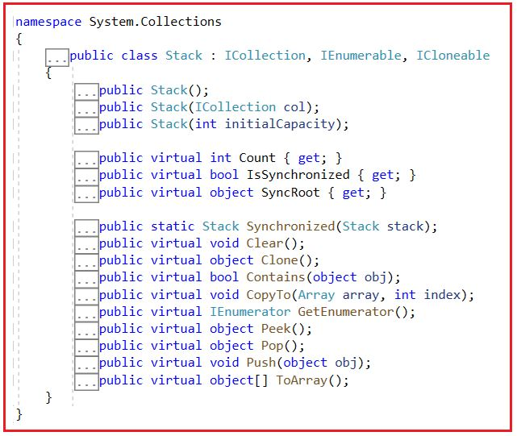
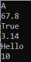
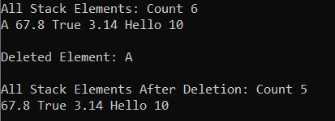
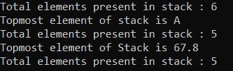
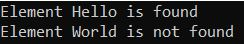
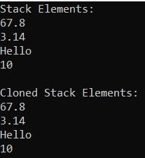
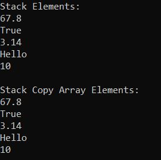

## **کلاس مجموعه پشته غیر ژنریک در سی شارپ به همراه مثال**

در این مقاله، قصد دارم **کلاس مجموعه پشته غیر ژنریک در سی شارپ را** با مثال‌هایی مورد بحث قرار دهم. لطفاً قبل از ادامه این مقاله، مقاله قبلی ما را که در آن کلاس مجموعه Hashtable در سی شارپ را با مثال‌هایی مورد بحث قرار دادیم، مطالعه کنید. کلاس مجموعه پشته در سی شارپ، مجموعه‌ای از اشیاء با روش LIFO (آخرین ورودی، اولین خروجی) را نشان می‌دهد. این بدان معناست که زمانی که به دسترسی آخرین ورودی، اولین خروجی به آیتم‌های یک مجموعه نیاز داریم، از آن استفاده می‌شود. کلاس مجموعه پشته غیر ژنریک در سی شارپ متعلق به فضای نام System.Collections است. در پایان این مقاله، نکات زیر را خواهید فهمید.

1. **پشته (Stack) در سی شارپ چیست و چگونه کار می‌کند؟**
2. **متدها، ویژگی‌ها و سازنده کلاس Stack در سی شارپ**
3. **چگونه یک مجموعه پشته (Stack Collection) در سی شارپ ایجاد کنیم؟**
4. **چگونه عناصر را در سی شارپ به یک پشته (Stack) اضافه کنیم؟**
5. **چگونه عناصر را از یک پشته در سی شارپ حذف کنیم؟**
6. **چگونه بالاترین عنصر یک پشته (Stack) را در سی شارپ (C#) بدست آوریم؟**
7. **چگونه در سی شارپ بررسی کنیم که آیا یک عنصر در پشته وجود دارد یا خیر؟**
8. **چگونه مجموعه پشته غیر ژنریک را در سی شارپ کلون کنیم؟**
9. **چگونه یک پشته را در یک آرایه موجود در C# کپی کنیم؟**
10. **چه زمانی از مجموعه پشته (Stack Collection) در برنامه‌های بلادرنگ (Real-time) در سی شارپ استفاده کنیم؟**

##### **پشته (Stack) در سی شارپ چیست و چگونه کار می‌کند؟**

Stack در سی شارپ یک کلاس مجموعه غیر ژنریک است که با اصل LIFO (آخرین ورودی، اولین خروجی) کار می‌کند. بنابراین، وقتی می‌خواهیم **به آیتم‌های یک مجموعه به صورت Last-In-First-Out** دسترسی داشته باشیم، باید از کلاس مجموعه Stack در سی شارپ استفاده کنیم. این بدان معناست که آیتمی که آخرین بار به مجموعه اضافه می‌شود، اولین آیتمی خواهد بود که از مجموعه حذف می‌شود.

وقتی یک آیتم را به مجموعه پشته اضافه می‌کنیم، به آن اضافه کردن آیتم (push) می‌گویند. به طور مشابه، وقتی یک آیتم را از پشته حذف می‌کنیم، به آن حذف آیتم (popping) می‌گویند.

برای درک جمع‌آوری پشته، ابتدا باید اصل LIFO را درک کنیم، زیرا پشته بر اساس اصل LIFO کار می‌کند. بیایید سعی کنیم اصل LIFO را با یک مثال درک کنیم. تصور کنید که یک پشته از کتاب‌ها داریم که هر کتاب روی دیگری اضافه می‌شود. آخرین کتابی که به پشته اضافه می‌شود، اولین کتابی است که از پشته حذف می‌شود. حذف یک کتاب از وسط پشته امکان‌پذیر نیست. برای درک بهتر، لطفاً به تصویر زیر نگاهی بیندازید.

 در سی شارپ چیست و چگونه کار می‌کند؟")

در سی شارپ، مجموعه پشته غیر ژنریک نیز به همین روش کار می‌کند. عناصر به پشته، روی یکدیگر اضافه می‌شوند. وقتی یک آیتم را به پشته اضافه می‌کنیم، به آن push کردن یک آیتم گفته می‌شود. فرآیند اضافه کردن یک عنصر به پشته، عملیات Push نامیده می‌شود. به طور مشابه، وقتی یک آیتم را از پشته حذف می‌کنیم، به آن pop کردن یک آیتم گفته می‌شود. این عملیات به عنوان Pop شناخته می‌شود. برای درک بهتر، لطفاً به تصویر زیر نگاهی بیندازید.

 در سی شارپ چیست و چگونه کار می‌کند؟")

**نکته:** پشته به عنوان هر دو نوع مجموعه عمومی و غیر عمومی تعریف می‌شود. پشته عمومی تعریف شده است در فضای نام System.Collections.Generic در حالی که پشته غیر عمومی در فضای نام System.Collections تعریف شده است . در این مقاله، ما در مورد کلاس مجموعه پشته غیر عمومی در C# با مثال بحث خواهیم کرد.

##### **متدها، ویژگی‌ها و سازنده کلاس Stack در سی شارپ:**

اگر به تعریف کلاس Non-Generic Stack Collection در سی شارپ بروید، امضای زیر را مشاهده خواهید کرد. همانطور که مشاهده می‌کنید، کلاس Non-Generic Stack رابط‌های IEnumerable، ICollection و ICloneable را پیاده‌سازی می‌کند.



##### **چگونه یک مجموعه پشته غیر ژنریک در سی شارپ ایجاد کنیم؟**

کلاس Stack که یک مجموعه غیر ژنریک است در سی شارپ سه سازنده دارد که می‌توانیم از آنها برای ایجاد یک پشته استفاده کنیم. سازنده‌ها به شرح زیر هستند:

1. **Stack():** برای مقداردهی اولیه یک نمونه جدید از کلاس Stack که خالی است و ظرفیت اولیه پیش‌فرض را دارد، استفاده می‌شود.
2. **Stack(ICollection col):** برای مقداردهی اولیه یک نمونه جدید از کلاس Stack غیر ژنریک استفاده می‌شود که شامل عناصر کپی شده از مجموعه مشخص شده است و ظرفیت اولیه آن با تعداد عناصر کپی شده یکسان است. در اینجا، پارامترهای col، System.Collections.ICollection را برای کپی کردن عناصر از آن مشخص می‌کنند.
3. **Stack(int initialCapacity):** برای مقداردهی اولیه یک نمونه جدید از کلاس System.Collections.Stack که خالی است و ظرفیت اولیه مشخص شده یا ظرفیت اولیه پیش‌فرض را دارد، هر کدام که بیشتر باشد، استفاده می‌شود. در اینجا، پارامتر initialCapacity تعداد اولیه عناصری را که Stack می‌تواند در خود جای دهد، مشخص می‌کند.

بیایید ببینیم چگونه می‌توان با استفاده از سازنده‌ی Stack() یک پشته ایجاد کرد:  
**مرحله ۱:**  
از آنجایی که کلاس Stack متعلق به فضای نام System.Collections است، بنابراین ابتدا باید فضای نام System.Collections را با کمک کلمه کلیدی "using" به صورت زیر در برنامه خود وارد کنیم:  
**با استفاده از System.Collections؛**

**مرحله ۲:**  
در مرحله بعد، باید با استفاده از سازنده Stack() به صورت زیر یک نمونه از کلاس Stack Collection ایجاد کنیم:  
**پشته پشته = پشته جدید();**

##### **چگونه عناصر را به یک مجموعه پشته در سی شارپ اضافه کنیم؟**

اگر می‌خواهید عناصری را به یک پشته (Stack) اضافه کنید، باید از متد Push() از کلاس Stack استفاده کنید.  
**Push(object obj):** از متد push() برای درج یک شیء در بالای پشته (Stack) استفاده می‌شود. در اینجا، پارامتر obj شیء مورد نظر برای درج در پشته را مشخص می‌کند. مقدار آن می‌تواند null باشد.

##### **مثالی برای درک نحوه ایجاد پشته و اضافه کردن عناصر در سی شارپ:**

برای درک بهتر نحوه ایجاد یک پشته و نحوه اضافه کردن عناصر به یک پشته در سی شارپ، لطفاً به مثال زیر نگاهی بیندازید.

```csharp
using System;
using System.Collections;

namespace StackCollectionDemo
{
    class Program
    {
        static void Main(string[] args)
        {
            // Creating a stack collection
             Stack stack = new Stack();

            //Adding item to the stack using the push method
            stack.Push(10);
            stack.Push("Hello");
            stack.Push(3.14f);
            stack.Push(true);
            stack.Push(67.8);
            stack.Push('A');

            //Printing the stack items using foreach loop
            foreach (object item in stack)
            {
                Console.WriteLine(item);
            }

            Console.ReadKey();
        }
    }
}
```

###### **خروجی:**



##### **چگونه عناصر را از یک مجموعه پشته غیر ژنریک در سی شارپ حذف کنیم؟**

در Stack، شما مجاز به حذف عناصر از بالای stack هستید. کلاس Stack در C# دو روش مختلف برای حذف عناصر ارائه می‌دهد. آنها به شرح زیر هستند:

1. **Pop():** این متد برای حذف و بازگرداندن شیء در بالای پشته استفاده می‌شود. این متد شیء (عنصر) حذف شده از بالای پشته را برمی‌گرداند.
2. **Clear() :** این متد برای حذف تمام اشیاء از Stack استفاده می‌شود.

بیایید یک مثال برای درک متد Pop و Clear از Stack در C# ببینیم. لطفاً به مثال زیر نگاهی بیندازید.

```csharp
using System;
using System.Collections;

namespace StackCollectionDemo
{
    class Program
    {
        static void Main(string[] args)
        {
            // Creating a stack collection
             Stack stack = new Stack();

            //Adding item to the stack using the push method
            stack.Push(10);
            stack.Push("Hello");
            stack.Push(3.14f);
            stack.Push(true);
            stack.Push(67.8);
            stack.Push('A');

            //Printing the stack items using foreach loop
            Console.WriteLine($"All Stack Elements: Count {stack.Count}");
            foreach (var item in stack)
            {
                Console.Write($"{item} ");
            }

            //Removing and Returning an item from the stack using the pop method
            Console.WriteLine($"\n\nDeleted Element: {stack.Pop()}");
            //Printing item after removing the last added item
            Console.WriteLine($"\nAll Stack Elements After Deletion: Count {stack.Count}");
            foreach (var item in stack)
            {
                Console.Write($"{item} ");
            }

            Console.ReadKey();
        }
    }
}
```

###### **خروجی:**



##### **چگونه بالاترین عنصر یک پشته (Stack) را در سی شارپ (C#) بدست آوریم؟**

کلاس Stack در سی شارپ دو متد زیر را برای دریافت بالاترین عنصر Stack ارائه می‌دهد.

1. **Pop():** این متد برای حذف و بازگرداندن شیء در بالای پشته استفاده می‌شود. این متد شیء (عنصر) حذف شده از بالای پشته را برمی‌گرداند. اگر هیچ شیء (یا عنصری) در پشته وجود نداشته باشد و اگر سعی دارید یک آیتم یا شیء را با استفاده از متد pop() از پشته حذف کنید، آنگاه یک استثنا به نام **System.InvalidOperationException ایجاد می‌شود.**
2. **Peek():** متد peek() برای برگرداندن شیء از بالای پشته بدون حذف آن استفاده می‌شود. اگر هیچ شیء (یا عنصری) در پشته وجود نداشته باشد و اگر سعی دارید با استفاده از متد peek() یک آیتم (شیء) را از پشته برگردانید، در این صورت یک استثنا ایجاد می‌شود، یعنی **System.InvalidOperationException.**

برای درک بهتر، لطفاً به مثال زیر نگاهی بیندازید که نحوه دریافت بالاترین عنصر از پشته را نشان می‌دهد.

```csharp
using System;
using System.Collections;

namespace StackCollectionDemo
{
    class Program
    {
        static void Main(string[] args)
        {
            // Creating a stack collection
             Stack stack = new Stack();

            //Adding item to the stack using the push method
            stack.Push(10);
            stack.Push("Hello");
            stack.Push(3.14f);
            stack.Push(true);
            stack.Push(67.8);
            stack.Push('A');

            Console.WriteLine($"Total elements present in stack : {stack.Count}");

            // Fetch the topmost element of stack Using Pop method
            Console.WriteLine($"Topmost element of stack is {stack.Pop()}");

            Console.WriteLine($"Total elements present in stack : {stack.Count}");

            // Fetch the topmost element from Stacj Using Peek method
            Console.WriteLine($"Topmost element of Stack is {stack.Peek()}");

            Console.WriteLine($"Total elements present in stack : {stack.Count}");

            Console.ReadKey();
        }
    }
}
```

###### **خروجی:**



**نکته:** اگر می‌خواهید عنصر بالایی را از پشته حذف کرده و برگردانید، از متد Pop استفاده کنید و اگر فقط می‌خواهید عنصر بالایی را از پشته بدون حذف آن برگردانید، باید از متد Peek استفاده کنید و این تنها تفاوت بین این دو متد از کلاس Stack در C# است.

##### **چگونه در سی شارپ بررسی کنیم که آیا یک عنصر در پشته وجود دارد یا خیر؟**

اگر می‌خواهید بررسی کنید که آیا یک عنصر در پشته وجود دارد یا خیر، باید از متد Contains() از کلاس Stack استفاده کنید. همچنین می‌توانید از این متد برای جستجوی یک عنصر در پشته داده شده استفاده کنید.

1. **Contains(object obj):** این متد برای تعیین وجود یک عنصر در Stack استفاده می‌شود. در اینجا، پارامتر obj شیء یا عنصری را که باید در Stack قرار گیرد، مشخص می‌کند. مقدار می‌تواند null باشد. اگر obj در Stack یافت شود، مقدار true و در غیر این صورت، مقدار false را برمی‌گرداند.

بگذارید این موضوع را با یک مثال درک کنیم. مثال زیر نحوه استفاده از متد Contains() از کلاس Stack مجموعه غیر ژنریک در C# را نشان می‌دهد.

```csharp
using System;
using System.Collections;

namespace StackCollectionDemo
{
    class Program
    {
        static void Main(string[] args)
        {
            // Creating a stack collection
             Stack stack = new Stack();

            //Adding item to the stack using the push method
            stack.Push(10);
            stack.Push("Hello");
            stack.Push(3.14f);
            stack.Push(true);
            stack.Push(67.8);
            stack.Push('A');

            // Checking if the element Hello is present in the Stack or not
            if (stack.Contains("Hello"))
            {
                Console.WriteLine("Element Hello is found");
            }
            else
            {
                Console.WriteLine("Element Hello is not found");
            }

            // Checking if the element Hello is present in the Stack or not
            if (stack.Contains("World"))
            {
                Console.WriteLine("Element World is found");
            }
            else
            {
                Console.WriteLine("Element World is not found");
            }

            Console.ReadKey();
        }
    }
}
```

###### **خروجی:**



**نکته:** متد Contains(object obj) از کلاس Stack زمان O(n) را برای بررسی وجود عنصر در پشته صرف می‌کند. این نکته باید هنگام استفاده از این متد در نظر گرفته شود.

##### **چگونه مجموعه پشته غیر ژنریک را در سی شارپ کلون کنیم؟**

اگر می‌خواهید مجموعه‌ی Stack غیر ژنریک را در C# کپی کنید، باید از متد Clone() زیر که توسط کلاس Stack Collection ارائه شده است، استفاده کنید.

1. **Clone():** این متد برای ایجاد و بازگرداندن یک کپی سطحی از یک شیء پشته استفاده می‌شود.

برای درک بهتر، لطفاً به مثال زیر توجه کنید.

```csharp
using System;
using System.Collections;

namespace StackCollectionDemo
{
    class Program
    {
        static void Main(string[] args)
        {
            // Creating a stack collection
            Stack stack = new Stack();

            //Adding item to the stack using the push method
            stack.Push(10);
            stack.Push("Hello");
            stack.Push(3.14f);
            stack.Push(67.8);

            //Printing All Stack Elements using For Each Loop
            Console.WriteLine("Stack Elements:");
            foreach (var item in stack)
            {
                Console.WriteLine(item);
            }

            //Creating a clone queue using Clone method
            Stack cloneStack = (Stack)stack.Clone();
            Console.WriteLine("\nCloned Stack Elements:");
            foreach (var item in cloneStack)
            {
                Console.WriteLine(item);
            }

            Console.ReadKey();
        }
    }
}
```

###### **خروجی:**



##### **چگونه یک پشته را در یک آرایه موجود در C# کپی کنیم؟**

برای کپی کردن یک پشته به یک آرایه موجود در سی شارپ، باید از متد CopyTo زیر از کلاس Non-Generic Stack Collection استفاده کنیم.

1. **CopyTo(Array array, int index)** : این متد برای کپی کردن عناصر Stack به یک آرایه تک بعدی موجود، با شروع از اندیس آرایه مشخص شده، استفاده می‌شود. در اینجا، پارامتر array، آرایه تک بعدی را که مقصد عناصر کپی شده از stack است، مشخص می‌کند. آرایه باید دارای اندیس گذاری مبتنی بر صفر باشد. پارامتر index، اندیس مبتنی بر صفر را در آرایه‌ای که کپی از آن شروع می‌شود، مشخص می‌کند. اگر پارامتر array تهی باشد، خطای ArgumentNullException رخ می‌دهد. اگر پارامتر index کمتر از صفر باشد، خطای ArgumentOutOfRangeException رخ می‌دهد.

این روش روی آرایه‌های یک بعدی کار می‌کند و وضعیت پشته را تغییر نمی‌دهد. عناصر در آرایه به همان ترتیبی که از ابتدای پشته تا انتهای آن مرتب شده‌اند، مرتب می‌شوند. برای درک بهتر، مثالی را بررسی می‌کنیم.

```csharp
using System;
using System.Collections;

namespace StackCollectionDemo
{
    class Program
    {
        static void Main(string[] args)
        {
            // Creating a stack collection
            Stack stack = new Stack();

            //Adding item to the stack using the push method
            stack.Push(10);
            stack.Push("Hello");
            stack.Push(3.14f);
            stack.Push(true);
            stack.Push(67.8);

            //Printing All Queue Elements using For Each Loop
            Console.WriteLine("Stack Elements:");
            foreach (var item in stack)
            {
                Console.WriteLine(item);
            }
            //Copying the queue to an object array
            object[] stackCopy = new object[5];
            stack.CopyTo(stackCopy, 0);
            Console.WriteLine("\nStack Copy Array Elements:");
            foreach (var item in stackCopy)
            {
                Console.WriteLine(item);
            }

            Console.ReadKey();
        }
    }
}
```

###### **خروجی:**



##### **ویژگی‌های کلاس مجموعه پشته غیر ژنریک در سی شارپ**

1. **تعداد** : تعداد عناصر موجود در پشته را برمی‌گرداند.
2. **IsSynchronized** : مقداری را دریافت می‌کند که نشان می‌دهد آیا دسترسی به پشته همگام‌سازی شده است (thread-safe). اگر دسترسی به پشته همگام‌سازی شده باشد (thread-safe)، مقدار true را برمی‌گرداند؛ در غیر این صورت، مقدار false. مقدار پیش‌فرض false است.
3. **SyncRoot** : شیء‌ای را دریافت می‌کند که می‌تواند برای همگام‌سازی دسترسی به Stack استفاده شود. شیء‌ای را برمی‌گرداند که می‌تواند برای همگام‌سازی دسترسی به Stack استفاده شود.

##### **ویژگی‌های کلاس مجموعه پشته غیر ژنریک در سی شارپ:**

1. ظرفیت یک پشته (Stack) تعداد عناصری است که پشته می‌تواند در خود جای دهد. با اضافه کردن عناصر به یک پشته، ظرفیت پشته به طور خودکار افزایش می‌یابد.
2. اگر تعداد (Count) کمتر از ظرفیت پشته باشد، عملیات Push یک عملیات O(1) است. اگر برای جای دادن عنصر جدید نیاز به افزایش ظرفیت باشد، Push به یک عملیات O(n) تبدیل می‌شود، که در آن n تعداد (Count) است. Pop یک عملیات O(1) است.
3. مجموعه پشته (Stack Collection) در سی شارپ (C#) هم مقادیر تهی (null) و هم مقادیر تکراری (duplicate) را مجاز می‌داند.

##### **خلاصه**

نکات مهمی که هنگام کار با Stack در سی شارپ باید به خاطر داشته باشید، در ادامه آمده است.

1. در سی شارپ، از پشته‌ها برای ذخیره مجموعه‌ای از اشیاء به سبک LIFO (آخرین ورودی، اولین خروجی) استفاده می‌شود، یعنی عنصری که آخر از همه اضافه شده، اول از همه خارج می‌شود.
2. با استفاده از متد Push()، می‌توانیم عناصر را به یک پشته (stack) اضافه کنیم.
3. متد Pop() بالاترین عنصر را از پشته حذف کرده و برمی‌گرداند.
4. متد Peek() آخرین عنصر درج شده (بالاترین) در پشته را برمی‌گرداند و عنصر را از پشته حذف نمی‌کند.
