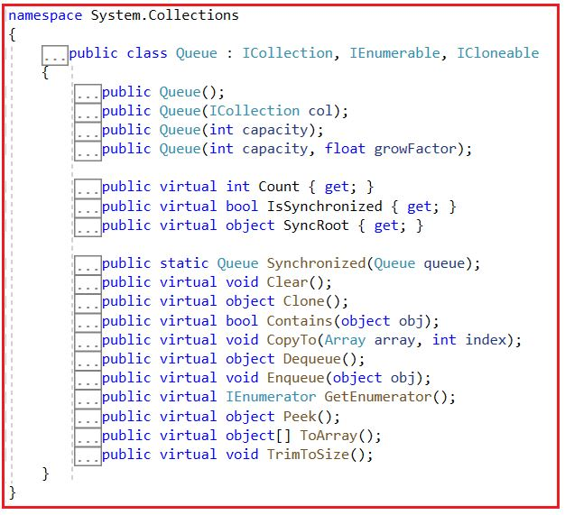
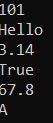
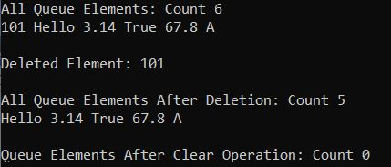
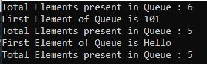
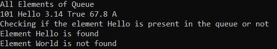
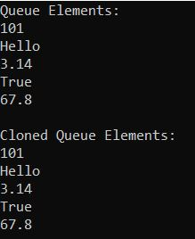
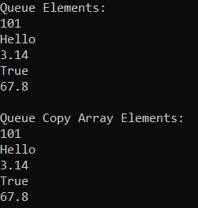

## **کلاس مجموعه صف غیر ژنریک در سی شارپ به همراه مثال**

در این مقاله، قصد دارم **کلاس مجموعه صف غیر ژنریک (Non-Generic Queue Collection Class) در سی شارپ را** با مثال‌هایی مورد بحث قرار دهم. لطفاً مقاله قبلی ما را که در آن کلاس مجموعه پشته غیر ژنریک (Non-Generic Stack Collection Class) در سی شارپ را با مثال‌هایی مورد بحث قرار دادیم، مطالعه کنید. کلاس مجموعه صف غیر ژنریک (Non-Generic Queue Collection Class) در سی شارپ، مجموعه‌ای از اشیاء را نشان می‌دهد که بر اساس اولویت ورودی، اولویت خروجی مرتب شده‌اند. این بدان معناست که وقتی به دسترسی بر اساس اولویت ورودی، اولویت خروجی به آیتم‌های یک مجموعه نیاز داریم، باید از این مجموعه استفاده کنیم. کلاس مجموعه صف (Queue Collection Class) متعلق به فضای نام System.Collections است. در پایان این مقاله، نکات زیر را خواهید فهمید.

1. **صف (Queue) در سی شارپ چیست؟**
2. **متدها، ویژگی‌ها و سازنده کلاس مجموعه صف غیر ژنریک در سی شارپ**
3. **چگونه در سی شارپ صف (queue) ایجاد کنیم؟**
4. **چگونه عناصر را در C# به صف اضافه کنیم؟**
5. **چگونه عناصر را از صف در سی شارپ حذف کنیم؟**
6. **چگونه اولین عنصر صف را در C# دریافت کنیم؟**
7. **چگونه بررسی کنیم که آیا یک عنصر در صف (Queue) در سی شارپ وجود دارد یا خیر؟**
8. **چگونه مجموعه صف غیر ژنریک را در سی شارپ کلون کنیم؟**
9. **چگونه یک صف را در یک آرایه موجود در سی شارپ کپی کنیم؟**

##### **صف چیست و مجموعه صف در سی شارپ چگونه کار می‌کند؟**

کلاس مجموعه صف غیر ژنریک در سی شارپ بر اساس اصل FIFO (اولین ورودی-اولین خروجی) کار می‌کند. بنابراین، وقتی به دسترسی به آیتم‌های یک مجموعه با اولویت ورودی-اولین خروجی نیاز داریم، باید از کلاس مجموعه صف غیر ژنریک در سی شارپ استفاده کنیم. این بدان معناست که آیتمی که ابتدا اضافه می‌شود، ابتدا از مجموعه حذف می‌شود. وقتی یک آیتم را به صف اضافه می‌کنیم، به آن صف‌بندی (enqueuing) می‌گویند. به طور مشابه، وقتی یک آیتم را از صف حذف می‌کنیم، به آن صف‌زدایی (dequeuing) می‌گویند.

برای درک جمع‌آوری صف، ابتدا باید اصل FIFO را درک کنیم، زیرا صف بر اساس اصل FIFO کار می‌کند. بیایید اصل FIFO را با یک مثال درک کنیم. صفی از افراد را تصور کنید که منتظر بلیط در یک سالن سینما هستند. معمولاً اولین کسی که وارد صف می‌شود، اولین کسی است که بلیط را از پیشخوان دریافت می‌کند. به طور مشابه، آخرین کسی که وارد صف می‌شود، آخرین کسی است که بلیط را از پیشخوان دریافت می‌کند. برای درک بهتر، لطفاً به تصویر زیر نگاهی بیندازید.


در سی شارپ، مجموعه صف غیر ژنریک نیز به همین روش کار می‌کند. عناصر به صورت ترتیبی به صف اضافه می‌شوند. وقتی یک آیتم را به صف اضافه می‌کنیم، به آن Enqueue کردن یک آیتم گفته می‌شود. فرآیند اضافه کردن یک عنصر به صف، عملیات Enqueue کردن نامیده می‌شود. به طور مشابه، وقتی یک آیتم را از صف حذف می‌کنیم، به آن Dequeu کردن یک آیتم گفته می‌شود. این عملیات به عنوان Dequeue شناخته می‌شود. برای درک بهتر، لطفاً به تصویر زیر نگاهی بیندازید.


**نکته:** صف (queue) در سی شارپ به عنوان هر دو نوع مجموعه (Collections) عمومی (Generic) و غیر عمومی (Non-Generic) تعریف می‌شود. مجموعه صف عمومی (Generic Queue Collection) در فضای نام System.Collections.Generic تعریف شده است، در حالی که مجموعه صف غیر عمومی (Non-Generic Queue Collection) در فضای نام System.Collections تعریف شده است. در این مقاله، ما به همراه مثال‌هایی، کلاس مجموعه صف غیر عمومی (Non-Generic Queue Collection) را در سی شارپ مورد بحث قرار خواهیم داد.

##### **ویژگی‌های کلاس مجموعه صف غیر ژنریک در سی شارپ:**

1. متد Enqueue یک عنصر را به انتهای صف (Queue) اضافه می‌کند.
2. متد Dequeue قدیمی‌ترین عنصر را از ابتدای صف حذف می‌کند.
3. متد Peek قدیمی‌ترین عنصری را که در ابتدای صف قرار دارد برمی‌گرداند اما آن را از صف حذف نمی‌کند.
4. ظرفیت یک صف، تعداد عناصری است که صف می‌تواند در خود جای دهد. با اضافه کردن عناصر به یک صف، ظرفیت صف به طور خودکار افزایش می‌یابد.
5. مجموعه صف غیر ژنریک، مقادیر تهی و تکراری را مجاز می‌داند.

##### **متدها، ویژگی‌ها و سازنده کلاس مجموعه صف غیر ژنریک در سی شارپ:**

اگر به تعریف کلاس Queue Collection در سی شارپ بروید، امضای زیر را مشاهده خواهید کرد. در اینجا، می‌توانید ببینید که کلاس Non-Generic Queue Collection رابط‌های IEnumerable، ICollection و ICloneable را پیاده‌سازی می‌کند.



##### **چگونه در سی شارپ صف (Queue) ایجاد کنیم؟**

کلاس مجموعه غیر ژنریک Queue در سی شارپ، چهار سازنده ارائه می‌دهد که می‌توانیم از آنها برای ایجاد یک صف استفاده کنیم. سازنده‌ها به شرح زیر هستند:

1. **Queue():** برای مقداردهی اولیه یک نمونه جدید از کلاس Queue که خالی است و ظرفیت اولیه پیش‌فرض را دارد، استفاده می‌شود و از ضریب رشد پیش‌فرض استفاده می‌کند.
2. **Queue(ICollection col):** برای مقداردهی اولیه یک نمونه جدید از کلاس Queue که شامل عناصر کپی شده از مجموعه مشخص شده است و ظرفیت اولیه آن برابر با تعداد عناصر کپی شده است و از ضریب رشد پیش‌فرض استفاده می‌کند، استفاده می‌شود. در اینجا، پارامترهای col، System.Collections.ICollection را برای کپی کردن عناصر از آن مشخص می‌کنند.
3. **Queue(int capacity):** برای مقداردهی اولیه یک نمونه جدید از کلاس Queue که خالی است، ظرفیت اولیه مشخص شده را دارد و از ضریب رشد پیش‌فرض استفاده می‌کند، استفاده می‌شود. در اینجا، پارامتر capacity تعداد اولیه عناصری را که Queue می‌تواند در خود جای دهد، مشخص می‌کند.
4. **Queue(int capacity, float growFactor):** برای مقداردهی اولیه یک نمونه جدید از کلاس Queue که خالی است، ظرفیت اولیه مشخصی دارد و از ضریب رشد مشخصی استفاده می‌کند، استفاده می‌شود. در اینجا، پارامتر capacity تعداد اولیه عناصری را که Queue می‌تواند در خود جای دهد مشخص می‌کند و پارامتر growFactor ضریبی را که ظرفیت Queue توسط آن افزایش می‌یابد، مشخص می‌کند.

بیایید ببینیم چگونه می‌توان با استفاده از سازنده‌ی Queue() در سی‌شارپ، یک صف ایجاد کرد:  
**مرحله ۱:**  
از آنجایی که کلاس مجموعه Queue متعلق به **فضای نام System.Collections** است ، بنابراین ابتدا باید فضای نام System.Collections را با کمک کلمه کلیدی “using” به صورت زیر در برنامه خود وارد کنیم:  
**با استفاده از System.Collections؛**

**مرحله ۲:**  
در مرحله بعد، باید با استفاده از سازنده Queue() به صورت زیر یک نمونه از کلاس Queue ایجاد کنیم:  
**صف queue = new Queue(); (صف جدید)**

##### **چگونه عناصر را در C# به صف اضافه کنیم؟**

اگر بخواهیم عناصری را به یک صف اضافه کنیم، باید از متد Enqueue() از کلاس Queue استفاده کنیم.

1. **Enqueue(object obj):** این متد برای اضافه کردن یک شیء به انتهای صف استفاده می‌شود. در اینجا، پارامتر obj شیء مورد نظر برای اضافه شدن به صف را مشخص می‌کند. مقدار آن می‌تواند null باشد.

##### **مثالی برای درک نحوه ایجاد صف و افزودن عناصر در سی شارپ:**

برای درک بهتر نحوه ایجاد صف و نحوه اضافه کردن عناصر به صف در سی شارپ، لطفاً به مثال زیر نگاهی بیندازید.

```csharp
using System;
using System.Collections;

namespace QueueCollectionDemo
{
    class Program
    {
        static void Main(string[] args)
        {
            //Creating a queue collection
            Queue queue = new Queue();

            //Adding item to the queue using the Enqueue method
            queue.Enqueue(101);
            queue.Enqueue("Hello");
            queue.Enqueue(3.14f);
            queue.Enqueue(true);
            queue.Enqueue(67.8);
            queue.Enqueue('A');

            //Printing the queue items using foreach loop
            foreach (var item in queue)
            {
                Console.WriteLine(item);
            }
            
            Console.ReadKey();
        }
    }
}
```

###### **خروجی:**



##### **چگونه عناصر را از مجموعه صف در سی شارپ حذف کنیم؟**

در صف (Queue)، شما مجاز به حذف عناصر از ابتدای صف هستید. اگر می‌خواهید عناصر را از صف حذف کنید، باید از دو روش زیر که توسط کلاس Non-Generic Collection Queue ارائه شده است، استفاده کنید.

1. **Dequeue():** این متد برای حذف و بازگرداندن شیء در ابتدای صف استفاده می‌شود. این متد شیء حذف شده از ابتدای صف را برمی‌گرداند.
2. **Clear():** این متد برای حذف تمام اشیاء از صف استفاده می‌شود.

بیایید مثالی برای درک متدهای Dequeue() و Clear() از کلاس Queue Collection در سی شارپ ببینیم. لطفاً به مثال زیر که نحوه استفاده از متدهای Dequeue و Clear را نشان می‌دهد، نگاهی بیندازید.

```csharp
using System;
using System.Collections;

namespace QueueCollectionDemo
{
    class Program
    {
        static void Main(string[] args)
        {
            //Creating a queue collection
            Queue queue = new Queue();

            //Adding item to the queue using the Enqueue method
            queue.Enqueue(101);
            queue.Enqueue("Hello");
            queue.Enqueue(3.14f);
            queue.Enqueue(true);
            queue.Enqueue(67.8);
            queue.Enqueue('A');

            //Printing the queue items using foreach loop
            Console.WriteLine($"All Queue Elements: Count {queue.Count}");
            foreach (var item in queue)
            {
                Console.Write($"{item} ");
            }

            //Removing and Returning an item from the queue using the Dequeue method
            Console.WriteLine($"\n\nDeleted Element: {queue.Dequeue()}");

            //Printing item after removing the first added item
            Console.WriteLine($"\nAll Queue Elements After Deletion: Count {queue.Count}");
            foreach (var item in queue)
            {
                Console.Write($"{item} ");
            }

            //Printing Items After Clearing the Queue
            queue.Clear();
            Console.WriteLine($"\n\nQueue Elements After Clear Operation: Count {queue.Count}");
            foreach (var item in queue)
            {
                Console.Write($"{item} ");
            }
            Console.ReadKey();
        }
    }
}
```

###### **خروجی:**



##### **چگونه اولین عنصر مجموعه صف را در سی شارپ دریافت کنیم؟**

کلاس Non-Generic Queue Collection در سی شارپ دو متد زیر را برای دریافت اولین عنصر از مجموعه صف ارائه می‌دهد.

1. **Dequeue():** متد Dequeue() از کلاس Queue برای حذف و بازگرداندن شیء از ابتدای صف استفاده می‌شود. اگر هیچ شیء (یا عنصری) در صف وجود نداشته باشد و اگر سعی کنیم یک آیتم یا شیء را با استفاده از متد pop() از صف حذف کنیم، در این صورت یک استثنا به نام **System.InvalidOperationException ایجاد می‌شود.**
2. **Peek():** متد peek() از کلاس Queue برای برگرداندن قدیمی‌ترین شیء، یعنی شیء موجود در ابتدای صف، بدون حذف آن استفاده می‌شود. اگر هیچ شیء (یا عنصری) در صف وجود نداشته باشد و اگر سعی کنیم یک آیتم (شی) را از صف با استفاده از متد peek() برگردانیم، آنگاه یک استثنا به نام **System.InvalidOperationException ایجاد می‌شود.**

برای درک بهتر، لطفاً به مثال زیر نگاهی بیندازید که نحوه دریافت اولین عنصر از صف را با استفاده از هر دو روش Dequeue و Peek نشان می‌دهد.

```csharp
using System;
using System.Collections;

namespace QueueCollectionDemo
{
    class Program
    {
        static void Main(string[] args)
        {
            // Creating a Queue collection
            Queue queue = new Queue();

            //Adding item to the queue using the Enqueue method
            queue.Enqueue(101);
            queue.Enqueue("Hello");
            queue.Enqueue(3.14f);
            queue.Enqueue(true);
            queue.Enqueue(67.8);
            queue.Enqueue('A');

            Console.WriteLine($"Total Elements present in Queue : {queue.Count}");

            // Fetch First Element of Queue Using Dequeue method
            Console.WriteLine($"First Element of Queue is {queue.Dequeue()}");
            Console.WriteLine($"Total Elements present in Queue : {queue.Count}");

            // Fetch the topmost element from Queue Using Peek method
            Console.WriteLine($"First Element of Queue is {queue.Peek()}");
            Console.WriteLine($"Total Elements present in Queue : {queue.Count}");
            Console.ReadKey();
        }
    }
}
```

###### **خروجی:**



**نکته:** اگر می‌خواهید عنصر اول را از صف حذف کرده و برگردانید، از متد Dequeue استفاده کنید و اگر فقط می‌خواهید عنصر اول را از صف بدون حذف آن برگردانید، از متد Peek استفاده کنید و این تنها تفاوت بین این دو متد از کلاس Queue Collection در سی شارپ است.

##### **چگونه بررسی کنیم که آیا یک عنصر در مجموعه صف در سی شارپ وجود دارد یا خیر؟**

اگر می‌خواهید بررسی کنید که آیا یک عنصر در مجموعه صف وجود دارد یا خیر، باید از متد Contains() از کلاس مجموعه صف در سی شارپ استفاده کنید. همچنین می‌توانید از این متد Contains() برای جستجوی یک عنصر در صف داده شده استفاده کنید.

1. **Contains(object obj):** این متد برای تعیین وجود یک عنصر در صف استفاده می‌شود. در اینجا، پارامتر obj شیء یا عنصری را که باید در صف قرار گیرد، مشخص می‌کند. مقدار می‌تواند null باشد. اگر obj در صف یافت شود، مقدار true و در غیر این صورت، مقدار false را برمی‌گرداند.

بگذارید این موضوع را با یک مثال درک کنیم. مثال زیر نحوه استفاده از متد Contains() از کلاس Queue در سی شارپ را نشان می‌دهد.

```csharp
using System;
using System.Collections;

namespace QueueCollectionDemo
{
    class Program
    {
        static void Main(string[] args)
        {
            // Creating a Queue collection
            Queue queue = new Queue();

            //Adding item to the queue using the Enqueue method
            queue.Enqueue(101);
            queue.Enqueue("Hello");
            queue.Enqueue(3.14f);
            queue.Enqueue(true);
            queue.Enqueue(67.8);
            queue.Enqueue('A');

            Console.WriteLine("All Elements of Queue");
            foreach (var item in queue)
            {
                Console.Write($"{item} ");
            }

            Console.WriteLine("\nChecking if the element Hello is present in the queue or not");
            // Checking if the element Hello is present in the Stack or not

            if (queue.Contains("Hello"))
            {
                Console.WriteLine("Element Hello is found");
            }
            else
            {
                Console.WriteLine("Element Hello is not found");
            }

            if (queue.Contains("World"))
            {
                Console.WriteLine("Element World is found");
            }
            else
            {
                Console.WriteLine("Element World is not found");
            }
            Console.ReadKey();
        }
    }
}
```

###### **خروجی:**



**نکته:** متد Contains(object obj) از کلاس صف مجموعه غیر ژنریک در سی شارپ، زمان O(n) را برای بررسی وجود عنصر در صف صرف می‌کند. این نکته باید هنگام استفاده از این متد در نظر گرفته شود.

##### **چگونه مجموعه صف غیر ژنریک را در سی شارپ کلون کنیم؟**

اگر می‌خواهید مجموعه صف غیر عمومی (Non-Generic Queue collection) را در سی شارپ کپی کنید، باید از متد Clone() زیر که توسط کلاس مجموعه صف (Queue Collection Class) ارائه شده است، استفاده کنید.

1. **Clone() :** این متد برای ایجاد و بازگرداندن یک کپی سطحی از یک شیء Queue استفاده می‌شود.

برای درک بهتر، لطفاً به مثال زیر توجه کنید.

```csharp
using System;
using System.Collections;

namespace QueueCollectionDemo
{
    class Program
    {
        static void Main(string[] args)
        {
            //Creating a queue collection
            Queue queue = new Queue();

            //Adding item to the queue using the Enqueue method
            queue.Enqueue(101);
            queue.Enqueue("Hello");
            queue.Enqueue(3.14f);
            queue.Enqueue(true);
            queue.Enqueue(67.8);

            //Printing All Queue Elements using For Each Loop
            Console.WriteLine("Queue Elements:");
            foreach (var item in queue)
            {
                Console.WriteLine(item);
            }

            //Creating a clone queue using Clone method
            Queue cloneQueue = (Queue)queue.Clone();
            Console.WriteLine("\nCloned Queue Elements:");
            foreach (var item in cloneQueue)
            {
                Console.WriteLine(item);
            }

            Console.ReadKey();
        }
    }
}
```

###### **خروجی:**



##### **چگونه یک صف را در یک آرایه موجود در C# کپی کنیم؟**

برای کپی کردن یک صف به یک آرایه موجود در سی شارپ، باید از متد CopyTo زیر از کلاس Non-Generic Queue Collection استفاده کنیم.

1. **CopyTo(Array array, int index):** متد CopyTo از کلاس Non-Generic Queue Collection در C# برای کپی کردن عناصر System.Collections.Queue به یک System.Array تک بعدی موجود، با شروع از اندیس آرایه مشخص شده، استفاده می‌شود. در اینجا، پارامتر array، آرایه تک بعدی را مشخص می‌کند که مقصد عناصر کپی شده از Queue است. آرایه باید دارای اندیس گذاری مبتنی بر صفر باشد. پارامتر index، اندیس مبتنی بر صفر را در آرایه‌ای که کپی از آن شروع می‌شود، مشخص می‌کند. اگر پارامتر array تهی باشد، خطای ArgumentNullException رخ می‌دهد. اگر پارامتر index کمتر از صفر باشد، خطای ArgumentOutOfRangeException رخ می‌دهد.

این روش روی آرایه‌های یک بعدی کار می‌کند و وضعیت صف را تغییر نمی‌دهد. عناصر در آرایه به همان ترتیبی که عناصر از ابتدای صف تا انتهای آن مرتب شده‌اند، مرتب می‌شوند. برای درک بهتر، مثالی را بررسی می‌کنیم.

```csharp
using System;
using System.Collections;

namespace QueueCollectionDemo
{
    class Program
    {
        static void Main(string[] args)
        {
            //Creating a queue collection
            Queue queue = new Queue();

            //Adding item to the queue using the Enqueue method
            queue.Enqueue(101);
            queue.Enqueue("Hello");
            queue.Enqueue(3.14f);
            queue.Enqueue(true);
            queue.Enqueue(67.8);

            //Printing All Queue Elements using For Each Loop
            Console.WriteLine("Queue Elements:");
            foreach (var item in queue)
            {
                Console.WriteLine(item);
            }

            //Copying the queue to an object array
            object[] queueCopy = new object[5];
            queue.CopyTo(queueCopy, 0);
            Console.WriteLine("\nQueue Copy Array Elements:");
            foreach (var item in queueCopy)
            {
                Console.WriteLine(item);
            }

            Console.ReadKey();
        }
    }
}
```

###### **خروجی:**



##### **ویژگی‌های کلاس صف (queue) در سی شارپ**

1. **تعداد** : تعداد عناصر موجود در صف را برمی‌گرداند.
2. **IsSynchronized** : مقداری دریافت می‌کند که نشان می‌دهد آیا دسترسی به صف همگام‌سازی شده است (thread-safe). اگر دسترسی به صف همگام‌سازی شده باشد (thread-safe)، مقدار true را برمی‌گرداند؛ در غیر این صورت، مقدار false. مقدار پیش‌فرض false است.
3. **SyncRoot** : این تابع یک شیء دریافت می‌کند که می‌تواند برای همگام‌سازی دسترسی به صف استفاده شود. این تابع یک شیء برمی‌گرداند که می‌تواند برای همگام‌سازی دسترسی به صف استفاده شود.

##### **مرور کلی کلاس مجموعه صف غیر ژنریک در سی شارپ**

نکات مهمی که هنگام کار با Queue Collection باید به خاطر داشته باشید، در ادامه آمده است.

1. در سی شارپ، از صف‌ها برای ذخیره مجموعه‌ای از اشیاء به سبک FIFO (اولین ورودی، اولین خروجی) استفاده می‌شود، یعنی عنصری که اول اضافه می‌شود، اول حذف می‌شود.
2. با استفاده از متد Enqueue()، می‌توانیم عناصر را در انتهای صف اضافه کنیم.
3. متد Dequeue() اولین عنصر را از صف حذف کرده و برمی‌گرداند.
4. متد queue Peek() همیشه اولین عنصر صف را برمی‌گرداند و عناصر را از صف حذف نمی‌کند.
