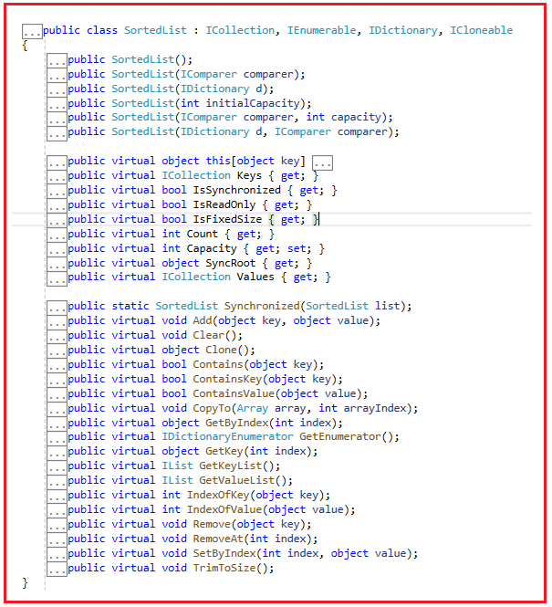
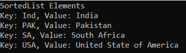
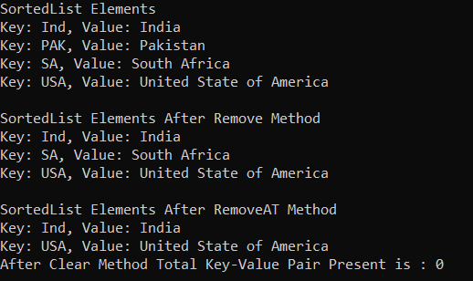
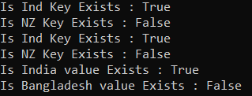
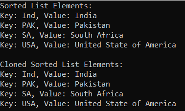
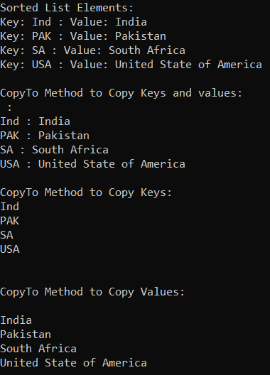

## **کلاس مجموعه لیست مرتب غیر ژنریک در سی شارپ به همراه مثال**

در این مقاله، قصد دارم **کلاس مجموعه Non-Generic SortedList در سی شارپ را** با مثال‌هایی مورد بحث قرار دهم. لطفاً مقاله قبلی ما را که در آن کلاس مجموعه Non-Generic Queue در سی شارپ را با مثال‌هایی مورد بحث قرار دادیم، مطالعه کنید. کلاس Non-Generic SortedList متعلق به **فضای نام System.Collections** است . در پایان این مقاله، اشاره‌گرهای زیر را با مثال‌هایی درک خواهید کرد.

1. **لیست مرتب (SortedList) در سی شارپ چیست؟**
2. **متدها، ویژگی‌ها و سازنده‌ی کلاس مجموعه‌ی لیست مرتب‌شده‌ی غیرعمومی در سی‌شارپ**
3. **چگونه یک لیست مرتب (SortedList) در سی شارپ ایجاد کنیم؟**
4. **چگونه عناصر را به یک SortedList در سی شارپ اضافه کنیم؟**
5. **چگونه در سی شارپ به یک لیست مرتب (SortedList) دسترسی پیدا کنیم؟**
6. **چگونه عناصر را از یک SortedList در سی شارپ حذف کنیم؟**
7. **چگونه در دسترس بودن جفت‌های کلید/مقدار را در یک SortedList در C# بررسی کنیم؟**
8. **چگونه می‌توان SortedList غیر ژنریک را در سی شارپ کلون کرد؟**
9. **کاربرد متد CopyTo از کلاس Non-Generic SortedList Collection در سی شارپ چیست؟**
10. **چه زمانی از مجموعه لیست مرتب شده غیر ژنریک در سی شارپ استفاده کنیم؟**

##### **لیست مرتب (SortedList) در سی شارپ چیست؟**

کلاس مجموعه Non-Generic SortedList در سی شارپ، مجموعه‌ای از جفت‌های کلید/مقدار را نشان می‌دهد که بر اساس کلیدها مرتب شده‌اند و از طریق کلید و اندیس قابل دسترسی هستند. به طور پیش‌فرض، این کلاس جفت‌های کلید/مقدار را به ترتیب صعودی مرتب می‌کند.

##### **ویژگی‌های کلاس SortedList غیر ژنریک در سی شارپ:**

1. کلاس SortedList غیر ژنریک در سی شارپ، رابط‌های IEnumerable، ICollection، IDictionary و ICloneable را پیاده‌سازی می‌کند.
2. ما می‌توانیم به عنصر از طریق کلید یا اندیس آن در SortedList دسترسی پیدا کنیم.
3. شیء Non-Generic SortedList به صورت داخلی دو آرایه را برای ذخیره عناصر لیست نگهداری می‌کند، یعنی یک آرایه برای کلیدها و آرایه دیگر برای مقادیر مرتبط. در اینجا، کلید نمی‌تواند تهی باشد، اما مقدار می‌تواند تهی باشد. و نکته دیگر اینکه، کلیدهای تکراری را مجاز نمی‌داند.
4. ظرفیت شیء Non-Generic SortedList برابر با تعداد جفت‌های کلید/مقداری است که در خود جای می‌دهد.
5. در شیء Non-Generic SortedList در سی شارپ، می‌توانیم مقادیری از یک نوع و از انواع مختلف را هنگام عملیات روی نوع داده شیء ذخیره کنیم.
6. در همان SortedList، ذخیره کلیدهایی با انواع داده مختلف امکان‌پذیر نیست. در صورت تلاش برای این کار، کامپایلر یک استثنا ایجاد می‌کند.

##### **متدها، ویژگی‌ها و سازنده‌ی کلاس مجموعه‌ی Non-Generic SortedList در سی‌شارپ:**

اگر به تعریف کلاس مجموعه Non-Generic SortedList بروید، موارد زیر را مشاهده خواهید کرد. همانطور که می‌بینید، کلاس مجموعه SortedList رابط‌های IEnumerable، ICollection، IDictionary و ICloneable را پیاده‌سازی می‌کند.



##### **چگونه یک مجموعه SortedList در سی شارپ ایجاد کنیم؟**

کلاس مجموعه SortedList غیر ژنریک در سی شارپ دارای شش سازنده است که می‌توانیم از آنها برای ایجاد یک نمونه از SortedList استفاده کنیم. این سازنده‌ها به شرح زیر هستند:

1. **SortedList() :** این تابع یک نمونه جدید از کلاس System.Collections.SortedList را مقداردهی اولیه می‌کند که خالی است، ظرفیت اولیه پیش‌فرض را دارد و بر اساس رابط IComparable که توسط هر کلید اضافه شده به شیء System.Collections.SortedList پیاده‌سازی شده است، مرتب‌سازی می‌شود.
2. **SortedList(IComparer comparer) :** این تابع یک نمونه جدید از کلاس System.Collections.SortedList را مقداردهی اولیه می‌کند که خالی است، ظرفیت اولیه پیش‌فرض را دارد و بر اساس رابط IComparer مشخص شده مرتب شده است. پارامتر comparer پیاده‌سازی System.Collections.IComparer را برای استفاده هنگام مقایسه کلیدها مشخص می‌کند. -or- برای استفاده از پیاده‌سازی System.IComparable هر کلید.
3. **SortedList(IDictionary d) :** یک نمونه جدید از کلاس System.Collections.SortedList را مقداردهی اولیه می‌کند که شامل عناصر کپی شده از دیکشنری مشخص شده است، ظرفیت اولیه آن با تعداد عناصر کپی شده یکسان است و بر اساس رابط System.IComparable که توسط هر کلید پیاده‌سازی شده است، مرتب می‌شود. پارامتر d پیاده‌سازی System.Collections.IDictionary را برای کپی کردن به یک شیء جدید System.Collections.SortedList مشخص می‌کند.
4. **SortedList(int initialCapacity) :** این تابع یک نمونه جدید از کلاس System.Collections.SortedList را مقداردهی اولیه می‌کند که خالی است، ظرفیت اولیه مشخصی دارد و بر اساس رابط System.IComparable که توسط هر کلید اضافه شده به شیء System.Collections.SortedList پیاده‌سازی شده است، مرتب‌سازی می‌شود. پارامتر initialCapacity تعداد اولیه عناصری را که شیء System.Collections.SortedList می‌تواند در خود داشته باشد، مشخص می‌کند.
5. **SortedList(IComparer comparer, int capacity) :** این تابع یک نمونه جدید از کلاس System.Collections.SortedList را مقداردهی اولیه می‌کند که خالی است، ظرفیت اولیه مشخصی دارد و بر اساس رابط System.Collections.IComparer مشخص شده مرتب می‌شود. Parameter comparer پیاده‌سازی System.Collections.IComparer را برای استفاده هنگام مقایسه کلیدها مشخص می‌کند. -or- برای استفاده از پیاده‌سازی System.IComparable هر کلید. Parameter capacity تعداد اولیه عناصری را که شیء System.Collections.SortedList می‌تواند در خود داشته باشد، مشخص می‌کند.
6. **SortedList(IDictionary d, IComparer comparer) :** این تابع یک نمونه جدید از کلاس System.Collections.SortedList را مقداردهی اولیه می‌کند که شامل عناصر کپی شده از دیکشنری مشخص شده است، ظرفیت اولیه آن با تعداد عناصر کپی شده یکسان است و بر اساس رابط System.Collections.IComparer مشخص شده مرتب می‌شود. پارامتر d پیاده‌سازی System.Collections.IDictionary را برای کپی کردن در یک شیء جدید System.Collections.SortedList مشخص می‌کند. پارامتر comparer پیاده‌سازی System.Collections.IComparer را برای استفاده هنگام مقایسه کلیدها مشخص می‌کند. -or- برای استفاده از پیاده‌سازی System.IComparable هر کلید.

بیایید ببینیم چگونه می‌توان با استفاده از سازنده‌ی SortedList در سی‌شارپ، یک SortedList ایجاد کرد:

**مرحله ۱:**  
از آنجایی که کلاس SortedList متعلق به فضای نام System.Collections است، بنابراین ابتدا باید فضای نام System.Collections را به صورت زیر در برنامه خود وارد کنیم:  
**با استفاده از System.Collections؛**

**مرحله ۲:**  
در مرحله بعد، باید با استفاده از سازنده (constructor) SortedList به صورت زیر یک نمونه از کلاس SortedList ایجاد کنیم:  
**لیست مرتب شده sortedList = لیست مرتب شده جدید();**

##### **چگونه عناصر را به یک SortedList در سی شارپ اضافه کنیم؟**

اگر می‌خواهید یک جفت کلید/مقدار به یک SortedList اضافه کنید، باید از متد Add() از کلاس SortedList استفاده کنید.

1. **Add(object key, object value):** متد Add(object key, object value) برای اضافه کردن یک عنصر با کلید و مقدار مشخص شده به یک SortedList استفاده می‌شود. در اینجا، پارامتر key، کلید عنصری را که باید اضافه شود و پارامتر value، عنصری را که باید اضافه شود، مشخص می‌کند. مقدار می‌تواند null باشد.

**برای مثال،**  
**لیست مرتب شده sortedList = لیست مرتب شده جدید();**  
**sortedList.Add(1, “یک”);**  
**sortedList.Add(3, “سه”)**

همچنین می‌توانید با استفاده از Collection Initializer به صورت زیر، یک جفت کلید/مقدار را در SortedList ذخیره کنید.  
**SortedList sortedList = لیست مرتب جدید**  
**{**  
**{۱، «یک»}،**  
**{۳، «سه»}**  
**};**

##### **چگونه در سی شارپ به یک مجموعه SortedList دسترسی پیدا کنیم؟**

ما می‌توانیم با استفاده از چهار روش مختلف به جفت‌های کلید/مقدار مجموعه SortedList در سی‌شارپ دسترسی پیدا کنیم. این روش‌ها به شرح زیر هستند:

###### **استفاده از کلیدها برای دسترسی به عناصر SortedList در سی شارپ:**

شما می‌توانید با استفاده از کلیدها به مقادیر تکی SortedList در C# دسترسی پیدا کنید. در این حالت، باید کلید را به عنوان پارامتر برای یافتن مقدار مربوطه ارسال کنیم. سینتکس آن در زیر آمده است.  
**Console.WriteLine($”کلید: ۱، مقدار: {sortedList[1]}”);**  
**Console.WriteLine($”کلید: ۲، مقدار: {sortedList[2]}”);**  
**Console.WriteLine($”کلید: ۳، مقدار: {sortedList[3]}”);**

###### **استفاده از اندیس برای دسترسی به عناصر SortedList در سی شارپ:**

شما می‌توانید با استفاده از موقعیت Index در C# به مقدار تکی SortedList دسترسی پیدا کنید. در این حالت، باید موقعیت Index عدد صحیح را به عنوان پارامتر برای یافتن مقدار مربوطه ارسال کنیم. سینتکس آن در زیر آمده است.  
**Console.WriteLine($”کلید: ۱، اندیس: ۰، مقدار: {sortedList.GetByIndex(0)}”);**  
**Console.WriteLine($”کلید: ۲، اندیس: ۱، مقدار: {sortedList.GetByIndex(1)}”);**  
**Console.WriteLine($”کلید: ۳، اندیس: ۲، مقدار: {sortedList.GetByIndex(2)}”);**

###### **استفاده از حلقه for برای دسترسی به عناصر SortedList در سی شارپ:**

شما می‌توانید از حلقه for برای دسترسی به جفت‌های کلید/مقدار مجموعه SortedList مانند زیر استفاده کنید.  
**برای (عدد صحیح x = 0; x < sortedList.Count; x++)**  
**{**  
**Console.WriteLine($”کلید: {sortedList.GetKey(x)}, مقدار: {sortedList.GetByIndex(x)}”);**  
**}**

###### **استفاده از حلقه foreach برای دسترسی به عناصر SortedList در سی شارپ:**

همچنین می‌توانیم از یک حلقه for-each برای دسترسی به جفت‌های کلید/مقدار SortedList در سی شارپ به صورت زیر استفاده کنیم.  
**foreach (مورد DictionaryEntry در sortedList)**  
**{**  
**Console.WriteLine($”کلید: {item.Key}, مقدار: {item.Value}”);**  
**}**

##### **مثالی برای درک نحوه ایجاد یک لیست مرتب شده و اضافه کردن عناصر و دسترسی به عناصر در سی شارپ:**

برای درک بهتر نحوه ایجاد یک SortedList، نحوه اضافه کردن عناصر به SortedList و نحوه دسترسی به عناصر یک مجموعه SortedList در C# با استفاده از روش‌های مختلف، لطفاً به مثال زیر نگاهی بیندازید.

```csharp
using System;
using System.Collections;

namespace NonGenericCollections
{
    public class SortedListDemo
    {
        public static void Main(string[] args)
        {
            //Creating sortedList Collection
            SortedList sortedList = new SortedList();

            //Adding Elements to SortedList using Add Method
            //Key type going to be same
            sortedList.Add(1, "One");
            sortedList.Add(5, "Five");
            sortedList.Add(4, "Four");
            sortedList.Add(2, "Two");
            sortedList.Add(3, "Three");

            //Duplicate Key not allowed
            //System.ArgumentException: 'Item has already been added. Key in dictionary: '4'  Key being added: '4''
            //sortedList.Add(4, "Four");

            //Null value is allwed
            //sortedList.Add(6, null);

            //Duplicate Value is allowed
            //sortedList.Add(7, "Five");

            //In this case string key is not valid, throw Exception
            //sortedList.Add("Ten", "Ten");

            //Accessing SortedList using For loop
            Console.WriteLine("Accessing SortedList using For loop");
            for (int x = 0; x < sortedList.Count; x++)
            {
                Console.WriteLine($"Key: {sortedList.GetKey(x)}, Value: {sortedList.GetByIndex(x)}");
            }

            Console.WriteLine("\nAccessing SortedList using For Each loop");
            //Accessing SortedList using For Each loop
            foreach (DictionaryEntry item in sortedList)
            {
                Console.WriteLine($"Key: {item.Key}, Value: {item.Value}");
            }

            Console.WriteLine("\nAccessing SortedList using Keys");
            Console.WriteLine($"Key: 1, Value: {sortedList[1]}");
            Console.WriteLine($"Key: 2, Value: {sortedList[2]}");
            Console.WriteLine($"Key: 3, Value: {sortedList[3]}");

            Console.WriteLine("\nAccessing SortedList using Index");
            Console.WriteLine($"Key: 1, Index: 0, Value: {sortedList.GetByIndex(0)}");
            Console.WriteLine($"Key: 2, Index: 1, Value: {sortedList.GetByIndex(1)}");
            Console.WriteLine($"Key: 3, Index: 2, Value: {sortedList.GetByIndex(2)}");

            Console.ReadKey();
        }
    }
}
```

###### **خروجی:**

 و اضافه کردن عناصر و دسترسی به عناصر در سی شارپ")

لطفاً توجه داشته باشید که در اینجا ما خروجی را بر اساس ترتیب صعودی کلیدها دریافت می‌کنیم.

##### **اضافه کردن عناصر به SortedList با استفاده از مقداردهی اولیه مجموعه در سی شارپ:**

در مثال زیر، ما به جای متد Add از سینتکس Collection Initializer برای اضافه کردن جفت‌های کلید-مقدار به لیست مرتب شده در سی شارپ استفاده می‌کنیم.

```csharp
using System;
using System.Collections;

namespace NonGenericCollections
{
    public class SortedListDemo
    {
        public static void Main(string[] args)
        {
            //Creating sortedList using Object Initializer
            SortedList sortedList = new SortedList
            {
                { "Ind", "India" },
                { "USA", "United State of America" },
                { "SA", "South Africa" },
                { "PAK", "Pakistan" }
            };

            Console.WriteLine("SortedList Elements");
            foreach (DictionaryEntry item in sortedList)
            {
                Console.WriteLine($"Key: {item.Key}, Value: {item.Value}");
            }

            Console.ReadKey();
        }
    }
}
```

###### **خروجی:**



##### **چگونه عناصر را از یک مجموعه SortedList در C# حذف کنیم؟**

کلاس مجموعه غیر ژنریک SortedList در سی شارپ، متدهای زیر را برای حذف عناصر از SortedList ارائه می‌دهد.

1. **Remove(object key) :** این متد برای حذف عنصر با کلید مشخص شده از یک شیء System.Collections.SortedList استفاده می‌شود. پارامتر key عنصری را که باید حذف شود، مشخص می‌کند.
2. **RemoveAt(int index) :** این متد برای حذف عنصر در اندیس مشخص شده از شیء System.Collections.SortedList استفاده می‌شود. پارامتر index عنصری را که باید حذف شود مشخص می‌کند. این اندیس بر اساس 0 است.
3. **Clear()** : این متد برای حذف تمام عناصر از یک شیء System.Collections.SortedList استفاده می‌شود.

بیایید مثالی برای درک متدهای فوق از کلاس مجموعه SortedList در C# ببینیم. لطفاً به مثال زیر نگاهی بیندازید.

```csharp
using System;
using System.Collections;

namespace NonGenericCollections
{
    public class SortedListDemo
    {
        public static void Main(string[] args)
        {
            //Creating sortedList object
            SortedList sortedList = new SortedList();

            //Adding Elements to SortedList using Add
            sortedList.Add("Ind", "India");
            sortedList.Add("USA", "United State of America");
            sortedList.Add("SA", "South Africa");
            sortedList.Add("PAK", "Pakistan");

            Console.WriteLine("SortedList Elements");
            foreach (DictionaryEntry item in sortedList)
            {
                Console.WriteLine($"Key: {item.Key}, Value: {item.Value}");
            }

            // Remove value having key PAK Using Remove() method
            sortedList.Remove("PAK");

            // After Remove() method
            Console.WriteLine("\nSortedList Elements After Remove Method");
            foreach (DictionaryEntry item in sortedList)
            {
                Console.WriteLine($"Key: {item.Key}, Value: {item.Value}");
            }

            // Remove element at index 1 Using RemoveAt() method
            sortedList.RemoveAt(1);
            Console.WriteLine("\nSortedList Elements After RemoveAT Method");
            foreach (DictionaryEntry item in sortedList)
            {
                Console.WriteLine($"Key: {item.Key}, Value: {item.Value}");
            }

            // Remove all key/value pairs Using Clear method
            sortedList.Clear();
            Console.WriteLine($"After Clear Method Total Key-Value Pair Present is : {sortedList.Count} ");
            Console.ReadKey();
        }
    }
}
```

###### **خروجی:**



##### **چگونه در دسترس بودن جفت‌های کلید/مقدار را در یک SortedList در C# بررسی کنیم؟**

اگر می‌خواهید بررسی کنید که آیا جفت کلید/مقدار در SortedList وجود دارد یا خیر، می‌توانید از متدهای زیر از کلاس SortedList استفاده کنید.

1. **Contains(object key) :** این متد برای تعیین اینکه آیا شیء SortedList حاوی یک کلید خاص است یا خیر، استفاده می‌شود. پارامتر کلید برای قرار دادن در شیء SortedList. اگر شیء SortedList حاوی عنصری با کلید مشخص شده باشد، مقدار true و در غیر این صورت، مقدار false را برمی‌گرداند. اگر کلید null باشد، خطای System.ArgumentNullException رخ می‌دهد.
2. **ContainsKey(object key) :** این متد برای تعیین اینکه آیا یک شیء SortedList حاوی یک کلید خاص است یا خیر، استفاده می‌شود. پارامتر کلید برای قرار دادن در شیء SortedList. اگر شیء SortedList حاوی عنصری با کلید مشخص شده باشد، مقدار true را برمی‌گرداند؛ در غیر این صورت، مقدار false را برمی‌گرداند. اگر کلید null باشد، خطای System.ArgumentNullException رخ می‌دهد.
3. **ContainsValue(object value) :** این متد برای تعیین اینکه آیا یک شیء System.Collections.SortedList حاوی یک مقدار خاص است یا خیر، استفاده می‌شود. مقدار پارامتری که باید در شیء SortedList قرار گیرد. این مقدار می‌تواند null باشد. اگر شیء SortedList حاوی عنصری با مقدار مشخص شده باشد، مقدار true و در غیر این صورت، مقدار false را برمی‌گرداند.

بگذارید این موضوع را با یک مثال درک کنیم. مثال زیر نحوه استفاده از متدهای Contains، ContainsKey و ContainsValue از کلاس مجموعه غیر ژنریک SortedList در سی شارپ را نشان می‌دهد.

```csharp
using System;
using System.Collections;

namespace NonGenericCollections
{
    public class SortedListDemo
    {
        public static void Main(string[] args)
        {
            //Creating sortedList using Object Initializer
            SortedList sortedList = new SortedList
            {
                { "Ind", "India" },
                { "USA", "United State of America" },
                { "SA", "South Africa" },
                { "PAK", "Pakistan" }
            };

            //Checking the key using the Contains methid
            Console.WriteLine("Is Ind Key Exists : " + sortedList.Contains("Ind"));
            Console.WriteLine("Is NZ Key Exists : " + sortedList.Contains("NZ"));

            //Checking the key using the ContainsKey methid
            Console.WriteLine("Is Ind Key Exists : " + sortedList.ContainsKey("Ind"));
            Console.WriteLine("Is NZ Key Exists : " + sortedList.ContainsKey("NZ"));

            //Checking the value using the ContainsValue method
            Console.WriteLine("Is India value Exists : " + sortedList.ContainsValue("India"));
            Console.WriteLine("Is Bangladesh value Exists : " + sortedList.ContainsValue("Bangladesh"));

            Console.ReadKey();
        }
    }
}
```

###### **خروجی:**



##### **چگونه می‌توان SortedList غیر ژنریک را در سی شارپ کلون کرد؟**

اگر می‌خواهید SortedList غیر ژنریک را در C# کپی یا کلون کنید، باید از متد Clone() زیر که توسط کلاس مجموعه SortedList ارائه شده است، استفاده کنید.

1. **Clone() :** این متد برای ایجاد و بازگرداندن یک کپی سطحی از یک شیء SortedList استفاده می‌شود.

برای درک بهتر، لطفاً به مثال زیر توجه کنید.

```csharp
using System;
using System.Collections;

namespace NonGenericCollections
{
    public class SortedListDemo
    {
        public static void Main(string[] args)
        {
            //Creating sortedList using Object Initializer
            SortedList sortedList = new SortedList
            {
                { "Ind", "India" },
                { "USA", "United State of America" },
                { "SA", "South Africa" },
                { "PAK", "Pakistan" }
            };

            Console.WriteLine("Sorted List Elements:");
            foreach (DictionaryEntry item in sortedList)
            {
                Console.WriteLine($"Key: {item.Key}, Value: {item.Value}");
            }

            Console.WriteLine("\nCloned Sorted List Elements:");
            //Creating a clone sortedList using Clone method
            SortedList cloneSortedList = (SortedList)sortedList.Clone();
            foreach (DictionaryEntry item in cloneSortedList)
            {
                Console.WriteLine($"Key: {item.Key}, Value: {item.Value}");
            }

            Console.ReadKey();
        }
    }
}
```

###### **خروجی:**



##### **کاربرد متد CopyTo از کلاس Non-Generic SortedList Collection در سی شارپ چیست؟**

**CopyTo(Array array, int arrayIndex) :** متد CopyTo از کلاس Non-Generic SortedList Collection در C# برای کپی کردن عناصر SortedList به یک شیء Array تک بعدی، با شروع از اندیس مشخص شده در آرایه، استفاده می‌شود. در اینجا، پارامتر array، شیء Array تک بعدی را مشخص می‌کند که مقصد اشیاء DictionaryEntry کپی شده از SortedList است. آرایه باید دارای اندیس‌گذاری مبتنی بر صفر باشد. پارامتر arrayIndex، اندیس مبتنی بر صفر را در آرایه‌ای که کپی از آن شروع می‌شود، مشخص می‌کند. اگر پارامتر array تهی باشد، خطای ArgumentNullException رخ می‌دهد. اگر پارامتر arrayIndex کمتر از صفر باشد، خطای ArgumentOutOfRangeException رخ می‌دهد.

جفت‌های کلید/مقدار به همان ترتیبی که شمارشگر در شیء SortedList پیمایش می‌کند، در شیء Array کپی می‌شوند. این روش یک عملیات O(n) است که در آن n معادل Count است.

1. برای کپی کردن فقط کلیدهای موجود در SortedList، از SortedList.Keys.CopyTo استفاده کنید.
2. برای کپی کردن فقط مقادیر موجود در SortedList، از SortedList.Values.CopyTo استفاده کنید.

برای درک بهتر، لطفاً به مثال زیر توجه کنید.

```csharp
using System;
using System.Collections;

namespace NonGenericCollections
{
    public class SortedListDemo
    {
        public static void Main(string[] args)
        {
            //Creating sortedList using Object Initializer
            SortedList sortedList = new SortedList
            {
                { "Ind", "India" },
                { "USA", "United State of America" },
                { "SA", "South Africa" },
                { "PAK", "Pakistan" }
            };

            Console.WriteLine("Sorted List Elements:");
            foreach (DictionaryEntry item in sortedList)
            {
                Console.WriteLine($"Key: {item.Key} : Value: {item.Value}");
            }

            DictionaryEntry[] myTargetArray = new DictionaryEntry[5];
            sortedList.CopyTo(myTargetArray, 1);
            Console.WriteLine("\nCopyTo Method to Copy Keys and values:");
            for (int i = 0; i < myTargetArray.Length; i++)
            {
                Console.WriteLine($"{myTargetArray[i].Key} : {myTargetArray[i].Value}");
            }

            Object[] myObjArrayKey = new Object[5];
            Object[] myObjArrayValue = new Object[5];

            Console.WriteLine("\nCopyTo Method to Copy Keys:");
            sortedList.Keys.CopyTo(myObjArrayKey, 0);
            foreach (var key in myObjArrayKey)
            {
                Console.WriteLine($"{key} ");
            }

            Console.WriteLine("\nCopyTo Method to Copy Values:");
            sortedList.Values.CopyTo(myObjArrayValue, 1);
            foreach (var key in myObjArrayValue)
            {
                Console.WriteLine($"{key} ");
            }
            Console.ReadKey();
        }
    }
}
```

###### **خروجی:**



##### **ویژگی‌های کلاس مجموعه لیست مرتب‌شده غیرعمومی در سی‌شارپ**

1. **کلیدها** : کلیدهای موجود در شیء System.Collections.SortedList را دریافت می‌کند. این شیء یک شیء System.Collections.ICollection را برمی‌گرداند که حاوی کلیدهای موجود در شیء System.Collections.SortedList است.
2. **IsSynchronized** : مقداری را دریافت می‌کند که نشان می‌دهد آیا دسترسی به شیء SortedList همگام‌سازی شده است (thread-safe). اگر دسترسی به شیء SortedList همگام‌سازی شده باشد (thread-safe)، مقدار true را برمی‌گرداند؛ در غیر این صورت، مقدار false را برمی‌گرداند. مقدار پیش‌فرض false است.
3. **IsReadOnly** : مقداری را دریافت می‌کند که نشان می‌دهد آیا شیء SortedList فقط خواندنی است یا خیر. اگر شیء System.Collections.SortedList فقط خواندنی باشد، مقدار true و در غیر این صورت، مقدار false را برمی‌گرداند. مقدار پیش‌فرض false است.
4. **IsFixedSize** : اگر شیء SortedList اندازه ثابتی داشته باشد، مقدار true و در غیر این صورت، مقدار false را برمی‌گرداند. مقدار پیش‌فرض false است.
5. **Count** : تعداد عناصر موجود در شیء System.Collections.SortedList را برمی‌گرداند.
6. **Capacity** : تعداد عناصری را که شیء System.Collections.SortedList می‌تواند در خود جای دهد، برمی‌گرداند.
7. **SyncRoot** : این تابع یک شیء برمی‌گرداند که می‌تواند برای همگام‌سازی دسترسی به شیء System.Collections.SortedList استفاده شود.
8. **Values** : مقادیر موجود در یک شیء SortedList را دریافت می‌کند. این تابع یک شیء System.Collections.ICollection را برمی‌گرداند که حاوی مقادیر موجود در شیء System.Collections.SortedList است.

##### **چه زمانی از مجموعه لیست مرتب شده غیر ژنریک در سی شارپ استفاده کنیم؟**

مجموعه‌ی Non-Generic SortedList ابزاری قدرتمند برای انجام دستکاری سریع داده‌های کلید-مقدار به صورت منظم است. اما سناریوهای خاصی وجود دارد که ممکن است این کلاس مناسب نباشد. به عنوان مثال، ذاتاً یک SortedList باید همیشه مرتب باشد. بنابراین، هر زمان که یک جفت کلید-مقدار جدید به لیست اضافه کنیم یا یک جفت کلید-مقدار را از SortedList حذف کنیم، باید خودش را مرتب کند تا اطمینان حاصل شود که همه عناصر به ترتیب درست قرار دارند. این کار با افزایش تعداد عناصر در SortedList ما، پرهزینه‌تر می‌شود.

ما فقط باید زمانی از SortedList استفاده کنیم که می‌خواهیم مجموعه‌های کوچک‌تری را که نیاز به مرتب‌سازی مداوم دارند، مدیریت کنیم. هنگام کار با مجموعه‌های بزرگ‌تر، استفاده از یک دیکشنری، HashSet یا حتی یک لیست معمولی که بتوانیم در صورت نیاز مرتب‌سازی کنیم، کارآمدتر است.