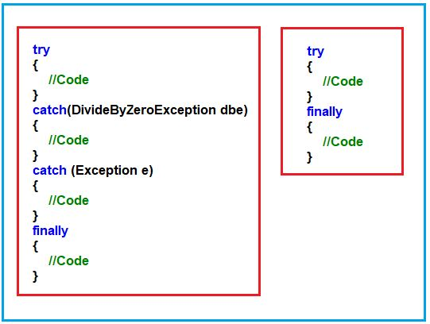
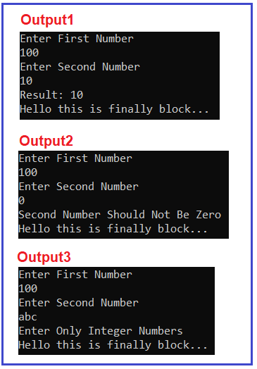
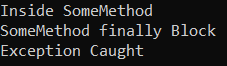

## **بلوک finally در سی شارپ با مثال**

در این مقاله، قصد دارم **بلوک finally را در سی شارپ** با مثال بررسی کردیم، مطالعه کنید. به عنوان بخشی از این مقاله، قصد دارم نکات زیر را مورد بحث قرار دهم.

1. **بلاک finally در سی شارپ چیست؟**
2. **چرا در پروژه بلادرنگ به بلوک finally نیاز داریم؟**
3. **به چند روش می‌توانیم از بلوک‌های try-catch و finally در سی شارپ استفاده کنیم؟**

##### **بلوک finally در سی شارپ**

کلمه کلیدی finally بلوکی را ایجاد می‌کند که قطعاً دستورات قرار گرفته در آن را اجرا می‌کند، صرف نظر از اینکه آیا استثنایی رخ داده است یا خیر. این بدان معناست که دستوراتی که در بلوک finally قرار می‌گیرند، صرف نظر از اینکه آیا استثنایی در بلوک try ایجاد شده است یا خیر، و صرف نظر از اینکه آیا استثنای ایجاد شده توسط بلوک catch مدیریت می‌شود یا خیر، تضمین شده است که اجرا خواهند شد. در زیر سینتکس استفاده از بلوک finally در سی شارپ آمده است:



همانطور که می‌بینید، به دو روش می‌توانیم بلوک finally را در سی شارپ بنویسیم. این دو روش به شرح زیر هستند:

1. **سعی کنید، بگیرید و در نهایت:** در این حالت، استثنا مدیریت می‌شود و متوقف کردن خاتمه غیرعادی به همراه دستوراتی که در بلوک «نهایی» قرار دارند، به هر قیمتی اجرا می‌شوند.
2. **سعی و خطا:** در این حالت، خاتمه غیرعادی در صورت بروز خطای زمان اجرا متوقف نمی‌شود زیرا استثنائات مدیریت نمی‌شوند، اما حتی اگر خاتمه غیرعادی رخ دهد، بلوک‌های finally اجرا می‌شوند.

##### **چرا در توسعه پروژه بلادرنگ به بلاک نهایی نیاز داریم؟**

طبق استاندارد کدنویسی صنعتی، در **بلوک finally** باید منطق آزادسازی منابع را بنویسیم یا کد را پاک‌سازی کنیم. منطق آزادسازی منابع به معنای حذف ارجاع اشیاء ایجاد شده در بلوک try است. از آنجایی که تضمینی برای اجرای دستورات نوشته شده در بلوک try و catch وجود ندارد، باید آنها را در بلوک finally قرار دهیم.

برای مثال، اگر بخواهیم اشیاء ADO.NET مانند **شیء Connection، شیء Command** و غیره را ببندیم، باید **متد Close()** را هم در try و هم در بلوک catch فراخوانی کنیم تا اجرای آن تضمین شود. به جای قرار دادن **دستورات فراخوانی متد Close()** یکسان در چندین مکان، اگر آن را در بلوک finally بنویسیم، صرف نظر از اینکه exception ایجاد شده باشد یا خیر، همیشه اجرا خواهد شد.

##### **مثال برای درک کاربرد بلوک finally در سی شارپ:**

بیایید یک مثال برای درک کاربرد بلوک finally در سی شارپ ببینیم. در مثال زیر، برای بلوک try داده شده، دو بلوک catch نوشته‌ایم و بعد از بلوک catch دوم، بلوک finally را نوشته‌ایم. دستورات موجود در بلوک finally صرف نظر از اینکه exception رخ داده یا خیر، صرف نظر از اینکه exception مدیریت شده است یا خیر، اجرا می‌شوند. این بدان معناست که اگر چیزی را در بلوک finally قرار دهیم، آن دستورات قطعاً اجرا خواهند شد.

```csharp
using System;

namespace ExceptionHandlingDemo
{
    class Program
    {
        static void Main(string[] args)
        {
            int Number1, Number2, Result;
            try
            {
                Console.WriteLine("Enter First Number");
                Number1 = int.Parse(Console.ReadLine());
                Console.WriteLine("Enter Second Number");
                Number2 = int.Parse(Console.ReadLine());
                Result = Number1 / Number2;
                Console.WriteLine($"Result: {Result}");
            }
            catch (DivideByZeroException DBZE)
            {
                Console.WriteLine("Second Number Should Not Be Zero");
            }
            catch (FormatException FE)
            {
                Console.WriteLine("Enter Only Integer Numbers");
            }
            finally
            {
                Console.WriteLine("Hello this is finally block...");
            }
            Console.ReadKey();
        }
    }
}
```

###### **خروجی:**



##### **به چند روش می‌توانیم از بلوک‌های try-catch و finally در سی شارپ استفاده کنیم؟**

ما می‌توانیم از try-catch-finally به سه روش مختلف استفاده کنیم. این روش‌ها به شرح زیر هستند:

1. **سعی و خطا:** در این حالت، استثنا مدیریت شده و خاتمه غیرعادی متوقف می‌شود.
2. **سعی کنید، بگیرید و در نهایت:** در این حالت، استثنا مدیریت می‌شود و متوقف کردن خاتمه غیرعادی به همراه دستوراتی که در بلوک «نهایی» قرار دارند، به هر قیمتی اجرا می‌شوند.
3. **سعی و خطا:** در این حالت، در صورت بروز خطای زمان اجرا، اجرای خطاهای غیرطبیعی متوقف نمی‌شود زیرا استثنائات مدیریت نمی‌شوند، اما حتی اگر یک خاتمه غیرطبیعی رخ دهد، بلوک‌های finally اجرا می‌شوند.

##### **مثالی برای درک بلوک Try-Finally بدون بلوک Catch:**

بیایید یک مثال برای درک بلوک Try-Finally بدون بلوک Catch در C# ببینیم. لطفاً به مثال زیر نگاهی بیندازید. در داخل SomeMethod، منطق را به گونه‌ای نوشته‌ایم که در زمان اجرا، این متد خطای Divide By Zero Exception را صادر می‌کند و اگر می‌بینید که ما آن خطا را با استفاده از بلوک catch مدیریت نمی‌کنیم. حتی اگر بلوک catch وجود نداشته باشد، بلوک finally اجرا خواهد شد.

```csharp
using System;

namespace ExceptionHandlingDemo
{
    class Program
    {
        static void SomeMethod()
        {
            try
            {
                Console.WriteLine("Inside SomeMethod");
                int num1 = 10, num2 = 0;
                int result = num1 / num2; //Exception will be thrown here
                Console.WriteLine($"Result: {result}");
            }
            finally
            {
                Console.WriteLine("SomeMethod finally Block");
            }
        }

        static void Main(string[] args)
        {
            try
            {
                SomeMethod();
            }
            catch (Exception)
            {
                Console.WriteLine("Exception Caught");
            }
           
            Console.ReadKey();
        }
    }
}
```

###### **خروجی:**


