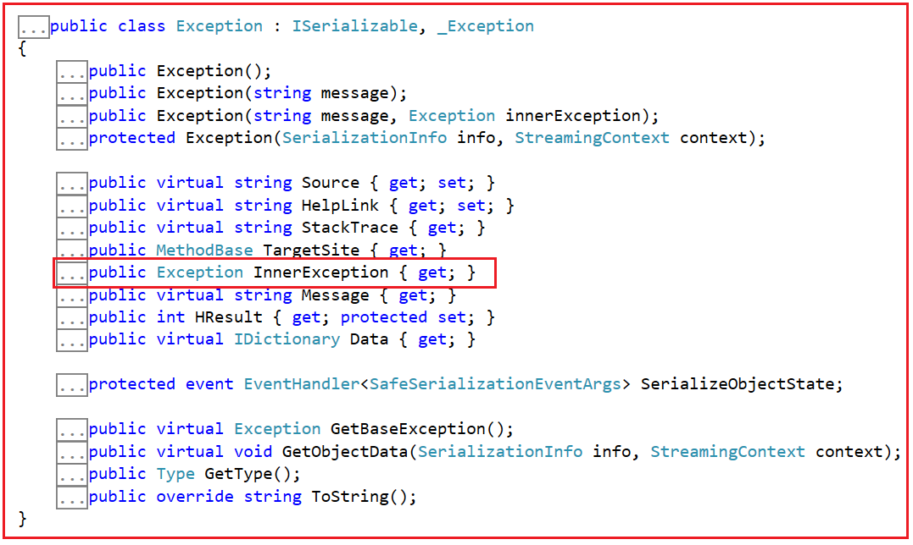
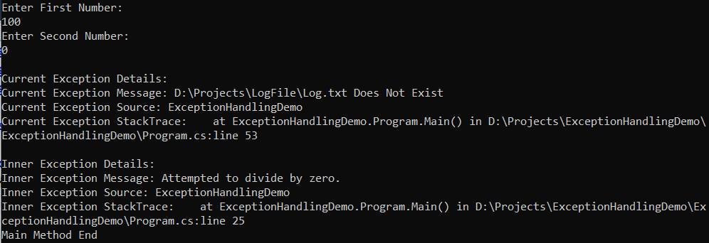
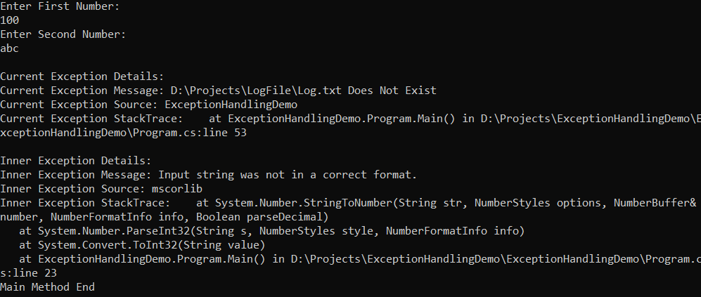

## **استثنای داخلی در سی شارپ به همراه یک مثال**

در این مقاله، قصد دارم در مورد **استثنای داخلی (Inner Exception) در سی شارپ** با مثال صحبت کنم. در پایان این مقاله، شما خواهید فهمید که استثنای داخلی چیست و در سی شارپ با مثال به چه چیزی نیاز دارد.

##### **استثنای داخلی در سی شارپ چیست؟**

استثنای داخلی در سی شارپ، یک ویژگی از کلاس Exception است. اگر به تعریف کلاس Exception بروید، خواهید دید که این یک ویژگی فقط خواندنی است، یعنی فقط دارای دسترسی get است، همانطور که در تصویر زیر نشان داده شده است. از آنجایی که این ویژگی در کلاس Exception والد تعریف شده است، بنابراین این ویژگی برای همه کلاس‌های فرزند از جمله کلاس‌های Custom Exception در دسترس است.



**public Exception InnerException {get;}:** این ویژگی InnerException نمونه‌ی Exception که باعث ایجاد استثنای فعلی شده است را دریافت می‌کند. این ویژگی یک شیء را برمی‌گرداند که خطایی را که باعث ایجاد استثنای فعلی شده است، توصیف می‌کند. ویژگی InnerException همان مقداری را که به سازنده ارسال شده است، برمی‌گرداند، یا اگر مقدار استثنای داخلی به سازنده ارائه نشده باشد، null را برمی‌گرداند.

برای ساده‌سازی تعریف بالا، می‌توانیم بگوییم که وقتی مجموعه‌ای از استثناها وجود دارد، آنگاه **جدیدترین استثنا جزئیات استثنای قبلی را در ویژگی InnerException به دست می‌آورد** . فرض کنید در برنامه ما، از Method1، متد2 را فراخوانی می‌کنیم. در Method2، یک استثنا، مثلاً تقسیم بر صفر، دریافت می‌کنیم و سپس از Method1، استثنای دیگری، مثلاً استثنای Format، دریافت می‌کنیم. در این حالت، استثنای فعلی یا آخرین استثنا، Format Exception است و در ویژگی Format Exception InnerException، جزئیات استثنای قبلی یعنی Divide By Zero Exception را دریافت خواهید کرد.

به ترتیب، می‌توان گفت که ویژگی InnerException، استثنای اصلی که باعث استثنای فعلی شده است را برمی‌گرداند. اگر در حال حاضر این موضوع برایتان واضح نیست، نگران نباشید، ما این موضوع را با مثال‌هایی بررسی خواهیم کرد.

##### **مثال استثنای داخلی در سی شارپ:**

فرض کنید در یک بلوک try یک استثنا داریم که **DivideByZeroException را**   صادر خواهد کرد **صادر می‌کند و بلوک catch آن استثنا را دریافت کرده و سپس سعی می‌کند آن استثنا را در یک فایل بنویسد. با این حال، اگر مسیر فایل پیدا نشود، بلوک catch نیز FileNotFoundException را** .

فرض کنید بلوک try بیرونی، این **استثنای FileNotFoundException**   واقعی **را دریافت می‌کند، اما در مورد استثنای DivideByZeroException**   که رخ داده است چطور؟ آیا از بین رفته است؟ خیر، **ویژگی InnerException**   از کلاس Exception شامل استثنای واقعی است.

##### **مثال برای درک استثنای داخلی در سی شارپ:**

بیایید با یک مثال، استثنای داخلی (Inner Exception) در سی شارپ را درک کنیم. ابتدا کد کامل مثال را ببینیم و سپس کد را توضیح خواهم داد. کد کامل برای درک استثنای داخلی در سی شارپ در زیر آمده است:

```csharp
using System;
using System.IO;
using System.Text;

namespace ExceptionHandlingDemo
{
    class Program
    {
        public static void Main()
        {
            //Outer Try
            try
            {
                int FirstNumber, SecondNumber, Result;
                //Inner Try
                try
                {
                    //Make sure to Cause Exception in the Try Block
                    Console.WriteLine("Enter First Number:");
                    FirstNumber = Convert.ToInt32(Console.ReadLine());

                    Console.WriteLine("Enter Second Number:");
                    SecondNumber = Convert.ToInt32(Console.ReadLine());

                    Result = FirstNumber / SecondNumber;
                    Console.WriteLine($"Result = {Result}");
                }
                //Inner Catch
                catch (Exception ex)
                {
                    //Make sure this Path Does Not Exist
                    string filePath = @"D:\Projects\LogFile\Log.txt";
                    if (File.Exists(filePath))
                    {
                        StringBuilder stringBuilder = new StringBuilder();
                        stringBuilder.Append($"Message: {ex.Message}\n");
                        stringBuilder.Append($"Source: {ex.Source}\n");
                        stringBuilder.Append($"HelpLink: {ex.HelpLink}\n");
                        stringBuilder.Append($"StackTrace: {ex.StackTrace}\n");
                        stringBuilder.Append($"GetType(): {ex.GetType()}\n");
                        stringBuilder.Append($"GetType().Name: {ex.GetType().Name}\n");
                        
                        StreamWriter streamWriter = new StreamWriter(filePath);
                        streamWriter.Write(stringBuilder.ToString());
                        streamWriter.Close();
                        Console.WriteLine("There is a Problem! Please Try Later");
                    }
                    else
                    {
                        //To retain the Original Exception pass, this exception as a parameter
                        //to the constructor of the current exception
                        string Message = filePath + " Does Not Exist";
                        throw new FileNotFoundException(Message, ex);
                    }
                }
            }
            //Outer Catch
            catch (Exception exception)
            {
                //exception.Message will give the current exception message
                //i.e. Message about File Not Found Exception
                Console.WriteLine("\nCurrent Exception Details: ");
                Console.WriteLine($"Current Exception Message: {exception.Message}");
                Console.WriteLine($"Current Exception Source: {exception.Source}");
                Console.WriteLine($"Current Exception StackTrace: {exception.StackTrace}");

                //Check if InnerException is not null before accessing the InnerException properties
                //else, you may get Null Reference Exception
                if (exception.InnerException != null)
                {
                    Console.WriteLine("\nInner Exception Details: ");
                    Console.WriteLine($"Inner Exception Message: {exception.InnerException.Message}");
                    Console.WriteLine($"Inner Exception Source: {exception.InnerException.Source}");
                    Console.WriteLine($"Inner Exception StackTrace: {exception.InnerException.StackTrace}");
                }
            }
            Console.WriteLine("Main Method End");
            Console.ReadLine();
        }
    }
}
```

**نکته ۱:** ابتدا از کاربر می‌خواهیم که دو عدد وارد کند. برای درک خطای داخلی، باید مطمئن شویم که این برنامه هنگام اجرای برنامه، خطایی ایجاد می‌کند. برای انجام این کار، ۳ گزینه داریم.

1. می‌توانید به جای عدد، یک کاراکتر وارد کنید که باعث ایجاد خطای Format Exception می‌شود.
2. یا می‌توانید یک عدد بسیار بزرگ وارد کنید که یک عدد صحیح نمی‌تواند آن را در خود نگه دارد که باعث ایجاد خطای Over Flow Exception می‌شود.
3. یا می‌توانید برای عدد دوم صفر وارد کنید که باعث می‌شود برنامه خطای تقسیم بر صفر (Divide By Zero Exception) را صادر کند.

**نکته ۲:** وقتی باعث می‌شوید برنامه‌تان از بلوک try داخلی خطایی صادر کند، آن خطا توسط بلوک Inner Catch مدیریت می‌شود. دلیل این امر این است که catch داخلی یک بلوک catch عمومی است و کلاس Exception را به عنوان پارامتری می‌گیرد که می‌تواند هر نوع خطایی را که از بلوک try مربوطه صادر می‌شود، دریافت کند.

**نکته ۳:** به محض اینکه بلوک catch، exception را دریافت کرد، سعی می‌کنیم جزئیات exception را در یک فایل متنی ثبت کنیم. در اینجا، اگر مسیر فایل صحیح را ارائه دهید، اطلاعات exception در فایل متنی ثبت می‌شود. اما برای درک Inner Exception، مطمئن شوید که مسیر فایل وجود ندارد. اگر File Path وجود نداشته باشد، ما یک File Not Found Exception از بلوک catch ارسال می‌کنیم و همانطور که می‌بینید، ما دو پارامتر را به سازنده کلاس File Not Found Exception ارسال می‌کنیم. پارامتر اول پیام را مشخص می‌کند و پارامتر دوم exception است (exception که از بلوک try داخلی ارسال شده است) و اطلاعات این exception در داخل ویژگی InnerException ذخیره می‌شود.

**نکته ۴:** اکنون، بلوک catch بیرونی، خطای File Not Found را که توسط بلوک catch درونی رخ می‌دهد، دریافت می‌کند. در اینجا، ابتدا جزئیات خطای فعلی و سپس جزئیات خطای اصلی یا قدیمی، یعنی خطایی که در ابتدا از بلوک Inner Try رخ داده است، چاپ می‌کنیم. و می‌توانیم از طریق ویژگی Inner Exception به جزئیات خطای قدیمی دسترسی پیدا کنیم. اما قبل از دسترسی به ویژگی‌های InnerException، لطفاً مطمئن شوید که مقدار InnerException تهی (null) نباشد، در غیر این صورت ممکن است با خطای Null Reference Exception مواجه شوید.

###### **خروجی ۱:**

حالا، برنامه را اجرا کنید و دو عدد ورودی ۱۰۰ و ۰ را وارد کنید، این بار، بلوک try داخلی، خطای Divide By Zero Exception را ایجاد می‌کند و خواهید دید که جزئیات خطای Divide By Zero Exception توسط Inner Exception همانطور که در تصویر زیر نشان داده شده است، چاپ می‌شود.



###### **خروجی ۲:**

حالا، برنامه را اجرا کنید و مقدار دوم را به عنوان abc وارد کنید و این بار، بلوک try داخلی، خطای Format Exception را ایجاد می‌کند و خواهید دید که جزئیات این خطای Format Exception توسط Inner Exception همانطور که در تصویر زیر نشان داده شده است، چاپ می‌شود.


