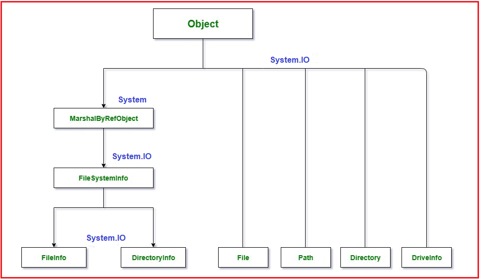
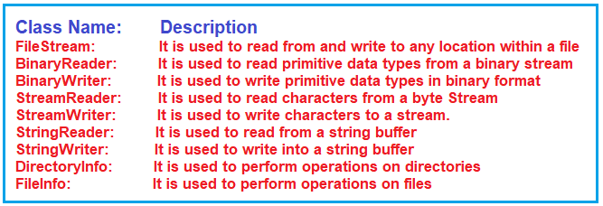

## **مدیریت فایل در سی شارپ با مثال**

در این مقاله، قصد دارم **به همراه مثال‌هایی ، مدیریت فایل‌ها در سی‌شارپ را** مورد بحث قرار دهم . در پایان این مقاله، شما خواهید فهمید که مدیریت فایل چیست و چرا به مدیریت فایل نیاز داریم و چگونه می‌توان مدیریت فایل‌ها را در سی‌شارپ پیاده‌سازی کرد.

##### **فایل چیست؟**

یک فایل مجموعه‌ای از داده‌ها است که با نام، پسوند و مسیر دایرکتوری خاص روی دیسک ذخیره می‌شوند. وقتی فایل را با استفاده از سی‌شارپ برای خواندن و نوشتن باز می‌کنید، به جریان تبدیل می‌شود.

##### **استریم چیست؟**

یک جریان (stream) دنباله ای از بایت ها است که از یک منبع به مقصد از طریق یک مسیر ارتباطی سفر می کند. دو جریان اصلی وجود دارد: جریان ورودی (Input Stream) و جریان خروجی (Output Stream). جریان ورودی برای خواندن داده از فایل (عملیات خواندن) و جریان خروجی برای نوشتن در فایل (عملیات نوشتن) استفاده می شود.

1. **جریان ورودی:** این جریان برای خواندن داده‌ها از یک فایل استفاده می‌شود که به عنوان عملیات خواندن شناخته می‌شود.
2. **جریان خروجی:** این جریان برای نوشتن داده‌ها در یک فایل استفاده می‌شود که به عنوان عملیات نوشتن شناخته می‌شود.

بنابراین، به زبان ساده، می‌توان گفت که یک جریان، دنباله‌ای از بایت‌ها است که برای ارتباط استفاده می‌شود. وقتی فایلی را برای خواندن یا نوشتن باز می‌کنید، به یک جریان تبدیل می‌شود. دو نوع جریان برای یک فایل وجود دارد. یکی جریان ورودی است که برای خواندن فایل استفاده می‌شود و دیگری جریان خروجی است که برای نوشتن فایل استفاده می‌شود.

##### **چرا باید مدیریت فایل‌ها در سی‌شارپ را یاد بگیرم؟**

به عنوان یک برنامه نویس سی شارپ، ما نیاز داریم اطلاعات را روی دیسک ذخیره کنیم. ما در همه جا برای ذخیره اطلاعات، پایگاه داده نخواهیم داشت و پروژه ما ممکن است نیاز به ذخیره اطلاعات در یک فایل TEXT، فایل DOC، فایل XLS، فایل PDF یا هر نوع فایل دیگری داشته باشد. بنابراین، ما باید مفهوم ذخیره داده در یک فایل را بدانیم، یعنی نحوه مدیریت فایل‌ها در سی شارپ.

##### **مدیریت فایل در سی شارپ**

به طور کلی، ما از فایل برای ذخیره داده‌ها استفاده می‌کنیم. اصطلاح مدیریت فایل در سی شارپ به عملیات مختلفی اشاره دارد که می‌توانیم روی یک فایل انجام دهیم، مانند ایجاد فایل، خواندن داده‌ها از فایل، نوشتن داده‌ها در فایل، افزودن فایل و غیره.

به طور کلی، ما عمدتاً سه عملیات اساسی را روی یک فایل انجام می‌دهیم: خواندن داده‌ها از یک فایل، نوشتن داده‌ها در یک فایل و افزودن داده‌ها به یک فایل.

1. **خواندن:** این عملیات، عملیات خواندن پایه است که در آن داده‌ها از یک فایل خوانده می‌شوند.
2. **نوشتن:** این عملیات، عملیات نوشتن پایه است که در آن داده‌ها در یک فایل نوشته می‌شوند. به طور پیش‌فرض، تمام محتویات موجود از فایل حذف شده و محتوای جدید در فایل نوشته می‌شود.
3. **اضافه کردن (Appending):** این عملیات مشابه عملیات نوشتن است که در آن داده‌ها در یک فایل نوشته می‌شوند. تنها تفاوت بین نوشتن (Write) و اضافه کردن (Append) این است که داده‌های موجود در فایل رونویسی نمی‌شوند. با اضافه کردن (Append)، داده‌های جدید در انتهای فایل اضافه می‌شوند.

نکته‌ی دیگری که باید به خاطر داشته باشید این است که وقتی فایل را برای نوشتن یا خواندن باز می‌کنیم، به یک جریان تبدیل می‌شود.

##### **فضای نام System.IO در سی شارپ**

در سی شارپ، فضای نام System.IO شامل کلاس‌های مورد نیاز برای مدیریت جریان‌های ورودی و خروجی و ارائه اطلاعات در مورد ساختار فایل و دایرکتوری است. کلاس والد پردازش فایل، Stream است. Stream یک کلاس انتزاعی است که به عنوان والد کلاس‌هایی که عملیات لازم را پیاده‌سازی می‌کنند، استفاده می‌شود.

لطفاً به تصویر زیر که سلسله مراتب کلاس مدیریت فایل در سی شارپ را نشان می‌دهد، نگاهی بیندازید.

**نکته:** کلاس‌های FileInfo، DirectoryInfo و DriveInfo دارای متدهای نمونه هستند. کلاس‌های File، Directory و Path دارای متدهای استاتیک هستند. جدول زیر کلاس‌های پرکاربرد در فضای نام System.IO را شرح می‌دهد.

