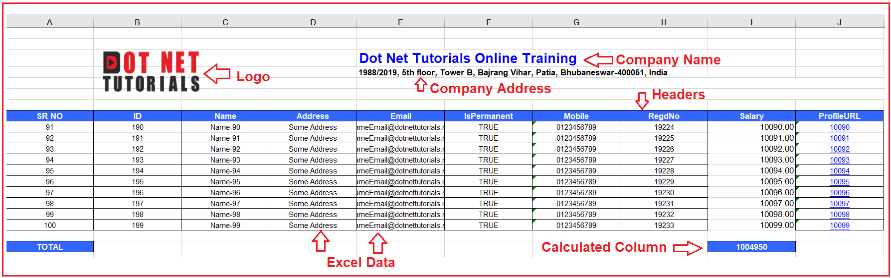
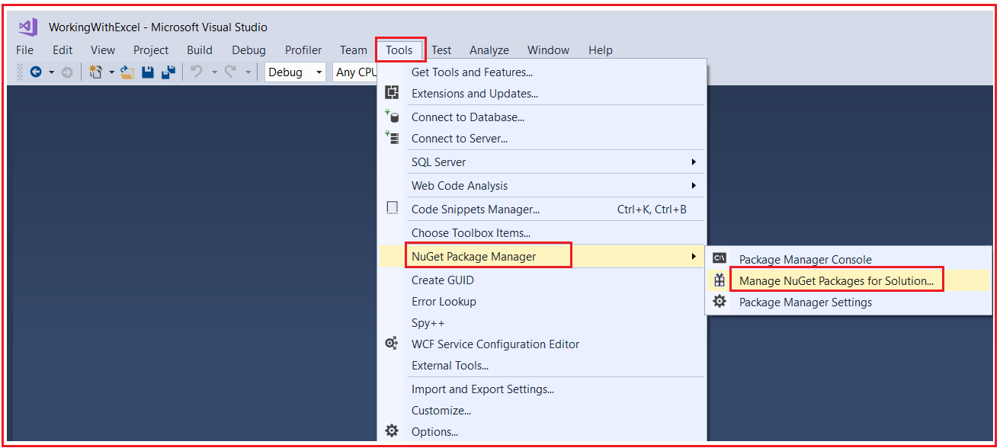
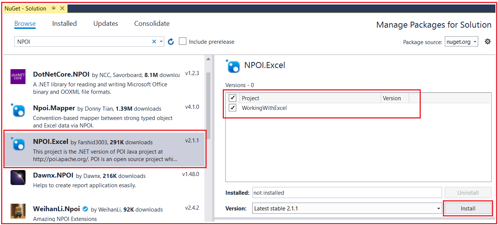
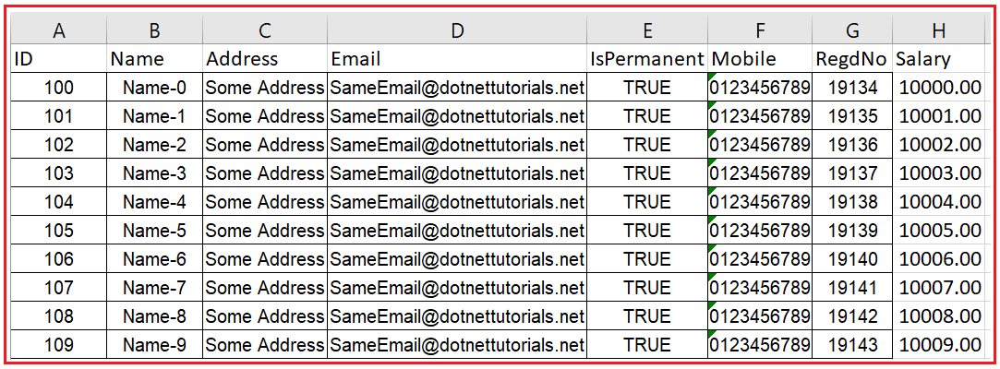
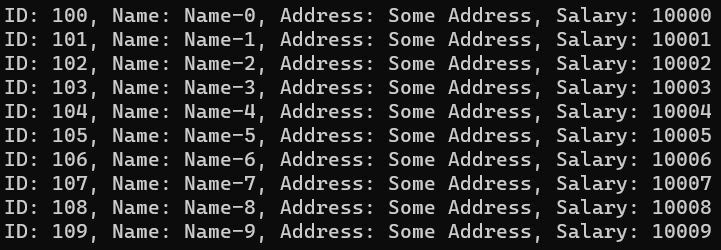

## **استخراج و وارد کردن داده‌های اکسل در سی شارپ با استفاده از کتابخانه NPOI**

در این مقاله، قصد دارم **نحوه‌ی خروجی گرفتن و وارد کردن داده‌های اکسل در سی‌شارپ را** با مثال‌هایی با استفاده از کتابخانه‌ی NPOI بررسی کنم. لطفاً مقاله‌ی قبلی ما را که در آن کلاس DirectoryInfo را در سی‌شارپ با مثال‌هایی بررسی کردیم، مطالعه کنید. هر زمان که روی پروژه‌های بلادرنگ کار می‌کنیم، وارد کردن داده‌ها از یک فایل اکسل و همچنین خروجی گرفتن داده‌ها به یک فایل اکسل یک نیاز رایج است. بنابراین، در اینجا، ابتدا، نحوه‌ی خروجی گرفتن داده‌های اکسل را بررسی خواهیم کرد و سپس نحوه‌ی وارد کردن داده‌های اکسل با استفاده از کتابخانه‌ی NPOI را خواهیم دید.

##### **NPOI چیست؟**

NPOI یک کتابخانه متن‌باز است که می‌تواند به ما در انجام عملیات خواندن و نوشتن روی فایل‌های با پسوند XLS، DOC و PPT کمک کند. این کتابخانه NPOI نسخه دات‌نت پروژه جاوای POI در آدرس http://poi.apache.org/ است. این کتابخانه NPOI تقریباً تمام ویژگی‌های مهم اکسل، مانند استایل‌بندی، قالب‌بندی، فرمول‌های داده، استخراج تصاویر و غیره را پوشش می‌دهد. و مهمترین نکته این است که نیازی به نصب مایکروسافت آفیس روی سرور ندارد. بنابراین، در اینجا، در این مقاله، نحوه انجام عملیات خواندن و نوشتن روی یک فایل اکسل با استفاده از کتابخانه NPOI را به شما نشان خواهم داد.

##### **مثال برای درک خروجی گرفتن از داده‌های اکسل در سی شارپ:**

بیایید مثالی برای درک نحوه‌ی خروجی گرفتن از داده‌های اکسل در سی‌شارپ با استفاده از کتابخانه‌ی NPOI ببینیم. بنابراین، می‌خواهیم اطلاعات کارمندان یک سازمان را در قالب اکسل زیر نمایش دهیم.



همانطور که در تصویر بالا مشاهده می‌کنید، فایل اکسل ما شامل اطلاعات زیر خواهد بود.

در گوشه بالا سمت چپ، می‌خواهیم لوگوی شرکت را قرار دهیم. در سمت راست، می‌خواهیم نام شرکت و آدرس شرکت را قرار دهیم. در اینجا، باید سبک‌های سلولی متفاوتی را برای نام و آدرس شرکت اعمال کنیم.

سپس، باید سرستون‌ها را ارائه دهیم و برای این کار، از سبک‌های سلولی متفاوتی استفاده خواهیم کرد. بعد از سرستون، ردیف‌های داده (Data Rows) را داریم و برای ردیف‌های داده، سبک‌های سلولی متفاوتی داریم. برای داده‌های رشته‌ای یک سبک سلولی متفاوت و برای داده‌های عددی یک سبک سلولی دیگر داریم. علاوه بر این، اگر ستون ProfileURL را مشاهده کنید، باید مقدار آن ستون را به یک هایپرلینک (Hyperlink) تبدیل کنیم و با کلیک روی آن هایپرلینک، باید URL مناسب در مرورگر شما باز شود. برای داده‌های ستون هایپرلینک، سبک سلولی متفاوتی داریم.

پس از تکمیل ردیف‌های داده، باید کل حقوق را محاسبه کنیم. برای این کار، باید از فرمول اکسل استفاده کنیم و برای این کار، از سبک سلولی متفاوتی استفاده می‌کنیم. فرمول به این صورت خواهد بود که تمام مقادیر ستون حقوق را جمع کرده و نتیجه را در ردیف جمع کل نشان دهد.

در اینجا، ما همچنین باید لوگوی شرکت، نام شرکت، آدرس شرکت و سربرگ‌ها را هنگام اسکرول کردن به پایین برای دیدن ردیف‌های داده، ثابت نگه داریم. بیایید ادامه دهیم و ببینیم چگونه می‌توان مثال مورد بحث در بالا را در C# با استفاده از کتابخانه NPOI پیاده‌سازی کرد.

##### **مثال خروجی گرفتن از داده‌های اکسل در سی شارپ با استفاده از کتابخانه NPOI:**

بنابراین، یک برنامه کنسول با نام WorkingWithExcel ایجاد کنید. پس از ایجاد پروژه، باید کتابخانه NPOI را از NuGet Package Manager نصب کنید. برای انجام این کار، **روی Tools => NuGet Package Manager => Manage NuGet Packages for Solution کلیک کنید.** همانطور که در تصویر زیر نشان داده شده است،



سپس به تب Browse بروید، NPOI را جستجو کنید و **کتابخانه NPOI.Excel** را انتخاب کنید ، پروژه‌ای را که می‌خواهید کتابخانه را در آن نصب کنید انتخاب کنید و در نهایت مطابق تصویر زیر بر روی دکمه Install کلیک کنید.



پس از نصب کتابخانه NPOI، پوشه‌ای با نام Images ایجاد کنید و درون این پوشه، لطفاً تصویر زیر را دانلود و ذخیره کنید.


سپس، پوشه دیگری با نام ExcelFiles ایجاد کنید و فایل‌های اکسل تولید شده ما در داخل این پوشه ذخیره خواهند شد. سپس، یک فایل کلاس با نام **Employee.cs** ایجاد کنید و کد زیر را در آن کپی و جایگذاری کنید. این کلاس، کلاس مدل ما خواهد بود که داده‌های Employee را که می‌خواهیم به فایل اکسل صادر کنیم، در خود نگه می‌دارد.

```csharp
namespace WorkingWithExcel
{
    public class Employee
    {
        public int ID { get; set; }
        public string Name { get; set; }
        public string Address { get; set; }
        public string Email { get; set; }
        public string Mobile { get; set; }
        public bool IsPermanent { get; set; }
        public int RegdNo { get; set; }
        public int Salary { get; set; }
        public string ProfileURL { get; set; }
    }
}
```

در مرحله بعد، کلاس Program را به صورت زیر تغییر دهید. در کد زیر، ما از کتابخانه NPOI برای خروجی گرفتن داده‌ها به یک فایل اکسل استفاده می‌کنیم. کد مثال زیر خودآموز است، بنابراین لطفاً برای درک بهتر، خطوط توضیحات را مطالعه کنید.

```csharp
using System;
using System.Collections.Generic;
using NPOI.HSSF.UserModel;
using NPOI.HSSF.Util;
using NPOI.SS.Util;
using NPOI.SS.UserModel;
using System.IO;

namespace WorkingWithExcel
{
    public class Program
    {
        public static void Main()
        {
            try
            {
                #region Data
                //In Real-Time you will get the data from the database,
                //but here we have hard-coded the data
                List<Employee> empList = new List<Employee>();

                for (int i = 0; i < 100; i++)
                {
                    Employee emp = new Employee()
                    {
                        ID = 100 + i,
                        Name = "Name-" + i,
                        Address = "Some Address",
                        Email = "SameEmail@dotnettutorials.net",
                        IsPermanent = true,
                        Mobile = "0123456789",
                        RegdNo = 12345 + i + 6789,
                        Salary = 10000 + i,
                        ProfileURL = "100" + i
                    };
                    empList.Add(emp);
                }
                #endregion

                #region Creating Excel Sheet
                //The following Pieces of Code will Create the Excel File, 
                //Excel Sheet and font object which will be used later
                HSSFWorkbook workbook = new HSSFWorkbook();
                //The sheet name is going to be Dot Net Tutorials
                HSSFSheet sheet = (HSSFSheet)workbook.CreateSheet("Dot Net Tutorials");
                HSSFFont font = (HSSFFont)workbook.CreateFont();
                #endregion

                #region Creating Different Cell Styles
                //Now, we going to create different cell styles for different data

                #region Company Cell Styles
                //We will use the following cell style with the Company Name
                var Company = workbook.CreateCellStyle();
                Company.Alignment = HorizontalAlignment.Left;
                var CompanyFont = workbook.CreateFont();
                CompanyFont.FontName = "Arial";
                CompanyFont.Color = HSSFColor.Blue.Index;
                CompanyFont.Boldweight = (short)FontBoldWeight.Bold;
                CompanyFont.FontHeightInPoints = ((short)16);
                Company.SetFont(CompanyFont);
                #endregion

                #region Address Cell Style
                //We will use the following cell style with the Company Address
                var Address = workbook.CreateCellStyle();
                Address.Alignment = HorizontalAlignment.Left;
                var AddressFont = workbook.CreateFont();
                AddressFont.FontName = "Arial";
                AddressFont.Boldweight = (short)FontBoldWeight.Bold;
                AddressFont.FontHeightInPoints = ((short)10);
                Address.SetFont(AddressFont);
                #endregion

                #region Header Cell Style
                //We will use the following cell style with the Header
                var Header = workbook.CreateCellStyle();
                Header.Alignment = HorizontalAlignment.Center;
                Header.FillForegroundColor = NPOI.HSSF.Util.HSSFColor.LightBlue.Index;
                Header.FillBackgroundColor = NPOI.HSSF.Util.HSSFColor.LightBlue.Index;
                Header.FillPattern = FillPattern.SolidForeground;
                var HeaderFont = workbook.CreateFont();
                HeaderFont.FontName = "Arial";
                HeaderFont.Boldweight = (short)FontBoldWeight.Bold;
                HeaderFont.Color = HSSFColor.White.Index;
                HeaderFont.FontHeightInPoints = ((short)10);
                Header.SetFont(HeaderFont);
                Header.BorderLeft = BorderStyle.Thin;
                Header.BorderTop = BorderStyle.Thin;
                Header.BorderRight = BorderStyle.Thin;
                Header.BorderBottom = BorderStyle.Thin;
                #endregion

                #region Number Data Cell Style
                //We will use the following cell style with Data which is Numeric
                var NumData = workbook.CreateCellStyle();
                var formatId = HSSFDataFormat.GetBuiltinFormat("##0.00");
                if (formatId == -1)
                {
                    var newDataFormat = workbook.CreateDataFormat();
                    NumData.DataFormat = newDataFormat.GetFormat("##0.00");
                }
                else
                    NumData.DataFormat = formatId;
                #endregion

                #region Data Cell Style
                //We will use the following cell style with Data that is NOT Numeric
                var Data = workbook.CreateCellStyle();
                Data.Alignment = HorizontalAlignment.Center;

                var DataFont = workbook.CreateFont();
                DataFont.FontName = "Arial";
                DataFont.FontHeightInPoints = ((short)9);
                Data.SetFont(DataFont);
                Data.BorderLeft = BorderStyle.Thin;
                Data.BorderTop = BorderStyle.Thin;
                Data.BorderRight = BorderStyle.Thin;
                Data.BorderBottom = BorderStyle.Thin;
                #endregion

                #region Link Data Cell Style
                //We will use the following cell style with Hyperlink Data
                var linkData = workbook.CreateCellStyle();
                linkData.Alignment = HorizontalAlignment.Center;

                var linkDataFont = workbook.CreateFont();
                linkDataFont.FontName = "Arial";
                linkDataFont.Color = HSSFColor.Blue.Index;
                linkDataFont.FontHeightInPoints = ((short)9);
                linkDataFont.Underline = FontUnderlineType.Single;
                linkDataFont.Color = HSSFColor.Blue.Index;
                linkData.SetFont(linkDataFont);
                linkData.BorderLeft = BorderStyle.Thin;
                linkData.BorderTop = BorderStyle.Thin;
                linkData.BorderRight = BorderStyle.Thin;
                linkData.BorderBottom = BorderStyle.Thin;
                #endregion

                #endregion

                #region Creating Company and Address of the Excel Sheet
                //Creating the Company Name from 2nd Row by applying Company Cell Style
                // rowIndex is going to hold the Row Number. Inex means 0 - Based Index
                int rowIndex = 2; //rowIndex 2 means 3rd Row
                var row = sheet.CreateRow(rowIndex);
                var cell = row.CreateCell(4);
                cell.SetCellValue("Dot Net Tutorials Online Training");
                cell.CellStyle = Company;
                sheet.AddMergedRegion(new CellRangeAddress(4, 4, 4, 14));

                //Creating the Company Address from 3rd Row by applying Address Cell Style
                rowIndex = rowIndex + 1;
                var row1 = sheet.CreateRow(rowIndex);
                var cell1 = row1.CreateCell(4);
                cell1.SetCellValue("1988/2019, 5th floor, Tower B, Bajrang Vihar, Patia, Bhubaneswar-400051, India");
                cell1.CellStyle = Address;
                sheet.AddMergedRegion(new CellRangeAddress(5, 5, 4, 14));

                #endregion

                // Set Row index for Header 
                rowIndex = 7; //rowIndex 7 means 8th Row which is going to be our Header in Excel Sheet
                var SR_NO = 0; //We want a unique Serial Number for Each Row in the Excel Sheet

                #region Excel Data Headers

                var cellheaderindex = 0;

                var excelheaderrow = sheet.CreateRow(rowIndex);
                var excelheadercell = excelheaderrow.CreateCell(cellheaderindex);
                excelheadercell.SetCellValue("SR NO");
                excelheadercell.CellStyle = Header;

                cellheaderindex = cellheaderindex + 1;
                excelheadercell = excelheaderrow.CreateCell(cellheaderindex);
                excelheadercell.SetCellValue("ID");
                excelheadercell.CellStyle = Header;

                cellheaderindex = cellheaderindex + 1;
                excelheadercell = excelheaderrow.CreateCell(cellheaderindex);
                excelheadercell.SetCellValue("Name");
                excelheadercell.CellStyle = Header;

                cellheaderindex = cellheaderindex + 1;
                excelheadercell = excelheaderrow.CreateCell(cellheaderindex);
                excelheadercell.SetCellValue("Address");
                excelheadercell.CellStyle = Header;

                cellheaderindex = cellheaderindex + 1;
                excelheadercell = excelheaderrow.CreateCell(cellheaderindex);
                excelheadercell.SetCellValue("Email");
                excelheadercell.CellStyle = Header;

                cellheaderindex = cellheaderindex + 1;
                excelheadercell = excelheaderrow.CreateCell(cellheaderindex);
                excelheadercell.SetCellValue("IsPermanent");
                excelheadercell.CellStyle = Header;

                cellheaderindex = cellheaderindex + 1;
                excelheadercell = excelheaderrow.CreateCell(cellheaderindex);
                excelheadercell.SetCellValue("Mobile");
                excelheadercell.CellStyle = Header;

                cellheaderindex = cellheaderindex + 1;
                excelheadercell = excelheaderrow.CreateCell(cellheaderindex);
                excelheadercell.SetCellValue("RegdNo");
                excelheadercell.CellStyle = Header;

                cellheaderindex = cellheaderindex + 1;
                excelheadercell = excelheaderrow.CreateCell(cellheaderindex);
                excelheadercell.SetCellValue("Salary");
                excelheadercell.CellStyle = Header;

                cellheaderindex = cellheaderindex + 1;
                excelheadercell = excelheaderrow.CreateCell(cellheaderindex);
                excelheadercell.SetCellValue("ProfileURL");
                excelheadercell.CellStyle = Header;

                #endregion

                #region Excel Data
                foreach (Employee data in empList)
                {
                    //Increase the rowIndex and SR_NO by 1 for each record in the empList
                    rowIndex = rowIndex + 1; //This will be the row number in the Excel Sheet
                    SR_NO = SR_NO + 1; //Unique Serial Number
                    var cellindex = 0; //Cell Number starting from 0

                    //Create the New Row
                    var gridrow = sheet.CreateRow(rowIndex);
                    //Create the first Cell in the new Row
                    var gridcell = gridrow.CreateCell(cellindex);
                    //Add value to the Cell 
                    gridcell.SetCellValue(SR_NO);
                    //Apply appropriate CSS Styles
                    gridcell.CellStyle = Data;

                    //Increse the Cell Index by 1 to create the next cell in the Row
                    cellindex = cellindex + 1;
                    //Create the new cell
                    gridcell = gridrow.CreateCell(cellindex);
                    //Add value to the Cell
                    gridcell.SetCellValue(data.ID);
                    //Apply appropriate CSS Styles
                    gridcell.CellStyle = Data;

                    //The Process will continue till the last cell in the Row

                    cellindex = cellindex + 1;
                    gridcell = gridrow.CreateCell(cellindex);
                    gridcell.SetCellValue(data.Name);
                    gridcell.CellStyle = Data;

                    cellindex = cellindex + 1;
                    gridcell = gridrow.CreateCell(cellindex);
                    gridcell.SetCellValue(data.Address);
                    gridcell.CellStyle = Data;

                    cellindex = cellindex + 1;
                    gridcell = gridrow.CreateCell(cellindex);
                    gridcell.SetCellValue(data.Email);
                    gridcell.CellStyle = Data;

                    cellindex = cellindex + 1;
                    gridcell = gridrow.CreateCell(cellindex);
                    gridcell.SetCellValue(data.IsPermanent);
                    gridcell.CellStyle = Data;

                    cellindex = cellindex + 1;
                    gridcell = gridrow.CreateCell(cellindex);
                    gridcell.SetCellValue(data.Mobile);
                    gridcell.CellStyle = Data;

                    cellindex = cellindex + 1;
                    gridcell = gridrow.CreateCell(cellindex);
                    gridcell.SetCellValue(data.RegdNo);
                    gridcell.CellStyle = Data;

                    cellindex = cellindex + 1;
                    gridcell = gridrow.CreateCell(cellindex);
                    gridcell.SetCellValue(Convert.ToDouble(data.Salary));
                    gridcell.CellStyle = NumData;

                    cellindex = cellindex + 1;
                    gridcell = gridrow.CreateCell(cellindex);
                    gridcell.SetCellValue(data.ProfileURL);
                    //Setting the Cell value as Hyper link
                    HSSFHyperlink link = new HSSFHyperlink(HyperlinkType.Url)
                    {
                        //On click on the Hyperlink, it will open the following URL in the browser
                        Address = "http://www.dotnettutorials.net/" + data.ProfileURL
                    };
                    gridcell.Hyperlink = (link);
                    gridcell.CellStyle = linkData;
                }
                #endregion

                #region Freezing Point
                //Setting the Freezing Point- Column 0 and Row Number 8
                sheet.CreateFreezePane(0, 8, 0, 8);
                for (int i = 0; i <= cellheaderindex; i++)
                {
                    sheet.SetColumnWidth(i, 5000);
                }
                #endregion

                #region TOTAL & FORMALA SECTION
                //We need to calculate the sum of the salary column
                var startrow = 9; //Data Rows started from Row Number 9
                var lastdatarow = rowIndex + 1; //Last Row
                rowIndex = rowIndex + 2; //Creating a New Rows to display the Total
                var Formularow = sheet.CreateRow(rowIndex);
                var Formulacell = Formularow.CreateCell(0);
                Formulacell.SetCellValue("TOTAL");
                Formulacell.CellStyle = Header;

                //Creating a Cell to display the Total
                Formulacell = Formularow.CreateCell(8);
                //Formula to calculate the Total
                Formulacell.CellStyle = Header;
                String strFormula = "SUBTOTAL(9,I" + Convert.ToString(startrow) + ":I" + Convert.ToString(lastdatarow) + ")";
                Formulacell.SetCellType(CellType.Formula);
                Formulacell.SetCellFormula(strFormula);
                HSSFFormulaEvaluator.EvaluateAllFormulaCells(workbook);

                #endregion

                #region LOGO
                //Displaying the Logo on the TOP Left Corner of the Excel Sheet
                HSSFPatriarch patriarch = (HSSFPatriarch)sheet.CreateDrawingPatriarch();
                HSSFClientAnchor anchor = new HSSFClientAnchor(0, 0, 0, 255, 1, 2, 2, 5)
                {
                    AnchorType = (int)NPOI.SS.UserModel.AnchorType.MoveAndResize
                };
                //Here, you need to replace the Image Path and Name as per your directory structure and Image Name
                HSSFPicture picture = (HSSFPicture)patriarch.CreatePicture(anchor, LoadImage(@"C:\\Users\\HP\\source\\repos\\WorkingWithExcel\\WorkingWithExcel\\Images\\DotNetTutorials.png", workbook));
                picture.Resize();
                picture.LineStyle = (LineStyle)HSSFPicture.LINESTYLE_NONE;

                #endregion

                //Finally, Create the Excel File and Save it on a specified Location
                string FileName = "MyExcel_" + DateTime.Now.ToString("yyyy-dd-MM--HH-mm-ss") + ".xls";
                //Here, you need to replace the Path as per your directory structure where you want to save the image
                using (FileStream file = new FileStream(@"C:\\Users\\HP\\source\\repos\\WorkingWithExcel\\WorkingWithExcel\\ExcelFiles\\" + FileName, FileMode.Create))
                {
                    workbook.Write(file);
                    file.Close();
                    Console.WriteLine("File Created Successfully...");
                }
            }
            catch (Exception ex)
            {
                Console.WriteLine(ex.Message);
            }
            Console.ReadKey();
        }
        //The following code is used to load the Image, Create the Image and return that image
        public static int LoadImage(string path, HSSFWorkbook wb)
        {
            FileStream file = new FileStream(path, FileMode.Open, FileAccess.Read);
            byte[] buffer = new byte[file.Length];
            file.Read(buffer, 0, (int)file.Length);
            return wb.AddPicture(buffer, PictureType.JPEG);
        }
    }
}
```

با اعمال تغییرات فوق، اکنون کد برنامه را اجرا کنید و خروجی را مشاهده کنید. اگر همه چیز خوب باشد، پیامی با عنوان « **فایل با موفقیت ایجاد شد…»** دریافت خواهید کرد . اکنون، به پوشه Excel Files بروید و خواهید دید که فایل اکسل باید با فرمت، فرمول و داده‌های مورد نیاز ایجاد شود.

**نکته:** استایل‌دهی به هدر، داده‌ها و غیره اختیاری است. اگر نمی‌خواهید، می‌توانید آنها را حذف کنید.

##### **وارد کردن داده‌های برگه اکسل در سی شارپ با استفاده از کتابخانه NPOI:**

حال، بیایید ادامه دهیم و نحوه وارد کردن داده‌های اکسل در سی‌شارپ با استفاده از کتابخانه NPOI را درک کنیم. فرض کنید فایل MyExcelFile.xlsx زیر را در پوشه Excel Files خود داریم.



همانطور که در تصویر بالا مشاهده می‌کنید، این چیزی جز داده‌های کارمندان یک سازمان نیست. حال، باید صفحه اکسل فوق را به برنامه .NET خود وارد کنیم. بنابراین، برای این کار، لطفاً کلاس Program را به شرح زیر تغییر دهید. کد زیر خود گویای همه چیز است، بنابراین لطفاً برای درک بهتر، خطوط توضیحات را مطالعه کنید.

```csharp
using System;
using System.Collections.Generic;
using NPOI.SS.UserModel;
using System.IO;
using NPOI.XSSF.UserModel;

namespace WorkingWithExcel
{
    public class Program
    {
        public static void Main()
        {
            try
            {
                //The following Collection object is going to hold the Excel Sheet Data
                List<Employee> listEmployees = new List<Employee>();

                //Set the Excel File Path
                string FilePath = @"C:\\Users\\HP\\source\\repos\\WorkingWithExcel\\WorkingWithExcel\\ExcelFiles\\MyExcelFile.xlsx";

                //For Import we need to create an instance of XSSFWorkbook class
                XSSFWorkbook xssfWorkbook;
                using (FileStream file = new FileStream(FilePath, FileMode.Open, FileAccess.Read))
                {
                    xssfWorkbook = new XSSFWorkbook(file);
                }

                //The Excel File Might have multiple sheets
                //So create an ISheet object by specifying the appropriate sheet name or index position
                //ISheet sheet = xssfWorkbook.GetSheet("Sheet1"); //Based on the Sheet Name
                ISheet sheet = xssfWorkbook.GetSheetAt(0); //Based on the Index Position (0-Based Index Position)

                //If First Row is Header, then Initialize the row = 1 else row = 0 inside the for loop
                //As our Excel Sheet Contains the First Row as a Header, we are setting row = 1
                //The following Loop will start from the First data Rows till the last data row in the sheet
                for (int row = 1; row <= sheet.LastRowNum; row++)
                {
                    //null is when the row only contains empty cells 
                    if (sheet.GetRow(row) != null)
                    {
                        //If the Row is not empty, then Fetch cell value and populate them with Employee Object
                        Employee emp = new Employee()
                        {
                            //For Accessing Numeric Cell Value we need to use NumericCellValue Property
                            //For Accessing String Cell Value we need to use StringCellValue Property
                            //For Accessing Boolean Cell Value we need to use BooleanCellValue Property

                            //First Cell is ID
                            ID = (int)sheet.GetRow(row).GetCell(0).NumericCellValue,
                            //Second Cell is Name
                            Name = sheet.GetRow(row).GetCell(1).StringCellValue,
                            //Third Cell is Address
                            Address = sheet.GetRow(row).GetCell(2).StringCellValue,
                            //Fourth Cell is Email
                            Email = sheet.GetRow(row).GetCell(3).StringCellValue,

                            //Fifth Cell is IsPermanent
                            IsPermanent = sheet.GetRow(row).GetCell(4).BooleanCellValue,
                            //Sixth Cell is Mobile
                            Mobile = sheet.GetRow(row).GetCell(5).StringCellValue,
                            //Seventh Cell is RegdNo
                            RegdNo = (int)sheet.GetRow(row).GetCell(6).NumericCellValue,
                            //Eighth Cell is Salary
                            Salary = (int)sheet.GetRow(row).GetCell(7).NumericCellValue,
                        };

                        //Add the employee data into listEmployees Collection
                        listEmployees.Add(emp);
                    }
                }

                //Once you import the data from the Excel File to your .NET Object, then you can do whatever you want
                //Like Save the Data into the Database, Display the Data, Modify the Data, etc
                //Here, we are going to Display the Excel Sheet Data
                foreach (var emp in listEmployees)
                {
                    Console.WriteLine($"ID: {emp.ID}, Name: {emp.Name}, Address: {emp.Address}, Salary: {emp.Salary}");
                }
            }
            catch (Exception ex)
            {
                Console.WriteLine(ex.Message);
            }
            Console.ReadKey();
        }
    }

    public class Employee
    {
        public int ID { get; set; }
        public string Name { get; set; }
        public string Address { get; set; }
        public string Email { get; set; }
        public string Mobile { get; set; }
        public bool IsPermanent { get; set; }
        public int RegdNo { get; set; }
        public int Salary { get; set; }
    }
}
```

###### **خروجی:**

****