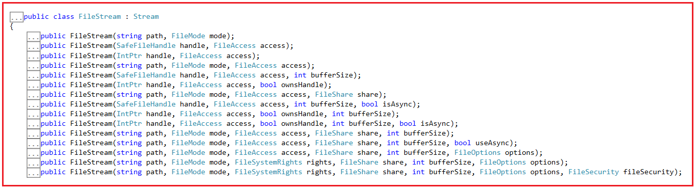
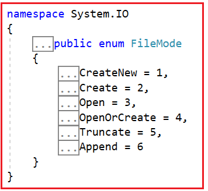
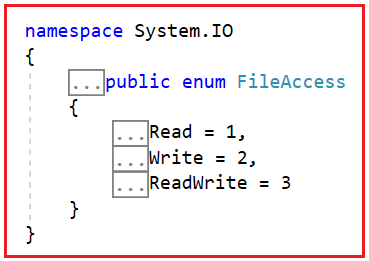
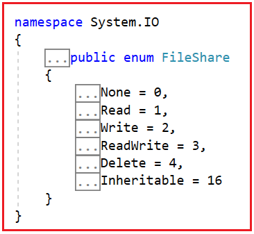
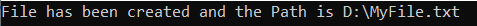
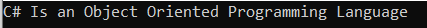

## **کلاس FileStream در سی شارپ به همراه مثال**

در این مقاله، قصد دارم **کلاس FileStream را در سی شارپ** با مثال‌هایی مورد بحث قرار دهم. لطفاً مقاله قبلی ما را که در آن اصول اولیه مدیریت فایل در سی شارپ را مورد بحث قرار دادیم، مطالعه کنید.

##### **کلاس FileStream در سی شارپ چیست؟**

کلاس FileStream در سی شارپ، یک جریان برای عملیات روی فایل‌ها فراهم می‌کند. می‌توان از آن برای انجام عملیات خواندن و نوشتن همزمان و ناهمزمان استفاده کرد. با کمک کلاس FileStream، می‌توانیم به راحتی داده‌ها را در فایل‌ها بخوانیم و بنویسیم.

##### **چگونه از کلاس FileStream در سی شارپ استفاده کنیم؟**

برای استفاده از کلاس FileStream در سی شارپ، اول از همه، باید **فضای نام System.IO** را وارد کنیم و سپس باید یک نمونه از کلاس FileStream ایجاد کنیم تا یک فایل جدید ایجاد کنیم یا یک فایل موجود را باز کنیم. اگر به تعریف کلاس FileStream بروید، خواهید دید که نسخه‌های Overload شده زیادی از Constructorها همانطور که در تصویر زیر نشان داده شده است، در دسترس هستند.



ساده‌ترین راه برای ایجاد یک نمونه از کلاس FileStream، استفاده از نسخه overload شده‌ی سازنده‌های زیر است.

**public FileStream(string path, FileMode mode) :** این سازنده یک نمونه جدید از کلاس FileStream را با مسیر و حالت ایجاد مشخص شده، مقداردهی اولیه می‌کند.

**اینجا،**

1. **مسیر:** یک مسیر نسبی یا مطلق برای فایلی که شیء FileStream فعلی آن را کپسوله‌سازی خواهد کرد.
2. **mode:** ثابتی که نحوه باز کردن یا ایجاد فایل را تعیین می‌کند.

**public FileStream(string path, FileMode mode, FileAccess access):** این نسخه سربارگذاری شده، یک نمونه جدید از کلاس FileStream را با مسیر مشخص شده، حالت ایجاد و مجوز خواندن/نوشتن مقداردهی اولیه می‌کند.

اینجا،

1. **مسیر** : یک مسیر نسبی یا مطلق برای فایلی که شیء FileStream فعلی آن را کپسوله‌سازی خواهد کرد.
2. **mode** : ثابتی که نحوه باز کردن یا ایجاد فایل را تعیین می‌کند.
3. **access** : ثابتی که نحوه دسترسی به فایل توسط شیء FileStream را تعیین می‌کند. این ثابت همچنین مقادیر برگردانده شده توسط ویژگی‌های System.IO.FileStream.CanRead و System.IO.FileStream.CanWrite از شیء FileStream را تعیین می‌کند. System.IO.FileStream.CanSeek در صورتی که مسیر، یک فایل دیسک را مشخص کند، مقدار true را برمی‌گرداند.

**public FileStream(string path, FileMode mode, FileAccess access, FileShare share) :** این نسخه سربارگذاری شده، یک نمونه جدید از کلاس System.IO.FileStream را با مسیر مشخص شده، حالت ایجاد، مجوز خواندن/نوشتن و مجوز اشتراک‌گذاری، مقداردهی اولیه می‌کند.

1. **مسیر** : یک مسیر نسبی یا مطلق برای فایلی که شیء FileStream فعلی آن را کپسوله‌سازی خواهد کرد.
2. **mode** : ثابتی که نحوه باز کردن یا ایجاد فایل را تعیین می‌کند.
3. **access** : ثابتی که نحوه دسترسی به فایل توسط شیء FileStream را تعیین می‌کند. این ثابت همچنین مقادیر برگردانده شده توسط ویژگی‌های System.IO.FileStream.CanRead و System.IO.FileStream.CanWrite از شیء FileStream را تعیین می‌کند. System.IO.FileStream.CanSeek در صورتی که مسیر، یک فایل دیسک را مشخص کند، مقدار true را برمی‌گرداند.
4. **share** : ثابتی که نحوه اشتراک‌گذاری فایل توسط فرآیندها را تعیین می‌کند.

پارامتر **path** چیزی جز یک مقدار رشته‌ای نیست که شامل مسیری است که فایل قرار است در آن ایجاد شود یا مسیر فایل موجودی که می‌خواهیم به داده‌های آن دسترسی داشته باشیم. سه پارامتر دیگر یعنی **FileMode، FileAccess** و **FileShare** از نوع Enum هستند و اجازه دهید این سه Enum را به تفصیل مورد بحث قرار دهیم.

##### **حالت فایل در سی شارپ:**

FileMode نحوه باز کردن یک فایل توسط سیستم عامل را مشخص می‌کند. اگر به تعریف FileMode مراجعه کنید، خواهید دید که یک Enum با ساختار زیر است.



دارای شش مقدار ثابت زیر است.

1. **CreateNew** : مشخص می‌کند که سیستم عامل باید یک فایل جدید ایجاد کند. این امر به مجوز System.Security.Permissions.FileIOPermissionAccess.Write نیاز دارد. اگر فایل از قبل وجود داشته باشد، خطای System.IO.IOException رخ می‌دهد.
2. **Create** : مشخص می‌کند که سیستم عامل باید یک فایل جدید مانند ثابت CreateNew ایجاد کند. اما در این حالت، اگر فایل از قبل وجود داشته باشد، به جای ایجاد یک استثنا، رونویسی می‌شود. این امر همچنین به مجوز System.Security.Permissions.FileIOPermissionAccess.Write نیاز دارد. بنابراین، FileMode.Create معادل درخواستی است که اگر فایل وجود ندارد، از System.IO.FileMode.CreateNew استفاده کند؛ در غیر این صورت، از System.IO.FileMode.Truncate استفاده کند. اگر فایل از قبل وجود داشته باشد اما یک فایل مخفی باشد، یک استثنای UnauthorizedAccessException ایجاد می‌شود.
3. **Open** : مشخص می‌کند که سیستم عامل باید یک فایل موجود را باز کند. قابلیت باز کردن فایل به مقداری که توسط System.IO.FileAccess Enumeration مشخص شده است، بستگی دارد. اگر فایل وجود نداشته باشد، خطای System.IO.FileNotFoundException رخ می‌دهد.
4. **OpenOrCreate** : مشخص می‌کند که سیستم عامل در صورت وجود فایل، آن را باز کند؛ در غیر این صورت، یک فایل جدید باید ایجاد شود. اگر فایل با FileAccess.Read باز شود، مجوز System.Security.Permissions.FileIOPermissionAccess.Read مورد نیاز است. اگر دسترسی فایل FileAccess.Write باشد، مجوز System.Security.Permissions.FileIOPermissionAccess.Write مورد نیاز است. اگر فایل با FileAccess.ReadWrite باز شود، مجوزهای Systems.Security.Permissions.FileIOPermissionAccess.Read و System.Security.Permissions.FileIOPermissionAccess.Write مورد نیاز است.
5. **Truncate** : مشخص می‌کند که سیستم عامل باید یک فایل موجود را باز کند. وقتی فایل باز می‌شود، باید کوتاه شود تا اندازه آن صفر بایت شود. این به مجوز System.Security.Permissions.FileIOPermissionAccess.Write نیاز دارد. تلاش برای خواندن از فایلی که با FileMode.Truncate باز شده است، باعث ایجاد خطای System.ArgumentException می‌شود.
6. **Append** : در صورت وجود فایل، آن را باز می‌کند و سپس محتوا را به انتهای فایل اضافه می‌کند، یا یک فایل جدید ایجاد می‌کند. این به مجوز System.Security.Permissions.FileIOPermissionAccess.Append نیاز دارد. FileMode.Append فقط می‌تواند همراه با FileAccess.Write استفاده شود. تلاش برای جستجوی موقعیتی قبل از انتهای فایل، خطای System.IO.IOException را ایجاد می‌کند و هرگونه تلاش برای خواندن با شکست مواجه می‌شود و خطای System.NotSupportedException را ایجاد می‌کند.

##### **دسترسی به فایل در سی شارپ:**

این به فایل اجازه دسترسی خواندن، نوشتن یا خواندن/نوشتن را می‌دهد. اگر به تعریف FileAccess بروید، خواهید دید که یک Enum با ساختار زیر است.



دارای سه مقدار ثابت زیر است.

1. **خواندن** \- دسترسی خواندن به فایل را می‌دهد. داده‌ها را می‌توان از فایل خواند. برای دسترسی خواندن/نوشتن، با نوشتن ترکیب کنید.
2. **نوشتن** \- این دسترسی نوشتن به فایل را می‌دهد. داده‌ها می‌توانند در فایل نوشته شوند. برای دسترسی خواندن/نوشتن، با خواندن ترکیب کنید.
3. **ReadWrite** – دسترسی خواندن و نوشتن به فایل را می‌دهد. داده‌ها را می‌توان در فایل نوشت و از آن خواند.

##### **اشتراک گذاری فایل در سی شارپ:**

این شامل ثابت‌هایی برای کنترل نوع دسترسی سایر اشیاء FileStream به همان فایل است. برای مثال، اگر یک فایل توسط یک شیء FileStream قابل دسترسی باشد و یک شیء FileStream دوم بخواهد به آن فایل دسترسی پیدا کند، چه اتفاقی می‌افتد؟ این بدان معناست که یک فایل را با مجوز اشتراک‌گذاری باز می‌کند. اگر به تعریف FileShare بروید، خواهید دید که یک Enum با ساختار زیر است.



دارای شش مقدار ثابت زیر است.

1. **هیچکدام** : اشتراک‌گذاری فایل فعلی را رد می‌کند. هرگونه درخواست برای باز کردن فایل (توسط این فرآیند یا فرآیند دیگر) تا زمان بسته شدن فایل، با شکست مواجه خواهد شد.
2. **خواندن** : اجازه باز کردن بعدی فایل برای خواندن را می‌دهد. اگر این پرچم مشخص نشده باشد، هرگونه درخواست برای باز کردن فایل برای خواندن (توسط این فرآیند یا فرآیند دیگر) تا زمان بسته شدن فایل با شکست مواجه خواهد شد. با این حال، حتی اگر این پرچم مشخص شده باشد، ممکن است مجوزهای اضافی برای دسترسی به فایل مورد نیاز باشد.
3. **نوشتن** : اجازه باز کردن بعدی فایل برای نوشتن را می‌دهد. اگر این پرچم مشخص نشده باشد، هرگونه درخواست برای باز کردن فایل برای نوشتن (توسط این فرآیند یا فرآیند دیگر) تا زمان بسته شدن فایل با شکست مواجه خواهد شد. با این حال، حتی اگر این پرچم مشخص شده باشد، ممکن است مجوزهای اضافی برای دسترسی به فایل مورد نیاز باشد.
4. **ReadWrite** : اجازه باز کردن بعدی فایل برای خواندن یا نوشتن را می‌دهد. اگر این پرچم مشخص نشده باشد، هرگونه درخواستی برای باز کردن فایل برای خواندن یا نوشتن (توسط این فرآیند یا فرآیند دیگر) تا زمان بسته شدن فایل با شکست مواجه خواهد شد. با این حال، حتی اگر این پرچم مشخص شده باشد، ممکن است مجوزهای اضافی برای دسترسی به فایل مورد نیاز باشد.
5. **حذف** : امکان حذف بعدی یک فایل را فراهم می‌کند.
6. **قابلیت ارث‌بری** : باعث می‌شود که هندل فایل توسط فرآیندهای فرزند به ارث برده شود. این قابلیت مستقیماً توسط Win32 پشتیبانی نمی‌شود.

##### **مثال برای درک کلاس FileStream در سی شارپ:**

بیایید نحوه انجام عملیات خواندن و نوشتن روی یک فایل با استفاده از کلاس FileStream در سی شارپ را با مثال‌هایی درک کنیم. در مثال زیر، یک فایل جدید به نام " **MyFile.txt** " ایجاد کرده و آن را روی دیسک ذخیره می‌کنیم. سپس این فایل را باز می‌کنیم، مقداری متن در آن ذخیره می‌کنیم و سپس آن را می‌بندیم.

##### **مثال ایجاد فایل با استفاده از کلاس FileSteam در سی شارپ:**

در مثال زیر، ما سه کار انجام داده‌ایم. اول، مسیر فایلی را که می‌خواهیم فایل در آن ایجاد شود، تعیین می‌کنیم. دوم، با مشخص کردن مسیر فایل و حالت فایل به صورت Create، یک نمونه از کلاس FileStream ایجاد می‌کنیم، زیرا قرار است یک فایل جدید ایجاد کنیم. در نهایت، شیء FileStream را می‌بندیم. در این مثال، شیء FileStream قرار است جدید **یک فایل MyFile.txt** در درایو D ایجاد کند. کد مثال زیر نیازی به توضیح ندارد، بنابراین لطفاً برای درک بهتر، خطوط توضیحات را مطالعه کنید.

```csharp
using System;
using System.IO;

namespace FileHandlinDemo
{
    class Program
    {
        static void Main(string[] args)
        {
            //Set the File Path where you want to Create the File in your Disk
            string FilePath = @"D:\\MyFile.txt";

            //Create an Instance of FileStream Class By specifying the File Path and File Mode
            //FileMode is going to be Create as we are going to create a New File
            FileStream fileStream = new FileStream(FilePath, FileMode.Create);

            //Finally close the fileStream Object
            fileStream.Close();
            Console.Write("File has been created and the Path is D:\\\\MyFile.txt");
            Console.ReadKey();
        }
    }
}
```

وقتی کد بالا را اجرا کنید، خروجی زیر را دریافت خواهید کرد.



##### **مثال باز کردن و نوشتن فایل** **با استفاده از کلاس FileSteam در سی شارپ:**

فایل **MyFile.txt** در درایو D ایجاد شده است. اکنون این فایل را باز می‌کنیم و متنی را در آن می‌نویسیم. در مثال زیر، ابتدا یک نمونه از کلاس FileStrem ایجاد کرده‌ایم. سپس یک رشته را به بایت تبدیل کرده و آن را در متغیر byte[] به نام bytedata نگهداری کرده‌ایم و در نهایت با استفاده از متد Write() از FileStream رشته را در فایل ذخیره کرده‌ایم. کد مثال زیر نیازی به توضیح ندارد، بنابراین لطفاً برای درک بهتر، خطوط توضیحات را مطالعه کنید.

```csharp
using System;
using System.IO;
using System.Text;

namespace FileHandlinDemo
{
    class Program
    {
        static void Main(string[] args)
        {
            //Set the File Path where your File is Exist
            string FilePath = @"D:\\MyFile.txt";

            //Create an Instance of FileStream Class By specifying the File Path and File Mode
            //FileMode is going to be Append as we are going to append some text in the file
            FileStream fileStream = new FileStream(FilePath, FileMode.Append);

            //Create the byte array which contains the string data to be appended in the File
            byte[] bytedata = Encoding.Default.GetBytes("C# Is an Object Oriented Programming Language");

            //Write the Byte Array into the File Stream Object using the Write Method
            //array (bytedata): The buffer containing data to write to the stream.
            //offset (0): The zero-based byte offset in the array from which to begin copying bytes to the stream.
            //count (bytedata.Length): The maximum number of bytes to write.
            fileStream.Write(bytedata, 0, bytedata.Length);

            //Finally close the fileStream Object
            fileStream.Close();
            Console.WriteLine("Successfully saved file with data : C# Is an Object Oriented Programming Language");
            Console.ReadKey();
        }
    }
}
```

وقتی کد بالا را اجرا کنید، خروجی زیر را دریافت خواهید کرد.

**فایل با موفقیت حاوی داده‌ها ذخیره شد: سی‌شارپ یک زبان برنامه‌نویسی شیءگرا است**

##### **مثال خواندن فایل با استفاده از کلاس FileStream در سی شارپ:**

ایجاد کرده‌ایم **ما قبلاً یک فایل MyFile.txt** و مقداری داده نیز در آن نوشته‌ایم. اکنون خواهیم دید که چگونه می‌توان داده‌ها را از **فایل MyFile.txt** خواند . در مثال زیر، فایل را با مجوز Read باز کرده‌ایم و از کلاس StreamReader برای خواندن فایل و سپس چاپ داده‌ها در کنسول استفاده می‌کنیم. کد مثال زیر نیازی به توضیح ندارد، بنابراین لطفاً برای درک بهتر، خطوط توضیحات را مطالعه کنید.

```csharp
using System;
using System.IO;

namespace FileHandlinDemo
{
    class Program
    {
        static void Main(string[] args)
        {
            //Set the File Path where your File is Exist
            string FilePath = @"D:\\MyFile.txt";

            //Create a string variable to hold the file data
            string data;

            //Create an Instance of FileStream Class By specifying the File Path, File Mode, FileAccess
            //FileMode is going to be Open as we are going to read the data from the file
            //To Read the File, we are providing Read Access
            FileStream fileStream = new FileStream(FilePath, FileMode.Open, FileAccess.Read);

            //Create an Instance of StreamReader Object to Read the Data from the Stream
            //To the Constructor of StreamReader, pass the fileStream Object i.e. the stream to be read.
            using (StreamReader streamReader = new StreamReader(fileStream))
            {
                //ReadToEnd method reads all characters from the current position to the end of the stream. 
                //It will return the rest of the stream as a string, from the current position to the end. 
                //If the current position is at the end of the stream, returns an empty string ("").
                data = streamReader.ReadToEnd();
            }

            //Finally Print the data in the Console
            Console.WriteLine(data);

            Console.ReadKey();
        }
    }
}
```

وقتی کد بالا را اجرا کنید، خروجی زیر را دریافت خواهید کرد.



**نکته:** کلاس FileStream در سی شارپ برای خواندن و نوشتن فایل‌ها استفاده می‌شود. این کلاس بخشی از **فضای نام System.IO** است . برای دستکاری فایل‌ها با استفاده از FileStream، باید یک شیء از کلاس FileStream ایجاد کنید. این شیء چهار پارامتر دارد: نام فایل، حالت فایل، دسترسی به فایل و اشتراک فایل.