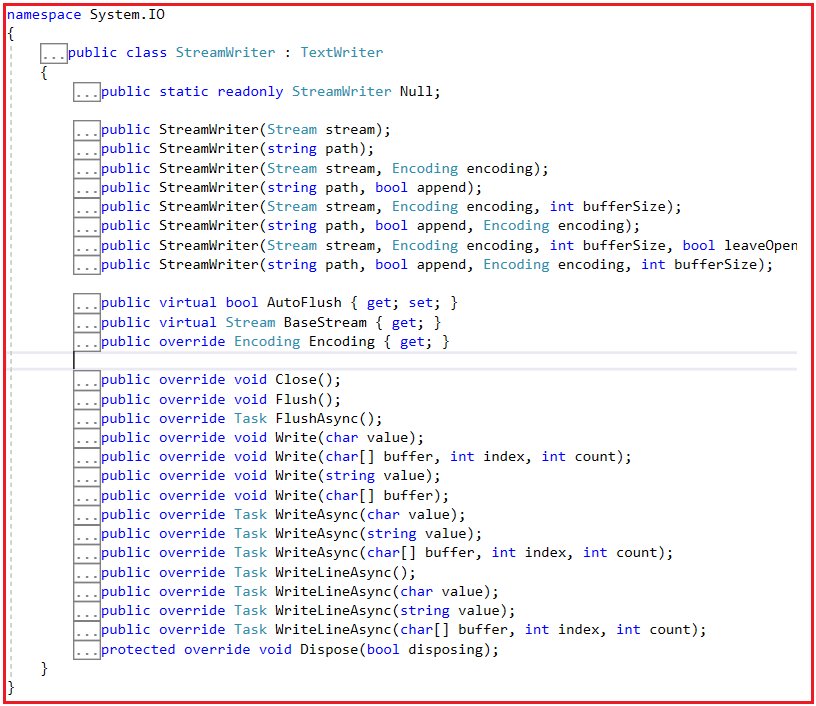
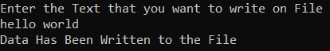
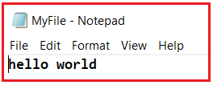
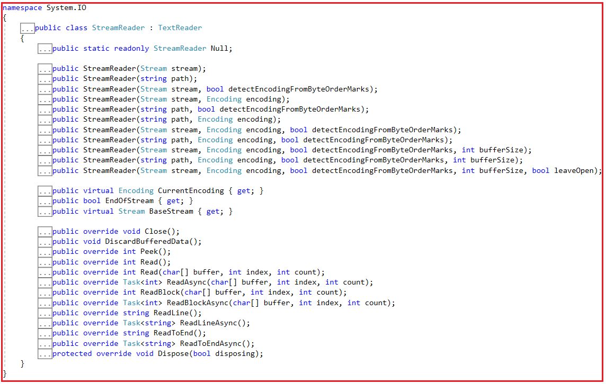
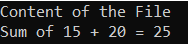
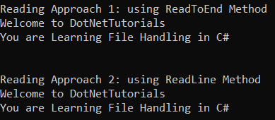

## **StreamReader و StreamWriter در سی شارپ به همراه مثال**

در این مقاله، قصد دارم **StreamReader و StreamWriter را در سی شارپ** با مثال بررسی کنم. لطفاً مقاله قبلی ما را که در آن در مورد کلاس FileStream در سی شارپ با مثال بحث کردیم، مطالعه کنید. در پایان این مقاله، شما خواهید فهمید که StreamReader و StreamWriter در سی شارپ چه هستند و چه زمانی و چگونه می‌توان از StreamReader و StreamWriter در سی شارپ با مثال استفاده کرد.

##### **کلاس StreamWriter در سی شارپ**

کلاس StreamWriter در سی شارپ بیشتر در مدیریت فایل‌ها (File Handling) محبوب است و در نوشتن داده‌های متنی در یک فایل بسیار مفید است. استفاده از آن آسان است و مجموعه‌ای کامل از سازنده‌ها (Constructor) و متدها را برای کار بر روی آن فراهم می‌کند. کلاس StreamWriter در سی شارپ برای نوشتن کاراکترها در استریم با فرمت خاص استفاده می‌شود. اگر به تعریف کلاس StreamWriter بروید، موارد زیر را مشاهده خواهید کرد. کلاس StreamWriter در سی شارپ متعلق به **فضای نام System.IO** است و کلاس انتزاعی **TextWriter را** پیاده‌سازی می‌کند.



همانطور که در تصویر بالا مشاهده می‌کنید، این کلاس شامل تعداد زیادی متد، انواع مختلف سازنده‌ها و چند ویژگی است.

##### **سازنده:**

از سازنده (Constructor) برای مقداردهی اولیه یک نمونه جدید از **کلاس System.IO.StreamWriter** برای فایل مشخص شده در مسیر مشخص شده، Stream مشخص شده، کدگذاری مشخص شده و اندازه بافر استفاده می‌شود. همچنین نسخه‌های بارگذاری شده مختلفی برای روش‌های مختلف ایجاد نمونه‌ای از کلاس StreamWriter دارد.

##### **روش‌ها:**

1. **Close():** این متد شیء StreamWriter فعلی و جریان (stream) زیرین را می‌بندد.
2. **Flush():** این متد داده‌ها را از تمام بافرها برای نویسنده فعلی پاک می‌کند و باعث می‌شود هر داده بافر شده‌ای در جریان اصلی نوشته شود.
3. **Write():** داده‌ها را در جریان می‌نویسد. این تابع برای انواع مختلف داده، overloadهای متفاوتی برای نوشتن در جریان دارد.
4. **WriteLine:** همانند Write() است، اما کاراکتر خط جدید را به انتهای داده‌ها اضافه می‌کند. برای انواع داده‌های مختلف، overloadهای متفاوتی برای نوشتن در stream دارد.
5. **Dispose():** منابع مدیریت نشده مورد استفاده StreamWriter را آزاد می‌کند و به صورت اختیاری منابع مدیریت شده را نیز آزاد می‌کند.

##### **خواص:**

1. **AutoFlush:** مقداری را دریافت یا تنظیم می‌کند که نشان می‌دهد آیا StreamWriter پس از هر بار فراخوانی System.IO.StreamWriter.Write(System.Char) بافر خود را به جریان زیرین تخلیه می‌کند یا خیر.
2. **BaseStream:** جریان زیربنایی که با یک حافظه پشتیبان در ارتباط است را دریافت می‌کند.
3. **Encoding:** متن سیستمی (System.Text.Encoding) که خروجی با آن نوشته می‌شود را برمی‌گرداند.

##### **مثال برای نوشتن ورودی کاربر در یک فایل با استفاده از کلاس StreamWriter در سی شارپ:**

نوشتن داده‌ها در یک فایل متنی با استفاده از کلاس StreamWriter بسیار آسان است و اکثر مبتدیان ترجیح می‌دهند از این کلاس در نوشتن فایل‌ها استفاده کنند. در مثال زیر، ما از سازنده StreamWriter ( **public StreamWriter(string path);** )) استفاده می‌کنیم که مسیر رشته را به عنوان آرگومان برای ایجاد یک نمونه از کلاس StreamWriter دریافت می‌کند. این نمونه StreamWriter فایلی با نام **MyFile.txt** را در مکان مشخص شده یعنی در **درایو D** ایجاد می‌کند. با استفاده از **متد Console.ReadLine()** داده‌های ورودی را از کاربر دریافت می‌کنیم که در **فایل MyFile.txt** خود ذخیره خواهیم کرد. وقتی متد Write را با استفاده از شیء StreamWriter با ارسال داده‌های رشته‌ای فراخوانی می‌کنیم، داده‌های رشته‌ای را در جریان، یعنی در فایل متنی، می‌نویسد. در نهایت، متدهای Flush و Close را برای پاک کردن تمام بافرها و همچنین بستن جریان فراخوانی می‌کنیم. کد مثال زیر خود توضیح است، بنابراین لطفاً برای درک بهتر، خطوط کامنت را مرور کنید.

```csharp
using System;
using System.IO;

namespace FileHandlinDemo
{
    class Program
    {
        static void Main(string[] args)
        {
            // Create an Instance of StreamWriter by specifying the String Path
            // This will create a file with the name MyFile.txt at the specified location i.e. in the D Drive
            // Here we are using the StreamWriter constructor which takes the string path as an argument to create an instance of StreamWriter class
            StreamWriter streamWriter = new StreamWriter("D://MyFile.txt");

            // Asking the user to enter the text that we want to write into the MyFile.txt file
            Console.WriteLine("Enter the Text that you want to write on File");

            // To read the input from the user
            string inputData = Console.ReadLine();

            // To write the data into the stream use the Write Method of the StreamWriter Object
            streamWriter.Write(inputData);
            Console.WriteLine("Data Has Been Written to the File");

            // Clears all the buffers for the current writer by calling the Flush Method of the StreamWriter Object
            streamWriter.Flush();

            // Close the current StreamWriter object and the underlying stream by calling the Flush Method of the StreamWriter Object
            streamWriter.Close();
            Console.ReadKey();
        }
    }
}
```

###### **خروجی:**



حالا، خواهید دید که یک فایل متنی با نام **MyFile.txt** در **درایو D** ایجاد می‌شود و وقتی فایل را باز کنید، داده‌های زیر را که درون آن نوشته شده است، خواهید دید.



##### **ذخیره داده‌های متغیر در فایل در سی شارپ با استفاده از** **کلاس StreamWriter**

چندین بار در برنامه‌های بلادرنگ (Real-Time Applications)، نیاز به ذخیره داده‌های متغیر در یک فایل پیدا می‌کنید. این داده‌های متغیر ممکن است خروجی برنامه ما، جزئیات گزارش (Log details)، استثنائات (Exceptions)، خطاها (Errors)، داده‌های درخواست ورودی برای API شما و غیره باشند. حال، بیایید ببینیم چگونه می‌توانیم داده‌های متغیر را با استفاده از کلاس StreamWriter در C# در یک فایل ذخیره کنیم. برای درک بهتر، لطفاً به مثال زیر نگاهی بیندازید. کد مثال زیر خود توضیح است، بنابراین لطفاً برای درک بهتر، خطوط کامنت را مطالعه کنید.

```csharp
using System;
using System.IO;

namespace FileHandlinDemo
{
    class Program
    {
        static void Main(string[] args)
        {
            //Set the file Path where you want to Create the File
            string filePath = @"D:\\MyFile.txt";

            //Do Some Basic Operations using variables
            int a, b, result;
            a = 15;
            b = 20;
            result = a + b;

            //Now, we want to store the variable a, b, and result in the File

            //Creating the StreamWriter Object inside the using block by using the Constructor which takes the FilePath
            //Using block automatically calls the Flush and Close Method of StreamWriter Object
            using (StreamWriter streamWriter = new StreamWriter(filePath))
            {
                streamWriter.Write($"Sum of {a} + {b} = {result}");
                //No need to call the Flush and Close Method
            }
            Console.WriteLine("Variable Data is Saved into the File");
            Console.ReadKey();
        }
    }
}
```

حالا **فایل D:\\MyFile.txt** را باز کنید، متن زیر را مشاهده خواهید کرد.

**مجموع ۱۵ + ۲۰ = ۲۵**

حال، اگر برنامه را چندین بار اجرا کنید، یک نکته را مشاهده خواهید کرد، هر بار که برنامه را اجرا می‌کنید، StreamWriter محتوای فایل متنی را بازنویسی می‌کند. به جای بازنویسی محتوا، می‌خواهیم محتوا را به فایل متنی اضافه کنیم. اگر می‌خواهید این کار را انجام دهید، باید از نسخه بارگذاری شده دیگر سازنده StreamWriter استفاده کنید که باید پارامتر Boolean Append را بگیرد و در صورت نیاز مقدار true را به آن ارسال کنید.

برای درک بهتر، لطفاً به مثال زیر نگاهی بیندازید. این همان مثال قبلی است. در اینجا، تنها تغییراتی که انجام داده‌ایم این است که از نسخه بارگذاری‌شده‌ی دیگر سازنده‌ی StreamWriter استفاده کرده‌ایم که مسیر رشته‌ای و پارامتر boolean append را می‌گیرد و به جای متد Write، از متد WriteLine از شیء StreamWriter استفاده می‌کنیم.

```csharp
using System;
using System.IO;

namespace FileHandlinDemo
{
    class Program
    {
        static void Main(string[] args)
        {
            //Set the file Path where you want to Create the File
            string filePath = @"D:\\MyFile.txt";

            //Do Some Basic Operations using variables
            int a, b, result;
            a = 15;
            b = 20;
            result = a + b;

            //Now, we want to store the variable a, b, and result in the File

            //Creating the StreamWriter Object inside the using block by using the Constructor which takes the FilePath
            //Using block automatically calls the Flush and Close Method of StreamWriter Object
            //Passing the boolean true for Append which means it will not overwrite instead it will append the content
            using (StreamWriter streamWriter = new StreamWriter(filePath, true))
            {
                streamWriter.WriteLine($"Sum of {a} + {b} = {result}");
                //No need to call the Flush and Close Method
            }
            Console.WriteLine("Variable Data is Saved into the File");
            Console.ReadKey();
        }
    }
}
```

اکنون، با اعمال تغییرات فوق، برنامه را چندین بار اجرا کنید و خواهید دید که محتوا اضافه خواهد شد.

##### **کلاس StreamReader در سی شارپ**

کلاس StreamReader در سی شارپ به ما امکان خواندن فایل‌های متنی را می‌دهد. پیاده‌سازی آن آسان است و در بین توسعه‌دهندگان بسیار محبوب است. با این حال، روش‌های زیادی برای خواندن فایل‌های متنی در سی شارپ وجود دارد، اما کلاس StreamReader در این لیست محبوب‌تر است. هنگام کار با کلاس StreamReader در سی شارپ، باید نکات زیر را به خاطر داشته باشید.

1. یک TextReader پیاده‌سازی می‌کند که کاراکترها را از یک جریان بایت در یک کدگذاری خاص می‌خواند.
2. کلاس StreamReader به طور پیش‌فرض از کدگذاری UTF-8 استفاده می‌کند.
3. کلاس StreamReader برای ورودی کاراکتر در یک کدگذاری خاص طراحی شده است.
4. از این کلاس برای خواندن یک فایل متنی استاندارد استفاده کنید.
5. به طور پیش‌فرض، thread-safe نیست.

اگر به تعریف کلاس StreamReader بروید، موارد زیر را مشاهده خواهید کرد. کلاس StreamReader متعلق به **فضای نام System.IO** است و کلاس انتزاعی **TextReader را** پیاده‌سازی می‌کند. کلاس StreamReader در C# برای خواندن کاراکترها از جریان در یک قالب خاص استفاده می‌شود.



همانطور که در تصویر بالا مشاهده می‌کنید، کلاس StreamReader شامل تعداد زیادی متد، انواع مختلف سازنده‌ها و چند ویژگی است.

##### **سازنده:**

این تابع، بر اساس کدگذاری کاراکتر مشخص شده، گزینه تشخیص ترتیب بایت و اندازه بافر، یک نمونه جدید از کلاس StreamReader را برای مسیر جریان یا رشته مشخص شده مقداردهی اولیه می‌کند و به صورت اختیاری جریان را باز می‌گذارد. این تابع نسخه‌های بارگذاری شده مختلفی دارد که می‌توانید در تصویر بالا مشاهده کنید.

##### **روش‌ها:**

1. **Close():** متد Close شیء StreamReader و جریان زیرین را می‌بندد و منابع سیستمی مرتبط با خواننده را آزاد می‌کند.
2. **Peek():** این متد کاراکتر بعدی موجود را برمی‌گرداند اما آن را مصرف نمی‌کند. یک عدد صحیح نشان‌دهنده کاراکتر بعدی است که باید خوانده شود، یا اگر هیچ کاراکتری برای خواندن وجود نداشته باشد یا اگر جریان از جستجو پشتیبانی نکند، -1 را نشان می‌دهد.
3. **Read():** این متد کاراکتر بعدی را از جریان ورودی می‌خواند و موقعیت کاراکتر را یک کاراکتر به جلو می‌برد. کاراکتر بعدی از جریان ورودی به عنوان یک شیء System.Int32 نمایش داده می‌شود، یا اگر کاراکتر بیشتری در دسترس نباشد -1 می‌شود.
4. **ReadLine():** این متد یک خط از کاراکترها را از جریان فعلی می‌خواند و داده‌ها را به صورت رشته برمی‌گرداند. خط بعدی از جریان ورودی، یا اگر به انتهای جریان ورودی رسیده باشیم، null.
5. **تابع ()Seek** برای خواندن/نوشتن در یک مکان خاص از یک فایل استفاده می‌شود.

##### **خواص:**

1. **CurrentEncoding:** این متد، کدگذاری کاراکتر فعلی که شیء System.IO.StreamReader فعلی از آن استفاده می‌کند را دریافت می‌کند.
2. **EndOfStream:** مقداری دریافت می‌کند که نشان می‌دهد آیا موقعیت فعلی استریم در انتهای استریم قرار دارد یا خیر.
3. **BaseStream:** جریان اصلی را برمی‌گرداند.

##### **مثال خواندن داده از یک فایل با استفاده از کلاس StreamReader در سی شارپ:**

در مثال زیر ابتدا متغیر File Path را ایجاد می‌کنیم که مسیر فایل موجود در جایی که داده‌های ما ذخیره شده‌اند را نگه می‌دارد. سپس با ارسال متغیر file Path برای خواندن داده‌ها از فایل، یک نمونه از StreamReader ایجاد می‌کنیم. سپس با فراخوانی متد Seek از استریم اصلی شیء StreamReader، مشخص می‌کنیم که خواندن استریم ورودی از کجا شروع شود. سپس از متد ReadLine شیء StreamReader برای خواندن خطوط کاراکتر از استریم استفاده می‌کنیم و از یک حلقه while برای خواندن تمام خطوط کاراکتر از استریم استفاده می‌کنیم. در نهایت، استریم را با فراخوانی متد Close شیء streamReader می‌بندیم. کد مثال زیر نیازی به توضیح ندارد، بنابراین لطفاً برای درک بهتر، خطوط توضیحات را مطالعه کنید.

```csharp
using System;
using System.IO;

namespace FileHandlinDemo
{
    class Program
    {
        static void Main(string[] args)
        {
            //Create a Variable to Hold the String Path
            string filePath = "D://MyFile.txt";

            //Creating an Instance StreamReader Object to Read the Data from the File Path
            StreamReader streamReader = new StreamReader(filePath);

            Console.WriteLine("Content of the File");

            // This is used to specify from where to start reading the input stream
            // BaseStream: Returns the underlying stream.
            // Seek: The new position within the current stream.
            // SeekOrigin.Begi: Specifies the beginning of a stream
            streamReader.BaseStream.Seek(0, SeekOrigin.Begin);

            //It reads a line of characters from the current stream and returns the data as a string.
            //It return the next line from the input stream, or null if the end of the input stream is reached.
            string strData = streamReader.ReadLine();

            // To Read the whole file line by line use While Loop as long the strData is not null
            while (strData != null)
            {
                //Print the String data
                Console.WriteLine(strData);
                //Then Read the next String data
                strData = streamReader.ReadLine();
            }
            Console.ReadLine();

            //Close the streamReader Object
            streamReader.Close();
            Console.ReadKey();
        }
    }
}
```

###### **خروجی:**



##### **خواندن داده‌ها با استفاده از متد ReadToEnd از شیء StreamReader:**

به جای استفاده از متد ReadLine، می‌توانیم از متد ReadToEnd نیز برای خواندن تمام محتوای فایل متنی استفاده کنیم. برای درک بهتر، لطفاً به مثال زیر نگاهی بیندازید. در اینجا، به جای استفاده از متد ReadLine، از متد ReadToEnd از شیء StreamReader استفاده می‌کنیم.

```csharp
using System;
using System.IO;

namespace FileHandlinDemo
{
    class Program
    {
        static void Main(string[] args)
        {
            //Create a Variable to Hold the String Path
            string filePath = "D://MyFile.txt";

            //Creating an Instance StreamReader Object to Read the Data from the File Path
            StreamReader streamReader = new StreamReader(filePath);

            Console.WriteLine("Content of the File");

            //Reading text file using StreamReader Class            
            using (StreamReader reader = new StreamReader(filePath))
            {
                Console.WriteLine(reader.ReadToEnd());
            }

            Console.ReadKey();
        }
    }
}
```

###### **خروجی:**


##### **استفاده از کلاس‌های StreamReader و** **StreamWriter** **در سی شارپ**

همانطور که بحث شد، خواندن یک فایل متنی با استفاده از کلاس StreamReader در سی شارپ بسیار آسان است. در مثال زیر، ما کار زیر را انجام می‌دهیم:

- نوشتن مقداری داده روی یک فایل متنی با استفاده از کلاس StreamWriter
- آن داده‌ها را با استفاده از کلاس StreamReader بخوانید.

در مثال زیر، ما از هر دو کلاس StreamWriter و StreamReader برای انجام عملیات نوشتن و خواندن روی یک فایل استفاده می‌کنیم. در اینجا، دو رویکرد برای خواندن داده‌ها از یک فایل متنی، یعنی استفاده از **متد ReadToEnd** در StreamReader و همچنین **متد ReadLine** را نشان می‌دهم. کد مثال زیر نیازی به توضیح ندارد، بنابراین لطفاً برای درک بهتر، خطوط توضیحات را مطالعه کنید.

```csharp
using System;
using System.IO;

namespace FileHandlinDemo
{
    class Program
    {
        static void Main(string[] args)
        {
            //Set The File Path
            string filePath = @"D:\\MyTextFile.txt";

            //Write Some data to a text file using StreamWriter
            using (StreamWriter streamWriter = new StreamWriter(filePath))
            {
                streamWriter.WriteLine("Welcome to DotNetTutorials");
                streamWriter.WriteLine("You are Learning File Handling in C#");
            }

            //Reading text file using StreamReader Class ReadToEnd Method
            Console.WriteLine("\nReading Approach 1: using ReadToEnd Method");
            using (StreamReader reader = new StreamReader(filePath))
            {
                Console.WriteLine(reader.ReadToEnd());
            }

            //Another Approach to Read the Data from a text file using StreamReader ReadLine Method
            Console.WriteLine("\nReading Approach 2: using ReadLine Method");
            StreamReader streamReader = new StreamReader(filePath);
            streamReader.BaseStream.Seek(0, SeekOrigin.Begin);
            string strData = streamReader.ReadLine();
            while (strData != null)
            {
                Console.WriteLine(strData);
                strData = streamReader.ReadLine();
            }

            Console.ReadKey();
        }
    }
}
```

###### **خروجی:**

