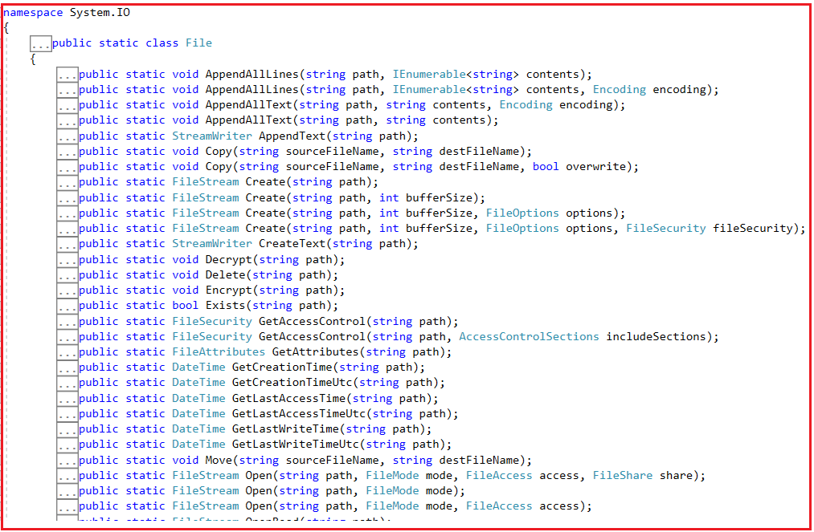
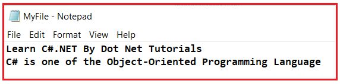
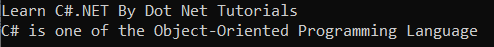
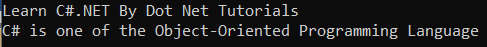
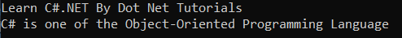
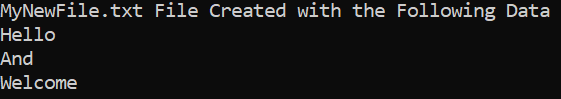

## **کلاس فایل در سی شارپ به همراه مثال**

به همراه مثال خواهم پرداخت **در این مقاله، به بررسی نحوه پیاده‌سازی مدیریت فایل با استفاده از** **کلاس فایل در سی‌شارپ** . لطفاً مقاله قبلی ما در مورد نحوه پیاده‌سازی مدیریت فایل در سی‌شارپ با استفاده از کلاس‌های StreamWriter و StreamReader به همراه مثال را مطالعه کنید.

##### **کلاس فایل در سی شارپ**

کلاس فایل در سی شارپ، متدهای استاتیکی را برای انجام اکثر عملیات روی فایل، مانند ایجاد فایل، کپی و انتقال فایل، حذف فایل‌ها و کار با FileStream برای خواندن و نوشتن استریم‌ها ارائه می‌دهد. **کلاس فایل** تعریف شده است **در فضای نام System.IO** . ممکن است موقعیت‌هایی وجود داشته باشد که بخواهید مستقیماً با فایل‌ها کار کنید. عملیات اصلی روی فایل که معمولاً انجام می‌دهیم به شرح زیر است:

1. **خواندن** : این عملیات، عملیات خواندن پایه است که در آن داده‌ها از یک فایل خوانده می‌شوند.
2. **نوشتن** : این عملیات، عملیات نوشتن پایه است که در آن داده‌ها در یک فایل نوشته می‌شوند. تمام محتویات موجود به طور پیش‌فرض از فایل حذف شده و محتوای جدید نوشته می‌شود.
3. **اضافه کردن (Appending)** : این عملیات نیز شامل نوشتن اطلاعات در یک فایل است. تنها تفاوت این است که داده‌های موجود در یک فایل رونویسی نمی‌شوند. داده‌های جدیدی که قرار است نوشته شوند، در انتهای فایل اضافه می‌شوند.

کلاس File در سی شارپ متدهای استاتیک زیادی برای جابجایی، کپی، خواندن، نوشتن و حذف فایل‌ها ارائه می‌دهد. File متعلق به فضای نام System.IO است؛ اگر به تعریف کلاس File بروید، موارد زیر را مشاهده خواهید کرد.



##### **متدهای کلاس فایل در سی شارپ:**

متدهای رایج کلاس File در سی شارپ به شرح زیر هستند.

1. **کپی** : این متد برای کپی کردن یک فایل موجود در یک فایل جدید استفاده می‌شود. رونویسی فایلی با نام مشابه مجاز نیست.
2. **Create** : این متد، یک شیء را در مسیر مشخص شده ایجاد یا بازنویسی می‌کند.
3. **رمزگشایی** : این متد برای رمزگشایی فایلی که توسط حساب کاربری فعلی با استفاده از متد System.IO.File.Encrypt(System.String) رمزگذاری شده است، استفاده می‌شود.
4. **حذف** : از این متد برای حذف فایل مشخص شده استفاده می‌شود.
5. **رمزگذاری** : این روش برای رمزگذاری یک فایل استفاده می‌شود، به طوری که فقط حسابی که برای رمزگذاری فایل استفاده شده است، بتواند آن را رمزگشایی کند.
6. **Open** : این متد برای باز کردن یک System.IO.FileStream در مسیر مشخص شده، با حالت مشخص شده با دسترسی خواندن، نوشتن یا خواندن/نوشتن و گزینه اشتراک گذاری مشخص شده، استفاده می‌شود.
7. **Move** : این متد برای انتقال یک فایل مشخص شده به یک مکان جدید استفاده می‌شود و امکان تعیین نام جدید برای فایل را نیز فراهم می‌کند.
8. **Exists** : این متد برای بررسی وجود یا عدم وجود فایل مشخص شده استفاده می‌شود.
9. **OpenRead** : این متد برای باز کردن یک فایل موجود جهت خواندن استفاده می‌شود.
10. **OpenText** : این متد یک فایل متنی کدگذاری شده UTF-8 موجود را برای خواندن باز می‌کند.
11. **OpenWrite** : این متد برای باز کردن یک فایل موجود یا ایجاد یک فایل جدید برای نوشتن استفاده می‌شود.
12. **ReadAllBytes** : این متد برای باز کردن یک فایل باینری، خواندن محتویات فایل در یک آرایه بایتی و سپس بستن فایل استفاده می‌شود.
13. **ReadAllLines** : این متد برای باز کردن یک فایل، خواندن تمام خطوط فایل با کدگذاری مشخص شده و سپس بستن فایل استفاده می‌شود.
14. **ReadAllText** : این متد برای باز کردن یک فایل متنی، خواندن تمام متن موجود در فایل و سپس بستن فایل استفاده می‌شود.
15. **ReadLines** : این متد برای خواندن خطوط یک فایل استفاده می‌شود.
16. **جایگزینی** : این متد برای جایگزینی محتویات یک فایل مشخص با محتویات فایل دیگر، حذف فایل اصلی و ایجاد پشتیبان از فایل جایگزین شده استفاده می‌شود.
17. **WriteAllBytes** : این متد برای ایجاد یک فایل جدید، نوشتن آرایه بایت مشخص شده در فایل و سپس بستن فایل استفاده می‌شود. اگر فایل هدف از قبل وجود داشته باشد، روی آن رونویسی می‌شود.
18. **WriteAllLines** : این متد برای ایجاد یک فایل جدید، نوشتن آرایه رشته‌ای مشخص شده در فایل و سپس بستن فایل استفاده می‌شود.
19. **WriteAllText** : این متد برای ایجاد یک فایل جدید، نوشتن رشته مشخص شده در فایل و سپس بستن فایل استفاده می‌شود. اگر فایل هدف از قبل وجود داشته باشد، روی آن رونویسی می‌شود.

##### **مثال برای درک کلاس فایل در سی شارپ:**

زبان سی شارپ و چارچوب دات نت می‌توانند با کمک چندین متد از کلاس File با فایل‌ها کار کنند. بیایید نحوه استفاده از متدهای استاتیک کلاس File را برای انجام عملیات مختلف روی فایل‌ها با مثال‌ها بررسی کنیم. فرض کنید فایلی در **درایو D** به نام **MyFile.txt** داریم . **فایل MyFile.txt** یک فایل متنی ساده خواهد بود و دارای ۲ خط داده به شرح زیر است:

**آموزش سی شارپ دات نت (C#.NET) با دات نت (Dot Net)**  
**سی شارپ یکی از زبان‌های برنامه‌نویسی شیءگرا است**



حالا، یک برنامه کنسول ساده ایجاد می‌کنیم و با متدهای استاتیک کلاس فایل برای انجام عملیات مختلف روی فایل‌ها کار خواهیم کرد.

##### **متد کلاس فایل در سی شارپ وجود دارد**

متد Exists از کلاس File در C# برای بررسی وجود یک فایل خاص استفاده می‌شود. اگر فراخوانی‌کننده مجوزهای لازم را داشته باشد و مسیر شامل نام یک فایل موجود باشد، این متد مقدار true را برمی‌گرداند؛ در غیر این صورت، مقدار false را برمی‌گرداند. این متد همچنین اگر Path **تهی** ، یک **مسیر نامعتبر** یا یک **رشته با طول صفر** باشد، مقدار false را برمی‌گرداند . اگر فراخوانی‌کننده مجوزهای کافی برای خواندن فایل مشخص شده نداشته باشد، هیچ استثنایی ایجاد نمی‌شود و متد صرف نظر از وجود مسیر، مقدار false را برمی‌گرداند.

حالا، بیایید کدی را که می‌تواند برای بررسی وجود فایل MyFile.txt ما استفاده شود، بررسی کنیم. بنابراین، کد زیر را کپی کرده و در کلاس Program برنامه کنسول خود قرار دهید. متد Exits یک متد استاتیک از کلاس File است، بنابراین ما این متد را با نام کلاس، یعنی File، فراخوانی می‌کنیم. این متد یک پارامتر دریافت می‌کند که مسیر فایل است.

```csharp
using System;
using System.IO;

namespace FileClassDemo
{
    class Program
    {
        static void Main(string[] args)
        {
            //Set the File Path
            string FilePath = @"D:\\MyFile.txt";

            //Check if the File Exists using the Static Exists Method of the File Class
            //Exits Method will take the string File Path as a parameter
            if (File.Exists(FilePath))
            {
                Console.WriteLine("MyFile.txt File Exists in D Directory");
            }
            else
            {
                Console.WriteLine("MyFile.txt File Does Not Exist in D Directory");
            }
            Console.ReadKey();
        }
    }
}
```

##### **توضیح کد:**

را در یک متغیر رشته‌ای به نام FilePath ذخیره می‌کنیم **ابتدا، مسیر فایل MyFile.txt** . سپس، از متد Exists برای بررسی وجود فایل استفاده می‌کنیم. در صورت وجود فایل در مسیر مشخص شده، مقدار true برگردانده می‌شود.

اگر مقدار درست (true) دریافت کنیم، پیام « **فایل MyFile.txt در دایرکتوری D وجود دارد** » را در پنجره کنسول می‌نویسیم؛ در غیر این صورت، اگر مقدار نادرست (false) دریافت کنیم، پیام « **فایل MyFile.txt در دایرکتوری D وجود ندارد** دریافت خواهید کرد **» را در پنجره کنسول می‌نویسیم. بنابراین، وقتی کد بالا را اجرا می‌کنید، خروجی زیر را به عنوان فایل MyFile.txt در دایرکتوری D وجود دارد (y)** .


##### **متد ReadAllLines از کلاس File در سی شارپ:**

متد استاتیک ReadAllLines از کلاس File در سی شارپ برای باز کردن یک فایل، خواندن تمام خطوط به صورت تک تک از فایل و سپس بستن فایل استفاده می‌شود. سپس خطوط در یک متغیر آرایه رشته‌ای ذخیره می‌شوند.

برای درک بهتر، لطفاً به مثال زیر نگاهی بیندازید. در مثال زیر، ابتدا یک متغیر رشته‌ای برای ذخیره مسیر فایل ایجاد می‌کنیم. سپس، با استفاده از متد استاتیک Exists از کلاس File، وجود فایل را بررسی می‌کنیم. اگر فایل وجود داشته باشد، تمام خطوط آن را با استفاده از متد استاتیک ReadAllLines از کلاس File می‌خوانیم و آن را در یک آرایه رشته‌ای ذخیره می‌کنیم. سپس، از یک حلقه for each برای خواندن تمام خطوط به صورت یک به یک و چاپ همان در پنجره کنسول استفاده می‌کنیم. کد زیر نیازی به توضیح ندارد، بنابراین لطفاً برای درک بهتر، خطوط کامنت را مطالعه کنید.

```csharp
using System;
using System.IO;

namespace FileClassDemo
{
    class Program
    {
        static void Main(string[] args)
        {
            //Set the File Path
            string FilePath = @"D:\\MyFile.txt";

            //Check if the File Exists using the Static Exists Method of the File Class
            //Exits Method will take the string File Path as a parameter
            if (File.Exists(FilePath))
            {
                //If the File Exists, Read All the Lines from the File using ReadAllLines Method 
                //ReadAllLines Method returns a string array
                string[] lines = File.ReadAllLines(FilePath);

                //Using a for Each loop to access each line from the string array i.e. lines
                foreach (var line in lines)
                {
                    Console.WriteLine(line);
                }
            }
            else
            {
                Console.WriteLine("MyFile.txt File Does Not Exist in D Directory");
            }
            Console.ReadKey();
        }
    }
}
```

از آنجایی که فایل ما شامل دو خط داده است، وقتی کد بالا را اجرا کنید، خروجی زیر را دریافت خواهید کرد.



##### **متد ReadAllText از کلاس File در سی شارپ**

متد ReadAllText از کلاس File در سی شارپ برای باز کردن یک فایل متنی، خواندن تمام متن موجود در فایل و سپس بستن فایل استفاده می‌شود. در این حالت، تمام متن فایل به طور همزمان خوانده می‌شود. سپس متن در یک متغیر رشته‌ای ذخیره می‌شود.

برای درک بهتر، لطفاً به مثال زیر نگاهی بیندازید. در مثال زیر، ابتدا یک متغیر رشته‌ای به نام FilePath برای ذخیره مسیر فایل ایجاد می‌کنیم. سپس، با استفاده از متد Static Exists از کلاس File، وجود فایل را بررسی می‌کنیم. اگر فایل وجود داشته باشد، با استفاده از متد ReadAllText از کلاس File، تمام متن فایل را به طور همزمان می‌خوانیم و نتیجه را در یک متغیر رشته‌ای ذخیره می‌کنیم. سپس، همان را در پنجره کنسول چاپ می‌کنیم. کد زیر نیازی به توضیح ندارد، بنابراین لطفاً برای درک بهتر، خطوط کامنت را مطالعه کنید.

```csharp
using System;
using System.IO;

namespace FileClassDemo
{
    class Program
    {
        static void Main(string[] args)
        {
            //Set the File Path
            string FilePath = @"D:\\MyFile.txt";

            //Check if the File Exists using the Static Exists Method of the File Class
            //Exits Method will take the string File Path as a parameter
            if (File.Exists(FilePath))
            {
                //If the File Exists, Read All Text from a file at once using ReadAllText Method 
                //ReadAllText: Opens a text file, reads all the text in the file, and then closes the file.
                //ReadAllText Method returns a string containing all the text in the file.
                string lines = File.ReadAllText(FilePath);
                Console.WriteLine(lines);
            }
            else
            {
                Console.WriteLine("MyFile.txt File Does Not Exist in D Directory");
            }
            Console.ReadKey();
        }
    }
}
```

وقتی کد بالا را اجرا کنید، خروجی زیر را دریافت خواهید کرد.



##### **روش کپی کردن کلاس فایل در سی شارپ:**

متد کپی استاتیک از کلاس File در C# برای ایجاد کپی از یک فایل موجود استفاده می‌شود. مهمترین نکته‌ای که باید به خاطر داشته باشید این است که رونویسی یک فایل با نام مشابه با استفاده از متد Copy از کلاس File مجاز نیست. شما باید نام متفاوتی بدهید. متد Copy دو پارامتر می‌گیرد. پارامتر اول sourceFileName است، یعنی فایلی که باید کپی شود، و پارامتر دوم destFileName است، یعنی نام فایل مقصد، و فایل مقصد نمی‌تواند یک دایرکتوری یا یک فایل موجود باشد.

برای درک بهتر، لطفاً به مثال زیر نگاهی بیندازید. در مثال زیر، ابتدا دو متغیر رشته‌ای به نام‌های SourceFilePath و DestinationFilePath ایجاد می‌کنیم تا به ترتیب مسیرهای فایل منبع و مقصد را ذخیره کنند. سپس، با استفاده از متد استاتیک Exists از کلاس File، بررسی می‌کنیم که آیا فایل منبع وجود دارد یا خیر. اگر فایل منبع وجود داشته باشد، متد استاتیک Copy از کلاس File را برای کپی کردن فایل منبع **MyFile.txt** به فایل مقصد **MyFileCopy.txt** فراخوانی می‌کنیم. سپس، با استفاده از متد استاتیک ReadAllText از کلاس File، داده‌های فایل مقصد را در پنجره کنسول چاپ می‌کنیم. کد زیر نیازی به توضیح ندارد، بنابراین لطفاً برای درک بهتر، خطوط کامنت را مطالعه کنید.

```csharp
using System;
using System.IO;

namespace FileClassDemo
{
    class Program
    {
        static void Main(string[] args)
        {
            //Set the Source and Destination File Paths
            string SourceFilePath = @"D:\\MyFile.txt";
            string DestinationFilePath = @"D:\\MyFileCopy.txt";

            //Check if the SourceFilePath Exists using the Exists Method of the File Class
            if (File.Exists(SourceFilePath))
            {
                //If the SourceFilePath Exists, then copy the File content to a new File using the Copy Method 
                //We are coping the SourceFilePath to DestinationFilePath
                File.Copy(SourceFilePath, DestinationFilePath);

                //Read the Text from DestinationFilePath using ReadAllText Method
                string lines = File.ReadAllText(DestinationFilePath);

                //Print the Data of the DestinationFilePath
                Console.WriteLine(lines);
            }
            else
            {
                Console.WriteLine("MyFile.txt File Does Not Exist in D Directory");
            }
            Console.ReadKey();
        }
    }
}
```

بنابراین، وقتی کد بالا را اجرا می‌کنید، خروجی زیر را دریافت خواهید کرد.



حالا می‌توانید ببینید که **MyFileCopy.txt** باید داخل درایو D ایجاد شود. باید به خاطر داشته باشید که فایل مقصد نمی‌تواند یک دایرکتوری یا یک فایل موجود باشد. برای مثال، **فایل MyFileCopy.txt** از قبل داخل درایو D ایجاد شده است. دوباره، اگر همان کد را اجرا کنید، با خطای زیر مواجه خواهید شد.

**System.IO.IOException: 'فایل 'D:\\MyFileCopy.txt' از قبل وجود دارد.'**

نسخه بارگذاری‌شده‌ی دیگری از متد Copy در داخل کلاس File با امضای زیر موجود است. برای بازنویسی یک فایل موجود، می‌توانید پارامتر سوم را به صورت true یا false ارسال کنید. بنابراین، نسخه بارگذاری‌شده‌ی زیر از متد Copy برای کپی کردن یک فایل موجود در یک فایل جدید استفاده می‌شود. بازنویسی فایلی با نام مشابه مجاز است.

**کپی کردن از نوع استاتیک عمومی (رشته منبع نام فایل، رشته dest نام فایل، بازنویسی bool)؛**

بنابراین، بیایید مثال قبلی را اصلاح کنیم، از نسخه سربارگذاری شده فوق استفاده کنیم و خروجی را ببینیم.

```csharp
using System;
using System.IO;

namespace FileClassDemo
{
    class Program
    {
        static void Main(string[] args)
        {
            //Set the Source and Destination File Paths
            string SourceFilePath = @"D:\\MyFile.txt";
            string DestinationFilePath = @"D:\\MyFileCopy.txt";

            //Check if the SourceFilePath Exists using the Exists Method of the File Class
            if (File.Exists(SourceFilePath))
            {
                //If the SourceFilePath Exists, then copy the File content to a new File using the Copy Method 
                //We are coping the SourceFilePath to DestinationFilePath
                //Passing the third parameter boolean overwrite as true
                File.Copy(SourceFilePath, DestinationFilePath, true);

                //Read the Text from DestinationFilePath using ReadAllText Method
                string lines = File.ReadAllText(DestinationFilePath);

                //Print the Data of the DestinationFilePath
                Console.WriteLine(lines);
            }
            else
            {
                Console.WriteLine("MyFile.txt File Does Not Exist in D Directory");
            }
            Console.ReadKey();
        }
    }
}
```

حالا کد بالا را اجرا کنید، هیچ خطایی دریافت نخواهید کرد.

##### **روش حذف کلاس فایل در سی شارپ:**

متد استاتیک Delete از کلاس File در C# برای حذف یک فایل موجود استفاده می‌شود. این متد یک پارامتر می‌گیرد که مسیر فایلی است که قرار است حذف شود.

برای درک بهتر، لطفاً به مثال زیر نگاهی بیندازید. در مثال زیر، ابتدا یک متغیر رشته‌ای به نام FilePath برای ذخیره مسیر فایل ایجاد می‌کنیم. سپس، با استفاده از متد Exists از کلاس File، وجود فایل را بررسی می‌کنیم. اگر فایل وجود داشته باشد، متد استاتیک Delete از کلاس File را فراخوانی می‌کنیم و مسیر فایل را برای حذف **فایل MyFileCopy.txt** ارسال می‌کنیم . کد زیر نیازی به توضیح ندارد، بنابراین لطفاً برای درک بهتر، خطوط کامنت را مطالعه کنید.

```csharp
using System;
using System.IO;

namespace FileClassDemo
{
    class Program
    {
        static void Main(string[] args)
        {
            //Set the File Path
            string FilePath = @"D:\\MyFileCopy.txt";

            //Check if the FilePath Exists using the Exists Method of the File Class
            if (File.Exists(FilePath))
            {
                //If the FilePath Exists, then Delete the File using the Delete Method of the File class
                //To the Delete Method, pass the FilePath which File you want to delete
                File.Delete(FilePath);
                Console.WriteLine("MyFileCopy.txt File Deleted");
            }
            else
            {
                Console.WriteLine("MyFileCopy.txt File Does Not Exist in D Directory");
            }
            Console.ReadKey();
        }
    }
}
```

بنابراین، وقتی کد بالا را اجرا می‌کنید، خروجی زیر را دریافت خواهید کرد.

**فایل MyFileCopy.txt حذف شد**

##### **ایجاد متد از کلاس فایل در سی شارپ**

متد استاتیک Create از کلاس File در سی شارپ، یک فایل را در پوشه یا دایرکتوری مشخص شده ایجاد می‌کند. چندین نسخه overload شده از این متد در کلاس File موجود است. آنها به شرح زیر هستند:

1. **public static FileStream Create(string path) :** یک فایل را در مسیر مشخص شده ایجاد یا بازنویسی می‌کند.
2. **public static FileStream Create(string path, int bufferSize) :** فایل مشخص شده را ایجاد یا بازنویسی می‌کند. پارامتر bufferSize تعداد بایت‌های ذخیره شده در بافر برای خواندن و نوشتن در فایل را مشخص می‌کند.
3. **public static FileStream Create(string path, int bufferSize, FileOptions options) :** فایل مشخص شده را ایجاد یا رونویسی می‌کند، اندازه بافر و مقدار FileOptions را که نحوه ایجاد یا رونویسی فایل را شرح می‌دهد، مشخص می‌کند.
4. **public static FileStream Create(string path, int bufferSize, FileOptions options, FileSecurity fileSecurity) :** فایل مشخص شده را با اندازه بافر، گزینه‌های فایل و امنیت فایل مشخص شده ایجاد یا بازنویسی می‌کند.

**نکته:** تمام نسخه‌های overload شده‌ی فوق، نمونه‌ای از کلاس FileStream را برمی‌گردانند. بنابراین، باید با فراخوانی متد Close، شیء stream را ببندیم.

بیایید با یک مثال، متد استاتیک Create از کلاس File را درک کنیم. در مثال زیر، ابتدا یک متغیر رشته‌ای به نام FilePath ایجاد می‌کنیم که مسیر فایلی را که با استفاده از متد Create ایجاد خواهیم کرد، مشخص می‌کند. سپس، متد Create را با ارسال FilePath فراخوانی می‌کنیم که **فایل MyNewFile.txt** را در **درایو D** ایجاد کرده و شیء FileStream را برمی‌گرداند. سپس، بلافاصله، **شیء FileStream** را با فراخوانی **متد Close** می‌بندیم . سپس، با استفاده از متد Exists از کلاس File، بررسی می‌کنیم که آیا **فایل MyNewFile.txt** وجود دارد یا خیر. اگر فایل MyNewFile.txt وجود داشته باشد، ما یک آرایه رشته‌ای ایجاد می‌کنیم که حاوی مقداری داده است و سپس **با ارسال آرایه FilePath و رشته، متد WriteAllLines** را فراخوانی می‌کنیم . متد WriteAllLines داده‌های آرایه رشته‌ای را در فایل مشخص شده می‌نویسد. و در نهایت، ما محتوای فایل MyNewFile.txt را با استفاده از متد ReadAllText می‌خوانیم و آن را در کنسول چاپ می‌کنیم. کد زیر نیازی به توضیح ندارد، بنابراین لطفاً برای درک بهتر، خطوط کامنت را بررسی کنید.

```csharp
using System;
using System.IO;

namespace FileClassDemo
{
    class Program
    {
        static void Main(string[] args)
        {
            //Set the File Path where you want to create the File
            string FilePath = @"D:\\MyNewFile.txt";

            //Creating the File using the static Create method of the File class
            //To the Create Method, we need to pass the FilePath where we want to Create the File
            //The Create Method will return the FileStream object
            FileStream fileStream = File.Create(FilePath);

            //Closing the FileStream Object immediately once the File is Created
            fileStream.Close();

            //Check if the FilePath Exists using the Exists Method of the File Class
            if (File.Exists(FilePath))
            {
                //If the File Exists, Write Content to the File
                //Creating a string array to Hold the Data
                string[] content = { "Hello", "And", "Welcome" };

                //using the WriteAllLines Method, we are writing the data
                File.WriteAllLines(FilePath, content);

                Console.WriteLine("MyNewFile.txt File Created with the Following Data");
                //Reading the data from the File using ReadAllText Method
                string fileContent = File.ReadAllText(FilePath);

                //Printing the Data in the Console
                Console.WriteLine(fileContent);
            }
            else
            {
                Console.WriteLine("MyNewFile.txt File Does Not Exist in D Directory");
            }
            Console.ReadKey();
        }
    }
}
```

بنابراین، وقتی کد بالا را اجرا می‌کنید، خروجی زیر را دریافت خواهید کرد.

