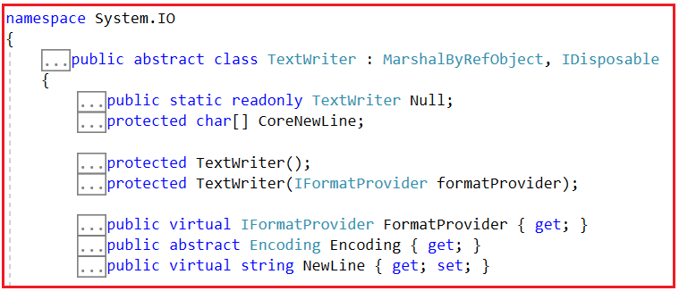
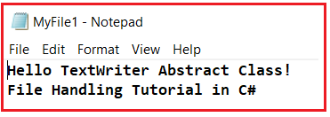
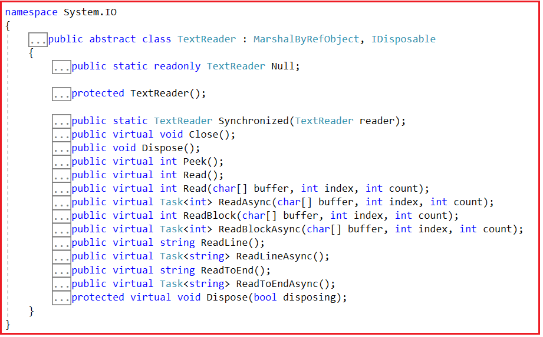
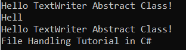

## **TextWriter و TextReader در سی شارپ به همراه مثال**

در این مقاله، قصد دارم **TextWriter و TextReader را در سی شارپ** با مثال بررسی کنم. لطفاً مقاله قبلی ما را که در آن در مورد کلاس فایل در سی شارپ با مثال بحث کردیم، مطالعه کنید. در پایان این مقاله، شما خواهید فهمید که TextWriter و TextReader در سی شارپ چه هستند و چه زمانی و چگونه می‌توان از TextWriter و TextReader در سی شارپ با مثال استفاده کرد.

##### **کلاس‌های TextWriter و TextReader در سی شارپ:**

کلاس‌های TextReader و TextWriter در سی‌شارپ به ترتیب روش دیگری برای خواندن و نوشتن فایل‌ها هستند، هرچند که این کلاس‌ها، کلاس‌های جریانی نیستند. TextReader و TextWriter کلاس‌های پایه هستند. StreamReader و StringReader از نوع انتزاعی TextReader مشتق می‌شوند. به طور مشابه، StreamWriter و StringWriter از نوع انتزاعی TextWriter مشتق می‌شوند.

##### **کلاس TextWriter در سی شارپ چیست؟**

کلاس TextWriter در سی شارپ، یک نویسنده است که می‌تواند مجموعه‌های متوالی از کاراکترها را بنویسد. ما می‌توانیم از این کلاس TextWriter برای نوشتن متن در یک فایل استفاده کنیم. این یک کلاس پایه انتزاعی از StreamWriter و StringWriter است که به ترتیب کاراکترها را در جریان‌ها و رشته‌ها می‌نویسند. این کلاس برای نوشتن متن یا مجموعه‌های متوالی از کاراکترها در فایل‌ها استفاده می‌شود. این کلاس در **فضای نام System.IO** یافت می‌شود . اگر به تعریف کلاس TextWriter بروید، خواهید دید که همانطور که در تصویر زیر نشان داده شده است، یک کلاس انتزاعی است.



##### **متدهای کلاس TextWriter در سی شارپ:**

1. **Synchronized(TextWriter)** : برای ایجاد یک پوشش thread-safe حول TextWriter مشخص شده استفاده می‌شود.
2. **تابع ()Close** نویسنده‌ی فعلی را می‌بندد و منابع سیستمی مرتبط با نویسنده را آزاد می‌کند.
3. **Dispose():** تمام منابع مورد استفاده توسط شیء System.IO.TextWriter را آزاد می‌کند.
4. **Flush():** تمام بافرها را برای نویسنده فعلی پاک می‌کند و باعث می‌شود هر داده بافر شده روی دستگاه اصلی نوشته شود.
5. **Write(Char):** برای نوشتن یک کاراکتر در جریان متن استفاده می‌شود.
6. **Write(String):** برای نوشتن رشته در جریان متن استفاده می‌شود.
7. **WriteAsync(Char):** برای نوشتن کاراکتر در جریان متن به صورت غیرهمزمان استفاده می‌شود.
8. **WriteLine():** برای نوشتن یک خاتمه دهنده خط در جریان متن استفاده می‌شود.
9. **WriteLineAsync(String):** برای نوشتن رشته در جریان متن به صورت غیرهمزمان و به دنبال آن یک خاتمه دهنده خط استفاده می‌شود.

**نکته:** نسخه‌های overload شده‌ی زیادی از متدهای Write و WriteAsync در کلاس TextWriter موجود است.

##### **نکاتی که باید به خاطر داشت:**

1. TextWriter یک کلاس انتزاعی متعلق به فضای نام System.IO است.
2. برای نوشتن یک سری کاراکتر متوالی در یک فایل استفاده می‌شود.
3. این کلاس پایه‌ی StreamWriter و StringWriter است که به ترتیب برای نوشتن کاراکترها در جریان‌ها و رشته‌ها استفاده می‌شود.
4. به طور پیش‌فرض، thread-safe نیست.
5. از آنجایی که این یک کلاس انتزاعی است، نمی‌توان شیء آن را ایجاد کرد. هر کلاسی که TextWriter را پیاده‌سازی می‌کند، باید حداقل متد Write(Char) خود را پیاده‌سازی کند تا نمونه مفید آن ایجاد شود.

##### **TextWriter در سی شارپ چگونه کار می‌کند؟**

برای کار با TextWriter در سی شارپ، ابتدا باید فضای نام System.IO را وارد کنیم. ما نمی‌توانیم مستقیماً با استفاده از کلمه کلیدی new یک نمونه از TextWriter ایجاد کنیم زیرا یک کلاس انتزاعی است. بنابراین، برای ایجاد نمونه باید از متد CreateText() از کلاس File به شرح زیر استفاده کنیم:

**نویسنده متن textWriter = File.CreateText(filePath);**

متد File.CreateText مسیر فایلی را که قرار است برای نوشتن باز شود، می‌گیرد. این متد، فایلی را برای نوشتن متن کدگذاری شده UTF-8 ایجاد یا باز می‌کند. اگر فایل از قبل وجود داشته باشد، محتوای آن بازنویسی می‌شود. متد File.CreateText(filePath) نمونه‌ای از کلاس StreamWriter را برمی‌گرداند که یکی از کلاس‌های مشتق شده از کلاس انتزاعی TextWriter است. اکنون، با کمک این نمونه، می‌توانیم متدهای کلاس TextWriter را برای نوشتن متن در یک فایل فراخوانی کنیم.

مانند StreamWriter کلاس‌های دیگری نیز وجود دارند که از کلاس TextWriter مشتق شده‌اند و پیاده‌سازی را برای اعضای TextWriter فراهم می‌کنند. در زیر لیست کلاس‌های مشتق شده‌ای که با کمک آنها می‌توانیم با TextWriter کار کنیم، آمده است:

1. **IndentedTextWriter** : برای درج یک رشته تب و ردیابی سطح تورفتگی فعلی استفاده می‌شود.
2. **StreamWriter** : برای نوشتن کاراکترها در یک جریان با کدگذاری خاص استفاده می‌شود.
3. **StringWriter** : برای نوشتن اطلاعات در یک رشته استفاده می‌شود. اطلاعات در یک StringBuilder ذخیره می‌شوند.
4. **HttpWriter** : یک شیء از کلاس TextWriter ارائه می‌دهد که از طریق شیء ذاتی HttpResponse قابل دسترسی است.
5. **HtmlTextWriter** : برای نوشتن کاراکترهای نشانه‌گذاری و متن در جریان خروجی کنترل سرور ASP.NET استفاده می‌شود.

##### **مثال برای درک کلاس TextWriter در سی شارپ:**

در مثال زیر، ابتدا یک متغیر رشته‌ای ایجاد می‌کنیم که مسیر فایل را در خود نگه می‌دارد. سپس یک نمونه از کلاس TextWriter ایجاد می‌کنیم و برای ایجاد یک نمونه، متد File.CreateText را فراخوانی می‌کنیم و مسیر فایلی را که می‌خواهیم فایل در آن ایجاد شود، ارائه می‌دهیم. سپس با استفاده از متد WriteLine مقداری داده در فایل می‌نویسیم.

```csharp
using System;
using System.IO;

namespace FileHandlinDemo
{
    class Program
    {
        static void Main(string[] args)
        {
            string filePath = @"D:\\MyFile1.txt";
            using (TextWriter textWriter = File.CreateText(filePath))
            {
                textWriter.WriteLine("Hello TextWriter Abstract Class!");
                textWriter.WriteLine("File Handling Tutorial in C#");
            }
            Console.WriteLine("Write Successful");
            Console.ReadKey();
        }
    }
}
```

وقتی کد بالا را اجرا کنید، خروجی زیر را دریافت خواهید کرد.

**با موفقیت بنویسید**

اکنون می‌توانید تأیید کنید که **فایل MyFile1.txt** باید درون درایو D با داده‌های زیر ایجاد شود.



ما همچنین می‌توانیم با استفاده از متد WriteAsync(Char) که در مثال زیر نشان داده شده است، به صورت غیرهمزمان کاراکترها را در جریان بنویسیم.

```csharp
using System;
using System.IO;

namespace FileHandlingDemo
{
    public class Program
    {
        public static void Main(string[] args)
        {
            WriteCharAsync();
            Console.ReadKey();
        }
        public static async void WriteCharAsync()
        {
            string filePath = @"D:\\MyFile2.txt";
            using (TextWriter textWriter = File.CreateText(filePath))
            {
                await textWriter.WriteLineAsync("Hello TextWriter Abstract Class!");
                await textWriter.WriteLineAsync("File Handling Tutorial in C#");
            }
            Console.WriteLine("Async Write Successful");
        }
    }
}
```

**نکته:** کلاس TextWriter در سی شارپ برای نوشتن متن یا مجموعه‌ای از کاراکترهای متوالی در یک فایل استفاده می‌شود. کلاسی که از کلاس TextWriter مشتق شده است، باید پیاده‌سازی را برای اعضای کلاس TextWriter فراهم کند.

##### **کلاس TextReader در سی شارپ چیست؟**

کلاس TextReader در سی شارپ، یک خواننده متن است که برای خواندن متن یا مجموعه‌ای از کاراکترهای متوالی از یک فایل متنی استفاده می‌شود. کلاس TextReader متعلق به فضای نام System.IO است. این یک کلاس انتزاعی است، به این معنی که نمی‌توانید از آن نمونه‌سازی کنید. این یک کلاس پایه انتزاعی از StreamReader و StringReader است که به ترتیب برای خواندن کاراکترها از stream و string استفاده می‌شوند. اگر به تعریف کلاس TextReader بروید، خواهید دید که همانطور که در تصویر زیر نشان داده شده است، یک کلاس انتزاعی است.



##### **متدهای کلاس TextReader در سی شارپ:**

1. **Synchronized():** برای ایجاد یک پوشش thread-safe در اطراف TextReader مشخص شده استفاده می‌شود.
2. **Close():** برای بستن TextReader و آزاد کردن منابع سیستمی مرتبط با TextReader استفاده می‌شود.
3. **Dispose():** برای آزاد کردن تمام منابع مورد استفاده توسط شیء TextReader استفاده می‌شود.
4. **Peek():** برای خواندن کاراکتر بعدی بدون تغییر وضعیت خواننده یا منبع کاراکتر استفاده می‌شود. کاراکتر بعدی موجود را بدون خواندن واقعی آن از خواننده برمی‌گرداند. این تابع یک عدد صحیح که نشان دهنده کاراکتر بعدی برای خواندن است را برمی‌گرداند، یا اگر کاراکتر دیگری موجود نباشد یا خواننده از جستجو پشتیبانی نکند، -1 را برمی‌گرداند.
5. **Read():** برای خواندن کاراکتر بعدی از خواننده متن استفاده می‌شود و موقعیت کاراکتر را یک کاراکتر جلو می‌برد. کاراکتر بعدی را از خواننده متن برمی‌گرداند، یا اگر کاراکتر بیشتری در دسترس نباشد -1 را برمی‌گرداند. پیاده‌سازی پیش‌فرض -1 را برمی‌گرداند.
6. **ReadLine():** این تابع برای خواندن یک خط از کاراکترها از خواننده متن استفاده می‌شود و داده‌ها را به صورت رشته برمی‌گرداند. خط بعدی را از خواننده برمی‌گرداند، یا اگر همه کاراکترها خوانده شده باشند، null را برمی‌گرداند.
7. **ReadToEnd():** این تابع برای خواندن تمام کاراکترها از موقعیت فعلی تا انتهای خواننده متن استفاده می‌شود و آنها را به عنوان یک رشته برمی‌گرداند. این بدان معناست که رشته‌ای را که شامل تمام کاراکترها از موقعیت فعلی تا انتهای خواننده متن است، دوباره اجرا می‌کند.

##### **TextReader در سی شارپ چگونه کار می‌کند؟**

ما نمی‌توانیم در سی‌شارپ از کلاس TextReader نمونه‌ای ایجاد کنیم زیرا یک کلاس انتزاعی است. TextReader به طور پیش‌فرض threaded safe نیست. کلاسی که از کلاس TextReader مشتق می‌شود، برای ایجاد یک نمونه مفید از TextReader، باید حداقل متدهای Peek() و Read() را پیاده‌سازی کند.

از آنجایی که TextReader یک کلاس انتزاعی است، نمی‌توانیم نمونه‌ای از آن را مستقیماً با استفاده از کلمه کلیدی new ایجاد کنیم، اما می‌توانیم متد OpenText() از کلاس File را برای دستیابی به همین هدف فراخوانی کنیم. متد OpenText() محل فایل را به عنوان ورودی دریافت می‌کند و سپس یک فایل متنی کدگذاری شده UTF-8 موجود را در همان محل برای خواندن باز می‌کند. سینتکس ایجاد TextReader در زیر نشان داده شده است:

**متن‌خوان textReader = File.OpenText(filePath);**

متد File.OpenText() یک شیء از کلاس StreamReader را برمی‌گرداند که کلاس مشتق شده از TextReader است و بنابراین به ایجاد یک نمونه مفید از کلاس TextReader کمک می‌کند. این نمونه می‌تواند برای فراخوانی متدهای کلاس TextReader برای خواندن محتوا از فایل استفاده شود. همچنین می‌توانیم با کمک بلوک using به صورت زیر یک نمونه از TextReader ایجاد کنیم:

**با استفاده از (TextReader textReader = File.OpenText(filePath))**  
**{**  
**// کد**  
**}**

مزیت کار با بلوک using این است که به محض اینکه از بلوک using خارج می‌شویم، حافظه‌ای که توسط textReader به دست آمده را آزاد می‌کند. می‌توانیم با کمک دو کلاس مشتق شده از TextReader یعنی StreamReader و StringReader با آن کار کنیم.

1. **StreamReader** : برای خواندن کاراکترها از یک جریان بایتی در یک کدگذاری خاص استفاده می‌شود.
2. **StringReader** : برای خواندن متن از یک رشته استفاده می‌شود.

##### **مثال برای درک کلاس TextReader در سی شارپ:**

در مثال زیر، فایل D:\\MyFile1.txt (که در مثال قبلی ایجاد کردیم) را با استفاده از کلاس TextReader باز می‌کنیم و سپس فایل را می‌خوانیم و داده‌ها را در کنسول چاپ می‌کنیم.

```csharp
using System;
using System.IO;

namespace FileHandlinDemo
{
    class Program
    {
        static void Main(string[] args)
        {
            string filePath = @"D:\\MyFile1.txt";
            //Read One Line
            using (TextReader textReader = File.OpenText(filePath))
            {
                Console.WriteLine(textReader.ReadLine());
            }

            //Read 4 Characters
            using (TextReader textReader = File.OpenText(filePath))
            {
                char[] ch = new char[4];
                textReader.ReadBlock(ch, 0, 4);
                Console.WriteLine(ch);
            }

            //Read full file
            using (TextReader textReader = File.OpenText(filePath))
            {
                Console.WriteLine(textReader.ReadToEnd());
            }
            Console.ReadKey();
        }
    }
}
```

###### **خروجی:**

