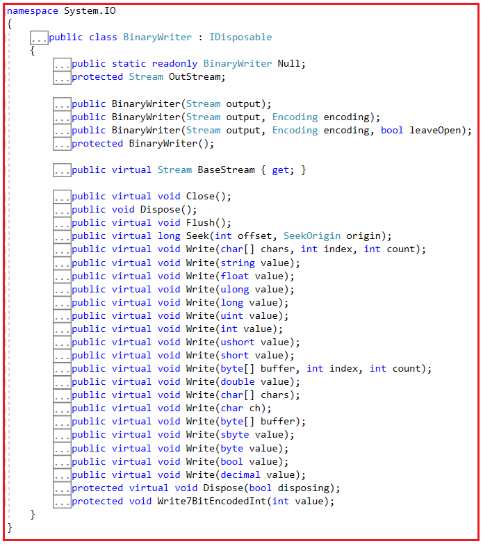
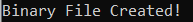
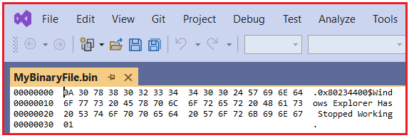
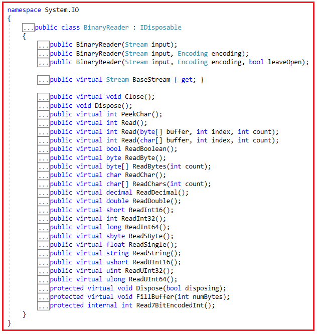
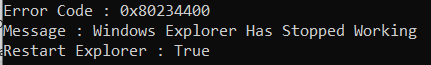

## **BinaryWriter و BinaryReader در سی شارپ به همراه مثال**

در این مقاله، قصد دارم **BinaryWriter و BinaryReader را در سی شارپ** با مثال بررسی کنم. لطفاً مقاله قبلی ما را که در آن کلاس‌های TextWriter و TextReader را در سی شارپ با مثال بررسی کردیم، مطالعه کنید. در پایان این مقاله، شما خواهید فهمید که BinaryWriter و BinaryReader در سی شارپ چه هستند و چه زمانی و چگونه می‌توان از BinaryWriter و BinaryReader در سی شارپ با مثال استفاده کرد.

##### **کلاس BinaryWriter در سی شارپ چیست؟**

کلاس BinaryWriter در سی شارپ برای نوشتن انواع داده اولیه مانند int، uint یا char به شکل داده‌های دودویی در یک جریان (stream) استفاده می‌شود. این کلاس در فضای نام System.IO قرار دارد. همانطور که از نامش پیداست، BinaryWriter فایل‌های دودویی را می‌نویسد که از یک طرح داده خاص برای بایت‌های خود استفاده می‌کنند.

1. تابع BinaryWriter در سی شارپ یک فایل باینری ایجاد می‌کند که برای انسان قابل فهم نیست اما ماشین می‌تواند آن را بفهمد.
2. از نوشتن رشته‌ها با یک کدگذاری خاص پشتیبانی می‌کند.
3. برای ایجاد یک شیء از نوع BinaryWriter، باید یک شیء از نوع Stream را به سازنده کلاس BinaryWriter ارسال کنیم.
4. کلاس BinaryWriter در سی شارپ متدهایی را ارائه می‌دهد که نوشتن انواع داده‌های اولیه را در یک جریان ساده می‌کند.
5. اگر هنگام ایجاد اشیاء، نوع کدگذاری را مشخص نکنید، کدگذاری پیش‌فرض UTF-8 استفاده خواهد شد.

اگر به تعریف کلاس BinaryWriter بروید، ساختار زیر را مشاهده خواهید کرد.



##### **متدهای کلاس BinaryWriter در سی شارپ:**

1. **Write(String):** این متد برای نوشتن یک رشته با پیشوند طول در این جریان (stream) با کدگذاری فعلی BinaryWriter استفاده می‌شود و موقعیت فعلی جریان را مطابق با کدگذاری مورد استفاده و کاراکترهای خاصی که در جریان نوشته می‌شوند، پیش می‌برد.
2. **Write(float):** این متد برای نوشتن یک مقدار اعشاری چهار بایتی در استریم فعلی استفاده می‌شود و موقعیت استریم را چهار بایت جلو می‌برد.
3. **Write(long):** این متد برای نوشتن یک عدد صحیح علامت‌دار هشت بایتی در استریم فعلی استفاده می‌شود و موقعیت استریم را هشت بایت جلو می‌برد.
4. **Write(Boolean):** این متد برای نوشتن مقدار بولی یک بایتی در استریم فعلی استفاده می‌شود؛ ۰ نشان دهنده false و ۱ نشان دهنده true است.
5. **Write(Byte):** این متد برای نوشتن یک بایت بدون علامت در استریم فعلی استفاده می‌شود و سپس موقعیت استریم را یک بایت جلو می‌برد.
6. **Write(Char):** این متد برای نوشتن کاراکترهای یونیکد در جریان فعلی استفاده می‌شود و همچنین موقعیت جریان فعلی را بر اساس کدگذاری کاراکتر مورد استفاده و بر اساس کاراکترهایی که در جریان فعلی نوشته می‌شوند، پیش می‌برد.
7. **Write(Decimal):** این متد برای نوشتن یک مقدار اعشاری در استریم فعلی استفاده می‌شود و همچنین موقعیت استریم فعلی را شانزده بایت جلو می‌برد.
8. **Write(Double):** این متد برای نوشتن یک مقدار اعشاری هشت بایتی در استریم فعلی استفاده می‌شود و سپس موقعیت استریم فعلی را نیز هشت بایت جلو می‌برد.
9. **Write(Int32):** این متد برای نوشتن یک عدد صحیح علامت‌دار چهار بایتی در جریان فعلی استفاده می‌شود و سپس موقعیت جریان فعلی را چهار بایت جلو می‌برد.

##### **چگونه یک نمونه از کلاس BinaryWriter در سی شارپ ایجاد کنیم؟**

چهار سازنده‌ی overload شده در کلاس BinaryWriter برای ایجاد یک نمونه از BinaryWriter وجود دارد. این سازنده‌ها به شرح زیر هستند:

1. **public BinaryWriter(Stream output):** این تابع یک نمونه جدید از کلاس BinaryWriter را بر اساس جریان مشخص شده مقداردهی اولیه می‌کند و از کدگذاری UTF-8 استفاده می‌کند. در اینجا، پارامتر output، جریان خروجی را مشخص می‌کند.
2. **public BinaryWriter(Stream output, Encoding encoding):** این تابع یک نمونه جدید از کلاس BinaryWriter را بر اساس جریان و رمزگذاری کاراکتر مشخص شده، مقداردهی اولیه می‌کند. در اینجا، پارامتر output، جریان خروجی و پارامتر encoding، رمزگذاری کاراکتر مورد استفاده را مشخص می‌کند.
3. **public BinaryWriter(Stream output, Encoding encoding, bool leaveOpen):** این تابع یک نمونه جدید از کلاس BinaryWriter را بر اساس جریان و رمزگذاری کاراکتر مشخص شده، مقداردهی اولیه می‌کند و به صورت اختیاری جریان را باز می‌گذارد. در اینجا، پارامتر output جریان خروجی را مشخص می‌کند و پارامتر encoding رمزگذاری کاراکتر مورد استفاده را مشخص می‌کند و پارامتر leaveOpen مقدار true را برای باز گذاشتن جریان پس از دفع شیء BinaryWriter تعیین می‌کند. در غیر این صورت، مقدار false را برای آن در نظر می‌گیرد.
4. **تابع ()protected BinaryWriter** یک نمونه جدید از کلاس System.IO.BinaryWriter را که در یک جریان می‌نویسد، مقداردهی اولیه می‌کند.

می‌توانیم یک شیء از کلاس BinaryWriter درون بلوک using ایجاد کنیم تا حافظه اشغال شده توسط شیء، پس از اتمام کار شیء و عدم نیاز به آن، به طور خودکار آزاد شود. سینتکس این کار در زیر آمده است.

**با استفاده از (BinaryWriter binaryWriter = new BinaryWriter(File.Open(fileName, FileMode.Create )))**  
**{**  
**// کد کاربر**  
**}**

در اینجا، متد File.Open() شیء FileStream را برمی‌گرداند که به ایجاد یک نمونه از BinaryWriter کمک می‌کند.

##### **BinaryWriter در سی شارپ چگونه کار می‌کند؟**

در سی شارپ، کلاس BinaryWriter برای نوشتن داده‌های دودویی در یک فایل یا می‌توان گفت که برای ایجاد فایل‌های دودویی استفاده می‌شود. این کلاس به ما کمک می‌کند تا انواع داده‌های اولیه مانند int، char، double و غیره را با فرمت دودویی در یک جریان بنویسیم. همچنین به ما کمک می‌کند تا رشته‌ها را با فرمت رمزگذاری کاراکتر خاصی بنویسیم.

برای کار با BinaryWriter در سی شارپ، ابتدا باید فضای نام System.IO را وارد کنیم. سپس، باید با استفاده از عملگر new و با دور زدن یک شیء Stream به سازنده BinaryWriter، یک نمونه از کلاس BinaryWriter ایجاد کنیم. نسخه‌های مختلفی از سازنده‌ها در کلاس BinaryWriter موجود است. می‌توانید از هر یک از آنها استفاده کنید.

برای ایجاد یک نمونه از BinaryWriter در C#، معمولاً یک شیء Stream به سازنده آن ارائه می‌دهیم و همزمان می‌توانیم پارامترهای اختیاری را نیز ارائه دهیم که کدگذاری مورد استفاده هنگام نوشتن فایل را مشخص می‌کنند. در صورتی که کاربر هیچ کدگذاری کاراکتری ارائه ندهد، کدگذاری UTF-8 به طور پیش‌فرض استفاده خواهد شد.

کلاس BinaryWriter در سی شارپ، متدهای Write() مختلفی را برای انواع مختلف داده ارائه می‌دهد. این متدها برای نوشتن داده‌ها در فایل باینری استفاده می‌شوند.

##### **مثال برای درک کلاس BinaryWriter در سی شارپ**

در مثال زیر، ما یک فایل باینری جدید در مسیر «D:\\MyBinaryFile.bin» ایجاد می‌کنیم و سپس اطلاعات گزارش خطا را در آن ذخیره می‌کنیم.

```csharp
using System;
using System.IO;

namespace FileHandlingDemo
{
    class Program
    {
        static void Main(string[] args)
        {
            using (BinaryWriter writer = new BinaryWriter(File.Open("D:\\MyBinaryFile.bin", FileMode.Create)))
            {
                // Writing Error Log
                writer.Write("0x80234400");
                writer.Write("Windows Explorer Has Stopped Working");
                writer.Write(true);
            }
            Console.WriteLine("Binary File Created!");
            Console.ReadKey();
        }
    }
}
```

وقتی کد بالا را اجرا کنید، خروجی زیر را دریافت خواهید کرد.



حالا، در درایو D، فایل MyBinaryFile.bin باید ایجاد شده باشد و اگر این فایل را با ویژوال استودیو باز کنید، تصویر زیر را مشاهده خواهید کرد.



بنابراین، وقتی فایل D:\\MyBinaryFile.bin را در ویژوال استودیو باز می‌کنید، ممکن است فایل مانند تصویر بالا به نظر برسد. درک آن دشوار است، اما نمایش کارآمدتر و در سطح ماشینی داده‌ها است. دلیل این امر این است که داده‌ها در فایل متنی کدگذاری نشده‌اند. هنگام خواندن داده‌ها با استفاده از کلاس BinaryReader نگران نباشید، دقیقاً همان داده‌هایی را که ذخیره کرده‌اید دریافت خواهید کرد.

**نکته:** مزایای اصلی اطلاعات دودویی این است که به راحتی توسط انسان قابل خواندن نیستند و ذخیره فایل‌ها به صورت دودویی بهترین روش برای استفاده بهینه از فضا است.

##### **کلاس BinaryReader در سی شارپ چیست؟**

اگر یک فایل باینری (با پسوند .bin) در دستگاه خود ذخیره کرده‌اید و می‌خواهید داده‌های باینری را بخوانید، باید از کلاس BinaryReader در C# استفاده کنید. این بدان معناست که کلاس BinaryReader در C# برای خواندن داده‌های فایل باینری استفاده می‌شود. یک فایل باینری داده‌ها را در یک طرح‌بندی متفاوت ذخیره می‌کند که برای دستگاه‌ها کارآمدتر است اما برای انسان‌ها مناسب نیست. BinaryReader این کار را ساده‌تر می‌کند و داده‌های دقیق ذخیره شده در فایل باینری را به شما نشان می‌دهد.

کلاس BinaryReader متعلق به فضای نام System.IO است. BinaryReader برای خواندن انواع داده‌های اولیه به عنوان مقادیر دودویی در یک جریان کدگذاری خاص استفاده می‌شود. BinaryReader با شیء Stream کار می‌کند، یعنی برای ایجاد یک شیء از BinaryReader، باید شیء Stream را به سازنده آن ارسال کنیم. کلاس BinaryReader دارای سه سازنده overload شده برای کار با داده‌های دودویی است. به طور پیش‌فرض، BinaryReader از کدگذاری UTF-8 برای خواندن داده‌ها استفاده می‌کند تا زمانی که هنگام ایجاد شیء آن، کدگذاری‌های کاراکتری دیگری را مشخص کنیم.

1. کلاس BinaryReader در سی شارپ، فایل‌های باینری (.bin) را مدیریت می‌کند.
2. انواع داده‌های اولیه را به صورت مقادیر دودویی در یک کدگذاری خاص می‌خواند.
3. کلاس BinaryReader متدهایی را ارائه می‌دهد که خواندن انواع داده‌های اولیه از جریان‌ها را ساده می‌کنند.

اگر به تعریف کلاس BinaryWriter بروید، ساختار زیر را مشاهده خواهید کرد.



##### **متدهای کلاس BinaryReader در سی شارپ:**

کلاس BinaryReader در سی شارپ متدهای Read() زیادی برای خواندن انواع داده‌های اولیه مختلف از یک جریان (stream) ارائه می‌دهد. مانند متد ReadString() در BinaryReader که برای خواندن بایت بعدی به عنوان یک مقدار رشته‌ای استفاده می‌شود و همچنین موقعیت فعلی در جریان را یک بایت جلو می‌برد. انواع مختلف متدهای Read() در کلاس BinaryReader به شرح زیر است:

1. **تابع ()Read** برای خواندن کاراکترها از جریان اصلی استفاده می‌شود و موقعیت فعلی جریان را مطابق با کدگذاری مورد استفاده و کاراکتر خاصی که از جریان خوانده می‌شود، پیش می‌برد. این تابع کاراکتر بعدی را از جریان ورودی برمی‌گرداند، یا اگر در حال حاضر هیچ کاراکتری موجود نباشد، -1 را برمی‌گرداند.
2. **ReadBoolean():** برای خواندن یک مقدار بولی از جریان فعلی استفاده می‌شود و موقعیت فعلی جریان را یک بایت جلو می‌برد. اگر بایت غیر صفر باشد، مقدار true و در غیر این صورت، مقدار false را برمی‌گرداند.
3. **ReadByte():** برای خواندن بایت بعدی از استریم فعلی استفاده می‌شود و موقعیت فعلی استریم را یک بایت جلو می‌برد. بایت بعدی خوانده شده از استریم فعلی را برمی‌گرداند.
4. **ReadChar():** برای خواندن کاراکتر بعدی از جریان فعلی استفاده می‌شود و موقعیت فعلی جریان را مطابق با رمزگذاری استفاده شده و کاراکتر خاص خوانده شده از جریان، به جلو می‌برد. این تابع، کاراکتر خوانده شده از جریان فعلی را برمی‌گرداند.
5. **ReadDecimal()** : برای خواندن یک مقدار اعشاری از جریان فعلی استفاده می‌شود و موقعیت فعلی جریان را شانزده بایت جلو می‌برد. این تابع یک مقدار اعشاری خوانده شده از جریان فعلی را برمی‌گرداند.
6. **ReadDouble():** برای خواندن یک مقدار اعشاری ۸ بایتی از جریان فعلی استفاده می‌شود و موقعیت فعلی جریان را هشت بایت جلو می‌برد. این تابع یک مقدار اعشاری ۸ بایتی خوانده شده از جریان فعلی را برمی‌گرداند.
7. **ReadInt32():** این تابع برای خواندن یک عدد صحیح علامت‌دار ۴ بایتی از جریان فعلی استفاده می‌شود و موقعیت فعلی جریان را چهار بایت جلو می‌برد. این تابع یک عدد صحیح علامت‌دار ۴ بایتی خوانده شده از جریان فعلی را برمی‌گرداند.
8. **ReadInt64():** این تابع برای خواندن یک عدد صحیح علامت‌دار ۸ بایتی از جریان فعلی استفاده می‌شود و موقعیت فعلی جریان را چهار بایت جلو می‌برد. این تابع یک عدد صحیح علامت‌دار ۸ بایتی خوانده شده از جریان فعلی را برمی‌گرداند.
9. **ReadString():** برای خواندن یک رشته از جریان فعلی استفاده می‌شود. طول رشته به عنوان پیشوند اضافه می‌شود و به صورت یک عدد صحیح هفت بیتی کدگذاری می‌شود. این تابع رشته‌ای را که خوانده می‌شود، برمی‌گرداند.

##### **چگونه یک نمونه از کلاس BinaryReader در سی شارپ ایجاد کنیم؟**

سه نسخه سربارگذاری شده از سازنده‌ها در کلاس BinaryReader برای ایجاد یک نمونه از کلاس BinaryReader موجود است. آنها به شرح زیر هستند:

1. **public BinaryReader(Stream input):** این تابع یک نمونه جدید از کلاس System.IO.BinaryReader را بر اساس جریان مشخص شده و با استفاده از کدگذاری UTF-8 مقداردهی اولیه می‌کند. در اینجا، پارامتر input، جریان ورودی را مشخص می‌کند.
2. **public BinaryReader(Stream input, Encoding encoding):** این تابع یک نمونه جدید از کلاس System.IO.BinaryReader را بر اساس جریان داده و رمزگذاری کاراکتر مشخص شده، مقداردهی اولیه می‌کند. در اینجا، پارامتر input، جریان داده و پارامتر encoding، رمزگذاری کاراکتر مورد استفاده را مشخص می‌کند.
3. **public BinaryReader(Stream input, Encoding encoding, bool leaveOpen):** این تابع یک نمونه جدید از کلاس System.IO.BinaryReader را بر اساس جریان و رمزگذاری کاراکتر مشخص شده، مقداردهی اولیه می‌کند و به صورت اختیاری جریان را باز می‌گذارد. در اینجا، پارامتر input جریان ورودی را مشخص می‌کند و پارامتر encoding رمزگذاری کاراکتر مورد استفاده را مشخص می‌کند و پارامتر leaveOpen مقدار true را برای باز گذاشتن جریان پس از دفع شیء BinaryReader تعیین می‌کند. در غیر این صورت، مقدار false را تعیین می‌کند.

##### **BinaryReader در سی شارپ چگونه کار می‌کند؟**

کلاس BinaryReader در سی شارپ برای خواندن اطلاعات دودویی استفاده می‌شود، یعنی برای خواندن داده‌های ذخیره شده در فایل‌های دودویی (فایل با پسوند .bin) استفاده می‌شود. فایل دودویی داده‌ها را به گونه‌ای ذخیره می‌کند که توسط یک ماشین به راحتی قابل درک است اما برای انسان بسیار دشوار است. برای کار با BinaryReader، ابتدا باید فضای نام System.IO را وارد کنیم. سپس، باید با کمک عملگر new و با استفاده از هر یک از سازنده‌های موجود، یک نمونه از کلاس BinaryReader ایجاد کنیم. هنگام ایجاد نمونه از کلاس BinaryReader، باید جریان ورودی را به عنوان پارامتر به سازنده منتقل کنیم.

هنگام ایجاد یک نمونه از BinaryReader، می‌توانیم به صورت اختیاری کدگذاری کاراکتر مورد استفاده را مشخص کنیم، اگر کدگذاری را مشخص نکنیم، به طور پیش‌فرض از کدگذاری UTF-8 استفاده خواهد شد. در کنار این، می‌توانیم به صورت اختیاری مشخص کنیم که آیا می‌خواهیم جریان پس از حذف شیء BinaryReader، همانطور که در عبارت زیر نشان داده شده است، باز شود یا خیر.

**BinaryReader binary\_reader = new BinaryReader(inputStream, encoding, true);**

زمانی که شیء کلاس BinaryReader را ایجاد کردیم، با کمک متدهای مختلف Read() از کلاس BinaryReader، می‌توانیم داده‌ها را از فایل بخوانیم.

##### **مثال برای درک کلاس BinaryReader در سی شارپ:**

در مثال زیر، دو متد به نام‌های WriteDataToBinaryFile() و ReadDataFromBinaryFile() ایجاد کرده‌ام. متد WriteDataToBinaryFile() برای ذخیره برخی اطلاعات در فایل D:\\MyBinaryFile2.bin و متد ReadDataFromBinaryFile() برای خواندن داده‌ها از فایل MyBinaryFile2.bin و نمایش داده‌ها در کنسول استفاده می‌شود.

```csharp
using System;
using System.IO;

namespace FileHandlingDemo
{
    class Program
    {
        static void Main(string[] args)
        {
            WriteDataToBinaryFile();
            ReadDataFromBinaryFile();
            Console.ReadKey();
        }
        static void WriteDataToBinaryFile()
        {
            using (BinaryWriter writer = new BinaryWriter(File.Open("D:\\MyBinaryFile2.bin", FileMode.Create)))
            {
                // Writing Error Log
                writer.Write("0x80234400");
                writer.Write("Windows Explorer Has Stopped Working");
                writer.Write(true);
            }
        }
        static void ReadDataFromBinaryFile()
        {
            using (BinaryReader reader = new BinaryReader(File.Open("D:\\MyBinaryFile2.bin", FileMode.Open)))
            {
                Console.WriteLine("Error Code : " + reader.ReadString());
                Console.WriteLine("Message : " + reader.ReadString());
                Console.WriteLine("Restart Explorer : " + reader.ReadBoolean());
            }
        }
    }
}
```

###### **خروجی:**



**نکته:** کلاس‌های BinaryWriter و BinaryReader در سی‌شارپ برای خواندن و نوشتن انواع داده‌های اولیه و رشته‌ها استفاده می‌شوند. اگر فقط با انواع اولیه سر و کار دارید، این بهترین جریان برای استفاده است. به یاد داشته باشید که این داده‌ها به راحتی توسط انسان قابل خواندن نیستند زیرا محتوای ذخیره شده در فایل به صورت دودویی است.