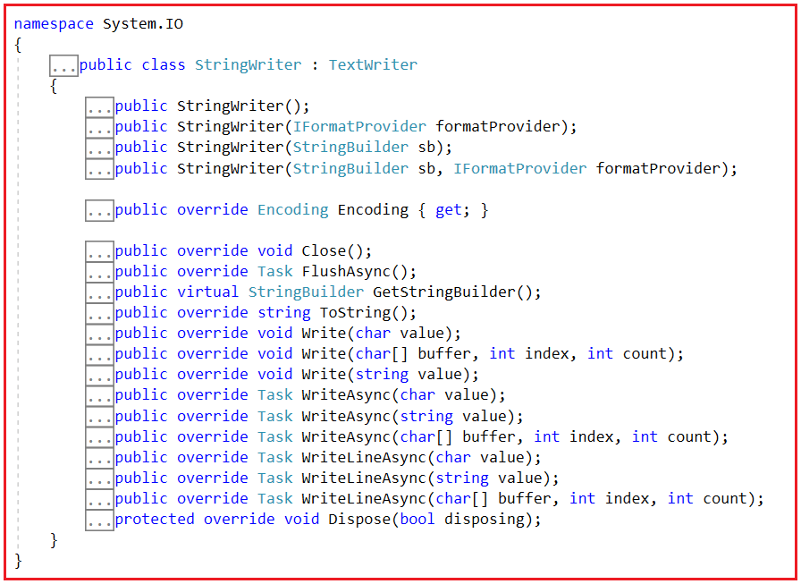
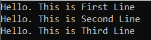
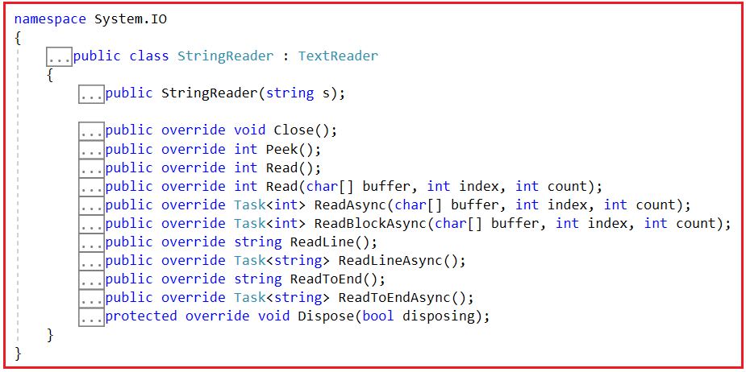
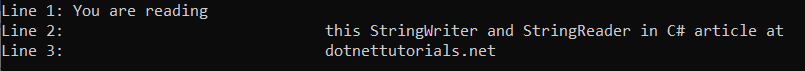

## **StringWriter و StringReader در سی شارپ به همراه مثال**

در این مقاله، قصد دارم **StringWriter و StringReader را در سی شارپ** با مثال بررسی کنم. لطفاً مقاله قبلی ما را که در آن BinaryWriter و BinaryReader را در سی شارپ با مثال بررسی کردیم، مطالعه کنید. در پایان این مقاله، شما خواهید فهمید که StringWriter و StringReader در سی شارپ چه هستند و چه زمانی و چگونه می‌توان از StringWriter و StringReader در سی شارپ با مثال استفاده کرد.

##### **کلاس StringWriter در سی شارپ چیست؟**

کلاس StringWriter در سی شارپ از کلاس TextWriter مشتق شده است و این کلاس StringWriter عمدتاً برای دستکاری رشته‌ها به جای فایل‌ها استفاده می‌شود. کلاس StringWriter ما را قادر می‌سازد تا یک رشته را به صورت همزمان یا غیرهمزمان بنویسیم. بنابراین، می‌توانیم یک کاراکتر را با متد Write(Char) یا WriteAsync(Char) بنویسیم و می‌توانیم یک رشته را با متد Write(String) یا WriterAsync(String) بنویسیم. متن یا اطلاعات نوشته شده توسط کلاس StringWriter در داخل یک StringBuilder ذخیره می‌شود. فضای نام Text و رشته‌ها را می‌توان با استفاده از کلاس StringBuilder به طور کارآمد ساخت زیرا رشته‌ها در سی شارپ تغییرناپذیر هستند و متدهای Write و WriteLine ارائه شده توسط StringWriter به ما کمک می‌کنند تا در شیء StringBuilder بنویسیم. کلاس StringBuilder اطلاعات نوشته شده توسط کلاس StringWriter را ذخیره می‌کند.

مهمترین نکته‌ای که باید به خاطر داشته باشید این است که StringWriter برای نوشتن فایل‌ها روی دیسک محلی نیست. بلکه برای دستکاری رشته‌ها استفاده می‌شود و اطلاعات را در StringBuilder ذخیره می‌کند. اگر به تعریف کلاس StringWriter بروید، موارد زیر را مشاهده خواهید کرد.



بیایید با سازنده‌ها، ویژگی‌ها و متدهای کلاس StringWriter در سی‌شارپ آشنا شویم.

##### **سازنده‌های StringWriter در سی شارپ**

1. **public StringWriter():** یک نمونه جدید از کلاس System.IO.StringWriter را مقداردهی اولیه می‌کند.
2. **public StringWriter(IFormatProvider formatProvider):** این متد یک نمونه جدید از کلاس StringWriter را با کنترل فرمت مشخص شده مقداردهی اولیه می‌کند. پارامتر formatProvider یک شیء System.IFormatProvider را مشخص می‌کند که قالب‌بندی را کنترل می‌کند.
3. **public StringWriter(StringBuilder sb):** این تابع یک نمونه جدید از کلاس StringWriter را مقداردهی اولیه می‌کند که در System.Text.StringBuilder مشخص شده می‌نویسد. پارامتر sb شیء StringBuilder را برای نوشتن مشخص می‌کند.
4. **public StringWriter(StringBuilder sb, IFormatProvider formatProvider):** این تابع یک نمونه جدید از کلاس StringWriter را مقداردهی اولیه می‌کند که در StringBuilder مشخص شده می‌نویسد و دارای ارائه‌دهنده فرمت مشخص شده است. پارامتر sb شیء StringBuilder را برای نوشتن مشخص می‌کند و پارامتر formatProvider یک شیء System.IFormatProvider را مشخص می‌کند که قالب‌بندی را کنترل می‌کند.

##### **ویژگی‌های کلاس StringWriter در سی شارپ:**

کلاس StringWriter در سی شارپ ویژگی زیر را ارائه می‌دهد.

1. **Encoding** : این ویژگی برای دریافت Encoding که خروجی با آن نوشته شده است، استفاده می‌شود. بنابراین، Encoding که خروجی با آن نوشته شده است را برمی‌گرداند.

##### **متدهای کلاس StringWriter در سی شارپ**

کلاس StringWriter در سی شارپ متدهای زیر را ارائه می‌دهد.

1. **Close():** این متد برای بستن StringWriter فعلی و جریان (stream) زیرین استفاده می‌شود.
2. **Dispose():** این متد برای آزادسازی منابع مدیریت نشده مورد استفاده System.IO.StringWriter استفاده می‌شود و به صورت اختیاری منابع مدیریت شده را نیز آزاد می‌کند.
3. **FlushAsync():** این متد برای پاک کردن ناهمگام تمام بافرها برای نویسنده فعلی استفاده می‌شود و باعث می‌شود هر داده بافر شده‌ای روی دستگاه اصلی نوشته شود.
4. **GetStringBuilder():** این متد برای برگرداندن StringBuilder اصلی استفاده می‌شود.
5. **ToString():** این متد برای برگرداندن رشته‌ای حاوی کاراکترهایی که تاکنون در StringWriter فعلی نوشته شده‌اند، استفاده می‌شود.
6. **Write(char value):** این متد برای نوشتن یک کاراکتر در رشته استفاده می‌شود.
7. **Write(string value):** این متد برای نوشتن یک رشته در رشته فعلی استفاده می‌شود.
8. **WriteAsync(char value):** این متد برای نوشتن یک کاراکتر در رشته به صورت غیرهمزمان استفاده می‌شود.
9. **WriteAsync(string value):** این متد برای نوشتن یک رشته در رشته فعلی به صورت غیرهمزمان استفاده می‌شود.
10. **WriteLine(String):** این متد برای نوشتن یک رشته و به دنبال آن یک پایان‌دهنده خط در رشته متنی یا جریان داده استفاده می‌شود.
11. **WriteLineAsync(string value):** این متد برای نوشتن یک رشته و به دنبال آن یک پایان‌دهنده خط به صورت غیرهمزمان در رشته فعلی استفاده می‌شود.

##### **مثال برای درک کلاس StringWriter در سی شارپ:**

در مثال زیر، ما از کلاس‌های StringWriter و StringReader در سی‌شارپ استفاده می‌کنیم. در اینجا، متغیر رشته‌ای text یک مقدار رشته‌ای را ذخیره می‌کند و با استفاده از StringWriter، این مقدار رشته‌ای را در StringBuilder ذخیره می‌کنیم. سپس، با استفاده از StringReader، داده‌ها را دریافت کرده و در کنسول نمایش می‌دهیم.

```csharp
using System;
using System.Text;
using System.IO;

namespace StringWriter_StringReader_Demo
{
    class Program
    {
        static void Main(string[] args)
        {
            string text = "Hello. This is First Line \nHello. This is Second Line \nHello. This is Third Line";

            // Writing string into StringBuilder
            StringBuilder stringBuilder = new StringBuilder();
            StringWriter stringWriter = new StringWriter(stringBuilder);

            // Store Data on StringBuilder
            stringWriter.WriteLine(text);
            stringWriter.Flush();
            stringWriter.Close();

            // Read Entry
            StringReader reader = new StringReader(stringBuilder.ToString());

            // Check to End of File
            while (reader.Peek() > -1)
            {
                Console.WriteLine(reader.ReadLine());
            }

            Console.ReadKey();
        }
    }
}
```

###### **خروجی:**



**نکته:** از آنجایی که کلاس StringWriter یک کلاس مشتق شده از کلاس TextWriter است، برای نوشتن و کار با داده‌های رشته‌ای به جای فایل‌ها استفاده می‌شود، با این هدف که داده‌های رشته‌ای دستکاری شده و نتیجه در StringBuilder ذخیره شوند.

##### **کلاس StringReader در سی شارپ چیست؟**

کلاس StringReader در سی شارپ از کلاس TextReader مشتق شده است و این کلاس StringReader عمدتاً برای دستکاری رشته‌ها به جای فایل‌ها استفاده می‌شود. این کلاس StringReader با استفاده از یک رشته ساخته شده است و متدهای Read و ReadLine توسط کلاس StringReader برای خواندن بخش‌هایی از رشته ارائه شده‌اند. داده‌هایی که توسط کلاس StringReader خوانده می‌شوند، داده‌هایی هستند که توسط کلاس StringWriter نوشته می‌شوند که از زیرکلاس TextWriter مشتق شده است. داده‌ها را می‌توان با استفاده از کلاس StringReader به صورت همزمان یا ناهمزمان خواند و عملیات خواندن با استفاده از سازنده‌ها و متدهای موجود در کلاس StringReader انجام می‌شود.

بنابراین، به زبان ساده، می‌توانیم بگوییم که کلاس StringReader در سی‌شارپ، کلاس TextReader را پیاده‌سازی می‌کند که یک رشته را از یک رشته دیگر می‌خواند. این کلاس شما را قادر می‌سازد تا یک رشته را به صورت همزمان یا غیرهمزمان بخوانید. می‌توانید یک کاراکتر را با متد Read() و یک خط را با متد ReadLine() بخوانید. اگر به تعریف کلاس StringReader بروید، موارد زیر را مشاهده خواهید کرد.



بیایید با سازنده‌ها و متدهای کلاس StringReader در سی‌شارپ آشنا شویم.

##### **سازنده کلاس StringReader در سی شارپ**

**public StringReader(string s):** این تابع یک نمونه جدید از کلاس StringReader را که از رشته مشخص شده می‌خواند، مقداردهی اولیه می‌کند. در اینجا، پارامتر «s» رشته‌ای را مشخص می‌کند که StringReader باید با آن مقداردهی اولیه شود.

##### **متدهای کلاس StringReader در سی شارپ**

کلاس StringReader در سی شارپ متدهای زیر را ارائه می‌دهد.

1. **Close():** این متد برای بستن StringReader استفاده می‌شود.
2. **Peek():** این متد برای برگرداندن کاراکتر بعدی موجود استفاده می‌شود اما آن را مصرف نمی‌کند. این متد یک عدد صحیح که نشان‌دهنده کاراکتر بعدی برای خواندن است را برمی‌گرداند، یا اگر کاراکتر بیشتری موجود نباشد یا استریم از جستجو پشتیبانی نکند، -1 را برمی‌گرداند.
3. **()Read:** این متد برای خواندن کاراکتر بعدی از رشته ورودی استفاده می‌شود و موقعیت کاراکتر را یک کاراکتر به جلو می‌برد. این متد کاراکتر بعدی را از رشته زیرین برمی‌گرداند، یا اگر کاراکتر دیگری موجود نباشد -1 را برمی‌گرداند.
4. **ReadLine():** این متد برای خواندن یک خط از کاراکترهای رشته فعلی استفاده می‌شود و داده‌ها را به صورت رشته برمی‌گرداند. این متد خط بعدی از رشته فعلی را برمی‌گرداند، یا اگر به انتهای رشته برسد، null را برمی‌گرداند.
5. **ReadLineAsync():** این متد برای خواندن یک خط از کاراکترها به صورت غیرهمزمان از رشته فعلی استفاده می‌شود و داده‌ها را به صورت یک رشته برمی‌گرداند. این متد وظیفه‌ای را برمی‌گرداند که نشان دهنده عملیات خواندن غیرهمزمان است. مقدار پارامتر TResult شامل خط بعدی از رشته خوان است یا اگر همه کاراکترها خوانده شده باشند، null است.
6. **ReadToEnd():** این متد برای خواندن تمام کاراکترها از موقعیت فعلی تا انتهای رشته استفاده می‌شود و آنها را به عنوان یک رشته واحد برمی‌گرداند. این متد محتوا را از موقعیت فعلی تا انتهای رشته زیرین برمی‌گرداند.
7. **ReadToEndAsync():** این متد برای خواندن تمام کاراکترها از موقعیت فعلی تا انتهای رشته به صورت غیرهمزمان استفاده می‌شود و آنها را به عنوان یک رشته واحد برمی‌گرداند. این متد وظیفه‌ای را برمی‌گرداند که نشان دهنده عملیات خواندن غیرهمزمان است. مقدار پارامتر TResult شامل رشته‌ای با کاراکترها از موقعیت فعلی تا انتهای رشته است.
8. **Dispose():** این متد برای آزادسازی منابع مدیریت نشده مورد استفاده System.IO.StringReader استفاده می‌شود و به صورت اختیاری منابع مدیریت شده را نیز آزاد می‌کند.

##### **مثال برای درک کلاس StringReader در سی شارپ:**

در مثال زیر، کلاس StringReader یک رشته را از یک متغیر رشته‌ای می‌خواند و هر خط را با عدد شمارش علامت‌گذاری می‌کند و سپس آن را در کنسول نمایش می‌دهد.

```csharp
using System;
using System.IO;

namespace StringWriter_StringReader_Demo
{
    class Program
    {
        static void Main(string[] args)
        {
            string text = @"You are reading
                            this StringWriter and StringReader in C# article at
                            dotnettutorials.net";

            using (StringReader stringReader = new StringReader(text))
            {
                int count = 0;
                string line;
                while ((line = stringReader.ReadLine()) != null)
                {
                    count++;
                    Console.WriteLine("Line {0}: {1}", count, line);
                }
            }
            Console.ReadKey();
        }
    }
}
```

###### **خروجی:**

