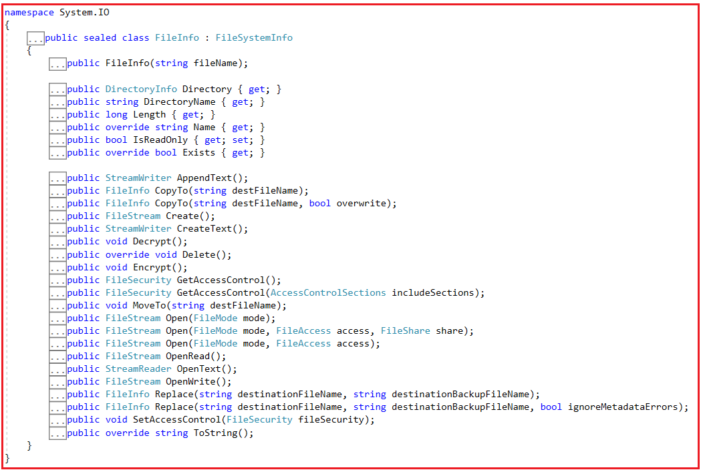
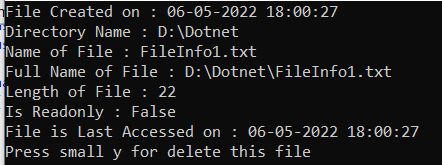

## **کلاس FileInfo در سی شارپ به همراه مثال**

در این مقاله، من در مورد **کلاس FileInfo در سی شارپ** با مثال صحبت خواهم کرد. لطفاً مقاله قبلی ما در مورد StringWriter و StringReader در سی شارپ با مثال را مطالعه کنید. در پایان این مقاله، شما خواهید فهمید که کلاس FileInfo در سی شارپ چیست و چه زمانی و چگونه می‌توان از کلاس FileInfo در سی شارپ با مثال استفاده کرد.

##### **کلاس FileInfo در سی شارپ چیست؟**

کلاس FileInfo در سی شارپ برای دستکاری فایل‌ها مانند ایجاد، حذف، حذف، کپی، باز کردن و دریافت اطلاعات استفاده می‌شود. کلاس FileInfo چندین ویژگی و متد ارائه می‌دهد که دستکاری فایل‌ها را آسان می‌کند. کلاس FileInfo برای عملیات معمول فایل مانند کپی، انتقال، تغییر نام، ایجاد، باز کردن، حذف و افزودن فایل‌ها استفاده می‌شود. به طور پیش‌فرض، دسترسی کامل خواندن/نوشتن به فایل‌های جدید به همه کاربران اعطا می‌شود.

کلاس FileInfo در سی شارپ متعلق به فضای نام System.IO است. این یک کلاس مهر و موم شده (sealed) است و از این رو، نمی‌توان آن را به ارث برد. اگر به تعریف کلاس FileInfo بروید، موارد زیر را مشاهده خواهید کرد.



کلاس FileInfo در سی شارپ، سازنده (Constructor)، متدها (Methods) و ویژگی‌های (Properties) زیر را برای کار با فایل‌ها ارائه می‌دهد.

##### **سازنده کلاس FileInfo در سی شارپ**

کلاس FileInfo سازنده‌ی زیر را ارائه می‌دهد.

**public FileInfo(string fileName):** این تابع یک نمونه جدید از کلاس System.IO.FileInfo را مقداردهی اولیه می‌کند که به عنوان یک پوشش برای مسیر فایل عمل می‌کند. پارامتر fileName نام کامل فایل جدید یا نام فایل نسبی را مشخص می‌کند. مسیر را با کاراکتر جداکننده دایرکتوری خاتمه ندهید.

##### **ویژگی‌های کلاس FileInfo در سی شارپ**

کلاس FileInfo ویژگی‌های زیر را ارائه می‌دهد.

1. **Directory** : برای دریافت نمونه‌ای از دایرکتوری والد استفاده می‌شود. این متد یک شیء DirectoryInfo را برمی‌گرداند که نشان‌دهنده دایرکتوری والد این فایل است.
2. **DirectoryName** : این تابع یک رشته که نشان‌دهنده مسیر کامل دایرکتوری است را دریافت می‌کند و یک رشته که نشان‌دهنده مسیر کامل دایرکتوری است را برمی‌گرداند.
3. **طول** : برای دریافت اندازه فایل فعلی، بر حسب بایت، استفاده می‌شود. این تابع اندازه فایل فعلی را بر حسب بایت برمی‌گرداند.
4. **Name** : برای دریافت نام فایل استفاده می‌شود.
5. **IsReadOnly** : برای دریافت یا تنظیم مقداری که مشخص می‌کند آیا فایل فعلی فقط خواندنی است یا خیر، استفاده می‌شود. اگر فایل فعلی فقط خواندنی باشد، مقدار true و در غیر این صورت، مقدار false را برمی‌گرداند.
6. **Exists** : برای دریافت مقداری که نشان می‌دهد آیا فایلی وجود دارد یا خیر، استفاده می‌شود. اگر فایل وجود داشته باشد مقدار true و اگر وجود نداشته باشد مقدار false را برمی‌گرداند، یا اگر یک دایرکتوری باشد.

##### **متدهای کلاس FileInfo در سی شارپ**

کلاس FileInfo در سی شارپ متدهای زیر را ارائه می‌دهد.

1. **public StreamWriter AppendText() :** این متد برای دریافت مقداری که نشان می‌دهد آیا فایلی وجود دارد یا خیر، استفاده می‌شود. اگر فایل وجود داشته باشد مقدار true و اگر وجود نداشته باشد مقدار false را برمی‌گرداند، یا اگر یک دایرکتوری باشد.
2. **public FileInfo CopyTo(string destFileName) :** این متد برای کپی کردن یک فایل موجود در یک فایل جدید استفاده می‌شود و رونویسی فایل موجود را مجاز نمی‌داند. این متد یک فایل جدید با مسیر کامل را برمی‌گرداند. پارامتر destFileName نام فایل جدیدی را که باید کپی شود، مشخص می‌کند.
3. **public FileInfo CopyTo(string destFileName, bool overwrite) :** این متد برای کپی کردن یک فایل موجود در یک فایل جدید استفاده می‌شود و امکان رونویسی فایل موجود را فراهم می‌کند. اگر overwrite مقدار true داشته باشد، یک فایل جدید یا رونویسی فایل موجود را برمی‌گرداند. اگر فایل وجود داشته باشد و overwrite مقدار false داشته باشد، یک استثنای IOException رخ می‌دهد. پارامتر destFileName نام فایل جدید برای کپی کردن را مشخص می‌کند و پارامتر overwrites مقدار true را مشخص می‌کند تا امکان رونویسی فایل موجود فراهم شود؛ در غیر این صورت، مقدار false.
4. **public FileStream Create() :** این متد یک فایل جدید ایجاد کرده و برمی‌گرداند.
5. **public StreamWriter CreateText() :** این متد یک StreamWriter ایجاد می‌کند که یک فایل متنی جدید می‌نویسد.
6. **public void Decrypt() :** این متد برای رمزگشایی فایلی که توسط حساب کاربری فعلی با استفاده از متد System.IO.FileInfo.Encrypt رمزگذاری شده است، استفاده می‌شود.
7. **تابع public override void Delete() ‎ یک** فایل را به طور دائم حذف می‌کند.
8. **public void Encrypt() :** این متد برای رمزگذاری یک فایل استفاده می‌شود، به طوری که فقط حسابی که برای رمزگذاری فایل استفاده شده است بتواند آن را رمزگشایی کند.
9. **public FileSecurity GetAccessControl() :** این متد برای دریافت یک شیء System.Security.AccessControl.FileSecurity استفاده می‌شود که ورودی‌های لیست کنترل دسترسی (ACL) را برای فایلی که توسط شیء System.IO.FileInfo فعلی توصیف شده است، کپسوله‌سازی می‌کند. این بدان معناست که این متد یک شیء System.Security.AccessControl.FileSecurity را برمی‌گرداند که قوانین کنترل دسترسی را برای فایل فعلی کپسوله‌سازی می‌کند.
10. **public void MoveTo(string destFileName) :** این متد یک فایل مشخص شده را به مکان جدیدی منتقل می‌کند و گزینه‌ای برای تعیین نام فایل جدید ارائه می‌دهد. در اینجا، پارامتر destFileName مسیر انتقال فایل را مشخص می‌کند که می‌تواند نام فایل متفاوتی را مشخص کند.
11. **public FileStream Open(FileMode mode) :** این متد یک فایل را در حالت مشخص شده باز می‌کند. این متد فایلی را که در حالت مشخص شده باز شده است، با دسترسی خواندن/نوشتن و غیراشتراکی برمی‌گرداند.
12. **public FileStream Open(FileMode mode, FileAccess access) :** این متد برای باز کردن یک فایل در حالت مشخص شده با دسترسی خواندن، نوشتن یا خواندن/نوشتن استفاده می‌شود. این متد یک شیء System.IO.FileStream را برمی‌گرداند که در حالت مشخص شده باز شده، دسترسی به آن برقرار است و اشتراک‌گذاری نشده است.
13. **public FileStream Open(FileMode mode, FileAccess access, FileShare share) :** این متد یک فایل را در حالت مشخص شده با دسترسی خواندن، نوشتن یا خواندن/نوشتن و گزینه اشتراک‌گذاری مشخص شده باز می‌کند. این متد یک شیء FileStream را که با حالت، دسترسی و گزینه‌های اشتراک‌گذاری مشخص شده باز شده است، برمی‌گرداند. در اینجا، پارامتر mode یک ثابت System.IO.FileMode را مشخص می‌کند که حالت (مثلاً Open یا Append) باز کردن فایل را مشخص می‌کند. پارامتر access یک ثابت System.IO.FileAccess را مشخص می‌کند که مشخص می‌کند آیا فایل با دسترسی خواندن، نوشتن یا خواندن و نوشتن باز شود یا خیر، و پارامتر share یک ثابت System.IO.FileShare را مشخص می‌کند که نوع دسترسی سایر اشیاء FileStream به این فایل را مشخص می‌کند.
14. **public FileStream OpenRead() :** این متد یک System.IO.FileStream فقط خواندنی جدید ایجاد کرده و برمی‌گرداند.
15. **public StreamReader OpenText() :** این متد System.IO.StreamReader را با کدگذاری UTF8 ایجاد می‌کند که از یک فایل متنی موجود می‌خواند. این متد یک StreamReader جدید با کدگذاری UTF8 برمی‌گرداند.
16. **public FileStream OpenWrite() :** این متد یک System.IO.FileStream فقط نوشتنی ایجاد می‌کند. این متد یک شیء System.IO.FileStream فقط نوشتنی و غیراشتراکی برای یک فایل جدید یا موجود برمی‌گرداند.
17. **public FileInfo Replace(string destinationFileName, string destinationBackupFileName) :** این متد برای جایگزینی محتویات یک فایل مشخص شده با فایلی که توسط شیء System.IO.FileInfo فعلی توصیف شده است، استفاده می‌شود، فایل اصلی را حذف کرده و یک نسخه پشتیبان از فایل جایگزین شده ایجاد می‌کند. این متد یک شیء System.IO.FileInfo را برمی‌گرداند که اطلاعات مربوط به فایل توصیف شده توسط پارامتر destFileName را در خود جای می‌دهد.
18. **public void SetAccessControl(FileSecurity fileSecurity) :** این متد برای اعمال ورودی‌های لیست کنترل دسترسی (ACL) که توسط شیء System.Security.AccessControl.FileSecurity توصیف شده‌اند، به فایلی که توسط شیء System.IO.FileInfo فعلی توصیف شده است، استفاده می‌شود.
19. **public override string ToString() :** این متد مسیر را به صورت یک رشته برمی‌گرداند.

##### **ایجاد فایل در سی شارپ با استفاده از FileInfo:**

متد Create از کلاس FileInfo برای ایجاد فایل جدید استفاده می‌شود. برای درک بهتر، لطفاً به کد زیر نگاهی بیندازید. در کد زیر، متد Create را روی نمونه‌ای از کلاس FileInfo فراخوانی می‌کنیم که فایل MyTestFile1.txt را در درایو D ایجاد می‌کند.

```csharp
using System;
using System.IO;

namespace FileInfoDemo
{
    class Program
    {
        static void Main(string[] args)
        {
            string path = @"D:\\MyTestFile1.txt";
            FileInfo fileInfo = new FileInfo(path);
            fileInfo.Create();
            {
                Console.WriteLine("File has been created");
            }
            Console.ReadKey();
        }
    }
}
```

##### **متد CreateText کلاس FileInfo در سی شارپ:**

این متد یک StreamWriter ایجاد می‌کند که یک فایل متنی جدید می‌نویسد. برای درک بهتر، لطفاً به کد زیر نگاهی بیندازید.

```csharp
using System;
using System.IO;

namespace FileInfoDemo
{
    class Program
    {
        static void Main(string[] args)
        {
            string path = @"D:\\MyTestFile2.txt";
            FileInfo fileInfo = new FileInfo(path);
            StreamWriter str = fileInfo.CreateText();
            str.WriteLine("Hello");
            Console.WriteLine("File has been created with text");
            str.Close();
            Console.ReadKey();
        }
    }
}
```

##### **روش حذف کلاس FileInfo در سی شارپ:**

این متد برای حذف یک فایل موجود استفاده می‌شود. برای درک بهتر، لطفاً به کد زیر نگاهی بیندازید.

```csharp
using System;
using System.IO;

namespace FileInfoDemo
{
    class Program
    {
        static void Main(string[] args)
        {
            string path = @"D:\\MyTestFile2.txt";
            FileInfo fileInfo = new FileInfo(path);
            fileInfo.Delete();
            Console.WriteLine("File has been deleted");
            Console.ReadKey();
        }
    }
}
```

##### **روش CopyTo کلاس FileInfo در سی شارپ:**

این روش برای کپی کردن یک فایل موجود در یک فایل جدید استفاده می‌شود. برای درک بهتر، لطفاً به کد زیر نگاهی بیندازید. در اینجا، MyTestFile1.txt باید در درایو D وجود داشته باشد و MyTestFile2.txt نباید در درایو D وجود داشته باشد؛ در غیر این صورت، کار نخواهد کرد.

```csharp
using System;
using System.IO;

namespace FileInfoDemo
{
    class Program
    {
        static void Main(string[] args)
        {
            string path1 = @"D:\\MyTestFile1.txt";
            string path2 = @"D:\\MyTestFile2.txt";

            FileInfo fileInfo1 = new FileInfo(path1);
            FileInfo fileInfo2 = new FileInfo(path2);
            fileInfo1.CopyTo(path2);

            Console.WriteLine("{0} was copied to {1}.", path1, path2);
            Console.ReadKey();
        }
    }
}
```

##### **متد MoveTo کلاس FileInfo در سی شارپ:**

این روش فایل را از یک مکان به مکان معتبر دیگری منتقل می‌کند. برای درک بهتر، لطفاً به کد زیر نگاهی بیندازید. در اینجا، sourcePath باید وجود داشته باشد و پوشه Dotnet نیز باید آنجا باشد؛ در غیر این صورت، کار نخواهد کرد.

```csharp
using System;
using System.IO;

namespace FileInfoDemo
{
    class Program
    {
        static void Main(string[] args)
        {
            string sourcePath = @"D:\\MyTestFile1.txt";
            string destinationPath = @"D:\\Dotnet\\MyTestFile1.txt";
            FileInfo fileInfo = new FileInfo(sourcePath);
            fileInfo.MoveTo(destinationPath);
            Console.WriteLine("{0} was moved to {1}.", sourcePath, destinationPath);
            Console.ReadKey();
        }
    }
}
```

##### **روش AppendText کلاس FileInfo در سی شارپ:**

متد AppendText کلاس FileInfo در سی شارپ یک StreamWriter ایجاد می‌کند که متن را به فایلی که توسط این نمونه از FileInfo نمایش داده می‌شود، اضافه می‌کند. برای درک بهتر، لطفاً به کد زیر نگاهی بیندازید.

```csharp
using System;
using System.IO;

namespace FileInfoDemo
{
    class Program
    {
        static void Main(string[] args)
        {
            string path = @"D:\\MyTestFile1.txt";
            FileInfo fileInfo = new FileInfo(path);
            StreamWriter streamWriter = fileInfo.AppendText();
            streamWriter.WriteLine("This");
            streamWriter.WriteLine("is Extra");
            streamWriter.WriteLine("Text");
            Console.WriteLine("File has been appended");
            streamWriter.Close();
            Console.ReadKey();
        }
    }
}
```

##### **متد OpenText کلاس FileInfo در سی شارپ:**

متد OpenText کلاس FileInfo در سی شارپ، یک StreamReader با کدگذاری UTF8 ایجاد می‌کند که از یک فایل متنی موجود می‌خواند. برای درک بهتر، لطفاً به کد زیر نگاهی بیندازید.

```csharp
using System;
using System.IO;

namespace FileInfoDemo
{
    class Program
    {
        static void Main(string[] args)
        {
            string path = @"D:\\MyTestFile1.txt";
            FileInfo fileInfo = new FileInfo(path);
            StreamReader streamReader = fileInfo.OpenText();
            string s = "";
            while ((s = streamReader.ReadLine()) != null)
            {
                Console.WriteLine(s);
            }

            Console.ReadKey();
        }
    }
}
```

##### **چگونه اطلاعات فایل را در سی شارپ دریافت کنیم؟**

در مثال زیر، نحوه استفاده از کلاس FileInfo در سی شارپ را برای انجام انواع مختلف عملیات روی فایل‌ها نشان خواهم داد. در مثال زیر، ما فایل **D:\\Dotnet\\FileInfo1.txt** را جستجو خواهیم کرد . اگر فایل پیدا شود، اطلاعات فایل نمایش داده می‌شود و در غیر این صورت، یک فایل جدید ایجاد کنید. اما باید پوشه‌ای به نام Dotnet در درایو D داشته باشید. در غیر این صورت، این برنامه کار نخواهد کرد.

```csharp
using System;
using System.IO;

namespace FileInfoDemo
{
    class Program
    {
        static void Main(string[] args)
        {
            string filePath = @"D:\\Dotnet\\FileInfo1.txt";
            FileInfo fileInfo = new FileInfo(filePath);

            // Create File
            using (StreamWriter sw = fileInfo.CreateText())
            {
                sw.WriteLine("Hello FileInfo Class");
            }

            // Display File Info
            Console.WriteLine("File Created on : " + fileInfo.CreationTime);
            Console.WriteLine("Directory Name : " + fileInfo.DirectoryName);
            Console.WriteLine("Name of File : " + fileInfo.Name);
            Console.WriteLine("Full Name of File : " + fileInfo.FullName);
            Console.WriteLine("Length of File : " + fileInfo.Length);
            Console.WriteLine("Is Readonly : " + fileInfo.IsReadOnly);
            Console.WriteLine("File is Last Accessed on : " + fileInfo.LastAccessTime);

            // Deleting File
            Console.WriteLine("Press small y for delete this file");
            try
            {
                char ch = Convert.ToChar(Console.ReadLine());
                if (ch == 'y')
                {
                    if (fileInfo.Exists)
                    {
                        fileInfo.Delete();
                        Console.WriteLine(filePath + " Deleted Successfully");
                    }
                    else
                    {
                        Console.WriteLine("File doesn't exist");
                    }
                }
            }
            catch
            {
                Console.WriteLine("Press Anykey to Exit...");
            }
            Console.ReadKey();
        }
    }
}
```

###### **خروجی:**

